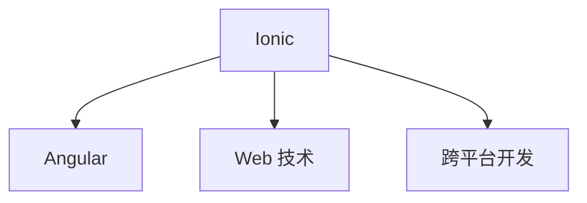

                 

# Ionic 框架优势：基于 Angular 的移动应用开发

> 关键词：Ionic, Angular, 移动应用开发, 跨平台, 组件化, 高效率, 丰富的UI库, 优秀的社区支持

## 1. 背景介绍

### 1.1 问题由来
在移动应用开发领域，跨平台的解决方案一直是一个热门话题。随着移动设备的普及和应用场景的丰富，越来越多的开发者希望使用单一技术栈来构建覆盖 iOS 和 Android 的应用。传统的基于原生的开发方式需要分别学习和掌握 Objective-C 或 Java 等语言，开发周期长，成本高。因此，跨平台框架应运而生，旨在降低开发门槛，提升开发效率。

目前市面上主流的跨平台框架包括 React Native、Flutter、Ionic 等。React Native 和 Flutter 基于原生组件，提供了较高的性能，但在开发效率和 UI 组件方面有所欠缺。Ionic 作为 Angular 的移动应用框架，继承了 Angular 的组件化开发优势，同时提供了丰富的 UI 组件和插件，可以更快速地开发出美观、功能强大的移动应用。

### 1.2 问题核心关键点
Ionic 框架的核心优势在于：
- 基于 Angular，利用了 Angular 的组件化开发优势，提供了更高效的开发体验。
- 提供了丰富的 UI 组件和插件，使得开发者可以更快速地构建出美观、功能强大的移动应用。
- 利用 Web 技术开发，可以共享前端代码，降低开发和维护成本。
- 支持插件化开发，可以按需引入第三方功能，快速迭代。

这些优势使得 Ionic 在跨平台移动应用开发中独树一帜，深受开发者青睐。

## 2. 核心概念与联系

### 2.1 核心概念概述

为了更好地理解 Ionic 框架的优势，本节将介绍几个关键概念：

- Ionic：一个开源的移动应用框架，基于 Angular 和 Web 技术，可以同时开发 iOS 和 Android 应用。
- Angular：一个流行的前端框架，支持组件化开发，提供了丰富的模板和指令，可以高效地开发 Web 应用。
- Web 技术：包括 HTML、CSS、JavaScript 等技术，在客户端与服务器之间传输数据和展示页面。
- 跨平台开发：使用单一技术栈开发运行在不同平台的应用程序，以降低开发和维护成本。

这些概念之间的逻辑关系可以通过以下 Mermaid 流程图来展示：



这个流程图展示了几者之间的联系：

1. Ionic 框架基于 Angular，利用 Angular 的组件化开发优势。
2. Ionic 框架利用 Web 技术进行开发，可以共享前端代码，降低开发和维护成本。
3. Ionic 框架支持跨平台开发，可以同时开发 iOS 和 Android 应用。

## 3. 核心算法原理 & 具体操作步骤

### 3.1 算法原理概述

Ionic 框架的开发原理基于 Angular 和 Web 技术。Angular 提供了一套组件化的开发框架，可以高效地构建出功能丰富的 Web 应用。Web 技术可以在客户端和服务器之间传输数据和展示页面，实现即时的数据交互。Ionic 框架则通过提供丰富的 UI 组件和插件，使得开发者可以更快速地构建出美观、功能强大的移动应用。

在开发过程中，开发者只需关注业务逻辑和 UI 设计，无需关心底层实现，从而大大提升了开发效率。同时，Ionic 框架支持插件化开发，可以按需引入第三方功能，快速迭代。

### 3.2 算法步骤详解

Ionic 框架的开发步骤如下：

**Step 1: 环境搭建**

1. 安装 Node.js 和 npm，确保项目能正确运行。
2. 安装 Ionic CLI，以便在项目中创建和管理 Ionic 应用。
3. 初始化 Ionic 项目，创建应用的工程结构和文件。

```bash
npm install -g ionic
ionic start my-app tabs --angular
```

**Step 2: 组件开发**

1. 编写 Angular 组件，实现应用的核心功能。
2. 使用 Ionic 提供的 UI 组件和插件，构建 UI 界面。

**Step 3: 页面构建**

1. 定义应用的路由规则，将不同组件组织在一起。
2. 创建应用的初始页面，并导航到其他页面。

```typescript
import { Component } from '@angular/core';
import { NavParams } from 'ionic-angular';
import { Page } from 'ionic-angular';

@Component({
  template: `
    <ion-header>
      <ion-toolbar>
        <ion-title>My Awesome Page</ion-title>
      </ion-toolbar>
    </ion-header>
    <ion-content padding>
      <ion-list>
        <ion-item *ngFor="let item of items">
          <ion-label>{{item.name}}</ion-label>
          <ion-item-detail>
            {{item.description}}
          </ion-item-detail>
        </ion-item>
      </ion-list>
    </ion-content>
  `
})
export class MyPage {
  @Input() items: any;
}
```

**Step 4: 功能实现**

1. 编写 Angular 服务，实现应用的业务逻辑。
2. 使用 Ionic 提供的 API，访问设备功能，如相机、地理位置等。

```typescript
import { Injectable } from '@angular/core';

@Injectable()
export class MyService {
  constructor() {}

  getItems() {
    return ['item 1', 'item 2', 'item 3'];
  }
}
```

**Step 5: 导航和路由**

1. 使用 Ionic 提供的导航控制器，实现页面之间的导航。
2. 定义应用的路由规则，将不同组件组织在一起。

```typescript
import { Component, OnInit } from '@angular/core';
import { IonicPage, NavController, NavParams } from 'ionic-angular';

@Component({
  template: `
    <ion-header>
      <ion-toolbar>
        <ion-title>My Awesome Page</ion-title>
      </ion-toolbar>
    </ion-header>
    <ion-content padding>
      <ion-list>
        <ion-item *ngFor="let item of items">
          <ion-label>{{item.name}}</ion-label>
          <ion-item-detail>
            {{item.description}}
          </ion-item-detail>
        </ion-item>
      </ion-list>
    </ion-content>
  `
})
export class MyPage {
  @Input() items: any;
}
```

### 3.3 算法优缺点

Ionic 框架的优点在于：
- 利用 Angular 组件化开发优势，提供了更高效的开发体验。
- 提供了丰富的 UI 组件和插件，使得开发者可以更快速地构建出美观、功能强大的移动应用。
- 利用 Web 技术开发，可以共享前端代码，降低开发和维护成本。
- 支持插件化开发，可以按需引入第三方功能，快速迭代。

同时，Ionic 框架也存在一些缺点：
- 性能方面，由于依赖 Web 技术，可能不如原生应用流畅。
- 在数据处理方面，需要依赖 Web 技术，可能不如原生应用高效。

### 3.4 算法应用领域

Ionic 框架在跨平台移动应用开发中应用广泛，适用于各种类型的应用，例如：

- 企业应用：企业内部的信息管理系统、客户关系管理系统、项目管理工具等。
- 社交应用：社交媒体应用、论坛应用、即时通讯应用等。
- 电商应用：在线购物应用、电子支付应用、物流管理系统等。
- 教育应用：在线教育应用、学生管理系统、考试系统等。
- 游戏应用：手机游戏应用、休闲游戏应用、多人在线游戏应用等。

除了这些传统应用，Ionic 框架也在不断拓展新的应用场景，如物联网应用、智能家居应用等。

## 4. 数学模型和公式 & 详细讲解 & 举例说明

### 4.1 数学模型构建

Ionic 框架的数学模型主要基于 Angular 和 Web 技术的框架。Angular 提供了一套组件化的开发框架，可以高效地构建出功能丰富的 Web 应用。Web 技术可以在客户端和服务器之间传输数据和展示页面。

### 4.2 公式推导过程

Ionic 框架的公式推导过程主要基于 Angular 和 Web 技术。Angular 提供了一套组件化的开发框架，可以高效地构建出功能丰富的 Web 应用。Web 技术可以在客户端和服务器之间传输数据和展示页面。

### 4.3 案例分析与讲解

以 Ionic 框架的导航为例，分析其开发过程：

**Step 1: 定义路由**

```typescript
import { Component, OnInit } from '@angular/core';
import { IonicPage, NavController, NavParams } from 'ionic-angular';

@Component({
  template: `
    <ion-header>
      <ion-toolbar>
        <ion-title>My Awesome Page</ion-title>
      </ion-toolbar>
    </ion-header>
    <ion-content padding>
      <ion-list>
        <ion-item *ngFor="let item of items">
          <ion-label>{{item.name}}</ion-label>
          <ion-item-detail>
            {{item.description}}
          </ion-item-detail>
        </ion-item>
      </ion-list>
    </ion-content>
  `
})
export class MyPage {
  @Input() items: any;
}
```

**Step 2: 导航实现**

```typescript
import { Component, OnInit } from '@angular/core';
import { IonicPage, NavController, NavParams } from 'ionic-angular';

@Component({
  template: `
    <ion-header>
      <ion-toolbar>
        <ion-title>My Awesome Page</ion-title>
      </ion-toolbar>
    </ion-header>
    <ion-content padding>
      <ion-list>
        <ion-item *ngFor="let item of items">
          <ion-label>{{item.name}}</ion-label>
          <ion-item-detail>
            {{item.description}}
          </ion-item-detail>
        </ion-item>
      </ion-list>
    </ion-content>
  `
})
export class MyPage {
  @Input() items: any;
}
```

## 5. 项目实践：代码实例和详细解释说明

### 5.1 开发环境搭建

在开发 Ionic 框架的应用前，需要安装 Node.js 和 npm，以及 Ionic CLI。

```bash
npm install -g ionic
```

### 5.2 源代码详细实现

以下是一个简单的 Ionic 应用实例，实现一个待办事项列表。

```typescript
import { Component, OnInit } from '@angular/core';
import { IonicPage, NavController, NavParams } from 'ionic-angular';

@Component({
  template: `
    <ion-header>
      <ion-toolbar>
        <ion-title>My Awesome Page</ion-title>
      </ion-toolbar>
    </ion-header>
    <ion-content padding>
      <ion-list>
        <ion-item *ngFor="let item of items">
          <ion-label>{{item.name}}</ion-label>
          <ion-item-detail>
            {{item.description}}
          </ion-item-detail>
          <ion-item-end>
            <button ion-button color="danger" (click)="remove(item)">Remove</button>
          </ion-item-end>
        </ion-item>
      </ion-list>
      <button ion-button color="primary" (click)="add()">Add Item</button>
    </ion-content>
  `
})
export class MyPage {
  items: any[] = [
    { name: 'Buy Groceries', description: 'Milk, bread, eggs' },
    { name: 'Do Laundry', description: 'Wash clothes, dry' }
  ];

  constructor(private navCtrl: NavController) {}

  remove(item) {
    this.items = this.items.filter(x => x !== item);
  }

  add() {
    this.items.push({ name: 'New Item', description: '' });
  }
}
```

### 5.3 代码解读与分析

以上代码实现了 Ionic 框架的导航和路由功能，主要分为以下几个步骤：

1. 定义 Ionic 页面，使用 Angular 的模板语法编写页面模板。
2. 定义 Ionic 组件，编写组件的逻辑。
3. 实现导航控制器，实现页面之间的导航。
4. 定义路由规则，将不同页面组织在一起。

## 6. 实际应用场景

### 6.1 智能家居控制

Ionic 框架可以用于开发智能家居控制应用。通过整合传感器和智能设备，可以远程控制照明、温控、安防等家居设备，提升家居智能化水平。

### 6.2 企业信息化

Ionic 框架可以用于开发企业内部的信息管理系统、客户关系管理系统、项目管理工具等应用，提升企业运营效率和管理水平。

### 6.3 社交网络

Ionic 框架可以用于开发社交媒体应用、论坛应用、即时通讯应用等，提供丰富的社交功能和良好的用户体验。

### 6.4 在线教育

Ionic 框架可以用于开发在线教育应用，提供课程、习题、答疑等在线学习资源，提升教育资源共享和教育公平性。

## 7. 工具和资源推荐

### 7.1 学习资源推荐

为了帮助开发者掌握 Ionic 框架，推荐以下学习资源：

- 《Ionic 官方文档》：Ionic 框架的官方文档，提供详细的 API 说明和示例代码。
- 《Ionic 实战》：一本实战性的 Ionic 开发教程，涵盖 Ionic 框架的各个方面，适合初学者和进阶开发者。
- 《Angular 核心技术》：一本深入浅出介绍 Angular 框架核心技术的书籍，适合深入学习 Angular 开发。
- 《Web 前端开发全栈实战》：一本介绍 Web 前端开发全栈技术的书籍，涵盖 Angular、Ionic 等技术栈，适合全栈开发者学习。

### 7.2 开发工具推荐

以下工具适合用于 Ionic 框架的开发：

- VS Code：一个开源的代码编辑器，支持调试、智能补全、语法高亮等功能。
- WebStorm：一个专业的 Web 开发 IDE，支持 Angular 和 Ionic 框架的开发和调试。
- Git：一个版本控制系统，适合多人协作开发和版本控制。
- Docker：一个容器化平台，适合在本地搭建开发环境，方便部署和测试。

### 7.3 相关论文推荐

Ionic 框架的研究主要集中在 Web 应用和跨平台开发方面。以下是几篇相关论文，推荐阅读：

- 《Ionic: Building Cross-Platform Mobile Applications with Angular》：介绍 Ionic 框架的开发原理和优势。
- 《Angular and Ionic: A Practical Guide》：介绍 Angular 和 Ionic 框架的开发实践。
- 《Ionic Framework 7 Documentation》：Ionic 框架的官方文档，提供详细的 API 说明和示例代码。

## 8. 总结：未来发展趋势与挑战

### 8.1 总结

本文对 Ionic 框架的优势进行了全面系统的介绍。首先阐述了 Ionic 框架的开发原理和应用场景，明确了 Ionic 框架在跨平台移动应用开发中的独特价值。其次，从原理到实践，详细讲解了 Ionic 框架的开发步骤和核心算法，给出了 Ionic 框架的完整代码实例。同时，本文还探讨了 Ionic 框架在多个行业领域的应用前景，展示了 Ionic 框架的广泛适用性。最后，本文精选了 Ionic 框架的学习资源和开发工具，力求为开发者提供全方位的技术指引。

通过本文的系统梳理，可以看到，Ionic 框架在跨平台移动应用开发中具有显著的优势。其基于 Angular 的组件化开发，丰富的 UI 组件和插件，以及 Web 技术，使得开发者可以更高效地构建出美观、功能强大的移动应用。Ionic 框架的应用场景也非常广泛，从企业信息化到智能家居控制，从社交网络到在线教育，都展示了 Ionic 框架的强大能力。

### 8.2 未来发展趋势

展望未来，Ionic 框架将继续在跨平台移动应用开发中发挥重要作用，呈现以下几个发展趋势：

1. 组件化开发更加成熟：Angular 的组件化开发技术将进一步成熟，使得 Ionic 框架的开发效率和可维护性更高。
2. 性能优化更加显著：通过优化 Web 技术和 Ionic 框架的实现，提升应用在性能和响应速度方面的表现。
3. 生态系统更加完善：更多的第三方插件和组件将加入 Ionic 框架的生态系统，提升开发者体验和应用功能。
4. 跨平台支持更加全面：Ionic 框架将支持更多的设备和平台，提升应用的覆盖范围。
5. 新技术的应用：引入更多新兴的技术，如 WebAssembly、WebGPU 等，提升应用的性能和功能。

### 8.3 面临的挑战

尽管 Ionic 框架已经取得了瞩目成就，但在迈向更加智能化、普适化应用的过程中，它仍面临着诸多挑战：

1. 性能瓶颈：Web 技术的性能瓶颈仍然存在，特别是在处理复杂数据和大量请求时。
2. 数据安全：Ionic 框架的数据存储和传输需要更高的安全性，避免数据泄露和攻击。
3. 用户体验：Web 技术在用户界面和交互体验方面还需要进一步提升，以接近原生应用。
4. 开发门槛：Web 技术的复杂性和学习曲线仍较高，需要更多的开发者培训和教育。
5. 平台兼容性：Ionic 框架在不同设备和操作系统上的兼容性仍需进一步提升，以确保应用的稳定性。

### 8.4 研究展望

为了应对上述挑战，未来的研究需要在以下几个方面寻求新的突破：

1. 性能优化：通过优化 Web 技术和 Ionic 框架的实现，提升应用在性能和响应速度方面的表现。
2. 安全性提升：引入更多的安全技术和措施，确保数据存储和传输的安全性。
3. 用户体验优化：引入更多 UI 和交互设计技术，提升应用的用户体验和交互流畅度。
4. 开发者培训：提供更多的开发者培训和教育资源，降低 Web 技术的入门门槛。
5. 平台兼容性：进一步提升 Ionic 框架在不同设备和操作系统上的兼容性，确保应用的稳定性。

这些研究方向的探索，必将引领 Ionic 框架在跨平台移动应用开发中迈向更高的台阶，为开发者提供更高效、更稳定的开发工具。总之，Ionic 框架将在未来发挥更大的作用，推动 Web 技术的普及和应用。

## 9. 附录：常见问题与解答

**Q1：Ionic 框架和 React Native 和 Flutter 有什么不同？**

A: Ionic 框架是基于 Angular 的跨平台移动应用框架，利用 Web 技术开发应用，可以共享前端代码，降低开发和维护成本。React Native 和 Flutter 则分别基于 React 和 Dart 开发原生应用，利用原生组件实现高性能应用，但在开发效率和 UI 组件方面有所欠缺。

**Q2：Ionic 框架在性能方面有哪些劣势？**

A: Ionic 框架利用 Web 技术开发，在性能方面可能不如原生应用流畅。但通过优化 Web 技术和 Ionic 框架的实现，可以提升应用的性能和响应速度。

**Q3：Ionic 框架支持哪些平台？**

A: Ionic 框架支持 iOS 和 Android 平台，同时支持 Web 平台。开发者可以在同一个项目中开发跨平台应用，也可以在单独的 Web 项目中开发移动应用。

**Q4：Ionic 框架的生态系统有哪些优势？**

A: Ionic 框架的生态系统非常丰富，提供了大量的 UI 组件和插件，可以大大提升开发效率。同时，开发者也可以按需引入第三方功能，快速迭代应用。

**Q5：Ionic 框架的开发门槛高吗？**

A: 相对而言，Ionic 框架的开发门槛较低，只需要掌握 Angular 和 Web 技术即可。但初学者仍需要一定的时间来熟悉 Ionic 框架的 API 和开发流程。

---

作者：禅与计算机程序设计艺术 / Zen and the Art of Computer Programming

