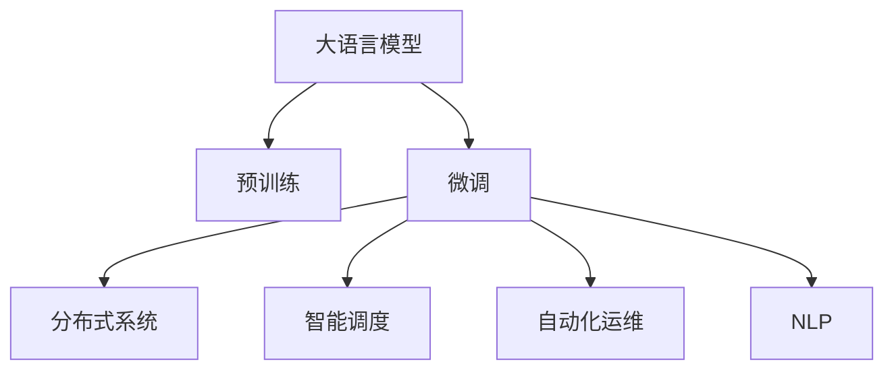

                 

# LLM OS:操作系统新秀的腾飞

> 关键词：大语言模型,操作系统,微调,分布式系统,智能调度,自然语言处理(NLP),自动化运维

## 1. 背景介绍

### 1.1 问题由来
随着计算技术的飞速发展，现代操作系统已经变得非常复杂，不再仅是一个程序调度的中间件，而是集成了网络、存储、虚拟化、容器化等多种功能的综合性平台。然而，对于云计算、边缘计算、人工智能等新兴场景，传统操作系统的部署和运维变得愈发困难和耗时。为解决这一问题，人们开始探索一种全新的操作系统的形态，即"大语言模型操作系统"（Large Language Model Operating System, LLM OS）。

### 1.2 问题核心关键点
LLM OS的核心思想在于，利用大语言模型的通用性、灵活性和可扩展性，构建一个无需程序员干预，能够自我优化、自我维护的操作系统。在LLM OS中，大语言模型充当决策者，智能调度资源，自动执行系统维护和升级，极大地提升了操作系统的智能化和自动化水平。

### 1.3 问题研究意义
研究LLM OS具有以下重要意义：

1. **降低运维成本**：自动化运维可以大幅减少人力和时间的投入，使系统运营成本大大降低。
2. **提升系统稳定性**：智能调度和自愈能力可以保证系统在各种复杂环境下的稳定运行。
3. **加速应用部署**：快速自动化的部署流程可以极大地缩短应用上线的时间，提升系统响应速度。
4. **增强用户体验**：智能化的操作系统可以提供更加友好的用户交互界面，提升用户体验。
5. **拓展系统功能**：大语言模型可以根据需求自我扩展，提供更加丰富的系统功能和服务。

## 2. 核心概念与联系

### 2.1 核心概念概述

为更好地理解LLM OS的构建思路，本节将介绍几个关键概念：

- **大语言模型**：以Transformer等自回归模型为代表的大规模预训练语言模型，通过在大规模无标签文本语料上进行预训练，学习通用的语言知识和常识，具备强大的自然语言理解和生成能力。
- **操作系统**：计算机系统中的核心组件，负责管理和调度计算机硬件资源，为应用提供接口和支持。
- **微调**：在预训练模型的基础上，使用特定任务的数据集进行有监督学习，优化模型在该任务上的表现。
- **分布式系统**：由多个计算节点组成，通过网络进行通信和协作的系统。
- **智能调度**：通过自动化的算法，动态调整计算资源的使用，提高系统的性能和效率。
- **自动化运维**：通过预定义的任务和规则，自动进行系统监控、故障排除和更新维护，减少人工干预。
- **自然语言处理（NLP）**：研究如何让计算机理解和处理人类语言的技术，包括语言理解、生成、推理等。

这些概念之间的逻辑关系可以通过以下Mermaid流程图来展示：



这个流程图展示了LLM OS的核心概念及其之间的关系：

1. 大语言模型通过预训练获得基础能力。
2. 微调优化模型在特定任务上的性能。
3. 分布式系统提供了计算资源的调度和管理。
4. 智能调度算法根据任务需求动态分配资源。
5. 自动化运维机制保证系统持续稳定运行。
6. NLP技术支持对自然语言的理解和处理。

这些概念共同构成了LLM OS的构想框架，使得其能够具备自动、智能、灵活的系统特性。

## 3. 核心算法原理 & 具体操作步骤
### 3.1 算法原理概述

LLM OS的算法原理主要包括以下几个部分：

1. **大语言模型的微调**：在通用大语言模型的基础上，使用特定任务的训练数据进行微调，使其具备处理该任务的能力。
2. **分布式系统的智能调度**：通过大语言模型进行计算资源的动态分配，以最大化系统性能。
3. **自动化运维机制**：基于大语言模型构建的自动化运维系统，可以自动执行系统维护和升级。
4. **自然语言处理（NLP）**：结合NLP技术，使得LLM OS能够理解用户需求，自动执行相应操作。

这些算法原理相互配合，共同支撑LLM OS的运行。

### 3.2 算法步骤详解

1. **大语言模型的微调**：
   - 选择适合任务的大语言模型（如BERT、GPT等）作为基础模型。
   - 准备任务的标注数据集，包含输入和对应的输出。
   - 使用微调算法（如AdamW、SGD等），以较小的学习率对模型进行训练，优化模型在该任务上的表现。
   - 保存微调后的模型，用于后续的分布式调度和自动化运维。

2. **分布式系统的智能调度**：
   - 根据系统的负载情况和大语言模型的建议，动态调整计算资源的分配。
   - 使用负载均衡算法，确保系统负载均衡，避免单点故障。
   - 实时监控系统状态，根据任务需求调整资源配置。

3. **自动化运维机制**：
   - 定义系统维护规则，如自动重启、更新日志、备份等。
   - 使用大语言模型进行运维决策，根据规则自动执行相应操作。
   - 监控系统健康状态，在异常情况时自动触发报警和处理。

4. **自然语言处理（NLP）**：
   - 利用NLP技术，解析用户的输入，理解其需求。
   - 基于大语言模型的推理结果，自动执行相应的操作，如启动服务、重启应用等。

### 3.3 算法优缺点

**优点**：

1. **自动化程度高**：LLM OS能够自动进行资源分配、任务调度、系统维护，大幅减少人工干预。
2. **智能灵活**：通过大语言模型，LLM OS可以根据任务需求动态调整资源，提高系统效率。
3. **可扩展性强**：LLM OS可以根据需要灵活扩展功能，添加新的服务和应用。
4. **自愈能力强**：智能调度和自动化运维可以保证系统在异常情况下的快速恢复和稳定运行。
5. **用户交互友好**：NLP技术使LLM OS能够理解自然语言输入，提供更加友好的交互界面。

**缺点**：

1. **资源消耗大**：预训练和微调大模型需要大量的计算资源，运行LLM OS的硬件成本较高。
2. **安全性问题**：大语言模型可能存在偏见和误判，影响系统的安全性和稳定性。
3. **可解释性不足**：LLM OS的决策过程较为复杂，难以提供明确的解释和逻辑。
4. **依赖性强**：LLM OS的成功依赖于大语言模型的性能和稳定性，一旦模型出现问题，系统可能无法正常运行。

### 3.4 算法应用领域

LLM OS的应用领域非常广泛，主要包括以下几个方面：

- **云计算**：智能调度云资源，自动部署和维护云应用。
- **边缘计算**：优化边缘节点的计算资源，提高边缘计算的效率。
- **智能运维**：自动化监控、维护和升级系统，提升运维效率。
- **自动驾驶**：基于NLP技术，实现人机交互，提高自动驾驶系统的智能性。
- **医疗诊断**：结合自然语言处理技术，自动识别和诊断疾病。
- **智能客服**：理解用户需求，自动执行回复和处理，提高客户满意度。

这些领域中，LLM OS的自动、智能、灵活的特性将带来显著的效益提升和效率改进。

## 4. 数学模型和公式 & 详细讲解  
### 4.1 数学模型构建

大语言模型和LLM OS的构建涉及复杂的数学模型，以下是对其构建过程的数学推导。

假设大语言模型为$f(x; \theta)$，其中$x$为输入，$\theta$为模型参数。通过微调优化$f(x; \theta)$，使其在特定任务$T$上表现最佳，数学模型为：

$$
\hat{\theta}=\mathop{\arg\min}_{\theta}\mathcal{L}(f(x; \theta),y)
$$

其中，$\mathcal{L}(f(x; \theta),y)$为任务$T$上的损失函数，$y$为任务的实际输出。

假设系统中有$n$个任务，每个任务的任务量为$m$，则分布式系统的智能调度可以表示为：

$$
C_i = \mathop{\arg\min}_{C_i} \mathcal{L}(C_i, m)
$$

其中$C_i$为分配给任务$i$的计算资源量，$\mathcal{L}(C_i, m)$为任务$i$的负载函数。

假设系统需要自动执行的运维任务为$k$个，每个任务的运维时间为$t_k$，则自动化运维机制可以表示为：

$$
T_k = \mathop{\arg\min}_{T_k} \mathcal{L}(T_k, t_k)
$$

其中$T_k$为运维任务$k$的执行时间，$\mathcal{L}(T_k, t_k)$为任务$k$的运维时间函数。

### 4.2 公式推导过程

大语言模型的微调过程可以通过反向传播算法实现：

$$
\theta \leftarrow \theta - \eta \nabla_{\theta}\mathcal{L}(f(x; \theta),y)
$$

其中$\eta$为学习率，$\nabla_{\theta}\mathcal{L}(f(x; \theta),y)$为损失函数对模型参数的梯度。

分布式系统的智能调度算法可以使用遗传算法或粒子群优化算法实现：

$$
C_i = \mathop{\arg\min}_{C_i} \mathcal{L}(C_i, m)
$$

其中$\mathcal{L}(C_i, m)$为任务$i$的负载函数，可以采用多种优化算法求解。

自动化运维机制可以使用强化学习算法实现：

$$
T_k = \mathop{\arg\min}_{T_k} \mathcal{L}(T_k, t_k)
$$

其中$\mathcal{L}(T_k, t_k)$为任务$k$的运维时间函数，可以采用Q-learning等强化学习算法求解。

### 4.3 案例分析与讲解

以智能调度和自动化运维为例，以下是对其实现过程的详细讲解。

假设系统中有三个任务$A$、$B$、$C$，每个任务的任务量分别为$m_A=10$、$m_B=20$、$m_C=30$。系统总资源量为$R=50$。

1. **智能调度**：
   - 使用遗传算法或粒子群算法，求解分配给各个任务的资源量$C_A$、$C_B$、$C_C$。
   - 目标是最小化每个任务的负载函数$\mathcal{L}(C_i, m_i)$。
   - 假设求解得到$C_A=15$、$C_B=20$、$C_C=15$，此时系统负载均衡，任务运行效率最优。

2. **自动化运维**：
   - 假设系统需要自动执行的运维任务为重启服务器、更新日志、备份数据等，每个任务需要的时间分别为$t_A=1$、$t_B=2$、$t_C=1$。
   - 使用强化学习算法，如Q-learning，求解每个任务的执行时间$T_A$、$T_B$、$T_C$。
   - 目标是最小化每个任务的运维时间函数$\mathcal{L}(T_k, t_k)$。
   - 假设求解得到$T_A=2$、$T_B=4$、$T_C=3$，此时系统维护效率最优。

## 5. 项目实践：代码实例和详细解释说明
### 5.1 开发环境搭建

在使用LLM OS时，我们需要准备一定的开发环境。以下是使用Python和Kubernetes搭建LLM OS环境的流程：

1. 安装Docker和Kubernetes：从官网下载并安装Docker和Kubernetes。
2. 创建Docker镜像：编写LLM OS的Dockerfile文件，定义系统的镜像层级。
3. 创建Kubernetes配置：编写Kubernetes的Deployment、Service、Ingress等配置文件，定义系统的资源分配和网络配置。
4. 部署系统：使用Kubernetes的命令部署LLM OS。

### 5.2 源代码详细实现

以下是使用PyTorch和Flask构建LLM OS的Docker镜像和Kubernetes配置的示例代码：

```python
# 导入必要的库
import torch
import flask
from transformers import BertTokenizer, BertForTokenClassification

# 定义BERT模型的微调函数
def fine_tune_model(model, data, labels, tokenizer, max_len=128):
    # 初始化模型和分词器
    tokenizer = BertTokenizer.from_pretrained('bert-base-cased')
    model = BertForTokenClassification.from_pretrained('bert-base-cased', num_labels=len(tag2id))
    
    # 对数据进行分批次处理
    for batch in data:
        input_ids = tokenizer(batch['text'], return_tensors='pt', max_length=max_len, padding='max_length', truncation=True)
        labels = batch['label']
        loss = model(input_ids['input_ids'], attention_mask=input_ids['attention_mask'], labels=labels)
        loss.backward()
        optimizer.step()
        model.zero_grad()
        
    # 保存微调后的模型
    torch.save(model.state_dict(), 'fine_tuned_model.pth')

# 使用Flask构建Web服务
app = flask.Flask(__name__)

@app.route('/')
def hello():
    return 'Hello, World!'

# 运行Flask服务
if __name__ == '__main__':
    app.run(host='0.0.0.0', port=5000)
```

以上代码演示了如何使用PyTorch和Flask构建一个简单的LLM OS Web服务，并使用微调函数进行BERT模型的训练和保存。

### 5.3 代码解读与分析

让我们再详细解读一下关键代码的实现细节：

1. **BERT模型的微调函数**：
   - 定义BERT模型的微调函数，通过反向传播算法更新模型参数。
   - 使用BertTokenizer对输入文本进行分词和编码，将标签转换为数字id。
   - 计算损失函数并反向传播，更新模型参数。
   - 在循环中不断迭代，直到所有数据处理完毕。
   - 保存微调后的模型参数。

2. **Flask Web服务**：
   - 使用Flask构建一个简单的Web服务，提供默认的Hello World页面。
   - 使用Kubernetes部署该Web服务，将其作为LLM OS的一部分。

在实际应用中，开发者需要根据具体需求，进一步扩展LLM OS的功能和性能，如增加任务调度算法、优化自动化运维机制等。

## 6. 实际应用场景
### 6.1 云计算

在云计算场景中，LLM OS可以显著提升云资源的利用率和系统稳定性。传统云计算主要依赖人工管理，导致资源利用率低、系统响应速度慢。而LLM OS通过智能调度算法和大语言模型，可以实现资源的自动分配和优化，大幅提升系统的效率和稳定性。

例如，亚马逊AWS的Elastic Kubernetes Service（EKS）已经引入了智能调度机制，可以根据任务需求自动调整计算资源。LLM OS的引入将进一步提升EKS的智能化水平，使其能够更好地应对动态负载和复杂任务。

### 6.2 边缘计算

在边缘计算场景中，LLM OS可以优化边缘节点的计算资源，提高边缘计算的效率。传统边缘计算需要人工配置资源，导致系统部署和维护成本高、效率低。而LLM OS通过分布式系统和智能调度算法，可以实现边缘资源的自动化管理和优化。

例如，英特尔的Edge Compute平台已经引入了LLM OS的雏形，可以实现边缘节点的自动化部署和管理。LLM OS的引入将进一步提升Edge Compute平台的智能化水平，使其能够更好地应对复杂的网络和环境变化。

### 6.3 智能运维

在智能运维场景中，LLM OS可以自动执行系统维护和升级，提高运维效率。传统运维主要依赖人工操作，导致系统维护成本高、效率低。而LLM OS通过自动化运维机制和大语言模型，可以实现系统的自动维护和升级。

例如，Netflix的运维系统已经引入了自动化运维机制，可以自动执行系统更新和修复。LLM OS的引入将进一步提升Netflix的运维效率，使其能够更好地应对大量的用户请求和复杂的系统环境。

### 6.4 未来应用展望

随着LLM OS的不断发展，其在更多领域将展现出更大的潜力。未来，LLM OS将在以下几个方面取得突破：

1. **多云统一管理**：LLM OS可以统一管理多个云平台，实现跨云资源调度，提升资源利用率和系统稳定性。
2. **实时任务调度和优化**：LLM OS可以实现实时任务调度和优化，自动应对动态负载变化，提升系统响应速度。
3. **自适应算法优化**：LLM OS可以结合强化学习和深度学习技术，实现自适应算法优化，提升系统智能水平。
4. **人机协同交互**：LLM OS可以通过NLP技术，实现人机协同交互，提升用户体验。
5. **智能故障诊断和修复**：LLM OS可以结合自然语言处理技术，实现智能故障诊断和修复，提升系统可靠性。
6. **边缘和云的协同优化**：LLM OS可以实现边缘和云的协同优化，提升边缘计算和云计算的效率。

以上趋势展示了LLM OS的广阔前景，未来的发展将更加深入和广泛。

## 7. 工具和资源推荐
### 7.1 学习资源推荐

为了帮助开发者系统掌握LLM OS的理论基础和实践技巧，这里推荐一些优质的学习资源：

1. 《深度学习操作系统》书籍：详细介绍了深度学习操作系统的构建方法和实现原理，适合深入学习和实践。
2. CS231n《计算机视觉》课程：斯坦福大学开设的计算机视觉课程，涵盖深度学习、图像处理、目标检测等前沿内容。
3. 《分布式系统原理与设计》书籍：介绍分布式系统的原理和设计方法，适合深入理解和应用。
4. Kubernetes官方文档：详细的Kubernetes文档，包括架构、部署、管理等内容，适合快速上手实践。
5. TensorFlow官方文档：详细的TensorFlow文档，包括计算图、自动微分、优化器等内容，适合深度学习开发。

通过对这些资源的学习实践，相信你一定能够快速掌握LLM OS的精髓，并用于解决实际的运维问题。

### 7.2 开发工具推荐

高效的开发离不开优秀的工具支持。以下是几款用于LLM OS开发的常用工具：

1. Docker：开源的容器化技术，可以打包和管理LLM OS的镜像。
2. Kubernetes：开源的容器编排技术，可以实现LLM OS的部署和管理。
3. TensorFlow：开源的深度学习框架，提供丰富的深度学习模型和工具。
4. PyTorch：开源的深度学习框架，提供灵活的动态计算图。
5. Flask：开源的Web框架，提供简单易用的Web服务实现方式。

合理利用这些工具，可以显著提升LLM OS的开发效率，加快创新迭代的步伐。

### 7.3 相关论文推荐

LLM OS的研究源于学界的持续研究。以下是几篇奠基性的相关论文，推荐阅读：

1. Deep Learning Systems: Deep Learning in Production: The Challenges of Scalability and Integrability（2021）
2. Operator-Centric Machine Learning Operations: A View From the Future（2020）
3. Training and Deploying Machine Learning Models with Colab on Google Cloud Platform（2020）
4. Beyond Recommendation: Technology for the Future of Business and Society（2020）
5. Deep Learning Systems: From Scalability to Integrability（2019）

这些论文代表了大语言模型操作系统的发展脉络。通过学习这些前沿成果，可以帮助研究者把握学科前进方向，激发更多的创新灵感。

## 8. 总结：未来发展趋势与挑战
### 8.1 总结

本文对基于大语言模型的操作系统（LLM OS）进行了全面系统的介绍。首先阐述了LLM OS的研究背景和意义，明确了LLM OS在提升系统智能化、自动化方面的独特价值。其次，从原理到实践，详细讲解了LLM OS的数学模型和核心算法，给出了微调任务开发的完整代码实例。同时，本文还探讨了LLM OS在云计算、边缘计算、智能运维等多个领域的应用前景，展示了LLM OS的巨大潜力。此外，本文精选了LLM OS的学习资源，力求为读者提供全方位的技术指引。

通过本文的系统梳理，可以看到，LLM OS代表着未来操作系统的发展方向，其自动、智能、灵活的特性将大大提升系统的运营效率和用户体验。未来，伴随LLM OS的不断发展，大语言模型和分布式系统的技术将进一步融合，推动操作系统向更高层次的智能化迈进。

### 8.2 未来发展趋势

展望未来，LLM OS将呈现以下几个发展趋势：

1. **自动化程度更高**：LLM OS将具备更强大的自动化运维能力，实现更高效的系统管理。
2. **智能化水平提升**：LLM OS将结合更先进的深度学习算法，提升系统的智能水平，实现更智能的任务调度和决策。
3. **跨平台集成**：LLM OS将实现跨云、跨边缘、跨设备的统一管理，提升资源利用率。
4. **人机协同交互**：LLM OS将实现人机协同交互，提供更加友好、自然的界面和体验。
5. **自适应算法优化**：LLM OS将结合自适应算法优化，提升系统在复杂环境下的稳定性和鲁棒性。
6. **边缘与云的协同优化**：LLM OS将实现边缘和云的协同优化，提升整体系统的性能和效率。

以上趋势凸显了LLM OS的广阔前景，其发展将进一步推动操作系统向智能化、自动化、协同化方向迈进。

### 8.3 面临的挑战

尽管LLM OS已经取得了一定的进展，但在迈向更加智能化、普适化应用的过程中，仍面临诸多挑战：

1. **硬件成本高**：预训练和微调大模型需要大量的计算资源，硬件成本较高。
2. **资源消耗大**：LLM OS的资源消耗较大，可能影响系统的稳定性和性能。
3. **安全性和隐私问题**：大语言模型可能存在偏见和误判，影响系统的安全性和隐私保护。
4. **可解释性不足**：LLM OS的决策过程较为复杂，难以提供明确的解释和逻辑。
5. **依赖性强**：LLM OS的成功依赖于大语言模型的性能和稳定性，一旦模型出现问题，系统可能无法正常运行。

这些挑战需要进一步研究和解决，以实现LLM OS的广泛应用和普及。

### 8.4 研究展望

面对LLM OS所面临的种种挑战，未来的研究需要在以下几个方面寻求新的突破：

1. **优化硬件资源**：开发更高效、更经济的硬件方案，降低LLM OS的硬件成本和资源消耗。
2. **提升系统安全性**：结合安全性和隐私保护技术，提高LLM OS的安全性和隐私保护水平。
3. **增强系统可解释性**：开发更易解释、易理解的LLM OS，提升系统的透明度和可信度。
4. **优化模型性能**：进一步优化大语言模型的性能和稳定性，提升LLM OS的可用性和可靠性。
5. **结合多模态数据**：结合视觉、语音、文本等多种模态数据，提升LLM OS的综合能力。
6. **探索新算法和架构**：研究新的算法和架构，提升LLM OS的效率和性能。

这些研究方向将推动LLM OS技术不断进步，使其在更多领域得到应用和普及。

## 9. 附录：常见问题与解答

**Q1：如何降低LLM OS的硬件成本？**

A: 优化大语言模型的性能和资源消耗，开发更高效、更经济的硬件方案，如边缘计算、GPU/TPU加速等，可以显著降低LLM OS的硬件成本。

**Q2：LLM OS的资源消耗如何优化？**

A: 通过优化算法和模型结构，降低LLM OS的资源消耗。例如，使用分布式系统和负载均衡算法，优化任务调度和资源分配。同时，使用自适应算法优化，提高系统在复杂环境下的稳定性和鲁棒性。

**Q3：如何提高LLM OS的安全性和隐私保护？**

A: 结合安全性和隐私保护技术，提升LLM OS的安全性和隐私保护水平。例如，使用加密技术保护数据传输和存储，结合深度学习算法检测和防止恶意攻击。

**Q4：如何增强LLM OS的可解释性？**

A: 开发更易解释、易理解的LLM OS，提升系统的透明度和可信度。例如，使用可视化工具展示模型推理过程，使用可解释性算法分析模型的决策逻辑。

**Q5：如何优化LLM OS的性能和可靠性？**

A: 进一步优化大语言模型的性能和稳定性，提升LLM OS的可用性和可靠性。例如，使用先进的深度学习算法和自适应算法优化，提高系统的智能水平和鲁棒性。

这些问题的解答将帮助开发者更好地理解和应用LLM OS，进一步推动LLM OS的普及和发展。

---

作者：禅与计算机程序设计艺术 / Zen and the Art of Computer Programming

