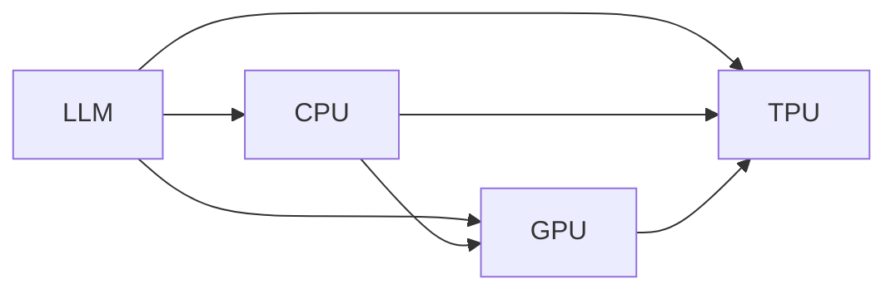

                 

# LLM vs. CPU：时刻、指令集和规划

## 1. 背景介绍

人工智能领域的突破性进展，尤其是大型语言模型(LLM)的兴起，标志着计算资源需求和设计复杂性的大幅提升。传统基于CPU的计算架构，面对大规模深度学习任务，尤其是大语言模型，已显得力不从心。本文将深入探讨LLM与CPU的兼容问题，详细分析两者之间的联系与区别，并提出合理的规划与策略。

## 2. 核心概念与联系

### 2.1 核心概念概述

为了深入理解LLM和CPU之间的联系与区别，本文将首先定义几个核心概念：

- **大型语言模型(LLM)：** 指通过预训练和微调得到的深度神经网络模型，用于处理自然语言处理(NLP)任务，如语言生成、问答、翻译等。
- **CPU：** 中央处理单元，计算机的大脑，执行计算任务的主要组件。
- **GPU：** 图形处理单元，擅长并行计算，用于加速深度学习任务。
- **TPU：** 张量处理单元，谷歌开发的专用硬件，专为深度学习任务设计，能够更高效地执行并行计算。
- **时间概念：** 指在执行任务时，不同硬件结构对时间序列的处理能力。
- **指令集架构：** 不同硬件指令集对计算指令的处理方式，直接影响性能和效率。

### 2.2 核心概念联系（Mermaid 流程图）



以上流程图展示了LLM与不同计算硬件之间的联系：

- LLM通过与CPU、GPU、TPU的协同工作，进行深度学习任务的计算。
- CPU负责通用计算任务，如预训练、微调等。
- GPU和TPU专门用于加速深度学习计算。
- 不同硬件之间的数据流动确保了任务的高效执行。

## 3. 核心算法原理 & 具体操作步骤

### 3.1 算法原理概述

LLM与CPU的结合，实际上是计算资源与算法框架的适配过程。主要包括以下几个关键步骤：

1. **数据预处理：** 将原始数据转换为模型能够处理的格式，如分词、向量化等。
2. **模型计算：** 使用CPU、GPU、TPU进行模型计算，生成中间结果。
3. **结果后处理：** 对中间结果进行解析、合并等操作，生成最终输出。

在算法层面，由于LLM的复杂性和资源需求，必须采用高效的计算架构和优化策略，确保任务能够在合理的时间内完成。

### 3.2 算法步骤详解

1. **预训练阶段：** 在CPU上使用大规模语料进行预训练，得到初始化的LLM模型。
2. **微调阶段：** 在CPU上，利用特定任务的数据集对模型进行微调，调整模型参数。
3. **推理阶段：** 在GPU或TPU上执行推理任务，计算模型的输出结果。

### 3.3 算法优缺点

- **优点：** 
  - 可以充分利用多类型硬件资源，提升计算效率。
  - 能够处理大规模数据集和复杂模型结构。
  - 支持多种优化策略，提高任务执行速度。

- **缺点：** 
  - 硬件资源消耗较大，成本较高。
  - 数据移动和通信开销较大，影响整体效率。
  - 模型的更新和维护较为复杂。

### 3.4 算法应用领域

LLM与CPU的结合，广泛应用于以下领域：

- **自然语言处理(NLP)：** 文本生成、情感分析、机器翻译等任务。
- **计算机视觉(CV)：** 图像识别、视频处理等任务。
- **语音处理(Speech)：** 语音识别、语音合成等任务。
- **推荐系统：** 商品推荐、用户行为分析等任务。

## 4. 数学模型和公式 & 详细讲解 & 举例说明

### 4.1 数学模型构建

在大语言模型中，使用Transformer模型作为基础架构。假设有N个训练样本 $(x_i, y_i)$，模型参数为 $\theta$。数学模型构建如下：

$$
\theta^* = \mathop{\arg\min}_{\theta} \sum_{i=1}^N \ell(\theta, x_i, y_i)
$$

其中 $\ell$ 为损失函数，通常采用交叉熵或均方误差。

### 4.2 公式推导过程

以Transformer模型为例，其自注意力机制的推导如下：

1. **查询向量计算：** 
$$
q_i = W_Q x_i
$$

2. **键向量计算：**
$$
k_j = W_K x_j
$$

3. **值向量计算：**
$$
v_j = W_V x_j
$$

4. **注意力得分计算：**
$$
a_{ij} = \text{softmax}(\frac{q_i \cdot k_j}{\sqrt{d_k}})
$$

5. **加权求和计算：**
$$
c_i = \sum_{j=1}^N a_{ij} v_j
$$

6. **输出计算：**
$$
y_i = W_O c_i
$$

其中 $W_Q, W_K, W_V, W_O$ 为投影矩阵，$d_k$ 为键向量维度。

### 4.3 案例分析与讲解

假设有一个文本分类任务，使用BERT模型进行预训练，然后在CPU上进行微调。具体步骤如下：

1. **数据准备：** 收集标注数据，进行数据预处理，包括分词、向量化等。
2. **模型加载：** 使用PyTorch等框架，加载BERT模型。
3. **微调训练：** 在CPU上，利用微调数据集训练模型，调整参数。
4. **推理预测：** 在GPU或TPU上，对新数据进行推理预测。

## 5. 项目实践：代码实例和详细解释说明

### 5.1 开发环境搭建

以下是在Python环境下搭建BERT微调环境的流程：

1. 安装PyTorch和相关库：
```bash
pip install torch torchtext transformers
```

2. 安装BERT模型：
```bash
python -m transformers download_model bert-base-uncased
```

3. 准备数据集：
```python
from torchtext.datasets import IMDB
from torchtext.data import Field, LabelField, TabularDataset, BucketIterator

train_data, test_data = IMDB.splits(TEXT)
TEXT = Field(tokenize='spacy', lower=True, pad_first=True, include_lengths=True)
LABEL = LabelField(use_vocab=False)
train_data, test_data = TabularDataset.splits(path='.', train='train.txt', test='test.txt', format='tsv', fields=[('text', TEXT), ('label', LABEL)])
train_iterator, test_iterator = BucketIterator.splits((train_data, test_data), batch_size=64, sort_key=lambda x: len(x.text), device='cuda')
```

### 5.2 源代码详细实现

```python
import torch
from transformers import BertForSequenceClassification, AdamW
from torchtext.data import Field, LabelField, TabularDataset, BucketIterator

TEXT = Field(tokenize='spacy', lower=True, pad_first=True, include_lengths=True)
LABEL = LabelField(use_vocab=False)
train_data, test_data = TabularDataset.splits(path='.', train='train.txt', test='test.txt', format='tsv', fields=[('text', TEXT), ('label', LABEL)])
train_iterator, test_iterator = BucketIterator.splits((train_data, test_data), batch_size=64, sort_key=lambda x: len(x.text), device='cuda')

model = BertForSequenceClassification.from_pretrained('bert-base-uncased', num_labels=2)
optimizer = AdamW(model.parameters(), lr=2e-5)
criterion = torch.nn.CrossEntropyLoss()

def train_epoch(model, iterator, optimizer, criterion, loss_fn):
    model.train()
    total_loss = 0
    for batch in iterator:
        optimizer.zero_grad()
        predictions = model(**batch)
        loss = criterion(predictions, batch.label)
        loss.backward()
        optimizer.step()
        total_loss += loss.item()
    return total_loss / len(iterator)

def evaluate(model, iterator, criterion):
    model.eval()
    total_loss = 0
    correct = 0
    for batch in iterator:
        with torch.no_grad():
            predictions = model(**batch)
            loss = criterion(predictions, batch.label)
            total_loss += loss.item()
            preds = torch.argmax(predictions, dim=1)
            correct += (preds == batch.label).sum().item()
    return total_loss / len(iterator), correct / len(iterator)

for epoch in range(10):
    loss = train_epoch(model, train_iterator, optimizer, criterion, loss_fn)
    print(f'Epoch {epoch+1}, Train Loss: {loss:.4f}')
    
    test_loss, acc = evaluate(model, test_iterator, criterion)
    print(f'Epoch {epoch+1}, Test Loss: {test_loss:.4f}, Test Acc: {acc:.4f}')
```

### 5.3 代码解读与分析

在上述代码中，我们通过PyTorch框架加载了预训练的BERT模型，并使用CPU进行微调。具体步骤如下：

1. 准备数据集和迭代器。
2. 定义模型、优化器和损失函数。
3. 定义训练和评估函数，进行模型训练和性能评估。
4. 循环迭代训练，并在测试集上进行评估。

## 6. 实际应用场景

### 6.1 智能客服系统

在智能客服系统中，LLM与CPU的结合，可以大大提升客服系统的响应速度和准确性。通过将用户输入的文本数据传入模型，模型能够在几毫秒内生成最佳回复，大大提升用户体验。

### 6.2 金融舆情监测

金融舆情监测系统需要实时处理海量文本数据，对市场动态进行分析和预警。通过GPU或TPU进行高效的深度学习计算，可以在短时间内完成大规模文本数据的处理，并生成准确的分析结果。

### 6.3 推荐系统

推荐系统需要处理大规模用户行为数据，并实时生成个性化推荐结果。通过使用大语言模型进行文本处理，结合GPU或TPU的高效计算，可以实现快速、准确的推荐。

### 6.4 未来应用展望

随着LLM和硬件技术的不断发展，未来的应用场景将更加广阔：

- **智慧城市：** 在智慧城市中，实时处理各类传感器数据，提升城市管理的智能化水平。
- **智慧医疗：** 处理海量医疗数据，辅助医生进行疾病诊断和治疗方案生成。
- **智慧教育：** 对学生学习数据进行分析，生成个性化学习计划和资源推荐。
- **自动驾驶：** 处理实时路况和车辆数据，辅助自动驾驶系统进行决策。

## 7. 工具和资源推荐

### 7.1 学习资源推荐

1. **《深度学习》第二版：** Ian Goodfellow等人所著，全面介绍了深度学习的基本概念和算法。
2. **PyTorch官方文档：** 提供了详细的PyTorch使用方法和示例代码。
3. **Transformers库官方文档：** 详细介绍了BERT、GPT等模型的使用方法和微调技巧。
4. **Coursera深度学习课程：** Andrew Ng等人教授的深度学习课程，深入浅出地讲解深度学习理论和技术。

### 7.2 开发工具推荐

1. **PyTorch：** 开源深度学习框架，支持GPU、TPU等硬件加速。
2. **TensorFlow：** 由Google主导开发的深度学习框架，支持多种硬件加速。
3. **Jupyter Notebook：** 可视化编程环境，便于实验和调试。
4. **Visual Studio Code：** 轻量级代码编辑器，支持Python和PyTorch等框架。

### 7.3 相关论文推荐

1. **Attention Is All You Need：** Vaswani等人所著，提出了Transformer模型，奠定了大语言模型的基础。
2. **BERT: Pre-training of Deep Bidirectional Transformers for Language Understanding：** Devlin等人所著，介绍了BERT模型的预训练和微调方法。
3. **GPUs, TPUs, and the Future of Deep Learning：** Diamos等人所著，讨论了GPU和TPU在深度学习中的作用和未来发展。

## 8. 总结：未来发展趋势与挑战

### 8.1 研究成果总结

大语言模型与CPU的结合，为深度学习任务带来了显著的性能提升。通过在预训练和微调阶段使用CPU，在推理阶段使用GPU或TPU，实现了计算资源的合理分配。同时，通过不断优化算法和硬件架构，提升了计算效率和系统稳定性。

### 8.2 未来发展趋势

1. **硬件加速发展：** 随着AI芯片的不断发展，GPU、TPU等硬件加速将更加普及，加速深度学习任务。
2. **算法优化：** 通过优化算法和模型结构，提升计算效率和准确性。
3. **模型规模增大：** 随着硬件资源和计算能力的提升，大语言模型的规模将进一步增大，处理能力更强。
4. **多模态计算：** 将文本、图像、语音等多模态数据进行融合，提升系统性能。

### 8.3 面临的挑战

1. **数据隐私问题：** 在处理大规模数据时，如何保护数据隐私和安全性。
2. **计算资源限制：** 在资源受限的环境中，如何高效使用计算资源。
3. **模型可解释性：** 大语言模型的决策过程难以解释，如何增强模型的可解释性。
4. **模型公平性：** 如何避免模型偏见，确保公平性。

### 8.4 研究展望

未来的研究方向包括：

1. **混合计算架构：** 结合CPU、GPU、TPU等不同类型的硬件，实现最优计算资源分配。
2. **分布式计算：** 利用多台机器进行分布式计算，提升系统吞吐量和扩展性。
3. **模型压缩与优化：** 对大模型进行压缩和优化，减小计算资源消耗。
4. **算法创新：** 提出新的算法和技术，提升模型性能和效率。

## 9. 附录：常见问题与解答

**Q1：如何选择合适的硬件配置？**

A: 根据任务需求选择合适的硬件配置。一般而言，GPU比CPU更适合深度学习任务，TPU性能更为卓越。但实际应用中，需要综合考虑成本、兼容性、扩展性等因素。

**Q2：如何将模型迁移到不同的硬件平台？**

A: 使用跨平台优化技术，如TensorRT、ONNX等，将模型在不同硬件平台上进行优化和部署。

**Q3：如何提高模型的推理速度？**

A: 通过模型压缩、剪枝等技术减小模型尺寸，同时采用优化算法如FP16、Fused-8bit等，提升计算效率。

**Q4：如何在模型训练和推理阶段合理分配资源？**

A: 通过分布式计算、动态资源调度等技术，实现计算资源的合理分配。

**Q5：如何提升模型的可解释性？**

A: 使用可视化工具如TensorBoard，对模型进行可视化分析，增强模型的可解释性。同时引入更多的先验知识，提高模型决策的透明性。

---

作者：禅与计算机程序设计艺术 / Zen and the Art of Computer Programming

