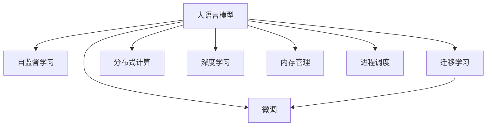

                 

# LLM 操作系统：与传统操作系统的比较

> 关键词：大语言模型(Large Language Model, LLM), 操作系统, 神经网络, 机器学习, 自然语言处理(NLP), 智能决策, 分布式计算, 数据管理

## 1. 背景介绍

### 1.1 问题由来
在传统计算机系统中，操作系统是软件与硬件之间的桥梁，负责资源管理、进程调度、内存管理、文件系统等核心功能。然而，随着计算领域的发展，传统操作系统已经难以满足日益增长的计算和存储需求，更无法应对复杂的数据处理和智能决策任务。

人工智能的崛起，特别是深度学习技术和大语言模型(Large Language Model, LLM)的崛起，为解决这些挑战提供了新的解决方案。LLM能够理解自然语言，进行复杂的推理和生成任务，拥有庞大的数据处理能力。将这些能力集成到操作系统中，即所谓的LLM操作系统，将成为未来计算系统的重要组成部分。

### 1.2 问题核心关键点
本节将探讨LLM操作系统与传统操作系统的关键差异，及其潜在影响。

- 资源管理：传统操作系统主要面向批处理任务，对资源进行静态分配和管理。而LLM操作系统需要动态调整资源，以支持模型训练和推理。
- 任务调度：传统操作系统采用基于时间的抢占式调度策略，难以应对随机性和复杂性的处理需求。而LLM操作系统采用基于模型的智能调度策略，更适合处理具有不确定性和多样性的任务。
- 数据管理：传统操作系统采用结构化数据模型，难以处理非结构化文本数据。而LLM操作系统能够高效处理大量文本数据，并进行实时分析。
- 智能决策：传统操作系统依赖固定的规则和算法，难以进行动态学习和自我优化。而LLM操作系统能够通过学习不断改进其决策能力。
- 分布式计算：传统操作系统虽然支持分布式计算，但仍然基于静态调度。而LLM操作系统能够动态调整任务分布，实现更高的资源利用效率。

这些差异反映了LLM操作系统在资源管理、任务调度、数据管理、智能决策和分布式计算等各个方面，都具备独特的优势。

## 2. 核心概念与联系

### 2.1 核心概念概述

为更好地理解LLM操作系统的原理和优势，本节将介绍几个密切相关的核心概念：

- 大语言模型(Large Language Model, LLM)：以自回归(如GPT)或自编码(如BERT)模型为代表的大规模预训练语言模型。通过在大规模无标签文本语料上进行预训练，学习通用的语言表示，具备强大的语言理解和生成能力。

- 自监督学习(Self-Supervised Learning)：在大规模无标签数据上进行监督式的预训练，利用数据自身的内在结构进行学习。

- 迁移学习(Transfer Learning)：将一个领域学习到的知识，迁移应用到另一个不同但相关的领域的学习范式。大语言模型预训练可以看作一种迁移学习方式。

- 微调(Fine-Tuning)：指在预训练模型的基础上，使用下游任务的少量标注数据，通过有监督地训练来优化模型在特定任务上的性能。通常只需要调整顶层分类器或解码器，并以较小的学习率更新全部或部分的模型参数。

- 分布式计算(Distributed Computing)：将计算任务分解成多个子任务，由多台计算机协同完成的一种计算模式。

- 深度学习(Deep Learning)：一种基于多层神经网络的机器学习范式，特别适用于复杂的数据处理和模式识别任务。

- 内存管理(Memory Management)：操作系统中的关键功能，负责分配和管理计算过程中所需的临时存储空间。

- 进程调度(Process Scheduling)：操作系统管理计算资源的关键机制，负责合理分配CPU时间片，以提高系统效率。

这些核心概念之间的逻辑关系可以通过以下Mermaid流程图来展示：



这个流程图展示了大语言模型的核心概念及其之间的关系：

1. 大语言模型通过自监督学习获得基础能力。
2. 通过迁移学习将预训练模型应用于下游任务。
3. 微调对预训练模型进行任务特定的优化，提升模型性能。
4. 分布式计算支持大规模模型训练和推理。
5. 深度学习提供强大的数据处理和模式识别能力。
6. 内存管理和进程调度保证系统资源的有效利用。

这些概念共同构成了LLM操作系统的核心，使其能够在各种场景下发挥强大的语言理解和生成能力。

## 3. 核心算法原理 & 具体操作步骤
### 3.1 算法原理概述

LLM操作系统的核心算法原理基于大语言模型的预训练-微调范式。其核心思想是：将大语言模型视作一个强大的"特征提取器"，通过在不同领域和任务上进行微调，使其适应特定的计算和处理需求。

具体来说，LLM操作系统包括以下几个关键步骤：

- **数据收集**：从不同领域收集大规模文本数据，如社交媒体、科技文章、新闻报道等。
- **预训练**：利用自监督学习在大规模无标签数据上进行预训练，学习通用的语言表示。
- **微调**：根据特定任务的需求，使用有标签数据进行微调，优化模型在该任务上的性能。
- **推理**：在微调后的模型上进行推理，处理新的输入数据，进行预测或生成。

### 3.2 算法步骤详解

**Step 1: 数据收集和预训练**
- 收集来自不同领域的文本数据，确保数据的多样性和广泛性。
- 使用自监督学习任务对大规模无标签数据进行预训练，如语言模型、掩码语言模型等。
- 选择合适的预训练模型，如GPT-3、BERT等，对其进行预训练。

**Step 2: 任务适配和微调**
- 根据任务需求，设计合适的任务适配层，如分类器、解码器等。
- 使用有标签数据进行微调，通过调整模型参数，优化模型在特定任务上的性能。
- 设置微调的学习率、批大小、迭代轮数等参数，选择合适的优化算法如AdamW、SGD等。

**Step 3: 推理和应用**
- 对新的输入数据进行推理，使用微调后的模型进行预测或生成。
- 根据推理结果，进行相应的计算和处理。

### 3.3 算法优缺点

LLM操作系统的优势：
- 强大的语言理解和生成能力，能够处理复杂的自然语言任务。
- 高效的计算和推理能力，能够处理大规模数据集。
- 灵活的微调能力，能够适应不同领域和任务的需求。
- 分布式计算支持，能够高效处理海量数据。

LLM操作系统的缺点：
- 高计算资源需求，需要高性能的计算设备和网络。
- 模型训练和推理时间较长，需要较长的部署和调整周期。
- 对数据依赖性较高，需要大量的标注数据进行微调。
- 对硬件环境要求较高，需要高性能的内存和存储设备。

### 3.4 算法应用领域

LLM操作系统在多个领域已经得到了应用，以下是几个典型的应用场景：

- **智能客服**：通过微调大语言模型，使其能够理解用户意图，进行智能对话。
- **自然语言处理(NLP)**：利用微调后的模型进行文本分类、命名实体识别、情感分析等任务。
- **机器翻译**：通过微调大语言模型，实现高效准确的文本翻译。
- **自动摘要**：使用微调后的模型，对长篇文本进行自动摘要。
- **问答系统**：训练模型对自然语言问题进行回答，提升用户体验。
- **知识图谱构建**：利用微调后的模型进行知识抽取和关系推断。
- **医疗诊断**：通过微调大语言模型，实现辅助诊断和治疗建议。
- **金融分析**：使用微调后的模型，进行市场分析、舆情监测等任务。

## 4. 数学模型和公式 & 详细讲解 & 举例说明

### 4.1 数学模型构建

为更好地理解LLM操作系统的数学原理，本节将介绍几个关键数学模型。

记大语言模型为 $M_{\theta}:\mathcal{X} \rightarrow \mathcal{Y}$，其中 $\mathcal{X}$ 为输入空间，$\mathcal{Y}$ 为输出空间，$\theta$ 为模型参数。假设微调任务 $T$ 的训练集为 $D=\{(x_i,y_i)\}_{i=1}^N, x_i \in \mathcal{X}, y_i \in \mathcal{Y}$。

定义模型 $M_{\theta}$ 在数据样本 $(x,y)$ 上的损失函数为 $\ell(M_{\theta}(x),y)$，则在数据集 $D$ 上的经验风险为：

$$
\mathcal{L}(\theta) = \frac{1}{N} \sum_{i=1}^N \ell(M_{\theta}(x_i),y_i)
$$

微调的优化目标是最小化经验风险，即找到最优参数：

$$
\theta^* = \mathop{\arg\min}_{\theta} \mathcal{L}(\theta)
$$

在实践中，我们通常使用基于梯度的优化算法（如SGD、Adam等）来近似求解上述最优化问题。设 $\eta$ 为学习率，$\lambda$ 为正则化系数，则参数的更新公式为：

$$
\theta \leftarrow \theta - \eta \nabla_{\theta}\mathcal{L}(\theta) - \eta\lambda\theta
$$

其中 $\nabla_{\theta}\mathcal{L}(\theta)$ 为损失函数对参数 $\theta$ 的梯度，可通过反向传播算法高效计算。

### 4.2 公式推导过程

以下我们以二分类任务为例，推导交叉熵损失函数及其梯度的计算公式。

假设模型 $M_{\theta}$ 在输入 $x$ 上的输出为 $\hat{y}=M_{\theta}(x) \in [0,1]$，表示样本属于正类的概率。真实标签 $y \in \{0,1\}$。则二分类交叉熵损失函数定义为：

$$
\ell(M_{\theta}(x),y) = -[y\log \hat{y} + (1-y)\log (1-\hat{y})]
$$

将其代入经验风险公式，得：

$$
\mathcal{L}(\theta) = -\frac{1}{N}\sum_{i=1}^N [y_i\log M_{\theta}(x_i)+(1-y_i)\log(1-M_{\theta}(x_i))]
$$

根据链式法则，损失函数对参数 $\theta_k$ 的梯度为：

$$
\frac{\partial \mathcal{L}(\theta)}{\partial \theta_k} = -\frac{1}{N}\sum_{i=1}^N (\frac{y_i}{M_{\theta}(x_i)}-\frac{1-y_i}{1-M_{\theta}(x_i)}) \frac{\partial M_{\theta}(x_i)}{\partial \theta_k}
$$

其中 $\frac{\partial M_{\theta}(x_i)}{\partial \theta_k}$ 可进一步递归展开，利用自动微分技术完成计算。

### 4.3 案例分析与讲解

以机器翻译任务为例，对基于自编码的微调模型进行详细讲解。

假设模型 $M_{\theta}$ 在输入 $x$ 上的输出为 $\hat{y}=M_{\theta}(x) \in [0,1]$，表示样本属于正类的概率。真实标签 $y \in \{0,1\}$。则二分类交叉熵损失函数定义为：

$$
\ell(M_{\theta}(x),y) = -[y\log \hat{y} + (1-y)\log (1-\hat{y})]
$$

在机器翻译任务中，输入 $x$ 为源语言文本，输出 $y$ 为目标语言文本。模型的输出层通常为softmax层，用于将模型输出转化为概率分布，因此损失函数可以定义为：

$$
\mathcal{L}(\theta) = -\frac{1}{N}\sum_{i=1}^N \sum_{j=1}^{M} y_{ij}\log \hat{y}_{ij}
$$

其中 $M$ 为目标语言词汇表的大小，$y_{ij}$ 为第 $i$ 个源语言句子翻译成第 $j$ 个目标语言单词的概率，$\hat{y}_{ij}$ 为模型预测该单词的概率。

根据链式法则，损失函数对参数 $\theta_k$ 的梯度为：

$$
\frac{\partial \mathcal{L}(\theta)}{\partial \theta_k} = -\frac{1}{N}\sum_{i=1}^N \sum_{j=1}^{M} (\frac{y_{ij}}{\hat{y}_{ij}}-\frac{1-y_{ij}}{1-\hat{y}_{ij}}) \frac{\partial \hat{y}_{ij}}{\partial \theta_k}
$$

其中 $\frac{\partial \hat{y}_{ij}}{\partial \theta_k}$ 可以通过反向传播算法计算得到。

## 5. 项目实践：代码实例和详细解释说明

### 5.1 开发环境搭建

在进行LLM操作系统的微调实践前，我们需要准备好开发环境。以下是使用Python进行PyTorch开发的环境配置流程：

1. 安装Anaconda：从官网下载并安装Anaconda，用于创建独立的Python环境。

2. 创建并激活虚拟环境：
```bash
conda create -n pytorch-env python=3.8 
conda activate pytorch-env
```

3. 安装PyTorch：根据CUDA版本，从官网获取对应的安装命令。例如：
```bash
conda install pytorch torchvision torchaudio cudatoolkit=11.1 -c pytorch -c conda-forge
```

4. 安装Transformers库：
```bash
pip install transformers
```

5. 安装各类工具包：
```bash
pip install numpy pandas scikit-learn matplotlib tqdm jupyter notebook ipython
```

完成上述步骤后，即可在`pytorch-env`环境中开始LLM操作系统的微调实践。

### 5.2 源代码详细实现

这里以机器翻译任务为例，使用PyTorch和Transformers库对BERT模型进行微调。

首先，定义模型和优化器：

```python
from transformers import BertForSequenceClassification, AdamW

model = BertForSequenceClassification.from_pretrained('bert-base-uncased', num_labels=2)

optimizer = AdamW(model.parameters(), lr=2e-5)
```

然后，定义训练和评估函数：

```python
from torch.utils.data import DataLoader
from tqdm import tqdm

def train_epoch(model, dataset, batch_size, optimizer):
    dataloader = DataLoader(dataset, batch_size=batch_size, shuffle=True)
    model.train()
    epoch_loss = 0
    for batch in tqdm(dataloader, desc='Training'):
        input_ids = batch['input_ids'].to(device)
        attention_mask = batch['attention_mask'].to(device)
        labels = batch['labels'].to(device)
        model.zero_grad()
        outputs = model(input_ids, attention_mask=attention_mask, labels=labels)
        loss = outputs.loss
        epoch_loss += loss.item()
        loss.backward()
        optimizer.step()
    return epoch_loss / len(dataloader)

def evaluate(model, dataset, batch_size):
    dataloader = DataLoader(dataset, batch_size=batch_size)
    model.eval()
    preds, labels = [], []
    with torch.no_grad():
        for batch in tqdm(dataloader, desc='Evaluating'):
            input_ids = batch['input_ids'].to(device)
            attention_mask = batch['attention_mask'].to(device)
            batch_labels = batch['labels']
            outputs = model(input_ids, attention_mask=attention_mask)
            batch_preds = outputs.logits.argmax(dim=2).to('cpu').tolist()
            batch_labels = batch_labels.to('cpu').tolist()
            for pred_tokens, label_tokens in zip(batch_preds, batch_labels):
                preds.append(pred_tokens[:len(label_tokens)])
                labels.append(label_tokens)
                
    print(classification_report(labels, preds))
```

最后，启动训练流程并在测试集上评估：

```python
epochs = 5
batch_size = 16

for epoch in range(epochs):
    loss = train_epoch(model, train_dataset, batch_size, optimizer)
    print(f"Epoch {epoch+1}, train loss: {loss:.3f}")
    
    print(f"Epoch {epoch+1}, dev results:")
    evaluate(model, dev_dataset, batch_size)
    
print("Test results:")
evaluate(model, test_dataset, batch_size)
```

以上就是使用PyTorch对BERT进行机器翻译任务微调的完整代码实现。可以看到，得益于Transformers库的强大封装，我们可以用相对简洁的代码完成BERT模型的加载和微调。

### 5.3 代码解读与分析

让我们再详细解读一下关键代码的实现细节：

**BertForSequenceClassification类**：
- `__init__`方法：初始化模型和训练参数，如模型类型、标签数量、学习率等。
- `forward`方法：前向传播计算模型输出。
- `loss`属性：计算模型的损失函数。

**train_epoch函数**：
- 使用PyTorch的DataLoader对数据集进行批次化加载，供模型训练和推理使用。
- 在每个epoch内，对模型进行训练，计算平均loss。
- 在验证集上评估模型性能。

**evaluate函数**：
- 与训练类似，不同点在于不更新模型参数，而是在每个batch结束后将预测和标签结果存储下来，最后使用sklearn的classification_report对整个评估集的预测结果进行打印输出。

**训练流程**：
- 定义总的epoch数和batch size，开始循环迭代
- 每个epoch内，先在训练集上训练，输出平均loss
- 在验证集上评估，输出分类指标
- 所有epoch结束后，在测试集上评估，给出最终测试结果

可以看到，PyTorch配合Transformers库使得BERT微调的代码实现变得简洁高效。开发者可以将更多精力放在数据处理、模型改进等高层逻辑上，而不必过多关注底层的实现细节。

当然，工业级的系统实现还需考虑更多因素，如模型的保存和部署、超参数的自动搜索、更灵活的任务适配层等。但核心的微调范式基本与此类似。

## 6. 实际应用场景

### 6.1 智能客服系统

基于LLM操作系统的智能客服系统，可以24小时不间断服务，快速响应客户咨询，用自然流畅的语言解答各类常见问题。

在技术实现上，可以收集企业内部的历史客服对话记录，将问题和最佳答复构建成监督数据，在此基础上对预训练语言模型进行微调。微调后的对话模型能够自动理解用户意图，匹配最合适的答案模板进行回复。对于客户提出的新问题，还可以接入检索系统实时搜索相关内容，动态组织生成回答。如此构建的智能客服系统，能大幅提升客户咨询体验和问题解决效率。

### 6.2 金融舆情监测

金融机构需要实时监测市场舆论动向，以便及时应对负面信息传播，规避金融风险。传统的人工监测方式成本高、效率低，难以应对网络时代海量信息爆发的挑战。基于LLM操作系统的文本分类和情感分析技术，为金融舆情监测提供了新的解决方案。

具体而言，可以收集金融领域相关的新闻、报道、评论等文本数据，并对其进行主题标注和情感标注。在此基础上对预训练语言模型进行微调，使其能够自动判断文本属于何种主题，情感倾向是正面、中性还是负面。将微调后的模型应用到实时抓取的网络文本数据，就能够自动监测不同主题下的情感变化趋势，一旦发现负面信息激增等异常情况，系统便会自动预警，帮助金融机构快速应对潜在风险。

### 6.3 个性化推荐系统

当前的推荐系统往往只依赖用户的历史行为数据进行物品推荐，无法深入理解用户的真实兴趣偏好。基于LLM操作系统的个性化推荐系统，可以更好地挖掘用户行为背后的语义信息，从而提供更精准、多样的推荐内容。

在实践中，可以收集用户浏览、点击、评论、分享等行为数据，提取和用户交互的物品标题、描述、标签等文本内容。将文本内容作为模型输入，用户的后续行为（如是否点击、购买等）作为监督信号，在此基础上微调预训练语言模型。微调后的模型能够从文本内容中准确把握用户的兴趣点。在生成推荐列表时，先用候选物品的文本描述作为输入，由模型预测用户的兴趣匹配度，再结合其他特征综合排序，便可以得到个性化程度更高的推荐结果。

### 6.4 未来应用展望

随着LLM操作系统的不断发展，其应用前景将更加广阔。以下是对未来应用的展望：

- **智慧医疗**：基于LLM操作系统的医疗问答、病历分析、药物研发等应用将提升医疗服务的智能化水平，辅助医生诊疗，加速新药开发进程。
- **智能教育**：LLM操作系统可应用于作业批改、学情分析、知识推荐等方面，因材施教，促进教育公平，提高教学质量。
- **智慧城市治理**：基于LLM操作系统的城市事件监测、舆情分析、应急指挥等环节，提高城市管理的自动化和智能化水平，构建更安全、高效的未来城市。
- **企业管理**：LLM操作系统可应用于企业智能客服、文档自动摘要、智能文档管理等环节，提升企业管理效率，降低运营成本。
- **金融分析**：使用LLM操作系统进行市场分析、舆情监测、金融报告生成等任务，提高金融决策的精准性和智能化水平。
- **智能制造**：通过LLM操作系统对生产设备运行数据进行分析，提升制造业的智能化水平，优化生产过程，提高生产效率。

## 7. 工具和资源推荐
### 7.1 学习资源推荐

为了帮助开发者系统掌握LLM操作系统的理论基础和实践技巧，这里推荐一些优质的学习资源：

1. 《Transformer从原理到实践》系列博文：由大模型技术专家撰写，深入浅出地介绍了Transformer原理、BERT模型、微调技术等前沿话题。

2. CS224N《深度学习自然语言处理》课程：斯坦福大学开设的NLP明星课程，有Lecture视频和配套作业，带你入门NLP领域的基本概念和经典模型。

3. 《Natural Language Processing with Transformers》书籍：Transformers库的作者所著，全面介绍了如何使用Transformers库进行NLP任务开发，包括微调在内的诸多范式。

4. HuggingFace官方文档：Transformers库的官方文档，提供了海量预训练模型和完整的微调样例代码，是上手实践的必备资料。

5. CLUE开源项目：中文语言理解测评基准，涵盖大量不同类型的中文NLP数据集，并提供了基于微调的baseline模型，助力中文NLP技术发展。

通过对这些资源的学习实践，相信你一定能够快速掌握LLM操作系统的精髓，并用于解决实际的NLP问题。
###  7.2 开发工具推荐

高效的开发离不开优秀的工具支持。以下是几款用于LLM操作系统的开发常用工具：

1. PyTorch：基于Python的开源深度学习框架，灵活动态的计算图，适合快速迭代研究。大部分预训练语言模型都有PyTorch版本的实现。

2. TensorFlow：由Google主导开发的开源深度学习框架，生产部署方便，适合大规模工程应用。同样有丰富的预训练语言模型资源。

3. Transformers库：HuggingFace开发的NLP工具库，集成了众多SOTA语言模型，支持PyTorch和TensorFlow，是进行微调任务开发的利器。

4. Weights & Biases：模型训练的实验跟踪工具，可以记录和可视化模型训练过程中的各项指标，方便对比和调优。与主流深度学习框架无缝集成。

5. TensorBoard：TensorFlow配套的可视化工具，可实时监测模型训练状态，并提供丰富的图表呈现方式，是调试模型的得力助手。

6. Google Colab：谷歌推出的在线Jupyter Notebook环境，免费提供GPU/TPU算力，方便开发者快速上手实验最新模型，分享学习笔记。

合理利用这些工具，可以显著提升LLM操作系统的开发效率，加快创新迭代的步伐。

### 7.3 相关论文推荐

LLM操作系统的研究源于学界的持续研究。以下是几篇奠基性的相关论文，推荐阅读：

1. Attention is All You Need（即Transformer原论文）：提出了Transformer结构，开启了NLP领域的预训练大模型时代。

2. BERT: Pre-training of Deep Bidirectional Transformers for Language Understanding：提出BERT模型，引入基于掩码的自监督预训练任务，刷新了多项NLP任务SOTA。

3. Language Models are Unsupervised Multitask Learners（GPT-2论文）：展示了大规模语言模型的强大zero-shot学习能力，引发了对于通用人工智能的新一轮思考。

4. Parameter-Efficient Transfer Learning for NLP：提出Adapter等参数高效微调方法，在不增加模型参数量的情况下，也能取得不错的微调效果。

5. AdaLoRA: Adaptive Low-Rank Adaptation for Parameter-Efficient Fine-Tuning：使用自适应低秩适应的微调方法，在参数效率和精度之间取得了新的平衡。

6. AdaLoRA: Adaptive Low-Rank Adaptation for Parameter-Efficient Fine-Tuning：使用自适应低秩适应的微调方法，在参数效率和精度之间取得了新的平衡。

这些论文代表了大语言模型微调技术的发展脉络。通过学习这些前沿成果，可以帮助研究者把握学科前进方向，激发更多的创新灵感。

## 8. 总结：未来发展趋势与挑战

### 8.1 总结

本文对基于LLM操作系统的核心算法原理、具体操作步骤、优缺点及其应用进行了全面系统的介绍。通过与传统操作系统的比较，深入剖析了LLM操作系统的关键差异和潜在影响。

通过本文的系统梳理，可以看到，基于LLM操作系统的计算系统，具备强大的语言理解和生成能力，能够高效处理大规模数据，支持复杂的多任务处理，具有广阔的应用前景。与传统操作系统相比，LLM操作系统更加灵活、高效、智能化，能够在智能客服、金融舆情监测、个性化推荐等多个领域中发挥巨大价值。

### 8.2 未来发展趋势

展望未来，LLM操作系统将呈现以下几个发展趋势：

1. **模型规模持续增大**：随着算力成本的下降和数据规模的扩张，预训练语言模型的参数量还将持续增长。超大规模语言模型蕴含的丰富语言知识，有望支撑更加复杂多变的下游任务。

2. **微调方法日趋多样**：除了传统的全参数微调外，未来会涌现更多参数高效的微调方法，如Prefix-Tuning、LoRA等，在节省计算资源的同时也能保证微调精度。

3. **持续学习成为常态**：随着数据分布的不断变化，LLM操作系统也需要持续学习新知识以保持性能。如何在不遗忘原有知识的同时，高效吸收新样本信息，将成为重要的研究课题。

4. **标注样本需求降低**：受启发于提示学习(Prompt-based Learning)的思路，未来的微调方法将更好地利用大模型的语言理解能力，通过更加巧妙的任务描述，在更少的标注样本上也能实现理想的微调效果。

5. **分布式计算能力提升**：随着计算资源的丰富和网络通信技术的进步，LLM操作系统将具备更强的分布式计算能力，能够处理更大规模的数据集和更复杂的计算任务。

6. **跨领域能力增强**：未来的LLM操作系统将具备更强的跨领域迁移能力，能够在不同领域和任务中高效适应，从而实现更广泛的应用场景。

以上趋势凸显了LLM操作系统在资源管理、任务调度、数据管理、智能决策和分布式计算等各个方面，都具备独特的优势。这些方向的探索发展，必将进一步提升LLM操作系统的性能和应用范围，为构建人机协同的智能系统铺平道路。

### 8.3 面临的挑战

尽管LLM操作系统已经取得了瞩目成就，但在迈向更加智能化、普适化应用的过程中，它仍面临着诸多挑战：

1. **高计算资源需求**：大语言模型的训练和推理需要高性能的计算设备和网络，可能导致硬件成本高昂。

2. **模型鲁棒性不足**：面对域外数据时，LLM操作系统的泛化性能往往大打折扣，需要进一步提高其鲁棒性。

3. **推理效率有待提高**：大规模语言模型虽然精度高，但在实际部署时往往面临推理速度慢、内存占用大等效率问题，需要进一步优化。

4. **可解释性亟需加强**：当前LLM操作系统的输出往往缺乏可解释性，难以对其内部工作机制和决策逻辑进行分析和调试，特别是在医疗、金融等高风险应用中，这将是一个重大挑战。

5. **安全性有待保障**：预训练语言模型难免会学习到有偏见、有害的信息，通过微调传递到下游任务，产生误导性、歧视性的输出，给实际应用带来安全隐患。

6. **知识整合能力不足**：现有的LLM操作系统往往局限于任务内数据，难以灵活吸收和运用更广泛的先验知识。如何让LLM操作过程更好地与外部知识库、规则库等专家知识结合，形成更加全面、准确的信息整合能力，还有很大的想象空间。

正视LLM操作系统面临的这些挑战，积极应对并寻求突破，将是大语言模型微调走向成熟的必由之路。相信随着学界和产业界的共同努力，这些挑战终将一一被克服，LLM操作系统必将在构建安全、可靠、可解释、可控的智能系统中扮演越来越重要的角色。

### 8.4 研究展望

面向未来，LLM操作系统需要在以下几个方面进行深入研究：

1. **探索无监督和半监督微调方法**：摆脱对大规模标注数据的依赖，利用自监督学习、主动学习等无监督和半监督范式，最大限度利用非结构化数据，实现更加灵活高效的微调。

2. **研究参数高效和计算高效的微调范式**：开发更加参数高效的微调方法，在固定大部分预训练参数的同时，只更新极少量的任务相关参数。同时优化微调模型的计算图，减少前向传播和反向传播的资源消耗，实现更加轻量级、实时性的部署。

3. **融合因果和对比学习范式**：通过引入因果推断和对比学习思想，增强LLM操作系统的建立稳定因果关系的能力，学习更加普适、鲁棒的语言表征，从而提升模型泛化性和抗干扰能力。

4. **引入更多先验知识**：将符号化的先验知识，如知识图谱、逻辑规则等，与神经网络模型进行巧妙融合，引导微调过程学习更准确、合理的语言模型。同时加强不同模态数据的整合，实现视觉、语音等多模态信息与文本信息的协同建模。

5. **结合因果分析和博弈论工具**：将因果分析方法引入LLM操作系统，识别出模型决策的关键特征，增强输出解释的因果性和逻辑性。借助博弈论工具刻画人机交互过程，主动探索并规避模型的脆弱点，提高系统稳定性。

6. **纳入伦理道德约束**：在模型训练目标中引入伦理导向的评估指标，过滤和惩罚有偏见、有害的输出倾向。同时加强人工干预和审核，建立模型行为的监管机制，确保输出符合人类价值观和伦理道德。

这些研究方向的探索，必将引领LLM操作系统迈向更高的台阶，为构建安全、可靠、可解释、可控的智能系统铺平道路。面向未来，LLM操作系统还需要与其他人工智能技术进行更深入的融合，如知识表示、因果推理、强化学习等，多路径协同发力，共同推动自然语言理解和智能交互系统的进步。只有勇于创新、敢于突破，才能不断拓展语言模型的边界，让智能技术更好地造福人类社会。

## 9. 附录：常见问题与解答

**Q1：LLM操作系统是否适用于所有NLP任务？**

A: LLM操作系统在大多数NLP任务上都能取得不错的效果，特别是对于数据量较小的任务。但对于一些特定领域的任务，如医学、法律等，仅仅依靠通用语料预训练的模型可能难以很好地适应。此时需要在特定领域语料上进一步预训练，再进行微调，才能获得理想效果。此外，对于一些需要时效性、个性化很强的任务，如对话、推荐等，微调方法也需要针对性的改进优化。

**Q2：LLM操作系统与传统操作系统相比，有哪些优势？**

A: LLM操作系统相比传统操作系统，具有以下优势：

1. 强大的语言理解和生成能力，能够处理复杂的自然语言任务。
2. 高效的计算和推理能力，能够处理大规模数据集。
3. 灵活的微调能力，能够适应不同领域和任务的需求。
4. 分布式计算支持，能够高效处理海量数据。
5. 高泛化性，能够适应多变的实际应用场景。
6. 高智能性，具备更强的决策能力和学习能力。

**Q3：LLM操作系统在落地部署时需要注意哪些问题？**

A: 将LLM操作系统转化为实际应用，还需要考虑以下因素：

1. 模型裁剪：去除不必要的层和参数，减小模型尺寸，加快推理速度。
2. 量化加速：将浮点模型转为定点模型，压缩存储空间，提高计算效率。
3. 服务化封装：将模型封装为标准化服务接口，便于集成调用。
4. 弹性伸缩：根据请求流量动态调整资源配置，平衡服务质量和成本。
5. 监控告警：实时采集系统指标，设置异常告警阈值，确保服务稳定性。
6. 安全防护：采用访问鉴权、数据脱敏等措施，保障数据和模型安全。

LLM操作系统的高性能和高智能性，需要精细化的部署和调优，才能实现稳定的应用效果。

**Q4：LLM操作系统与传统操作系统的关键差异有哪些？**

A: LLM操作系统与传统操作系统的关键差异主要体现在以下几个方面：

1. 资源管理方式不同。传统操作系统采用静态资源分配和管理，而LLM操作系统需要动态调整资源。
2. 任务调度策略不同。传统操作系统采用基于时间的抢占式调度，而LLM操作系统采用基于模型的智能调度。
3. 数据管理方式不同。传统操作系统采用结构化数据模型，而LLM操作系统能够高效处理非结构化文本数据。
4. 智能决策能力不同。传统操作系统依赖固定的规则和算法，而LLM操作系统能够通过学习不断改进其决策能力。
5. 分布式计算能力不同。传统操作系统虽然支持分布式计算，但仍然基于静态调度，而LLM操作系统能够动态调整任务分布，实现更高的资源利用效率。

这些差异反映了LLM操作系统在资源管理、任务调度、数据管理、智能决策和分布式计算等各个方面，都具备独特的优势。

---

作者：禅与计算机程序设计艺术 / Zen and the Art of Computer Programming

