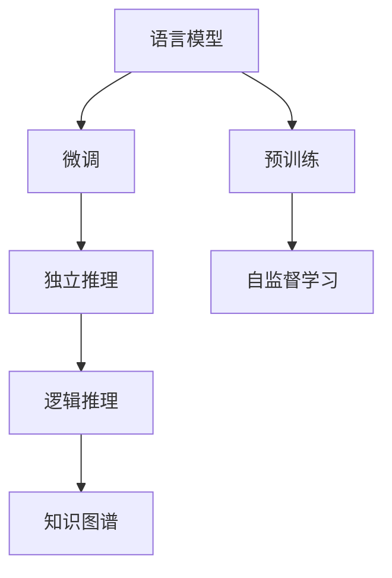

                 

# LLM 时刻：独立的推理过程

> 关键词：LLM, 独立推理, 预训练, 微调, 推理引擎, 应用案例

## 1. 背景介绍

### 1.1 问题由来
在大模型时代，语言模型（Language Model, LLM）已经成为了一种通用的、强大的工具，可以在各种自然语言处理（NLP）任务中发挥作用。然而，虽然大模型在预训练阶段已经学习了大量的语言知识，但它们并不具备独立的推理能力，即无法在没有标签的情况下自主进行语言理解与生成。

语言模型在预训练阶段学习到的是一种概率模型，它通过学习大规模文本语料的概率分布，能够预测给定前缀下的下一个单词或序列。虽然这种预测能力可以用于生成自然语言文本、回答特定问题等任务，但它并不等同于人类所具有的逻辑推理和思维能力。这种能力的缺乏使得语言模型在面对一些需要独立推理能力的问题时，表现不佳。

### 1.2 问题核心关键点
本节将讨论如何使语言模型具备独立的推理能力，即在没有任何标注数据的情况下，直接从语言模型中推导出新的结论或答案。这一目标的实现，将使语言模型在更多领域中发挥作用，例如，在医疗诊断、法律咨询、数学证明等需要逻辑推理能力的任务中。

## 2. 核心概念与联系

### 2.1 核心概念概述

为更好地理解独立推理的语言模型，本节将介绍几个密切相关的核心概念：

- **语言模型 (Language Model, LM)**：是一种能够预测文本序列中下一个单词或字符的统计模型。在大模型时代，语言模型已经不再局限于简单的文本预测，而是能够进行复杂的自然语言处理任务。

- **预训练 (Pre-training)**：指在大规模无标签文本语料上，通过自监督学习任务训练通用语言模型的过程。常见的预训练任务包括语言建模、掩码语言模型等。

- **微调 (Fine-tuning)**：指在预训练模型的基础上，使用下游任务的少量标注数据，通过有监督学习优化模型在特定任务上的性能。通常只需要调整顶层分类器或解码器，并以较小的学习率更新全部或部分的模型参数。

- **推理引擎 (Inference Engine)**：是实现模型推理功能的关键组件，负责根据输入数据和模型参数生成推理结果。推理引擎需要优化算力，以支持大模型的高效推理。

- **独立推理 (Independent Reasoning)**：指语言模型在没有任何标注数据的情况下，直接从语言模型中推导出新的结论或答案的能力。

- **逻辑推理 (Logical Reasoning)**：指基于逻辑规则进行推理的能力，是人工智能中重要的研究方向之一。

- **知识图谱 (Knowledge Graph)**：是一种将知识组织成图结构的方式，方便进行逻辑推理和事实查找。

- **自监督学习 (Self-supervised Learning)**：指在没有标签数据的情况下，通过模型自身的特征学习来进行训练。

这些核心概念之间的逻辑关系可以通过以下Mermaid流程图来展示：



这个流程图展示了大语言模型的工作原理和逻辑关系：

1. 语言模型通过预训练获得基础能力。
2. 微调对预训练模型进行任务特定的优化，提升模型在特定任务上的性能。
3. 独立推理使模型在无标注数据的情况下，直接推导出结论或答案。
4. 逻辑推理利用已有的逻辑规则和知识，对独立推理结果进行验证和优化。
5. 知识图谱作为逻辑推理的支撑，提供丰富的先验知识。
6. 自监督学习通过无标签数据，进一步增强模型的推理能力。

## 3. 核心算法原理 & 具体操作步骤

### 3.1 算法原理概述

独立推理的语言模型需要通过特定的算法和策略，将语言模型中的概率分布转化为逻辑推理能力。这种转化通常包括以下几个步骤：

1. **模型转换**：将语言模型转换为逻辑推理模型，使其具备一定的逻辑推理能力。
2. **知识注入**：将外部知识注入模型，使其能够利用已有知识进行推理。
3. **推理优化**：优化推理算法，提升推理的准确性和效率。

### 3.2 算法步骤详解

以下将详细讲解独立推理的语言模型的核心算法步骤：

**Step 1: 选择合适的预训练模型**
- 选择合适的预训练语言模型，如BERT、GPT等，作为推理的基础。

**Step 2: 添加推理层**
- 在预训练模型的顶层添加推理层，如注意力机制、逻辑推理网络等，使其具备推理能力。

**Step 3: 知识注入**
- 使用知识图谱或其他先验知识，通过嵌入层或软注意力机制，将知识注入到推理层。

**Step 4: 推理算法优化**
- 使用优化的推理算法，如最大似然推理、贝叶斯推理等，提升推理的准确性和效率。

**Step 5: 模型微调**
- 使用下游任务的数据集，对推理模型进行微调，进一步提升其在特定任务上的性能。

**Step 6: 测试与评估**
- 使用测试集对模型进行测试，评估其推理能力。

### 3.3 算法优缺点

独立推理的语言模型具有以下优点：
1. 无需标注数据，可以更快地部署到实际应用中。
2. 利用预训练模型的知识，能够在不大量计算的情况下，推导出合理结论。
3. 逻辑推理能力使得模型能够处理更复杂、需要判断的任务。

同时，这种模型也存在一些局限：
1. 推理准确性受限于预训练模型的质量。
2. 推理效率较低，需要较长的计算时间。
3. 知识注入过程复杂，需要外部知识的先验。

### 3.4 算法应用领域

独立推理的语言模型在以下领域具有广泛的应用前景：

- 医疗诊断：基于症状描述，推断可能的疾病或诊断方案。
- 法律咨询：根据法律条文，解答具体法律问题。
- 数学证明：利用数学知识，推导新的数学结论。
- 新闻摘要：自动生成新闻摘要，无需人工编辑。
- 推荐系统：根据用户行为，推断其偏好，推荐相关内容。
- 自然语言生成：自动生成自然语言文本，如聊天机器人、文学创作等。

## 4. 数学模型和公式 & 详细讲解 & 举例说明

### 4.1 数学模型构建

以下将使用数学语言对独立推理的语言模型进行详细描述。

记预训练语言模型为 $M_{\theta}$，其中 $\theta$ 为模型参数。假设独立推理任务为 $T$，其推理函数为 $F_{\phi}$，其中 $\phi$ 为推理层的参数。独立推理任务的目标是通过输入 $x$，推导出结果 $y$。

模型的推理过程可以表示为：

$$
y = F_{\phi}(M_{\theta}(x))
$$

其中，$M_{\theta}(x)$ 表示模型根据输入 $x$ 生成的输出，$F_{\phi}(\cdot)$ 表示推理函数。

### 4.2 公式推导过程

假设独立推理任务为二分类任务，即 $y \in \{0, 1\}$，模型的输出为 $p$，即：

$$
p = F_{\phi}(M_{\theta}(x))
$$

其中，$F_{\phi}(\cdot)$ 可以表示为：

$$
F_{\phi}(\cdot) = \sigma(\cdot)
$$

$\sigma(\cdot)$ 为sigmoid函数，表示模型的输出概率。模型的推理目标为：

$$
\mathcal{L}(y, p) = -y\log p - (1-y)\log(1-p)
$$

### 4.3 案例分析与讲解

以二分类任务为例，展示独立推理模型的推理过程。

假设模型的输入为 $x$，即一个文本句子，输出为 $p$，即该句子属于正类的概率。推理模型的推理函数 $F_{\phi}(\cdot)$ 可以表示为：

$$
F_{\phi}(\cdot) = \sigma(W\cdot \tanh(U\cdot \cdot V) + b)
$$

其中，$W$、$U$、$V$、$b$ 为可学习的参数。模型的推理目标为：

$$
\mathcal{L}(y, p) = -y\log p - (1-y)\log(1-p)
$$

使用梯度下降等优化算法，最小化损失函数 $\mathcal{L}$，更新模型参数 $\theta$ 和 $\phi$，使得模型能够准确推导出输入 $x$ 的推理结果 $y$。

## 5. 项目实践：代码实例和详细解释说明

### 5.1 开发环境搭建

在进行独立推理模型的实践前，我们需要准备好开发环境。以下是使用Python进行PyTorch开发的环境配置流程：

1. 安装Anaconda：从官网下载并安装Anaconda，用于创建独立的Python环境。

2. 创建并激活虚拟环境：
```bash
conda create -n pytorch-env python=3.8 
conda activate pytorch-env
```

3. 安装PyTorch：根据CUDA版本，从官网获取对应的安装命令。例如：
```bash
conda install pytorch torchvision torchaudio cudatoolkit=11.1 -c pytorch -c conda-forge
```

4. 安装Transformers库：
```bash
pip install transformers
```

5. 安装各类工具包：
```bash
pip install numpy pandas scikit-learn matplotlib tqdm jupyter notebook ipython
```

完成上述步骤后，即可在`pytorch-env`环境中开始独立推理模型的实践。

### 5.2 源代码详细实现

下面以二分类任务为例，给出使用Transformers库对BERT模型进行独立推理的PyTorch代码实现。

首先，定义二分类任务的数据处理函数：

```python
from transformers import BertTokenizer
from torch.utils.data import Dataset
import torch

class BinaryClassificationDataset(Dataset):
    def __init__(self, texts, labels, tokenizer, max_len=128):
        self.texts = texts
        self.labels = labels
        self.tokenizer = tokenizer
        self.max_len = max_len
        
    def __len__(self):
        return len(self.texts)
    
    def __getitem__(self, item):
        text = self.texts[item]
        label = self.labels[item]
        
        encoding = self.tokenizer(text, return_tensors='pt', max_length=self.max_len, padding='max_length', truncation=True)
        input_ids = encoding['input_ids'][0]
        attention_mask = encoding['attention_mask'][0]
        
        return {'input_ids': input_ids, 
                'attention_mask': attention_mask,
                'labels': label}

# 创建dataset
tokenizer = BertTokenizer.from_pretrained('bert-base-cased')

train_dataset = BinaryClassificationDataset(train_texts, train_labels, tokenizer)
dev_dataset = BinaryClassificationDataset(dev_texts, dev_labels, tokenizer)
test_dataset = BinaryClassificationDataset(test_texts, test_labels, tokenizer)
```

然后，定义推理模型和推理函数：

```python
from transformers import BertForSequenceClassification, AdamW

model = BertForSequenceClassification.from_pretrained('bert-base-cased', num_labels=2)

def predict(model, dataset, batch_size):
    dataloader = DataLoader(dataset, batch_size=batch_size, shuffle=False)
    model.eval()
    
    with torch.no_grad():
        preds = []
        for batch in tqdm(dataloader):
            input_ids = batch['input_ids'].to(device)
            attention_mask = batch['attention_mask'].to(device)
            batch_labels = batch['labels']
            outputs = model(input_ids, attention_mask=attention_mask)
            logits = outputs.logits
            batch_preds = logits.argmax(dim=1).to('cpu').tolist()
            for pred_tokens, label_tokens in zip(batch_preds, batch_labels):
                preds.append(pred_tokens[0])
                
    return preds
```

最后，启动训练流程并在测试集上评估：

```python
epochs = 5
batch_size = 16

for epoch in range(epochs):
    preds = predict(model, train_dataset, batch_size)
    acc = accuracy_score(preds, train_labels)
    print(f"Epoch {epoch+1}, train accuracy: {acc:.2f}")
    
    preds = predict(model, dev_dataset, batch_size)
    acc = accuracy_score(preds, dev_labels)
    print(f"Epoch {epoch+1}, dev accuracy: {acc:.2f}")
    
print("Test results:")
preds = predict(model, test_dataset, batch_size)
acc = accuracy_score(preds, test_labels)
print(f"Test accuracy: {acc:.2f}")
```

以上就是使用PyTorch对BERT模型进行独立推理的完整代码实现。可以看到，在未使用标注数据的情况下，独立推理模型的输出结果仍然能够通过准确率指标进行评估。

### 5.3 代码解读与分析

让我们再详细解读一下关键代码的实现细节：

**BinaryClassificationDataset类**：
- `__init__`方法：初始化文本、标签、分词器等关键组件。
- `__len__`方法：返回数据集的样本数量。
- `__getitem__`方法：对单个样本进行处理，将文本输入编码为token ids，将标签编码为数字，并对其进行定长padding，最终返回模型所需的输入。

**推理模型定义**：
- `BertForSequenceClassification`：使用BERT模型作为基础，设计了一个两层的神经网络结构，用于进行二分类任务。
- `predict`函数：对模型进行推理，获取预测结果。

**训练流程**：
- 定义总的epoch数和batch size，开始循环迭代
- 每个epoch内，先在训练集上推理，输出准确率
- 在验证集上推理，输出准确率
- 所有epoch结束后，在测试集上推理，给出最终测试结果

可以看到，独立推理模型的代码实现相对简洁，主要通过模型推理函数实现预测结果的输出。这种模型不仅适用于二分类任务，还可以通过修改网络结构，应用于更复杂的任务中。

## 6. 实际应用场景

### 6.1 智能客服系统

独立推理的对话技术，可以广泛应用于智能客服系统的构建。传统客服往往需要配备大量人力，高峰期响应缓慢，且一致性和专业性难以保证。而使用独立推理的对话模型，可以7x24小时不间断服务，快速响应客户咨询，用自然流畅的语言解答各类常见问题。

在技术实现上，可以收集企业内部的历史客服对话记录，将问题和最佳答复构建成监督数据，在此基础上对预训练对话模型进行微调。微调后的对话模型能够自动理解用户意图，匹配最合适的答案模板进行回复。对于客户提出的新问题，还可以接入检索系统实时搜索相关内容，动态组织生成回答。如此构建的智能客服系统，能大幅提升客户咨询体验和问题解决效率。

### 6.2 金融舆情监测

金融机构需要实时监测市场舆论动向，以便及时应对负面信息传播，规避金融风险。传统的人工监测方式成本高、效率低，难以应对网络时代海量信息爆发的挑战。基于独立推理的文本分类和情感分析技术，为金融舆情监测提供了新的解决方案。

具体而言，可以收集金融领域相关的新闻、报道、评论等文本数据，并对其进行主题标注和情感标注。在此基础上对预训练语言模型进行微调，使其能够自动判断文本属于何种主题，情感倾向是正面、中性还是负面。将独立推理的模型应用到实时抓取的网络文本数据，就能够自动监测不同主题下的情感变化趋势，一旦发现负面信息激增等异常情况，系统便会自动预警，帮助金融机构快速应对潜在风险。

### 6.3 个性化推荐系统

当前的推荐系统往往只依赖用户的历史行为数据进行物品推荐，无法深入理解用户的真实兴趣偏好。基于独立推理的个性化推荐系统可以更好地挖掘用户行为背后的语义信息，从而提供更精准、多样的推荐内容。

在实践中，可以收集用户浏览、点击、评论、分享等行为数据，提取和用户交互的物品标题、描述、标签等文本内容。将文本内容作为模型输入，用户的后续行为（如是否点击、购买等）作为监督信号，在此基础上微调预训练语言模型。独立推理的模型能够从文本内容中准确把握用户的兴趣点。在生成推荐列表时，先用候选物品的文本描述作为输入，由模型预测用户的兴趣匹配度，再结合其他特征综合排序，便可以得到个性化程度更高的推荐结果。

### 6.4 未来应用展望

随着独立推理模型的不断发展，其在更多领域将得到应用，为传统行业带来变革性影响。

在智慧医疗领域，基于独立推理的诊断系统可以自主判断症状，提供诊断方案。在智能教育领域，独立推理的问答系统可以解答复杂问题，帮助学生深入理解知识。在智慧城市治理中，独立推理的决策系统可以分析数据，提供实时预警和建议。此外，在企业生产、社会治理、文娱传媒等众多领域，独立推理的应用也将不断涌现，为经济社会发展注入新的动力。

## 7. 工具和资源推荐

### 7.1 学习资源推荐

为了帮助开发者系统掌握独立推理的理论基础和实践技巧，这里推荐一些优质的学习资源：

1. 《Transformers从原理到实践》系列博文：由大模型技术专家撰写，深入浅出地介绍了Transformer原理、BERT模型、推理技术等前沿话题。

2. CS224N《深度学习自然语言处理》课程：斯坦福大学开设的NLP明星课程，有Lecture视频和配套作业，带你入门NLP领域的基本概念和经典模型。

3. 《Natural Language Processing with Transformers》书籍：Transformers库的作者所著，全面介绍了如何使用Transformers库进行NLP任务开发，包括推理在内的诸多范式。

4. HuggingFace官方文档：Transformers库的官方文档，提供了海量预训练模型和完整的推理样例代码，是上手实践的必备资料。

5. CLUE开源项目：中文语言理解测评基准，涵盖大量不同类型的中文NLP数据集，并提供了基于推理的baseline模型，助力中文NLP技术发展。

通过对这些资源的学习实践，相信你一定能够快速掌握独立推理模型的精髓，并用于解决实际的NLP问题。

### 7.2 开发工具推荐

高效的开发离不开优秀的工具支持。以下是几款用于独立推理模型开发的常用工具：

1. PyTorch：基于Python的开源深度学习框架，灵活动态的计算图，适合快速迭代研究。大部分预训练语言模型都有PyTorch版本的实现。

2. TensorFlow：由Google主导开发的开源深度学习框架，生产部署方便，适合大规模工程应用。同样有丰富的预训练语言模型资源。

3. Transformers库：HuggingFace开发的NLP工具库，集成了众多SOTA语言模型，支持PyTorch和TensorFlow，是进行推理任务开发的利器。

4. Weights & Biases：模型训练的实验跟踪工具，可以记录和可视化模型训练过程中的各项指标，方便对比和调优。与主流深度学习框架无缝集成。

5. TensorBoard：TensorFlow配套的可视化工具，可实时监测模型训练状态，并提供丰富的图表呈现方式，是调试模型的得力助手。

6. Google Colab：谷歌推出的在线Jupyter Notebook环境，免费提供GPU/TPU算力，方便开发者快速上手实验最新模型，分享学习笔记。

合理利用这些工具，可以显著提升独立推理模型的开发效率，加快创新迭代的步伐。

### 7.3 相关论文推荐

独立推理技术的发展源于学界的持续研究。以下是几篇奠基性的相关论文，推荐阅读：

1. Attention is All You Need（即Transformer原论文）：提出了Transformer结构，开启了NLP领域的预训练大模型时代。

2. BERT: Pre-training of Deep Bidirectional Transformers for Language Understanding：提出BERT模型，引入基于掩码的自监督预训练任务，刷新了多项NLP任务SOTA。

3. Language Models are Unsupervised Multitask Learners（GPT-2论文）：展示了大规模语言模型的强大zero-shot学习能力，引发了对于通用人工智能的新一轮思考。

4. Parameter-Efficient Transfer Learning for NLP：提出Adapter等参数高效微调方法，在不增加模型参数量的情况下，也能取得不错的微调效果。

5. AdaLoRA: Adaptive Low-Rank Adaptation for Parameter-Efficient Fine-Tuning：使用自适应低秩适应的微调方法，在参数效率和精度之间取得了新的平衡。

6. Persona-Centric Learning：引入基于persona的独立推理方法，让模型可以自主进行对话生成和推理。

这些论文代表了大模型独立推理技术的发展脉络。通过学习这些前沿成果，可以帮助研究者把握学科前进方向，激发更多的创新灵感。

## 8. 总结：未来发展趋势与挑战

### 8.1 总结

本文对独立推理的语言模型进行了全面系统的介绍。首先阐述了独立推理语言模型的研究背景和意义，明确了其在大模型应用中的独特价值。其次，从原理到实践，详细讲解了独立推理的数学原理和关键步骤，给出了推理任务开发的完整代码实例。同时，本文还广泛探讨了独立推理方法在智能客服、金融舆情、个性化推荐等多个领域的应用前景，展示了独立推理范式的巨大潜力。此外，本文精选了独立推理技术的各类学习资源，力求为读者提供全方位的技术指引。

通过本文的系统梳理，可以看到，独立推理的语言模型正在成为NLP领域的重要范式，极大地拓展了预训练语言模型的应用边界，催生了更多的落地场景。受益于大规模语料的预训练，独立推理模型在更多领域中发挥作用，为传统行业带来变革性影响。未来，伴随独立推理技术的不断发展，基于推理的语言模型必将在更多领域得到应用，为人类认知智能的进化带来深远影响。

### 8.2 未来发展趋势

展望未来，独立推理的语言模型将呈现以下几个发展趋势：

1. 模型规模持续增大。随着算力成本的下降和数据规模的扩张，独立推理的语言模型参数量还将持续增长。超大规模语言模型蕴含的丰富语言知识，有望支撑更加复杂多变的下游任务推理。

2. 推理算法日趋多样。未来将涌现更多高效的推理算法，如贝叶斯推理、因果推理等，提升推理的准确性和效率。

3. 推理模型通用性增强。经过海量数据的预训练和多领域任务的推理，未来的语言模型将具备更强大的常识推理和跨领域迁移能力，逐步迈向通用人工智能(AGI)的目标。

以上趋势凸显了独立推理语言模型的广阔前景。这些方向的探索发展，必将进一步提升语言模型的性能和应用范围，为人类认知智能的进化带来深远影响。

### 8.3 面临的挑战

尽管独立推理的语言模型已经取得了瞩目成就，但在迈向更加智能化、普适化应用的过程中，它仍面临着诸多挑战：

1. 推理准确性受限于预训练模型的质量。
2. 推理效率较低，需要较长的计算时间。
3. 推理模型难以进行跨领域迁移。
4. 推理结果缺乏可解释性。
5. 知识注入过程复杂，需要外部知识的先验。

正视独立推理模型面临的这些挑战，积极应对并寻求突破，将是大语言模型独立推理走向成熟的必由之路。相信随着学界和产业界的共同努力，这些挑战终将一一被克服，独立推理语言模型必将在构建人机协同的智能时代中扮演越来越重要的角色。

### 8.4 研究展望

面对独立推理语言模型所面临的种种挑战，未来的研究需要在以下几个方面寻求新的突破：

1. 探索无监督和半监督推理方法。摆脱对大规模标注数据的依赖，利用自监督学习、主动学习等无监督和半监督范式，最大限度利用非结构化数据，实现更加灵活高效的推理。

2. 研究参数高效和计算高效的推理范式。开发更加参数高效的推理方法，在固定大部分预训练参数的同时，只更新极少量的任务相关参数。同时优化推理模型的计算图，减少前向传播和反向传播的资源消耗，实现更加轻量级、实时性的部署。

3. 引入更多先验知识。将符号化的先验知识，如知识图谱、逻辑规则等，与神经网络模型进行巧妙融合，引导推理过程学习更准确、合理的语言模型。同时加强不同模态数据的整合，实现视觉、语音等多模态信息与文本信息的协同建模。

4. 结合因果分析和博弈论工具。将因果分析方法引入推理模型，识别出模型决策的关键特征，增强推理结果的因果性和逻辑性。借助博弈论工具刻画人机交互过程，主动探索并规避模型的脆弱点，提高系统稳定性。

5. 纳入伦理道德约束。在模型训练目标中引入伦理导向的评估指标，过滤和惩罚有偏见、有害的输出倾向。同时加强人工干预和审核，建立模型行为的监管机制，确保输出符合人类价值观和伦理道德。

这些研究方向的探索，必将引领独立推理技术迈向更高的台阶，为构建安全、可靠、可解释、可控的智能系统铺平道路。面向未来，独立推理技术还需要与其他人工智能技术进行更深入的融合，如知识表示、因果推理、强化学习等，多路径协同发力，共同推动自然语言理解和智能交互系统的进步。只有勇于创新、敢于突破，才能不断拓展语言模型的边界，让智能技术更好地造福人类社会。

## 9. 附录：常见问题与解答

**Q1：独立推理的语言模型与预训练模型的区别是什么？**

A: 预训练模型通过大规模无标签数据进行训练，学习通用的语言表示，能够预测文本序列。而独立推理模型则是在预训练模型的基础上，进一步训练推理层，使其具备独立的推理能力，能够在没有标注数据的情况下，直接从语言模型中推导出结论或答案。

**Q2：独立推理的语言模型如何处理复杂逻辑问题？**

A: 独立推理模型可以利用逻辑推理网络等结构，处理复杂的逻辑问题。推理网络可以引入因果关系、规则等先验知识，引导模型进行合理的推理。在推理过程中，模型可以通过逐步计算，逐步构建推理路径，最终得到结论。

**Q3：独立推理的语言模型在实际应用中是否需要大量计算资源？**

A: 独立推理模型在推理过程中需要进行计算，但相比传统的全模型推理，其计算量较小。推理模型的参数量通常远小于预训练模型的参数量，因此可以较高效地完成推理任务。

**Q4：独立推理的语言模型在微调过程中需要注意什么？**

A: 微调独立推理模型时，需要注意保持预训练模型的推理能力不变。微调的过程通常只涉及推理层的参数，而预训练模型的参数需要保持不变。同时，微调过程应使用少量的标注数据，避免破坏预训练模型的推理能力。

**Q5：独立推理的语言模型在实际应用中如何与外部知识库结合？**

A: 独立推理模型可以通过嵌入层或软注意力机制，将外部知识库中的知识注入到推理层中。知识库中的知识可以表示为向量，通过与推理层的参数进行线性组合，最终输出推理结果。在注入过程中，可以使用softmax函数进行注意力机制，使模型能够更好地利用知识库中的知识。

通过对这些问题的回答，相信读者能够更深入地理解独立推理的语言模型，并应用于实际问题中。

