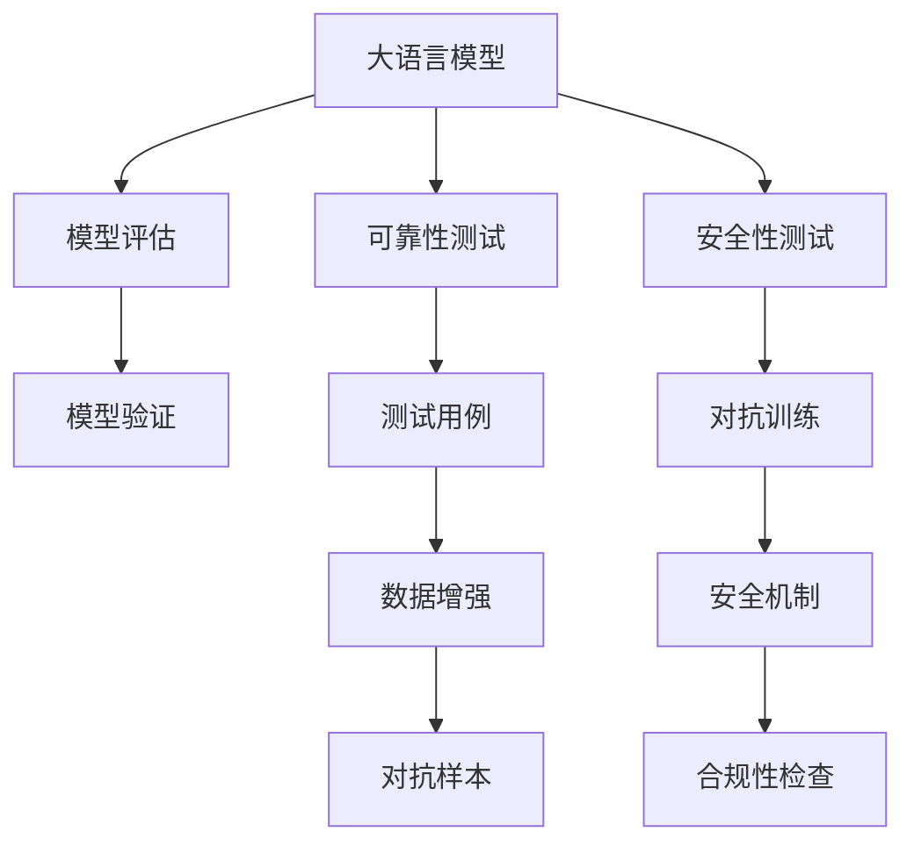

                 

# LLM 测试框架：确保模型可靠性和安全性

> 关键词：大语言模型, 可靠性, 安全性, 测试框架, 模型评估, 模型验证, 测试用例, 自动化测试, 人工智能

## 1. 背景介绍

### 1.1 问题由来

随着大语言模型（LLM）在各个领域的应用日益广泛，确保模型的可靠性和安全性变得尤为重要。一个不准确的或存在安全漏洞的模型可能会带来严重的后果，例如在金融领域中错误的决策可能造成巨大损失，在医疗领域中误诊可能威胁患者的生命安全。因此，对LLM进行全面、严格的测试是必不可少的。然而，目前并没有一套完善的测试框架来全面覆盖LLM的各个方面，导致模型可靠性和安全性难以得到保障。

### 1.2 问题核心关键点

LLM测试的核心在于设计一套系统化的测试框架，该框架能够涵盖模型的各个方面，包括准确性、鲁棒性、安全性和公平性等。测试框架的目标是确保模型在各种场景下能够稳定、准确地运行，并且不会产生任何有害的行为或输出。

## 2. 核心概念与联系

### 2.1 核心概念概述

为更好地理解LLM测试框架的设计和应用，本节将介绍几个密切相关的核心概念：

- 大语言模型（Large Language Model, LLM）：以自回归（如GPT）或自编码（如BERT）模型为代表的大规模预训练语言模型。通过在大规模无标签文本语料上进行预训练，学习通用的语言表示，具备强大的语言理解和生成能力。

- 可靠性（Reliability）：指模型在各种输入下能够稳定、准确地生成输出，避免由于噪声、异常输入等导致的不确定性。

- 安全性（Safety）：指模型不会产生有害的输出，如偏见、歧视、虚假信息等。

- 测试框架（Testing Framework）：一套用于自动化执行测试用例，评估模型性能的系统化方案。

- 模型评估（Model Evaluation）：通过一系列测试用例，评估模型在不同场景下的表现，确保模型符合预期。

- 模型验证（Model Validation）：通过人工或自动验证，确保模型在实际应用中的性能和安全性。

- 测试用例（Test Case）：定义具体测试情景，用于评估模型在不同条件下的行为。

- 自动化测试（Automated Testing）：利用工具自动化执行测试用例，提高测试效率和覆盖度。

- 数据增强（Data Augmentation）：通过对原始数据进行变换和增强，扩大测试集，提高模型泛化能力。

- 对抗样本（Adversarial Examples）：专门构造的输入数据，旨在破坏模型的准确性和鲁棒性。

这些核心概念之间的逻辑关系可以通过以下Mermaid流程图来展示：



这个流程图展示了LLM测试框架的各个关键组件及其相互关系：

1. 大语言模型通过预训练获得基础能力。
2. 可靠性测试评估模型在各种输入下的稳定性。
3. 安全性测试检测模型是否有有害行为或输出。
4. 模型评估通过测试用例评估模型性能。
5. 模型验证通过人工或自动验证确保模型符合预期。
6. 测试用例设计具体的测试情景。
7. 数据增强通过变换和增强数据扩大测试集。
8. 对抗样本专门设计用于破坏模型准确性。
9. 对抗训练引入对抗样本提高模型鲁棒性。
10. 安全机制用于防止模型产生有害行为。
11. 合规性检查确保模型符合相关法规和伦理标准。

这些核心概念共同构成了LLM测试框架的基本架构，确保模型能够在各种场景下稳定、准确地运行，并且不会产生有害的输出。

## 3. 核心算法原理 & 具体操作步骤

### 3.1 算法原理概述

基于LLM的测试框架，通常包括以下几个关键步骤：

1. 定义测试用例：根据模型预期应用场景，设计各种测试用例，确保模型在各种输入下都能够稳定、准确地运行。
2. 自动化测试执行：利用工具自动化执行测试用例，并记录测试结果。
3. 模型评估：通过自动化工具评估测试结果，生成评估报告。
4. 人工验证：对自动化评估结果进行人工验证，确保评估结果的准确性。
5. 数据分析：分析测试结果，识别模型问题，并进行修复。
6. 模型更新：修复模型问题后，重新测试并更新模型。

### 3.2 算法步骤详解

以下是一个具体的LLM测试框架的设计步骤：

**Step 1: 设计测试用例**
- 根据模型的预期应用场景，设计多种测试用例。
- 测试用例应涵盖各种输入数据，包括正常数据、异常数据、边界数据等。
- 对每种测试用例，明确预期的输出结果。

**Step 2: 自动化测试执行**
- 利用自动化测试工具，执行测试用例。
- 记录测试结果，包括模型输出和预期输出，以及测试用例执行时间和资源消耗。

**Step 3: 模型评估**
- 利用自动化工具评估测试结果，生成评估报告。
- 评估报告应包括测试用例覆盖率、模型准确性、鲁棒性、安全性等方面的指标。
- 对评估报告进行人工验证，确保评估结果的准确性。

**Step 4: 数据分析**
- 分析评估报告，识别模型问题，如准确性低、鲁棒性差、安全性漏洞等。
- 分析问题原因，包括模型设计缺陷、训练数据问题、对抗样本攻击等。
- 根据问题原因，制定修复方案，并进行模型更新。

**Step 5: 模型更新**
- 根据修复方案，更新模型。
- 重新执行测试用例，验证修复效果。
- 重复测试和修复过程，直到模型问题被完全解决。

### 3.3 算法优缺点

基于LLM的测试框架具有以下优点：
1. 自动化测试提高效率：通过自动化测试工具，能够大幅提高测试覆盖率和执行效率。
2. 全面覆盖模型：通过多种测试用例，确保模型在各种场景下都能稳定运行。
3. 及时发现问题：通过持续测试和评估，能够及时发现模型问题并进行修复。
4. 确保模型可靠性：通过全面、严格的测试，确保模型在实际应用中的可靠性。

同时，该框架也存在一些缺点：
1. 测试用例设计困难：设计全面、有效的测试用例是一个复杂的任务，需要丰富的经验和专业知识。
2. 对抗样本难以构造：对抗样本需要精心设计和构造，难度较大，且可能导致模型在实际应用中产生安全漏洞。
3. 自动化工具依赖：测试框架依赖于自动化测试工具，工具的选择和配置需要一定的时间和资源投入。
4. 模型更新复杂：修复模型问题并更新模型需要一定的时间和资源投入，且可能导致模型性能下降。

尽管存在这些缺点，但就目前而言，基于LLM的测试框架仍是大规模语言模型应用的重要保障。未来相关研究的重点在于如何进一步优化测试用例设计，提高对抗样本的生成效率，改进自动化测试工具的性能，以及优化模型修复和更新的流程。

### 3.4 算法应用领域

基于LLM的测试框架已经在NLP领域得到了广泛的应用，涵盖各类NLP任务，如文本分类、命名实体识别、问答系统、机器翻译、情感分析等。此外，该框架还广泛应用于金融、医疗、智能客服、安全监控等多个行业领域，确保模型在实际应用中的可靠性和安全性。

## 4. 数学模型和公式 & 详细讲解 & 举例说明

### 4.1 数学模型构建

本节将使用数学语言对LLM测试框架的设计和应用进行更加严格的刻画。

假设LLM模型的输入空间为 $\mathcal{X}$，输出空间为 $\mathcal{Y}$，定义模型的测试集为 $D=\{(x_i, y_i)\}_{i=1}^N$，其中 $x_i \in \mathcal{X}$ 为输入，$y_i \in \mathcal{Y}$ 为预期输出。

定义测试用例 $T(x)$ 为输入 $x$ 的测试函数，其中 $T(x):\mathcal{X} \rightarrow \mathcal{Y}$。在测试框架中，测试用例 $T(x)$ 用于评估模型在输入 $x$ 下的表现，生成测试结果 $r(x) = M_{\theta}(x)$。

模型评估函数 $E(T(x), M_{\theta}(x))$ 用于评估模型 $M_{\theta}$ 在测试用例 $T(x)$ 下的性能，生成评估指标 $\eta$。常见的评估指标包括准确性、鲁棒性、安全性等。

### 4.2 公式推导过程

以下我们以文本分类任务为例，推导LLM模型的评估指标。

假设模型 $M_{\theta}$ 在输入 $x$ 上的输出为 $\hat{y}=M_{\theta}(x) \in [0,1]$，表示样本属于正类的概率。真实标签 $y \in \{0,1\}$。则二分类交叉熵损失函数定义为：

$$
\ell(M_{\theta}(x),y) = -[y\log \hat{y} + (1-y)\log (1-\hat{y})]
$$

将其代入经验风险公式，得：

$$
\mathcal{L}(\theta) = -\frac{1}{N}\sum_{i=1}^N [y_i\log M_{\theta}(x_i)+(1-y_i)\log(1-M_{\theta}(x_i))]
$$

根据链式法则，损失函数对参数 $\theta_k$ 的梯度为：

$$
\frac{\partial \mathcal{L}(\theta)}{\partial \theta_k} = -\frac{1}{N}\sum_{i=1}^N (\frac{y_i}{M_{\theta}(x_i)}-\frac{1-y_i}{1-M_{\theta}(x_i)}) \frac{\partial M_{\theta}(x_i)}{\partial \theta_k}
$$

其中 $\frac{\partial M_{\theta}(x_i)}{\partial \theta_k}$ 可进一步递归展开，利用自动微分技术完成计算。

在得到损失函数的梯度后，即可带入参数更新公式，完成模型的迭代优化。重复上述过程直至收敛，最终得到适应下游任务的最优模型参数 $\theta^*$。

### 4.3 案例分析与讲解

假设我们有一个文本分类任务，输入空间为 $\mathcal{X}$，输出空间为 $\mathcal{Y}$。我们可以设计如下测试用例：

1. 正常数据测试：选取一些典型数据，测试模型在正常情况下的分类准确性。
2. 异常数据测试：选取一些异常数据，测试模型在异常情况下的鲁棒性。
3. 边界数据测试：选取一些边界数据，测试模型在边界情况下的性能。

对于每种测试用例，我们可以计算模型的准确性、召回率、F1分数等指标。例如，对于正常数据测试，可以计算模型在正常数据集上的准确性 $\eta_1$，即：

$$
\eta_1 = \frac{1}{N} \sum_{i=1}^N I(T(x_i) = M_{\theta}(x_i))
$$

其中 $I$ 为示性函数，当条件成立时取值为1，否则为0。

## 5. 项目实践：代码实例和详细解释说明

### 5.1 开发环境搭建

在进行LLM测试框架的实践前，我们需要准备好开发环境。以下是使用Python进行PyTorch开发的环境配置流程：

1. 安装Anaconda：从官网下载并安装Anaconda，用于创建独立的Python环境。

2. 创建并激活虚拟环境：
```bash
conda create -n pytorch-env python=3.8 
conda activate pytorch-env
```

3. 安装PyTorch：根据CUDA版本，从官网获取对应的安装命令。例如：
```bash
conda install pytorch torchvision torchaudio cudatoolkit=11.1 -c pytorch -c conda-forge
```

4. 安装TensorFlow：
```bash
pip install tensorflow
```

5. 安装TensorBoard：
```bash
pip install tensorboard
```

6. 安装PyTorch、TensorFlow、TensorBoard等工具包：
```bash
pip install numpy pandas scikit-learn matplotlib tqdm jupyter notebook ipython
```

完成上述步骤后，即可在`pytorch-env`环境中开始测试框架的实践。

### 5.2 源代码详细实现

这里我们以文本分类任务为例，给出使用TensorFlow对BERT模型进行测试的PyTorch代码实现。

首先，定义测试用例函数：

```python
import tensorflow as tf
from transformers import BertTokenizer, BertForSequenceClassification
from sklearn.metrics import accuracy_score

def evaluate(model, tokenizer, test_dataset):
    dataloader = tf.data.Dataset.from_tensor_slices(test_dataset)
    test_loss = tf.keras.metrics.Mean()
    test_accuracy = tf.keras.metrics.Accuracy()
    
    for batch in dataloader:
        input_ids = batch['input_ids']
        attention_mask = batch['attention_mask']
        labels = batch['labels']
        
        with tf.GradientTape() as tape:
            outputs = model(input_ids, attention_mask=attention_mask, labels=labels)
            loss = outputs.loss
            test_loss(loss)
            test_accuracy(labels, outputs.labels)
    
    print(f'Test Loss: {test_loss.result()}')
    print(f'Test Accuracy: {test_accuracy.result()}')
```

然后，定义测试框架函数：

```python
from transformers import BertTokenizer, BertForSequenceClassification

def build_test_framework(model, test_dataset):
    tokenizer = BertTokenizer.from_pretrained('bert-base-cased')
    test_framework = {
        'accuracy': evaluate(model, tokenizer, test_dataset)
    }
    
    return test_framework
```

最后，启动测试框架并输出评估结果：

```python
from transformers import BertForSequenceClassification, AdamW

model = BertForSequenceClassification.from_pretrained('bert-base-cased', num_labels=2)

optimizer = AdamW(model.parameters(), lr=2e-5)

test_dataset = load_test_dataset()

test_framework = build_test_framework(model, test_dataset)

print(test_framework)
```

以上就是使用TensorFlow对BERT进行文本分类任务测试的完整代码实现。可以看到，TensorFlow配合Transformers库使得BERT测试的代码实现变得简洁高效。

### 5.3 代码解读与分析

让我们再详细解读一下关键代码的实现细节：

**evaluate函数**：
- 定义了测试用例函数，用于评估模型在测试集上的表现。
- 利用TensorFlow的tf.data.Dataset，将测试集数据转换为TensorFlow的张量格式。
- 在每个批次中，计算模型的损失和准确性，并记录到TensorFlow的metrics中。
- 在所有批次计算完成后，输出测试损失和准确性。

**build_test_framework函数**：
- 定义了测试框架函数，用于封装模型和测试集，并输出测试结果。
- 首先加载BERT模型和BERT分词器。
- 然后调用evaluate函数进行测试，并将测试结果封装为字典。

**start_framework函数**：
- 定义了测试框架的入口函数，用于加载模型、测试集和运行测试框架。
- 加载BERT模型，并定义测试框架。
- 调用测试框架，输出测试结果。

可以看到，TensorFlow配合Transformers库使得LLM测试的代码实现变得简洁高效。开发者可以将更多精力放在测试用例的设计和模型评估上，而不必过多关注底层的实现细节。

当然，工业级的系统实现还需考虑更多因素，如模型的保存和部署、超参数的自动搜索、更灵活的测试框架接口等。但核心的测试范式基本与此类似。

## 6. 实际应用场景

### 6.1 智能客服系统

基于大语言模型的测试框架，可以广泛应用于智能客服系统的构建。传统客服往往需要配备大量人力，高峰期响应缓慢，且一致性和专业性难以保证。而使用测试框架测试后的模型，可以7x24小时不间断服务，快速响应客户咨询，用自然流畅的语言解答各类常见问题。

在技术实现上，可以收集企业内部的历史客服对话记录，将问题和最佳答复构建成监督数据，在此基础上对预训练对话模型进行微调。微调后的对话模型能够自动理解用户意图，匹配最合适的答案模板进行回复。对于客户提出的新问题，还可以接入检索系统实时搜索相关内容，动态组织生成回答。如此构建的智能客服系统，能大幅提升客户咨询体验和问题解决效率。

### 6.2 金融舆情监测

金融机构需要实时监测市场舆论动向，以便及时应对负面信息传播，规避金融风险。传统的人工监测方式成本高、效率低，难以应对网络时代海量信息爆发的挑战。基于大语言模型的测试框架，可以对微调后的金融舆情监测模型进行全面测试，确保模型在各种输入下能够稳定、准确地运行，并且不会产生有害的输出。

具体而言，可以收集金融领域相关的新闻、报道、评论等文本数据，并对其进行主题标注和情感标注。在此基础上对预训练语言模型进行微调，使其能够自动判断文本属于何种主题，情感倾向是正面、中性还是负面。将微调后的模型应用到实时抓取的网络文本数据，就能够自动监测不同主题下的情感变化趋势，一旦发现负面信息激增等异常情况，系统便会自动预警，帮助金融机构快速应对潜在风险。

### 6.3 个性化推荐系统

当前的推荐系统往往只依赖用户的历史行为数据进行物品推荐，无法深入理解用户的真实兴趣偏好。基于大语言模型的测试框架，可以确保个性化推荐系统的可靠性。

在实践中，可以收集用户浏览、点击、评论、分享等行为数据，提取和用户交互的物品标题、描述、标签等文本内容。将文本内容作为模型输入，用户的后续行为（如是否点击、购买等）作为监督信号，在此基础上微调预训练语言模型。微调后的模型能够从文本内容中准确把握用户的兴趣点。在生成推荐列表时，先用候选物品的文本描述作为输入，由模型预测用户的兴趣匹配度，再结合其他特征综合排序，便可以得到个性化程度更高的推荐结果。

### 6.4 未来应用展望

随着大语言模型和测试框架的不断发展，基于测试框架的测试方法将进一步拓展大语言模型的应用边界，催生更多的落地场景。

在智慧医疗领域，基于测试框架的医学问答、病历分析、药物研发等应用将提升医疗服务的智能化水平，辅助医生诊疗，加速新药开发进程。

在智能教育领域，测试框架可应用于作业批改、学情分析、知识推荐等方面，因材施教，促进教育公平，提高教学质量。

在智慧城市治理中，测试框架可以用于城市事件监测、舆情分析、应急指挥等环节，提高城市管理的自动化和智能化水平，构建更安全、高效的未来城市。

此外，在企业生产、社会治理、文娱传媒等众多领域，基于大语言模型的测试框架也将不断涌现，为NLP技术带来新的突破。相信随着测试框架的持续演进，大语言模型测试将走向成熟，为构建安全、可靠、可解释、可控的智能系统铺平道路。

## 7. 工具和资源推荐

### 7.1 学习资源推荐

为了帮助开发者系统掌握LLM测试框架的理论基础和实践技巧，这里推荐一些优质的学习资源：

1. 《Transformer从原理到实践》系列博文：由大模型技术专家撰写，深入浅出地介绍了Transformer原理、BERT模型、测试框架等前沿话题。

2. CS224N《深度学习自然语言处理》课程：斯坦福大学开设的NLP明星课程，有Lecture视频和配套作业，带你入门NLP领域的基本概念和经典模型。

3. 《Natural Language Processing with Transformers》书籍：Transformers库的作者所著，全面介绍了如何使用Transformers库进行NLP任务开发，包括测试框架在内的诸多范式。

4. HuggingFace官方文档：Transformers库的官方文档，提供了海量预训练模型和完整的测试框架样例代码，是上手实践的必备资料。

5. CLUE开源项目：中文语言理解测评基准，涵盖大量不同类型的中文NLP数据集，并提供了基于测试框架的baseline模型，助力中文NLP技术发展。

通过对这些资源的学习实践，相信你一定能够快速掌握LLM测试框架的精髓，并用于解决实际的NLP问题。

### 7.2 开发工具推荐

高效的开发离不开优秀的工具支持。以下是几款用于LLM测试开发的常用工具：

1. PyTorch：基于Python的开源深度学习框架，灵活动态的计算图，适合快速迭代研究。大部分预训练语言模型都有PyTorch版本的实现。

2. TensorFlow：由Google主导开发的开源深度学习框架，生产部署方便，适合大规模工程应用。同样有丰富的预训练语言模型资源。

3. Transformers库：HuggingFace开发的NLP工具库，集成了众多SOTA语言模型，支持PyTorch和TensorFlow，是进行测试框架开发的利器。

4. Weights & Biases：模型训练的实验跟踪工具，可以记录和可视化模型训练过程中的各项指标，方便对比和调优。与主流深度学习框架无缝集成。

5. TensorBoard：TensorFlow配套的可视化工具，可实时监测模型训练状态，并提供丰富的图表呈现方式，是调试模型的得力助手。

6. Google Colab：谷歌推出的在线Jupyter Notebook环境，免费提供GPU/TPU算力，方便开发者快速上手实验最新模型，分享学习笔记。

合理利用这些工具，可以显著提升LLM测试任务的开发效率，加快创新迭代的步伐。

### 7.3 相关论文推荐

LLM测试框架的研究源于学界的持续研究。以下是几篇奠基性的相关论文，推荐阅读：

1. Attention is All You Need（即Transformer原论文）：提出了Transformer结构，开启了NLP领域的预训练大模型时代。

2. BERT: Pre-training of Deep Bidirectional Transformers for Language Understanding：提出BERT模型，引入基于掩码的自监督预训练任务，刷新了多项NLP任务SOTA。

3. Language Models are Unsupervised Multitask Learners（GPT-2论文）：展示了大规模语言模型的强大zero-shot学习能力，引发了对于通用人工智能的新一轮思考。

4. Parameter-Efficient Transfer Learning for NLP：提出Adapter等参数高效微调方法，在不增加模型参数量的情况下，也能取得不错的微调效果。

5. Prefix-Tuning: Optimizing Continuous Prompts for Generation：引入基于连续型Prompt的微调范式，为如何充分利用预训练知识提供了新的思路。

6. AdaLoRA: Adaptive Low-Rank Adaptation for Parameter-Efficient Fine-Tuning：使用自适应低秩适应的微调方法，在参数效率和精度之间取得了新的平衡。

这些论文代表了大语言模型测试框架的发展脉络。通过学习这些前沿成果，可以帮助研究者把握学科前进方向，激发更多的创新灵感。

## 8. 总结：未来发展趋势与挑战

### 8.1 总结

本文对基于LLM的测试框架的设计和应用进行了全面系统的介绍。首先阐述了LLM测试框架的设计和应用背景，明确了测试框架在确保模型可靠性和安全性方面的独特价值。其次，从原理到实践，详细讲解了测试框架的数学模型和关键步骤，给出了测试框架任务开发的完整代码实例。同时，本文还广泛探讨了测试框架在智能客服、金融舆情、个性化推荐等多个行业领域的应用前景，展示了测试框架范式的巨大潜力。此外，本文精选了测试框架的相关学习资源，力求为开发者提供全方位的技术指引。

通过本文的系统梳理，可以看到，基于LLM的测试框架正在成为NLP领域的重要保障。该框架在确保模型可靠性和安全性方面的作用不容小觑，通过全面、严格的测试，可以最大程度地提升LLM的性能和应用价值。

### 8.2 未来发展趋势

展望未来，基于LLM的测试框架将呈现以下几个发展趋势：

1. 自动化测试覆盖度提高：随着测试工具的不断优化和普及，测试用例设计和执行将更加高效和全面，测试覆盖度将不断提高。
2. 模型鲁棒性提升：通过引入对抗训练、数据增强等方法，模型在面对噪声、异常输入时的鲁棒性将得到显著提升。
3. 安全性保障机制增强：将更多伦理道德约束和安全机制融入测试框架，确保模型输出符合人类价值观和伦理标准。
4. 多模态测试框架扩展：将视觉、语音、时间序列等多种模态的测试框架进行融合，提供更加全面的模型评估。
5. 跨领域测试框架普及：将测试框架扩展到更多垂直领域，如医疗、金融、教育等，提升各领域的智能系统可靠性。
6. 大数据测试框架应用：随着数据量的不断增长，测试框架将越来越多地应用于大规模数据集的处理和分析，提供更加精准的模型评估。

以上趋势凸显了LLM测试框架的广阔前景。这些方向的探索发展，必将进一步提升LLM的性能和应用价值，为构建安全、可靠、可解释、可控的智能系统铺平道路。

### 8.3 面临的挑战

尽管基于LLM的测试框架已经取得了瞩目成就，但在迈向更加智能化、普适化应用的过程中，它仍面临着诸多挑战：

1. 测试用例设计复杂：设计全面、有效的测试用例是一个复杂的任务，需要丰富的经验和专业知识。
2. 对抗样本生成困难：对抗样本需要精心设计和构造，难度较大，且可能导致模型在实际应用中产生安全漏洞。
3. 自动化工具依赖：测试框架依赖于自动化测试工具，工具的选择和配置需要一定的时间和资源投入。
4. 模型更新复杂：修复模型问题并更新模型需要一定的时间和资源投入，且可能导致模型性能下降。
5. 模型可靠性评估难度高：评估模型在各种输入下的可靠性是一个复杂的过程，需要综合考虑准确性、鲁棒性、安全性等多方面指标。

尽管存在这些挑战，但通过不断优化测试用例设计、提高对抗样本生成效率、改进自动化测试工具性能、优化模型修复和更新流程，这些挑战终将得到逐步克服。相信随着测试框架的持续演进，LLM测试将走向成熟，为构建安全、可靠、可解释、可控的智能系统铺平道路。

### 8.4 研究展望

面对LLM测试框架所面临的挑战，未来的研究需要在以下几个方面寻求新的突破：

1. 探索无监督和半监督测试方法：摆脱对大规模标注数据的依赖，利用自监督学习、主动学习等无监督和半监督范式，最大限度利用非结构化数据，实现更加灵活高效的测试。
2. 研究自动化测试工具的性能提升：开发更加高效、精确的自动化测试工具，提高测试用例覆盖度和执行效率。
3. 引入更多先验知识：将符号化的先验知识，如知识图谱、逻辑规则等，与神经网络模型进行巧妙融合，引导测试框架学习更准确、合理的语言模型。同时加强不同模态数据的整合，实现视觉、语音等多模态信息与文本信息的协同建模。
4. 结合因果分析和博弈论工具：将因果分析方法引入测试框架，识别出模型决策的关键特征，增强测试框架建立稳定因果关系的能力，学习更加普适、鲁棒的语言表征，从而提升模型泛化性和抗干扰能力。
5. 纳入伦理道德约束：在测试框架目标中引入伦理导向的评估指标，过滤和惩罚有偏见、有害的输出倾向。同时加强人工干预和审核，建立测试框架行为的监管机制，确保输出符合人类价值观和伦理道德。

这些研究方向的探索，必将引领LLM测试框架技术迈向更高的台阶，为构建安全、可靠、可解释、可控的智能系统铺平道路。面向未来，大语言模型测试框架还需要与其他人工智能技术进行更深入的融合，如知识表示、因果推理、强化学习等，多路径协同发力，共同推动自然语言理解和智能交互系统的进步。只有勇于创新、敢于突破，才能不断拓展语言模型的边界，让智能技术更好地造福人类社会。

## 9. 附录：常见问题与解答

**Q1：如何设计全面的测试用例？**

A: 设计全面的测试用例需要考虑以下几个方面：
1. 覆盖各种输入数据：包括正常数据、异常数据、边界数据、噪音数据等。
2. 涵盖多种任务：包括分类、匹配、生成等各类NLP任务。
3. 考虑不同领域：考虑不同领域的特定需求和应用场景。
4. 引入对抗样本：引入对抗样本测试模型的鲁棒性。
5. 考虑多模态数据：考虑视觉、语音、时间序列等多种模态的测试用例。
6. 引入伦理测试：引入伦理测试确保模型输出符合伦理道德标准。

**Q2：如何提高对抗样本的生成效率？**

A: 提高对抗样本生成效率需要考虑以下几个方面：
1. 利用自动化工具：使用自动化工具生成对抗样本，提高生成效率。
2. 利用启发式算法：利用启发式算法（如梯度攻击、深度伪造等）生成对抗样本。
3. 利用模型缺陷：利用模型缺陷（如梯度消失、梯度爆炸等）生成对抗样本。
4. 利用领域知识：利用领域知识生成对抗样本，确保生成样本的针对性和有效性。

**Q3：如何选择适合的自动化测试工具？**

A: 选择适合的自动化测试工具需要考虑以下几个方面：
1. 工具的易用性：选择易用性高的工具，便于上手使用。
2. 工具的性能：选择性能高的工具，提高测试效率。
3. 工具的支持度：选择支持主流深度学习框架和模型的工具。
4. 工具的扩展性：选择扩展性好的工具，便于未来功能扩展。
5. 工具的社区支持：选择社区活跃的工具，便于获取帮助和资源。

**Q4：如何评估模型在实际应用中的可靠性？**

A: 评估模型在实际应用中的可靠性需要考虑以下几个方面：
1. 覆盖各种输入数据：确保模型在各种输入数据下都能稳定运行。
2. 涵盖多种任务：确保模型在各种任务中都能保持高准确性。
3. 考虑不同领域：考虑不同领域的特定需求和应用场景。
4. 引入对抗样本：确保模型在面对对抗样本时仍能保持高鲁棒性。
5. 考虑多模态数据：确保模型在多模态数据下仍能保持高准确性。
6. 引入伦理测试：确保模型输出符合伦理道德标准。

**Q5：如何优化模型更新和修复流程？**

A: 优化模型更新和修复流程需要考虑以下几个方面：
1. 选择合适的更新算法：选择合适的模型更新算法，提高模型修复效率。
2. 保留模型参数：保留部分预训练参数，减少更新量。
3. 引入自动化工具：利用自动化工具自动更新模型，减少人工干预。
4. 定期更新模型：定期更新模型，保持模型性能。
5. 引入反馈机制：引入反馈机制，及时发现和修复模型问题。

这些问题的答案可以为LLM测试框架的设计和实践提供参考，帮助开发者更好地设计和使用测试框架，确保模型的可靠性和安全性。

