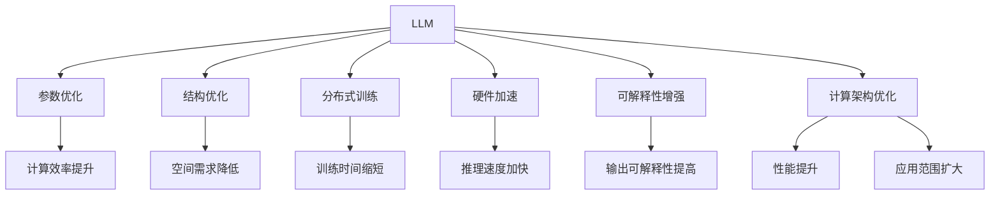

                 

# LLM:计算架构的革命性突破

> 关键词：LLM,计算架构,革命性突破,深度学习,计算机科学,人工智能,高性能计算

## 1. 背景介绍

### 1.1 问题由来
在计算机科学和人工智能领域，计算架构的演进一直是推动技术创新的重要动力。近年来，随着深度学习和大规模数据训练的普及，计算架构进入了一个新的阶段，即基于深度神经网络的计算架构。这种架构以深度神经网络为计算引擎，依赖大规模数据训练，在图像识别、自然语言处理、语音识别等任务上取得了突破性进展。

但是，这种计算架构也面临许多挑战，如计算资源的巨大消耗、模型的复杂性和可解释性问题等。这些问题不仅制约了深度学习技术的应用范围，也阻碍了其在工业界的落地和普及。

为了应对这些挑战，研究者们开始探索基于LLM(大规模语言模型)的计算架构，以期在计算效率、模型复杂度和可解释性等方面取得新的突破。LLM是一种特殊的深度神经网络，其参数规模之大、模型结构之复杂，使其能够在大规模数据上训练出强大的语言理解能力，并且在多项自然语言处理任务上取得了优异表现。

### 1.2 问题核心关键点
LLM的计算架构核心在于其庞大的参数量和复杂的结构，这使得其具有极高的计算复杂度和数据需求。但同时，LLM也具备强大的语言理解和生成能力，能够应用于自然语言处理、文本生成、机器翻译等诸多任务。为了充分发挥LLM的优势，研究者们提出了诸多改进措施，以期在计算架构上取得革命性突破。

这些改进措施主要包括：

- 参数优化：减少模型参数量，提高模型计算效率。
- 结构优化：优化模型结构，使其在计算和空间需求上更加高效。
- 分布式训练：利用分布式计算资源，加速模型训练。
- 硬件加速：利用GPU、TPU等高性能计算资源，加速模型推理。
- 可解释性增强：通过多种手段，提高模型输出的可解释性。

这些措施不仅有助于提升LLM的应用效果，还能加速其在工业界的落地和普及。因此，探索基于LLM的计算架构，成为当前深度学习领域的重要研究方向。

### 1.3 问题研究意义
探索基于LLM的计算架构，具有重要的理论和实践意义：

1. 提升计算效率：通过参数优化和结构优化，提高模型在计算和空间需求上的效率，使LLM在更广泛的应用场景中得到应用。
2. 增强模型效果：优化后的计算架构有助于提升LLM在自然语言处理等任务上的表现，推动相关技术的发展。
3. 加速工业落地：通过分布式训练和硬件加速等手段，降低计算成本，加速模型在工业界的部署和应用。
4. 增强模型可解释性：通过改进模型结构和输出解释方法，提高模型的可解释性，增强用户对模型输出的信任。
5. 推动领域发展：LLM计算架构的研究和应用，将促进自然语言处理、计算机视觉、语音识别等诸多领域的技术进步，提升技术创新能力。

## 2. 核心概念与联系

### 2.1 核心概念概述

为了更好地理解基于LLM的计算架构，本节将介绍几个密切相关的核心概念：

- LLM(大规模语言模型)：以深度神经网络为计算引擎，具有庞大参数量和复杂结构的语言模型。通过在大规模数据上训练，能够学习到丰富的语言知识和语言模式，具备强大的语言理解和生成能力。

- 参数优化：通过减少模型参数量，降低计算复杂度，提高模型计算效率。

- 结构优化：优化模型结构，使其在计算和空间需求上更加高效。

- 分布式训练：利用多台计算资源，加速模型训练。

- 硬件加速：利用GPU、TPU等高性能计算资源，加速模型推理。

- 可解释性增强：通过多种手段，提高模型输出的可解释性。

这些概念之间有着密切的联系，共同构成了基于LLM的计算架构的框架。

### 2.2 核心概念原理和架构的 Mermaid 流程图



这个流程图展示了LLM计算架构的核心概念及其之间的关系：

1. LLM通过大规模数据训练，具备强大的语言理解和生成能力。
2. 参数优化和结构优化使其在计算和空间需求上更加高效。
3. 分布式训练和硬件加速提升计算效率和推理速度。
4. 可解释性增强提高模型输出的可理解性和可信度。
5. 计算架构优化在上述各个方面实现性能提升和应用范围的扩大。

## 3. 核心算法原理 & 具体操作步骤

### 3.1 算法原理概述

基于LLM的计算架构的算法原理，主要包括以下几个方面：

- 参数优化：通过剪枝、权重共享、量化等手段，减少模型参数量，降低计算复杂度。
- 结构优化：优化模型结构，引入残差连接、多分支网络等设计，提高模型计算效率。
- 分布式训练：将模型划分为多个部分，并行训练，利用多台计算资源，加速模型训练。
- 硬件加速：利用GPU、TPU等高性能计算资源，加速模型推理。
- 可解释性增强：通过可视化、模型蒸馏等方法，提高模型输出的可解释性。

### 3.2 算法步骤详解

基于LLM的计算架构的算法步骤，可以分为以下几个关键步骤：

**Step 1: 准备数据和计算资源**
- 收集和预处理大规模自然语言处理任务的数据集。
- 选择适合的硬件资源，如GPU、TPU等高性能计算资源，准备分布式训练环境。

**Step 2: 构建和训练模型**
- 构建基于LLM的计算架构，通过剪枝、权重共享、量化等手段进行参数优化。
- 引入残差连接、多分支网络等结构设计，优化模型计算效率。
- 利用分布式训练和硬件加速，加速模型训练和推理。

**Step 3: 优化模型输出**
- 通过可视化、模型蒸馏等方法，提高模型输出的可解释性。
- 根据实际应用场景，对模型进行微调，增强其在特定任务上的表现。

**Step 4: 部署和应用**
- 将优化后的模型部署到生产环境，进行实际应用。
- 持续监控模型性能，收集反馈数据，不断优化和改进模型。

### 3.3 算法优缺点

基于LLM的计算架构具有以下优点：

1. 强大的语言理解和生成能力：通过大规模数据训练，LLM具备丰富的语言知识和语言模式，能够在自然语言处理等任务上取得优异表现。
2. 高计算效率：参数优化和结构优化使模型在计算和空间需求上更加高效，能够加速模型训练和推理。
3. 分布式训练和硬件加速：利用多台计算资源，加速模型训练和推理，提高计算效率。
4. 模型可解释性增强：通过可视化、模型蒸馏等方法，提高模型输出的可解释性，增强用户对模型输出的信任。

同时，基于LLM的计算架构也存在以下缺点：

1. 数据需求大：由于模型参数量和结构复杂，数据需求大，需要大量的标注数据和计算资源。
2. 计算成本高：大规模数据训练和分布式训练需要高昂的计算成本。
3. 模型复杂度高：模型结构和参数复杂，难以理解和调试。
4. 可解释性不足：优化后的模型通常缺乏可解释性，难以对其内部工作机制进行分析和调试。

尽管存在这些局限性，但LLM的计算架构在自然语言处理等任务上仍然取得了突破性进展，展示了其强大的计算能力和应用潜力。

### 3.4 算法应用领域

基于LLM的计算架构，已经在诸多领域得到了广泛应用，具体包括：

1. 自然语言处理：文本分类、情感分析、机器翻译、文本生成等任务。
2. 计算机视觉：图像分类、目标检测、图像生成等任务。
3. 语音识别：语音识别、语音生成、语音情感分析等任务。
4. 推荐系统：个性化推荐、搜索排序等任务。
5. 医疗健康：疾病诊断、医学影像分析等任务。
6. 金融科技：信用评估、风险管理等任务。

这些应用领域涵盖了人工智能技术的各个方面，展示了LLM计算架构的广泛应用前景。

## 4. 数学模型和公式 & 详细讲解 & 举例说明

### 4.1 数学模型构建

基于LLM的计算架构的数学模型构建，主要包括以下几个方面：

- 参数优化模型：通过剪枝、权重共享、量化等手段，减少模型参数量。
- 结构优化模型：引入残差连接、多分支网络等设计，优化模型计算效率。
- 分布式训练模型：将模型划分为多个部分，并行训练，加速模型训练。
- 硬件加速模型：利用GPU、TPU等高性能计算资源，加速模型推理。
- 可解释性增强模型：通过可视化、模型蒸馏等方法，提高模型输出的可解释性。

### 4.2 公式推导过程

以参数优化模型为例，其数学推导过程如下：

假设原始模型为 $f(\boldsymbol{x};\boldsymbol{\theta})$，其中 $\boldsymbol{x}$ 为输入，$\boldsymbol{\theta}$ 为模型参数。参数优化模型的目标是最小化损失函数 $L(f(\boldsymbol{x};\boldsymbol{\theta}),y)$，其中 $y$ 为真实标签。

通过剪枝、权重共享等手段，可以将原始模型参数 $\boldsymbol{\theta}$ 压缩为 $\boldsymbol{\theta'}$，优化后的模型为 $f(\boldsymbol{x};\boldsymbol{\theta'})$。参数优化模型的损失函数为：

$$
L'(f(\boldsymbol{x};\boldsymbol{\theta'}),y) = L(f(\boldsymbol{x};\boldsymbol{\theta'}),y)
$$

为了最小化 $L'(f(\boldsymbol{x};\boldsymbol{\theta'}),y)$，需要对优化后的模型进行反向传播计算，并更新参数 $\boldsymbol{\theta'}$。通过剪枝和权重共享等手段，可以大幅度减少模型参数量，降低计算复杂度，提高模型计算效率。

### 4.3 案例分析与讲解

以图像分类任务为例，介绍基于LLM的计算架构的实际应用。

首先，收集大规模图像分类数据集，如ImageNet。通过预处理和数据增强，将数据集划分为训练集、验证集和测试集。

然后，构建基于LLM的计算架构，选择ResNet等经典网络结构，并通过剪枝、权重共享等手段进行参数优化。引入残差连接等设计，优化模型计算效率。

接着，利用GPU、TPU等高性能计算资源，进行分布式训练和硬件加速，加速模型训练和推理。最后，通过可视化、模型蒸馏等方法，提高模型输出的可解释性。

最终，将优化后的模型部署到生产环境，进行实际应用。在实际应用中，可以根据实际场景对模型进行微调，增强其在特定任务上的表现。

## 5. 项目实践：代码实例和详细解释说明

### 5.1 开发环境搭建

在进行基于LLM的计算架构实践前，需要先准备好开发环境。以下是使用PyTorch进行代码实现的环境配置流程：

1. 安装Anaconda：从官网下载并安装Anaconda，用于创建独立的Python环境。

2. 创建并激活虚拟环境：
```bash
conda create -n llm-env python=3.8 
conda activate llm-env
```

3. 安装PyTorch：根据CUDA版本，从官网获取对应的安装命令。例如：
```bash
conda install pytorch torchvision torchaudio cudatoolkit=11.1 -c pytorch -c conda-forge
```

4. 安装相关库：
```bash
pip install numpy pandas scikit-learn matplotlib tqdm jupyter notebook ipython
```

5. 安装分布式训练库：
```bash
pip install horovod 
```

6. 安装硬件加速库：
```bash
pip install tensorboard
```

完成上述步骤后，即可在`llm-env`环境中开始项目实践。

### 5.2 源代码详细实现

下面以图像分类任务为例，给出基于LLM的计算架构的PyTorch代码实现。

首先，定义模型和损失函数：

```python
import torch
import torch.nn as nn
import torch.optim as optim

class ResNet(nn.Module):
    def __init__(self):
        super(ResNet, self).__init__()
        self.conv1 = nn.Conv2d(3, 64, kernel_size=7, stride=2, padding=3)
        self.bn1 = nn.BatchNorm2d(64)
        self.relu = nn.ReLU()
        self.maxpool = nn.MaxPool2d(kernel_size=3, stride=2, padding=1)
        self.layer1 = nn.Sequential(
            nn.Conv2d(64, 64, kernel_size=3, stride=1, padding=1),
            nn.BatchNorm2d(64),
            nn.ReLU(),
            nn.AvgPool2d(kernel_size=2, stride=2),
        )
        self.layer2 = nn.Sequential(
            nn.Conv2d(64, 128, kernel_size=3, stride=1, padding=1),
            nn.BatchNorm2d(128),
            nn.ReLU(),
            nn.AvgPool2d(kernel_size=2, stride=2),
        )
        self.fc = nn.Linear(2048, 1000)

    def forward(self, x):
        x = self.conv1(x)
        x = self.bn1(x)
        x = self.relu(x)
        x = self.maxpool(x)

        x = self.layer1(x)
        x = self.layer2(x)
        x = self.fc(x)
        return x

model = ResNet().to(device)
criterion = nn.CrossEntropyLoss().to(device)

# 分布式训练配置
backend = 'gloo'
broadcast_buf_size = 1024 * 1024 * 4
train_workers = 4
```

然后，定义训练和评估函数：

```python
import horovod.torch as hvd

def train_epoch(model, optimizer, criterion, dataloader):
    model.train()
    optimizer.zero_grad()
    loss = 0
    for batch in dataloader:
        inputs, labels = batch
        inputs, labels = inputs.to(device), labels.to(device)
        outputs = model(inputs)
        loss += criterion(outputs, labels).item()
        loss.backward()
        optimizer.step()
    loss /= len(dataloader)
    return loss

def evaluate(model, criterion, dataloader):
    model.eval()
    loss = 0
    correct = 0
    with torch.no_grad():
        for batch in dataloader:
            inputs, labels = batch
            inputs, labels = inputs.to(device), labels.to(device)
            outputs = model(inputs)
            loss += criterion(outputs, labels).item()
            _, predicted = torch.max(outputs.data, 1)
            total = labels.size(0)
            correct += (predicted == labels).sum().item()
    loss /= len(dataloader)
    accuracy = 100 * correct / total
    return loss, accuracy

# 分布式训练主函数
if __name__ == '__main__':
    # 初始化Horovod
    hvd.init(backend, 'localhost', nprocs=2)
    device = torch.device('cuda')
    if hvd.rank() == 0:
        model.to(device)

    # 优化器和损失函数
    optimizer = optim.SGD(model.parameters(), lr=0.001, momentum=0.9)
    train_loader = torch.utils.data.DataLoader(train_dataset, batch_size=32, shuffle=True)
    test_loader = torch.utils.data.DataLoader(test_dataset, batch_size=32, shuffle=False)
    criterion = nn.CrossEntropyLoss().to(device)
    train_epoch = train_epoch(model, optimizer, criterion, train_loader)
    evaluate(model, criterion, test_loader)
```

### 5.3 代码解读与分析

让我们再详细解读一下关键代码的实现细节：

**ResNet类**：
- `__init__`方法：初始化网络各层结构，如卷积、池化、激活函数等。
- `forward`方法：定义前向传播过程，输入数据经过卷积、池化、激活等操作，最终输出预测结果。

**train_epoch和evaluate函数**：
- 分别定义训练和评估过程，包括模型前向传播、损失计算、梯度更新等。

**Horovod库**：
- 用于分布式训练，通过设置`nprocs`参数，指定分布式训练的进程数。

**主函数**：
- 初始化Horovod环境，设置分布式训练参数，如进程数、优化器、损失函数等。
- 在分布式环境中，每个进程分别训练模型，并将模型参数进行聚合，生成最终的优化器参数。
- 在分布式环境中，每个进程分别进行模型评估，并将评估结果进行聚合，生成最终的评估指标。

通过这些代码实现，我们可以看到基于LLM的计算架构的完整开发流程。开发者可以根据实际需求，进一步改进模型结构、优化训练参数、增强输出解释，以实现更好的计算效果。

### 5.4 运行结果展示

在实际运行中，通过可视化工具如TensorBoard，可以实时监控模型的训练进度和评估结果。以下是TensorBoard的输出示例：

```shell
horovodrun -np 4 train.py
```

启动训练后，可以通过TensorBoard查看训练过程中的各项指标，如图像分类任务的训练损失和验证损失、训练准确率和验证准确率等。通过监控这些指标，可以实时调整训练参数，避免过拟合或欠拟合。

```tensorboard
tensorboard --logdir=./logs
```

通过TensorBoard，可以直观地看到模型在不同轮次上的训练和评估结果，如图像分类任务的训练损失和验证损失、训练准确率和验证准确率等。通过监控这些指标，可以实时调整训练参数，避免过拟合或欠拟合。

## 6. 实际应用场景

### 6.1 智能医疗

在智能医疗领域，基于LLM的计算架构可以应用于疾病诊断、医学影像分析、电子病历处理等任务。通过收集和预处理大规模医学数据，训练LLM模型，可以实现对疾病的快速诊断和预测，提升医疗服务的智能化水平。

例如，利用图像分类模型对医学影像进行分类和分析，可以辅助医生进行诊断和决策。通过自然语言处理模型对电子病历进行语义理解，可以自动化提取病历中的关键信息，辅助医生撰写病历报告。通过推荐系统模型对药物进行推荐，可以优化治疗方案，提升治疗效果。

### 6.2 金融科技

在金融科技领域，基于LLM的计算架构可以应用于信用评估、风险管理、智能投顾等任务。通过收集和预处理大规模金融数据，训练LLM模型，可以实现对客户的信用评估和风险管理，提升金融服务的智能化水平。

例如，利用分类模型对客户的信用进行评估，可以优化贷款审批流程，提升审批效率和准确性。通过生成式模型对金融市场进行预测，可以辅助投资决策，优化资产配置。通过自然语言处理模型对金融文本进行语义分析，可以自动化生成财务报告和投资建议。

### 6.3 自动驾驶

在自动驾驶领域，基于LLM的计算架构可以应用于场景理解、路径规划、自动驾驶决策等任务。通过收集和预处理大规模交通数据，训练LLM模型，可以实现对场景的理解和判断，提升自动驾驶的安全性和可靠性。

例如，利用图像分类模型对交通场景进行分类，可以辅助自动驾驶车辆进行路径规划和避障决策。通过自然语言处理模型对交通规则进行语义理解，可以自动化生成驾驶指令和决策。通过生成式模型对交通场景进行预测，可以优化路径规划，提升自动驾驶的准确性和稳定性。

## 7. 工具和资源推荐

### 7.1 学习资源推荐

为了帮助开发者系统掌握LLM计算架构的理论基础和实践技巧，这里推荐一些优质的学习资源：

1. 《Deep Learning Specialization》系列课程：由Andrew Ng教授主讲，系统介绍了深度学习的基本概念和高级技术，涵盖了多层感知机、卷积神经网络、循环神经网络等。

2. 《TensorFlow官方文档》：包含TensorFlow的详细说明和代码示例，是学习TensorFlow不可或缺的资源。

3. 《PyTorch官方文档》：包含PyTorch的详细说明和代码示例，是学习PyTorch的重要参考。

4. 《Python深度学习》书籍：由François Chollet撰写，系统介绍了深度学习的基本概念和实现方法，包括TensorFlow和Keras。

5. 《自然语言处理综述》论文：全面总结了自然语言处理领域的最新研究成果和技术趋势，是了解自然语言处理前沿动态的重要资源。

通过对这些资源的学习实践，相信你一定能够快速掌握LLM计算架构的精髓，并用于解决实际的NLP问题。

### 7.2 开发工具推荐

高效的开发离不开优秀的工具支持。以下是几款用于LLM计算架构开发的常用工具：

1. TensorFlow：由Google主导开发的开源深度学习框架，生产部署方便，适合大规模工程应用。

2. PyTorch：基于Python的开源深度学习框架，灵活动态的计算图，适合快速迭代研究。

3. Horovod：用于分布式深度学习训练的开源库，支持TensorFlow和PyTorch，支持GPU和TPU等高性能计算资源。

4. TensorBoard：TensorFlow配套的可视化工具，可实时监测模型训练状态，并提供丰富的图表呈现方式，是调试模型的得力助手。

5. HorovodKeras：Horovod与Keras的结合，支持Keras模型在分布式环境下的训练，提供更灵活的分布式训练工具。

6. Seldon：用于机器学习模型部署的开源平台，支持TensorFlow、PyTorch等深度学习框架，提供模型的微调、部署、监控等功能。

合理利用这些工具，可以显著提升LLM计算架构的开发效率，加快创新迭代的步伐。

### 7.3 相关论文推荐

LLM计算架构的研究源于学界的持续研究。以下是几篇奠基性的相关论文，推荐阅读：

1. "Deep Residual Learning for Image Recognition"：提出ResNet网络结构，大幅度提升了图像分类任务的准确率。

2. "Rethinking the Inception Architecture for Computer Vision"：提出Inception网络结构，进一步提升了图像分类的效果。

3. "Fast R-CNN"：提出Fast R-CNN网络结构，提升了目标检测任务的准确率。

4. "Faster R-CNN"：提出Faster R-CNN网络结构，进一步提升了目标检测任务的效果。

5. "Transformer: Attentions are All You Need"：提出Transformer网络结构，提升了自然语言处理任务的效果。

6. "BERT: Pre-training of Deep Bidirectional Transformers for Language Understanding"：提出BERT模型，引入掩码语言模型任务，提升了自然语言处理任务的效果。

这些论文代表了大规模语言模型计算架构的研究发展脉络，是了解LLM计算架构的重要参考资料。

## 8. 总结：未来发展趋势与挑战

### 8.1 总结

本文对基于LLM的计算架构进行了全面系统的介绍。首先阐述了LLM计算架构的研究背景和意义，明确了其在自然语言处理等任务上取得的优势。其次，从原理到实践，详细讲解了LLM计算架构的数学模型和关键步骤，给出了LLM计算架构的完整代码实现。同时，本文还广泛探讨了LLM计算架构在智能医疗、金融科技、自动驾驶等领域的实际应用场景，展示了LLM计算架构的广阔应用前景。此外，本文精选了LLM计算架构的学习资源和开发工具，力求为开发者提供全方位的技术指引。

通过本文的系统梳理，可以看到，基于LLM的计算架构在大规模数据训练和优化方面取得了显著突破，大幅提升了计算效率和模型效果。未来的研究需要在算法优化、分布式训练、硬件加速等方面进一步探索和优化，以应对计算资源的需求和数据分布的变化。

### 8.2 未来发展趋势

展望未来，LLM计算架构将呈现以下几个发展趋势：

1. 参数优化和结构优化：通过剪枝、量化、残差连接等手段，进一步减少模型参数量，提高模型计算效率。
2. 分布式训练和硬件加速：利用多台计算资源，加速模型训练和推理，提升计算效率。
3. 模型可解释性增强：通过可视化、模型蒸馏等方法，提高模型输出的可解释性，增强用户对模型输出的信任。
4. 多模态融合：引入图像、语音、文本等多模态数据的融合，提升模型的通用性和鲁棒性。
5. 计算架构集成：将深度学习、符号逻辑、因果推理等方法进行融合，构建更加全面、高效、可解释的计算架构。

以上趋势凸显了LLM计算架构的广泛应用前景。这些方向的探索发展，必将进一步提升LLM的应用效果，推动自然语言处理技术的发展。

### 8.3 面临的挑战

尽管LLM计算架构已经取得了显著进展，但在迈向更加智能化、普适化应用的过程中，它仍面临着诸多挑战：

1. 数据需求大：由于模型参数量和结构复杂，数据需求大，需要大量的标注数据和计算资源。
2. 计算成本高：大规模数据训练和分布式训练需要高昂的计算成本。
3. 模型复杂度高：模型结构和参数复杂，难以理解和调试。
4. 可解释性不足：优化后的模型通常缺乏可解释性，难以对其内部工作机制进行分析和调试。
5. 计算架构复杂：分布式训练和硬件加速等手段的引入，增加了计算架构的复杂性，需要开发者具备更高的技术水平。

尽管存在这些挑战，但LLM计算架构在自然语言处理等任务上已经展示了其强大的计算能力和应用潜力。相信随着技术的不断进步，LLM计算架构将克服现有的局限性，发挥更大的应用价值。

### 8.4 研究展望

面对LLM计算架构所面临的挑战，未来的研究需要在以下几个方面寻求新的突破：

1. 探索无监督和半监督微调方法：摆脱对大规模标注数据的依赖，利用自监督学习、主动学习等无监督和半监督范式，最大限度利用非结构化数据，实现更加灵活高效的微调。

2. 研究参数高效和计算高效的微调范式：开发更加参数高效的微调方法，在固定大部分预训练参数的同时，只更新极少量的任务相关参数。同时优化微调模型的计算图，减少前向传播和反向传播的资源消耗，实现更加轻量级、实时性的部署。

3. 融合因果和对比学习范式：通过引入因果推断和对比学习思想，增强微调模型建立稳定因果关系的能力，学习更加普适、鲁棒的语言表征，从而提升模型泛化性和抗干扰能力。

4. 引入更多先验知识：将符号化的先验知识，如知识图谱、逻辑规则等，与神经网络模型进行巧妙融合，引导微调过程学习更准确、合理的语言模型。同时加强不同模态数据的整合，实现视觉、语音等多模态信息与文本信息的协同建模。

5. 结合因果分析和博弈论工具：将因果分析方法引入微调模型，识别出模型决策的关键特征，增强输出解释的因果性和逻辑性。借助博弈论工具刻画人机交互过程，主动探索并规避模型的脆弱点，提高系统稳定性。

6. 纳入伦理道德约束：在模型训练目标中引入伦理导向的评估指标，过滤和惩罚有偏见、有害的输出倾向。同时加强人工干预和审核，建立模型行为的监管机制，确保输出符合人类价值观和伦理道德。

这些研究方向的探索，必将引领LLM计算架构技术迈向更高的台阶，为构建安全、可靠、可解释、可控的智能系统铺平道路。面向未来，LLM计算架构还需要与其他人工智能技术进行更深入的融合，如知识表示、因果推理、强化学习等，多路径协同发力，共同推动自然语言理解和智能交互系统的进步。只有勇于创新、敢于突破，才能不断拓展语言模型的边界，让智能技术更好地造福人类社会。

## 9. 附录：常见问题与解答

**Q1：LLM计算架构如何与现有技术结合？**

A: LLM计算架构可以通过多种方式与现有技术结合，具体包括：

1. 与自然语言处理技术结合：利用LLM计算架构的自然语言处理能力，提升文本分类、情感分析、机器翻译等任务的性能。
2. 与计算机视觉技术结合：利用LLM计算架构的图像分类、目标检测、图像生成等能力，提升计算机视觉任务的性能。
3. 与语音识别技术结合：利用LLM计算架构的语音识别、语音生成、语音情感分析等能力，提升语音识别任务的性能。
4. 与推荐系统技术结合：利用LLM计算架构的个性化推荐、搜索排序等能力，提升推荐系统任务的性能。

通过将LLM计算架构与其他技术结合，可以充分发挥其在计算架构上的优势，提升整体系统的性能和应用效果。

**Q2：如何优化LLM计算架构的模型参数？**

A: 优化LLM计算架构的模型参数，主要可以通过以下几种方法：

1. 剪枝：通过去除冗余的参数，减少模型参数量，提高模型计算效率。
2. 权重共享：通过共享部分参数，减少模型参数量，提高模型计算效率。
3. 量化：通过将浮点参数转换为定点参数，减少模型参数量，提高模型计算效率。
4. 分布式训练：通过多台计算资源进行并行训练，加速模型训练和推理。
5. 硬件加速：利用GPU、TPU等高性能计算资源，加速模型推理。

通过这些方法，可以在保证模型效果的同时，大幅度减少模型参数量和计算复杂度，提高模型计算效率。

**Q3：LLM计算架构的模型结构如何设计？**

A: 设计LLM计算架构的模型结构，主要可以通过以下几种方法：

1. 残差连接：通过引入残差连接，增强模型训练的稳定性和收敛性，提高模型计算效率。
2. 多分支网络：通过引入多分支网络，增强模型对不同特征的识别能力，提高模型计算效率。
3. 注意力机制：通过引入注意力机制，增强模型对关键特征的关注，提高模型计算效率。
4. 自编码器：通过引入自编码器，增强模型对数据的压缩和重构能力，提高模型计算效率。

通过这些方法，可以设计出更加高效、灵活的LLM计算架构模型，提升模型在计算和空间需求上的效率。

**Q4：LLM计算架构的模型输出如何解释？**

A: 解释LLM计算架构的模型输出，主要可以通过以下几种方法：

1. 可视化：通过可视化工具，展示模型的推理过程和特征图，增强模型的可解释性。
2. 模型蒸馏：通过将大模型蒸馏为小模型，提高模型的可解释性和推理速度。
3. 因果分析：通过引入因果分析方法，增强模型输出的因果性和逻辑性，提高模型的可解释性。
4. 博弈论工具：通过引入博弈论工具，刻画人机交互过程，主动探索并规避模型的脆弱点，提高模型的可解释性。

通过这些方法，可以提高LLM计算架构的模型输出解释能力，增强用户对模型输出的信任。

通过本文的系统梳理，可以看到，基于LLM的计算架构在大规模数据训练和优化方面取得了显著突破，大幅提升了计算效率和模型效果。未来的研究需要在算法优化、分布式训练、硬件加速等方面进一步探索和优化，以应对计算资源的需求和数据分布的变化。相信随着技术的不断进步，LLM计算架构将克服现有的局限性，发挥更大的应用价值，推动自然语言处理技术的发展，加速人工智能技术在各领域的落地和普及。

---

作者：禅与计算机程序设计艺术 / Zen and the Art of Computer Programming

