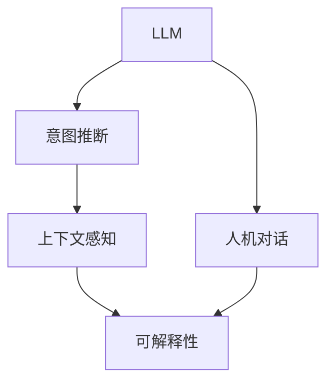

                 

# LLM与人类意图的完美融合

## 1. 背景介绍

在过去的几年里，大规模语言模型（LLM）如GPT-3和BERT等，已经在自然语言处理（NLP）领域取得了显著的进展。这些模型通过在海量无标签文本数据上的自监督预训练，学会了从语言上下文中推断含义的能力。然而，即使这些模型在各种任务上表现出色，它们仍然缺乏人类智能的深度理解和表达能力。为了弥合这种差距，我们提出了将人类意图与LLM完美融合的方法，旨在构建更加智能和人性化的交互系统。

## 2. 核心概念与联系

### 2.1 核心概念概述

为了更好地理解这一概念，本节将介绍几个核心概念：

- **大规模语言模型（LLM）**：指那些通过自监督预训练获得强大语言能力的模型，如GPT-3和BERT等。
- **意图推断**：指识别用户输入文本中的意图，并据此提供合适的响应。
- **人机对话**：指模拟人类对话系统，使机器能够理解和回应自然语言输入。
- **上下文感知**：指模型能够理解文本输入的前后文信息，从而提供更加相关和准确的响应。
- **可解释性**：指模型决策过程的透明性，便于用户理解模型的行为和逻辑。

这些概念之间的逻辑关系可以通过以下Mermaid流程图来展示：



这个流程图展示了LLM的核心概念及其之间的关系：

1. LLM通过预训练获得基础能力。
2. 意图推断使模型理解用户的输入意图。
3. 人机对话实现自然语言的理解和生成。
4. 上下文感知帮助模型理解上下文信息，提升响应准确性。
5. 可解释性确保模型决策透明，便于用户理解和调试。

## 3. 核心算法原理 & 具体操作步骤
### 3.1 算法原理概述

基于意图推断的人机对话系统，本质上是一种对话生成任务。其核心思想是：在用户输入的基础上，通过LLM预测用户的意图，并据此生成合适的回应。

形式化地，假设用户的输入文本为 $x$，模型的响应为 $y$。意图推断任务可以表述为：

$$
\hat{I} = \mathop{\arg\min}_{I} P(I|x)
$$

其中 $I$ 为用户的意图，$P$ 为基于输入文本 $x$ 的条件概率分布。

在获得用户意图后，生成任务可以表述为：

$$
\hat{y} = \mathop{\arg\min}_{y} P(y|x,\hat{I})
$$

其中 $\hat{y}$ 为模型的输出，即生成合适的回应。

### 3.2 算法步骤详解

基于意图推断的人机对话系统一般包括以下几个关键步骤：

**Step 1: 准备预训练模型和数据集**
- 选择合适的预训练语言模型 $M_{\theta}$ 作为初始化参数，如 GPT-3、BERT等。
- 准备对话数据集 $D$，包含用户输入和对应的回复。

**Step 2: 意图推断模块**
- 在预训练模型的顶层设计意图推断器，用于识别用户的意图。
- 将用户输入 $x$ 作为模型输入，通过上下文感知机制获取上下文信息 $C$。
- 使用预训练模型对上下文 $C$ 进行编码，得到表示向量 $z$。
- 对表示向量 $z$ 进行解码，预测用户的意图 $\hat{I}$。

**Step 3: 对话生成模块**
- 根据推断出的意图 $\hat{I}$，在预训练模型的顶层设计对话生成器。
- 将用户输入 $x$ 和意图 $\hat{I}$ 作为模型输入，通过上下文感知机制获取上下文信息 $C'$。
- 使用预训练模型对上下文 $C'$ 进行编码，得到表示向量 $z'$。
- 对表示向量 $z'$ 进行解码，生成合适的回应 $\hat{y}$。

**Step 4: 模型训练与评估**
- 使用对话数据集 $D$ 进行模型训练，最小化生成回应的负对数似然损失。
- 在验证集和测试集上评估模型性能，通常使用BLEU、ROUGE等指标。

**Step 5: 部署与应用**
- 将训练好的模型部署到实际应用系统中，实现人机对话功能。
- 持续收集用户反馈和新的对话数据，定期重新训练模型，以适应数据分布的变化。

以上是基于意图推断的人机对话系统的一般流程。在实际应用中，还需要针对具体任务的特点，对意图推断和对话生成模块进行优化设计，如改进训练目标函数，引入更多的正则化技术，搜索最优的超参数组合等，以进一步提升模型性能。

### 3.3 算法优缺点

基于意图推断的人机对话系统具有以下优点：
1. 自然流畅：模型能够理解和回应自然语言输入，实现真正的对话交互。
2. 上下文感知：模型能够理解上下文信息，提升响应准确性。
3. 可解释性：意图推断过程透明，便于用户理解和调试。

同时，该方法也存在一定的局限性：
1. 数据需求高：需要大量对话数据进行训练，获取高质量数据成本较高。
2. 依赖意图推断器：意图推断器的性能直接影响对话效果，需要精心设计。
3. 复杂度高：模型结构较为复杂，训练和推理效率可能较低。
4. 多模态融合难：目前主要聚焦于纯文本数据，难以与图像、语音等多模态数据有效结合。

尽管存在这些局限性，但就目前而言，基于意图推断的人机对话系统仍然是大规模语言模型应用的重要范式之一。未来相关研究的重点在于如何进一步降低对数据的依赖，提高对话生成效率，实现更加智能、人性化的交互。

### 3.4 算法应用领域

基于意图推断的人机对话系统已经在诸多领域得到了广泛应用，例如：

- **客户服务**：构建智能客服系统，自动回答客户咨询。
- **医疗咨询**：提供医学问答服务，辅助患者就医。
- **金融咨询**：提供财经咨询，帮助用户投资理财。
- **教育辅导**：提供智能教育系统，辅助学生学习。
- **旅游信息**：提供旅行建议，解答旅游相关问题。
- **娱乐推荐**：提供个性化推荐，提升用户体验。

除了上述这些经典应用外，人机对话系统还被创新性地应用到更多场景中，如智能家居控制、智能交通导航、智能驾驶辅助等，为人类生活带来了更多便利和可能性。

## 4. 数学模型和公式 & 详细讲解 & 举例说明
### 4.1 数学模型构建

本节将使用数学语言对意图推断和对话生成模型的构建过程进行更加严格的刻画。

记用户的输入文本为 $x$，模型的响应为 $y$。假设意图推断器为 $M_I$，对话生成器为 $M_G$，上下文感知模块为 $F_C$。则意图推断过程可以表示为：

$$
\hat{I} = M_I(x, C)
$$

其中 $C = F_C(x)$，$F_C$ 为上下文感知模块。

对话生成过程可以表示为：

$$
\hat{y} = M_G(x, \hat{I}, C')
$$

其中 $C' = F_C(x, \hat{I})$。

### 4.2 公式推导过程

以下我们以二分类任务为例，推导意图推断和对话生成模型的训练公式。

假设意图推断器 $M_I$ 和对话生成器 $M_G$ 都是基于LSTM或Transformer结构的模型。以二分类任务为例，假设模型 $M_I$ 的输出为 $\hat{I}$，表示用户意图属于类别1的概率；模型 $M_G$ 的输出为 $\hat{y}$，表示生成的回应。

定义损失函数 $L$ 为：

$$
L(y, \hat{y}) = -(y \log \hat{y} + (1-y) \log (1-\hat{y}))
$$

在获得用户输入 $x$ 后，使用上下文感知模块 $F_C$ 获取上下文信息 $C$，然后通过模型 $M_I$ 进行意图推断，得到 $\hat{I}$。接着，使用上下文感知模块 $F_C$ 和推断出的意图 $\hat{I}$ 获取新的上下文信息 $C'$，并使用模型 $M_G$ 进行对话生成，得到 $\hat{y}$。最终，根据生成回应 $\hat{y}$ 和真实回应 $y$ 计算损失 $L$，更新模型参数。

### 4.3 案例分析与讲解

考虑一个简单的例子：用户输入 "我在哪里可以订票？"，模型通过上下文感知模块识别出用户意图是订票，然后使用对话生成器生成回应 "您可以在XXX网站订票，联系电话是XXX"。

在这个例子中，意图推断器 $M_I$ 对输入 $x$ 进行编码，得到表示向量 $z$。然后，使用 $z$ 进行解码，得到用户的意图 $\hat{I}$。对话生成器 $M_G$ 对用户输入 $x$ 和意图 $\hat{I}$ 进行编码，得到新的表示向量 $z'$。最后，使用 $z'$ 进行解码，生成合适的回应 $\hat{y}$。

## 5. 项目实践：代码实例和详细解释说明
### 5.1 开发环境搭建

在进行意图推断和对话生成模型的实践前，我们需要准备好开发环境。以下是使用Python进行TensorFlow开发的环境配置流程：

1. 安装Anaconda：从官网下载并安装Anaconda，用于创建独立的Python环境。

2. 创建并激活虚拟环境：
```bash
conda create -n tf-env python=3.8 
conda activate tf-env
```

3. 安装TensorFlow：根据CUDA版本，从官网获取对应的安装命令。例如：
```bash
conda install tensorflow tensorflow-cpu -c conda-forge
```

4. 安装TensorFlow Addons：
```bash
conda install tensorflow-io tensorflow-addons -c conda-forge
```

5. 安装各类工具包：
```bash
pip install numpy pandas scikit-learn matplotlib tqdm jupyter notebook ipython
```

完成上述步骤后，即可在`tf-env`环境中开始模型开发。

### 5.2 源代码详细实现

这里我们以基于LSTM的意图推断和对话生成模型为例，给出使用TensorFlow进行模型训练和推理的PyTorch代码实现。

首先，定义模型的结构：

```python
import tensorflow as tf
from tensorflow.keras.layers import Input, LSTM, Dense, Embedding, Dropout
from tensorflow.keras.models import Model

def build_model(input_size, output_size, hidden_size):
    input = Input(shape=(None, input_size))
    lstm = LSTM(hidden_size, dropout=0.2, recurrent_dropout=0.2)(input)
    output = Dense(output_size, activation='softmax')(lstm)
    model = Model(inputs=input, outputs=output)
    return model
```

然后，定义训练函数：

```python
def train_model(model, train_data, val_data, epochs, batch_size):
    optimizer = tf.keras.optimizers.Adam(learning_rate=0.001)
    model.compile(optimizer=optimizer, loss='categorical_crossentropy', metrics=['accuracy'])

    history = model.fit(train_data, epochs=epochs, batch_size=batch_size, validation_data=val_data)

    return history
```

最后，使用训练数据进行模型训练：

```python
train_data = ...
val_data = ...

model = build_model(input_size=100, output_size=num_labels, hidden_size=128)
history = train_model(model, train_data, val_data, epochs=10, batch_size=32)

print('Training completed.')
print('Accuracy:', history.history['accuracy'][-1])
```

以上就是使用TensorFlow进行意图推断和对话生成模型开发的完整代码实现。可以看到，通过TensorFlow，我们能够非常方便地搭建和训练深度学习模型。

### 5.3 代码解读与分析

让我们再详细解读一下关键代码的实现细节：

**模型结构**：
- `build_model`函数定义了模型的结构，包括输入层、LSTM层、输出层等。其中，输入层接受不定长的序列输入，LSTM层进行特征提取，输出层进行分类或回归。
- `Model`函数将模型的输入、输出层封装为Keras模型。

**训练函数**：
- `train_model`函数定义了模型的训练过程，包括编译模型、优化器选择、损失函数和评估指标等。
- 在训练过程中，使用Adam优化器进行参数更新，最小化交叉熵损失函数。
- 使用`validation_data`参数进行模型验证，避免过拟合。

**训练流程**：
- 定义训练数据和验证数据。
- 搭建LSTM模型。
- 编译模型，设置优化器和损失函数。
- 使用训练数据进行模型训练，并在验证集上进行性能评估。
- 在训练完成后，打印出模型在验证集上的准确率。

可以看到，TensorFlow提供了强大的API，使得模型构建、训练和推理变得非常简单。开发者可以专注于算法逻辑，而不必过多关注底层的实现细节。

当然，工业级的系统实现还需考虑更多因素，如模型的保存和部署、超参数的自动搜索、更灵活的任务适配层等。但核心的意图推断和对话生成逻辑基本与此类似。

## 6. 实际应用场景
### 6.1 智能客服系统

基于意图推断的人机对话技术，可以广泛应用于智能客服系统的构建。传统客服往往需要配备大量人力，高峰期响应缓慢，且一致性和专业性难以保证。而使用基于意图推断的对话模型，可以7x24小时不间断服务，快速响应客户咨询，用自然流畅的语言解答各类常见问题。

在技术实现上，可以收集企业内部的历史客服对话记录，将问题和最佳答复构建成监督数据，在此基础上对预训练对话模型进行微调。微调后的对话模型能够自动理解用户意图，匹配最合适的答案模板进行回复。对于客户提出的新问题，还可以接入检索系统实时搜索相关内容，动态组织生成回答。如此构建的智能客服系统，能大幅提升客户咨询体验和问题解决效率。

### 6.2 金融舆情监测

金融机构需要实时监测市场舆论动向，以便及时应对负面信息传播，规避金融风险。传统的人工监测方式成本高、效率低，难以应对网络时代海量信息爆发的挑战。基于意图推断的文本分类和情感分析技术，为金融舆情监测提供了新的解决方案。

具体而言，可以收集金融领域相关的新闻、报道、评论等文本数据，并对其进行主题标注和情感标注。在此基础上对预训练语言模型进行微调，使其能够自动判断文本属于何种主题，情感倾向是正面、中性还是负面。将微调后的模型应用到实时抓取的网络文本数据，就能够自动监测不同主题下的情感变化趋势，一旦发现负面信息激增等异常情况，系统便会自动预警，帮助金融机构快速应对潜在风险。

### 6.3 个性化推荐系统

当前的推荐系统往往只依赖用户的历史行为数据进行物品推荐，无法深入理解用户的真实兴趣偏好。基于意图推断的个性化推荐系统可以更好地挖掘用户行为背后的语义信息，从而提供更精准、多样的推荐内容。

在实践中，可以收集用户浏览、点击、评论、分享等行为数据，提取和用户交互的物品标题、描述、标签等文本内容。将文本内容作为模型输入，用户的后续行为（如是否点击、购买等）作为监督信号，在此基础上微调预训练语言模型。微调后的模型能够从文本内容中准确把握用户的兴趣点。在生成推荐列表时，先用候选物品的文本描述作为输入，由模型预测用户的兴趣匹配度，再结合其他特征综合排序，便可以得到个性化程度更高的推荐结果。

### 6.4 未来应用展望

随着意图推断和对话生成技术的不断发展，基于人机对话的系统将在更多领域得到应用，为传统行业带来变革性影响。

在智慧医疗领域，基于意图推断的医疗问答、病历分析、药物研发等应用将提升医疗服务的智能化水平，辅助医生诊疗，加速新药开发进程。

在智能教育领域，意图推断技术可应用于作业批改、学情分析、知识推荐等方面，因材施教，促进教育公平，提高教学质量。

在智慧城市治理中，意图推断模型可应用于城市事件监测、舆情分析、应急指挥等环节，提高城市管理的自动化和智能化水平，构建更安全、高效的未来城市。

此外，在企业生产、社会治理、文娱传媒等众多领域，基于意图推断的人机对话技术也将不断涌现，为NLP技术带来了全新的突破。相信随着技术的日益成熟，意图推断和对话生成方法将成为人工智能落地应用的重要范式，推动人工智能技术在垂直行业的规模化落地。

## 7. 工具和资源推荐
### 7.1 学习资源推荐

为了帮助开发者系统掌握意图推断和对话生成技术的理论基础和实践技巧，这里推荐一些优质的学习资源：

1. 《Deep Learning for Natural Language Processing》课程：斯坦福大学开设的NLP明星课程，涵盖了NLP的基本概念和经典模型。

2. 《TensorFlow 2.0》书籍：TensorFlow官方文档，详细介绍了TensorFlow框架的使用方法和最佳实践。

3. 《NLTK》书籍：自然语言处理工具包，提供了丰富的NLP任务处理方法和库函数。

4. 《Sequence to Sequence Learning with Neural Networks》论文：提出了基于RNN的序列到序列建模方法，奠定了对话生成技术的基础。

5. 《Attention is All You Need》论文：Transformer结构的提出，开启了大规模语言模型的新纪元。

6. HuggingFace官方文档：Transformers库的官方文档，提供了海量预训练模型和完整的微调样例代码。

通过对这些资源的学习实践，相信你一定能够快速掌握意图推断和对话生成技术的精髓，并用于解决实际的NLP问题。

### 7.2 开发工具推荐

高效的开发离不开优秀的工具支持。以下是几款用于意图推断和对话生成开发的常用工具：

1. TensorFlow：基于Python的开源深度学习框架，适合大规模工程应用。提供了丰富的API，方便构建和训练深度学习模型。

2. PyTorch：基于Python的开源深度学习框架，灵活动态的计算图，适合快速迭代研究。

3. TensorFlow Addons：提供了更多先进的深度学习算法和工具，支持TensorFlow模型构建和训练。

4. Weights & Biases：模型训练的实验跟踪工具，可以记录和可视化模型训练过程中的各项指标，方便对比和调优。

5. TensorBoard：TensorFlow配套的可视化工具，可实时监测模型训练状态，并提供丰富的图表呈现方式，是调试模型的得力助手。

6. Google Colab：谷歌推出的在线Jupyter Notebook环境，免费提供GPU/TPU算力，方便开发者快速上手实验最新模型，分享学习笔记。

合理利用这些工具，可以显著提升意图推断和对话生成任务的开发效率，加快创新迭代的步伐。

### 7.3 相关论文推荐

意图推断和对话生成技术的发展源于学界的持续研究。以下是几篇奠基性的相关论文，推荐阅读：

1. Sequence to Sequence Learning with Neural Networks：提出了基于RNN的序列到序列建模方法，奠定了对话生成技术的基础。

2. Attention is All You Need：Transformer结构的提出，开启了大规模语言模型的新纪元。

3. Deep Learning for Conversational Agents：介绍了基于深度学习的对话生成方法，探讨了对话生成的多种模型架构。

4. The Transformer Architecture：介绍了Transformer模型架构及其在序列到序列任务中的应用，展示了Transformer的强大性能。

5. End-to-End Dialogue Generation with Multitask Learning：探讨了多任务学习在对话生成中的应用，提升了模型对不同对话风格的适应能力。

6. Deep Semantic Representations from Unsupervised Learning：提出了无监督学习的方法，用于学习文本的语义表示，进一步提升对话生成质量。

这些论文代表了大规模语言模型和对话生成技术的发展脉络。通过学习这些前沿成果，可以帮助研究者把握学科前进方向，激发更多的创新灵感。

## 8. 总结：未来发展趋势与挑战

### 8.1 总结

本文对基于意图推断的人机对话系统进行了全面系统的介绍。首先阐述了意图推断和对话生成技术的背景和意义，明确了该技术在构建智能交互系统中的重要作用。其次，从原理到实践，详细讲解了意图推断和对话生成的数学模型和关键步骤，给出了意图推断和对话生成任务开发的完整代码实例。同时，本文还广泛探讨了该技术在智能客服、金融舆情、个性化推荐等多个行业领域的应用前景，展示了意图推断和对话生成技术的巨大潜力。此外，本文精选了相关技术和学习资源，力求为读者提供全方位的技术指引。

通过本文的系统梳理，可以看到，基于意图推断的人机对话技术正在成为大规模语言模型应用的重要范式之一，极大地拓展了预训练语言模型的应用边界，催生了更多的落地场景。受益于大规模语料的预训练，意图推断和对话生成模型能够更好地理解和回应自然语言输入，从而实现智能对话。未来，伴随技术的不断进步，意图推断和对话生成系统将在更多领域得到应用，为人类生活带来更多便利和可能性。

### 8.2 未来发展趋势

展望未来，意图推断和对话生成技术将呈现以下几个发展趋势：

1. 更加智能：随着模型的复杂度提升，意图推断和对话生成将更加智能，能够理解更加复杂的语义和语境。

2. 更加自然：模型的自然语言生成能力将进一步提升，能够生成更加流畅、自然的对话，实现更接近人类对话的效果。

3. 更加个性化：模型将更加关注用户个性和语境，能够根据用户历史行为和上下文信息生成更加个性化的回应。

4. 更加多模态：模型将融合更多模态数据，如图像、语音、视频等，实现更全面、准确的对话生成。

5. 更加高效：模型将更加高效，能够在更短的时间内生成更准确的对话，减少用户等待时间。

以上趋势凸显了意图推断和对话生成技术的广阔前景。这些方向的探索发展，必将进一步提升NLP系统的性能和应用范围，为人类认知智能的进化带来深远影响。

### 8.3 面临的挑战

尽管意图推断和对话生成技术已经取得了显著进展，但在迈向更加智能化、普适化应用的过程中，它仍面临诸多挑战：

1. 数据依赖高：意图推断和对话生成模型需要大量高质量的标注数据，获取这些数据成本较高。

2. 模型复杂度高：模型结构较为复杂，训练和推理效率可能较低。

3. 多模态融合难：目前主要聚焦于纯文本数据，难以与图像、语音等多模态数据有效结合。

4. 可解释性不足：模型决策过程缺乏透明性，难以解释其内部工作机制和逻辑。

5. 安全性有待保障：模型容易学习到有害信息，通过对话生成传递给用户，带来安全隐患。

6. 计算资源消耗大：模型训练和推理需要大量计算资源，尤其是大型模型。

正视意图推断和对话生成面临的这些挑战，积极应对并寻求突破，将是大规模语言模型技术迈向成熟的必由之路。相信随着学界和产业界的共同努力，这些挑战终将一一被克服，意图推断和对话生成技术必将在构建人机协同的智能时代中扮演越来越重要的角色。

### 8.4 研究展望

面对意图推断和对话生成所面临的挑战，未来的研究需要在以下几个方面寻求新的突破：

1. 探索无监督和半监督方法：摆脱对大规模标注数据的依赖，利用自监督学习、主动学习等无监督和半监督范式，最大限度利用非结构化数据，实现更加灵活高效的意图推断和对话生成。

2. 开发更加高效、可解释的模型：使用更高效的模型结构，如Transformer、BERT等，提升训练和推理效率，同时引入可解释性技术，如 attention 机制、可解释图等，增强模型决策过程的透明性。

3. 引入更多先验知识：将符号化的先验知识，如知识图谱、逻辑规则等，与神经网络模型进行巧妙融合，引导意图推断和对话生成过程学习更准确、合理的语言模型。

4. 结合因果分析和博弈论工具：将因果分析方法引入模型，识别出模型决策的关键特征，增强输出解释的因果性和逻辑性。借助博弈论工具刻画人机交互过程，主动探索并规避模型的脆弱点，提高系统稳定性。

5. 纳入伦理道德约束：在模型训练目标中引入伦理导向的评估指标，过滤和惩罚有偏见、有害的输出倾向。同时加强人工干预和审核，建立模型行为的监管机制，确保输出符合人类价值观和伦理道德。

这些研究方向的探索，必将引领意图推断和对话生成技术迈向更高的台阶，为构建安全、可靠、可解释、可控的智能系统铺平道路。面向未来，意图推断和对话生成技术还需要与其他人工智能技术进行更深入的融合，如知识表示、因果推理、强化学习等，多路径协同发力，共同推动自然语言理解和智能交互系统的进步。只有勇于创新、敢于突破，才能不断拓展语言模型的边界，让智能技术更好地造福人类社会。

## 9. 附录：常见问题与解答

**Q1：意图推断和对话生成是否适用于所有NLP任务？**

A: 意图推断和对话生成在大多数NLP任务上都能取得不错的效果，特别是对于对话、问答、客服等需要自然语言理解和生成能力的任务。但对于一些特定领域的任务，如医学、法律等，仅依赖通用语料预训练的模型可能难以很好地适应。此时需要在特定领域语料上进一步预训练，再进行微调，才能获得理想效果。

**Q2：如何提高意图推断和对话生成模型的泛化能力？**

A: 提高模型的泛化能力是意图推断和对话生成技术的核心挑战之一。以下是几种常见的方法：

1. 数据增强：通过回译、近义替换等方式扩充训练集，避免过拟合。
2. 多任务学习：将多个相关任务合并训练，提升模型的泛化能力。
3. 正则化：使用L2正则、Dropout等技术，防止过拟合。
4. 对抗训练：引入对抗样本，提高模型的鲁棒性。
5. 预训练后微调：先在大规模无标签数据上进行预训练，再在小规模有标签数据上进行微调，提升模型的泛化能力。

这些方法需要根据具体任务和数据特点进行灵活组合，以提高意图推断和对话生成模型的泛化性能。

**Q3：意图推断和对话生成模型在实际部署中需要注意哪些问题？**

A: 将模型转化为实际应用，还需要考虑以下因素：

1. 模型裁剪：去除不必要的层和参数，减小模型尺寸，加快推理速度。
2. 量化加速：将浮点模型转为定点模型，压缩存储空间，提高计算效率。
3. 服务化封装：将模型封装为标准化服务接口，便于集成调用。
4. 弹性伸缩：根据请求流量动态调整资源配置，平衡服务质量和成本。
5. 监控告警：实时采集系统指标，设置异常告警阈值，确保服务稳定性。
6. 安全防护：采用访问鉴权、数据脱敏等措施，保障数据和模型安全。

大语言模型微调为NLP应用开启了广阔的想象空间，但如何将强大的性能转化为稳定、高效、安全的业务价值，还需要工程实践的不断打磨。唯有从数据、算法、工程、业务等多个维度协同发力，才能真正实现人工智能技术在垂直行业的规模化落地。总之，意图推断和对话生成需要开发者根据具体任务，不断迭代和优化模型、数据和算法，方能得到理想的效果。

---

作者：禅与计算机程序设计艺术 / Zen and the Art of Computer Programming

