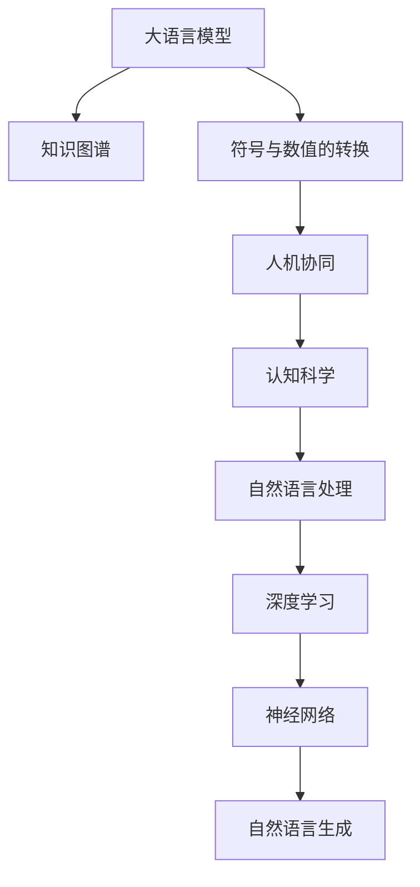

                 

# LLM与人类意图的最大公约数

> 关键词：大语言模型,人类意图,自然语言处理,NLP,符号与数值的转换,知识图谱,人机协同,认知科学

## 1. 背景介绍

### 1.1 问题由来
随着人工智能技术的快速发展，大语言模型(Large Language Models, LLMs)已经成为自然语言处理(Natural Language Processing, NLP)领域的重要研究热点。这些大模型如GPT、BERT等，通过对大规模无标签文本数据进行预训练，学习到了丰富的语言知识和表达能力，能够在多种任务上表现出色。

然而，尽管大语言模型在语言理解和生成方面表现卓越，其核心依然依赖于数据驱动的统计学习，难以捕捉人类深层次的认知和意图。由于人类意图的多样性和复杂性，当前的大模型在理解和生成方面仍存在诸多局限性，难以完全适应人类实际需求。因此，如何在大语言模型中融入人类意图，成为当前AI领域亟待解决的问题。

### 1.2 问题核心关键点
本文聚焦于如何将人类意图与大语言模型相融合，旨在通过符号与数值的转换，构建一个更加智能、贴合人类意图的人工智能系统。这一目标涉及多个关键技术点：

1. **符号与数值的转换**：将人类意图表达形式（如自然语言、符号逻辑等）转化为计算机可处理的数据形式（如向量、矩阵等）。
2. **知识图谱构建**：利用符号与数值转换后的数据，构建包含知识关系和概念结构的知识图谱，用于增强模型的理解能力。
3. **人机协同**：设计基于人机协同的交互框架，使得模型能够通过与人类互动，不断学习和优化自身的理解和生成能力。
4. **认知科学借鉴**：借鉴认知科学的研究成果，理解和模拟人类认知过程，进一步提升模型的智能水平。

这些技术点共同构成了将人类意图融入大语言模型的核心框架，为构建更加智能化的AI系统提供了可能。

### 1.3 问题研究意义
研究人类意图与大语言模型的融合，对于推动人工智能技术的深度发展，具有重要意义：

1. **提升AI系统的智能水平**：通过理解人类意图，AI系统可以更加准确地识别和满足人类需求，提升用户体验和满意度。
2. **促进人机协同**：使AI系统能够主动理解人类行为和意图，提供更具个性化和智能化的服务。
3. **推动认知科学发展**：通过对人类意图的理解和建模，为认知科学的研究提供新的数据和方法，促进跨学科的协同创新。
4. **加速应用落地**：结合人类意图的大语言模型，更容易被各行各业所采用，加速人工智能技术的产业化进程。

## 2. 核心概念与联系

### 2.1 核心概念概述

为更好地理解将人类意图融入大语言模型的核心技术，本节将介绍几个关键概念：

- **大语言模型(Large Language Model, LLM)**：以自回归(如GPT)或自编码(如BERT)模型为代表的大规模预训练语言模型。通过在大规模无标签文本语料上进行预训练，学习到了丰富的语言知识和常识，具备强大的语言理解和生成能力。

- **知识图谱(Knowledge Graph)**：一种用于表示实体、属性和关系的结构化数据形式，广泛应用于人工智能领域，用于增强模型的知识表示和推理能力。

- **符号与数值的转换(Symbol-Value Conversion)**：将符号化的语言（如自然语言、符号逻辑等）转换为计算机可处理的数值形式（如向量、矩阵等）的过程。这一过程是构建符号-数值混合模型（Symbol-Value Hybrid Model）的关键。

- **人机协同(Human-Computer Collaboration)**：指AI系统能够主动与人类交互，根据人类反馈不断优化自身的理解和生成能力的过程。

- **认知科学(Cognitive Science)**：研究人类认知过程和智能机制的跨学科领域，与AI技术紧密相关，为构建智能系统提供理论和数据支持。

这些核心概念之间的逻辑关系可以通过以下Mermaid流程图来展示：



这个流程图展示了人类意图融入大语言模型的核心概念及其之间的关系：

1. 大语言模型通过预训练获得语言理解能力。
2. 知识图谱为模型提供结构化知识支持，增强其推理和生成能力。
3. 符号与数值的转换使得模型能够处理符号化的意图表达。
4. 人机协同使得模型能够主动与人类互动，优化自身性能。
5. 认知科学为模型提供理论和数据基础，提升其智能水平。

这些概念共同构成了将人类意图融入大语言模型的技术框架，使其能够在多种任务上发挥重要作用。

## 3. 核心算法原理 & 具体操作步骤
### 3.1 算法原理概述

将人类意图融入大语言模型，本质上是一个符号-数值混合模型的构建和优化过程。其核心思想是：将人类意图以符号形式表达，将其转换为数值形式，输入到预训练的大语言模型中，通过反向传播算法更新模型参数，使得模型能够更好地理解和生成符合人类意图的内容。

形式化地，假设人类意图以符号形式表达为 $I$，对应数值形式为 $V$。给定预训练的大语言模型 $M_{\theta}$，其输出为 $Y$。符号-数值混合模型的构建目标是最小化预测输出 $Y$ 与符号意图 $I$ 的差异，即：

$$
\min_{\theta} \mathcal{L}(M_{\theta}, I) = \mathcal{L}(Y, V)
$$

其中 $\mathcal{L}$ 为损失函数，通常使用均方误差、交叉熵等。$V$ 可以是意图表示向量、意图逻辑形式等。

### 3.2 算法步骤详解

将人类意图融入大语言模型的一般步骤如下：

**Step 1: 符号与数值的转换**
- 将人类意图 $I$ 转换为模型可处理的数值形式 $V$。常用的转换方法包括：
  - **向量表示**：将意图转换为意图表示向量 $V$，通常使用词向量或句法树向量。
  - **逻辑形式**：将意图转换为逻辑形式，表示为一组逻辑规则或推理过程。

**Step 2: 构建混合模型**
- 将转换后的数值形式 $V$ 输入到预训练的大语言模型 $M_{\theta}$ 中，得到预测输出 $Y$。
- 根据具体任务，设计合适的输出层和损失函数，如分类任务使用交叉熵损失，生成任务使用负对数似然损失等。

**Step 3: 优化模型参数**
- 使用反向传播算法，根据损失函数 $\mathcal{L}(Y, V)$ 更新模型参数 $\theta$。
- 根据任务特点，选择合适的优化算法及其参数，如AdamW、SGD等。
- 设置适当的学习率、批大小、迭代轮数等超参数。

**Step 4: 测试与评估**
- 在测试集上评估模型性能，对比符号意图与数值意图对模型输出的影响。
- 使用A/B测试等方式，评估模型对不同意图表达的响应效果。

### 3.3 算法优缺点

将人类意图融入大语言模型的方法具有以下优点：
1. **丰富模型知识表示**：通过知识图谱和符号与数值的转换，模型能够获取更多的结构化知识，增强其推理和生成能力。
2. **提升任务适应性**：符号意图表示方法具有一定的通用性，适用于多种NLP任务，能够提升模型对新任务的适应能力。
3. **促进人机交互**：通过人机协同，模型能够根据用户反馈不断优化自身性能，提升用户体验。

同时，该方法也存在一些局限性：
1. **转换复杂性**：符号与数值的转换可能涉及复杂的语义理解和结构化处理，实现难度较大。
2. **知识图谱构建**：知识图谱的构建需要大量专家知识，且与特定领域相关，难以广泛应用。
3. **计算开销大**：符号意图的处理通常比数值意图更复杂，增加了计算开销。
4. **模型更新挑战**：模型需要同时处理符号与数值信息，反向传播过程可能更加复杂。

尽管存在这些局限性，但通过不断的技术创新和工程优化，相信该方法可以在未来的AI系统中发挥更大的作用。

### 3.4 算法应用领域

将人类意图融入大语言模型的符号-数值混合模型方法，在NLP领域已经得到了广泛的应用，覆盖了多个核心任务：

- **问答系统**：通过理解用户的意图，生成符合用户期望的答案。
- **自然语言生成**：生成符合用户意图的文本，如新闻摘要、技术文档等。
- **智能对话**：通过理解用户的意图，提供智能对话响应，提升用户体验。
- **知识图谱构建**：利用符号意图，构建更加结构化和合理的知识图谱。

此外，该方法也在智能推荐、智能客服、智能医疗等多个领域得到应用，为AI系统的智能化提供了新的思路和方向。

## 4. 数学模型和公式 & 详细讲解  
### 4.1 数学模型构建

本节将使用数学语言对符号-数值混合模型的构建过程进行更加严格的刻画。

记人类意图符号表示为 $I$，其数值表示为 $V$。给定预训练大语言模型 $M_{\theta}$，其输出为 $Y$。假设符号-数值混合模型的训练集为 $D=\{(I_i, V_i)\}_{i=1}^N$。

定义符号-数值混合模型的损失函数为：

$$
\mathcal{L}(\theta) = \frac{1}{N}\sum_{i=1}^N \ell(Y_i, V_i)
$$

其中 $\ell$ 为损失函数，如均方误差、交叉熵等。训练目标是最小化损失函数，即：

$$
\theta^* = \mathop{\arg\min}_{\theta} \mathcal{L}(\theta)
$$

在实践中，我们通常使用基于梯度的优化算法（如AdamW、SGD等）来近似求解上述最优化问题。设 $\eta$ 为学习率，$\lambda$ 为正则化系数，则参数的更新公式为：

$$
\theta \leftarrow \theta - \eta \nabla_{\theta}\mathcal{L}(\theta) - \eta\lambda\theta
$$

其中 $\nabla_{\theta}\mathcal{L}(\theta)$ 为损失函数对参数 $\theta$ 的梯度，可通过反向传播算法高效计算。

### 4.2 公式推导过程

以下我们以二分类任务为例，推导符号-数值混合模型的交叉熵损失函数及其梯度的计算公式。

假设符号-数值混合模型接收符号意图 $I$，转换为数值表示 $V$，输入到预训练的BERT模型 $M_{\theta}$ 中，得到输出 $Y$。目标是最小化预测输出 $Y$ 与符号意图 $I$ 的数值表示 $V$ 的差异，即：

$$
\min_{\theta} \mathcal{L}(M_{\theta}, I) = \mathcal{L}(Y, V)
$$

其中 $Y$ 为输出结果，$V$ 为意图表示向量。

根据链式法则，损失函数对参数 $\theta$ 的梯度为：

$$
\frac{\partial \mathcal{L}(\theta)}{\partial \theta} = \frac{\partial \mathcal{L}(Y, V)}{\partial Y} \frac{\partial Y}{\partial M_{\theta}(I)} \frac{\partial M_{\theta}(I)}{\partial \theta}
$$

其中 $\frac{\partial \mathcal{L}(Y, V)}{\partial Y}$ 为损失函数对输出 $Y$ 的梯度，$\frac{\partial Y}{\partial M_{\theta}(I)}$ 为模型输出 $Y$ 对输入 $I$ 的梯度，$\frac{\partial M_{\theta}(I)}{\partial \theta}$ 为模型参数 $\theta$ 对输入 $I$ 的梯度。

在得到损失函数的梯度后，即可带入参数更新公式，完成模型的迭代优化。重复上述过程直至收敛，最终得到适应符号意图的模型参数 $\theta^*$。

## 5. 项目实践：代码实例和详细解释说明
### 5.1 开发环境搭建

在进行符号-数值混合模型的微调实践前，我们需要准备好开发环境。以下是使用Python进行PyTorch开发的环境配置流程：

1. 安装Anaconda：从官网下载并安装Anaconda，用于创建独立的Python环境。

2. 创建并激活虚拟环境：
```bash
conda create -n pytorch-env python=3.8 
conda activate pytorch-env
```

3. 安装PyTorch：根据CUDA版本，从官网获取对应的安装命令。例如：
```bash
conda install pytorch torchvision torchaudio cudatoolkit=11.1 -c pytorch -c conda-forge
```

4. 安装Transformers库：
```bash
pip install transformers
```

5. 安装各类工具包：
```bash
pip install numpy pandas scikit-learn matplotlib tqdm jupyter notebook ipython
```

完成上述步骤后，即可在`pytorch-env`环境中开始微调实践。

### 5.2 源代码详细实现

这里我们以情感分析任务为例，给出使用Transformers库对BERT模型进行符号-数值混合微调的PyTorch代码实现。

首先，定义情感分析任务的数据处理函数：

```python
from transformers import BertTokenizer
from torch.utils.data import Dataset
import torch

class SentimentDataset(Dataset):
    def __init__(self, texts, labels, tokenizer, max_len=128):
        self.texts = texts
        self.labels = labels
        self.tokenizer = tokenizer
        self.max_len = max_len
        
    def __len__(self):
        return len(self.texts)
    
    def __getitem__(self, item):
        text = self.texts[item]
        label = self.labels[item]
        
        encoding = self.tokenizer(text, return_tensors='pt', max_length=self.max_len, padding='max_length', truncation=True)
        input_ids = encoding['input_ids'][0]
        attention_mask = encoding['attention_mask'][0]
        
        # 将情感标签转换为数值表示
        encoded_label = label2id[label] if label in label2id else 0
        
        return {'input_ids': input_ids, 
                'attention_mask': attention_mask,
                'labels': encoded_label}

# 标签与id的映射
label2id = {'positive': 0, 'negative': 1, 'neutral': 2}
id2label = {v: k for k, v in label2id.items()}

# 创建dataset
tokenizer = BertTokenizer.from_pretrained('bert-base-cased')

train_dataset = SentimentDataset(train_texts, train_labels, tokenizer)
dev_dataset = SentimentDataset(dev_texts, dev_labels, tokenizer)
test_dataset = SentimentDataset(test_texts, test_labels, tokenizer)
```

然后，定义模型和优化器：

```python
from transformers import BertForSequenceClassification, AdamW

model = BertForSequenceClassification.from_pretrained('bert-base-cased', num_labels=len(label2id))

optimizer = AdamW(model.parameters(), lr=2e-5)
```

接着，定义训练和评估函数：

```python
from torch.utils.data import DataLoader
from tqdm import tqdm
from sklearn.metrics import classification_report

device = torch.device('cuda') if torch.cuda.is_available() else torch.device('cpu')
model.to(device)

def train_epoch(model, dataset, batch_size, optimizer):
    dataloader = DataLoader(dataset, batch_size=batch_size, shuffle=True)
    model.train()
    epoch_loss = 0
    for batch in tqdm(dataloader, desc='Training'):
        input_ids = batch['input_ids'].to(device)
        attention_mask = batch['attention_mask'].to(device)
        labels = batch['labels'].to(device)
        model.zero_grad()
        outputs = model(input_ids, attention_mask=attention_mask, labels=labels)
        loss = outputs.loss
        epoch_loss += loss.item()
        loss.backward()
        optimizer.step()
    return epoch_loss / len(dataloader)

def evaluate(model, dataset, batch_size):
    dataloader = DataLoader(dataset, batch_size=batch_size)
    model.eval()
    preds, labels = [], []
    with torch.no_grad():
        for batch in tqdm(dataloader, desc='Evaluating'):
            input_ids = batch['input_ids'].to(device)
            attention_mask = batch['attention_mask'].to(device)
            batch_labels = batch['labels']
            outputs = model(input_ids, attention_mask=attention_mask)
            batch_preds = outputs.logits.argmax(dim=1).to('cpu').tolist()
            batch_labels = batch_labels.to('cpu').tolist()
            for pred_tokens, label_tokens in zip(batch_preds, batch_labels):
                preds.append(pred_tokens)
                labels.append(label_tokens)
                
    print(classification_report(labels, preds))
```

最后，启动训练流程并在测试集上评估：

```python
epochs = 5
batch_size = 16

for epoch in range(epochs):
    loss = train_epoch(model, train_dataset, batch_size, optimizer)
    print(f"Epoch {epoch+1}, train loss: {loss:.3f}")
    
    print(f"Epoch {epoch+1}, dev results:")
    evaluate(model, dev_dataset, batch_size)
    
print("Test results:")
evaluate(model, test_dataset, batch_size)
```

以上就是使用PyTorch对BERT进行符号-数值混合情感分析任务微调的完整代码实现。可以看到，得益于Transformers库的强大封装，我们可以用相对简洁的代码完成BERT模型的加载和微调。

### 5.3 代码解读与分析

让我们再详细解读一下关键代码的实现细节：

**SentimentDataset类**：
- `__init__`方法：初始化文本、标签、分词器等关键组件。
- `__len__`方法：返回数据集的样本数量。
- `__getitem__`方法：对单个样本进行处理，将文本输入编码为token ids，将标签转换为数值表示，并对其进行定长padding，最终返回模型所需的输入。

**label2id和id2label字典**：
- 定义了情感标签与数字id之间的映射关系，用于将文本-标签映射为数值形式。

**训练和评估函数**：
- 使用PyTorch的DataLoader对数据集进行批次化加载，供模型训练和推理使用。
- 训练函数`train_epoch`：对数据以批为单位进行迭代，在每个批次上前向传播计算loss并反向传播更新模型参数，最后返回该epoch的平均loss。
- 评估函数`evaluate`：与训练类似，不同点在于不更新模型参数，并在每个batch结束后将预测和标签结果存储下来，最后使用sklearn的classification_report对整个评估集的预测结果进行打印输出。

**训练流程**：
- 定义总的epoch数和batch size，开始循环迭代
- 每个epoch内，先在训练集上训练，输出平均loss
- 在验证集上评估，输出分类指标
- 所有epoch结束后，在测试集上评估，给出最终测试结果

可以看到，PyTorch配合Transformers库使得BERT微调的代码实现变得简洁高效。开发者可以将更多精力放在数据处理、模型改进等高层逻辑上，而不必过多关注底层的实现细节。

当然，工业级的系统实现还需考虑更多因素，如模型的保存和部署、超参数的自动搜索、更灵活的任务适配层等。但核心的微调范式基本与此类似。

## 6. 实际应用场景
### 6.1 智能客服系统

基于符号-数值混合模型的对话技术，可以广泛应用于智能客服系统的构建。传统客服往往需要配备大量人力，高峰期响应缓慢，且一致性和专业性难以保证。而使用符号-数值混合对话模型，可以7x24小时不间断服务，快速响应客户咨询，用自然流畅的语言解答各类常见问题。

在技术实现上，可以收集企业内部的历史客服对话记录，将问题和最佳答复构建成监督数据，在此基础上对预训练对话模型进行符号-数值混合微调。微调后的对话模型能够自动理解用户意图，匹配最合适的答案模板进行回复。对于客户提出的新问题，还可以接入检索系统实时搜索相关内容，动态组织生成回答。如此构建的智能客服系统，能大幅提升客户咨询体验和问题解决效率。

### 6.2 金融舆情监测

金融机构需要实时监测市场舆论动向，以便及时应对负面信息传播，规避金融风险。传统的人工监测方式成本高、效率低，难以应对网络时代海量信息爆发的挑战。基于符号-数值混合模型的文本分类和情感分析技术，为金融舆情监测提供了新的解决方案。

具体而言，可以收集金融领域相关的新闻、报道、评论等文本数据，并对其进行主题标注和情感标注。在此基础上对预训练语言模型进行符号-数值混合微调，使其能够自动判断文本属于何种主题，情感倾向是正面、中性还是负面。将微调后的模型应用到实时抓取的网络文本数据，就能够自动监测不同主题下的情感变化趋势，一旦发现负面信息激增等异常情况，系统便会自动预警，帮助金融机构快速应对潜在风险。

### 6.3 个性化推荐系统

当前的推荐系统往往只依赖用户的历史行为数据进行物品推荐，无法深入理解用户的真实兴趣偏好。基于符号-数值混合推荐系统，个性化推荐系统可以更好地挖掘用户行为背后的语义信息，从而提供更精准、多样的推荐内容。

在实践中，可以收集用户浏览、点击、评论、分享等行为数据，提取和用户交互的物品标题、描述、标签等文本内容。将文本内容作为模型输入，用户的后续行为（如是否点击、购买等）作为监督信号，在此基础上微调预训练语言模型。微调后的模型能够从文本内容中准确把握用户的兴趣点。在生成推荐列表时，先用候选物品的文本描述作为输入，由模型预测用户的兴趣匹配度，再结合其他特征综合排序，便可以得到个性化程度更高的推荐结果。

### 6.4 未来应用展望

随着符号-数值混合模型的不断发展，其应用前景将更加广阔。未来，基于符号-数值混合模型的AI系统将在更多领域得到应用，为传统行业带来变革性影响：

在智慧医疗领域，基于符号-数值混合模型的医疗问答、病历分析、药物研发等应用将提升医疗服务的智能化水平，辅助医生诊疗，加速新药开发进程。

在智能教育领域，符号-数值混合技术可应用于作业批改、学情分析、知识推荐等方面，因材施教，促进教育公平，提高教学质量。

在智慧城市治理中，符号-数值混合模型可应用于城市事件监测、舆情分析、应急指挥等环节，提高城市管理的自动化和智能化水平，构建更安全、高效的未来城市。

此外，在企业生产、社会治理、文娱传媒等众多领域，符号-数值混合AI应用也将不断涌现，为经济社会发展注入新的动力。相信随着技术的日益成熟，符号-数值混合方法将成为AI落地应用的重要范式，推动人工智能技术向更广阔的领域加速渗透。

## 7. 工具和资源推荐
### 7.1 学习资源推荐

为了帮助开发者系统掌握符号-数值混合模型的理论基础和实践技巧，这里推荐一些优质的学习资源：

1. 《Transformer从原理到实践》系列博文：由大模型技术专家撰写，深入浅出地介绍了Transformer原理、BERT模型、符号-数值混合模型等前沿话题。

2. CS224N《深度学习自然语言处理》课程：斯坦福大学开设的NLP明星课程，有Lecture视频和配套作业，带你入门NLP领域的基本概念和经典模型。

3. 《Natural Language Processing with Transformers》书籍：Transformers库的作者所著，全面介绍了如何使用Transformers库进行NLP任务开发，包括符号-数值混合模型在内的诸多范式。

4. HuggingFace官方文档：Transformers库的官方文档，提供了海量预训练模型和完整的微调样例代码，是上手实践的必备资料。

5. CLUE开源项目：中文语言理解测评基准，涵盖大量不同类型的中文NLP数据集，并提供了基于符号-数值混合模型的baseline模型，助力中文NLP技术发展。

通过对这些资源的学习实践，相信你一定能够快速掌握符号-数值混合模型的精髓，并用于解决实际的NLP问题。
###  7.2 开发工具推荐

高效的开发离不开优秀的工具支持。以下是几款用于符号-数值混合模型微调开发的常用工具：

1. PyTorch：基于Python的开源深度学习框架，灵活动态的计算图，适合快速迭代研究。大部分预训练语言模型都有PyTorch版本的实现。

2. TensorFlow：由Google主导开发的开源深度学习框架，生产部署方便，适合大规模工程应用。同样有丰富的预训练语言模型资源。

3. Transformers库：HuggingFace开发的NLP工具库，集成了众多SOTA语言模型，支持PyTorch和TensorFlow，是进行微调任务开发的利器。

4. Weights & Biases：模型训练的实验跟踪工具，可以记录和可视化模型训练过程中的各项指标，方便对比和调优。与主流深度学习框架无缝集成。

5. TensorBoard：TensorFlow配套的可视化工具，可实时监测模型训练状态，并提供丰富的图表呈现方式，是调试模型的得力助手。

6. Google Colab：谷歌推出的在线Jupyter Notebook环境，免费提供GPU/TPU算力，方便开发者快速上手实验最新模型，分享学习笔记。

合理利用这些工具，可以显著提升符号-数值混合模型的微调任务的开发效率，加快创新迭代的步伐。

### 7.3 相关论文推荐

符号-数值混合模型的研究源于学界的持续研究。以下是几篇奠基性的相关论文，推荐阅读：

1. Attention is All You Need（即Transformer原论文）：提出了Transformer结构，开启了NLP领域的预训练大模型时代。

2. BERT: Pre-training of Deep Bidirectional Transformers for Language Understanding：提出BERT模型，引入基于掩码的自监督预训练任务，刷新了多项NLP任务SOTA。

3. Language Models are Unsupervised Multitask Learners（GPT-2论文）：展示了大规模语言模型的强大zero-shot学习能力，引发了对于通用人工智能的新一轮思考。

4. Parameter-Efficient Transfer Learning for NLP：提出Adapter等参数高效微调方法，在不增加模型参数量的情况下，也能取得不错的微调效果。

5. Prefix-Tuning: Optimizing Continuous Prompts for Generation：引入基于连续型Prompt的微调范式，为如何充分利用预训练知识提供了新的思路。

6. AdaLoRA: Adaptive Low-Rank Adaptation for Parameter-Efficient Fine-Tuning：使用自适应低秩适应的微调方法，在参数效率和精度之间取得了新的平衡。

这些论文代表了大语言模型微调技术的发展脉络。通过学习这些前沿成果，可以帮助研究者把握学科前进方向，激发更多的创新灵感。

## 8. 总结：未来发展趋势与挑战

### 8.1 总结

本文对符号-数值混合模型的构建和优化方法进行了全面系统的介绍。首先阐述了符号-数值混合模型的研究背景和意义，明确了符号-数值混合模型在大语言模型中的应用价值。其次，从原理到实践，详细讲解了符号-数值混合模型的数学原理和关键步骤，给出了符号-数值混合模型任务开发的完整代码实例。同时，本文还广泛探讨了符号-数值混合模型在智能客服、金融舆情、个性化推荐等多个行业领域的应用前景，展示了符号-数值混合模型的巨大潜力。此外，本文精选了符号-数值混合模型的各类学习资源，力求为读者提供全方位的技术指引。

通过本文的系统梳理，可以看到，符号-数值混合模型在大语言模型中的应用前景广阔，极大丰富了语言模型对人类意图的理解和生成能力。得益于符号-数值混合模型的引入，大语言模型能够更好地与人类互动，形成人机协同的智能系统，提升用户体验和应用效果。

### 8.2 未来发展趋势

展望未来，符号-数值混合模型的发展趋势将更加多样和深入：

1. **模型规模持续增大**：随着算力成本的下降和数据规模的扩张，符号-数值混合模型的参数量还将持续增长。超大规模符号-数值混合模型蕴含的丰富知识表示，有望支撑更加复杂多变的下游任务微调。

2. **微调方法日趋多样**：除了传统的全参数微调外，未来会涌现更多符号-数值混合微调方法，如Prefix-Tuning、LoRA等，在节省计算资源的同时也能保证微调精度。

3. **认知科学深入融合**：通过借鉴认知科学的最新研究成果，增强符号-数值混合模型的理解能力，模拟人类认知过程，提升其智能水平。

4. **知识图谱与模型的融合**：未来知识图谱将更加深入地融入符号-数值混合模型中，形成更为结构化和合理的知识表示，提升模型的推理和生成能力。

5. **多模态任务的探索**：符号-数值混合模型不仅限于文本任务，也将拓展到图像、视频、语音等多模态数据的处理，促进跨模态的智能系统发展。

6. **人机协同的强化**：符号-数值混合模型将更加注重人机交互的智能化，通过持续学习、实时反馈等方式，不断优化自身的性能。

以上趋势凸显了符号-数值混合模型在大语言模型中的应用前景。这些方向的探索发展，必将进一步提升符号-数值混合模型的智能水平，为构建更加智能化的AI系统提供更多可能。

### 8.3 面临的挑战

尽管符号-数值混合模型已经取得了瞩目成就，但在迈向更加智能化、普适化应用的过程中，它仍面临着诸多挑战：

1. **转换复杂性**：符号与数值的转换过程涉及复杂的语义理解和结构化处理，实现难度较大。

2. **知识图谱构建**：知识图谱的构建需要大量专家知识，且与特定领域相关，难以广泛应用。

3. **计算开销大**：符号意图的处理通常比数值意图更复杂，增加了计算开销。

4. **模型更新挑战**：模型需要同时处理符号与数值信息，反向传播过程可能更加复杂。

5. **模型可解释性**：符号-数值混合模型的决策过程通常缺乏可解释性，难以对其推理逻辑进行分析和调试。

6. **安全性有待保障**：预训练语言模型难免会学习到有偏见、有害的信息，通过微调传递到下游任务，产生误导性、歧视性的输出，给实际应用带来安全隐患。

尽管存在这些局限性，但通过不断的技术创新和工程优化，相信该方法可以在未来的AI系统中发挥更大的作用。

### 8.4 研究展望

面对符号-数值混合模型所面临的挑战，未来的研究需要在以下几个方面寻求新的突破：

1. **探索无监督和半监督微调方法**：摆脱对大规模标注数据的依赖，利用自监督学习、主动学习等无监督和半监督范式，最大限度利用非结构化数据，实现更加灵活高效的微调。

2. **研究参数高效和计算高效的微调范式**：开发更加参数高效的微调方法，在固定大部分预训练参数的同时，只更新极少量的任务相关参数。同时优化微调模型的计算图，减少前向传播和反向传播的资源消耗，实现更加轻量级、实时性的部署。

3. **融合因果和对比学习范式**：通过引入因果推断和对比学习思想，增强符号-数值混合模型的建立稳定因果关系的能力，学习更加普适、鲁棒的语言表征，从而提升模型泛化性和抗干扰能力。

4. **引入更多先验知识**：将符号化的先验知识，如知识图谱、逻辑规则等，与神经网络模型进行巧妙融合，引导符号-数值混合模型的微调过程，学习更准确、合理的语言模型。

5. **结合因果分析和博弈论工具**：将因果分析方法引入符号-数值混合模型，识别出模型决策的关键特征，增强输出解释的因果性和逻辑性。借助博弈论工具刻画人机交互过程，主动探索并规避模型的脆弱点，提高系统稳定性。

6. **纳入伦理道德约束**：在模型训练目标中引入伦理导向的评估指标，过滤和惩罚有偏见、有害的输出倾向。同时加强人工干预和审核，建立模型行为的监管机制，确保输出符合人类价值观和伦理道德。

这些研究方向的探索，必将引领符号-数值混合模型的技术演进，为构建安全、可靠、可解释、可控的智能系统铺平道路。面向未来，符号-数值混合模型还需要与其他人工智能技术进行更深入的融合，如知识表示、因果推理、强化学习等，多路径协同发力，共同推动自然语言理解和智能交互系统的进步。只有勇于创新、敢于突破，才能不断拓展符号-数值混合模型的边界，让智能技术更好地造福人类社会。

## 9. 附录：常见问题与解答

**Q1：符号-数值混合模型是否适用于所有NLP任务？**

A: 符号-数值混合模型在大多数NLP任务上都能取得不错的效果，特别是对于数据量较小的任务。但对于一些特定领域的任务，如医学、法律等，仅仅依靠通用语料预训练的模型可能难以很好地适应。此时需要在特定领域语料上进一步预训练，再进行微调，才能获得理想效果。此外，对于一些需要时效性、个性化很强的任务，如对话、推荐等，符号-数值混合方法也需要针对性的改进优化。

**Q2：符号-数值混合模型如何处理复杂意图表达？**

A: 符号-数值混合模型通常将意图表达转换为数值表示，如向量或逻辑形式，输入到预训练的BERT等语言模型中进行处理。对于复杂的意图表达，可以使用符号-数值混合模型构建多个层级，逐步解析和转换复杂的语义结构。例如，将复杂意图分解为多个简单意图，逐步进行转换和处理。

**Q3：符号-数值混合模型的计算开销大吗？**

A: 符号-数值混合模型的计算开销通常比纯数值模型更大，主要因为符号意图的处理需要额外的逻辑解析和结构化处理。然而，随着深度学习框架和硬件加速技术的不断发展，这一问题正在逐步得到解决。例如，使用专用硬件（如TPU）或优化算法（如DNNL）可以显著降低计算开销。

**Q4：符号-数值混合模型是否容易产生过拟合？**

A: 符号-数值混合模型在处理符号意图时，可能面临更复杂的计算图和更多的参数，存在一定的过拟合风险。为避免过拟合，可以采用以下策略：
1. 数据增强：通过回译、近义替换等方式扩充训练集。
2. 正则化：使用L2正则、Dropout、Early Stopping等防止模型过度适应小规模训练集。
3. 参数高效微调：只调整少量参数，减少需优化的参数量。

**Q5：符号-数值混合模型在落地部署时需要注意哪些问题？**

A: 将符号-数值混合模型转化为实际应用，还需要考虑以下因素：
1. 模型裁剪：去除不必要的层和参数，减小模型尺寸，加快推理速度。
2. 量化加速：将浮点模型转为定点模型，压缩存储空间，提高计算效率。
3. 服务化封装：将模型封装为标准化服务接口，便于集成调用。
4. 弹性伸缩：根据请求流量动态调整资源配置，平衡服务质量和成本。
5. 监控告警：实时采集系统指标，设置异常告警阈值，确保服务稳定性。
6. 安全防护：采用访问鉴权、数据脱敏等措施，保障数据和模型安全。

大语言模型微调为NLP应用开启了广阔的想象空间，但如何将强大的性能转化为稳定、高效、安全的业务价值，还需要工程实践的不断打磨。唯有从数据、算法、工程、业务等多个维度协同发力，才能真正实现人工智能技术在垂直行业的规模化落地。总之，符号-数值混合模型需要开发者根据具体任务，不断迭代和优化模型、数据和算法，方能得到理想的效果。

---

作者：禅与计算机程序设计艺术 / Zen and the Art of Computer Programming

