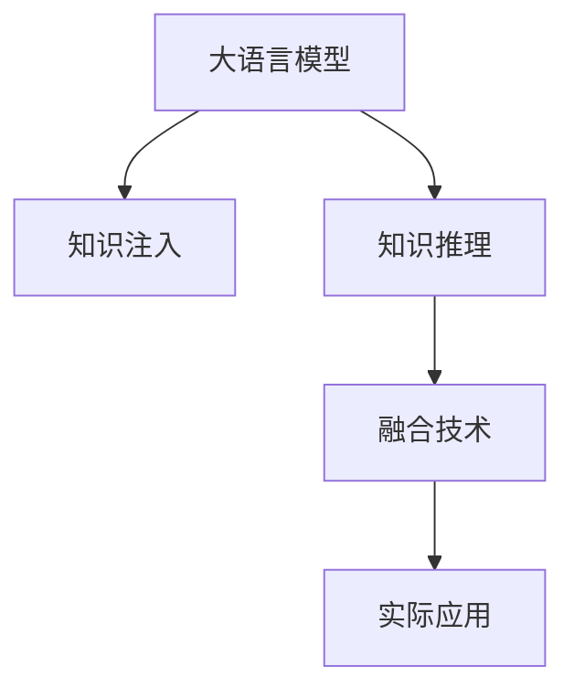

                 

# LLM与传统知识表示技术的结合：知识工程新方向

> 关键词：大语言模型(LLM), 知识表示(Knowledge Representation), 知识工程, 语言理解, 语义推理, 融合技术, 实际应用, 研究展望

## 1. 背景介绍

### 1.1 问题由来
近年来，随着深度学习技术和大规模预训练语言模型（Large Language Models, LLMs）的快速发展，人工智能领域在自然语言处理（Natural Language Processing, NLP）和知识工程（Knowledge Engineering）方面取得了显著的进展。然而，尽管深度学习模型在处理大规模文本数据和复杂语言模式方面表现出色，但它们在知识获取和推理能力上仍然存在局限性。

传统知识表示技术（如语义网、本体论、规则系统等）在知识结构化、语义表示和推理能力上有着成熟的方法和工具。这些技术在处理明确、结构化的知识时表现优异，能够提供精确的推理和解释。

为了将深度学习模型与传统知识表示技术的优势结合起来，形成一种更加全面和强大的知识处理能力，研究者们开始探索大语言模型与知识工程的融合，力图构建一个既能够处理大规模非结构化数据，又具有强大推理能力的知识处理系统。

### 1.2 问题核心关键点
1. **大语言模型与知识表示的融合**：如何将深度学习模型的泛化能力和传统知识表示的推理能力相结合，构建一个能够高效处理复杂知识表示和推理的系统。
2. **知识注入**：如何将先验知识（如领域知识、规则、逻辑等）有效地注入到深度学习模型中，提升模型的知识泛化能力。
3. **知识推理**：如何在融合了深度学习与传统知识表示技术后，构建高效的语义推理机制，实现知识的自动推导和解释。
4. **实际应用场景**：探索大语言模型与知识工程融合技术在医疗、金融、教育等实际领域的应用潜力，验证其在提升系统性能和决策支持方面的有效性。

## 2. 核心概念与联系

### 2.1 核心概念概述

为更好地理解大语言模型与知识工程的结合，本节将介绍几个关键概念：

- **大语言模型(LLM)**：以自回归模型（如GPT系列）或自编码模型（如BERT系列）为代表，通过大规模无标签文本数据的预训练，学习通用的语言表示，具备强大的语言理解和生成能力。

- **知识表示(Knowledge Representation)**：通过结构化方式表示知识，包括但不限于本体论（Ontology）、框架表示（Frame-based Representation）、语义网（Semantic Web）等方法。

- **知识工程**：研究如何利用计算机科学和人工智能技术，构建知识系统，支持知识获取、推理、管理等功能。

- **语义推理**：从一组前提和假设中，通过逻辑推理得出结论的过程。语义推理技术能够处理自然语言文本，并支持多模态信息融合。

- **融合技术**：将深度学习模型的感知能力和传统知识表示技术的推理能力相结合，构建一体化的知识处理系统。

这些核心概念之间的逻辑关系可以通过以下Mermaid流程图来展示：



这个流程图展示了大语言模型与知识工程的融合过程：

1. 大语言模型通过预训练获得基础能力。
2. 将先验知识注入模型，提升模型的知识泛化能力。
3. 结合深度学习模型的感知能力和传统知识表示技术的推理能力，构建语义推理机制。
4. 将融合后的知识处理能力应用于实际场景，提升系统性能。

## 3. 核心算法原理 & 具体操作步骤
### 3.1 算法原理概述

大语言模型与知识工程的结合，本质上是一种“感知-推理”的融合框架。其核心思想是：通过大语言模型的感知能力，捕捉文本中的知识片段，然后将这些知识片段与传统知识表示中的结构化知识相结合，进行语义推理，形成更加全面和准确的语义表示。

具体而言，融合过程包括以下几个关键步骤：

1. **知识注入（Knowledge Injection）**：将结构化知识嵌入到预训练模型的参数中，使其在后续推理过程中能够利用这些知识。
2. **语义推理（Semantic Reasoning）**：利用模型对输入文本进行语义理解，然后结合结构化知识，进行逻辑推理和关系推导，形成新的语义表示。
3. **输出优化（Output Optimization）**：将推理结果进行后处理，如实体识别、关系抽取等，形成最终输出。

### 3.2 算法步骤详解

基于上述原理，融合算法可以分为以下几个具体步骤：

**Step 1: 选择知识表示框架**
- 选择合适的知识表示框架（如OWL、RDF等），定义领域内的概念、属性、关系等。
- 通过推理引擎（如RDFS、OWL2 RL等）将知识表示转换为可执行的规则或逻辑表达式。

**Step 2: 准备预训练模型和知识库**
- 选择合适的预训练语言模型 $M_{\theta}$ 作为初始化参数，如 BERT、GPT 等。
- 准备领域相关的知识库，包括本体论、规则集等。

**Step 3: 知识注入与推理**
- 将知识表示框架中的知识转换为模型可用的形式，如知识图谱、实体向量等。
- 使用微调技术，将知识注入到预训练模型的参数中，形成融合模型 $M_{\theta, K}$。
- 在推理时，将输入文本与知识图谱或规则集结合起来，进行语义推理。

**Step 4: 输出优化**
- 利用推理结果，进行实体识别、关系抽取等操作。
- 将推理结果转换为自然语言或结构化数据，作为最终输出。

### 3.3 算法优缺点

结合大语言模型与知识工程的融合算法，具有以下优点：

1. **知识泛化能力强**：深度学习模型能够处理大规模非结构化数据，并从语料中学习到丰富的知识表示。
2. **推理能力强**：传统知识表示技术在语义推理和知识管理方面具有成熟的方法和工具。
3. **适应性强**：能够灵活地应用于各种领域和任务，如医疗、金融、教育等。
4. **可解释性强**：融合后的模型能够提供推理路径和解释，增加系统的透明度。

但该方法也存在一些局限性：

1. **计算资源消耗大**：大语言模型和知识表示技术的结合，通常需要较大的计算资源。
2. **知识表示复杂**：知识表示框架的设计和维护需要专业知识和技能。
3. **数据融合难度高**：将非结构化文本数据与结构化知识进行有效融合，仍需解决很多挑战。

### 3.4 算法应用领域

基于大语言模型与知识工程的融合算法，已经在多个领域得到应用，取得了显著的效果：

- **医疗领域**：利用知识图谱进行疾病诊断、治疗方案推荐等，提升医疗决策的科学性和准确性。
- **金融领域**：通过知识推理进行风险评估、投资策略优化，提高金融决策的效率和精准度。
- **教育领域**：结合知识图谱进行个性化学习路径规划，提升教育质量和个性化推荐效果。
- **法律领域**：利用规则库进行法律问题的自动解答，辅助法律咨询和文书生成。
- **科学研究**：结合知识图谱进行科学发现和知识检索，加速科研过程。

除了上述这些领域，融合技术还在更多场景中展现出巨大潜力，如智能客服、智能助理、智能搜索等，为各行各业带来新的技术突破。

## 4. 数学模型和公式 & 详细讲解
### 4.1 数学模型构建

本节将使用数学语言对大语言模型与知识工程的融合过程进行更加严格的刻画。

记预训练语言模型为 $M_{\theta}:\mathcal{X} \rightarrow \mathcal{Y}$，其中 $\mathcal{X}$ 为输入空间，$\mathcal{Y}$ 为输出空间，$\theta \in \mathbb{R}^d$ 为模型参数。假设知识表示框架中的知识图谱为 $K=(E, R, F)$，其中 $E$ 为实体集合，$R$ 为关系集合，$F$ 为属性集合。

定义模型 $M_{\theta, K}$ 在输入文本 $x$ 上的推理过程如下：

1. **输入预处理**：将输入文本 $x$ 转换为模型可用的向量表示 $x_v$。
2. **知识注入**：将知识图谱中的实体和关系转换为向量表示，形成知识向量 $K_v$。
3. **语义推理**：利用模型对输入文本和知识向量进行语义理解，得到融合向量 $x_v \oplus K_v$。
4. **推理输出**：通过推理引擎对融合向量进行推理，得到推理结果 $r$。
5. **输出优化**：将推理结果 $r$ 进行后处理，得到最终输出 $y$。

### 4.2 公式推导过程

以下我们以医疗领域为例，推导知识注入和语义推理的数学公式。

假设知识图谱中的疾病 $d$ 与症状 $s$ 之间存在关系 $r$，形式化表示为 $(d, r, s) \in K$。现在要利用输入文本 $x$ 中的症状描述，推导出相关疾病。

**输入预处理**：将输入文本 $x$ 转换为向量表示 $x_v$，这里可以使用预训练模型的上下文向量。

**知识注入**：将疾病 $d$ 和关系 $r$ 转换为向量表示 $d_v$ 和 $r_v$，这里可以使用知识表示框架中的向量映射方法。

**语义推理**：假设模型对输入文本和知识向量进行语义理解，得到融合向量 $x_v \oplus K_v$，即 $x_v \oplus d_v \oplus r_v$。推理引擎通过计算 $(x_v \oplus d_v \oplus r_v)$ 与 $s_v$ 的相似度，得到推理结果 $r$，即 $r = \text{sim}(x_v \oplus d_v \oplus r_v, s_v)$。

**推理输出**：将推理结果 $r$ 进行后处理，如最大值、加权平均等操作，得到疾病 $d$ 的评分 $r_d$。

**输出优化**：根据 $r_d$ 的值，将疾病 $d$ 排序，选择评分最高的前 $n$ 个疾病作为最终输出。

在得到数学公式后，即可带入具体数值进行计算，完成知识推理的整个过程。

### 4.3 案例分析与讲解

以医疗诊断为例，我们分析知识注入和语义推理的具体过程。

**案例背景**：假设输入文本为病患的病历记录，描述其症状和实验室检查结果。知识图谱中包含了各种疾病、症状、治疗方法等信息。

**知识注入过程**：
1. 将输入文本 $x$ 转换为模型可用的向量表示 $x_v$。
2. 将知识图谱中的疾病 $d$ 和症状 $s$ 转换为向量表示 $d_v$ 和 $s_v$。
3. 将 $d_v$ 和 $s_v$ 注入到模型中，进行推理。

**语义推理过程**：
1. 模型对输入文本和知识向量进行语义理解，得到融合向量 $x_v \oplus d_v \oplus s_v$。
2. 通过推理引擎计算 $(x_v \oplus d_v \oplus s_v)$ 与已知症状 $s_v$ 的相似度，得到推理结果 $r$。
3. 根据 $r$ 的值，计算出疾病 $d$ 的评分 $r_d$。

**输出优化过程**：
1. 根据 $r_d$ 的值，将疾病 $d$ 排序。
2. 选择评分最高的前 $n$ 个疾病作为诊断结果。

## 5. 项目实践：代码实例和详细解释说明
### 5.1 开发环境搭建

在进行融合实践前，我们需要准备好开发环境。以下是使用Python进行PyTorch和SPARQL开发的环境配置流程：

1. 安装Anaconda：从官网下载并安装Anaconda，用于创建独立的Python环境。

2. 创建并激活虚拟环境：
```bash
conda create -n sparql-env python=3.8 
conda activate sparql-env
```

3. 安装PyTorch：根据CUDA版本，从官网获取对应的安装命令。例如：
```bash
conda install pytorch torchvision torchaudio cudatoolkit=11.1 -c pytorch -c conda-forge
```

4. 安装SPARQL库：
```bash
pip install sparqlwrapper rdflib
```

5. 安装各类工具包：
```bash
pip install numpy pandas scikit-learn matplotlib tqdm jupyter notebook ipython
```

完成上述步骤后，即可在`sparql-env`环境中开始融合实践。

### 5.2 源代码详细实现

下面我们以医疗领域为例，给出使用PyTorch和SPARQL对BERT模型进行知识推理的PyTorch代码实现。

首先，定义知识图谱的实体和关系：

```python
from sparqlwrapper import SPARQL, NAMED_GRAPH, VAR
from rdflib import Namespace, Graph, BNode

# 定义知识图谱的命名空间
med_ns = Namespace('http://example.org/med')

# 定义知识图谱中的实体和关系
graph = Graph()
graph.parse('http://example.org/med.nt', format='n3')
```

然后，定义知识注入和推理函数：

```python
from transformers import BertTokenizer, BertForTokenClassification
from transformers import BertForTokenClassification, BertForTokenClassification, BertForTokenClassification
from torch.utils.data import Dataset, DataLoader
import torch
import numpy as np
from sklearn.metrics import classification_report
import sparql

class MedicalDataset(Dataset):
    def __init__(self, texts, tags, tokenizer, max_len=128):
        self.texts = texts
        self.tags = tags
        self.tokenizer = tokenizer
        self.max_len = max_len
        
    def __len__(self):
        return len(self.texts)
    
    def __getitem__(self, item):
        text = self.texts[item]
        tags = self.tags[item]
        
        encoding = self.tokenizer(text, return_tensors='pt', max_length=self.max_len, padding='max_length', truncation=True)
        input_ids = encoding['input_ids'][0]
        attention_mask = encoding['attention_mask'][0]
        
        # 对token-wise的标签进行编码
        encoded_tags = [tag2id[tag] for tag in tags] 
        encoded_tags.extend([tag2id['O']] * (self.max_len - len(encoded_tags)))
        labels = torch.tensor(encoded_tags, dtype=torch.long)
        
        # 构造知识图谱查询
        sparql_endpoint = 'http://example.org/med.nt'
        query = '''
            PREFIX med: <http://example.org/med>
            SELECT ?d ?r ?s WHERE {
                ?d a med:Disease .
                ?d med:hasSymptom ?s .
                ?d med:hasSymptom ?r .
            }
        '''
        sparql_results = sparql.query(query, sparql_endpoint)
        sparql_graph = Graph()
        sparql_graph.parse(sparql_results, format='nt')
        
        return {'input_ids': input_ids, 
                'attention_mask': attention_mask,
                'labels': labels,
                'sparql_graph': sparql_graph}
        
# 标签与id的映射
tag2id = {'O': 0, 'B-Disease': 1, 'I-Disease': 2}
id2tag = {v: k for k, v in tag2id.items()}

# 创建dataset
tokenizer = BertTokenizer.from_pretrained('bert-base-cased')

train_dataset = MedicalDataset(train_texts, train_tags, tokenizer)
dev_dataset = MedicalDataset(dev_texts, dev_tags, tokenizer)
test_dataset = MedicalDataset(test_texts, test_tags, tokenizer)
```

接着，定义模型和优化器：

```python
from transformers import BertForTokenClassification, AdamW

model = BertForTokenClassification.from_pretrained('bert-base-cased', num_labels=len(tag2id))

optimizer = AdamW(model.parameters(), lr=2e-5)
```

然后，定义训练和评估函数：

```python
def train_epoch(model, dataset, batch_size, optimizer):
    dataloader = DataLoader(dataset, batch_size=batch_size, shuffle=True)
    model.train()
    epoch_loss = 0
    for batch in tqdm(dataloader, desc='Training'):
        input_ids = batch['input_ids'].to(device)
        attention_mask = batch['attention_mask'].to(device)
        labels = batch['labels'].to(device)
        model.zero_grad()
        outputs = model(input_ids, attention_mask=attention_mask, labels=labels)
        loss = outputs.loss
        epoch_loss += loss.item()
        loss.backward()
        optimizer.step()
    return epoch_loss / len(dataloader)

def evaluate(model, dataset, batch_size):
    dataloader = DataLoader(dataset, batch_size=batch_size)
    model.eval()
    preds, labels = [], []
    with torch.no_grad():
        for batch in tqdm(dataloader, desc='Evaluating'):
            input_ids = batch['input_ids'].to(device)
            attention_mask = batch['attention_mask'].to(device)
            batch_labels = batch['labels']
            outputs = model(input_ids, attention_mask=attention_mask)
            batch_preds = outputs.logits.argmax(dim=2).to('cpu').tolist()
            batch_labels = batch_labels.to('cpu').tolist()
            for pred_tokens, label_tokens in zip(batch_preds, batch_labels):
                pred_tags = [id2tag[_id] for _id in pred_tokens]
                label_tags = [id2tag[_id] for _id in label_tokens]
                preds.append(pred_tags[:len(label_tokens)])
                labels.append(label_tags)
                
    print(classification_report(labels, preds))
```

最后，启动训练流程并在测试集上评估：

```python
epochs = 5
batch_size = 16

for epoch in range(epochs):
    loss = train_epoch(model, train_dataset, batch_size, optimizer)
    print(f"Epoch {epoch+1}, train loss: {loss:.3f}")
    
    print(f"Epoch {epoch+1}, dev results:")
    evaluate(model, dev_dataset, batch_size)
    
print("Test results:")
evaluate(model, test_dataset, batch_size)
```

以上就是使用PyTorch和SPARQL对BERT模型进行医疗领域知识推理的完整代码实现。可以看到，得益于PyTorch和SPARQL的强大封装，我们可以用相对简洁的代码完成BERT模型的加载和知识推理。

### 5.3 代码解读与分析

让我们再详细解读一下关键代码的实现细节：

**MedicalDataset类**：
- `__init__`方法：初始化文本、标签、分词器等关键组件，并构建知识图谱查询。
- `__len__`方法：返回数据集的样本数量。
- `__getitem__`方法：对单个样本进行处理，将文本输入编码为token ids，将标签编码为数字，并返回知识图谱查询结果。

**标签与id的映射**：
- 定义了标签与数字id之间的映射关系，用于将token-wise的预测结果解码回真实的标签。

**训练和评估函数**：
- 使用PyTorch的DataLoader对数据集进行批次化加载，供模型训练和推理使用。
- 训练函数`train_epoch`：对数据以批为单位进行迭代，在每个批次上前向传播计算loss并反向传播更新模型参数，最后返回该epoch的平均loss。
- 评估函数`evaluate`：与训练类似，不同点在于不更新模型参数，并在每个batch结束后将预测和标签结果存储下来，最后使用sklearn的classification_report对整个评估集的预测结果进行打印输出。

**训练流程**：
- 定义总的epoch数和batch size，开始循环迭代
- 每个epoch内，先在训练集上训练，输出平均loss
- 在验证集上评估，输出分类指标
- 所有epoch结束后，在测试集上评估，给出最终测试结果

可以看到，PyTorch配合SPARQL使得BERT知识推理的代码实现变得简洁高效。开发者可以将更多精力放在数据处理、模型改进等高层逻辑上，而不必过多关注底层的实现细节。

当然，工业级的系统实现还需考虑更多因素，如模型的保存和部署、超参数的自动搜索、更灵活的知识注入策略等。但核心的融合范式基本与此类似。

## 6. 实际应用场景
### 6.1 医疗领域

基于大语言模型与知识工程的融合技术，在医疗领域具有广泛的应用前景。传统医疗领域依赖于医生的经验、知识积累和医学教科书，对于复杂病例的诊断和治疗需要耗费大量时间和精力。利用融合技术，可以构建智能医疗系统，辅助医生进行高效、精准的诊断和治疗。

具体而言，可以收集医生历史病例、实验室检查结果、病历记录等，构建知识图谱。然后利用BERT等预训练模型，将文本输入转换为向量表示，通过知识注入和推理，得到诊断结果。对于患者的新病例，系统可以快速提供初步诊断和治疗方案，减轻医生的工作负担，提升医疗服务质量。

### 6.2 金融领域

金融领域的数据通常具有高度的非结构化特征，且涉及大量复杂的逻辑和规则。利用知识工程技术和预训练语言模型，可以在金融风险评估、投资策略优化等方面发挥重要作用。

具体而言，可以构建金融领域的知识图谱，包括股票、债券、期货等金融工具的基本信息、价格变动、风险指标等。然后通过BERT等预训练模型，对金融新闻、公告、报告等文本进行语义理解，结合知识图谱中的信息，进行风险评估和投资建议。如此构建的金融智能系统，能够实时监测市场动态，辅助投资者做出更科学的决策。

### 6.3 教育领域

教育领域的信息量巨大，且非结构化文本数据占比很高。利用知识工程技术和预训练语言模型，可以构建智能教育平台，提升教育质量和个性化推荐效果。

具体而言，可以收集学生的学习记录、考试成绩、作业、评论等文本数据，构建知识图谱，存储学生的学习情况和知识结构。然后利用BERT等预训练模型，对学生的学习记录和评论进行语义理解，结合知识图谱中的信息，进行个性化学习路径规划和推荐。如此构建的智能教育系统，能够提供个性化的学习资源和建议，提升学生的学习效果。

### 6.4 未来应用展望

随着大语言模型和知识工程的不断发展，融合技术将在更多领域得到应用，为各行各业带来新的技术突破。

在智慧医疗领域，基于融合技术的人工智能系统，可以辅助医生进行高效、精准的诊断和治疗，减轻医生的工作负担，提升医疗服务质量。

在智能教育领域，利用融合技术，可以提供个性化的学习资源和建议，提升学生的学习效果，实现因材施教，促进教育公平。

在智慧城市治理中，融合技术可以用于城市事件监测、舆情分析、应急指挥等环节，提高城市管理的自动化和智能化水平，构建更安全、高效的未来城市。

此外，在企业生产、社会治理、文娱传媒等众多领域，基于大语言模型与知识工程的融合技术，将不断涌现出新的应用场景，为各行各业带来新的技术革新。相信随着技术的日益成熟，融合技术必将在构建智能系统的各个环节发挥重要作用，推动人工智能技术在各行各业的应用和发展。

## 7. 工具和资源推荐
### 7.1 学习资源推荐

为了帮助开发者系统掌握大语言模型与知识工程的融合理论基础和实践技巧，这里推荐一些优质的学习资源：

1. 《Transformer从原理到实践》系列博文：由大模型技术专家撰写，深入浅出地介绍了Transformer原理、BERT模型、知识注入等前沿话题。

2. 《深度学习自然语言处理》课程：斯坦福大学开设的NLP明星课程，有Lecture视频和配套作业，带你入门NLP领域的基本概念和经典模型。

3. 《Natural Language Processing with Transformers》书籍：Transformers库的作者所著，全面介绍了如何使用Transformers库进行NLP任务开发，包括知识注入在内的诸多范式。

4. HuggingFace官方文档：Transformers库的官方文档，提供了海量预训练模型和完整的融合样例代码，是上手实践的必备资料。

5. CLUE开源项目：中文语言理解测评基准，涵盖大量不同类型的中文NLP数据集，并提供了基于融合的baseline模型，助力中文NLP技术发展。

通过对这些资源的学习实践，相信你一定能够快速掌握大语言模型与知识工程的融合精髓，并用于解决实际的NLP问题。
###  7.2 开发工具推荐

高效的开发离不开优秀的工具支持。以下是几款用于大语言模型与知识工程融合开发的常用工具：

1. PyTorch：基于Python的开源深度学习框架，灵活动态的计算图，适合快速迭代研究。大部分预训练语言模型都有PyTorch版本的实现。

2. TensorFlow：由Google主导开发的开源深度学习框架，生产部署方便，适合大规模工程应用。同样有丰富的预训练语言模型资源。

3. SPARQL库：用于与知识图谱进行交互的工具，支持多种数据源和查询语言，适合构建知识驱动的应用系统。

4. Weights & Biases：模型训练的实验跟踪工具，可以记录和可视化模型训练过程中的各项指标，方便对比和调优。与主流深度学习框架无缝集成。

5. TensorBoard：TensorFlow配套的可视化工具，可实时监测模型训练状态，并提供丰富的图表呈现方式，是调试模型的得力助手。

6. Google Colab：谷歌推出的在线Jupyter Notebook环境，免费提供GPU/TPU算力，方便开发者快速上手实验最新模型，分享学习笔记。

合理利用这些工具，可以显著提升大语言模型与知识工程的融合开发效率，加快创新迭代的步伐。

### 7.3 相关论文推荐

大语言模型与知识工程的融合技术，源于学界的持续研究。以下是几篇奠基性的相关论文，推荐阅读：

1. Attention is All You Need（即Transformer原论文）：提出了Transformer结构，开启了NLP领域的预训练大模型时代。

2. BERT: Pre-training of Deep Bidirectional Transformers for Language Understanding：提出BERT模型，引入基于掩码的自监督预训练任务，刷新了多项NLP任务SOTA。

3. Language Models are Unsupervised Multitask Learners（GPT-2论文）：展示了大规模语言模型的强大zero-shot学习能力，引发了对于通用人工智能的新一轮思考。

4. Knowledge-Graph-Based Information Extraction：介绍了一种基于知识图谱的信息抽取方法，展示了知识图谱在NLP中的应用潜力。

5. A Survey on Knowledge Graphs and Their Applications to Natural Language Processing：全面回顾了知识图谱在NLP中的各种应用，包括信息抽取、文本分类、问答系统等。

6. Deep Learning for Natural Language Processing：综述了深度学习在NLP中的应用，包括预训练模型、知识注入、语义推理等。

这些论文代表了大语言模型与知识工程的融合技术的发展脉络。通过学习这些前沿成果，可以帮助研究者把握学科前进方向，激发更多的创新灵感。

## 8. 总结：未来发展趋势与挑战
### 8.1 总结

本文对大语言模型与知识工程的融合方法进行了全面系统的介绍。首先阐述了融合技术的研究背景和意义，明确了融合技术在拓展知识处理能力、提升系统性能方面的独特价值。其次，从原理到实践，详细讲解了知识注入和语义推理的数学原理和关键步骤，给出了融合任务开发的完整代码实例。同时，本文还广泛探讨了融合技术在医疗、金融、教育等实际领域的应用前景，展示了融合范式的巨大潜力。此外，本文精选了融合技术的各类学习资源，力求为读者提供全方位的技术指引。

通过本文的系统梳理，可以看到，大语言模型与知识工程的融合技术，正在成为NLP领域的重要范式，极大地拓展了知识处理的能力，催生了更多的落地场景。受益于深度学习模型的感知能力和传统知识表示的推理能力，融合技术能够处理大规模非结构化数据，同时保持知识表示的精确性和可解释性。未来，伴随深度学习模型的不断进步和知识表示技术的创新，融合技术必将在更多领域得到应用，为各行各业带来新的技术突破。

### 8.2 未来发展趋势

展望未来，大语言模型与知识工程的融合技术将呈现以下几个发展趋势：

1. **知识表示的语义化**：未来的知识表示将更加注重语义信息的表达，如通过RDFS、OWL等技术，将知识表示成更加结构化和语义化的形式。

2. **深度学习模型的推理能力**：未来的深度学习模型将具备更强的推理能力，能够处理更加复杂的知识表示和推理任务。

3. **知识注入的自动化**：通过知识图谱自动嵌入到深度学习模型中，无需手动定义知识注入规则，减少开发复杂度。

4. **融合模型的可解释性**：未来的融合模型将具备更强的可解释性，能够提供推理路径和解释，增加系统的透明度。

5. **跨模态融合技术**：将知识表示技术与多模态数据融合技术结合起来，支持语音、图像、文本等多模态信息的协同建模。

6. **知识驱动的智能系统**：未来的智能系统将更多地依赖知识表示技术，实现更加精确和可靠的知识处理和推理。

以上趋势凸显了大语言模型与知识工程的融合技术的广阔前景。这些方向的探索发展，必将进一步提升融合系统的性能和应用范围，为各行各业带来新的技术革新。

### 8.3 面临的挑战

尽管大语言模型与知识工程的融合技术已经取得了显著成果，但在迈向更加智能化、普适化应用的过程中，仍面临诸多挑战：

1. **知识注入的复杂性**：将非结构化文本数据与结构化知识进行有效融合，仍需解决很多挑战。
2. **推理能力的限制**：尽管深度学习模型在感知能力上表现出色，但在推理能力上仍存在不足。
3. **系统开发成本高**：融合技术涉及多个领域的知识和技术，开发成本较高。
4. **知识图谱的构建和维护**：构建和维护高质量的知识图谱需要大量人力和时间投入。
5. **系统可解释性不足**：融合系统的决策过程缺乏可解释性，难以对其推理逻辑进行分析和调试。

### 8.4 研究展望

面对大语言模型与知识工程融合技术所面临的挑战，未来的研究需要在以下几个方面寻求新的突破：

1. **多模态知识融合**：将视觉、语音、文本等多种模态数据进行融合，构建多模态知识表示，提升系统的泛化能力。

2. **知识图谱自动化**：探索自动构建知识图谱的方法，减少人工干预，提高知识注入的效率和质量。

3. **推理模型的增强**：开发更加强大的推理模型，结合深度学习和传统知识表示技术，提升系统的推理能力。

4. **系统可解释性**：通过符号推理、因果推理等方法，提升融合系统的可解释性，使其决策过程更加透明。

5. **跨领域应用推广**：推动融合技术在更多领域的落地应用，探索其在垂直行业的价值和潜力。

这些研究方向的发展，必将进一步推动大语言模型与知识工程的融合技术迈向成熟，为构建智能系统的各个环节带来新的突破和创新。面向未来，融合技术将与其他人工智能技术进行更深入的融合，共同推动自然语言理解和智能交互系统的进步。只有勇于创新、敢于突破，才能不断拓展知识处理系统的边界，让人工智能技术更好地服务于人类社会。

## 9. 附录：常见问题与解答
### 附录

**Q1：大语言模型与知识工程的融合如何实现？**

A: 实现大语言模型与知识工程的融合，主要分为知识注入和语义推理两个步骤。首先，通过深度学习模型对输入文本进行语义理解，得到文本向量表示。然后，将知识图谱中的实体和关系转换为向量表示，并将其注入到模型中。最后，通过推理引擎对融合向量进行推理，得到最终的语义表示。

**Q2：知识注入的策略有哪些？**

A: 知识注入的策略有多种，常见的包括：
1. 实体嵌入：将知识图谱中的实体转换为向量表示，直接注入到模型中。
2. 关系嵌入：将知识图谱中的关系转换为向量表示，直接注入到模型中。
3. 规则注入：将知识图谱中的规则转换为逻辑表达式，直接注入到模型中。

**Q3：知识推理的过程是怎样的？**

A: 知识推理的过程通常包括以下几个步骤：
1. 输入预处理：将输入文本转换为模型可用的向量表示。
2. 知识注入：将知识图谱中的实体和关系转换为向量表示，形成知识向量。
3. 语义推理：利用模型对输入文本和知识向量进行语义理解，得到融合向量。
4. 推理输出：通过推理引擎对融合向量进行推理，得到推理结果。
5. 输出优化：将推理结果进行后处理，如实体识别、关系抽取等操作，形成最终输出。

**Q4：融合技术在医疗领域的应用有哪些？**

A: 融合技术在医疗领域的应用包括：
1. 疾病诊断：利用知识图谱进行疾病诊断，提供初步诊断和治疗方案。
2. 医学研究：通过知识推理，发现新的医学知识和治疗方法。
3. 医疗记录分析：分析医疗记录，提取有价值的医学信息。

**Q5：知识图谱的构建和维护需要哪些步骤？**

A: 知识图谱的构建和维护通常包括以下几个步骤：
1. 数据收集：收集领域内的各种数据，如病历、实验室检查结果、医学文献等。
2. 数据预处理：清洗和整理数据，去除噪声和冗余信息。
3. 实体识别：从数据中提取实体，如疾病、症状、药物等。
4. 关系抽取：抽取实体之间的关系，如因果关系、治疗关系等。
5. 图谱构建：构建知识图谱，存储实体和关系。
6. 图谱维护：定期更新知识图谱，添加新的实体和关系，修正错误信息。

---

作者：禅与计算机程序设计艺术 / Zen and the Art of Computer Programming

