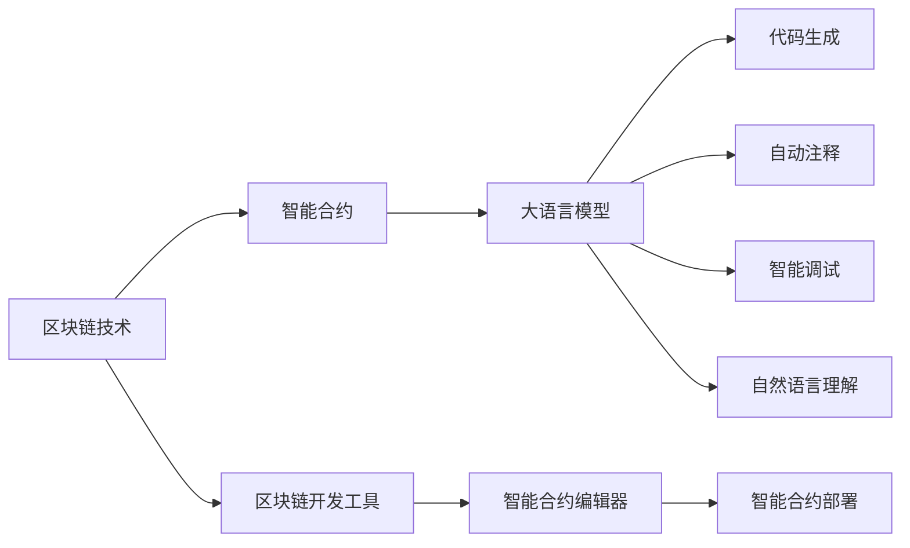

                 

# LLM与区块链技术的融合：构建智能合约

> 关键词：
> - 区块链技术
> - 智能合约
> - 大语言模型(LLM)
> - 自然语言处理(NLP)
> - 代码生成
> - 区块链开发工具
> - 机器学习与AI

## 1. 背景介绍

随着区块链技术的飞速发展，智能合约的应用场景正在迅速扩展，从简单的交易合约扩展到复杂的金融合同、供应链管理等场景。然而，智能合约的开发和维护仍面临诸多挑战，尤其是对于缺乏专业区块链知识的用户。大语言模型(Large Language Model, LLM)作为一种强大的自然语言处理(Natural Language Processing, NLP)工具，正在成为智能合约开发的新工具。

大语言模型通过在大规模语料上进行预训练，学习到了复杂的语言模式和知识，能够在自然语言与代码之间进行映射，从而实现代码生成、自动注释、智能调试等功能。因此，将大语言模型与区块链技术相结合，可以极大地提升智能合约的开发效率和自动化程度，使其更加易于理解和维护。

## 2. 核心概念与联系

### 2.1 核心概念概述

本节将介绍几项核心概念及其在智能合约开发中的应用：

- 区块链技术：一种分布式账本技术，通过去中心化的方式记录和验证交易，实现无需信任的共识机制。
- 智能合约：一种基于区块链技术的自动执行合约，通过代码实现合约条款和规则，具有自动化和去中心化的特性。
- 大语言模型：一种基于神经网络的自然语言处理模型，通过预训练和微调，学习到丰富的语言知识，能够进行文本生成、翻译、分类等多种任务。
- 自然语言处理(NLP)：利用计算机技术处理和理解人类语言，实现语言与数据之间的转换。
- 代码生成：通过自然语言生成相应的代码，提升软件开发的效率和自动化水平。
- 区块链开发工具：如Solidity、ViteNet等，提供区块链编程语言和智能合约开发环境。

这些核心概念共同构成了大语言模型在区块链智能合约开发中的应用框架。

### 2.2 核心概念原理和架构的 Mermaid 流程图



这个流程图展示了LLM与区块链智能合约开发之间的联系：

1. 区块链技术提供了一个去中心化的平台，用于记录和验证智能合约的执行。
2. 智能合约是区块链上的一种应用，由代码实现，具有自动化和去中心化的特性。
3. 大语言模型通过学习自然语言，生成智能合约的代码、注释、调用方法等，提升开发效率。
4. 自然语言处理技术将自然语言与代码进行映射，实现智能合约的自动注释和调试。
5. 区块链开发工具为智能合约的开发和部署提供支持，如Solidity、ViteNet等。

## 3. 核心算法原理 & 具体操作步骤

### 3.1 算法原理概述

基于大语言模型构建智能合约的核心算法原理如下：

1. **自然语言理解(NLU)**：利用大语言模型对自然语言进行理解，将其转化为机器可执行的代码或指令。
2. **代码生成**：根据自然语言理解的结果，生成相应的智能合约代码。
3. **代码执行与验证**：将生成的智能合约代码部署到区块链上，并验证其正确性和安全性。

这一过程可以分为以下几个步骤：

1. **需求分析**：分析智能合约的功能需求和逻辑，确定需要实现的功能和规则。
2. **语言生成**：利用大语言模型生成描述智能合约的文本，包括输入输出、处理逻辑等。
3. **代码生成**：将自然语言文本转换为智能合约代码，生成相应的Solidity或ViteNet代码。
4. **代码验证**：对生成的智能合约代码进行验证，确保其符合语法和规则要求。
5. **代码部署与测试**：将验证通过的智能合约代码部署到区块链上，并进行测试和优化。

### 3.2 算法步骤详解

以下将详细介绍基于大语言模型构建智能合约的具体步骤：

**Step 1: 需求分析与模型选择**

- 分析智能合约的功能需求，确定需要实现的功能和规则。
- 根据需求选择合适的预训练大语言模型，如GPT、BERT等。

**Step 2: 自然语言理解(NLU)**

- 利用预训练的大语言模型对自然语言进行理解，将其转化为机器可执行的代码或指令。
- 例如，对于“注册用户”的需求，可以生成“用户注册”的智能合约函数，并指定输入参数和返回值。

**Step 3: 代码生成**

- 根据自然语言理解的结果，生成相应的智能合约代码。
- 例如，将“用户注册”的需求转换为Solidity或ViteNet代码，包括合约的声明、函数实现和参数定义等。

**Step 4: 代码验证**

- 对生成的智能合约代码进行验证，确保其符合语法和规则要求。
- 例如，利用静态代码分析工具检测变量命名规范、函数调用正确性等。

**Step 5: 代码部署与测试**

- 将验证通过的智能合约代码部署到区块链上，并进行测试和优化。
- 例如，在Ethereum或Binance Smart Chain上部署智能合约，并进行模拟测试和验证。

### 3.3 算法优缺点

基于大语言模型构建智能合约的优势包括：

1. **提升开发效率**：大语言模型可以自动生成智能合约代码，减少手动编写代码的工作量。
2. **提高可读性**：自然语言生成的代码具有更好的可读性，便于理解和维护。
3. **减少错误率**：自然语言生成的代码更符合人类语言逻辑，减少语法和语义错误。

其缺点包括：

1. **依赖质量数据**：生成代码的质量取决于输入的自然语言文本质量，如果输入错误，生成代码质量也会较低。
2. **可解释性不足**：生成的代码缺乏可解释性，难以调试和优化。
3. **需要持续优化**：随着区块链环境的变化，智能合约代码需要不断更新和优化，增加维护成本。

### 3.4 算法应用领域

基于大语言模型构建智能合约的应用领域包括：

1. **金融合约**：自动生成贷款合同、保险合同等金融合约，减少合同编写时间，提升合同可读性和准确性。
2. **供应链管理**：自动生成供应链合同，减少手动编写和审核时间，提高供应链透明度和效率。
3. **智能合约保险**：自动生成智能合约保险条款，减少保险合同的编写和验证工作量，提升保险业务的可操作性。
4. **房地产合约**：自动生成房产买卖合同，减少合同编写时间和错误率，提高房产交易的效率和安全性。

## 4. 数学模型和公式 & 详细讲解 & 举例说明

### 4.1 数学模型构建

基于大语言模型构建智能合约的数学模型如下：

设智能合约的需求为 $D$，包含 $n$ 个功能 $D_1, D_2, ..., D_n$。大语言模型对需求 $D$ 进行自然语言理解，得到自然语言描述 $L_D$。大语言模型将自然语言描述 $L_D$ 转化为机器可执行的代码 $C$，生成智能合约。代码 $C$ 包含 $m$ 个函数 $C_1, C_2, ..., C_m$，分别对应需求 $D_1, D_2, ..., D_n$。

### 4.2 公式推导过程

设智能合约的输入为 $I$，输出为 $O$。根据智能合约的需求 $D$，大语言模型生成的代码 $C$ 包括函数 $C_1, C_2, ..., C_m$，分别对应需求 $D_1, D_2, ..., D_n$。

自然语言理解过程如下：

$$
L_D = \text{NLU}(D)
$$

代码生成过程如下：

$$
C = \text{GenCode}(L_D)
$$

其中 $\text{NLU}(D)$ 表示自然语言理解过程，$\text{GenCode}(L_D)$ 表示代码生成过程。

### 4.3 案例分析与讲解

以“用户注册”为例，自然语言理解过程如下：

1. 输入：“用户注册”。
2. 自然语言理解：用户注册需要收集用户信息，创建用户账号，生成注册代码。
3. 自然语言描述：注册用户信息，创建用户账号。

代码生成过程如下：

1. 自然语言描述：注册用户信息，创建用户账号。
2. 代码生成：
   ```solidity
   function registerUser(string memory name, string memory address) public {
       // 收集用户信息
       require(name != "", "Name is required");
       require(address != "", "Address is required");
       // 创建用户账号
       uint256 id = users.length + 1;
       User storage newUser = users[id];
       newUser.name = name;
       newUser.address = address;
   }
   ```

代码验证过程如下：

1. 输入：生成的智能合约代码。
2. 代码验证：检测代码语法正确性、变量命名规范、函数调用正确性等。

代码部署与测试过程如下：

1. 输入：验证通过的智能合约代码。
2. 代码部署：将智能合约代码部署到区块链上。
3. 代码测试：对智能合约进行模拟测试，验证其正确性和安全性。

## 5. 项目实践：代码实例和详细解释说明

### 5.1 开发环境搭建

在进行智能合约开发前，我们需要准备好开发环境。以下是使用Python进行Solidity开发的环境配置流程：

1. 安装Anaconda：从官网下载并安装Anaconda，用于创建独立的Python环境。
2. 创建并激活虚拟环境：
   ```bash
   conda create -n solidity-env python=3.8
   conda activate solidity-env
   ```

3. 安装Solidity开发工具：
   ```bash
   npm install -g truffle
   ```

4. 安装Solidity解释器：
   ```bash
   npm install -g solc
   ```

5. 安装必要的IDE：如 Remix、Truffle等，用于编辑、编译和部署智能合约。

完成上述步骤后，即可在`solidity-env`环境中开始智能合约开发。

### 5.2 源代码详细实现

以下是使用Solidity编写智能合约的代码示例，以“用户注册”为例：

```solidity
// SPDX-License-Identifier: MIT
pragma solidity ^0.8.0;

contract UserRegistration {
    struct User {
        string name;
        address address;
    }
    
    mapping(uint256 => User) public users;
    
    function registerUser(string memory name, string memory address) public {
        require(name != "", "Name is required");
        require(address != "", "Address is required");
        uint256 id = users.length + 1;
        User storage newUser = users[id];
        newUser.name = name;
        newUser.address = address;
    }
    
    function getUser(uint256 id) public view returns (string memory, address) {
        User storage user = users[id];
        return (user.name, user.address);
    }
}
```

### 5.3 代码解读与分析

**UserRegistration合约**：
- `struct User` 定义了用户的基本信息，包括姓名和地址。
- `mapping(uint256 => User) public users` 映射存储了所有用户的信息。
- `function registerUser` 注册用户，收集用户信息并创建用户账号。
- `function getUser` 获取用户信息，根据用户ID返回姓名和地址。

**代码实现过程**：
1. 定义智能合约结构，包括用户信息和用户映射。
2. 编写注册函数，收集用户信息并创建用户账号。
3. 编写用户信息获取函数，根据用户ID返回用户信息。

**代码验证过程**：
- 使用静态代码分析工具检测代码语法正确性、变量命名规范、函数调用正确性等。
- 使用Solidity编译器将合约代码编译为字节码，检测编译结果是否符合规范。

**代码部署与测试**：
- 将验证通过的智能合约代码部署到区块链上，如Ethereum或Binance Smart Chain。
- 使用智能合约测试框架进行模拟测试，验证智能合约的正确性和安全性。

### 5.4 运行结果展示

部署智能合约后，可以通过以太坊浏览器或Truffle等工具查看智能合约的状态，测试用户注册功能是否正常。

## 6. 实际应用场景

### 6.1 智能合约保险

智能合约保险是一种将保险合同自动化和去中心化的解决方案，可以自动处理保险理赔、核保、支付等流程。利用大语言模型，可以自动生成保险条款，减少人工编写和审核时间。

例如，可以使用大语言模型生成财产保险合同，自动提取保险标的、保单期限、理赔条件等关键信息，并将其转换为代码，部署到区块链上。用户可以通过智能合约查询保险信息、申请理赔，智能合约自动审核并执行理赔流程。

### 6.2 供应链管理

智能合约可以用于供应链管理，自动生成供应链合同，记录物流信息、交货时间、支付条件等。利用大语言模型，可以自动生成供应链合同，减少合同编写和审核时间，提高供应链透明度和效率。

例如，可以使用大语言模型生成供应链合同，自动提取供应商信息、订单信息、交货信息等关键信息，并将其转换为代码，部署到区块链上。用户可以通过智能合约查询供应链信息、申请交货，智能合约自动审核并执行交货流程。

### 6.3 房地产合约

智能合约可以用于房地产合约，自动生成房产买卖合同，记录房产信息、买卖条件、支付条件等。利用大语言模型，可以自动生成房产买卖合同，减少合同编写和审核时间，提高房产交易的效率和安全性。

例如，可以使用大语言模型生成房产买卖合同，自动提取房产信息、买卖信息、支付信息等关键信息，并将其转换为代码，部署到区块链上。用户可以通过智能合约查询房产信息、申请买卖，智能合约自动审核并执行买卖流程。

### 6.4 未来应用展望

随着大语言模型与区块链技术的进一步融合，智能合约的应用场景将不断扩展。未来的发展趋势包括：

1. **多模态智能合约**：智能合约将不仅仅是文本代码，还将融合图像、视频等多模态信息，提升合约的可读性和理解性。
2. **跨链智能合约**：智能合约可以在多个区块链之间自由跨链，实现跨链协同操作，提升合约的灵活性和可扩展性。
3. **智能合约自动化**：智能合约将更加自动化，无需人工干预，自动执行合同条款和规则。
4. **智能合约市场**：智能合约可以在区块链上形成市场，用户可以自由交易智能合约代码，提升合约的可重用性和创新性。
5. **智能合约治理**：智能合约可以引入治理机制，提升合约的可管理和可治理性，实现更加公平和透明的合约管理。

## 7. 工具和资源推荐

### 7.1 学习资源推荐

为了帮助开发者系统掌握大语言模型与智能合约开发的技术，这里推荐一些优质的学习资源：

1. 《大语言模型与区块链技术》系列博文：由大语言模型专家撰写，全面介绍大语言模型与智能合约开发的基本概念和实践技巧。
2. CS224N《深度学习自然语言处理》课程：斯坦福大学开设的NLP明星课程，提供NLP的基本概念和经典模型，涵盖自然语言理解、生成、推理等任务。
3. 《区块链开发实战指南》书籍：详细介绍区块链和智能合约开发的技术细节，包括Solidity、ViteNet等开发工具的使用。
4. Ethereum官方文档：Ethereum区块链和智能合约开发的全方位指南，涵盖Solidity编程、智能合约部署、交易交互等技术细节。
5. Truffle文档：Truffle区块链开发框架的官方文档，提供Solidity开发、测试、部署等全面的开发支持。

通过对这些资源的学习实践，相信你一定能够快速掌握大语言模型与智能合约开发的技术，并用于解决实际的NLP问题。

### 7.2 开发工具推荐

高效的开发离不开优秀的工具支持。以下是几款用于大语言模型与智能合约开发常用的工具：

1. Solidity：以太坊官方支持的智能合约编程语言，适合区块链应用开发。
2. ViteNet：Binance Smart Chain官方支持的智能合约编程语言，适合跨链应用开发。
3. Remix：以太坊智能合约的IDE，支持Solidity开发、编译、部署等，提供可视化开发界面。
4. Truffle：以太坊智能合约的开发框架，提供Solidity开发、测试、部署等全面的开发支持。
5. Solc：Solidity解释器，将Solidity代码编译为字节码，部署到区块链上。

合理利用这些工具，可以显著提升大语言模型与智能合约开发的任务效率，加快创新迭代的步伐。

### 7.3 相关论文推荐

大语言模型与智能合约开发的研究成果源于学界的持续研究。以下是几篇奠基性的相关论文，推荐阅读：

1. Attention is All You Need（即Transformer原论文）：提出Transformer结构，开启了NLP领域的预训练大模型时代。
2. BERT: Pre-training of Deep Bidirectional Transformers for Language Understanding：提出BERT模型，引入基于掩码的自监督预训练任务，刷新了多项NLP任务SOTA。
3. Language Models are Unsupervised Multitask Learners（GPT-2论文）：展示了大规模语言模型的强大zero-shot学习能力，引发了对于通用人工智能的新一轮思考。
4. Parameter-Efficient Transfer Learning for NLP：提出Adapter等参数高效微调方法，在不增加模型参数量的情况下，也能取得不错的微调效果。
5. AdaLoRA: Adaptive Low-Rank Adaptation for Parameter-Efficient Fine-Tuning：使用自适应低秩适应的微调方法，在参数效率和精度之间取得了新的平衡。
6. Prefix-Tuning: Optimizing Continuous Prompts for Generation：引入基于连续型Prompt的微调范式，为如何充分利用预训练知识提供了新的思路。

这些论文代表了大语言模型与智能合约开发的发展脉络。通过学习这些前沿成果，可以帮助研究者把握学科前进方向，激发更多的创新灵感。

## 8. 总结：未来发展趋势与挑战

### 8.1 总结

本文对基于大语言模型构建智能合约的方法进行了全面系统的介绍。首先阐述了智能合约和大语言模型的研究背景和意义，明确了LLM在智能合约开发中的应用价值。其次，从原理到实践，详细讲解了LLM与智能合约开发的核心步骤，给出了智能合约开发的完整代码实例。同时，本文还广泛探讨了LLM与智能合约在金融保险、供应链管理、房地产等领域的应用前景，展示了LLM与智能合约开发技术的广阔潜力。此外，本文精选了智能合约开发相关的学习资源，力求为读者提供全方位的技术指引。

通过本文的系统梳理，可以看到，基于大语言模型构建智能合约的方法正在成为智能合约开发的重要范式，极大地提升了智能合约的开发效率和自动化程度，使其更加易于理解和维护。未来，伴随LLM与智能合约技术的进一步发展，相信区块链应用将迎来更加智能化、普适化的新阶段。

### 8.2 未来发展趋势

展望未来，LLM与智能合约技术将呈现以下几个发展趋势：

1. **多模态智能合约**：智能合约将不仅仅局限于文本代码，还将融合图像、视频等多模态信息，提升合约的可读性和理解性。
2. **跨链智能合约**：智能合约可以在多个区块链之间自由跨链，实现跨链协同操作，提升合约的灵活性和可扩展性。
3. **智能合约自动化**：智能合约将更加自动化，无需人工干预，自动执行合同条款和规则。
4. **智能合约市场**：智能合约可以在区块链上形成市场，用户可以自由交易智能合约代码，提升合约的可重用性和创新性。
5. **智能合约治理**：智能合约可以引入治理机制，提升合约的可管理和可治理性，实现更加公平和透明的合约管理。

以上趋势凸显了LLM与智能合约技术的广阔前景。这些方向的探索发展，必将进一步提升智能合约系统的性能和应用范围，为区块链技术的发展注入新的活力。

### 8.3 面临的挑战

尽管LLM与智能合约技术已经取得了瞩目成就，但在迈向更加智能化、普适化应用的过程中，仍面临诸多挑战：

1. **依赖质量数据**：生成代码的质量取决于输入的自然语言文本质量，如果输入错误，生成代码质量也会较低。如何进一步降低LLM与智能合约对标注样本的依赖，将是一大难题。
2. **可解释性不足**：生成的代码缺乏可解释性，难以调试和优化。如何赋予LLM与智能合约更强的可解释性，将是亟待攻克的难题。
3. **代码正确性**：生成的代码可能存在语法错误、逻辑错误等问题，难以通过形式化验证。如何提高LLM与智能合约代码的正确性和安全性，将是重要的研究课题。
4. **部署效率**：大语言模型与智能合约的部署可能面临资源消耗大、部署时间长等问题，如何优化部署流程，提升部署效率，将是重要的优化方向。
5. **跨平台兼容性**：LLM与智能合约在不同区块链平台上的兼容性和互操作性问题，如何提升智能合约的可移植性和互操作性，将是重要的研究课题。

### 8.4 研究展望

面对LLM与智能合约面临的这些挑战，未来的研究需要在以下几个方面寻求新的突破：

1. **多模态智能合约**：研究如何将图像、视频等多模态信息与自然语言生成技术结合，实现更加全面、准确的多模态智能合约。
2. **跨链智能合约**：研究如何实现跨链智能合约的部署和执行，提升合约的灵活性和可扩展性。
3. **智能合约自动化**：研究如何实现智能合约的自动化和去中心化，提升合约的执行效率和安全性。
4. **智能合约治理**：研究如何实现智能合约的治理机制，提升合约的可管理和可治理性。
5. **智能合约市场**：研究如何构建智能合约市场，提升合约的可重用性和创新性。

这些研究方向的探索，必将引领LLM与智能合约技术迈向更高的台阶，为区块链技术的智能化、普适化发展提供新的动力。只有勇于创新、敢于突破，才能不断拓展LLM与智能合约技术的边界，让区块链技术更好地造福社会。

## 9. 附录：常见问题与解答

**Q1: LLM与智能合约开发是否可以结合？**

A: 是的，LLM与智能合约开发可以结合。LLM可以通过自然语言理解生成智能合约的代码、注释等，提升智能合约的开发效率和自动化程度。但需要注意代码的正确性和安全性，确保智能合约的可靠性和稳定性。

**Q2: LLM在智能合约开发中如何处理多模态数据？**

A: LLM可以通过将多模态数据转换为文本形式，再进行自然语言理解，生成相应的智能合约代码。例如，可以将图像、视频等多模态数据转换为文本描述，然后利用LLM生成智能合约代码。

**Q3: LLM在智能合约开发中如何处理语法和语义错误？**

A: 在生成智能合约代码时，可以使用静态代码分析工具检测语法和语义错误，确保代码的正确性和安全性。同时，可以引入形式化验证技术，对生成的智能合约代码进行自动化验证。

**Q4: LLM在智能合约开发中如何处理跨平台兼容性问题？**

A: 在生成智能合约代码时，可以设计跨平台的接口和数据格式，确保智能合约在不同区块链平台上的兼容性和互操作性。同时，可以利用智能合约标准和技术规范，提升智能合约的可移植性和互操作性。

**Q5: LLM在智能合约开发中如何处理安全性问题？**

A: 在生成智能合约代码时，可以引入安全性和合规性检查机制，确保智能合约的可靠性和安全性。同时，可以利用区块链的安全特性，对智能合约进行审计和验证，确保智能合约的透明性和可追溯性。

通过这些回答，相信你能够更好地理解LLM与智能合约开发技术的实际应用和潜在问题，为未来的研究与实践提供有益的参考。

---

作者：禅与计算机程序设计艺术 / Zen and the Art of Computer Programming

