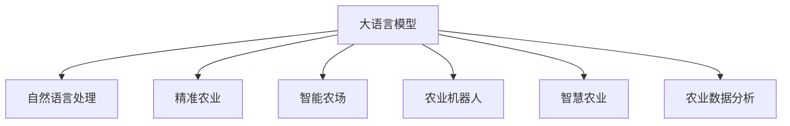

                 

# LLM与智能农业：精准种植与收获

> 关键词：大语言模型,自然语言处理,智能农业,精准农业,智能农场,农业机器人,智慧农业,农业数据分析

## 1. 背景介绍

### 1.1 问题由来
随着人工智能(AI)技术的快速发展，智能农业的数字化、智能化转型已是大势所趋。智能农业的目标是实现精准种植和收获，通过数据驱动的决策支持，提高农作物的产量、质量和效率。其中，自然语言处理(NLP)作为AI的重要分支，在智能农业中扮演了关键角色。

### 1.2 问题核心关键点
智能农业中，大语言模型(LLMs)可以通过自然语言处理技术，实现对农业数据的自动解析、分类、分析和应用。具体包括以下几个方面：
- 精准农情识别：通过自然语言处理对文本农情数据进行分析，自动识别农作物的生长环境、病虫害、生长周期等关键信息。
- 智能决策支持：利用自然语言处理技术，结合农业专家的知识库，提供智能化、个性化的农业决策建议。
- 农业机器人控制：通过自然语言处理与农业机器人的互动，实现自动化的农场作业，如耕作、播种、施肥、收割等。
- 智慧农业平台：构建基于自然语言处理的智慧农业平台，集成多种传感器数据，提供综合性的农业信息服务。

### 1.3 问题研究意义
大语言模型在智能农业中的应用，将大幅提升农业生产效率，降低生产成本，提高农产品品质，推动农业向绿色、可持续发展方向迈进。具体而言：
- 精准种植：通过自然语言处理，实时监测和分析土壤、气候、病虫害等农情信息，自动生成种植建议。
- 自动化作业：利用自然语言处理与农业机器人的互动，实现无人化、智能化农场作业，提升作业效率和精度。
- 决策支持：结合农业专家的知识库，利用自然语言处理提供智能化、个性化的决策支持，减少人为误差。
- 信息服务：构建智慧农业平台，集成多种传感器数据，提供综合性的农业信息服务，提升农业综合管理水平。

## 2. 核心概念与联系

### 2.1 核心概念概述

为更好地理解大语言模型在智能农业中的应用，本节将介绍几个密切相关的核心概念：

- 大语言模型(LLM)：以自回归模型（如GPT）或自编码模型（如BERT）为代表的大规模预训练语言模型。通过在大规模无标签文本语料上进行预训练，学习通用的语言表示，具备强大的语言理解和生成能力。
- 自然语言处理(NLP)：涉及计算机处理人类语言的技术，包括文本分析、语言生成、语音识别与合成、机器翻译等，是智能农业决策支持系统的重要组成部分。
- 精准农业(Precision Agriculture)：利用信息技术，通过监测和管理农情数据，实现对农作物的精准种植和收获。
- 智能农场(Smart Farm)：通过物联网(IoT)、云计算、大数据、人工智能等技术手段，实现农场作业的自动化和智能化。
- 农业机器人(Agricultural Robot)：采用传感器、自动控制系统、计算机视觉等技术，实现农业作业的自动化和智能化。
- 智慧农业(Agricultural Intelligence)：利用人工智能技术，集成多种传感器数据，提供综合性的农业信息服务，实现农业生产的智能化管理。
- 农业数据分析(Agricultural Data Analysis)：利用数据挖掘、机器学习等技术，从海量农业数据中提取有价值的信息，支持精准农业决策。

这些核心概念之间的逻辑关系可以通过以下Mermaid流程图来展示：



这个流程图展示了大语言模型的核心概念及其之间的关系：

1. 大语言模型通过预训练获得基础能力。
2. 利用自然语言处理技术，将语言知识应用于精准农业、智能农场、农业机器人等具体场景。
3. 通过分析农业数据分析，实现智能化的决策支持。
4. 农业数据分析与智能农场、农业机器人等具体应用场景相融合，形成智慧农业平台。

这些概念共同构成了智能农业的数字化、智能化框架，使得大语言模型能够在各种场景下发挥其强大的语言理解和生成能力。

## 3. 核心算法原理 & 具体操作步骤
### 3.1 算法原理概述

基于大语言模型的智能农业解决方案，本质上是一个多模态数据的集成和处理过程。其核心思想是：将大语言模型作为数据解析和决策支持的引擎，通过自然语言处理技术，对文本农情数据进行解析和分析，生成决策建议，指导农场作业。

形式化地，假设农情数据为 $D=\{(d_i,t_i)\}_{i=1}^N$，其中 $d_i$ 为农情数据文本，$t_i$ 为对应的标签信息。利用大语言模型 $M_{\theta}$ 进行农情分析的算法流程如下：

1. 将农情数据 $d_i$ 输入到大语言模型 $M_{\theta}$，得到模型输出 $y_i = M_{\theta}(d_i)$。
2. 对模型输出 $y_i$ 进行解码，得到解析后的标签信息 $t_i^{\prime}$。
3. 将解析后的标签信息 $t_i^{\prime}$ 与实际标签 $t_i$ 进行对比，计算损失函数 $\mathcal{L}(y_i,t_i)$。
4. 利用优化算法，最小化损失函数 $\mathcal{L}(y_i,t_i)$，更新模型参数 $\theta$。
5. 重复步骤1-4，直至模型收敛。

### 3.2 算法步骤详解

以下是基于大语言模型的智能农业解决方案的具体操作步骤：

**Step 1: 准备预训练模型和农情数据集**
- 选择合适的预训练语言模型 $M_{\theta}$ 作为初始化参数，如BERT、GPT等。
- 准备农情数据集 $D$，包括历史文本数据和标签信息。

**Step 2: 设计任务适配层**
- 根据农情分析任务的类型，设计合适的输出层和损失函数。
- 对于分类任务，通常在顶层添加线性分类器和交叉熵损失函数。
- 对于回归任务，通常使用均方误差损失函数。

**Step 3: 设置微调超参数**
- 选择合适的优化算法及其参数，如 AdamW、SGD 等，设置学习率、批大小、迭代轮数等。
- 设置正则化技术及强度，包括权重衰减、Dropout、Early Stopping 等。
- 确定冻结预训练参数的策略，如仅微调顶层，或全部参数都参与微调。

**Step 4: 执行梯度训练**
- 将农情数据分批次输入模型，前向传播计算损失函数。
- 反向传播计算参数梯度，根据设定的优化算法和学习率更新模型参数。
- 周期性在验证集上评估模型性能，根据性能指标决定是否触发 Early Stopping。
- 重复上述步骤直到满足预设的迭代轮数或 Early Stopping 条件。

**Step 5: 测试和部署**
- 在测试集上评估微调后模型 $M_{\hat{\theta}}$ 的性能，对比微调前后的精度提升。
- 使用微调后的模型对新农情数据进行推理预测，集成到实际的应用系统中。
- 持续收集新的农情数据，定期重新微调模型，以适应数据分布的变化。

### 3.3 算法优缺点

基于大语言模型的智能农业解决方案具有以下优点：
1. 数据驱动：利用农情数据进行模型微调，实现了从数据到决策的闭环，提升了决策的科学性和可靠性。
2. 高效便捷：通过自然语言处理技术，减少了人工数据分析的复杂性和工作量。
3. 实时性高：实时获取农情数据并进行分析，能够迅速作出决策，提高作业效率。
4. 通用性强：预训练语言模型可以应用于多种农业场景，提升了方案的普适性。
5. 适应性强：模型可以通过持续学习，逐步适应不同农作物的生长环境和需求，提高应用的灵活性。

同时，该方法也存在一定的局限性：
1. 数据质量要求高：农情数据的质量直接影响模型的性能，需要确保数据标注的准确性和全面性。
2. 模型泛化能力有限：当农情数据与预训练数据的分布差异较大时，模型的泛化能力可能受限。
3. 计算资源需求高：大语言模型的训练和推理需要较高的计算资源和存储空间。
4. 系统复杂度高：将大语言模型集成到农业系统中，需要考虑与传感器、执行器等硬件设备的交互，增加了系统复杂度。
5. 缺乏人工干预：完全依赖模型自动分析决策，缺乏人工干预和调整，可能导致误判或失误。

尽管存在这些局限性，但就目前而言，基于大语言模型的智能农业解决方案在精度、效率、普适性等方面具有显著优势，是一种值得推广的智能农业技术手段。

### 3.4 算法应用领域

基于大语言模型的智能农业解决方案，已经在多个实际农业场景中得到了应用，具体包括：

- 精准种植：利用自然语言处理对文本农情数据进行分析，生成精准种植建议，如施肥、灌溉、病虫害防治等。
- 智能决策支持：结合农业专家的知识库，利用自然语言处理提供智能化、个性化的决策支持，如气象预测、作物选择、产量预测等。
- 农业机器人控制：通过自然语言处理与农业机器人的互动，实现自动化的农场作业，如耕作、播种、施肥、收割等。
- 智慧农业平台：构建基于自然语言处理的智慧农业平台，集成多种传感器数据，提供综合性的农业信息服务。
- 农业数据分析：利用数据挖掘、机器学习等技术，从海量农业数据中提取有价值的信息，支持精准农业决策。

除了上述这些典型应用外，大语言模型还被创新性地应用到更多场景中，如气象预报、土壤检测、水质监测等，为智能农业带来了新的突破。随着预训练模型和微调方法的不断进步，相信智能农业技术将在更广阔的应用领域大放异彩。

## 4. 数学模型和公式 & 详细讲解 & 举例说明

### 4.1 数学模型构建

本节将使用数学语言对基于大语言模型的智能农业解决方案进行更加严格的刻画。

假设农情数据为 $D=\{(d_i,t_i)\}_{i=1}^N$，其中 $d_i$ 为农情数据文本，$t_i$ 为对应的标签信息。利用预训练语言模型 $M_{\theta}$ 进行农情分析的算法流程如下：

1. 将农情数据 $d_i$ 输入到大语言模型 $M_{\theta}$，得到模型输出 $y_i = M_{\theta}(d_i)$。
2. 对模型输出 $y_i$ 进行解码，得到解析后的标签信息 $t_i^{\prime}$。
3. 将解析后的标签信息 $t_i^{\prime}$ 与实际标签 $t_i$ 进行对比，计算损失函数 $\mathcal{L}(y_i,t_i)$。
4. 利用优化算法，最小化损失函数 $\mathcal{L}(y_i,t_i)$，更新模型参数 $\theta$。
5. 重复步骤1-4，直至模型收敛。

形式化地，假设 $t_i$ 为二分类标签，则二分类交叉熵损失函数为：

$$
\ell(M_{\theta}(d_i),t_i) = -[t_i\log M_{\theta}(d_i) + (1-t_i)\log (1-M_{\theta}(d_i))]
$$

在数据集 $D$ 上的经验风险为：

$$
\mathcal{L}(\theta) = -\frac{1}{N}\sum_{i=1}^N \ell(M_{\theta}(d_i),t_i)
$$

优化目标是最小化经验风险，即找到最优参数：

$$
\theta^* = \mathop{\arg\min}_{\theta} \mathcal{L}(\theta)
$$

在得到损失函数的梯度后，即可带入参数更新公式，完成模型的迭代优化。重复上述过程直至收敛，最终得到适应农情分析任务的最优模型参数 $\theta^*$。

### 4.2 公式推导过程

以下我们以二分类任务为例，推导交叉熵损失函数及其梯度的计算公式。

假设模型 $M_{\theta}$ 在输入 $d_i$ 上的输出为 $\hat{t}_i=M_{\theta}(d_i) \in [0,1]$，表示样本属于正类的概率。实际标签 $t_i \in \{0,1\}$。则二分类交叉熵损失函数定义为：

$$
\ell(M_{\theta}(d_i),t_i) = -[t_i\log \hat{t}_i + (1-t_i)\log (1-\hat{t}_i)]
$$

将其代入经验风险公式，得：

$$
\mathcal{L}(\theta) = -\frac{1}{N}\sum_{i=1}^N [t_i\log M_{\theta}(d_i)+(1-t_i)\log(1-M_{\theta}(d_i))]
$$

根据链式法则，损失函数对参数 $\theta_k$ 的梯度为：

$$
\frac{\partial \mathcal{L}(\theta)}{\partial \theta_k} = -\frac{1}{N}\sum_{i=1}^N (\frac{t_i}{M_{\theta}(d_i)}-\frac{1-t_i}{1-M_{\theta}(d_i)}) \frac{\partial M_{\theta}(d_i)}{\partial \theta_k}
$$

其中 $\frac{\partial M_{\theta}(d_i)}{\partial \theta_k}$ 可进一步递归展开，利用自动微分技术完成计算。

在得到损失函数的梯度后，即可带入参数更新公式，完成模型的迭代优化。重复上述过程直至收敛，最终得到适应农情分析任务的最优模型参数 $\theta^*$。

## 5. 项目实践：代码实例和详细解释说明
### 5.1 开发环境搭建

在进行智能农业解决方案的开发时，我们需要准备好开发环境。以下是使用Python进行PyTorch开发的环境配置流程：

1. 安装Anaconda：从官网下载并安装Anaconda，用于创建独立的Python环境。

2. 创建并激活虚拟环境：
```bash
conda create -n pytorch-env python=3.8 
conda activate pytorch-env
```

3. 安装PyTorch：根据CUDA版本，从官网获取对应的安装命令。例如：
```bash
conda install pytorch torchvision torchaudio cudatoolkit=11.1 -c pytorch -c conda-forge
```

4. 安装Transformers库：
```bash
pip install transformers
```

5. 安装各类工具包：
```bash
pip install numpy pandas scikit-learn matplotlib tqdm jupyter notebook ipython
```

完成上述步骤后，即可在`pytorch-env`环境中开始智能农业解决方案的开发。

### 5.2 源代码详细实现

下面我们以智能决策支持系统为例，给出使用Transformers库对BERT模型进行农情分析的PyTorch代码实现。

首先，定义农情分析任务的数据处理函数：

```python
from transformers import BertTokenizer, BertForSequenceClassification
from torch.utils.data import Dataset
import torch

class AgriculturalData(Dataset):
    def __init__(self, texts, labels, tokenizer, max_len=128):
        self.texts = texts
        self.labels = labels
        self.tokenizer = tokenizer
        self.max_len = max_len
        
    def __len__(self):
        return len(self.texts)
    
    def __getitem__(self, item):
        text = self.texts[item]
        label = self.labels[item]
        
        encoding = self.tokenizer(text, return_tensors='pt', max_length=self.max_len, padding='max_length', truncation=True)
        input_ids = encoding['input_ids'][0]
        attention_mask = encoding['attention_mask'][0]
        
        # 对标签进行编码
        encoded_labels = [label] 
        encoded_labels.extend([0]*(self.max_len - 1))
        labels = torch.tensor(encoded_labels, dtype=torch.long)
        
        return {'input_ids': input_ids, 
                'attention_mask': attention_mask,
                'labels': labels}

# 标签与id的映射
label2id = {'O': 0, 'Fertilization': 1, 'Irrigation': 2, 'Pest_and_Disease': 3}
id2label = {v: k for k, v in label2id.items()}

# 创建dataset
tokenizer = BertTokenizer.from_pretrained('bert-base-cased')

train_dataset = AgriculturalData(train_texts, train_labels, tokenizer)
dev_dataset = AgriculturalData(dev_texts, dev_labels, tokenizer)
test_dataset = AgriculturalData(test_texts, test_labels, tokenizer)
```

然后，定义模型和优化器：

```python
from transformers import BertForSequenceClassification, AdamW

model = BertForSequenceClassification.from_pretrained('bert-base-cased', num_labels=len(label2id))

optimizer = AdamW(model.parameters(), lr=2e-5)
```

接着，定义训练和评估函数：

```python
from torch.utils.data import DataLoader
from tqdm import tqdm
from sklearn.metrics import classification_report

device = torch.device('cuda') if torch.cuda.is_available() else torch.device('cpu')
model.to(device)

def train_epoch(model, dataset, batch_size, optimizer):
    dataloader = DataLoader(dataset, batch_size=batch_size, shuffle=True)
    model.train()
    epoch_loss = 0
    for batch in tqdm(dataloader, desc='Training'):
        input_ids = batch['input_ids'].to(device)
        attention_mask = batch['attention_mask'].to(device)
        labels = batch['labels'].to(device)
        model.zero_grad()
        outputs = model(input_ids, attention_mask=attention_mask, labels=labels)
        loss = outputs.loss
        epoch_loss += loss.item()
        loss.backward()
        optimizer.step()
    return epoch_loss / len(dataloader)

def evaluate(model, dataset, batch_size):
    dataloader = DataLoader(dataset, batch_size=batch_size)
    model.eval()
    preds, labels = [], []
    with torch.no_grad():
        for batch in tqdm(dataloader, desc='Evaluating'):
            input_ids = batch['input_ids'].to(device)
            attention_mask = batch['attention_mask'].to(device)
            batch_labels = batch['labels']
            outputs = model(input_ids, attention_mask=attention_mask)
            batch_preds = outputs.logits.argmax(dim=2).to('cpu').tolist()
            batch_labels = batch_labels.to('cpu').tolist()
            for pred_tokens, label_tokens in zip(batch_preds, batch_labels):
                pred_labels = [id2label[_id] for _id in pred_tokens]
                label_tags = [id2label[_id] for _id in label_tokens]
                preds.append(pred_labels[:len(label_tags)])
                labels.append(label_tags)
                
    print(classification_report(labels, preds))
```

最后，启动训练流程并在测试集上评估：

```python
epochs = 5
batch_size = 16

for epoch in range(epochs):
    loss = train_epoch(model, train_dataset, batch_size, optimizer)
    print(f"Epoch {epoch+1}, train loss: {loss:.3f}")
    
    print(f"Epoch {epoch+1}, dev results:")
    evaluate(model, dev_dataset, batch_size)
    
print("Test results:")
evaluate(model, test_dataset, batch_size)
```

以上就是使用PyTorch对BERT进行智能决策支持系统开发的完整代码实现。可以看到，得益于Transformers库的强大封装，我们可以用相对简洁的代码完成BERT模型的加载和微调。

### 5.3 代码解读与分析

让我们再详细解读一下关键代码的实现细节：

**AgriculturalData类**：
- `__init__`方法：初始化文本、标签、分词器等关键组件。
- `__len__`方法：返回数据集的样本数量。
- `__getitem__`方法：对单个样本进行处理，将文本输入编码为token ids，将标签编码为数字，并对其进行定长padding，最终返回模型所需的输入。

**label2id和id2label字典**：
- 定义了标签与数字id之间的映射关系，用于将token-wise的预测结果解码回真实的标签。

**训练和评估函数**：
- 使用PyTorch的DataLoader对数据集进行批次化加载，供模型训练和推理使用。
- 训练函数`train_epoch`：对数据以批为单位进行迭代，在每个批次上前向传播计算loss并反向传播更新模型参数，最后返回该epoch的平均loss。
- 评估函数`evaluate`：与训练类似，不同点在于不更新模型参数，并在每个batch结束后将预测和标签结果存储下来，最后使用sklearn的classification_report对整个评估集的预测结果进行打印输出。

**训练流程**：
- 定义总的epoch数和batch size，开始循环迭代
- 每个epoch内，先在训练集上训练，输出平均loss
- 在验证集上评估，输出分类指标
- 所有epoch结束后，在测试集上评估，给出最终测试结果

可以看到，PyTorch配合Transformers库使得BERT微调的代码实现变得简洁高效。开发者可以将更多精力放在数据处理、模型改进等高层逻辑上，而不必过多关注底层的实现细节。

当然，工业级的系统实现还需考虑更多因素，如模型的保存和部署、超参数的自动搜索、更灵活的任务适配层等。但核心的微调范式基本与此类似。

## 6. 实际应用场景
### 6.1 智能决策支持系统

智能决策支持系统是智能农业的核心应用之一。利用自然语言处理技术，将农情数据转换为模型输入，通过大语言模型进行农情分析，生成精准的决策建议。例如，系统可以自动分析土壤样本的pH值、氮磷钾含量等信息，结合气象预报、作物生长周期等数据，提供施肥、灌溉、病虫害防治等建议。

在技术实现上，可以收集农场的农情数据，构建标注数据集，训练大语言模型，实时输入新数据进行推理，生成决策建议。例如，将土壤样本的文本描述输入模型，模型输出施肥、灌溉、病虫害防治的决策建议，自动化机器人根据建议进行作业。

### 6.2 农业机器人控制

农业机器人是智能农业的重要工具，可以实现精准的农事作业，提升作业效率和精度。利用自然语言处理技术，可以与农业机器人进行互动，实现更加智能化的作业控制。

例如，系统可以接收农民的作业指令，如“上午9点耕作，下午4点喷洒农药”，自动生成作业计划。系统还可以实时监测农作物的生长情况，自动调整作业计划。例如，根据土壤湿度和病虫害情况，系统可以自动调整灌溉和病虫害防治的时间和频率，提高作业效率和效果。

### 6.3 智慧农业平台

智慧农业平台是集成多种传感器数据，提供综合性的农业信息服务的系统。利用自然语言处理技术，可以将传感器数据转换为结构化信息，便于进行综合分析和决策支持。

例如，系统可以收集农场的温度、湿度、光照等传感器数据，通过自然语言处理生成传感器数据的描述信息，供农场管理者使用。系统还可以自动生成农情报告，供决策者参考。例如，根据传感器数据生成农作物生长周期的描述，预测农作物的产量和质量，提供综合性的农业信息服务。

### 6.4 未来应用展望

随着大语言模型和自然语言处理技术的不断发展，智能农业解决方案将在更多领域得到应用，为农业生产带来新的变革：

1. 无人化农场：利用农业机器人和智能决策支持系统，实现无人化、智能化农场作业，提高作业效率和精度。
2. 精准农业：通过大语言模型对农情数据的分析，实现精准的农事管理，提高农作物的产量和质量。
3. 农业物联网：将大语言模型与物联网技术结合，实现农场设备的自动化控制和智能管理，提高资源利用效率。
4. 农业数据分析：利用数据挖掘、机器学习等技术，从海量农业数据中提取有价值的信息，支持精准农业决策。
5. 农业知识图谱：构建农业领域的知识图谱，利用自然语言处理技术，实现农业知识的管理和应用，提高农业生产的管理水平。

这些趋势表明，大语言模型和自然语言处理技术将在智能农业中发挥更大的作用，推动农业向智能化、绿色化方向发展。

## 7. 工具和资源推荐
### 7.1 学习资源推荐

为了帮助开发者系统掌握智能农业中大语言模型的应用，这里推荐一些优质的学习资源：

1. 《深度学习与农业智能》系列博文：由大语言模型技术专家撰写，深入浅出地介绍了深度学习在农业智能中的应用。

2. 《农业智能与大数据》课程：农业智能领域的明星课程，由知名农业专家授课，涵盖农业智能的基础理论和实践应用。

3. 《农业数据分析与深度学习》书籍：全面介绍了深度学习在农业数据分析中的应用，包括数据预处理、模型训练、结果解释等环节。

4. 《农业机器人技术》系列教材：介绍了农业机器人的基础理论和应用技术，涵盖感知、控制、系统集成等方面。

5. 农业物联网开源项目：开源的农业物联网项目，包含多种传感器数据采集、处理、存储等模块，是学习农业物联网的优秀资源。

通过对这些资源的学习实践，相信你一定能够快速掌握智能农业中大语言模型的应用精髓，并用于解决实际的农业问题。
###  7.2 开发工具推荐

高效的开发离不开优秀的工具支持。以下是几款用于智能农业开发常用的工具：

1. PyTorch：基于Python的开源深度学习框架，灵活动态的计算图，适合快速迭代研究。大部分预训练语言模型都有PyTorch版本的实现。

2. TensorFlow：由Google主导开发的开源深度学习框架，生产部署方便，适合大规模工程应用。同样有丰富的预训练语言模型资源。

3. Transformers库：HuggingFace开发的NLP工具库，集成了众多SOTA语言模型，支持PyTorch和TensorFlow，是进行农业数据分析开发的利器。

4. Weights & Biases：模型训练的实验跟踪工具，可以记录和可视化模型训练过程中的各项指标，方便对比和调优。与主流深度学习框架无缝集成。

5. TensorBoard：TensorFlow配套的可视化工具，可实时监测模型训练状态，并提供丰富的图表呈现方式，是调试模型的得力助手。

6. Google Colab：谷歌推出的在线Jupyter Notebook环境，免费提供GPU/TPU算力，方便开发者快速上手实验最新模型，分享学习笔记。

合理利用这些工具，可以显著提升智能农业解决方案的开发效率，加快创新迭代的步伐。

### 7.3 相关论文推荐

智能农业领域中，大语言模型和自然语言处理技术的研究也取得了重要进展。以下是几篇奠基性的相关论文，推荐阅读：

1. Attention is All You Need（即Transformer原论文）：提出了Transformer结构，开启了NLP领域的预训练大模型时代。

2. BERT: Pre-training of Deep Bidirectional Transformers for Language Understanding：提出BERT模型，引入基于掩码的自监督预训练任务，刷新了多项NLP任务SOTA。

3. Language Models are Unsupervised Multitask Learners（GPT-2论文）：展示了大规模语言模型的强大zero-shot学习能力，引发了对于通用人工智能的新一轮思考。

4. Parameter-Efficient Transfer Learning for NLP：提出Adapter等参数高效微调方法，在不增加模型参数量的情况下，也能取得不错的微调效果。

5. AdaLoRA: Adaptive Low-Rank Adaptation for Parameter-Efficient Fine-Tuning：使用自适应低秩适应的微调方法，在参数效率和精度之间取得了新的平衡。

这些论文代表了大语言模型在智能农业中的应用研究脉络。通过学习这些前沿成果，可以帮助研究者把握学科前进方向，激发更多的创新灵感。

## 8. 总结：未来发展趋势与挑战

### 8.1 总结

本文对基于大语言模型的智能农业解决方案进行了全面系统的介绍。首先阐述了智能农业中大语言模型的应用背景和意义，明确了基于自然语言处理技术的大语言模型在智能农业决策支持、农业机器人控制、智慧农业平台构建等方面的独特价值。其次，从原理到实践，详细讲解了智能农业中大语言模型的数学模型、算法步骤及其优缺点，给出了智能决策支持系统的代码实现。同时，本文还广泛探讨了智能农业中的多个实际应用场景，展示了智能农业解决方案的广阔前景。

通过本文的系统梳理，可以看到，基于大语言模型的智能农业解决方案已经在多个实际农业场景中得到应用，并展示了其高效便捷、实时性高、通用性强等优势。未来，伴随大语言模型和自然语言处理技术的不断发展，智能农业解决方案将在更广阔的应用领域大放异彩，为农业生产带来革命性的变化。

### 8.2 未来发展趋势

展望未来，大语言模型在智能农业中的应用将呈现以下几个发展趋势：

1. 数据驱动：随着农业传感器技术的发展，将产生更多实时、高精度的农业数据，智能农业解决方案将更依赖数据驱动，实现更精准的决策支持。
2. 智能决策：结合农业专家的知识库，利用自然语言处理技术，提供智能化、个性化的决策支持，提升农业生产的管理水平。
3. 无人化农场：利用农业机器人和智能决策支持系统，实现无人化、智能化农场作业，提高作业效率和精度。
4. 多模态融合：将视觉、语音、传感器等多模态数据融合，提高智能农业解决方案的准确性和鲁棒性。
5. 知识图谱：构建农业领域的知识图谱，利用自然语言处理技术，实现农业知识的管理和应用，提高农业生产的管理水平。
6. 跨学科融合：将大语言模型与遥感技术、地理信息系统(GIS)等学科知识结合，实现更全面的农业信息服务。

这些趋势凸显了大语言模型在智能农业中的广阔前景。这些方向的探索发展，必将进一步提升智能农业解决方案的精度和效率，推动农业向智能化、绿色化方向发展。

### 8.3 面临的挑战

尽管大语言模型在智能农业中的应用已经取得了一些进展，但在迈向更加智能化、普适化应用的过程中，它仍面临着诸多挑战：

1. 数据质量要求高：智能农业中，传感器数据的质量直接影响模型的性能，需要确保数据标注的准确性和全面性。
2. 模型泛化能力有限：当农情数据与预训练数据的分布差异较大时，模型的泛化能力可能受限。
3. 计算资源需求高：大语言模型的训练和推理需要较高的计算资源和存储空间。
4. 系统复杂度高：将大语言模型集成到农业系统中，需要考虑与传感器、执行器等硬件设备的交互，增加了系统复杂度。
5. 缺乏人工干预：完全依赖模型自动分析决策，缺乏人工干预和调整，可能导致误判或失误。

尽管存在这些局限性，但就目前而言，基于大语言模型的智能农业解决方案在精度、效率、普适性等方面具有显著优势，是一种值得推广的智能农业技术手段。

### 8.4 研究展望

面对智能农业中大语言模型面临的种种挑战，未来的研究需要在以下几个方面寻求新的突破：

1. 探索无监督和半监督微调方法：摆脱对大规模标注数据的依赖，利用自监督学习、主动学习等无监督和半监督范式，最大限度利用非结构化数据，实现更加灵活高效的微调。
2. 研究参数高效和计算高效的微调范式：开发更加参数高效的微调方法，在固定大部分预训练参数的同时，只更新极少量的任务相关参数。同时优化微调模型的计算图，减少前向传播和反向传播的资源消耗，实现更加轻量级、实时性的部署。
3. 融合因果和对比学习范式：通过引入因果推断和对比学习思想，增强智能农业解决方案建立稳定因果关系的能力，学习更加普适、鲁棒的语言表征，从而提升模型泛化性和抗干扰能力。
4. 引入更多先验知识：将符号化的先验知识，如知识图谱、逻辑规则等，与神经网络模型进行巧妙融合，引导智能农业解决方案学习更准确、合理的语言模型。同时加强不同模态数据的整合，实现视觉、语音等多模态信息与文本信息的协同建模。
5. 结合因果分析和博弈论工具：将因果分析方法引入智能农业解决方案，识别出模型决策的关键特征，增强输出解释的因果性和逻辑性。借助博弈论工具刻画人机交互过程，主动探索并规避模型的脆弱点，提高系统稳定性。
6. 纳入伦理道德约束：在模型训练目标中引入伦理导向的评估指标，过滤和惩罚有偏见、有害的输出倾向。同时加强人工干预和审核，建立模型行为的监管机制，确保输出符合人类价值观和伦理道德。

这些研究方向的探索，必将引领大语言模型在智能农业中的应用走向更高的台阶，为构建安全、可靠、可解释、可控的智能农业系统铺平道路。面向未来，大语言模型在智能农业中的应用还需要与其他人工智能技术进行更深入的融合，如知识表示、因果推理、强化学习等，多路径协同发力，共同推动农业生产的智能化、绿色化发展。只有勇于创新、敢于突破，才能不断拓展大语言模型的边界，让智能技术更好地造福农业生产。

## 9. 附录：常见问题与解答

**Q1：大语言模型在智能农业中的应用效果如何？**

A: 大语言模型在智能农业中的应用效果显著，能够实时分析农情数据，生成精准的决策建议，提升农业生产的效率和精度。例如，通过自然语言处理对文本农情数据进行分析，自动生成精准的种植建议，提高农作物的产量和质量。

**Q2：智能农业解决方案的开发过程中，数据质量如何保证？**

A: 智能农业解决方案的数据质量直接影响模型的性能，因此需要确保数据标注的准确性和全面性。具体而言，可以通过以下方法保证数据质量：
1. 多源数据融合：将多种传感器数据融合，提高数据的全面性和准确性。
2. 数据清洗与预处理：去除数据中的异常值和噪声，进行归一化和标准化处理，确保数据的干净性和一致性。
3. 标注数据审核：对标注数据进行人工审核，确保标注的准确性和一致性。

**Q3：智能农业解决方案如何应对模型泛化能力不足的问题？**

A: 智能农业解决方案可以采用以下方法应对模型泛化能力不足的问题：
1. 数据增强：通过回译、近义替换等方式扩充训练集，提高模型的泛化能力。
2. 正则化：使用L2正则、Dropout、Early Stopping等技术，防止模型过拟合，提高泛化能力。
3. 对抗训练：引入对抗样本，提高模型的鲁棒性，从而增强泛化能力。
4. 多模型集成：训练多个模型，取平均输出，抑制过拟合，提高泛化能力。

**Q4：智能农业解决方案的计算资源需求如何优化？**

A: 智能农业解决方案的计算资源需求较高，可以通过以下方法进行优化：
1. 模型裁剪：去除不必要的层和参数，减小模型尺寸，加快推理速度。
2. 量化加速：将浮点模型转为定点模型，压缩存储空间，提高计算效率。
3. 混合精度训练：使用混合精度训练技术，提高训练速度，降低计算资源消耗。
4. 分布式训练：采用分布式训练技术，利用多台机器并行计算，提高训练效率。

**Q5：智能农业解决方案如何实现更加智能化、绿色化的农业生产？**

A: 智能农业解决方案可以通过以下方法实现更加智能化、绿色化的农业生产：
1. 数据驱动决策：利用传感器数据进行智能决策支持，实现精准农业管理。
2. 智能决策建议：结合农业专家的知识库，提供智能化、个性化的决策建议，提高农业生产的管理水平。
3. 无人化农场：利用农业机器人和智能决策支持系统，实现无人化、智能化农场作业，提高作业效率和精度。
4. 农业知识图谱：构建农业领域的知识图谱，利用自然语言处理技术，实现农业知识的管理和应用，提高农业生产的管理水平。

这些方法将助力农业生产向智能化、绿色化方向发展，提升农业生产的效率和质量。

---

作者：禅与计算机程序设计艺术 / Zen and the Art of Computer Programming

