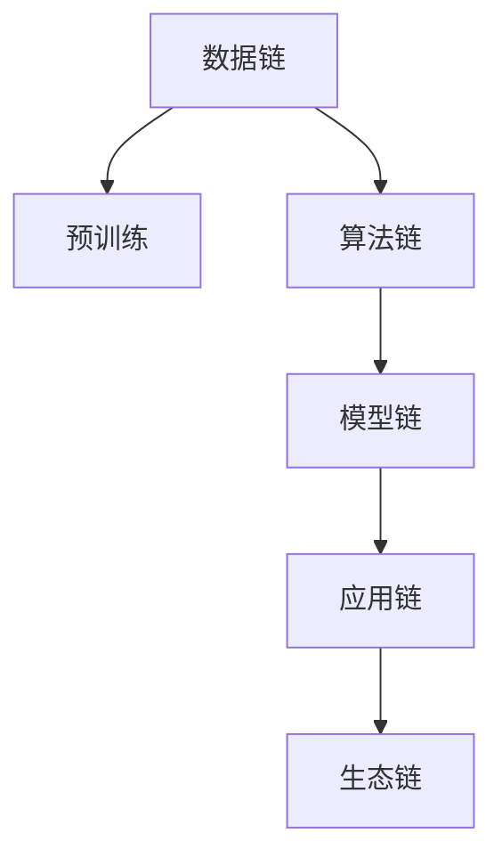

                 

# LLM产业链生态:从无到有的蝶变

> 关键词：语言模型,大模型,产业链,生态系统,深度学习,计算机视觉,自然语言处理(NLP),语音识别,机器人,增强学习

## 1. 背景介绍

### 1.1 问题由来

随着深度学习技术的不断进步，大规模语言模型(LLM)在自然语言处理(NLP)和计算机视觉(CV)等领域取得了显著的进展。LLM能够理解和生成自然语言，处理文本分类、情感分析、翻译、对话等复杂任务，并在图像识别、语音识别、机器人等方面显示出巨大的潜力。然而，从早期的基于规则的系统，到目前基于深度学习的智能系统，LLM的发展离不开整个产业链的协同合作。

### 1.2 问题核心关键点

LLM的产业链生态系统涉及从硬件基础设施到数据、算法、模型、应用软件等多个环节。以下是该系统的核心关键点：

- 数据链：数据采集、标注、清洗、存储。数据是深度学习的基础，对模型的训练质量和性能有决定性影响。
- 算法链：模型架构、训练优化、损失函数、正则化。这些算法直接决定模型的性能和泛化能力。
- 模型链：预训练模型、微调模型、集成模型。模型的选择和设计对性能有重要影响。
- 应用链：部署、监控、优化、维护。应用软件的性能和可靠性直接决定用户的使用体验。
- 生态链：产业链的各个环节相互依存、相互促进，共同推动整个生态系统的健康发展。

## 2. 核心概念与联系

### 2.1 核心概念概述

为了更好地理解LLM产业链生态系统，本文将介绍几个核心概念：

- **大规模语言模型(LLM)**：指通过大规模无标签数据预训练，学习语言知识的大模型。典型如GPT、BERT、T5等。
- **预训练(Pre-training)**：指在大规模无标签数据上，通过自监督学习任务训练模型，学习通用语言表示。
- **微调(Fine-tuning)**：指在预训练模型的基础上，使用下游任务的少量标注数据，优化模型在特定任务上的性能。
- **迁移学习(Transfer Learning)**：指将一个领域学习到的知识，迁移应用到另一个相关领域的学习范式。
- **持续学习(Continual Learning)**：指模型能够持续从新数据中学习，同时保持已学习的知识。

这些概念之间的逻辑关系可以通过以下Mermaid流程图来展示：



这个流程图展示了LLM产业链生态系统的核心概念及其之间的关系：

1. 数据链为预训练提供基础数据，预训练通过算法链训练出通用语言模型。
2. 通用语言模型通过微调适配特定任务，获得适应性更强的模型。
3. 微调后的模型在应用链上部署、监控、优化，提升用户使用体验。
4. 应用反馈促进算法链和模型链的迭代优化，共同推动生态链的持续发展。

## 3. 核心算法原理 & 具体操作步骤
### 3.1 算法原理概述

LLM产业链生态系统的核心算法原理主要集中在预训练、微调和迁移学习三个方面。这些算法共同作用，提升了LLM在不同应用场景下的性能。

### 3.2 算法步骤详解

#### 预训练

预训练是构建LLM的基础步骤。预训练通常采用自监督学习方法，如Masked Language Model(MLM)、Next Sentence Prediction(NSP)等。

具体步骤如下：

1. **数据准备**：收集大规模无标签文本数据，如维基百科、新闻、小说等。
2. **模型设计**：设计合适的模型架构，如Transformer模型。
3. **训练优化**：使用优化算法(如AdamW)训练模型，最小化自监督学习任务的目标函数。
4. **保存模型**：保存预训练好的模型参数，供后续微调使用。

#### 微调

微调是将预训练模型适配特定任务的过程。微调通常在少量标注数据上进行，以提高模型在特定任务上的性能。

具体步骤如下：

1. **数据准备**：收集下游任务的少量标注数据。
2. **模型初始化**：加载预训练模型参数。
3. **任务适配**：设计合适的任务适配层，如分类器或解码器。
4. **优化训练**：使用优化算法(如AdamW)训练模型，最小化任务损失函数。
5. **性能评估**：在验证集上评估模型性能，调整超参数。
6. **部署应用**：将微调后的模型应用于实际任务中。

#### 迁移学习

迁移学习是指将预训练模型知识迁移到新任务中，提高模型泛化能力。

具体步骤如下：

1. **数据准备**：收集新任务的标注数据。
2. **模型初始化**：加载预训练模型参数。
3. **任务适配**：设计合适的任务适配层，如分类器或解码器。
4. **优化训练**：使用优化算法(如AdamW)训练模型，最小化任务损失函数。
5. **性能评估**：在验证集上评估模型性能，调整超参数。
6. **部署应用**：将迁移学习后的模型应用于实际任务中。

### 3.3 算法优缺点

#### 预训练

**优点**：

- 大规模数据训练使模型拥有更强的泛化能力。
- 自监督任务能够学习到语言结构知识。

**缺点**：

- 需要大量计算资源和时间。
- 数据质量对模型性能有重要影响。

#### 微调

**优点**：

- 少量标注数据即可完成任务适配。
- 适应性更强，能够处理特定任务。

**缺点**：

- 依赖标注数据，标注成本较高。
- 过拟合风险较大。

#### 迁移学习

**优点**：

- 利用预训练模型知识，减少训练时间。
- 提高模型泛化能力，适应更多任务。

**缺点**：

- 数据迁移过程中可能丢失部分信息。
- 数据迁移质量对模型性能有重要影响。

## 4. 数学模型和公式 & 详细讲解  
### 4.1 数学模型构建

预训练和微调模型的数学模型主要集中在损失函数和优化算法两个方面。

#### 预训练

预训练通常采用自监督学习方法，如Masked Language Model(MLM)和Next Sentence Prediction(NSP)。

**MLM**：

假设模型参数为 $\theta$，输入为 $x$，目标函数为 $L(\theta, x)$。在MLM中，模型预测文本中缺失的token，目标函数为：

$$
L(\theta, x) = -\log P(\hat{x} | x)
$$

其中 $\hat{x}$ 表示模型预测的缺失token，$P(\hat{x} | x)$ 表示模型预测条件概率。

**NSP**：

NSP的任务是判断两个句子是否连续。目标函数为：

$$
L(\theta, x, y) = -\log P(y | x)
$$

其中 $y$ 表示两个句子是否连续的标签。

#### 微调

微调通常采用监督学习方法，如交叉熵损失函数。

假设模型参数为 $\theta$，输入为 $x$，标签为 $y$，输出为 $z$，目标函数为 $L(\theta, x, y)$。在微调中，模型预测标签，目标函数为：

$$
L(\theta, x, y) = -\log P(z | x)
$$

其中 $P(z | x)$ 表示模型预测条件概率。

### 4.2 公式推导过程

**MLM公式推导**：

假设输入文本 $x = (x_1, x_2, ..., x_n)$，其中 $x_i$ 为第 $i$ 个token。模型预测缺失的token $\hat{x} = (\hat{x}_1, \hat{x}_2, ..., \hat{x}_n)$。

对于每个token $x_i$，模型的目标函数为：

$$
L(\theta, x_i) = -\log P(\hat{x}_i | x_i)
$$

所有token的损失函数为：

$$
L(\theta, x) = \sum_{i=1}^n L(\theta, x_i)
$$

**NSP公式推导**：

假设输入文本对 $(x_1, x_2)$，目标函数为：

$$
L(\theta, x_1, x_2, y) = -\log P(y | x_1, x_2)
$$

其中 $y$ 表示两个句子是否连续的标签。

所有文本对的损失函数为：

$$
L(\theta, D) = \frac{1}{N} \sum_{i=1}^N L(\theta, x_i, y_i)
$$

其中 $N$ 为文本对数量。

**微调公式推导**：

假设输入文本 $x$，标签为 $y$，模型预测为 $z$。目标函数为：

$$
L(\theta, x, y) = -\log P(z | x)
$$

所有样本的损失函数为：

$$
L(\theta, D) = \frac{1}{N} \sum_{i=1}^N L(\theta, x_i, y_i)
$$

其中 $N$ 为样本数量。

### 4.3 案例分析与讲解

以情感分析任务为例，分析预训练、微调和迁移学习过程。

**预训练**：

1. **数据准备**：收集大规模无标签文本数据。
2. **模型设计**：使用Transformer模型。
3. **训练优化**：使用自监督任务MLM进行训练。
4. **保存模型**：保存预训练好的模型参数。

**微调**：

1. **数据准备**：收集少量标注情感数据。
2. **模型初始化**：加载预训练模型参数。
3. **任务适配**：设计分类器。
4. **优化训练**：使用交叉熵损失函数进行训练。
5. **性能评估**：在验证集上评估模型性能。
6. **部署应用**：将微调后的模型应用于实际任务中。

**迁移学习**：

1. **数据准备**：收集新任务的标注数据。
2. **模型初始化**：加载预训练模型参数。
3. **任务适配**：设计分类器。
4. **优化训练**：使用交叉熵损失函数进行训练。
5. **性能评估**：在验证集上评估模型性能。
6. **部署应用**：将迁移学习后的模型应用于实际任务中。

## 5. 项目实践：代码实例和详细解释说明
### 5.1 开发环境搭建

在进行LLM产业链生态系统开发前，我们需要准备好开发环境。以下是使用Python进行PyTorch开发的环境配置流程：

1. 安装Anaconda：从官网下载并安装Anaconda，用于创建独立的Python环境。

2. 创建并激活虚拟环境：
```bash
conda create -n pytorch-env python=3.8 
conda activate pytorch-env
```

3. 安装PyTorch：根据CUDA版本，从官网获取对应的安装命令。例如：
```bash
conda install pytorch torchvision torchaudio cudatoolkit=11.1 -c pytorch -c conda-forge
```

4. 安装Transformers库：
```bash
pip install transformers
```

5. 安装各类工具包：
```bash
pip install numpy pandas scikit-learn matplotlib tqdm jupyter notebook ipython
```

完成上述步骤后，即可在`pytorch-env`环境中开始开发。

### 5.2 源代码详细实现

这里我们以情感分析任务为例，给出使用Transformers库对BERT模型进行微调的PyTorch代码实现。

首先，定义情感分析任务的数据处理函数：

```python
from transformers import BertTokenizer
from torch.utils.data import Dataset
import torch

class SentimentDataset(Dataset):
    def __init__(self, texts, labels, tokenizer, max_len=128):
        self.texts = texts
        self.labels = labels
        self.tokenizer = tokenizer
        self.max_len = max_len
        
    def __len__(self):
        return len(self.texts)
    
    def __getitem__(self, item):
        text = self.texts[item]
        label = self.labels[item]
        
        encoding = self.tokenizer(text, return_tensors='pt', max_length=self.max_len, padding='max_length', truncation=True)
        input_ids = encoding['input_ids'][0]
        attention_mask = encoding['attention_mask'][0]
        
        # 将label编码为数字
        encoded_label = [1 if label == 'positive' else 0] 
        encoded_label.extend([0] * (self.max_len - len(encoded_label)))
        labels = torch.tensor(encoded_label, dtype=torch.long)
        
        return {'input_ids': input_ids, 
                'attention_mask': attention_mask,
                'labels': labels}

# 加载BERT模型和分词器
model = BertForSequenceClassification.from_pretrained('bert-base-uncased')
tokenizer = BertTokenizer.from_pretrained('bert-base-uncased')

# 准备数据
train_dataset = SentimentDataset(train_texts, train_labels, tokenizer)
dev_dataset = SentimentDataset(dev_texts, dev_labels, tokenizer)
test_dataset = SentimentDataset(test_texts, test_labels, tokenizer)

# 定义优化器和损失函数
optimizer = AdamW(model.parameters(), lr=2e-5)
criterion = CrossEntropyLoss()

# 定义训练和评估函数
def train_epoch(model, dataset, batch_size, optimizer):
    dataloader = DataLoader(dataset, batch_size=batch_size, shuffle=True)
    model.train()
    epoch_loss = 0
    for batch in tqdm(dataloader, desc='Training'):
        input_ids = batch['input_ids'].to(device)
        attention_mask = batch['attention_mask'].to(device)
        labels = batch['labels'].to(device)
        model.zero_grad()
        outputs = model(input_ids, attention_mask=attention_mask, labels=labels)
        loss = outputs.loss
        epoch_loss += loss.item()
        loss.backward()
        optimizer.step()
    return epoch_loss / len(dataloader)

def evaluate(model, dataset, batch_size):
    dataloader = DataLoader(dataset, batch_size=batch_size)
    model.eval()
    preds, labels = [], []
    with torch.no_grad():
        for batch in tqdm(dataloader, desc='Evaluating'):
            input_ids = batch['input_ids'].to(device)
            attention_mask = batch['attention_mask'].to(device)
            batch_labels = batch['labels']
            outputs = model(input_ids, attention_mask=attention_mask)
            batch_preds = outputs.logits.argmax(dim=1).to('cpu').tolist()
            batch_labels = batch_labels.to('cpu').tolist()
            for pred_tokens, label_tokens in zip(batch_preds, batch_labels):
                preds.append(pred_tokens[:len(label_tokens)])
                labels.append(label_tokens)
                
    print(classification_report(labels, preds))

# 训练和评估
epochs = 5
batch_size = 16

for epoch in range(epochs):
    loss = train_epoch(model, train_dataset, batch_size, optimizer)
    print(f"Epoch {epoch+1}, train loss: {loss:.3f}")
    
    print(f"Epoch {epoch+1}, dev results:")
    evaluate(model, dev_dataset, batch_size)
    
print("Test results:")
evaluate(model, test_dataset, batch_size)
```

以上就是使用PyTorch对BERT进行情感分析任务微调的完整代码实现。可以看到，得益于Transformers库的强大封装，我们可以用相对简洁的代码完成BERT模型的加载和微调。

### 5.3 代码解读与分析

让我们再详细解读一下关键代码的实现细节：

**SentimentDataset类**：
- `__init__`方法：初始化文本、标签、分词器等关键组件。
- `__len__`方法：返回数据集的样本数量。
- `__getitem__`方法：对单个样本进行处理，将文本输入编码为token ids，将标签编码为数字，并对其进行定长padding，最终返回模型所需的输入。

**标签与id的映射**：
- 定义了标签与数字id之间的映射关系，用于将token-wise的预测结果解码回真实的标签。

**训练和评估函数**：
- 使用PyTorch的DataLoader对数据集进行批次化加载，供模型训练和推理使用。
- 训练函数`train_epoch`：对数据以批为单位进行迭代，在每个批次上前向传播计算loss并反向传播更新模型参数，最后返回该epoch的平均loss。
- 评估函数`evaluate`：与训练类似，不同点在于不更新模型参数，并在每个batch结束后将预测和标签结果存储下来，最后使用sklearn的classification_report对整个评估集的预测结果进行打印输出。

**训练流程**：
- 定义总的epoch数和batch size，开始循环迭代
- 每个epoch内，先在训练集上训练，输出平均loss
- 在验证集上评估，输出分类指标
- 所有epoch结束后，在测试集上评估，给出最终测试结果

可以看到，PyTorch配合Transformers库使得BERT微调的代码实现变得简洁高效。开发者可以将更多精力放在数据处理、模型改进等高层逻辑上，而不必过多关注底层的实现细节。

当然，工业级的系统实现还需考虑更多因素，如模型的保存和部署、超参数的自动搜索、更灵活的任务适配层等。但核心的微调范式基本与此类似。

## 6. 实际应用场景
### 6.1 智能客服系统

基于大语言模型微调的对话技术，可以广泛应用于智能客服系统的构建。传统客服往往需要配备大量人力，高峰期响应缓慢，且一致性和专业性难以保证。而使用微调后的对话模型，可以7x24小时不间断服务，快速响应客户咨询，用自然流畅的语言解答各类常见问题。

在技术实现上，可以收集企业内部的历史客服对话记录，将问题和最佳答复构建成监督数据，在此基础上对预训练对话模型进行微调。微调后的对话模型能够自动理解用户意图，匹配最合适的答案模板进行回复。对于客户提出的新问题，还可以接入检索系统实时搜索相关内容，动态组织生成回答。如此构建的智能客服系统，能大幅提升客户咨询体验和问题解决效率。

### 6.2 金融舆情监测

金融机构需要实时监测市场舆论动向，以便及时应对负面信息传播，规避金融风险。传统的人工监测方式成本高、效率低，难以应对网络时代海量信息爆发的挑战。基于大语言模型微调的文本分类和情感分析技术，为金融舆情监测提供了新的解决方案。

具体而言，可以收集金融领域相关的新闻、报道、评论等文本数据，并对其进行主题标注和情感标注。在此基础上对预训练语言模型进行微调，使其能够自动判断文本属于何种主题，情感倾向是正面、中性还是负面。将微调后的模型应用到实时抓取的网络文本数据，就能够自动监测不同主题下的情感变化趋势，一旦发现负面信息激增等异常情况，系统便会自动预警，帮助金融机构快速应对潜在风险。

### 6.3 个性化推荐系统

当前的推荐系统往往只依赖用户的历史行为数据进行物品推荐，无法深入理解用户的真实兴趣偏好。基于大语言模型微调技术，个性化推荐系统可以更好地挖掘用户行为背后的语义信息，从而提供更精准、多样的推荐内容。

在实践中，可以收集用户浏览、点击、评论、分享等行为数据，提取和用户交互的物品标题、描述、标签等文本内容。将文本内容作为模型输入，用户的后续行为（如是否点击、购买等）作为监督信号，在此基础上微调预训练语言模型。微调后的模型能够从文本内容中准确把握用户的兴趣点。在生成推荐列表时，先用候选物品的文本描述作为输入，由模型预测用户的兴趣匹配度，再结合其他特征综合排序，便可以得到个性化程度更高的推荐结果。

### 6.4 未来应用展望

随着大语言模型微调技术的发展，其在更多领域的应用前景将不断拓展。

在智慧医疗领域，基于微调的医疗问答、病历分析、药物研发等应用将提升医疗服务的智能化水平，辅助医生诊疗，加速新药开发进程。

在智能教育领域，微调技术可应用于作业批改、学情分析、知识推荐等方面，因材施教，促进教育公平，提高教学质量。

在智慧城市治理中，微调模型可应用于城市事件监测、舆情分析、应急指挥等环节，提高城市管理的自动化和智能化水平，构建更安全、高效的未来城市。

此外，在企业生产、社会治理、文娱传媒等众多领域，基于大模型微调的人工智能应用也将不断涌现，为经济社会发展注入新的动力。相信随着技术的日益成熟，微调方法将成为人工智能落地应用的重要范式，推动人工智能技术向更广阔的领域加速渗透。

## 7. 工具和资源推荐
### 7.1 学习资源推荐

为了帮助开发者系统掌握LLM产业链生态系统的理论基础和实践技巧，这里推荐一些优质的学习资源：

1. 《深度学习与NLP：从原理到应用》系列博文：由大模型技术专家撰写，深入浅出地介绍了深度学习与NLP的基本原理和实践方法。

2. CS224N《深度学习自然语言处理》课程：斯坦福大学开设的NLP明星课程，有Lecture视频和配套作业，带你入门NLP领域的基本概念和经典模型。

3. 《Transformer从原理到实践》书籍：Transformer库的作者所著，全面介绍了如何使用Transformer库进行NLP任务开发，包括微调在内的诸多范式。

4. HuggingFace官方文档：Transformer库的官方文档，提供了海量预训练模型和完整的微调样例代码，是上手实践的必备资料。

5. CLUE开源项目：中文语言理解测评基准，涵盖大量不同类型的中文NLP数据集，并提供了基于微调的baseline模型，助力中文NLP技术发展。

通过对这些资源的学习实践，相信你一定能够快速掌握LLM产业链生态系统的精髓，并用于解决实际的NLP问题。
###  7.2 开发工具推荐

高效的开发离不开优秀的工具支持。以下是几款用于LLM产业链生态系统开发的常用工具：

1. PyTorch：基于Python的开源深度学习框架，灵活动态的计算图，适合快速迭代研究。大部分预训练语言模型都有PyTorch版本的实现。

2. TensorFlow：由Google主导开发的开源深度学习框架，生产部署方便，适合大规模工程应用。同样有丰富的预训练语言模型资源。

3. Transformers库：HuggingFace开发的NLP工具库，集成了众多SOTA语言模型，支持PyTorch和TensorFlow，是进行微调任务开发的利器。

4. Weights & Biases：模型训练的实验跟踪工具，可以记录和可视化模型训练过程中的各项指标，方便对比和调优。与主流深度学习框架无缝集成。

5. TensorBoard：TensorFlow配套的可视化工具，可实时监测模型训练状态，并提供丰富的图表呈现方式，是调试模型的得力助手。

6. Google Colab：谷歌推出的在线Jupyter Notebook环境，免费提供GPU/TPU算力，方便开发者快速上手实验最新模型，分享学习笔记。

合理利用这些工具，可以显著提升LLM产业链生态系统的开发效率，加快创新迭代的步伐。

### 7.3 相关论文推荐

LLM产业链生态系统的快速发展离不开学界的持续研究。以下是几篇奠基性的相关论文，推荐阅读：

1. Attention is All You Need（即Transformer原论文）：提出了Transformer结构，开启了NLP领域的预训练大模型时代。

2. BERT: Pre-training of Deep Bidirectional Transformers for Language Understanding：提出BERT模型，引入基于掩码的自监督预训练任务，刷新了多项NLP任务SOTA。

3. Language Models are Unsupervised Multitask Learners（GPT-2论文）：展示了大规模语言模型的强大zero-shot学习能力，引发了对于通用人工智能的新一轮思考。

4. Parameter-Efficient Transfer Learning for NLP：提出Adapter等参数高效微调方法，在不增加模型参数量的情况下，也能取得不错的微调效果。

5. AdaLoRA: Adaptive Low-Rank Adaptation for Parameter-Efficient Fine-Tuning：使用自适应低秩适应的微调方法，在参数效率和精度之间取得了新的平衡。

这些论文代表了大语言模型微调技术的发展脉络。通过学习这些前沿成果，可以帮助研究者把握学科前进方向，激发更多的创新灵感。

## 8. 总结：未来发展趋势与挑战
### 8.1 总结

本文对LLM产业链生态系统进行了全面系统的介绍。首先阐述了LLM的产业链生态系统的研究背景和意义，明确了LLM在各个应用场景中的独特价值。其次，从原理到实践，详细讲解了预训练、微调和迁移学习三个核心算法的步骤、优点和应用领域。最后，通过几个实际应用场景的分析，展示了LLM微调技术在智能客服、金融舆情、个性化推荐等方面的广泛应用前景。

通过本文的系统梳理，可以看到，LLM产业链生态系统为构建智能应用提供了坚实的技术基础，通过数据、算法、模型、应用软件等多个环节的协同工作，能够在不同的应用场景中取得优秀的性能。未来，随着技术的不断进步，LLM产业链生态系统将不断扩展，为更多的领域提供智能服务。

### 8.2 未来发展趋势

展望未来，LLM产业链生态系统的发展趋势主要集中在以下几个方面：

1. 模型规模持续增大。随着算力成本的下降和数据规模的扩张，预训练语言模型的参数量还将持续增长。超大规模语言模型蕴含的丰富语言知识，有望支撑更加复杂多变的下游任务微调。

2. 微调方法日趋多样。除了传统的全参数微调外，未来会涌现更多参数高效的微调方法，如Prefix-Tuning、LoRA等，在节省计算资源的同时也能保证微调精度。

3. 持续学习成为常态。随着数据分布的不断变化，LLM微调模型也需要持续学习新知识以保持性能。如何在不遗忘原有知识的同时，高效吸收新样本信息，将是重要的研究课题。

4. 标注样本需求降低。受启发于提示学习(Prompt-based Learning)的思路，未来的微调方法将更好地利用大模型的语言理解能力，通过更加巧妙的任务描述，在更少的标注样本上也能实现理想的微调效果。

5. 多模态微调崛起。当前的微调主要聚焦于纯文本数据，未来会进一步拓展到图像、视频、语音等多模态数据微调。多模态信息的融合，将显著提升语言模型对现实世界的理解和建模能力。

6. 模型通用性增强。经过海量数据的预训练和多领域任务的微调，未来的语言模型将具备更强的常识推理和跨领域迁移能力，逐步迈向通用人工智能(AGI)的目标。

以上趋势凸显了LLM产业链生态系统的广阔前景。这些方向的探索发展，必将进一步提升NLP系统的性能和应用范围，为人类认知智能的进化带来深远影响。

### 8.3 面临的挑战

尽管LLM产业链生态系统已经取得了显著进展，但在迈向更加智能化、普适化应用的过程中，它仍面临着诸多挑战：

1. 标注成本瓶颈。虽然微调大大降低了标注数据的需求，但对于长尾应用场景，难以获得充足的高质量标注数据，成为制约微调性能的瓶颈。如何进一步降低微调对标注样本的依赖，将是一大难题。

2. 模型鲁棒性不足。当前微调模型面对域外数据时，泛化性能往往大打折扣。对于测试样本的微小扰动，微调模型的预测也容易发生波动。如何提高微调模型的鲁棒性，避免灾难性遗忘，还需要更多理论和实践的积累。

3. 推理效率有待提高。大规模语言模型虽然精度高，但在实际部署时往往面临推理速度慢、内存占用大等效率问题。如何在保证性能的同时，简化模型结构，提升推理速度，优化资源占用，将是重要的优化方向。

4. 可解释性亟需加强。当前微调模型更像是"黑盒"系统，难以解释其内部工作机制和决策逻辑。对于医疗、金融等高风险应用，算法的可解释性和可审计性尤为重要。如何赋予微调模型更强的可解释性，将是亟待攻克的难题。

5. 安全性有待保障。预训练语言模型难免会学习到有偏见、有害的信息，通过微调传递到下游任务，产生误导性、歧视性的输出，给实际应用带来安全隐患。如何从数据和算法层面消除模型偏见，避免恶意用途，确保输出的安全性，也将是重要的研究课题。

6. 知识整合能力不足。现有的微调模型往往局限于任务内数据，难以灵活吸收和运用更广泛的先验知识。如何让微调过程更好地与外部知识库、规则库等专家知识结合，形成更加全面、准确的信息整合能力，还有很大的想象空间。

正视LLM产业链生态系统面临的这些挑战，积极应对并寻求突破，将是大语言模型微调走向成熟的必由之路。相信随着学界和产业界的共同努力，这些挑战终将一一被克服，LLM产业链生态系统必将在构建人机协同的智能时代中扮演越来越重要的角色。

### 8.4 研究展望

未来，在大语言模型微调技术的发展过程中，还需要在以下几个方面进行深入研究：

1. 探索无监督和半监督微调方法。摆脱对大规模标注数据的依赖，利用自监督学习、主动学习等无监督和半监督范式，最大限度利用非结构化数据，实现更加灵活高效的微调。

2. 研究参数高效和计算高效的微调范式。开发更加参数高效的微调方法，在固定大部分预训练参数的同时，只更新极少量的任务相关参数。同时优化微调模型的计算图，减少前向传播和反向传播的资源消耗，实现更加轻量级、实时性的部署。

3. 融合因果和对比学习范式。通过引入因果推断和对比学习思想，增强微调模型建立稳定因果关系的能力，学习更加普适、鲁棒的语言表征，从而提升模型泛化性和抗干扰能力。

4. 引入更多先验知识。将符号化的先验知识，如知识图谱、逻辑规则等，与神经网络模型进行巧妙融合，引导微调过程学习更准确、合理的语言模型。同时加强不同模态数据的整合，实现视觉、语音等多模态信息与文本信息的协同建模。

5. 结合因果分析和博弈论工具。将因果分析方法引入微调模型，识别出模型决策的关键特征，增强输出解释的因果性和逻辑性。借助博弈论工具刻画人机交互过程，主动探索并规避模型的脆弱点，提高系统稳定性。

6. 纳入伦理道德约束。在模型训练目标中引入伦理导向的评估指标，过滤和惩罚有偏见、有害的输出倾向。同时加强人工干预和审核，建立模型行为的监管机制，确保输出符合人类价值观和伦理道德。

这些研究方向的探索，必将引领LLM产业链生态系统迈向更高的台阶，为构建安全、可靠、可解释、可控的智能系统铺平道路。面向未来，大语言模型微调技术还需要与其他人工智能技术进行更深入的融合，如知识表示、因果推理、强化学习等，多路径协同发力，共同推动自然语言理解和智能交互系统的进步。只有勇于创新、敢于突破，才能不断拓展语言模型的边界，让智能技术更好地造福人类社会。

## 9. 附录：常见问题与解答

**Q1：LLM产业链生态系统对标注数据的需求是否可以降低？**

A: 目前，大规模语言模型的微调仍然依赖于标注数据。尽管提示学习等技术可以在一定程度上降低标注样本的需求，但标注数据的数量和质量对微调效果仍有重要影响。未来，通过更智能的自动标注和无监督学习技术，或许可以进一步降低对标注数据的依赖。

**Q2：如何提高LLM的鲁棒性和泛化能力？**

A: 提高LLM的鲁棒性和泛化能力，可以通过以下方法：

1. 数据增强：通过数据增强技术，如回译、近义替换、噪声注入等，扩充训练数据，增强模型对噪声和干扰的鲁棒性。

2. 正则化：使用L2正则、Dropout等正则化技术，防止模型过拟合，提高泛化能力。

3. 对抗训练：通过生成对抗样本来训练模型，提高模型的鲁棒性和泛化能力。

4. 多任务学习：通过多任务学习，让模型同时学习多个相关任务，提高泛化能力。

**Q3：LLM产业链生态系统的开发环境如何选择？**

A: 选择开发环境时，需要考虑以下因素：

1. 环境稳定性：选择一个稳定可靠的环境，避免频繁出现环境错误或崩溃。

2. 资源需求：根据项目需求选择合适的硬件资源，如CPU、GPU、TPU等。

3. 工具支持：选择提供丰富工具和库的环境，如PyTorch、TensorFlow、Jupyter Notebook等。

4. 社区支持：选择社区活跃、资源丰富的环境，便于问题解决和资源共享。

合理选择开发环境，可以显著提升开发效率，缩短项目周期。

---

作者：禅与计算机程序设计艺术 / Zen and the Art of Computer Programming

