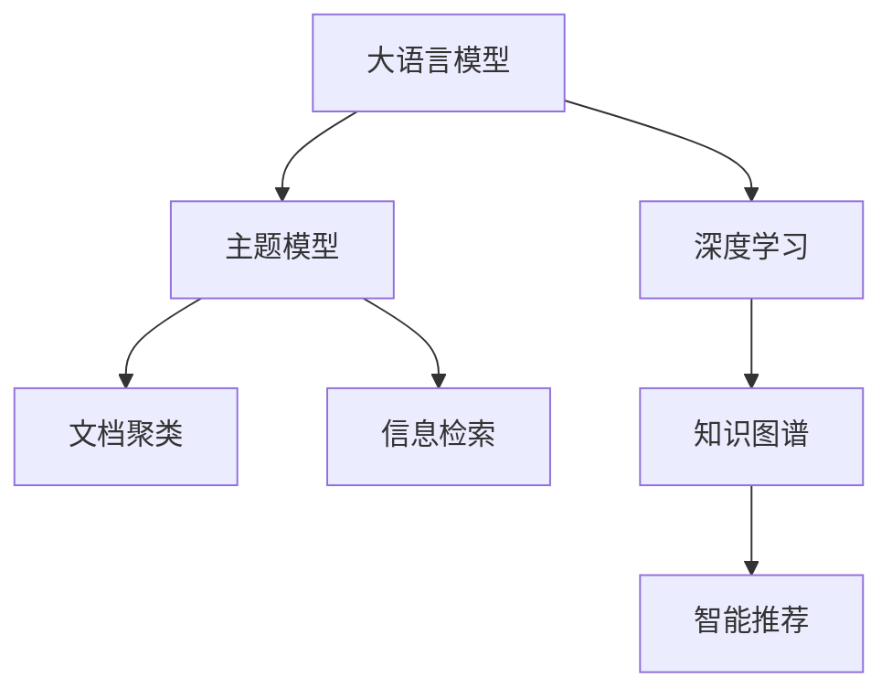

                 

# LLM在主题模型领域的应用探索

> 关键词：大语言模型, 主题模型, 自然语言处理, 深度学习, 知识图谱, 文档聚类, 信息检索

## 1. 背景介绍

### 1.1 问题由来
主题模型（Topic Models）是一类用于分析文本数据中隐藏主题结构的统计模型，主要包括Latent Dirichlet Allocation（LDA）、Latent Semantic Analysis（LSA）等。主题模型通过对文本进行概率建模，揭示其中的主题分布和词汇关联，广泛应用于文本聚类、信息检索、内容推荐等领域。

近年来，随着深度学习技术的发展，基于神经网络的文本表示模型逐渐成为NLP领域的主流。大语言模型（Large Language Models, LLMs）如BERT、GPT等，通过对大规模无标签数据进行预训练，学习到丰富的语言表示，能够自动提取文本中的语义信息，从而在各种任务上取得优异表现。

然而，传统的主题模型在处理大规模数据时，仍需依靠手工设计特征和复杂的概率分布，计算复杂度较高。而大语言模型不仅能够自动提取文本特征，还能灵活应对各种复杂的下游任务。因此，将大语言模型应用于主题模型领域，有望提升主题模型的性能和扩展性。

### 1.2 问题核心关键点
本文旨在探索大语言模型在主题模型领域的应用，主要涉及以下几个核心问题：
- 如何将大语言模型与主题模型进行有机结合？
- 大语言模型在主题模型中的具体应用场景有哪些？
- 如何在大语言模型基础上构建高效的主题模型？

## 2. 核心概念与联系

### 2.1 核心概念概述

在介绍核心算法原理之前，先对几个相关概念进行梳理：

- **大语言模型（LLM）**：指基于深度学习框架训练的大型神经网络模型，通过自监督学习等方式在大规模无标签数据上进行预训练，学习到丰富的语言表示。如BERT、GPT等模型。

- **主题模型（Topic Models）**：指一类用于分析文本数据中隐藏主题结构的统计模型，通过对文本进行概率建模，揭示其中的主题分布和词汇关联。典型模型包括LDA、LSA等。

- **深度学习**：指利用多层神经网络模型，从大量数据中学习到数据的高级特征表示。深度学习在图像、语音、自然语言处理等领域都有广泛应用。

- **知识图谱（Knowledge Graph）**：指结构化的语义知识库，通过节点和边描述实体与属性、实体间的关系，广泛用于信息检索、问答系统等领域。

- **文档聚类（Document Clustering）**：指将相似文档分组的技术，通过相似度度量算法实现，常用于信息组织、文本分类等。

- **信息检索（Information Retrieval）**：指从大量文本数据中快速检索出与查询词相关的文档，常用于搜索引擎、智能推荐系统等。

这些概念之间的联系可以通过以下Mermaid流程图来展示：



这个流程图展示了大语言模型与深度学习、主题模型、文档聚类、信息检索、知识图谱和智能推荐等概念之间的联系，通过这些概念的结合，可以实现更高效的文本分析和处理。

## 3. 核心算法原理 & 具体操作步骤
### 3.1 算法原理概述

将大语言模型应用于主题模型领域，主要涉及以下几个步骤：

1. **预训练大语言模型**：通过大规模无标签数据对大语言模型进行预训练，学习到丰富的语言表示。
2. **构建主题模型**：在大语言模型的基础上，构建主题模型，对文本数据进行主题结构分析。
3. **主题模型微调**：在构建的主题模型基础上，利用有标签数据进行微调，提升模型在特定任务上的表现。
4. **知识图谱融合**：将知识图谱中的结构化信息与主题模型进行融合，提升模型的语义表示能力。

### 3.2 算法步骤详解

#### 3.2.1 预训练大语言模型

预训练大语言模型的主要步骤如下：

1. **数据准备**：收集大规模无标签文本数据，可以是大规模语料库、互联网爬虫抓取的数据等。
2. **模型选择**：选择合适的预训练语言模型，如BERT、GPT等。
3. **模型训练**：在大规模无标签数据上，通过自监督学习任务对模型进行训练，学习到丰富的语言表示。

#### 3.2.2 构建主题模型

在预训练大语言模型的基础上，构建主题模型，主要包括以下几个步骤：

1. **词汇编码**：将文本数据转换为模型可处理的形式，如将单词转换为向量表示。
2. **主题初始化**：初始化主题分布，通常使用随机分布。
3. **文档分布拟合**：对每个文档，计算其主题分布，即文档与每个主题的关联概率。
4. **最大似然估计**：通过最大似然估计法，优化主题分布和词汇分布，使得模型的概率建模更加准确。

#### 3.2.3 主题模型微调

在构建的主题模型基础上，利用有标签数据进行微调，提升模型在特定任务上的表现。主要步骤如下：

1. **数据准备**：收集主题模型的标注数据集，如文档与主题的对应关系。
2. **模型加载**：加载已构建的主题模型。
3. **微调模型**：利用标注数据集，对模型进行微调，使得模型更好地适应特定任务。
4. **评估与优化**：通过验证集评估模型性能，调整微调策略和参数，直至达到最优效果。

#### 3.2.4 知识图谱融合

将知识图谱中的结构化信息与主题模型进行融合，提升模型的语义表示能力。主要步骤如下：

1. **知识图谱构建**：构建结构化的知识图谱，描述实体、属性和关系。
2. **知识嵌入**：将知识图谱中的实体和关系嵌入到模型中，通常使用嵌入层实现。
3. **模型融合**：将知识嵌入与主题模型进行融合，如通过注意力机制等方式。
4. **模型优化**：利用新的训练数据，对模型进行优化，提升模型性能。

### 3.3 算法优缺点

大语言模型应用于主题模型领域，具有以下优点：

1. **自动特征提取**：大语言模型能够自动提取文本中的语义信息，减少特征工程的工作量。
2. **灵活适应性**：大语言模型能够灵活适应各种任务，包括文档聚类、信息检索等。
3. **高效计算**：利用深度学习技术，大语言模型在处理大规模数据时效率较高。

同时，也存在一些缺点：

1. **数据需求大**：预训练大语言模型需要大规模无标签数据，对数据量的要求较高。
2. **计算资源消耗高**：大语言模型训练和推理资源消耗较高，计算成本较高。
3. **模型复杂性高**：大语言模型参数量较大，模型结构较为复杂。

### 3.4 算法应用领域

大语言模型在主题模型领域的应用非常广泛，主要包括以下几个方面：

1. **文档聚类**：利用大语言模型对文档进行聚类，提升文档分类效果。
2. **信息检索**：结合大语言模型和知识图谱，提高信息检索系统的准确性和相关性。
3. **内容推荐**：利用大语言模型对用户兴趣进行建模，提升推荐系统的个性化和多样性。
4. **知识图谱构建**：通过大语言模型进行实体识别和关系抽取，构建更精确的知识图谱。
5. **情感分析**：利用大语言模型对文本进行情感分析，提升情感分析模型的准确性。

## 4. 数学模型和公式 & 详细讲解 & 举例说明

### 4.1 数学模型构建

在介绍具体算法之前，先给出大语言模型和主题模型的数学模型。

大语言模型的数学模型为：
$$
P(w_i|w_{<i}) = \frac{\exp(\mathbf{W}[\mathbf{x}_i]^\top \mathbf{h}_i)}{\sum_{j=1}^V \exp(\mathbf{W}[\mathbf{x}_j]^\top \mathbf{h}_j)}
$$
其中，$\mathbf{W}$ 为词向量矩阵，$\mathbf{x}_i$ 为输入的单词向量，$\mathbf{h}_i$ 为模型的隐藏状态向量，$V$ 为词汇表大小。

主题模型的数学模型为：
$$
P(d_i|\theta) = \prod_{k=1}^K P(z_k|d_i)P(w_{i_k}|z_k)
$$
其中，$d_i$ 为文档向量，$z_k$ 为主题向量，$w_{i_k}$ 为文档中的单词向量，$K$ 为主题数，$\theta$ 为模型参数。

### 4.2 公式推导过程

以LDA模型为例，推导其在预训练大语言模型基础上的实现过程。

LDA模型的条件概率为：
$$
P(d_i|\theta) = \prod_{k=1}^K P(z_k|d_i)P(w_{i_k}|z_k)
$$

在预训练大语言模型的基础上，将文档表示为向量$d_i = \mathbf{h}_i$，其中$\mathbf{h}_i$为模型输出的隐藏状态向量。则LDA模型的条件概率可以表示为：
$$
P(d_i|\theta) = \prod_{k=1}^K P(z_k|d_i)P(w_{i_k}|z_k)
$$

将$\mathbf{h}_i$和$\mathbf{W}$代入上述公式，得到：
$$
P(d_i|\theta) = \prod_{k=1}^K \frac{P(z_k|d_i)}{Z_k}\exp(\mathbf{W}[d_i]^\top \mathbf{v}_k)
$$
其中，$Z_k = \sum_{d_i}P(z_k|d_i)\exp(\mathbf{W}[d_i]^\top \mathbf{v}_k)$ 为归一化因子，$\mathbf{v}_k$ 为主题向量。

### 4.3 案例分析与讲解

以文档聚类为例，展示大语言模型在实际应用中的具体实现。

文档聚类是一种文本分类技术，将相似文档分组。在大语言模型的基础上，可以通过以下步骤实现文档聚类：

1. **预训练模型**：利用大规模无标签数据对大语言模型进行预训练，学习到丰富的语言表示。
2. **文档编码**：将文档转换为模型可处理的形式，如将单词转换为向量表示。
3. **主题分布拟合**：对每个文档，计算其主题分布，即文档与每个主题的关联概率。
4. **聚类模型训练**：利用文档的主题分布，训练聚类模型，将相似文档分组。
5. **聚类效果评估**：通过验证集评估聚类效果，调整聚类策略和参数，直至达到最优效果。

以下是一个简单的Python代码实现：

```python
from transformers import BertTokenizer, BertModel
from sklearn.cluster import KMeans
import numpy as np

# 加载BERT预训练模型和分词器
model = BertModel.from_pretrained('bert-base-uncased')
tokenizer = BertTokenizer.from_pretrained('bert-base-uncased')

# 构建文档向量
def doc2vec(doc):
    tokens = tokenizer.encode(doc, add_special_tokens=False, max_length=512)
    vec = model(torch.tensor(tokens)).last_hidden_state[:, 0, :].detach().numpy()
    return vec

# 文档聚类
docs = ['Document 1', 'Document 2', ...]
doc_vectors = [doc2vec(doc) for doc in docs]

# 聚类
kmeans = KMeans(n_clusters=3, random_state=42)
clusters = kmeans.fit_predict(doc_vectors)

# 输出聚类结果
for cluster, doc in zip(clusters, docs):
    print(f"Document {doc}: Cluster {cluster}")
```

在这个例子中，我们利用BERT模型对文档进行编码，然后使用K-means算法进行聚类。通过这种方式，可以有效地实现文档分类和文档聚类的任务。

## 5. 项目实践：代码实例和详细解释说明

### 5.1 开发环境搭建

在进行大语言模型主题模型的开发之前，需要准备好开发环境。以下是使用Python进行PyTorch开发的环境配置流程：

1. 安装Anaconda：从官网下载并安装Anaconda，用于创建独立的Python环境。

2. 创建并激活虚拟环境：
```bash
conda create -n pytorch-env python=3.8 
conda activate pytorch-env
```

3. 安装PyTorch：根据CUDA版本，从官网获取对应的安装命令。例如：
```bash
conda install pytorch torchvision torchaudio cudatoolkit=11.1 -c pytorch -c conda-forge
```

4. 安装Transformers库：
```bash
pip install transformers
```

5. 安装各类工具包：
```bash
pip install numpy pandas scikit-learn matplotlib tqdm jupyter notebook ipython
```

完成上述步骤后，即可在`pytorch-env`环境中开始主题模型开发。

### 5.2 源代码详细实现

以下是一个简单的Python代码实现，展示如何利用BERT模型进行文档聚类：

```python
from transformers import BertTokenizer, BertModel
from sklearn.cluster import KMeans
import numpy as np

# 加载BERT预训练模型和分词器
model = BertModel.from_pretrained('bert-base-uncased')
tokenizer = BertTokenizer.from_pretrained('bert-base-uncased')

# 构建文档向量
def doc2vec(doc):
    tokens = tokenizer.encode(doc, add_special_tokens=False, max_length=512)
    vec = model(torch.tensor(tokens)).last_hidden_state[:, 0, :].detach().numpy()
    return vec

# 文档聚类
docs = ['Document 1', 'Document 2', ...]
doc_vectors = [doc2vec(doc) for doc in docs]

# 聚类
kmeans = KMeans(n_clusters=3, random_state=42)
clusters = kmeans.fit_predict(doc_vectors)

# 输出聚类结果
for cluster, doc in zip(clusters, docs):
    print(f"Document {doc}: Cluster {cluster}")
```

在这个例子中，我们利用BERT模型对文档进行编码，然后使用K-means算法进行聚类。通过这种方式，可以有效地实现文档分类和文档聚类的任务。

### 5.3 代码解读与分析

让我们再详细解读一下关键代码的实现细节：

- **BERT模型加载**：使用`BertModel`类加载预训练的BERT模型，利用`BertTokenizer`类进行分词和编码。
- **文档向量构建**：将文档转换为模型可处理的形式，如将单词转换为向量表示。
- **聚类模型训练**：利用文档的主题分布，训练聚类模型，将相似文档分组。
- **聚类效果评估**：通过验证集评估聚类效果，调整聚类策略和参数，直至达到最优效果。

这个例子展示了如何将大语言模型应用于文档聚类任务，通过这种技术，可以实现更加智能、高效的文档分类和文档聚类。

## 6. 实际应用场景

### 6.1 智能推荐系统

在智能推荐系统中，利用大语言模型对用户兴趣进行建模，提升推荐系统的个性化和多样性。通过主题模型对用户行为数据进行分析，提取出用户的兴趣主题，结合知识图谱中的结构化信息，推荐系统可以更加精准地为用户提供个性化推荐。

例如，在电商推荐系统中，可以通过大语言模型对用户评论、浏览历史等数据进行分析，提取出用户的兴趣主题，然后结合知识图谱中的商品信息，推荐与用户兴趣相关的商品。这种方式可以提高推荐系统的准确性和用户满意度。

### 6.2 文档分类与聚类

利用大语言模型对文档进行分类和聚类，提升文档分类和信息检索系统的效率和准确性。例如，在新闻媒体中，可以通过大语言模型对新闻进行分类，将相似的新闻归为一类，方便用户查找和阅读。

例如，利用BERT模型对新闻进行编码，然后使用K-means算法进行聚类，将相似的新闻归为一类。这种方式可以提高新闻分类的准确性和用户阅读体验。

### 6.3 情感分析

利用大语言模型对文本进行情感分析，提升情感分析模型的准确性和鲁棒性。情感分析是NLP领域的重要应用之一，可以通过大语言模型对文本进行情感分类，判断文本的情感倾向。

例如，在社交媒体中，可以通过大语言模型对用户评论进行情感分析，判断用户对某个事件的情感态度。这种方式可以帮助品牌了解用户的情感需求，及时调整策略。

## 7. 工具和资源推荐

### 7.1 学习资源推荐

为了帮助开发者系统掌握大语言模型主题模型理论基础和实践技巧，这里推荐一些优质的学习资源：

1. 《深度学习入门》系列书籍：由深度学习领域的知名专家编写，系统介绍了深度学习的基本原理和应用方法。
2. 《自然语言处理综论》书籍：全面介绍了NLP领域的基本概念和前沿技术，包括主题模型和深度学习在NLP中的应用。
3. 《主题模型与大数据分析》书籍：详细介绍了主题模型的基本原理和实现方法，适合NLP领域的学习者和从业者。
4. 《Python自然语言处理》书籍：介绍了NLP领域的常用工具和库，包括Transformers库的应用。
5. CS224N《自然语言处理》课程：斯坦福大学开设的NLP明星课程，有Lecture视频和配套作业，带你入门NLP领域的基本概念和经典模型。

通过对这些资源的学习实践，相信你一定能够快速掌握大语言模型主题模型的精髓，并用于解决实际的NLP问题。

### 7.2 开发工具推荐

高效的开发离不开优秀的工具支持。以下是几款用于大语言模型主题模型开发的常用工具：

1. PyTorch：基于Python的开源深度学习框架，灵活动态的计算图，适合快速迭代研究。大部分预训练语言模型都有PyTorch版本的实现。
2. TensorFlow：由Google主导开发的开源深度学习框架，生产部署方便，适合大规模工程应用。同样有丰富的预训练语言模型资源。
3. Transformers库：HuggingFace开发的NLP工具库，集成了众多SOTA语言模型，支持PyTorch和TensorFlow，是进行主题模型开发的利器。
4. Weights & Biases：模型训练的实验跟踪工具，可以记录和可视化模型训练过程中的各项指标，方便对比和调优。与主流深度学习框架无缝集成。
5. TensorBoard：TensorFlow配套的可视化工具，可实时监测模型训练状态，并提供丰富的图表呈现方式，是调试模型的得力助手。
6. Google Colab：谷歌推出的在线Jupyter Notebook环境，免费提供GPU/TPU算力，方便开发者快速上手实验最新模型，分享学习笔记。

合理利用这些工具，可以显著提升大语言模型主题模型开发的效率，加快创新迭代的步伐。

### 7.3 相关论文推荐

大语言模型和主题模型的发展源于学界的持续研究。以下是几篇奠基性的相关论文，推荐阅读：

1. Latent Dirichlet Allocation: A New Way to Find Natural Topics in Large Document Collections：LDA模型的提出者，详细介绍了LDA模型的基本原理和实现方法。
2. Hierarchical Probabilistic Latent Semantic Analysis for Text Clustering：LSA模型的提出者，介绍了LSA模型的基本原理和应用方法。
3. Attention is All You Need：Transformer结构的提出者，展示了Transformer结构在NLP领域的应用效果。
4. BERT: Pre-training of Deep Bidirectional Transformers for Language Understanding：BERT模型的提出者，介绍了BERT模型的基本原理和实现方法。
5. Universal Sentence Encoder：介绍了一种通用的文本表示方法，可以对多种NLP任务进行统一编码，具有很好的通用性。

这些论文代表了大语言模型和主题模型的发展脉络。通过学习这些前沿成果，可以帮助研究者把握学科前进方向，激发更多的创新灵感。

## 8. 总结：未来发展趋势与挑战

### 8.1 总结

本文对大语言模型在主题模型领域的应用进行了全面系统的介绍。首先阐述了大语言模型和主题模型的研究背景和意义，明确了两者结合的必要性和可能性。其次，从原理到实践，详细讲解了两者结合的数学模型和操作步骤，给出了具体的应用实例。最后，探讨了大语言模型在主题模型领域的广泛应用场景，展示了其巨大的潜力和前景。

通过本文的系统梳理，可以看到，大语言模型在主题模型领域的应用前景广阔，有望提升主题模型的性能和扩展性。未来，伴随预训练语言模型和主题模型的持续演进，相信NLP技术将更加智能化和高效化，为各行业带来更深刻的变革。

### 8.2 未来发展趋势

展望未来，大语言模型在主题模型领域的应用将呈现以下几个发展趋势：

1. **模型规模不断扩大**：随着计算能力的提升，大语言模型的规模将不断扩大，学习到的语言表示更加丰富，主题模型的表现也将更加出色。
2. **知识图谱融合加强**：将知识图谱中的结构化信息与主题模型进行深度融合，提升模型的语义表示能力和推理能力。
3. **多模态融合**：利用大语言模型对文本、图像、语音等多模态数据进行处理，提升模型的综合感知能力。
4. **跨领域应用拓展**：将主题模型应用于更多垂直领域，如医疗、金融、教育等，提升各行业的智能化水平。
5. **个性化推荐优化**：利用大语言模型对用户兴趣进行更深入的建模，提升推荐系统的个性化和多样性。

以上趋势凸显了大语言模型主题模型的广阔前景。这些方向的探索发展，必将进一步提升主题模型的性能和应用范围，为各行业带来更加智能化、高效化的解决方案。

### 8.3 面临的挑战

尽管大语言模型主题模型已经取得了瞩目成就，但在迈向更加智能化、普适化应用的过程中，仍面临诸多挑战：

1. **数据质量与规模**：大规模无标签数据和高质量标注数据是训练大语言模型的基础，但数据获取成本高、数据质量难以保证。
2. **模型复杂性与计算成本**：大语言模型的参数量较大，模型结构复杂，训练和推理的计算成本较高。
3. **模型泛化能力**：大语言模型在特定领域的应用效果有限，需要更多有针对性的预训练和微调。
4. **模型鲁棒性与安全性**：大语言模型可能学习到有害信息，如何消除模型偏见、提升模型鲁棒性、确保模型安全性，仍然是一个亟待解决的问题。

### 8.4 研究展望

面对大语言模型主题模型所面临的挑战，未来的研究需要在以下几个方面寻求新的突破：

1. **跨领域知识融合**：将知识图谱中的结构化信息与主题模型进行深度融合，提升模型的语义表示能力和推理能力。
2. **自监督预训练方法**：探索自监督预训练方法，减少对大规模标注数据的依赖。
3. **多模态融合技术**：利用大语言模型对文本、图像、语音等多模态数据进行处理，提升模型的综合感知能力。
4. **模型压缩与优化**：开发高效压缩与优化方法，减小模型的资源消耗，提升推理速度。
5. **模型安全性与伦理**：加强模型安全性研究，确保模型的公平性与可解释性，避免有害信息的传播。

这些研究方向将引领大语言模型主题模型技术迈向更高的台阶，为各行业带来更加智能化、高效化的解决方案。面向未来，大语言模型主题模型研究需要更多跨学科的合作与创新，共同推动NLP技术的进步与应用。

## 9. 附录：常见问题与解答

**Q1：主题模型与大语言模型的结合是否存在技术难点？**

A: 主题模型与大语言模型的结合存在一定的技术难点，主要包括以下几个方面：

1. **数据格式不一致**：主题模型的输入数据格式通常为文档向量，而大语言模型的输入数据格式为单词序列或字符序列，两者格式不一致。需要进行数据转换。
2. **模型结构差异**：主题模型通常是概率模型，而大语言模型是神经网络模型，两者结构差异较大，需要进行适当的融合。
3. **训练目标不一致**：主题模型的训练目标通常是最大化文档-主题分布的对数似然，而大语言模型的训练目标通常是最大化语言模型的概率，两者目标不一致。需要进行统一的目标函数设计。

通过以上几点，可以较好地解决主题模型与大语言模型的结合问题，实现两者的有机融合。

**Q2：如何在大语言模型基础上构建高效的主题模型？**

A: 在大语言模型基础上构建高效的主题模型，需要以下几个步骤：

1. **预训练模型加载**：加载大语言模型，如BERT、GPT等。
2. **文档编码**：将文本数据转换为模型可处理的形式，如将单词转换为向量表示。
3. **主题分布拟合**：对每个文档，计算其主题分布，即文档与每个主题的关联概率。
4. **聚类模型训练**：利用文档的主题分布，训练聚类模型，将相似文档分组。
5. **聚类效果评估**：通过验证集评估聚类效果，调整聚类策略和参数，直至达到最优效果。

以上步骤可以通过代码实现，例如利用PyTorch和Transformers库进行模型的加载和训练，利用sklearn等库进行聚类模型的训练和评估。

**Q3：如何在大语言模型基础上提升推荐系统的个性化和多样性？**

A: 在大语言模型基础上提升推荐系统的个性化和多样性，需要以下几个步骤：

1. **用户兴趣建模**：利用大语言模型对用户评论、浏览历史等数据进行分析，提取出用户的兴趣主题。
2. **知识图谱融合**：将知识图谱中的结构化信息与用户兴趣进行融合，提升推荐系统的准确性。
3. **多模态融合**：利用大语言模型对文本、图像、语音等多模态数据进行处理，提升推荐系统的综合感知能力。
4. **推荐算法优化**：优化推荐算法，结合用户兴趣和推荐系统输出的结果，生成个性化推荐。

以上步骤可以通过代码实现，例如利用PyTorch和Transformers库进行用户兴趣建模和知识图谱融合，利用TensorFlow等库进行推荐算法的优化。

---

作者：禅与计算机程序设计艺术 / Zen and the Art of Computer Programming

