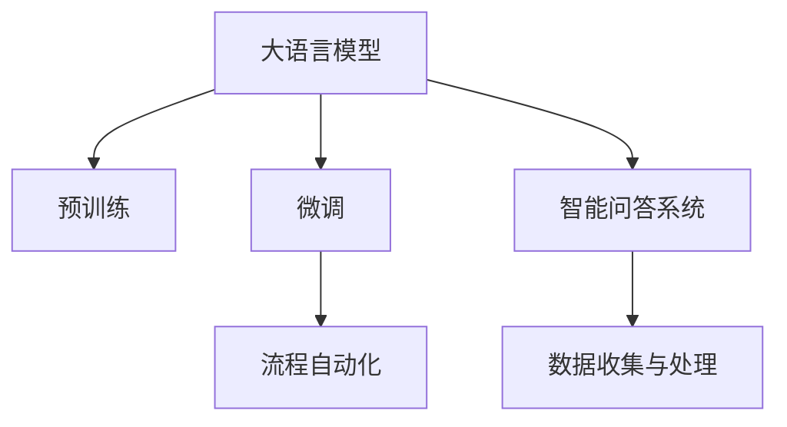

                 

# LLM在废物管理中的应用：优化回收流程

> 关键词：

## 1. 背景介绍

随着城市化进程的加速和消费水平的提升，全球范围内的废物产生量呈指数级增长。不合理、不科学的废物处理方式不仅造成资源浪费，还对环境造成严重污染。为有效应对这一挑战，智能废物管理已成为各国政府和企业关注的重点。

利用自然语言处理（Natural Language Processing, NLP）技术，特别是大语言模型（Large Language Model, LLM），可以构建智能废物管理系统，优化回收流程，提高废物处理效率。大语言模型通过预训练学习和微调，可以自动理解和处理复杂的人类语言数据，为废物管理的各个环节提供智能化支持。

本文章将详细探讨大语言模型在废物管理中的应用，具体涉及数据预处理、模型微调、智能问答、流程自动化等多个方面，以期为废物管理系统的智能化升级提供技术参考和实践指导。

## 2. 核心概念与联系

### 2.1 核心概念概述

为更好地理解大语言模型在废物管理中的应用，本节将介绍几个核心概念：

- 大语言模型（LLM）：指以自回归或自编码模型为基础，经过大规模无标签文本语料预训练，学习到丰富的语言知识和常识的模型。常见的LLM包括GPT系列、BERT等。
- 预训练（Pre-training）：指在大规模无标签文本数据上进行自监督学习，学习到通用的语言表示，如BERT的掩码语言模型任务。
- 微调（Fine-tuning）：指在预训练模型的基础上，使用特定任务的数据进行有监督学习，优化模型在该任务上的性能。
- 智能问答系统（Intelligent Question and Answering System）：指通过自然语言处理技术，自动回答用户提出的问题，广泛应用于废物管理中的咨询、指导等场景。
- 流程自动化（Process Automation）：指通过自动化技术，优化废物管理中的各项流程，减少人为干预，提高处理效率。

这些概念之间的逻辑关系可以通过以下Mermaid流程图来展示：



这个流程图展示了LLM在废物管理中的应用路径：

1. 通过预训练获得基础的语言理解能力。
2. 在废物管理特定任务上，通过微调优化模型的性能。
3. 构建智能问答系统，自动解答用户咨询。
4. 应用流程自动化技术，提高废物处理效率。

## 3. 核心算法原理 & 具体操作步骤

### 3.1 算法原理概述

利用大语言模型优化废物回收流程的原理主要基于监督学习，其核心思想是：将预训练的大语言模型作为初始化参数，通过下游废物管理任务的数据进行有监督学习，优化模型在该任务上的表现，从而实现废物回收流程的智能化。

假设预训练的废物管理模型为 $M_{\theta}$，其中 $\theta$ 为预训练得到的模型参数。给定废物管理任务 $T$ 的标注数据集 $D=\{(x_i, y_i)\}_{i=1}^N$，微调的目标是找到新的模型参数 $\hat{\theta}$，使得：

$$
\hat{\theta}=\mathop{\arg\min}_{\theta} \mathcal{L}(M_{\theta},D)
$$

其中 $\mathcal{L}$ 为针对任务 $T$ 设计的损失函数，用于衡量模型预测输出与真实标签之间的差异。常见的损失函数包括交叉熵损失、均方误差损失等。

通过梯度下降等优化算法，微调过程不断更新模型参数 $\theta$，最小化损失函数 $\mathcal{L}$，使得模型输出逼近真实标签。由于 $\theta$ 已经通过预训练获得了较好的初始化，因此即便在废物管理数据量较小的情况下，也能较快收敛到理想的模型参数 $\hat{\theta}$。

### 3.2 算法步骤详解

大语言模型在废物管理中的应用，一般包括以下几个关键步骤：

**Step 1: 数据准备**
- 收集废物管理领域的文本数据，包括废物类型、处理方法、法规政策等。
- 将文本数据进行标注，如分类标签、情感倾向、处理步骤等。
- 清洗和预处理文本数据，去除噪声和无关信息。

**Step 2: 模型加载与适配**
- 选择合适的预训练语言模型 $M_{\theta}$，如BERT、GPT等。
- 在预训练模型的顶层添加合适的输出层和损失函数，适应废物管理任务。

**Step 3: 微调参数设置**
- 选择合适的优化算法及其参数，如 AdamW、SGD 等，设置学习率、批大小、迭代轮数等。
- 设置正则化技术及强度，包括权重衰减、Dropout、Early Stopping 等。
- 确定冻结预训练参数的策略，如仅微调顶层，或全部参数都参与微调。

**Step 4: 训练与优化**
- 使用下游任务标注数据集，将文本数据分批次输入模型，前向传播计算损失函数。
- 反向传播计算参数梯度，根据设定的优化算法和学习率更新模型参数。
- 周期性在验证集上评估模型性能，根据性能指标决定是否触发 Early Stopping。
- 重复上述步骤直至满足预设的迭代轮数或 Early Stopping 条件。

**Step 5: 测试与部署**
- 在测试集上评估微调后模型 $M_{\hat{\theta}}$ 的性能，对比微调前后的精度提升。
- 使用微调后的模型对新样本进行推理预测，集成到实际的应用系统中。
- 持续收集新的数据，定期重新微调模型，以适应数据分布的变化。

以上是利用大语言模型优化废物管理回收流程的一般流程。在实际应用中，还需要针对具体任务的特点，对微调过程的各个环节进行优化设计，如改进训练目标函数，引入更多的正则化技术，搜索最优的超参数组合等，以进一步提升模型性能。

### 3.3 算法优缺点

利用大语言模型优化废物回收流程的方法具有以下优点：

1. 高效利用数据。预训练模型可以高效利用大规模无标签数据，减少标注样本需求，提高数据利用率。
2. 鲁棒性强。通过预训练学习到通用语言知识，模型在面对新数据时具有较好的泛化能力。
3. 可扩展性好。模型可以通过微调快速适应新任务，具备良好的可扩展性。
4. 应用广泛。大语言模型在废物管理中的应用场景包括智能问答、流程自动化、数据分析等，覆盖了废物管理的各个环节。

同时，该方法也存在一定的局限性：

1. 数据质量要求高。模型的性能依赖于标注数据的准确性和多样性，获取高质量标注数据的成本较高。
2. 模型复杂度高。大语言模型参数量庞大，对计算资源和内存需求较高。
3. 解释性不足。模型的决策过程复杂，难以对其推理逻辑进行解释和调试。
4. 安全性和隐私问题。在废物管理领域，数据涉及个人隐私和商业机密，需要确保数据安全和隐私保护。

尽管存在这些局限性，但就目前而言，利用大语言模型优化废物管理的方法仍是大数据和人工智能技术在废物管理领域的重要应用范式。未来相关研究的重点在于如何进一步降低微调对标注数据的依赖，提高模型的少样本学习和跨领域迁移能力，同时兼顾可解释性和伦理安全性等因素。

### 3.4 算法应用领域

大语言模型在废物管理中的应用主要涉及以下几个领域：

- 智能问答系统：利用大语言模型构建废物管理智能问答系统，自动解答用户咨询，提供废物处理建议。
- 数据分析与报告：通过大语言模型分析废物管理数据，生成数据分析报告，帮助管理者理解废物管理状况。
- 流程自动化：利用大语言模型优化废物处理流程，减少人为干预，提高处理效率。
- 法规政策解析：利用大语言模型解析废物管理法规政策，帮助管理者理解法规要求。
- 情感分析与舆情监测：通过大语言模型分析废物处理相关的公众舆情，监测公众情绪，及时反馈问题。

## 4. 数学模型和公式 & 详细讲解 & 举例说明

### 4.1 数学模型构建

假设废物管理任务 $T$ 为二分类任务，即判断废物类型是否可回收。给定训练集 $D=\{(x_i,y_i)\}_{i=1}^N, x_i \in \mathcal{X}, y_i \in \{0,1\}$，其中 $y_i=1$ 表示废物类型可回收。

定义模型 $M_{\theta}$ 在输入 $x$ 上的输出为 $\hat{y}=M_{\theta}(x) \in [0,1]$，表示模型预测废物类型可回收的概率。真实标签 $y \in \{0,1\}$。则二分类交叉熵损失函数定义为：

$$
\ell(M_{\theta}(x),y) = -[y\log \hat{y} + (1-y)\log (1-\hat{y})]
$$

将其代入经验风险公式，得：

$$
\mathcal{L}(\theta) = -\frac{1}{N}\sum_{i=1}^N [y_i\log M_{\theta}(x_i)+(1-y_i)\log(1-M_{\theta}(x_i))]
$$

在实践中，我们通常使用基于梯度的优化算法（如SGD、Adam等）来近似求解上述最优化问题。设 $\eta$ 为学习率，$\lambda$ 为正则化系数，则参数的更新公式为：

$$
\theta \leftarrow \theta - \eta \nabla_{\theta}\mathcal{L}(\theta) - \eta\lambda\theta
$$

其中 $\nabla_{\theta}\mathcal{L}(\theta)$ 为损失函数对参数 $\theta$ 的梯度，可通过反向传播算法高效计算。

### 4.2 公式推导过程

以下我们以二分类任务为例，推导交叉熵损失函数及其梯度的计算公式。

假设模型 $M_{\theta}$ 在输入 $x$ 上的输出为 $\hat{y}=M_{\theta}(x) \in [0,1]$，表示样本属于正类的概率。真实标签 $y \in \{0,1\}$。则二分类交叉熵损失函数定义为：

$$
\ell(M_{\theta}(x),y) = -[y\log \hat{y} + (1-y)\log (1-\hat{y})]
$$

将其代入经验风险公式，得：

$$
\mathcal{L}(\theta) = -\frac{1}{N}\sum_{i=1}^N [y_i\log M_{\theta}(x_i)+(1-y_i)\log(1-M_{\theta}(x_i))]
$$

根据链式法则，损失函数对参数 $\theta_k$ 的梯度为：

$$
\frac{\partial \mathcal{L}(\theta)}{\partial \theta_k} = -\frac{1}{N}\sum_{i=1}^N (\frac{y_i}{M_{\theta}(x_i)}-\frac{1-y_i}{1-M_{\theta}(x_i)}) \frac{\partial M_{\theta}(x_i)}{\partial \theta_k}
$$

其中 $\frac{\partial M_{\theta}(x_i)}{\partial \theta_k}$ 可进一步递归展开，利用自动微分技术完成计算。

在得到损失函数的梯度后，即可带入参数更新公式，完成模型的迭代优化。重复上述过程直至收敛，最终得到适应废物管理任务的最优模型参数 $\theta^*$。

### 4.3 案例分析与讲解

以废物类型分类任务为例，假设训练集为 $\{(x_1, y_1), (x_2, y_2), \ldots, (x_n, y_n)\}$，其中 $x_i$ 为废物类型描述，$y_i$ 为分类标签。假设模型为预训练的BERT模型。

首先，需要将训练集数据进行标注，如将废物类型标注为可回收或不可回收。然后，将标注数据输入模型进行训练。具体步骤如下：

1. 数据准备：收集废物类型描述和分类标签，清洗和预处理数据。
2. 模型加载：加载预训练的BERT模型，并在其顶层添加线性分类器和交叉熵损失函数。
3. 微调参数设置：设置优化器、学习率、批大小、迭代轮数等。
4. 训练过程：使用标注数据集对模型进行微调，计算损失函数和梯度，更新模型参数。
5. 模型评估：在测试集上评估微调后模型的性能，对比微调前后的精度提升。

通过以上步骤，可以得到一个适合废物类型分类的微调模型。该模型可以应用于废物分拣和回收系统的自动化识别，提高废物处理的效率和准确性。

## 5. 项目实践：代码实例和详细解释说明

### 5.1 开发环境搭建

在进行废物管理系统的微调实践前，我们需要准备好开发环境。以下是使用Python进行PyTorch开发的环境配置流程：

1. 安装Anaconda：从官网下载并安装Anaconda，用于创建独立的Python环境。

2. 创建并激活虚拟环境：
```bash
conda create -n pytorch-env python=3.8 
conda activate pytorch-env
```

3. 安装PyTorch：根据CUDA版本，从官网获取对应的安装命令。例如：
```bash
conda install pytorch torchvision torchaudio cudatoolkit=11.1 -c pytorch -c conda-forge
```

4. 安装Transformers库：
```bash
pip install transformers
```

5. 安装各类工具包：
```bash
pip install numpy pandas scikit-learn matplotlib tqdm jupyter notebook ipython
```

完成上述步骤后，即可在`pytorch-env`环境中开始微调实践。

### 5.2 源代码详细实现

下面我以废物类型分类任务为例，给出使用Transformers库对BERT模型进行微调的PyTorch代码实现。

首先，定义废物类型分类任务的数据处理函数：

```python
from transformers import BertTokenizer
from torch.utils.data import Dataset
import torch

class WasteTypeDataset(Dataset):
    def __init__(self, texts, labels, tokenizer, max_len=128):
        self.texts = texts
        self.labels = labels
        self.tokenizer = tokenizer
        self.max_len = max_len
        
    def __len__(self):
        return len(self.texts)
    
    def __getitem__(self, item):
        text = self.texts[item]
        label = self.labels[item]
        
        encoding = self.tokenizer(text, return_tensors='pt', max_length=self.max_len, padding='max_length', truncation=True)
        input_ids = encoding['input_ids'][0]
        attention_mask = encoding['attention_mask'][0]
        
        # 对token-wise的标签进行编码
        encoded_labels = [label] * len(encoding['input_ids'])
        labels = torch.tensor(encoded_labels, dtype=torch.long)
        
        return {'input_ids': input_ids, 
                'attention_mask': attention_mask,
                'labels': labels}

# 标签与id的映射
label2id = {'Recyclable': 1, 'Non-Recyclable': 0}
id2label = {v: k for k, v in label2id.items()}

# 创建dataset
tokenizer = BertTokenizer.from_pretrained('bert-base-cased')

train_dataset = WasteTypeDataset(train_texts, train_labels, tokenizer)
dev_dataset = WasteTypeDataset(dev_texts, dev_labels, tokenizer)
test_dataset = WasteTypeDataset(test_texts, test_labels, tokenizer)
```

然后，定义模型和优化器：

```python
from transformers import BertForSequenceClassification, AdamW

model = BertForSequenceClassification.from_pretrained('bert-base-cased', num_labels=len(label2id))

optimizer = AdamW(model.parameters(), lr=2e-5)
```

接着，定义训练和评估函数：

```python
from torch.utils.data import DataLoader
from tqdm import tqdm
from sklearn.metrics import classification_report

device = torch.device('cuda') if torch.cuda.is_available() else torch.device('cpu')
model.to(device)

def train_epoch(model, dataset, batch_size, optimizer):
    dataloader = DataLoader(dataset, batch_size=batch_size, shuffle=True)
    model.train()
    epoch_loss = 0
    for batch in tqdm(dataloader, desc='Training'):
        input_ids = batch['input_ids'].to(device)
        attention_mask = batch['attention_mask'].to(device)
        labels = batch['labels'].to(device)
        model.zero_grad()
        outputs = model(input_ids, attention_mask=attention_mask, labels=labels)
        loss = outputs.loss
        epoch_loss += loss.item()
        loss.backward()
        optimizer.step()
    return epoch_loss / len(dataloader)

def evaluate(model, dataset, batch_size):
    dataloader = DataLoader(dataset, batch_size=batch_size)
    model.eval()
    preds, labels = [], []
    with torch.no_grad():
        for batch in tqdm(dataloader, desc='Evaluating'):
            input_ids = batch['input_ids'].to(device)
            attention_mask = batch['attention_mask'].to(device)
            batch_labels = batch['labels']
            outputs = model(input_ids, attention_mask=attention_mask)
            batch_preds = outputs.logits.argmax(dim=2).to('cpu').tolist()
            batch_labels = batch_labels.to('cpu').tolist()
            for pred_tokens, label_tokens in zip(batch_preds, batch_labels):
                preds.append(pred_tokens[:len(label_tokens)])
                labels.append(label_tokens)
                
    print(classification_report(labels, preds))
```

最后，启动训练流程并在测试集上评估：

```python
epochs = 5
batch_size = 16

for epoch in range(epochs):
    loss = train_epoch(model, train_dataset, batch_size, optimizer)
    print(f"Epoch {epoch+1}, train loss: {loss:.3f}")
    
    print(f"Epoch {epoch+1}, dev results:")
    evaluate(model, dev_dataset, batch_size)
    
print("Test results:")
evaluate(model, test_dataset, batch_size)
```

以上就是使用PyTorch对BERT进行废物类型分类任务微调的完整代码实现。可以看到，得益于Transformers库的强大封装，我们可以用相对简洁的代码完成BERT模型的加载和微调。

### 5.3 代码解读与分析

让我们再详细解读一下关键代码的实现细节：

**WasteTypeDataset类**：
- `__init__`方法：初始化文本、标签、分词器等关键组件。
- `__len__`方法：返回数据集的样本数量。
- `__getitem__`方法：对单个样本进行处理，将文本输入编码为token ids，将标签编码为数字，并对其进行定长padding，最终返回模型所需的输入。

**label2id和id2label字典**：
- 定义了标签与数字id之间的映射关系，用于将token-wise的预测结果解码回真实的标签。

**训练和评估函数**：
- 使用PyTorch的DataLoader对数据集进行批次化加载，供模型训练和推理使用。
- 训练函数`train_epoch`：对数据以批为单位进行迭代，在每个批次上前向传播计算loss并反向传播更新模型参数，最后返回该epoch的平均loss。
- 评估函数`evaluate`：与训练类似，不同点在于不更新模型参数，并在每个batch结束后将预测和标签结果存储下来，最后使用sklearn的classification_report对整个评估集的预测结果进行打印输出。

**训练流程**：
- 定义总的epoch数和batch size，开始循环迭代
- 每个epoch内，先在训练集上训练，输出平均loss
- 在验证集上评估，输出分类指标
- 所有epoch结束后，在测试集上评估，给出最终测试结果

可以看到，PyTorch配合Transformers库使得BERT微调的代码实现变得简洁高效。开发者可以将更多精力放在数据处理、模型改进等高层逻辑上，而不必过多关注底层的实现细节。

当然，工业级的系统实现还需考虑更多因素，如模型的保存和部署、超参数的自动搜索、更灵活的任务适配层等。但核心的微调范式基本与此类似。

## 6. 实际应用场景

### 6.1 智能问答系统

利用大语言模型构建废物管理智能问答系统，可以显著提升用户咨询体验。用户通过自然语言提出废物处理相关问题，系统自动生成答案，提供废物回收指导。

在技术实现上，可以收集废物管理领域的FAQ数据，标注问题和答案，在此基础上对预训练模型进行微调。微调后的模型能够自动理解用户意图，匹配最合适的答案模板进行回复。对于用户提出的新问题，还可以接入检索系统实时搜索相关内容，动态组织生成回答。如此构建的智能问答系统，能大幅提升用户咨询体验和问题解决效率。

### 6.2 数据分析与报告

大语言模型可以用于废物管理数据的分析和报告生成。通过分析废物处理的历史数据和当前状态，生成详尽的废物管理报告，帮助管理者了解废物处理状况，优化废物管理策略。

在实践中，可以收集废物处理的历史数据，如废物类型、处理时间、处理地点等。将数据输入模型，使用微调后的模型进行数据分析，生成各类图表和报告。例如，生成废物类型分布图、处理时间统计表等，直观展示废物管理状况，为管理者提供决策依据。

### 6.3 流程自动化

利用大语言模型优化废物处理流程，可以大幅提高废物处理效率，减少人为干预。通过自然语言处理技术，自动解析废物处理的操作指南和流程规则，生成自动化处理流程。

在技术实现上，可以收集废物处理的各类操作指南和规则，将文本数据进行标注，在此基础上对预训练模型进行微调。微调后的模型能够自动解析废物处理流程，生成自动化处理步骤。例如，根据废物类型自动识别处理流程，自动生成处理指南和操作流程，提高废物处理的自动化水平。

### 6.4 法规政策解析

大语言模型可以用于废物管理法规政策的解析和解读。通过解析废物管理法规政策，帮助管理者理解法规要求，提高法规遵从度。

在实践中，可以收集废物管理的法规政策文本，将文本数据进行标注，在此基础上对预训练模型进行微调。微调后的模型能够自动解析法规政策文本，生成法规政策解读和摘要。例如，解析废物处理的相关法规政策，生成法规政策解读、关键条款摘要等，帮助管理者快速理解法规要求。

## 7. 工具和资源推荐

### 7.1 学习资源推荐

为了帮助开发者系统掌握大语言模型在废物管理中的应用，这里推荐一些优质的学习资源：

1. 《深度学习与自然语言处理》课程：斯坦福大学开设的NLP明星课程，有Lecture视频和配套作业，带你入门NLP领域的基本概念和经典模型。

2. CS224N《深度学习自然语言处理》书籍：斯坦福大学课程的配套教材，深入浅出地介绍了自然语言处理的基本原理和前沿技术。

3. 《Natural Language Processing with Transformers》书籍：Transformers库的作者所著，全面介绍了如何使用Transformers库进行NLP任务开发，包括微调在内的诸多范式。

4. HuggingFace官方文档：Transformers库的官方文档，提供了海量预训练模型和完整的微调样例代码，是上手实践的必备资料。

5. 《Transformers: From Beginner to Expert》视频课程：提供从基础到高级的Transformer模型开发教程，覆盖微调、优化、部署等多个方面。

通过对这些资源的学习实践，相信你一定能够快速掌握大语言模型在废物管理中的应用，并用于解决实际的NLP问题。

### 7.2 开发工具推荐

高效的开发离不开优秀的工具支持。以下是几款用于大语言模型微调开发的常用工具：

1. PyTorch：基于Python的开源深度学习框架，灵活动态的计算图，适合快速迭代研究。大部分预训练语言模型都有PyTorch版本的实现。

2. TensorFlow：由Google主导开发的开源深度学习框架，生产部署方便，适合大规模工程应用。同样有丰富的预训练语言模型资源。

3. Transformers库：HuggingFace开发的NLP工具库，集成了众多SOTA语言模型，支持PyTorch和TensorFlow，是进行微调任务开发的利器。

4. Weights & Biases：模型训练的实验跟踪工具，可以记录和可视化模型训练过程中的各项指标，方便对比和调优。与主流深度学习框架无缝集成。

5. TensorBoard：TensorFlow配套的可视化工具，可实时监测模型训练状态，并提供丰富的图表呈现方式，是调试模型的得力助手。

6. Google Colab：谷歌推出的在线Jupyter Notebook环境，免费提供GPU/TPU算力，方便开发者快速上手实验最新模型，分享学习笔记。

合理利用这些工具，可以显著提升大语言模型微调任务的开发效率，加快创新迭代的步伐。

### 7.3 相关论文推荐

大语言模型和微调技术的发展源于学界的持续研究。以下是几篇奠基性的相关论文，推荐阅读：

1. Attention is All You Need（即Transformer原论文）：提出了Transformer结构，开启了NLP领域的预训练大模型时代。

2. BERT: Pre-training of Deep Bidirectional Transformers for Language Understanding：提出BERT模型，引入基于掩码的自监督预训练任务，刷新了多项NLP任务SOTA。

3. Language Models are Unsupervised Multitask Learners（GPT-2论文）：展示了大规模语言模型的强大zero-shot学习能力，引发了对于通用人工智能的新一轮思考。

4. Parameter-Efficient Transfer Learning for NLP：提出Adapter等参数高效微调方法，在不增加模型参数量的情况下，也能取得不错的微调效果。

5. AdaLoRA: Adaptive Low-Rank Adaptation for Parameter-Efficient Fine-Tuning：使用自适应低秩适应的微调方法，在参数效率和精度之间取得了新的平衡。

这些论文代表了大语言模型微调技术的发展脉络。通过学习这些前沿成果，可以帮助研究者把握学科前进方向，激发更多的创新灵感。

## 8. 总结：未来发展趋势与挑战

### 8.1 总结

本文对大语言模型在废物管理中的应用进行了全面系统的介绍。首先阐述了废物管理领域的背景和需求，明确了大语言模型在废物管理中的应用场景和价值。其次，从原理到实践，详细讲解了大语言模型在废物管理中的应用，具体涉及数据预处理、模型微调、智能问答、流程自动化等多个方面，以期为废物管理系统的智能化升级提供技术参考和实践指导。

通过本文的系统梳理，可以看到，大语言模型在废物管理中的应用具有广阔的前景，能够显著提升废物处理效率，优化废物管理流程，提供智能化的咨询服务。未来，伴随预训练语言模型和微调方法的持续演进，相信废物管理领域将迎来更加智能化、自动化的新篇章。

### 8.2 未来发展趋势

展望未来，大语言模型在废物管理中的应用将呈现以下几个发展趋势：

1. 智能化程度提升。大语言模型的理解能力和生成能力将进一步提升，能够更准确地解析和生成废物处理相关的信息，实现更加智能化的废物管理。

2. 自动化程度提高。随着自动化技术的发展，大语言模型将更多地应用于废物处理流程的自动化，减少人工干预，提高处理效率。

3. 跨领域融合。大语言模型将与物联网、大数据、人工智能等技术深度融合，构建综合性废物管理系统，实现废物处理的智能化、精准化、实时化。

4. 数据驱动决策。通过大语言模型对废物管理数据的分析和挖掘，能够为废物管理决策提供科学的依据，帮助管理者更好地优化废物处理策略。

5. 社会治理支撑。大语言模型将应用于废物管理的社会治理，通过智能问答、舆情监测等手段，为政府和社会提供废物管理相关的信息支持和决策参考。

以上趋势凸显了大语言模型在废物管理中的应用潜力。这些方向的探索发展，必将进一步推动废物管理系统的智能化、自动化，为构建高效、智能、环保的废物管理系统奠定基础。

### 8.3 面临的挑战

尽管大语言模型在废物管理中的应用前景广阔，但在迈向更加智能化、自动化的应用过程中，它仍面临着诸多挑战：

1. 数据质量和获取成本。高质量、全面、及时的废物管理数据是模型训练和微调的基础，但获取这些数据往往需要高昂的成本。如何降低数据获取成本，提高数据质量，将是重要的研究课题。

2. 模型复杂度和资源消耗。大语言模型参数量庞大，对计算资源和内存需求较高。如何在保证模型性能的同时，降低计算资源消耗，提高模型部署效率，还需要进一步优化。

3. 模型解释性和可控性。废物管理涉及复杂多变的环境因素和个体差异，模型的决策过程需要具备较高的可解释性和可控性，以便于模型调试和优化。

4. 法规政策合规性。废物管理涉及各类法规政策，模型的应用需要严格遵守相关法规，确保输出合规。如何设计和训练合规性高的大语言模型，将是重要的研究方向。

5. 社会伦理问题。废物管理涉及公众利益和环境安全，模型的应用需要考虑到社会伦理和道德问题，避免输出不当信息，确保系统安全和可靠。

这些挑战需要通过跨学科合作和技术创新，不断攻克和解决，才能使大语言模型在废物管理中发挥更大的作用。

### 8.4 研究展望

面对大语言模型在废物管理中面临的挑战，未来的研究需要在以下几个方面寻求新的突破：

1. 数据获取与预处理技术。开发高效、低成本的数据获取和预处理技术，确保数据的全面性和多样性，提高模型的泛化能力和鲁棒性。

2. 参数高效与计算高效的微调方法。开发更加参数高效的微调方法，如 Adapter、Prefix等，在固定大部分预训练参数的同时，只更新极少量的任务相关参数，以提高微调效率和资源利用率。

3. 跨模态学习与融合。将视觉、音频等多模态数据与文本数据结合，构建跨模态废物管理系统，提升模型的信息整合能力和泛化能力。

4. 法规政策智能解析。利用大语言模型对废物管理法规政策进行智能解析，生成法规政策解读和摘要，帮助管理者快速理解法规要求，优化废物管理策略。

5. 模型鲁棒性与可解释性。通过引入因果推断和对比学习思想，增强模型的鲁棒性和可解释性，确保模型的决策过程透明、可解释，便于调试和优化。

6. 社会伦理与安全防护。引入社会伦理和安全防护机制，确保模型的输出合规、安全，避免有害信息的输出，保护废物管理的公正性和公平性。

这些研究方向将推动大语言模型在废物管理中的应用走向成熟，为构建高效、智能、环保的废物管理系统提供技术保障。相信随着研究的不断深入，大语言模型将为废物管理领域带来革命性的变化，助力实现可持续发展目标。

## 9. 附录：常见问题与解答

**Q1：大语言模型在废物管理中的应用是否适用于所有废物类型？**

A: 大语言模型在废物管理中的应用具有广泛的适用性，但不同类型的废物处理可能需要不同的规则和标准。需要针对不同类型的废物，构建特定的微调模型，才能取得最佳效果。

**Q2：在微调过程中，如何处理模型参数过大的问题？**

A: 为处理模型参数过大的问题，可以采用以下方法：
1. 参数裁剪：去除不必要的层和参数，减小模型尺寸。
2. 模型压缩：使用模型压缩技术，如剪枝、量化等，减小模型大小和计算资源消耗。
3. 分布式训练：利用分布式训练技术，将模型并行化部署，提高训练效率。

**Q3：在废物管理中，如何确保模型输出的合规性？**

A: 为确保模型输出的合规性，可以采用以下方法：
1. 法规政策智能解析：利用大语言模型对废物管理法规政策进行智能解析，生成法规政策解读和摘要，帮助管理者快速理解法规要求。
2. 法规政策合规性评估：在模型输出中加入法规政策合规性评估模块，自动检查输出是否符合相关法规。
3. 人工审核与干预：引入人工审核机制，对模型的输出进行复核，确保输出的合规性和安全性。

**Q4：在废物管理中，如何提高模型的泛化能力？**

A: 为提高模型的泛化能力，可以采用以下方法：
1. 数据增强：通过数据增强技术，扩充训练数据的多样性，增强模型的泛化能力。
2. 迁移学习：利用其他领域或任务的数据进行迁移学习，提高模型的泛化能力。
3. 正则化技术：引入正则化技术，如L2正则、Dropout等，防止模型过拟合。
4. 多模型集成：构建多个微调模型，取平均输出，抑制过拟合。

**Q5：在废物管理中，如何提高模型的解释性？**

A: 为提高模型的解释性，可以采用以下方法：
1. 可解释模型：选择可解释性强的模型，如LIME、SHAP等，对模型进行解释和调试。
2. 特征重要性分析：利用特征重要性分析技术，识别模型决策的关键特征。
3. 逻辑解释：构建逻辑解释框架，对模型输出进行解释，确保模型的决策过程透明、可解释。

这些方法能够帮助开发者更好地理解模型决策过程，提高模型的可解释性和可控性。

---

作者：禅与计算机程序设计艺术 / Zen and the Art of Computer Programming

