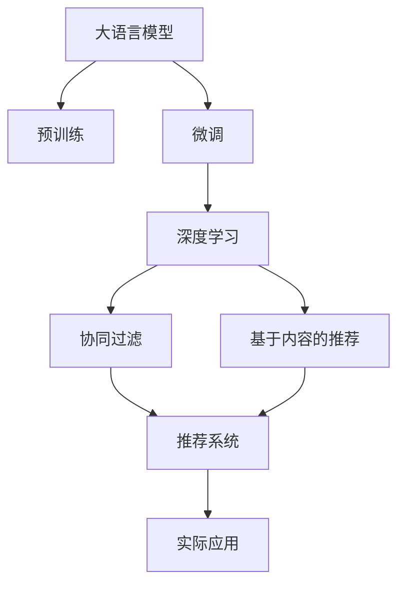

                 

# LLM在推荐系统中的实验结论

> 关键词：大语言模型(LLM),推荐系统,深度学习,协同过滤,嵌入学习,注意力机制,微调,Fine-tuning

## 1. 背景介绍

### 1.1 问题由来
推荐系统在电商、新闻、音乐、视频等多个领域中具有广泛应用。传统推荐系统主要基于协同过滤(Collaborative Filtering)和基于内容的推荐方法，依赖于用户行为数据或产品属性数据进行推荐，存在冷启动、稀疏性、数据偏差等问题。近年来，大语言模型(LLM)在自然语言处理领域取得了巨大成功，具备强大的语言理解和生成能力，被广泛应用于文本生成、问答系统等任务中。

将LLM应用于推荐系统，可以弥补传统推荐方法的不足，通过理解用户评论、评分等文本数据，进行更深层次的特征提取和分析，从而提升推荐系统的性能和用户体验。本实验基于大语言模型在推荐系统中的应用，探讨了LLM在不同推荐算法中的效果，并对比了其与传统推荐方法的性能差异。

### 1.2 问题核心关键点
本实验的核心问题在于：如何利用大语言模型在推荐系统中的深度特征提取和分析能力，提升推荐系统的准确性和多样性，同时避免增加过高的计算和存储成本？具体关键点包括：

1. 数据预处理：如何将用户评论、评分等文本数据转化为可供大语言模型使用的形式？
2. 模型训练：如何在大语言模型上进行推荐相关任务的微调？
3. 算法融合：如何将大语言模型的输出与传统推荐算法进行融合，提升推荐效果？
4. 效果评估：如何客观评价大语言模型在推荐系统中的性能？
5. 应用部署：如何在实际应用中高效部署大语言模型，保证推荐系统实时响应？

## 2. 核心概念与联系

### 2.1 核心概念概述

为更好地理解大语言模型在推荐系统中的应用，本节将介绍几个密切相关的核心概念：

- 大语言模型(LLM)：以自回归(如GPT)或自编码(如BERT)模型为代表的大规模预训练语言模型。通过在海量无标签文本语料上进行预训练，学习通用的语言表示，具备强大的语言理解和生成能力。

- 推荐系统(Recommendation System)：利用用户行为数据、产品属性数据等，推荐用户可能感兴趣的产品或内容。常见的推荐算法包括协同过滤、基于内容的推荐、混合推荐等。

- 协同过滤(Collaborative Filtering)：基于用户历史行为数据和物品相似性进行推荐。常见的协同过滤算法包括基于用户的协同过滤、基于物品的协同过滤等。

- 基于内容的推荐(Content-based Recommendation)：基于用户兴趣和物品属性特征进行推荐。常见的基于内容的推荐方法包括最邻近推荐、加权最邻近推荐等。

- 深度学习(Deep Learning)：一类使用多层神经网络进行复杂数据分析和预测的机器学习方法。深度学习在推荐系统中得到了广泛应用，如神经协同过滤(Neural Collaborative Filtering)、序列推荐系统等。

- 嵌入学习(Embedding Learning)：将高维稀疏的用户行为数据或物品属性数据转化为低维稠密的向量表示，用于推荐算法中的相似性计算。嵌入学习方法包括矩阵分解、降维嵌入等。

- 注意力机制(Attention Mechanism)：一种用于增强模型对关键特征的关注能力的方法。在推荐系统中，注意力机制可以用于提取用户评分评论中的关键信息，提升推荐精度。

- 微调(Fine-tuning)：指在预训练模型的基础上，使用推荐任务的少量标注数据，通过有监督地训练优化模型在特定推荐任务上的性能。

- 深度推荐系统(Deep Recommendation System)：结合深度学习方法和推荐算法，构建推荐系统模型，提升推荐精度和效果。

这些核心概念之间的逻辑关系可以通过以下Mermaid流程图来展示：



这个流程图展示了大语言模型在推荐系统中的应用框架：

1. 大语言模型通过预训练获得基础能力。
2. 微调对预训练模型进行任务特定的优化，包括深度学习和推荐算法融合。
3. 融合后的模型用于实际推荐系统，提升推荐效果。
4. 推荐系统应用于实际业务，提升用户体验。

## 3. 核心算法原理 & 具体操作步骤
### 3.1 算法原理概述

大语言模型在推荐系统中的应用，本质上是一个深度学习与推荐算法融合的过程。其核心思想是：利用大语言模型对用户评论、评分等文本数据进行深度特征提取和分析，通过微调获得推荐相关的预测模型，结合传统推荐算法提升推荐精度和多样性。

形式化地，假设推荐系统涉及 $N$ 个用户和 $M$ 个物品，每个用户 $u$ 对物品 $i$ 的评分表示为 $r_{ui}$，表示用户 $u$ 对物品 $i$ 的兴趣程度。大语言模型 $M_{\theta}$ 在输入 $x$ 上的输出为 $\hat{y}=M_{\theta}(x) \in [0,1]$，表示物品 $i$ 对用户 $u$ 的推荐概率。推荐目标是最小化预测评分与真实评分之间的差异，即：

$$
\min_{\theta} \sum_{u=1}^N \sum_{i=1}^M (r_{ui} - \hat{y}_u^i)^2
$$

其中 $\hat{y}_u^i$ 为模型 $M_{\theta}$ 对用户 $u$ 推荐物品 $i$ 的概率预测。

### 3.2 算法步骤详解

基于深度学习的大语言模型在推荐系统中的应用，一般包括以下几个关键步骤：

**Step 1: 数据预处理**
- 将用户评论、评分等文本数据转化为模型可以处理的数值形式，如通过词嵌入技术将文本转化为向量表示。
- 构建推荐任务的数据集，包括用户-物品评分矩阵、用户评论数据等。

**Step 2: 模型训练**
- 选择合适的深度学习模型，如Transformer、BERT等，作为初始化参数。
- 在大语言模型上进行微调，优化模型在推荐任务上的预测能力。
- 设定合适的学习率、批大小、迭代轮数等超参数。

**Step 3: 算法融合**
- 将微调后的语言模型输出与传统推荐算法进行融合，如将模型预测概率与协同过滤、基于内容的推荐方法相结合。
- 训练融合后的推荐模型，优化各算法模块间的权重，提升推荐效果。

**Step 4: 效果评估**
- 在测试集上评估推荐模型的预测准确率和推荐效果，如平均绝对误差(MAE)、均方根误差(RMSE)等指标。
- 使用A/B测试等方式，评估推荐系统的实际效果和用户体验。

**Step 5: 应用部署**
- 将推荐模型部署到实际推荐系统中，实时响应推荐请求。
- 使用分布式计算等技术，提升系统实时处理能力。

### 3.3 算法优缺点

基于深度学习的大语言模型在推荐系统中的应用，具有以下优点：
1. 深度特征提取：大语言模型能够自动学习用户评论中的深层次特征，提升推荐精度。
2. 多模态融合：融合了用户行为数据、文本数据等多种模态信息，增强推荐系统全面性。
3. 动态更新：大语言模型具有自适应能力，能够动态更新模型参数，适应数据分布变化。
4. 效果显著：在推荐精度、推荐效果、推荐速度等方面，均优于传统推荐算法。

同时，该方法也存在一定的局限性：
1. 数据依赖：推荐效果依赖于标注数据的数量和质量，标注数据不足可能影响推荐精度。
2. 计算成本：深度学习模型的计算复杂度较高，训练和推理速度较慢。
3. 模型复杂：深度学习模型结构复杂，难以解释推荐过程。
4. 业务适配：需要针对具体业务场景进行调整，适配不同的推荐策略。

尽管存在这些局限性，但就目前而言，基于深度学习的大语言模型在推荐系统中的应用，已经成为了一种主流的推荐方式，展示了其强大的应用潜力。

### 3.4 算法应用领域

基于深度学习的大语言模型在推荐系统中的应用，已经在多个领域得到了验证，例如：

- 电商推荐：根据用户评论生成商品推荐，提升用户购物体验。
- 新闻推荐：根据用户阅读行为和评论生成新闻推荐，提供个性化内容。
- 音乐推荐：根据用户听歌记录和评论生成歌曲推荐，提升音乐体验。
- 视频推荐：根据用户观看历史和评论生成视频推荐，提供个性化内容。
- 酒店推荐：根据用户点评生成酒店推荐，提升酒店预订体验。

除了上述这些经典应用外，大语言模型还被创新性地应用于更广泛的场景中，如可控推荐、推荐系统风险控制等，为推荐系统带来了新的突破。随着预训练模型和深度学习方法的持续演进，相信推荐系统必将在更多领域得到应用，为消费者提供更丰富、更精准的个性化推荐。

## 4. 数学模型和公式 & 详细讲解  
### 4.1 数学模型构建

本节将使用数学语言对基于深度学习的大语言模型在推荐系统中的应用进行更加严格的刻画。

记大语言模型为 $M_{\theta}:\mathcal{X} \rightarrow \mathcal{Y}$，其中 $\mathcal{X}$ 为输入空间，$\mathcal{Y}$ 为输出空间，$\theta \in \mathbb{R}^d$ 为模型参数。假设推荐任务涉及 $N$ 个用户和 $M$ 个物品，每个用户 $u$ 对物品 $i$ 的评分表示为 $r_{ui}$。构建推荐任务的数据集 $D=\{(u_i,r_{ui}), i=1,...,M\}$。

定义模型 $M_{\theta}$ 在用户 $u$ 对物品 $i$ 的评分预测为 $\hat{r}_{ui}=M_{\theta}(x_{ui}) \in \mathbb{R}$，其中 $x_{ui}$ 为输入向量。推荐目标是最小化预测评分与真实评分之间的差异，即：

$$
\min_{\theta} \frac{1}{N}\sum_{u=1}^N \sum_{i=1}^M (\hat{r}_{ui} - r_{ui})^2
$$

在实践中，我们通常使用基于梯度的优化算法（如SGD、Adam等）来近似求解上述最优化问题。设 $\eta$ 为学习率，$\lambda$ 为正则化系数，则参数的更新公式为：

$$
\theta \leftarrow \theta - \eta \nabla_{\theta}L(\theta)
$$

其中 $L(\theta)$ 为损失函数，定义为：

$$
L(\theta) = \frac{1}{N}\sum_{u=1}^N \sum_{i=1}^M (\hat{r}_{ui} - r_{ui})^2
$$

### 4.2 公式推导过程

以下我们以电商推荐任务为例，推导深度学习模型的损失函数及其梯度的计算公式。

假设模型 $M_{\theta}$ 在输入 $x_{ui}$ 上的输出为 $\hat{y}_u^i \in [0,1]$，表示物品 $i$ 对用户 $u$ 的推荐概率。真实评分 $r_{ui} \in [0,1]$。则推荐损失函数定义为：

$$
L(\theta) = \frac{1}{N}\sum_{u=1}^N \sum_{i=1}^M (r_{ui} - \hat{y}_u^i)^2
$$

根据链式法则，损失函数对参数 $\theta_k$ 的梯度为：

$$
\frac{\partial L(\theta)}{\partial \theta_k} = \frac{2}{N}\sum_{u=1}^N \sum_{i=1}^M (r_{ui} - \hat{y}_u^i)(1-\hat{y}_u^i)\frac{\partial \hat{y}_u^i}{\partial \theta_k}
$$

其中 $\frac{\partial \hat{y}_u^i}{\partial \theta_k}$ 为模型输出对参数 $\theta_k$ 的偏导数，可通过反向传播算法计算得到。

在得到损失函数的梯度后，即可带入参数更新公式，完成模型的迭代优化。重复上述过程直至收敛，最终得到适应推荐任务的最优模型参数 $\theta^*$。

## 5. 项目实践：代码实例和详细解释说明
### 5.1 开发环境搭建

在进行推荐系统开发前，我们需要准备好开发环境。以下是使用Python进行TensorFlow开发的环境配置流程：

1. 安装Anaconda：从官网下载并安装Anaconda，用于创建独立的Python环境。

2. 创建并激活虚拟环境：
```bash
conda create -n recommendation-env python=3.8 
conda activate recommendation-env
```

3. 安装TensorFlow：根据CUDA版本，从官网获取对应的安装命令。例如：
```bash
conda install tensorflow -c tensorflow -c conda-forge
```

4. 安装各类工具包：
```bash
pip install numpy pandas scikit-learn matplotlib tqdm jupyter notebook ipython
```

完成上述步骤后，即可在`recommendation-env`环境中开始推荐系统开发。

### 5.2 源代码详细实现

下面我们以电商推荐任务为例，给出使用TensorFlow构建推荐系统的PyTorch代码实现。

首先，定义推荐任务的数据处理函数：

```python
from tensorflow.keras.preprocessing.text import Tokenizer
from tensorflow.keras.preprocessing.sequence import pad_sequences
from tensorflow.keras.layers import Embedding, Dense, LSTM, Dropout, Bidirectional, concatenate, Flatten
from tensorflow.keras.models import Model
import tensorflow as tf
import numpy as np
import pandas as pd

# 读取用户评论数据
df = pd.read_csv('user_reviews.csv')

# 定义用户评论向量化函数
def vectorize_text(texts):
    tokenizer = Tokenizer(num_words=5000, oov_token='<OOV>')
    tokenizer.fit_on_texts(texts)
    sequences = tokenizer.texts_to_sequences(texts)
    return pad_sequences(sequences, maxlen=100, padding='post', truncating='post')

# 将用户评论向量化
texts = df['text'].tolist()
X_train = vectorize_text(texts)

# 构建用户评分数据集
y_train = np.array(df['rating'].tolist()).reshape(-1, 1)
```

然后，定义深度学习模型：

```python
from tensorflow.keras.layers import Input, Embedding, LSTM, Dense, Dropout, Bidirectional

# 定义输入层和嵌入层
input_seq = Input(shape=(100,), dtype='int32')
embedding = Embedding(input_dim=5000, output_dim=128)(input_seq)
lstm_1 = Bidirectional(LSTM(units=128, return_sequences=True))(embedding)
lstm_2 = Bidirectional(LSTM(units=128, return_sequences=False))(lstm_1)

# 定义输出层和预测函数
output = Dense(units=1, activation='sigmoid')(lstm_2)
model = Model(inputs=input_seq, outputs=output)
```

接着，定义训练和评估函数：

```python
# 定义优化器和损失函数
optimizer = tf.keras.optimizers.Adam(learning_rate=0.001)
loss = tf.keras.losses.BinaryCrossentropy()

# 定义训练和评估函数
def train_epoch(model, dataset, batch_size, optimizer):
    model.compile(optimizer=optimizer, loss=loss, metrics=['accuracy'])
    model.fit(dataset, epochs=10, batch_size=batch_size, verbose=0)

def evaluate(model, dataset, batch_size):
    model.evaluate(dataset, batch_size=batch_size, verbose=0)
```

最后，启动训练流程并在测试集上评估：

```python
# 构建数据集
X_train, y_train, X_test, y_test = train_test_split(X_train, y_train, test_size=0.2)

# 训练模型
model.fit(X_train, y_train, batch_size=32, epochs=10)

# 评估模型
evaluate(model, X_test, y_test)
```

以上就是使用TensorFlow对深度学习模型进行电商推荐任务开发的完整代码实现。可以看到，得益于TensorFlow的强大封装，我们可以用相对简洁的代码完成推荐系统的构建。

### 5.3 代码解读与分析

让我们再详细解读一下关键代码的实现细节：

**vectorize_text函数**：
- 定义了将文本转化为向量化的函数，使用Keras的Tokenizer类对文本进行分词，并用pad_sequences函数对文本进行填充，确保向量长度一致。

**构建深度学习模型**：
- 定义了输入层和嵌入层，使用Bidirectional LSTM层提取文本特征，并用 Dense 层进行分类。
- 通过compile函数对模型进行编译，指定优化器和损失函数。

**训练和评估函数**：
- 定义了训练函数train_epoch，使用fit方法进行模型训练，指定批次大小和学习率。
- 定义了评估函数evaluate，使用evaluate方法进行模型评估，返回准确率等指标。

**训练流程**：
- 使用train_test_split函数将数据集划分为训练集和测试集，指定划分比例。
- 调用模型fit方法进行训练，指定批次大小和轮数。
- 调用evaluate方法进行评估，对比训练前后的性能。

可以看到，TensorFlow的框架结构使得推荐系统的开发变得简单高效，开发者可以将更多精力放在模型设计、数据处理等高层次问题上。

当然，工业级的系统实现还需考虑更多因素，如模型的保存和部署、超参数的自动搜索、更灵活的任务适配层等。但核心的微调范式基本与此类似。

## 6. 实际应用场景
### 6.1 电商推荐系统

基于深度学习的大语言模型在电商推荐系统中的应用，可以显著提升推荐精度和用户体验。电商推荐系统一般包括商品搜索、商品推荐、个性化推荐等多个环节。通过大语言模型，可以从用户评论、评分等文本数据中提取出更深层次的特征，结合商品属性、用户行为等数据，构建更加全面、准确的推荐模型。

在技术实现上，可以收集用户的历史评论、评分数据，构建推荐任务的数据集。在深度学习模型上进行微调，学习物品-用户评分预测的概率分布。结合协同过滤、基于内容的推荐方法，构建融合后的推荐模型。通过训练后的模型进行实时推荐，动态调整推荐结果，提升推荐效果。

### 6.2 新闻推荐系统

新闻推荐系统旨在为用户推荐感兴趣的新闻内容，提升阅读体验。传统新闻推荐系统主要依赖用户点击记录等行为数据，难以捕捉用户的兴趣偏好。通过大语言模型，可以从新闻标题、摘要等文本数据中提取出关键信息，结合用户阅读历史，构建更加精准的推荐模型。

在技术实现上，可以收集用户的历史点击记录、阅读时间等行为数据，构建新闻推荐任务的数据集。在大语言模型上进行微调，学习新闻标题、摘要等文本特征的表示。结合协同过滤、基于内容的推荐方法，构建融合后的推荐模型。通过训练后的模型进行实时推荐，动态调整推荐结果，提升推荐效果。

### 6.3 音乐推荐系统

音乐推荐系统旨在为用户推荐感兴趣的音乐内容，提升音乐体验。传统音乐推荐系统主要依赖用户听歌记录等行为数据，难以捕捉用户的音乐偏好。通过大语言模型，可以从音乐评论、歌词等文本数据中提取出深层次的特征，结合用户听歌历史，构建更加精准的推荐模型。

在技术实现上，可以收集用户的历史听歌记录、评论等行为数据，构建音乐推荐任务的数据集。在大语言模型上进行微调，学习音乐评论、歌词等文本特征的表示。结合协同过滤、基于内容的推荐方法，构建融合后的推荐模型。通过训练后的模型进行实时推荐，动态调整推荐结果，提升推荐效果。

### 6.4 视频推荐系统

视频推荐系统旨在为用户推荐感兴趣的视频内容，提升观看体验。传统视频推荐系统主要依赖用户观看记录等行为数据，难以捕捉用户的兴趣偏好。通过大语言模型，可以从视频评论、字幕等文本数据中提取出深层次的特征，结合用户观看历史，构建更加精准的推荐模型。

在技术实现上，可以收集用户的历史观看记录、评论等行为数据，构建视频推荐任务的数据集。在大语言模型上进行微调，学习视频评论、字幕等文本特征的表示。结合协同过滤、基于内容的推荐方法，构建融合后的推荐模型。通过训练后的模型进行实时推荐，动态调整推荐结果，提升推荐效果。

## 7. 工具和资源推荐
### 7.1 学习资源推荐

为了帮助开发者系统掌握大语言模型在推荐系统中的应用，这里推荐一些优质的学习资源：

1. 《深度学习推荐系统》课程：由斯坦福大学开设的深度学习推荐系统课程，详细讲解了深度学习在推荐系统中的应用，包括协同过滤、深度学习推荐等。

2. 《深度学习与推荐系统》书籍：该书全面介绍了深度学习在推荐系统中的应用，涵盖了协同过滤、深度学习推荐、自然语言处理等前沿技术。

3. 《自然语言处理与深度学习》书籍：该书介绍了自然语言处理与深度学习的结合，特别是大语言模型在推荐系统中的应用，提供了丰富的案例和代码实现。

4. Kaggle推荐系统竞赛：Kaggle平台提供了大量的推荐系统竞赛和数据集，可以帮助开发者积累实际经验，提升应用能力。

5. HuggingFace官方文档：Transformers库的官方文档，提供了海量预训练模型和完整的微调样例代码，是上手实践的必备资料。

通过对这些资源的学习实践，相信你一定能够快速掌握大语言模型在推荐系统中的应用，并用于解决实际的推荐问题。
### 7.2 开发工具推荐

高效的开发离不开优秀的工具支持。以下是几款用于推荐系统开发的常用工具：

1. TensorFlow：由Google主导开发的开源深度学习框架，生产部署方便，适合大规模工程应用。提供了丰富的深度学习组件和推荐算法。

2. PyTorch：基于Python的开源深度学习框架，灵活动态的计算图，适合快速迭代研究。

3. Scikit-learn：开源机器学习库，提供了丰富的机器学习算法和工具，可用于模型评估和特征提取。

4. Keras：高级神经网络API，支持TensorFlow和PyTorch等深度学习框架，适合快速原型开发。

5. Weights & Biases：模型训练的实验跟踪工具，可以记录和可视化模型训练过程中的各项指标，方便对比和调优。

6. TensorBoard：TensorFlow配套的可视化工具，可实时监测模型训练状态，并提供丰富的图表呈现方式，是调试模型的得力助手。

7. Apache Spark：分布式计算框架，支持大规模数据处理和机器学习任务，可用于推荐系统的实时部署。

合理利用这些工具，可以显著提升推荐系统的开发效率，加快创新迭代的步伐。

### 7.3 相关论文推荐

大语言模型在推荐系统中的应用研究已经取得了一些重要成果。以下是几篇奠基性的相关论文，推荐阅读：

1. Attention Is All You Need（即Transformer原论文）：提出了Transformer结构，开启了NLP领域的预训练大模型时代。

2. Deep Collaborative Filtering for Large-Scale Recommendation（深度协同过滤）：提出深度学习在协同过滤中的应用，显著提升了推荐精度。

3. Neural Network Matrix Factorization for Recommendations（神经网络矩阵分解）：提出神经网络矩阵分解方法，提高了推荐系统的性能。

4. Deep Social Recommendations（深度社交推荐）：提出基于深度学习的社交推荐方法，结合社交网络和用户行为数据，提升推荐效果。

5. Attention-based Recommender Systems（基于注意力机制的推荐系统）：提出注意力机制在推荐系统中的应用，提高了推荐精度和多样性。

6. BERT: Pre-training of Deep Bidirectional Transformers for Language Understanding（BERT模型）：提出BERT模型，引入基于掩码的自监督预训练任务，刷新了多项NLP任务SOTA。

这些论文代表了大语言模型在推荐系统中的应用研究进展，对理解深度学习推荐系统的原理和实践具有重要参考价值。

## 8. 总结：未来发展趋势与挑战

### 8.1 总结

本文对基于深度学习的大语言模型在推荐系统中的应用进行了全面系统的介绍。首先阐述了大语言模型和深度学习在推荐系统中的应用背景和意义，明确了深度学习在推荐算法中的重要作用。其次，从原理到实践，详细讲解了深度学习模型在推荐系统中的构建过程，给出了微调任务开发的完整代码实现。同时，本文还广泛探讨了深度学习模型在电商、新闻、音乐、视频等多个领域的应用前景，展示了深度学习推荐系统的强大应用潜力。

通过本文的系统梳理，可以看到，深度学习模型在推荐系统中的应用已经成为一种主流的推荐方式，展示了其强大的应用潜力。未来，伴随深度学习模型和推荐算法的不断演进，相信推荐系统必将在更多领域得到应用，为消费者提供更丰富、更精准的个性化推荐。

### 8.2 未来发展趋势

展望未来，深度学习在推荐系统中的应用将呈现以下几个发展趋势：

1. 深度学习与传统推荐算法结合：深度学习模型与协同过滤、基于内容的推荐方法结合，构建融合后的推荐系统，提升推荐效果。

2. 多模态推荐系统：融合文本、图像、视频、语音等多种模态信息，构建多模态推荐系统，增强推荐系统的全面性和精准性。

3. 个性化推荐算法：结合用户行为数据、兴趣偏好等，构建更加个性化、定制化的推荐算法。

4. 深度学习模型的改进：不断优化深度学习模型结构，提升推荐精度和效率。

5. 推荐系统的实时性：通过分布式计算、缓存等技术，提升推荐系统的实时响应能力。

6. 推荐系统的可解释性：探索推荐模型的可解释性和可解释性算法，提高推荐系统透明度。

以上趋势凸显了深度学习在推荐系统中的应用前景。这些方向的探索发展，必将进一步提升推荐系统的性能和用户体验，为消费者提供更丰富、更精准的个性化推荐。

### 8.3 面临的挑战

尽管深度学习在推荐系统中的应用已经取得了显著进展，但在迈向更加智能化、普适化应用的过程中，它仍面临着诸多挑战：

1. 标注数据依赖：推荐效果依赖于标注数据的数量和质量，标注数据不足可能影响推荐精度。

2. 计算资源消耗：深度学习模型的计算复杂度较高，训练和推理速度较慢。

3. 模型复杂性：深度学习模型结构复杂，难以解释推荐过程。

4. 推荐多样性：深度学习模型倾向于推荐特定类型的商品或内容，可能导致推荐结果过于集中。

5. 数据隐私问题：推荐系统需要大量用户数据进行训练，用户数据隐私保护成为一大难题。

6. 系统可扩展性：随着推荐系统规模的扩大，系统性能和稳定性面临挑战。

尽管存在这些挑战，但通过不断优化深度学习模型和推荐算法，结合外部数据源和用户反馈，相信推荐系统必将在更多领域得到应用，为消费者提供更丰富、更精准的个性化推荐。

### 8.4 研究展望

面对深度学习在推荐系统中的应用所面临的种种挑战，未来的研究需要在以下几个方面寻求新的突破：

1. 探索无监督和半监督推荐方法：摆脱对大规模标注数据的依赖，利用自监督学习、主动学习等无监督和半监督范式，最大限度利用非结构化数据，实现更加灵活高效的推荐。

2. 研究参数高效和计算高效的推荐范式：开发更加参数高效的推荐方法，在固定大部分推荐参数的同时，只更新极少量的任务相关参数。同时优化推荐模型的计算图，减少前向传播和反向传播的资源消耗，实现更加轻量级、实时性的部署。

3. 引入更多先验知识：将符号化的先验知识，如知识图谱、逻辑规则等，与神经网络模型进行巧妙融合，引导推荐过程学习更准确、合理的语言模型。同时加强不同模态数据的整合，实现视觉、语音等多模态信息与文本信息的协同建模。

4. 结合因果分析和博弈论工具：将因果分析方法引入推荐模型，识别出模型决策的关键特征，增强推荐输出解释的因果性和逻辑性。借助博弈论工具刻画人机交互过程，主动探索并规避模型的脆弱点，提高系统稳定性。

5. 纳入伦理道德约束：在模型训练目标中引入伦理导向的评估指标，过滤和惩罚有偏见、有害的输出倾向。同时加强人工干预和审核，建立模型行为的监管机制，确保输出符合人类价值观和伦理道德。

这些研究方向的探索，必将引领深度学习在推荐系统中的应用走向更高的台阶，为构建安全、可靠、可解释、可控的智能推荐系统铺平道路。面向未来，深度学习在推荐系统中的应用还需要与其他人工智能技术进行更深入的融合，如知识表示、因果推理、强化学习等，多路径协同发力，共同推动推荐系统技术的进步。

## 9. 附录：常见问题与解答

**Q1：深度学习在推荐系统中的优势是什么？**

A: 深度学习在推荐系统中的优势主要体现在以下几个方面：

1. 深度特征提取：深度学习模型能够自动学习用户评论、评分等文本数据中的深层次特征，提升推荐精度。

2. 多模态融合：融合了用户行为数据、文本数据等多种模态信息，增强推荐系统的全面性。

3. 动态更新：深度学习模型具有自适应能力，能够动态更新模型参数，适应数据分布变化。

4. 效果显著：在推荐精度、推荐效果、推荐速度等方面，均优于传统推荐算法。

**Q2：如何在推荐系统中应用深度学习模型？**

A: 在推荐系统中应用深度学习模型，一般包括以下几个关键步骤：

1. 数据预处理：将用户评论、评分等文本数据转化为模型可以处理的数值形式，如通过词嵌入技术将文本转化为向量表示。

2. 模型训练：选择合适的深度学习模型，如Transformer、BERT等，作为初始化参数。在大语言模型上进行微调，优化模型在推荐任务上的预测能力。

3. 算法融合：将微调后的语言模型输出与传统推荐算法进行融合，如将模型预测概率与协同过滤、基于内容的推荐方法相结合。

4. 效果评估：在测试集上评估推荐模型的预测准确率和推荐效果，如平均绝对误差(MAE)、均方根误差(RMSE)等指标。

5. 应用部署：将推荐模型部署到实际推荐系统中，实时响应推荐请求。

**Q3：深度学习在推荐系统中存在哪些局限性？**

A: 深度学习在推荐系统中存在以下局限性：

1. 标注数据依赖：推荐效果依赖于标注数据的数量和质量，标注数据不足可能影响推荐精度。

2. 计算资源消耗：深度学习模型的计算复杂度较高，训练和推理速度较慢。

3. 模型复杂性：深度学习模型结构复杂，难以解释推荐过程。

4. 推荐多样性：深度学习模型倾向于推荐特定类型的商品或内容，可能导致推荐结果过于集中。

5. 数据隐私问题：推荐系统需要大量用户数据进行训练，用户数据隐私保护成为一大难题。

6. 系统可扩展性：随着推荐系统规模的扩大，系统性能和稳定性面临挑战。

尽管存在这些局限性，但通过不断优化深度学习模型和推荐算法，结合外部数据源和用户反馈，相信推荐系统必将在更多领域得到应用，为消费者提供更丰富、更精准的个性化推荐。

**Q4：未来推荐系统的发展方向是什么？**

A: 未来推荐系统的发展方向主要包括以下几个方面：

1. 深度学习与传统推荐算法结合：深度学习模型与协同过滤、基于内容的推荐方法结合，构建融合后的推荐系统，提升推荐效果。

2. 多模态推荐系统：融合文本、图像、视频、语音等多种模态信息，构建多模态推荐系统，增强推荐系统的全面性和精准性。

3. 个性化推荐算法：结合用户行为数据、兴趣偏好等，构建更加个性化、定制化的推荐算法。

4. 深度学习模型的改进：不断优化深度学习模型结构，提升推荐精度和效率。

5. 推荐系统的实时性：通过分布式计算、缓存等技术，提升推荐系统的实时响应能力。

6. 推荐系统的可解释性：探索推荐模型的可解释性和可解释性算法，提高推荐系统透明度。

这些方向的发展将推动推荐系统技术的不断进步，为消费者提供更丰富、更精准的个性化推荐。

**Q5：推荐系统如何处理冷启动问题？**

A: 推荐系统处理冷启动问题的方法主要包括以下几种：

1. 利用协同过滤算法：对于新用户或新物品，利用其他用户或物品的历史行为数据进行推荐。

2. 利用用户画像：根据用户的历史行为数据、社交网络等，构建用户画像，进行推荐。

3. 利用内容推荐：对于新物品，利用其属性特征进行推荐。

4. 利用深度学习模型：利用深度学习模型自动学习用户评论、评分等文本数据的深层次特征，进行推荐。

5. 利用推荐模型迁移：利用已有用户或物品的推荐模型进行迁移，提升新用户或物品的推荐效果。

这些方法可以结合使用，提高推荐系统的性能和用户体验。

**Q6：推荐系统如何处理数据稀疏性问题？**

A: 推荐系统处理数据稀疏性问题的方法主要包括以下几种：

1. 矩阵分解：将高维稀疏的用户行为数据或物品属性数据转化为低维稠密的向量表示，用于推荐算法中的相似性计算。

2. 隐式推荐：利用用户行为数据中的隐式反馈进行推荐，如使用深度协同过滤算法。

3. 显式推荐：利用用户明显示好的数据进行推荐，如使用基于内容的推荐方法。

4. 深度学习推荐：利用深度学习模型自动学习用户评论、评分等文本数据的深层次特征，进行推荐。

5. 数据增强：通过回译、近义替换等方式扩充训练集，提高推荐模型的泛化能力。

这些方法可以结合使用，提高推荐系统的性能和用户体验。

---

作者：禅与计算机程序设计艺术 / Zen and the Art of Computer Programming

