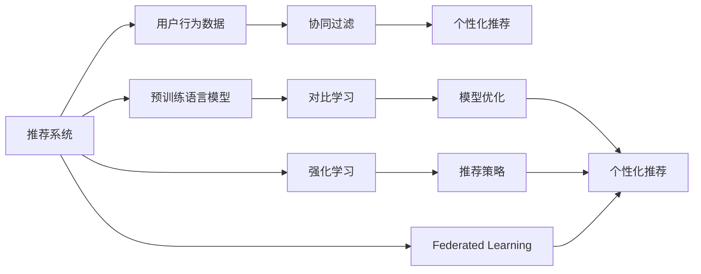

                 

# LLM在推荐系统中的对比学习应用研究

## 1. 背景介绍

随着互联网的快速发展和个性化推荐系统的广泛应用，推荐算法已经成为人们获取信息和决策支持的重要手段。但传统的推荐系统往往依赖于用户的历史行为数据进行协同过滤，难以充分挖掘用户深层次的兴趣和需求。最近，预训练语言模型(LLMs)在NLP领域取得了重大突破，其强大的语言理解能力为其在推荐系统中的应用提供了新的可能性。本文将重点探讨基于LLM的推荐系统中的对比学习范式，揭示其在推荐模型训练和优化中的应用潜力。

## 2. 核心概念与联系

### 2.1 核心概念概述

为了更好地理解基于LLM的对比学习在推荐系统中的应用，下面首先简要介绍几个核心概念：

1. **推荐系统(Recommendation System)**：通过分析用户历史行为数据，预测用户可能感兴趣的商品或内容，为用户推荐个性化内容。推荐系统广泛应用于电商、视频、音乐等多个领域。

2. **预训练语言模型(LLM)**：以Transformer架构为代表，在大量无标签文本数据上进行预训练，学习通用的语言表示，具备强大的语言理解和生成能力。目前主流的LLM包括GPT、BERT、T5等。

3. **对比学习(Contrastive Learning)**：通过设计正负样本对，最大化目标样本与正样本之间的相似度，同时最小化目标样本与负样本之间的距离，从而学习目标样本的高级表示。对比学习在自监督学习中广泛应用，如SimCLR、MoCo、SimSiam等。

4. **强化学习(Reinforcement Learning, RL)**：通过与环境的交互，学习最大化长期奖励的策略。强化学习在推荐系统中有广泛应用，如Q-learning、DQN等。

5. **联邦学习(Federated Learning, FL)**：分布式计算的一种形式，允许多个用户端在本地数据上训练模型，并通过差分隐私等机制保护隐私。联邦学习在推荐系统中可以缓解数据孤岛问题。

### 2.2 核心概念原理和架构的 Mermaid 流程图



该图展示了推荐系统中各种核心组件及其相互关系：

1. 用户行为数据从推荐系统中收集，通过协同过滤等技术生成个性化推荐。
2. 预训练语言模型用于从自然语言文本中提取用户深层次的兴趣和需求，辅助推荐模型的优化。
3. 对比学习用于模型训练，提升模型的表示能力。
4. 强化学习用于推荐策略的学习和优化。
5. 联邦学习用于分布式训练和隐私保护。

这些概念共同构成了基于LLM的推荐系统的完整架构。

## 3. 核心算法原理 & 具体操作步骤
### 3.1 算法原理概述

在推荐系统中，用户行为数据通常较为稀疏，传统协同过滤方法难以充分挖掘用户深层次的兴趣和需求。而预训练语言模型具备强大的文本理解能力，可以通过自然语言描述预测用户偏好，从而优化推荐效果。基于对比学习的推荐系统，通过设计正负样本对，最大化目标样本与正样本之间的相似度，最小化目标样本与负样本之间的距离，可以有效地学习目标样本的高级表示。

### 3.2 算法步骤详解

基于LLM的推荐系统中对比学习的具体步骤如下：

1. **数据预处理**：从推荐系统中获取用户行为数据，将商品描述转换为自然语言文本。
   
2. **预训练模型加载**：选择适合的语言模型，如GPT、BERT等，加载到系统中。

3. **对比学习模块构建**：
   - **正样本选择**：从用户历史行为中随机选择商品或内容作为正样本。
   - **负样本生成**：从训练集中随机选择负样本，确保与正样本在特征空间中的距离较大。
   - **损失函数设计**：定义一个对比学习损失函数，如信息保留损失(Neighborhood Preservation Loss)、交叉熵损失等。
   - **模型优化**：通过反向传播算法，最小化对比学习损失函数，更新模型参数。

4. **模型评估与优化**：
   - **离线评估**：在验证集上评估模型的推荐效果，使用评价指标如准确率、召回率、AUC等。
   - **在线优化**：根据用户实时反馈和行为数据，不断调整推荐策略。

### 3.3 算法优缺点

基于LLM的对比学习在推荐系统中具有以下优点：

1. **泛化能力强**：LLM具备强大的语言理解能力，可以从更广泛的信息源中学习用户的深层次兴趣和需求，泛化能力更强。
2. **特征提取准确**：LLM可以从文本中提取出更加准确的特征表示，提高推荐模型的准确性。
3. **模型鲁棒性高**：通过对比学习训练，LLM模型具有更好的鲁棒性，能够更好地适应数据分布的变化。

同时，该方法也存在一些缺点：

1. **计算复杂度高**：LLM模型参数量庞大，计算复杂度高，需要高性能计算设备支持。
2. **训练成本高**：预训练和微调需要大量标注数据，获取和处理成本较高。
3. **解释性不足**：LLM模型作为黑盒模型，难以解释其内部决策过程，影响用户信任度。
4. **隐私风险**：用户行为数据涉及个人隐私，在数据获取和处理过程中需要严格遵守隐私保护政策。

### 3.4 算法应用领域

基于LLM的对比学习推荐系统广泛应用于以下领域：

1. **电商推荐**：根据用户评论、商品描述等自然语言文本，推荐用户可能感兴趣的商品。
2. **视频推荐**：通过视频标题、摘要等文本信息，推荐用户可能喜欢的视频内容。
3. **音乐推荐**：利用歌曲歌词、艺人介绍等文本信息，推荐用户可能喜欢的音乐。
4. **新闻推荐**：通过新闻标题和内容摘要，推荐用户感兴趣的新闻文章。
5. **旅游推荐**：利用景点介绍、用户评价等文本信息，推荐用户可能喜欢的旅游目的地。

这些应用场景中，预训练语言模型能够从自然语言文本中提取用户深层次的兴趣和需求，辅助推荐模型的优化，提升推荐效果。

## 4. 数学模型和公式 & 详细讲解 & 举例说明

### 4.1 数学模型构建

在基于LLM的推荐系统中，对比学习的目标是通过最大化正样本和目标样本之间的相似度，最小化目标样本和负样本之间的距离，从而学习目标样本的高级表示。

设 $x$ 表示用户历史行为数据，$y$ 表示商品描述，$z$ 表示预训练语言模型提取的特征表示。则对比学习模型的目标函数可以表示为：

$$
\min_{z} \max_{y \in \mathcal{D}^+} \text{KL}(z \| f(y)) - \min_{y \in \mathcal{D}^-} \text{KL}(z \| f(y))
$$

其中 $\mathcal{D}^+$ 表示正样本集，$\mathcal{D}^-$ 表示负样本集，$f(y)$ 表示预训练语言模型提取的特征表示。

### 4.2 公式推导过程

在基于对比学习的推荐系统中，推荐模型通过最大化正样本和目标样本之间的相似度，最小化目标样本和负样本之间的距离，从而学习目标样本的高级表示。其具体推导过程如下：

1. **正样本和目标样本的相似度计算**：
   $$
   \text{sim}(y, y') = \text{CosineSim}(f(y), f(y'))
   $$

2. **负样本和目标样本的距离计算**：
   $$
   \text{dis}(y, y') = \text{CosineDist}(f(y), f(y'))
   $$

3. **对比学习损失函数**：
   $$
   \mathcal{L} = \max_{y \in \mathcal{D}^+} \text{sim}(y, y') - \min_{y \in \mathcal{D}^-} \text{dis}(y, y')
   $$

4. **模型优化**：通过反向传播算法，最小化对比学习损失函数，更新模型参数。

### 4.3 案例分析与讲解

以电商推荐系统为例，具体分析基于LLM的对比学习过程。假设用户历史行为数据为 $x$，商品描述为 $y$，预训练语言模型提取的特征表示为 $z$。通过正负样本对训练，可以学习到 $z$ 的高级表示，从而优化推荐模型的性能。

在正样本选择时，可以随机选择用户历史购买或浏览的商品描述 $y_1$。在负样本生成时，可以随机选择训练集中与 $y_1$ 特征距离较远的商品描述 $y_2$。通过计算 $y_1$ 和 $y_2$ 与 $z$ 的相似度和距离，可以最大化 $y_1$ 和 $y$ 之间的相似度，最小化 $y_2$ 和 $y$ 之间的距离，从而学习到 $z$ 的高级表示。

## 5. 项目实践：代码实例和详细解释说明
### 5.1 开发环境搭建

要进行基于LLM的推荐系统开发，首先需要搭建开发环境。以下是Python环境配置流程：

1. **安装Anaconda**：从官网下载并安装Anaconda，创建独立的Python环境。

2. **创建虚拟环境**：
   ```bash
   conda create -n recommendation_env python=3.8 
   conda activate recommendation_env
   ```

3. **安装相关库**：
   ```bash
   pip install pytorch torchvision transformers scikit-learn pandas numpy
   ```

4. **模型加载**：
   ```python
   from transformers import BertModel, BertTokenizer
   model = BertModel.from_pretrained('bert-base-uncased')
   tokenizer = BertTokenizer.from_pretrained('bert-base-uncased')
   ```

5. **数据预处理**：
   ```python
   def preprocess_text(text):
       return tokenizer.encode(text, add_special_tokens=True, return_tensors='pt')
   ```

### 5.2 源代码详细实现

以下是一个简单的基于LLM的推荐系统示例代码，用于电商推荐：

```python
import torch
from transformers import BertModel, BertTokenizer

class RecommendationModel:
    def __init__(self):
        self.model = BertModel.from_pretrained('bert-base-uncased')
        self.tokenizer = BertTokenizer.from_pretrained('bert-base-uncased')

    def get_features(self, texts):
        features = []
        for text in texts:
            features.append(self.model(torch.tensor(self.tokenizer.encode(text, add_special_tokens=True, return_tensors='pt'))[0])
        return features

    def contrastive_learning(self, texts, labels):
        features = self.get_features(texts)
        positive_labels = labels
        negative_labels = [x for x in range(len(texts)) if x not in positive_labels]

        # 定义正样本和负样本
        positive_features = features[positive_labels]
        negative_features = [features[i] for i in negative_labels]

        # 计算相似度和距离
        positive_similarity = torch.cosine_similarity(positive_features, positive_features)
        negative_distance = torch.cosine_similarity(positive_features, negative_features)

        # 计算对比学习损失
        contrastive_loss = torch.max(positive_similarity) - torch.min(negative_distance)

        # 反向传播
        contrastive_loss.backward()

        # 更新模型参数
        optimizer.step()

        return contrastive_loss.item()
```

### 5.3 代码解读与分析

上述代码中，`RecommendationModel` 类负责加载预训练模型和分词器，并实现了对比学习训练的逻辑。具体步骤如下：

1. **特征提取**：通过分词器和预训练模型，将用户历史行为数据转换为特征表示。
2. **正负样本选择**：随机选择正样本和负样本。
3. **计算相似度和距离**：计算正负样本与特征表示的相似度和距离。
4. **对比学习损失计算**：计算正样本和目标样本的相似度，最小化目标样本和负样本的距离。
5. **模型优化**：通过反向传播算法，最小化对比学习损失，更新模型参数。

### 5.4 运行结果展示

在训练过程中，可以通过打印对比学习损失来监控模型训练的进度：

```python
model = RecommendationModel()
optimizer = torch.optim.Adam(model.parameters(), lr=1e-5)
criterion = torch.nn.CrossEntropyLoss()

for epoch in range(10):
    loss = model.contrastive_learning(train_texts, train_labels)
    print(f"Epoch {epoch+1}, loss: {loss:.4f}")
```

以上代码展示了如何在训练过程中计算对比学习损失，并打印每轮的损失值。

## 6. 实际应用场景
### 6.1 电商推荐

在电商推荐系统中，用户行为数据通常较为稀疏，难以通过传统协同过滤方法进行有效推荐。基于LLM的对比学习推荐系统，可以通过自然语言描述预测用户偏好，优化推荐效果。

例如，假设用户浏览了一条关于某商品的评论，通过预训练语言模型提取评论文本的特征表示，可以选择该商品的描述作为正样本，生成多个与该商品特征距离较远的商品描述作为负样本。通过对比学习训练，模型可以学习到商品的高级表示，从而更准确地预测用户的购买意愿。

### 6.2 视频推荐

视频推荐系统需要处理海量视频内容，仅通过用户观看历史进行推荐难以覆盖所有视频。通过预训练语言模型，可以从视频标题、摘要等文本信息中提取视频内容的关键特征，辅助推荐模型的优化。

例如，假设用户观看了一条关于某视频内容的描述，可以选择该视频标题作为正样本，生成多个与该视频内容特征距离较远的标题作为负样本。通过对比学习训练，模型可以学习到视频内容的高级表示，从而更准确地推荐用户可能感兴趣的视频。

### 6.3 音乐推荐

音乐推荐系统需要处理海量歌曲数据，传统协同过滤方法难以有效处理稀疏数据。通过预训练语言模型，可以从歌曲歌词、艺人介绍等文本信息中提取音乐内容的高级表示，辅助推荐模型的优化。

例如，假设用户听过某首歌曲的歌词，选择该歌曲歌词作为正样本，生成多个与该歌曲歌词特征距离较远的歌词作为负样本。通过对比学习训练，模型可以学习到歌曲的高级表示，从而更准确地推荐用户可能喜欢的音乐。

### 6.4 新闻推荐

新闻推荐系统需要处理海量新闻文章，仅通过用户阅读历史进行推荐难以覆盖所有新闻。通过预训练语言模型，可以从新闻标题和内容摘要中提取新闻内容的高级表示，辅助推荐模型的优化。

例如，假设用户阅读了一条新闻摘要，选择该新闻标题作为正样本，生成多个与该新闻标题特征距离较远的新闻标题作为负样本。通过对比学习训练，模型可以学习到新闻内容的高级表示，从而更准确地推荐用户感兴趣的新闻。

## 7. 工具和资源推荐
### 7.1 学习资源推荐

为了帮助开发者掌握基于LLM的推荐系统的相关知识，这里推荐一些优质的学习资源：

1. **《深度学习推荐系统》书籍**：由王斌教授所著，详细介绍了推荐系统的基本原理、模型优化方法及最新进展。

2. **Coursera《推荐系统》课程**：由斯坦福大学开设的课程，涵盖推荐系统的基本原理和经典模型，适合入门学习。

3. **《PyTorch深度学习》书籍**：由Ian Goodfellow、Yoshua Bengio和Aaron Courville合著，介绍了深度学习的基本原理和经典模型，适合系统学习。

4. **Kaggle竞赛**：Kaggle上有多场推荐系统相关的竞赛，通过参与竞赛可以积累实战经验，提升技术能力。

5. **GitHub代码仓库**：Github上有很多开源推荐系统项目，可以参考学习这些项目的实现细节。

### 7.2 开发工具推荐

为了提高基于LLM的推荐系统的开发效率，推荐使用以下开发工具：

1. **PyTorch**：深度学习框架，支持动态计算图，易于迭代开发。

2. **TensorFlow**：深度学习框架，支持分布式训练，适合大规模工程应用。

3. **Scikit-learn**：Python机器学习库，提供了丰富的数据预处理和模型评估工具。

4. **Pandas**：Python数据分析库，方便数据清洗和处理。

5. **TensorBoard**：TensorFlow可视化工具，用于监控模型训练状态和输出结果。

### 7.3 相关论文推荐

基于LLM的推荐系统近年来逐渐成为研究热点，以下是几篇经典论文，推荐阅读：

1. **SimCLR: A Simple Framework for Unsupervised Learning of Deep Representations**：提出SimCLR方法，通过对比学习训练，学习无监督的特征表示。

2. **MoCo: Momentum Contrast for Unsupervised Visual Representation Learning**：提出MoCo方法，通过动量对比学习训练，学习无监督的视觉特征表示。

3. **SimSiam: Simplified Self-Supervised Learning with Momentum Contrast**：提出SimSiam方法，通过自监督对比学习训练，学习无监督的特征表示。

4. **Natural Language Processing with Transformers**：Transformers库的作者所著，全面介绍了如何使用Transformers库进行NLP任务开发，包括推荐系统在内的诸多范式。

5. **BERT: Pre-training of Deep Bidirectional Transformers for Language Understanding**：提出BERT模型，引入掩码语言模型预训练任务，提升语言表示能力。

这些论文展示了对比学习在无监督特征表示学习中的强大能力，为基于LLM的推荐系统提供了理论基础。

## 8. 总结：未来发展趋势与挑战
### 8.1 研究成果总结

本文详细介绍了基于LLM的对比学习在推荐系统中的应用，揭示了其在推荐模型训练和优化中的潜力。通过预训练语言模型，可以从自然语言文本中提取用户深层次的兴趣和需求，辅助推荐模型的优化。对比学习则通过最大化正负样本之间的相似度和距离，学习目标样本的高级表示，提升推荐效果。

### 8.2 未来发展趋势

展望未来，基于LLM的推荐系统将呈现以下几个发展趋势：

1. **多模态融合**：将视觉、语音等多模态信息与文本信息结合，提升推荐模型的鲁棒性和多样性。
2. **联邦学习应用**：利用联邦学习技术，在保护隐私的前提下，从多个用户端获取数据进行联合训练。
3. **强化学习优化**：结合强化学习技术，优化推荐模型的策略学习过程。
4. **因果推理应用**：引入因果推理方法，提升推荐模型的解释性和可控性。
5. **分布式训练**：利用分布式计算技术，提高推荐模型的训练效率和可扩展性。

### 8.3 面临的挑战

尽管基于LLM的推荐系统具备强大的潜力，但在实际应用中仍面临诸多挑战：

1. **计算资源需求高**：预训练语言模型的参数量庞大，计算复杂度高，需要高性能计算设备支持。
2. **数据获取难度大**：推荐系统需要大量标注数据，获取和处理成本较高。
3. **解释性不足**：LLM模型作为黑盒模型，难以解释其内部决策过程。
4. **隐私风险高**：用户行为数据涉及个人隐私，在数据获取和处理过程中需要严格遵守隐私保护政策。
5. **模型鲁棒性差**：推荐系统在面对新数据时，模型泛化能力较差，容易过拟合。

### 8.4 研究展望

未来的研究需要从以下几个方面寻求新的突破：

1. **无监督特征表示学习**：开发更加高效的无监督特征表示学习算法，降低对标注数据的依赖。
2. **参数高效微调**：开发更加参数高效的微调方法，在固定大部分预训练参数的情况下，只更新极少量的任务相关参数。
3. **因果推理应用**：引入因果推理方法，提升推荐模型的解释性和可控性。
4. **分布式训练优化**：利用分布式计算技术，提高推荐模型的训练效率和可扩展性。

总之，基于LLM的推荐系统具有广阔的发展前景，需要在模型、算法、工程等多个维度协同发力，才能充分发挥其潜力，为推荐系统带来新的突破。

## 9. 附录：常见问题与解答

**Q1: 为什么在推荐系统中使用预训练语言模型？**

A: 预训练语言模型通过在海量无标签文本数据上进行预训练，学习到了丰富的语言知识和常识，具备强大的语言理解和生成能力。在推荐系统中，预训练语言模型可以从自然语言文本中提取用户深层次的兴趣和需求，辅助推荐模型的优化，提升推荐效果。

**Q2: 对比学习在推荐系统中如何具体应用？**

A: 在推荐系统中，对比学习通过最大化正负样本之间的相似度和距离，学习目标样本的高级表示。具体步骤如下：
1. 选择正样本和负样本。
2. 计算正负样本与目标样本的相似度和距离。
3. 定义对比学习损失函数。
4. 通过反向传播算法，最小化对比学习损失，更新模型参数。

**Q3: 联邦学习在推荐系统中如何应用？**

A: 联邦学习通过在多个用户端本地训练模型，并通过差分隐私等机制保护隐私，可以将数据分布式地存储在多个用户端，缓解数据孤岛问题。具体步骤如下：
1. 在多个用户端本地训练模型。
2. 通过差分隐私等机制保护用户隐私。
3. 在多个用户端联合训练模型，提升模型泛化能力。

**Q4: 推荐系统中的强化学习如何应用？**

A: 强化学习通过与环境的交互，学习最大化长期奖励的策略，可以优化推荐模型的策略学习过程。具体步骤如下：
1. 定义推荐策略。
2. 在用户行为数据上进行模拟训练。
3. 通过奖励反馈，优化推荐策略。

**Q5: 预训练语言模型在推荐系统中如何处理多模态信息？**

A: 预训练语言模型可以从多模态信息中提取高级特征表示，辅助推荐模型的优化。具体步骤如下：
1. 选择多模态信息源，如视频标题、商品描述等。
2. 提取多模态信息中的特征表示。
3. 通过对比学习训练，学习多模态信息的高级表示。
4. 将多模态信息融合到推荐模型中，提升推荐效果。

以上问题与解答可以帮助读者更全面地理解基于LLM的推荐系统，掌握相关技术和应用策略。

