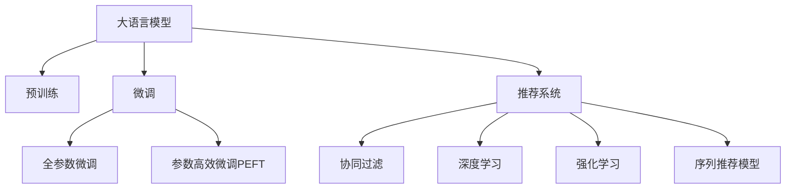

                 

# LLM在推荐系统中的未来展望

## 1. 背景介绍

推荐系统（Recommendation System）在现代社会中扮演着至关重要的角色。无论是电商平台的商品推荐、社交媒体的内容推送，还是音乐和视频网站的个性化播放列表，都离不开推荐系统的支撑。近年来，随着深度学习技术的兴起，推荐系统也开始采用大数据、深度学习和自然语言处理等先进技术，实现从内容到用户的深度理解。

特别是随着大语言模型（Large Language Models, LLMs）的出现，推荐系统更是迎来了革命性的变革。大语言模型通过在大规模无标签文本数据上进行预训练，学习到丰富的语言知识和常识，具备强大的语言理解和生成能力。将大语言模型引入推荐系统，不仅可以提升推荐效果，还能实现内容推荐、广告投放、智能客服等多领域的智能化应用。

本文将探讨大语言模型在推荐系统中的应用潜力，以及未来发展的趋势和挑战。通过分析其核心概念、算法原理和应用场景，希望能为推荐系统的研究和应用提供有价值的参考。

## 2. 核心概念与联系

### 2.1 核心概念概述

为更好地理解大语言模型在推荐系统中的应用，本节将介绍几个密切相关的核心概念：

- **大语言模型**：以自回归（如GPT）或自编码（如BERT）模型为代表的大规模预训练语言模型。通过在大规模无标签文本语料上进行预训练，学习通用的语言表示，具备强大的语言理解和生成能力。

- **预训练**：指在大规模无标签文本语料上，通过自监督学习任务训练通用语言模型的过程。常见的预训练任务包括言语建模、遮挡语言模型等。

- **微调**：指在预训练模型的基础上，使用下游任务的少量标注数据，通过有监督地训练来优化模型在该任务上的性能。通常只需要调整顶层分类器或解码器，并以较小的学习率更新全部或部分的模型参数。

- **推荐系统**：利用用户的历史行为数据和兴趣偏好，向用户推荐其可能感兴趣的内容、产品或服务的系统。推荐系统通过多种算法和技术手段，提升推荐的个性化和精准度。

- **协同过滤**：一种基于用户历史行为和相似性来推荐内容的推荐算法，分为基于用户的协同过滤和基于物品的协同过滤。

- **深度学习**：通过多层的神经网络结构来学习和模拟复杂函数的映射关系，广泛应用于图像识别、语音识别、自然语言处理等领域。

- **强化学习**：通过与环境的交互，通过试错来学习最优策略的机器学习方法，广泛应用于游戏AI、机器人控制、推荐系统等领域。

- **序列推荐模型**：通过序列数据建模，预测用户下一个可能的行为，如点击、购买等。常用的模型包括序列神经网络、循环神经网络（RNN）、长短时记忆网络（LSTM）等。

这些核心概念之间的逻辑关系可以通过以下Mermaid流程图来展示：



这个流程图展示了大语言模型的核心概念及其之间的关系：

1. 大语言模型通过预训练获得基础能力。
2. 微调是对预训练模型进行任务特定的优化，可以分为全参数微调和参数高效微调（PEFT）。
3. 推荐系统可以采用协同过滤、深度学习、强化学习等多种方法，构建推荐模型。
4. 序列推荐模型通过时间序列数据，预测用户后续行为。

这些概念共同构成了大语言模型在推荐系统中的应用框架，使其能够在各种场景下发挥强大的推荐能力。通过理解这些核心概念，我们可以更好地把握大语言模型在推荐系统中的工作原理和优化方向。

## 3. 核心算法原理 & 具体操作步骤

### 3.1 算法原理概述

大语言模型在推荐系统中的应用，主要通过微调实现。微调的目的是将大语言模型作为“特征提取器”，通过下游任务的少量标注数据，优化模型在该任务上的性能，从而提升推荐系统的个性化和精准度。

形式化地，假设预训练语言模型为 $M_{\theta}$，其中 $\theta$ 为预训练得到的模型参数。给定推荐任务 $T$ 的标注数据集 $D=\{(x_i, y_i)\}_{i=1}^N$，其中 $x_i$ 为用户的历史行为数据，$y_i$ 为用户对该行为的后续操作，如点击、购买等。微调的目标是找到新的模型参数 $\hat{\theta}$，使得：

$$
\hat{\theta}=\mathop{\arg\min}_{\theta} \mathcal{L}(M_{\theta},D)
$$

其中 $\mathcal{L}$ 为针对任务 $T$ 设计的损失函数，用于衡量模型预测操作与真实操作之间的差异。常见的损失函数包括交叉熵损失、均方误差损失等。

通过梯度下降等优化算法，微调过程不断更新模型参数 $\theta$，最小化损失函数 $\mathcal{L}$，使得模型输出逼近真实操作。由于 $\theta$ 已经通过预训练获得了较好的初始化，因此即便在推荐系统这样的少样本条件下，也能较快收敛到理想的模型参数 $\hat{\theta}$。

### 3.2 算法步骤详解

大语言模型在推荐系统中的微调一般包括以下几个关键步骤：

**Step 1: 准备预训练模型和数据集**
- 选择合适的预训练语言模型 $M_{\theta}$ 作为初始化参数，如 BERT、GPT 等。
- 准备推荐任务 $T$ 的标注数据集 $D$，划分为训练集、验证集和测试集。一般要求标注数据与预训练数据的分布不要差异过大。

**Step 2: 设计推荐目标函数**
- 根据推荐任务类型，设计合适的推荐目标函数，如平均绝对误差、均方根误差等。
- 引入个性化推荐模型的目标函数，如UserCF损失、ItemCF损失等。

**Step 3: 选择优化算法及超参数**
- 选择合适的优化算法及其参数，如 Adam、SGD 等，设置学习率、批大小、迭代轮数等。
- 设置正则化技术及强度，包括权重衰减、Dropout、Early Stopping 等。

**Step 4: 执行梯度训练**
- 将训练集数据分批次输入模型，前向传播计算损失函数。
- 反向传播计算参数梯度，根据设定的优化算法和学习率更新模型参数。
- 周期性在验证集上评估模型性能，根据性能指标决定是否触发 Early Stopping。
- 重复上述步骤直到满足预设的迭代轮数或 Early Stopping 条件。

**Step 5: 测试和部署**
- 在测试集上评估微调后模型 $M_{\hat{\theta}}$ 的性能，对比微调前后的精度提升。
- 使用微调后的模型对新样本进行推理预测，集成到实际的应用系统中。
- 持续收集新的数据，定期重新微调模型，以适应数据分布的变化。

以上是基于监督学习微调大语言模型的一般流程。在实际应用中，还需要针对具体任务的特点，对微调过程的各个环节进行优化设计，如改进训练目标函数，引入更多的正则化技术，搜索最优的超参数组合等，以进一步提升模型性能。

### 3.3 算法优缺点

大语言模型在推荐系统中的微调方法具有以下优点：
1. 简单高效。只需准备少量标注数据，即可对预训练模型进行快速适配，获得较大的性能提升。
2. 通用适用。适用于各种推荐任务，包括商品推荐、内容推荐、广告投放等，设计简单的推荐目标函数即可实现微调。
3. 参数高效。利用参数高效微调技术，在固定大部分预训练权重不变的情况下，仍可取得不错的提升。
4. 效果显著。在学术界和工业界的诸多任务上，基于微调的方法已经刷新了最先进的性能指标。

同时，该方法也存在一定的局限性：
1. 依赖标注数据。微调的效果很大程度上取决于标注数据的质量和数量，获取高质量标注数据的成本较高。
2. 迁移能力有限。当目标任务与预训练数据的分布差异较大时，微调的性能提升有限。
3. 负面效果传递。预训练模型的固有偏见、有害信息等，可能通过微调传递到推荐任务，造成负面影响。
4. 可解释性不足。微调模型的决策过程通常缺乏可解释性，难以对其推理逻辑进行分析和调试。

尽管存在这些局限性，但就目前而言，基于监督学习的微调方法仍是大语言模型在推荐系统应用的最主流范式。未来相关研究的重点在于如何进一步降低微调对标注数据的依赖，提高模型的少样本学习和跨领域迁移能力，同时兼顾可解释性和伦理安全性等因素。

### 3.4 算法应用领域

大语言模型在推荐系统中的应用已经得到了广泛的应用，覆盖了几乎所有常见推荐任务，例如：

- 商品推荐：如电商平台上的个性化推荐，根据用户的历史浏览、购买记录，推荐其可能感兴趣的商品。
- 内容推荐：如视频网站上的推荐系统，根据用户的历史观看记录，推荐其可能感兴趣的视频内容。
- 广告投放：如在线广告平台上的定向推荐，根据用户的兴趣标签和行为特征，精准投放广告。
- 游戏推荐：如游戏推荐系统，根据用户的游玩历史和偏好，推荐其可能喜欢的游戏。
- 音乐推荐：如音乐播放平台上的个性化推荐，根据用户的历史听歌记录，推荐其可能喜欢的音乐。
- 书籍推荐：如在线书店上的推荐系统，根据用户的阅读历史和评价，推荐其可能感兴趣的书籍。

除了上述这些经典任务外，大语言模型在推荐系统中的应用还在不断扩展，如可控推荐、兴趣预测、智能客服、动态定价等，为推荐系统带来了新的突破。随着预训练模型和微调方法的不断进步，相信推荐系统将在更广阔的应用领域大放异彩。

## 4. 数学模型和公式 & 详细讲解  

### 4.1 数学模型构建

本节将使用数学语言对基于监督学习的大语言模型微调过程进行更加严格的刻画。

记预训练语言模型为 $M_{\theta}$，其中 $\theta$ 为模型参数。假设推荐任务 $T$ 的训练集为 $D=\{(x_i,y_i)\}_{i=1}^N$，其中 $x_i$ 为用户的推荐记录，$y_i$ 为用户对该推荐记录的后续操作。

定义模型 $M_{\theta}$ 在数据样本 $(x,y)$ 上的损失函数为 $\ell(M_{\theta}(x),y)$，则在数据集 $D$ 上的经验风险为：

$$
\mathcal{L}(\theta) = \frac{1}{N}\sum_{i=1}^N \ell(M_{\theta}(x_i),y_i)
$$

微调的优化目标是最小化经验风险，即找到最优参数：

$$
\theta^* = \mathop{\arg\min}_{\theta} \mathcal{L}(\theta)
$$

在实践中，我们通常使用基于梯度的优化算法（如SGD、Adam等）来近似求解上述最优化问题。设 $\eta$ 为学习率，$\lambda$ 为正则化系数，则参数的更新公式为：

$$
\theta \leftarrow \theta - \eta \nabla_{\theta}\mathcal{L}(\theta) - \eta\lambda\theta
$$

其中 $\nabla_{\theta}\mathcal{L}(\theta)$ 为损失函数对参数 $\theta$ 的梯度，可通过反向传播算法高效计算。

### 4.2 公式推导过程

以下我们以推荐任务为例，推导交叉熵损失函数及其梯度的计算公式。

假设模型 $M_{\theta}$ 在输入 $x$ 上的输出为 $\hat{y}=M_{\theta}(x) \in [0,1]$，表示用户是否会采取后续操作，如点击、购买等。真实标签 $y \in \{0,1\}$。则推荐任务的交叉熵损失函数定义为：

$$
\ell(M_{\theta}(x),y) = -[y\log \hat{y} + (1-y)\log (1-\hat{y})]
$$

将其代入经验风险公式，得：

$$
\mathcal{L}(\theta) = -\frac{1}{N}\sum_{i=1}^N [y_i\log M_{\theta}(x_i)+(1-y_i)\log(1-M_{\theta}(x_i))]
$$

根据链式法则，损失函数对参数 $\theta_k$ 的梯度为：

$$
\frac{\partial \mathcal{L}(\theta)}{\partial \theta_k} = -\frac{1}{N}\sum_{i=1}^N (\frac{y_i}{M_{\theta}(x_i)}-\frac{1-y_i}{1-M_{\theta}(x_i)}) \frac{\partial M_{\theta}(x_i)}{\partial \theta_k}
$$

其中 $\frac{\partial M_{\theta}(x_i)}{\partial \theta_k}$ 可进一步递归展开，利用自动微分技术完成计算。

在得到损失函数的梯度后，即可带入参数更新公式，完成模型的迭代优化。重复上述过程直至收敛，最终得到适应推荐任务的最优模型参数 $\theta^*$。

## 5. 项目实践：代码实例和详细解释说明

### 5.1 开发环境搭建

在进行推荐系统微调实践前，我们需要准备好开发环境。以下是使用Python进行PyTorch开发的环境配置流程：

1. 安装Anaconda：从官网下载并安装Anaconda，用于创建独立的Python环境。

2. 创建并激活虚拟环境：
```bash
conda create -n pytorch-env python=3.8 
conda activate pytorch-env
```

3. 安装PyTorch：根据CUDA版本，从官网获取对应的安装命令。例如：
```bash
conda install pytorch torchvision torchaudio cudatoolkit=11.1 -c pytorch -c conda-forge
```

4. 安装TensorFlow：
```bash
conda install tensorflow -c conda-forge
```

5. 安装各类工具包：
```bash
pip install numpy pandas scikit-learn matplotlib tqdm jupyter notebook ipython
```

完成上述步骤后，即可在`pytorch-env`环境中开始微调实践。

### 5.2 源代码详细实现

下面我们以推荐任务为例，给出使用Transformers库对BERT模型进行微调的PyTorch代码实现。

首先，定义推荐任务的数据处理函数：

```python
from transformers import BertTokenizer
from torch.utils.data import Dataset
import torch

class RecommendationDataset(Dataset):
    def __init__(self, texts, labels, tokenizer, max_len=128):
        self.texts = texts
        self.labels = labels
        self.tokenizer = tokenizer
        self.max_len = max_len
        
    def __len__(self):
        return len(self.texts)
    
    def __getitem__(self, item):
        text = self.texts[item]
        label = self.labels[item]
        
        encoding = self.tokenizer(text, return_tensors='pt', max_length=self.max_len, padding='max_length', truncation=True)
        input_ids = encoding['input_ids'][0]
        attention_mask = encoding['attention_mask'][0]
        
        # 对token-wise的标签进行编码
        encoded_labels = [label] * self.max_len
        labels = torch.tensor(encoded_labels, dtype=torch.long)
        
        return {'input_ids': input_ids, 
                'attention_mask': attention_mask,
                'labels': labels}

# 标签与id的映射
label2id = {0: 0, 1: 1}
id2label = {v: k for k, v in label2id.items()}

# 创建dataset
tokenizer = BertTokenizer.from_pretrained('bert-base-cased')

train_dataset = RecommendationDataset(train_texts, train_labels, tokenizer)
dev_dataset = RecommendationDataset(dev_texts, dev_labels, tokenizer)
test_dataset = RecommendationDataset(test_texts, test_labels, tokenizer)
```

然后，定义模型和优化器：

```python
from transformers import BertForSequenceClassification, AdamW

model = BertForSequenceClassification.from_pretrained('bert-base-cased', num_labels=len(label2id))

optimizer = AdamW(model.parameters(), lr=2e-5)
```

接着，定义训练和评估函数：

```python
from torch.utils.data import DataLoader
from tqdm import tqdm
from sklearn.metrics import classification_report

device = torch.device('cuda') if torch.cuda.is_available() else torch.device('cpu')
model.to(device)

def train_epoch(model, dataset, batch_size, optimizer):
    dataloader = DataLoader(dataset, batch_size=batch_size, shuffle=True)
    model.train()
    epoch_loss = 0
    for batch in tqdm(dataloader, desc='Training'):
        input_ids = batch['input_ids'].to(device)
        attention_mask = batch['attention_mask'].to(device)
        labels = batch['labels'].to(device)
        model.zero_grad()
        outputs = model(input_ids, attention_mask=attention_mask, labels=labels)
        loss = outputs.loss
        epoch_loss += loss.item()
        loss.backward()
        optimizer.step()
    return epoch_loss / len(dataloader)

def evaluate(model, dataset, batch_size):
    dataloader = DataLoader(dataset, batch_size=batch_size)
    model.eval()
    preds, labels = [], []
    with torch.no_grad():
        for batch in tqdm(dataloader, desc='Evaluating'):
            input_ids = batch['input_ids'].to(device)
            attention_mask = batch['attention_mask'].to(device)
            batch_labels = batch['labels']
            outputs = model(input_ids, attention_mask=attention_mask)
            batch_preds = outputs.logits.argmax(dim=2).to('cpu').tolist()
            batch_labels = batch_labels.to('cpu').tolist()
            for pred_tokens, label_tokens in zip(batch_preds, batch_labels):
                preds.append(pred_tokens)
                labels.append(label_tokens)
                
    print(classification_report(labels, preds))
```

最后，启动训练流程并在测试集上评估：

```python
epochs = 5
batch_size = 16

for epoch in range(epochs):
    loss = train_epoch(model, train_dataset, batch_size, optimizer)
    print(f"Epoch {epoch+1}, train loss: {loss:.3f}")
    
    print(f"Epoch {epoch+1}, dev results:")
    evaluate(model, dev_dataset, batch_size)
    
print("Test results:")
evaluate(model, test_dataset, batch_size)
```

以上就是使用PyTorch对BERT进行推荐任务微调的完整代码实现。可以看到，得益于Transformers库的强大封装，我们可以用相对简洁的代码完成BERT模型的加载和微调。

### 5.3 代码解读与分析

让我们再详细解读一下关键代码的实现细节：

**RecommendationDataset类**：
- `__init__`方法：初始化文本、标签、分词器等关键组件。
- `__len__`方法：返回数据集的样本数量。
- `__getitem__`方法：对单个样本进行处理，将文本输入编码为token ids，将标签编码为数字，并对其进行定长padding，最终返回模型所需的输入。

**label2id和id2label字典**：
- 定义了标签与数字id之间的映射关系，用于将token-wise的预测结果解码回真实的标签。

**训练和评估函数**：
- 使用PyTorch的DataLoader对数据集进行批次化加载，供模型训练和推理使用。
- 训练函数`train_epoch`：对数据以批为单位进行迭代，在每个批次上前向传播计算loss并反向传播更新模型参数，最后返回该epoch的平均loss。
- 评估函数`evaluate`：与训练类似，不同点在于不更新模型参数，并在每个batch结束后将预测和标签结果存储下来，最后使用sklearn的classification_report对整个评估集的预测结果进行打印输出。

**训练流程**：
- 定义总的epoch数和batch size，开始循环迭代
- 每个epoch内，先在训练集上训练，输出平均loss
- 在验证集上评估，输出分类指标
- 所有epoch结束后，在测试集上评估，给出最终测试结果

可以看到，PyTorch配合Transformers库使得BERT微调的代码实现变得简洁高效。开发者可以将更多精力放在数据处理、模型改进等高层逻辑上，而不必过多关注底层的实现细节。

当然，工业级的系统实现还需考虑更多因素，如模型的保存和部署、超参数的自动搜索、更灵活的任务适配层等。但核心的微调范式基本与此类似。

## 6. 实际应用场景
### 6.1 智能推荐引擎

基于大语言模型微调的推荐系统，可以广泛应用于智能推荐引擎的构建。传统的推荐引擎往往依赖于显式的用户行为数据，难以捕捉用户的隐性兴趣和潜在的偏好。而使用微调后的推荐系统，可以理解用户的语言描述、行为模式和情感倾向，从而实现更全面、精准的推荐。

在技术实现上，可以收集用户的反馈文本、聊天记录、评分数据等，提取和用户交互的内容和情感信息。将文本内容作为模型输入，推荐结果作为监督信号，在此基础上微调预训练语言模型。微调后的模型能够从文本中准确把握用户的兴趣点，并生成个性化的推荐内容。例如，用户反馈“对某商品评价不错”，微调后的模型能够根据用户的历史行为数据和文本反馈，推荐类似商品或相关商品。

### 6.2 实时广告投放

在电商平台上，商家需要实时投放广告，以获得更好的点击率和转化率。基于大语言模型微调的推荐系统，可以帮助商家根据用户的实时行为数据，动态生成广告文案，提升广告的吸引力和投放效果。

具体而言，当用户浏览商品页面时，推荐系统可以实时采集用户的浏览记录和行为特征，通过微调后的模型预测用户的兴趣点，生成个性化的广告文案。例如，用户浏览了运动鞋，推荐系统可以生成类似“今天大促销，买一送一”的广告文案，吸引用户点击。通过动态生成广告文案，商家可以更精准地投放广告，提升广告效果和用户体验。

### 6.3 内容生成与优化

内容生成是推荐系统的重要组成部分，如视频网站上的视频播放列表、音乐平台的播放歌单等。基于大语言模型微调的推荐系统，可以通过自然语言生成技术，为视频、音频等媒体内容生成高质量的推荐描述。

在实践中，可以将用户对内容的评价、反馈等文本信息作为模型输入，预测用户对内容的兴趣程度，并生成推荐文本。例如，用户评价某视频“内容不错，但略长”，推荐系统可以生成类似“推荐观看时间：1-2小时”的推荐描述，提高用户观看体验。通过自然语言生成技术，推荐系统可以提供更加丰富、多样化的内容推荐，提升用户的满意度和留存率。

### 6.4 数据驱动的决策支持

推荐系统还可以用于辅助决策支持，如电商平台的库存管理、金融市场的投资决策等。通过微调后的推荐系统，可以实时分析用户的消费行为和市场趋势，提供决策建议和预警。

例如，电商平台可以根据用户的购买历史和反馈文本，生成推荐商品列表。基于这些推荐数据，电商平台可以优化库存管理，避免断货或库存积压。同时，金融市场可以通过分析用户的交易记录和投资行为，生成个性化的投资建议和风险预警，帮助用户做出更明智的投资决策。

### 6.5 动态定价

推荐系统还可以用于动态定价策略，如在线零售平台的价格优化。通过微调后的推荐系统，可以实时分析用户的购买意向和市场供需情况，动态调整商品价格，提升销售效果和利润率。

具体而言，当用户查看某商品时，推荐系统可以实时生成价格推荐，如“此商品今日优惠，价格为XXX元”。通过动态价格推荐，商家可以最大化销售利润，同时提升用户满意度。例如，用户浏览某本书籍，推荐系统可以生成类似“现在购买享五折优惠”的价格推荐，吸引用户下单。

## 7. 工具和资源推荐
### 7.1 学习资源推荐

为了帮助开发者系统掌握大语言模型在推荐系统中的应用，这里推荐一些优质的学习资源：

1. 《深度学习推荐系统》书籍：详细介绍了推荐系统的基础理论和多种算法，包括协同过滤、深度学习、强化学习等。

2. 《深度学习入门》系列课程：由中科院计算所开发，涵盖深度学习基础、推荐系统、自然语言处理等内容，适合初学者入门。

3. 《推荐系统实战》课程：由知名IT培训机构提供，结合实际案例，深入讲解推荐系统的构建和优化。

4. 《自然语言处理入门》系列课程：由斯坦福大学开设，涵盖NLP基础、序列建模、推荐系统等内容，适合进阶学习。

5. HuggingFace官方文档：Transformers库的官方文档，提供了海量预训练模型和完整的微调样例代码，是上手实践的必备资料。

通过对这些资源的学习实践，相信你一定能够快速掌握大语言模型在推荐系统中的应用，并用于解决实际的推荐问题。
###  7.2 开发工具推荐

高效的开发离不开优秀的工具支持。以下是几款用于大语言模型微调开发的常用工具：

1. PyTorch：基于Python的开源深度学习框架，灵活动态的计算图，适合快速迭代研究。大部分预训练语言模型都有PyTorch版本的实现。

2. TensorFlow：由Google主导开发的开源深度学习框架，生产部署方便，适合大规模工程应用。同样有丰富的预训练语言模型资源。

3. Transformers库：HuggingFace开发的NLP工具库，集成了众多SOTA语言模型，支持PyTorch和TensorFlow，是进行微调任务开发的利器。

4. Weights & Biases：模型训练的实验跟踪工具，可以记录和可视化模型训练过程中的各项指标，方便对比和调优。与主流深度学习框架无缝集成。

5. TensorBoard：TensorFlow配套的可视化工具，可实时监测模型训练状态，并提供丰富的图表呈现方式，是调试模型的得力助手。

6. Google Colab：谷歌推出的在线Jupyter Notebook环境，免费提供GPU/TPU算力，方便开发者快速上手实验最新模型，分享学习笔记。

合理利用这些工具，可以显著提升大语言模型微调任务的开发效率，加快创新迭代的步伐。

### 7.3 相关论文推荐

大语言模型在推荐系统中的应用源于学界的持续研究。以下是几篇奠基性的相关论文，推荐阅读：

1. 《深度学习推荐系统：原理与实践》：介绍了推荐系统的基础理论、算法和实际应用，包括协同过滤、矩阵分解、深度学习等。

2. 《推荐系统的深度学习》：详细讲解了基于深度学习的推荐系统，包括深度协同过滤、深度聚类、深度混合等。

3. 《强化学习在推荐系统中的应用》：介绍了强化学习在推荐系统中的应用，包括上下文推荐、行为学习、动态推荐等。

4. 《基于序列数据的推荐系统》：讲解了基于时间序列数据的推荐系统，包括RNN、LSTM等。

5. 《序列推荐系统综述》：综述了基于序列数据的推荐系统，包括序列神经网络、长短时记忆网络等。

这些论文代表了大语言模型在推荐系统中的应用方向。通过学习这些前沿成果，可以帮助研究者把握学科前进方向，激发更多的创新灵感。

## 8. 总结：未来发展趋势与挑战

### 8.1 总结

本文对大语言模型在推荐系统中的应用潜力进行了全面系统的介绍。首先阐述了推荐系统和大语言模型的核心概念，明确了微调在拓展推荐系统应用、提升个性化推荐精度方面的独特价值。其次，从原理到实践，详细讲解了基于监督学习的大语言模型微调过程，给出了微调任务开发的完整代码实例。同时，本文还广泛探讨了大语言模型在推荐系统中的应用场景，展示了微调范式的广泛适用性和巨大潜力。

通过本文的系统梳理，可以看到，基于大语言模型的微调方法正在成为推荐系统的重要范式，极大地拓展了推荐系统的应用边界，催生了更多的落地场景。受益于大规模语料的预训练，微调模型以更低的时间和标注成本，在小样本条件下也能取得不俗的效果，有力推动了推荐系统的产业化进程。未来，伴随大语言模型和微调方法的持续演进，相信推荐系统将在更广阔的应用领域大放异彩，深刻影响用户的消费体验和决策行为。

### 8.2 未来发展趋势

展望未来，大语言模型在推荐系统中的应用将呈现以下几个发展趋势：

1. 推荐模型多样化。除了传统的基于用户行为和物品属性的推荐模型，未来还将出现更多基于自然语言理解、情感分析等高级任务的推荐模型，如基于对话、基于文本的推荐等。

2. 实时推荐成为常态。随着深度学习和大语言模型的进步，推荐系统可以实现实时个性化推荐，提升用户的互动体验和满意度。

3. 多模态推荐系统崛起。未来的推荐系统将不再局限于单一模态的推荐，而是融合多种模态信息，如文本、图像、语音等，实现跨模态推荐，提供更加丰富和全面的推荐内容。

4. 个性化推荐进一步增强。通过引入更丰富的用户行为和兴趣信息，推荐系统将能更精准地识别用户需求，生成更个性化的推荐内容。

5. 推荐系统更具交互性。未来的推荐系统将不仅仅提供静态推荐结果，而是能够与用户进行互动，通过问答、推荐结果反馈等方式，动态调整推荐策略，提升推荐效果。

6. 推荐系统更注重公平性。由于推荐系统的广泛应用，其公平性问题也日益受到关注。未来的推荐系统将更加注重公平性，避免对某些群体或商品产生歧视性推荐。

以上趋势凸显了大语言模型在推荐系统中的巨大潜力和应用前景。这些方向的探索发展，必将进一步提升推荐系统的个性化和精准度，为用户的消费体验带来深刻变革。

### 8.3 面临的挑战

尽管大语言模型在推荐系统中的应用取得了显著进展，但在迈向更加智能化、普适化应用的过程中，它仍面临着诸多挑战：

1. 推荐模型对标注数据的依赖。推荐系统通常需要大量的标注数据来训练和微调模型，而标注数据的获取成本较高，可能限制了推荐系统的应用范围。

2. 推荐模型的泛化能力不足。当推荐任务与预训练数据的分布差异较大时，微调的性能提升有限，推荐系统的泛化能力仍需提升。

3. 推荐系统的交互性不足。当前的推荐系统主要以静态推荐为主，缺乏与用户的互动，难以动态调整推荐策略。

4. 推荐系统的公平性问题。推荐系统可能存在算法偏见，对某些群体或商品产生歧视性推荐，需要引入公平性约束。

5. 推荐系统的安全性问题。推荐系统可能被恶意攻击者利用，产生误导性推荐，影响用户决策。

6. 推荐系统的稳定性问题。推荐系统的算法复杂性较高，可能出现不稳定的问题，影响推荐效果。

7. 推荐系统的计算成本高。大规模推荐系统的计算需求巨大，如何高效地进行推荐系统训练和推理，需要进一步优化。

正视推荐系统面临的这些挑战，积极应对并寻求突破，将是大语言模型在推荐系统走向成熟的必由之路。相信随着学界和产业界的共同努力，这些挑战终将一一被克服，大语言模型在推荐系统中的应用将更加广泛和深入。

### 8.4 研究展望

面对推荐系统面临的这些挑战，未来的研究需要在以下几个方面寻求新的突破：

1. 探索无监督和半监督推荐方法。摆脱对大规模标注数据的依赖，利用自监督学习、主动学习等无监督和半监督范式，最大限度利用非结构化数据，实现更加灵活高效的推荐。

2. 研究参数高效和计算高效的推荐范式。开发更加参数高效的推荐方法，在固定大部分预训练权重不变的情况下，只更新极少量的任务相关参数。同时优化推荐系统的计算图，减少前向传播和反向传播的资源消耗，实现更加轻量级、实时性的部署。

3. 融合因果和对比学习范式。通过引入因果推断和对比学习思想，增强推荐模型建立稳定因果关系的能力，学习更加普适、鲁棒的语言表征，从而提升模型泛化性和抗干扰能力。

4. 引入更多先验知识。将符号化的先验知识，如知识图谱、逻辑规则等，与神经网络模型进行巧妙融合，引导推荐过程学习更准确、合理的语言模型。同时加强不同模态数据的整合，实现视觉、语音等多模态信息与文本信息的协同建模。

5. 结合因果分析和博弈论工具。将因果分析方法引入推荐模型，识别出模型决策的关键特征，增强推荐输出的因果性和逻辑性。借助博弈论工具刻画人机交互过程，主动探索并规避推荐系统的脆弱点，提高系统稳定性。

6. 纳入伦理道德约束。在推荐模型训练目标中引入伦理导向的评估指标，过滤和惩罚有偏见、有害的推荐结果。同时加强人工干预和审核，建立推荐行为的监管机制，确保推荐输出的符合用户价值观和伦理道德。

这些研究方向的探索，必将引领大语言模型在推荐系统中的应用迈向更高的台阶，为构建更加智能、公平、安全的推荐系统提供新思路和新方法。

## 9. 附录：常见问题与解答

**Q1：大语言模型在推荐系统中如何处理文本数据？**

A: 大语言模型在推荐系统中处理文本数据，通常通过以下步骤：

1. 分词和编码。将文本数据进行分词，并使用分词器（如BertTokenizer）将其转换为模型所需的token ids和attention mask。

2. 嵌入表示。将token ids和attention mask输入到预训练语言模型中，得到文本的嵌入表示。

3. 特征提取。通过微调后的语言模型，对文本的嵌入表示进行进一步的特征提取，生成推荐模型的输入特征。

4. 训练模型。使用推荐任务的标注数据集，对推荐模型进行训练和微调，得到最终的推荐模型。

5. 推理预测。在推荐系统部署后，通过用户行为数据生成推荐输入，输入到微调后的语言模型中，得到推荐结果。

大语言模型通过以上步骤，实现了对文本数据的处理和推荐，能够理解用户的语言描述、行为模式和情感倾向，生成个性化的推荐内容。

**Q2：大语言模型在推荐系统中如何降低对标注数据的依赖？**

A: 大语言模型在推荐系统中降低对标注数据的依赖，通常有以下几种方法：

1. 无监督推荐。利用用户的隐式行为数据（如浏览、点击、评分等），结合协同过滤、矩阵分解等算法，实现无监督推荐。

2. 半监督推荐。结合小规模标注数据和大量无标签数据，通过半监督学习方法，提升推荐模型的性能。

3. 自适应推荐。通过自适应学习方法，不断调整推荐模型参数，适应新的数据分布和用户需求。

4. 多模态推荐。融合多种模态数据（如文本、图像、音频等），提升推荐模型的泛化能力和准确度。

5. 主动学习。通过主动学习方法，选择需要标注的数据，最小化标注成本。

6. 基于深度强化学习的推荐。通过深度强化学习算法，利用用户的实时反馈，动态调整推荐策略。

以上方法均能够降低对标注数据的依赖，提高推荐系统的智能化和泛化能力，确保其在不同场景下的高效运行。

**Q3：大语言模型在推荐系统中的推荐精度如何？**

A: 大语言模型在推荐系统中的推荐精度通常较高，但具体精度取决于数据质量、模型架构、微调方法等因素。

1. 数据质量。推荐模型的推荐精度与数据质量密切相关。高质量的标注数据和用户行为数据，能够有效提升推荐模型的准确度。

2. 模型架构。推荐模型通常采用深度学习、Transformer等架构，通过大量的预训练和微调，能够学习到丰富的语言知识和用户行为模式，提升推荐效果。

3. 微调方法。微调方法的选择对推荐精度也有重要影响。如参数高效微调（PEFT）、对抗训练等方法，能够提升模型泛化能力和鲁棒性，减少过拟合风险。

4. 模型训练和推理。推荐模型需要经过大量的训练和推理，通过不断迭代优化，提升模型的性能。

5. 评估指标。推荐精度的评估指标包括准确率、召回率、F1-score等。推荐模型需要根据具体任务选择合适的评估指标，进行模型的训练和优化。

综上所述，大语言模型在推荐系统中的推荐精度通常较高，但需要通过合理的数据、模型和微调方法，进一步提升推荐模型的性能。

**Q4：大语言模型在推荐系统中如何避免偏见？**

A: 大语言模型在推荐系统中避免偏见，通常有以下几种方法：

1. 数据预处理。通过数据清洗、去重、去噪等方法，确保推荐数据的质量和多样性。

2. 模型公平性约束。在推荐模型的训练目标中引入公平性约束，过滤和惩罚有偏见、有害的推荐结果。

3. 对抗样本训练。通过引入对抗样本，增强推荐模型的鲁棒性，避免对特定群体或商品的歧视性推荐。

4. 多模态融合。通过融合多种模态数据，避免单一数据来源的偏见和局限性，提高推荐模型的公平性。

5. 人工干预和审核。通过人工干预和审核，定期检查和调整推荐模型，确保推荐输出的符合伦理道德和社会价值观。

6. 模型监督和反馈。通过用户反馈和监督机制，及时发现和纠正推荐模型的偏见，确保推荐系统的公正性和公平性。

以上方法均能够避免推荐系统中的偏见，确保推荐模型的公正性和公平性，提升用户的满意度和信任度。

**Q5：大语言模型在推荐系统中如何进行实时推荐？**

A: 大语言模型在推荐系统中进行实时推荐，通常有以下几种方法：

1. 实时数据采集。实时采集用户的最新行为数据，如浏览、点击、评分等，生成推荐输入。

2. 实时模型推理。通过微调后的语言模型，对实时推荐输入进行推理预测，生成推荐结果。

3. 实时更新推荐结果。将实时推荐结果返回给用户，及时更新推荐页面，提高用户的互动体验。

4. 动态调整推荐策略。根据实时推荐结果和用户反馈，动态调整推荐策略，提升推荐效果。

5. 实时数据清洗和处理。对实时数据进行清洗和处理，确保推荐数据的质量和准确性。

6. 实时系统部署。将实时推荐系统部署到生产环境，确保系统的高可用性和稳定性。

通过以上方法，大语言模型能够在推荐系统中实现实时推荐，提升用户的互动体验和满意度。

---

作者：禅与计算机程序设计艺术 / Zen and the Art of Computer Programming

