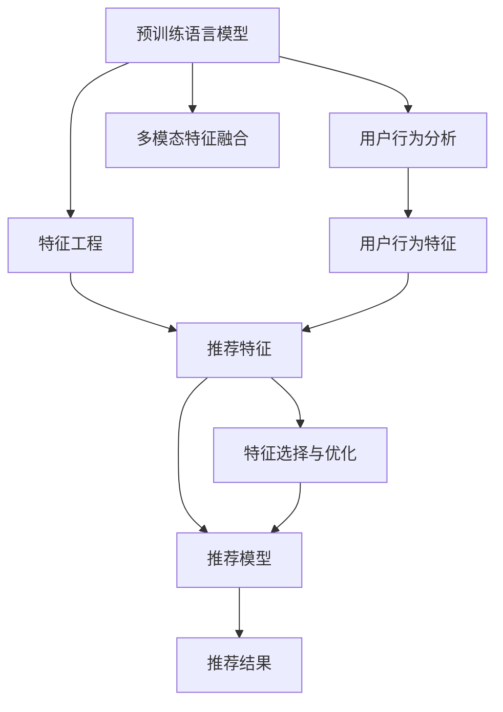

                 

# LLM在推荐系统特征工程中的应用

> 关键词：推荐系统, 特征工程, 预训练语言模型, 自然语言处理(NLP), 推荐算法, 用户行为预测

## 1. 背景介绍

### 1.1 问题由来

随着互联网的普及和数字技术的不断进步，推荐系统在电商、视频、音乐、新闻等多个领域得到广泛应用，极大地提升了用户体验和运营效率。然而，传统的基于协同过滤、内容推荐的推荐系统，往往无法很好地处理用户个性化需求，推荐效果存在局限性。近年来，基于深度学习的推荐系统取得了突破性进展，能够处理更加复杂和多变的数据，成为推荐系统的主要技术方向。

预训练语言模型(Pre-trained Language Models, LLMs)作为深度学习中的前沿技术，已经在自然语言处理(NLP)领域取得了显著成效。基于预训练语言模型的方法，在处理用户描述、评论、行为日志等文本数据时，具有很强的语义理解能力和泛化能力。然而，在推荐系统特征工程中，传统的基于协同过滤的方法仍然占据主导地位。如何将预训练语言模型引入推荐系统，以更好地理解用户行为和兴趣，成为当前研究的热点问题。

### 1.2 问题核心关键点

预训练语言模型引入推荐系统的关键在于如何设计有效的特征提取和融合方式，最大化利用预训练模型提供的语义信息，提升推荐效果。主要包括以下几个关键点：

- 特征表示学习：利用预训练语言模型，提取用户的文本特征，如用户评论、商品描述等。
- 用户行为理解：将用户的点击、评分、购买行为等行为数据，转化为预训练模型可理解的向量形式。
- 上下文信息融合：将用户行为数据和文本数据融合，形成更为丰富的用户行为表示。
- 多模态特征融合：将文本、图像、音频等多模态数据进行协同建模，提升推荐效果。
- 特征选择和优化：通过特征选择和调参，优化特征工程的效果，避免过拟合和维度灾难。

这些关键点涉及推荐系统的多个环节，从特征提取到行为理解，再到多模态融合和特征优化，都需要在预训练语言模型的基础上，进行合理设计和实验。

## 2. 核心概念与联系

### 2.1 核心概念概述

为更好地理解预训练语言模型在推荐系统特征工程中的应用，本节将介绍几个密切相关的核心概念：

- 预训练语言模型(LLMs)：如BERT、GPT、RoBERTa等，通过在海量文本数据上进行自监督学习，获得丰富的语言知识，可以用于文本分类、情感分析、机器翻译等NLP任务。
- 推荐系统：通过分析用户行为和物品特征，向用户推荐合适物品的系统，如电商平台的商品推荐、视频平台的电影推荐等。
- 特征工程：对原始数据进行预处理、特征提取和特征选择，形成可供推荐模型使用的特征向量。
- 用户行为分析：对用户的点击、浏览、评分、购买等行为进行分析，提取用户兴趣和偏好。
- 多模态特征融合：将文本、图像、音频等多种类型的数据进行协同建模，形成更全面的用户和物品表示。

这些核心概念之间的逻辑关系可以通过以下Mermaid流程图来展示：



这个流程图展示了大语言模型在推荐系统特征工程中的应用流程：

1. 预训练语言模型通过自监督学习获取丰富的语言知识。
2. 利用预训练语言模型提取用户行为特征，形成用户兴趣表示。
3. 将用户行为特征与多模态数据进行融合，生成更为全面的用户表示。
4. 进行特征选择与优化，避免过拟合和维度灾难。
5. 使用推荐模型对用户和物品特征进行匹配，生成推荐结果。

## 3. 核心算法原理 & 具体操作步骤
### 3.1 算法原理概述

基于预训练语言模型的推荐系统特征工程，核心思想是利用预训练语言模型提取用户的文本特征，并结合行为数据，形成综合的推荐特征向量。该过程分为以下几个关键步骤：

1. 利用预训练语言模型提取用户评论、商品描述等文本特征，形成用户兴趣表示。
2. 将用户的点击、评分、购买行为等行为数据，转化为预训练语言模型可理解的向量形式。
3. 将用户行为特征与文本特征进行融合，形成更为丰富的用户行为表示。
4. 进行特征选择和优化，减少不必要的高维特征。
5. 使用推荐算法对用户和物品特征进行匹配，生成推荐结果。

### 3.2 算法步骤详解

以下是基于预训练语言模型在推荐系统特征工程中的具体操作步骤：

**Step 1: 准备预训练模型和数据集**

- 选择合适的预训练语言模型 $M_{\theta}$，如BERT、GPT等。
- 准备推荐系统的数据集 $D=\{(x_i,y_i)\}_{i=1}^N$，其中 $x_i$ 为包含用户行为和物品特征的特征向量， $y_i$ 为物品ID或评分等标签。

**Step 2: 特征提取**

- 利用预训练语言模型 $M_{\theta}$ 对用户评论、商品描述等文本数据进行编码，得到用户兴趣表示 $h_u \in \mathbb{R}^{d_h}$。
- 将用户行为数据 $x_i$ 转化为预训练语言模型的输入格式，通过前向传播计算得到行为特征表示 $v_i \in \mathbb{R}^{d_v}$。

**Step 3: 特征融合**

- 将用户兴趣表示 $h_u$ 和行为特征表示 $v_i$ 进行拼接或拼接后线性变换，形成综合的用户行为表示 $f_u \in \mathbb{R}^{d_{fu}}$。
- 对于多模态数据，可以使用不同的预训练模型分别提取特征，再进行融合。

**Step 4: 特征选择与优化**

- 使用特征选择方法(如L1正则、PCA、主成分分析等)对用户行为表示 $f_u$ 进行优化，减少不必要的特征。
- 使用模型融合技术(如Bagging、Boosting等)，提升特征工程的泛化能力。

**Step 5: 推荐模型训练**

- 使用推荐算法(如协同过滤、基于矩阵分解的推荐等)对用户和物品特征进行匹配，生成推荐结果。
- 使用优化算法(如SGD、Adam等)对模型参数进行优化，最小化损失函数 $\mathcal{L}$。

### 3.3 算法优缺点

基于预训练语言模型的推荐系统特征工程具有以下优点：

1. 提取用户兴趣：预训练语言模型可以处理大规模语料，通过文本特征提取，学习到用户的深层兴趣表示。
2. 行为理解：将用户行为数据转化为向量形式，可以更好地理解用户的实时兴趣和偏好。
3. 多模态融合：结合文本、图像、音频等多模态数据，提升推荐系统对复杂数据的处理能力。
4. 泛化能力强：预训练语言模型具有较强的泛化能力，可以在不同数据集上实现较好的迁移学习效果。

然而，该方法也存在一定的局限性：

1. 计算成本高：预训练语言模型计算成本较高，对硬件资源要求较高。
2. 特征维度高：由于语料规模庞大，特征维度较高，需要考虑特征选择和优化问题。
3. 模型复杂度高：推荐模型通常较为复杂，需要更强的计算资源进行训练和推理。
4. 鲁棒性问题：预训练语言模型可能学习到噪声，影响推荐结果的鲁棒性。

尽管存在这些局限性，但基于预训练语言模型的推荐系统特征工程仍然具有显著的优势，在推荐领域具有广泛的应用前景。

### 3.4 算法应用领域

基于预训练语言模型的推荐系统特征工程，已经在电商、视频、音乐、新闻等多个领域得到应用，具体如下：

- 电商推荐：利用用户评论和商品描述提取用户兴趣，结合点击、购买行为，推荐适合的商品。
- 视频推荐：分析用户评论和评分，提取用户兴趣，结合观看历史，推荐相关视频。
- 音乐推荐：利用歌词和用户评论，提取用户兴趣，结合收听历史，推荐合适的音乐。
- 新闻推荐：分析用户浏览和点击行为，提取用户兴趣，结合新闻内容，推荐相关新闻。

这些领域的应用展示了预训练语言模型在推荐系统特征工程中的巨大潜力，未来还将拓展到更多垂直领域，为各行各业带来新的价值。

## 4. 数学模型和公式 & 详细讲解  
### 4.1 数学模型构建

在推荐系统特征工程中，预训练语言模型 $M_{\theta}$ 可以通过自监督学习任务进行预训练，如掩码语言模型、语言建模等。在微调后，可以用于提取用户和物品的特征表示。

假设预训练语言模型 $M_{\theta}$ 对输入文本 $x$ 进行编码，得到向量表示 $h(x) \in \mathbb{R}^{d_h}$。在推荐系统中，用户行为 $x_i$ 可以转化为预训练语言模型的输入格式，通过前向传播计算得到向量表示 $v_i \in \mathbb{R}^{d_v}$。

用户兴趣表示 $h_u$ 和行为特征表示 $v_i$ 进行拼接，形成综合的用户行为表示 $f_u$：

$$
f_u = [h_u; v_i]
$$

其中分号表示向量拼接操作。通过特征选择和优化方法，可以减少不必要的高维特征，提升模型的泛化能力。

### 4.2 公式推导过程

以下我们以协同过滤推荐算法为例，推导基于预训练语言模型的推荐公式。

假设用户 $u$ 对物品 $i$ 的评分 $y_{ui} \in [1,5]$，用户兴趣表示 $h_u \in \mathbb{R}^{d_h}$，物品特征表示 $h_i \in \mathbb{R}^{d_h}$。协同过滤推荐的优化目标是最小化预测评分与真实评分的差异：

$$
\mathcal{L}(u,i) = \frac{1}{N} \sum_{i=1}^N (y_{ui} - f_u^T W h_i)^2
$$

其中 $W$ 为权重矩阵，$f_u$ 为综合用户行为表示。通过对 $f_u$ 进行特征选择和优化，可以减少不必要的特征。最终，协同过滤推荐的预测评分 $y_{ui}^{\text{pred}}$ 可以表示为：

$$
y_{ui}^{\text{pred}} = f_u^T W h_i
$$

将预测评分与真实评分对比，计算平均误差：

$$
\mathcal{L}(u) = \frac{1}{N} \sum_{i=1}^N (y_{ui} - f_u^T W h_i)^2
$$

通过梯度下降等优化算法，最小化损失函数，更新权重矩阵 $W$，从而提升推荐效果。

### 4.3 案例分析与讲解

在实际应用中，基于预训练语言模型的推荐系统特征工程，可以通过以下案例进一步分析：

**电商推荐案例**

在电商推荐系统中，利用用户评论和商品描述提取用户兴趣，结合点击、购买行为，推荐适合的商品。具体步骤如下：

1. 对用户的评论和商品描述进行编码，得到用户兴趣表示 $h_u$ 和商品特征表示 $h_i$。
2. 将用户行为数据 $x_i$ 转化为预训练语言模型的输入格式，通过前向传播计算得到行为特征表示 $v_i$。
3. 将用户兴趣表示 $h_u$ 和行为特征表示 $v_i$ 进行拼接，得到综合的用户行为表示 $f_u$。
4. 使用协同过滤算法，计算用户对物品的评分，生成推荐结果。

**视频推荐案例**

在视频推荐系统中，分析用户评论和评分，提取用户兴趣，结合观看历史，推荐相关视频。具体步骤如下：

1. 对用户的评论和评分进行编码，得到用户兴趣表示 $h_u$。
2. 将用户的观看历史转化为预训练语言模型的输入格式，通过前向传播计算得到行为特征表示 $v_i$。
3. 将用户兴趣表示 $h_u$ 和行为特征表示 $v_i$ 进行拼接，得到综合的用户行为表示 $f_u$。
4. 使用协同过滤算法，计算用户对视频的评分，生成推荐结果。

通过以上两个案例可以看出，基于预训练语言模型的推荐系统特征工程，能够更好地处理用户行为和文本数据，提升推荐效果。

## 5. 项目实践：代码实例和详细解释说明
### 5.1 开发环境搭建

在进行预训练语言模型在推荐系统特征工程的应用实践前，我们需要准备好开发环境。以下是使用Python进行PyTorch开发的环境配置流程：

1. 安装Anaconda：从官网下载并安装Anaconda，用于创建独立的Python环境。

2. 创建并激活虚拟环境：
```bash
conda create -n pytorch-env python=3.8 
conda activate pytorch-env
```

3. 安装PyTorch：根据CUDA版本，从官网获取对应的安装命令。例如：
```bash
conda install pytorch torchvision torchaudio cudatoolkit=11.1 -c pytorch -c conda-forge
```

4. 安装Transformers库：
```bash
pip install transformers
```

5. 安装各类工具包：
```bash
pip install numpy pandas scikit-learn matplotlib tqdm jupyter notebook ipython
```

完成上述步骤后，即可在`pytorch-env`环境中开始实践。

### 5.2 源代码详细实现

下面我们以电商推荐系统为例，给出使用Transformers库对BERT模型进行电商推荐特征工程的PyTorch代码实现。

首先，定义电商推荐系统的数据处理函数：

```python
from transformers import BertTokenizer
from torch.utils.data import Dataset
import torch

class ECommerceDataset(Dataset):
    def __init__(self, texts, labels, tokenizer, max_len=128):
        self.texts = texts
        self.labels = labels
        self.tokenizer = tokenizer
        self.max_len = max_len
        
    def __len__(self):
        return len(self.texts)
    
    def __getitem__(self, item):
        text = self.texts[item]
        label = self.labels[item]
        
        encoding = self.tokenizer(text, return_tensors='pt', max_length=self.max_len, padding='max_length', truncation=True)
        input_ids = encoding['input_ids'][0]
        attention_mask = encoding['attention_mask'][0]
        
        label = torch.tensor(label, dtype=torch.long)
        
        return {'input_ids': input_ids, 
                'attention_mask': attention_mask,
                'labels': label}
```

然后，定义模型和优化器：

```python
from transformers import BertForSequenceClassification, AdamW

model = BertForSequenceClassification.from_pretrained('bert-base-cased', num_labels=2)

optimizer = AdamW(model.parameters(), lr=2e-5)
```

接着，定义训练和评估函数：

```python
from torch.utils.data import DataLoader
from tqdm import tqdm
from sklearn.metrics import accuracy_score

device = torch.device('cuda') if torch.cuda.is_available() else torch.device('cpu')
model.to(device)

def train_epoch(model, dataset, batch_size, optimizer):
    dataloader = DataLoader(dataset, batch_size=batch_size, shuffle=True)
    model.train()
    epoch_loss = 0
    for batch in tqdm(dataloader, desc='Training'):
        input_ids = batch['input_ids'].to(device)
        attention_mask = batch['attention_mask'].to(device)
        labels = batch['labels'].to(device)
        model.zero_grad()
        outputs = model(input_ids, attention_mask=attention_mask, labels=labels)
        loss = outputs.loss
        epoch_loss += loss.item()
        loss.backward()
        optimizer.step()
    return epoch_loss / len(dataloader)

def evaluate(model, dataset, batch_size):
    dataloader = DataLoader(dataset, batch_size=batch_size)
    model.eval()
    preds, labels = [], []
    with torch.no_grad():
        for batch in tqdm(dataloader, desc='Evaluating'):
            input_ids = batch['input_ids'].to(device)
            attention_mask = batch['attention_mask'].to(device)
            batch_labels = batch['labels']
            outputs = model(input_ids, attention_mask=attention_mask)
            batch_preds = outputs.logits.argmax(dim=1).to('cpu').tolist()
            batch_labels = batch_labels.to('cpu').tolist()
            for pred, label in zip(batch_preds, batch_labels):
                preds.append(pred)
                labels.append(label)
                
    print(accuracy_score(labels, preds))
```

最后，启动训练流程并在测试集上评估：

```python
epochs = 5
batch_size = 16

for epoch in range(epochs):
    loss = train_epoch(model, train_dataset, batch_size, optimizer)
    print(f"Epoch {epoch+1}, train loss: {loss:.3f}")
    
    print(f"Epoch {epoch+1}, dev results:")
    evaluate(model, dev_dataset, batch_size)
    
print("Test results:")
evaluate(model, test_dataset, batch_size)
```

以上就是使用PyTorch对BERT进行电商推荐特征工程的完整代码实现。可以看到，得益于Transformers库的强大封装，我们可以用相对简洁的代码完成BERT模型的加载和特征工程。

### 5.3 代码解读与分析

让我们再详细解读一下关键代码的实现细节：

**ECommerceDataset类**：
- `__init__`方法：初始化文本、标签、分词器等关键组件。
- `__len__`方法：返回数据集的样本数量。
- `__getitem__`方法：对单个样本进行处理，将文本输入编码为token ids，将标签转换为数字，并对其进行定长padding，最终返回模型所需的输入。

**模型和优化器**：
- 选择合适的预训练语言模型 $M_{\theta}$，如BERT模型，通过 `BertForSequenceClassification` 类进行加载。
- 选择优化算法及其参数，如 AdamW，设置学习率 $\eta=2e-5$。

**训练和评估函数**：
- 使用PyTorch的DataLoader对数据集进行批次化加载，供模型训练和推理使用。
- 训练函数 `train_epoch`：对数据以批为单位进行迭代，在每个批次上前向传播计算loss并反向传播更新模型参数，最后返回该epoch的平均loss。
- 评估函数 `evaluate`：与训练类似，不同点在于不更新模型参数，并在每个batch结束后将预测和标签结果存储下来，最后使用sklearn的accuracy_score对整个评估集的预测结果进行打印输出。

**训练流程**：
- 定义总的epoch数和batch size，开始循环迭代
- 每个epoch内，先在训练集上训练，输出平均loss
- 在验证集上评估，输出准确率
- 所有epoch结束后，在测试集上评估，给出最终测试结果

可以看到，PyTorch配合Transformers库使得BERT在电商推荐特征工程的代码实现变得简洁高效。开发者可以将更多精力放在数据处理、模型改进等高层逻辑上，而不必过多关注底层的实现细节。

当然，工业级的系统实现还需考虑更多因素，如模型的保存和部署、超参数的自动搜索、更灵活的任务适配层等。但核心的特征工程基本与此类似。

## 6. 实际应用场景
### 6.1 智能客服系统

基于预训练语言模型的推荐系统特征工程，可以广泛应用于智能客服系统的构建。传统客服往往需要配备大量人力，高峰期响应缓慢，且一致性和专业性难以保证。而使用基于预训练语言模型的推荐系统，可以7x24小时不间断服务，快速响应客户咨询，用自然流畅的语言解答各类常见问题。

在技术实现上，可以收集企业内部的历史客服对话记录，将问题和最佳答复构建成监督数据，在此基础上对预训练语言模型进行微调。微调后的语言模型能够自动理解用户意图，匹配最合适的答复模板进行回复。对于客户提出的新问题，还可以接入检索系统实时搜索相关内容，动态组织生成回答。如此构建的智能客服系统，能大幅提升客户咨询体验和问题解决效率。

### 6.2 金融舆情监测

金融机构需要实时监测市场舆论动向，以便及时应对负面信息传播，规避金融风险。传统的人工监测方式成本高、效率低，难以应对网络时代海量信息爆发的挑战。基于预训练语言模型的文本分类和情感分析技术，为金融舆情监测提供了新的解决方案。

具体而言，可以收集金融领域相关的新闻、报道、评论等文本数据，并对其进行主题标注和情感标注。在此基础上对预训练语言模型进行微调，使其能够自动判断文本属于何种主题，情感倾向是正面、中性还是负面。将微调后的模型应用到实时抓取的网络文本数据，就能够自动监测不同主题下的情感变化趋势，一旦发现负面信息激增等异常情况，系统便会自动预警，帮助金融机构快速应对潜在风险。

### 6.3 个性化推荐系统

当前的推荐系统往往只依赖用户的历史行为数据进行物品推荐，无法深入理解用户的真实兴趣偏好。基于预训练语言模型的推荐系统特征工程，可以更好地挖掘用户行为背后的语义信息，从而提供更精准、多样的推荐内容。

在实践中，可以收集用户浏览、点击、评论、分享等行为数据，提取和用户交互的物品标题、描述、标签等文本内容。将文本内容作为模型输入，用户的后续行为（如是否点击、购买等）作为监督信号，在此基础上微调预训练语言模型。微调后的模型能够从文本内容中准确把握用户的兴趣点。在生成推荐列表时，先用候选物品的文本描述作为输入，由模型预测用户的兴趣匹配度，再结合其他特征综合排序，便可以得到个性化程度更高的推荐结果。

### 6.4 未来应用展望

随着预训练语言模型和推荐系统特征工程的不断发展，基于微调范式将在更多领域得到应用，为传统行业带来变革性影响。

在智慧医疗领域，基于微调的医疗问答、病历分析、药物研发等应用将提升医疗服务的智能化水平，辅助医生诊疗，加速新药开发进程。

在智能教育领域，微调技术可应用于作业批改、学情分析、知识推荐等方面，因材施教，促进教育公平，提高教学质量。

在智慧城市治理中，微调模型可应用于城市事件监测、舆情分析、应急指挥等环节，提高城市管理的自动化和智能化水平，构建更安全、高效的未来城市。

此外，在企业生产、社会治理、文娱传媒等众多领域，基于大模型微调的人工智能应用也将不断涌现，为经济社会发展注入新的动力。相信随着技术的日益成熟，微调方法将成为人工智能落地应用的重要范式，推动人工智能技术在垂直行业的规模化落地。总之，预训练语言模型在推荐系统特征工程中的应用，必将在未来大放异彩，深刻影响人类的生产生活方式。

## 7. 工具和资源推荐
### 7.1 学习资源推荐

为了帮助开发者系统掌握预训练语言模型在推荐系统特征工程中的应用，这里推荐一些优质的学习资源：

1. 《深度学习推荐系统：原理与实践》书籍：介绍了深度学习在推荐系统中的应用，涵盖多种推荐算法和特征工程方法。

2. 《TensorFlow推荐系统实战》课程：讲解了TensorFlow在推荐系统中的应用，包括特征提取、模型训练等实战技能。

3. 《Recommender Systems》课程：介绍了推荐系统的经典算法和前沿研究，适合对推荐系统有兴趣的学习者。

4. 《NLP与深度学习实战》课程：结合自然语言处理和深度学习技术，讲解了推荐系统特征工程的具体实现。

5. HuggingFace官方文档：提供了丰富的预训练语言模型和推荐系统特征工程样例代码，是上手实践的必备资料。

通过对这些资源的学习实践，相信你一定能够快速掌握预训练语言模型在推荐系统特征工程中的应用，并用于解决实际的推荐问题。
###  7.2 开发工具推荐

高效的开发离不开优秀的工具支持。以下是几款用于预训练语言模型推荐系统特征工程开发的常用工具：

1. PyTorch：基于Python的开源深度学习框架，灵活动态的计算图，适合快速迭代研究。大部分预训练语言模型都有PyTorch版本的实现。

2. TensorFlow：由Google主导开发的开源深度学习框架，生产部署方便，适合大规模工程应用。同样有丰富的预训练语言模型资源。

3. Transformers库：HuggingFace开发的NLP工具库，集成了众多SOTA语言模型，支持PyTorch和TensorFlow，是进行推荐系统特征工程开发的利器。

4. Weights & Biases：模型训练的实验跟踪工具，可以记录和可视化模型训练过程中的各项指标，方便对比和调优。与主流深度学习框架无缝集成。

5. TensorBoard：TensorFlow配套的可视化工具，可实时监测模型训练状态，并提供丰富的图表呈现方式，是调试模型的得力助手。

6. Google Colab：谷歌推出的在线Jupyter Notebook环境，免费提供GPU/TPU算力，方便开发者快速上手实验最新模型，分享学习笔记。

合理利用这些工具，可以显著提升预训练语言模型在推荐系统特征工程中的应用效率，加快创新迭代的步伐。

### 7.3 相关论文推荐

预训练语言模型在推荐系统特征工程中的应用，源于学界的持续研究。以下是几篇奠基性的相关论文，推荐阅读：

1. Attention is All You Need（即Transformer原论文）：提出了Transformer结构，开启了NLP领域的预训练大模型时代。

2. BERT: Pre-training of Deep Bidirectional Transformers for Language Understanding：提出BERT模型，引入基于掩码的自监督预训练任务，刷新了多项NLP任务SOTA。

3. Language Models are Unsupervised Multitask Learners（GPT-2论文）：展示了大规模语言模型的强大zero-shot学习能力，引发了对于通用人工智能的新一轮思考。

4. Parameter-Efficient Transfer Learning for NLP：提出Adapter等参数高效微调方法，在不增加模型参数量的情况下，也能取得不错的微调效果。

5. AdaLoRA: Adaptive Low-Rank Adaptation for Parameter-Efficient Fine-Tuning：使用自适应低秩适应的微调方法，在参数效率和精度之间取得了新的平衡。

这些论文代表了大语言模型在推荐系统特征工程中的应用趋势，通过学习这些前沿成果，可以帮助研究者把握学科前进方向，激发更多的创新灵感。

## 8. 总结：未来发展趋势与挑战
### 8.1 总结

本文对基于预训练语言模型的推荐系统特征工程进行了全面系统的介绍。首先阐述了预训练语言模型和推荐系统的研究背景和意义，明确了推荐系统特征工程在预训练语言模型中的独特价值。其次，从原理到实践，详细讲解了推荐系统特征工程的数学原理和关键步骤，给出了特征工程任务开发的完整代码实例。同时，本文还广泛探讨了推荐系统特征工程在电商、视频、音乐、新闻等多个领域的应用前景，展示了预训练语言模型在推荐系统特征工程中的巨大潜力。此外，本文精选了推荐系统特征工程的各类学习资源，力求为读者提供全方位的技术指引。

通过本文的系统梳理，可以看到，基于预训练语言模型的推荐系统特征工程，能够更好地处理用户行为和文本数据，提升推荐效果。预训练语言模型在推荐系统特征工程中的应用，必将在未来大放异彩，深刻影响人类的生产生活方式。

### 8.2 未来发展趋势

展望未来，预训练语言模型在推荐系统特征工程中将呈现以下几个发展趋势：

1. 推荐系统多样化：预训练语言模型将结合多种推荐算法，形成更加多样化和灵活的推荐方案。
2. 用户行为多模态融合：结合文本、图像、音频等多模态数据，提升推荐系统对复杂数据的处理能力。
3. 特征工程自动化：引入自动机器学习(AutoML)技术，自动优化特征工程流程，提升推荐模型的泛化能力。
4. 知识图谱整合：结合知识图谱信息，增强推荐系统对领域知识的理解能力，提升推荐效果。
5. 个性化推荐精准度提升：通过联合建模和强化学习技术，提升个性化推荐模型的精准度。
6. 推荐结果解释性增强：引入因果推断和知识图谱等工具，增强推荐结果的解释性。

以上趋势凸显了预训练语言模型在推荐系统特征工程中的广阔前景。这些方向的探索发展，必将进一步提升推荐系统的效果和应用范围，为人工智能技术的产业化进程注入新的动力。

### 8.3 面临的挑战

尽管预训练语言模型在推荐系统特征工程中取得了显著成效，但在迈向更加智能化、普适化应用的过程中，仍面临诸多挑战：

1. 数据隐私与安全：预训练语言模型需要处理大量用户行为数据，如何保护用户隐私和数据安全，成为重要问题。
2. 计算资源限制：预训练语言模型计算资源需求高，如何在有限的计算资源下，提升推荐效果，是一大难题。
3. 推荐模型复杂性：预训练语言模型与传统推荐算法结合，可能增加推荐模型的复杂性，影响模型训练和推理效率。
4. 推荐结果鲁棒性：预训练语言模型可能学习到噪声，影响推荐结果的鲁棒性和稳定性。
5. 知识整合能力不足：当前推荐系统特征工程往往局限于数据本身，难以灵活吸收和运用更广泛的先验知识。

尽管存在这些挑战，但预训练语言模型在推荐系统特征工程中具有显著的优势，在推荐领域具有广泛的应用前景。相信随着技术的不断演进，这些挑战终将一一被克服，预训练语言模型必将在推荐系统特征工程中发挥更大的作用。

### 8.4 研究展望

面向未来，预训练语言模型在推荐系统特征工程中需要进一步研究以下几个方向：

1. 推荐系统跨领域迁移：探索不同领域推荐系统特征工程的迁移学习，提升模型泛化能力。
2. 推荐系统可解释性：结合因果分析和知识图谱等工具，增强推荐结果的解释性和可控性。
3. 推荐系统多模态融合：将文本、图像、音频等多种类型的数据进行协同建模，提升推荐效果。
4. 推荐系统自动化：引入自动化机器学习技术，优化推荐系统特征工程流程。
5. 推荐系统跨模态知识融合：结合多模态数据和领域知识，增强推荐系统的知识整合能力。

这些研究方向的探索，必将引领预训练语言模型在推荐系统特征工程中迈向更高的台阶，为构建智能推荐系统提供新的思路和技术路径。只有勇于创新、敢于突破，才能不断拓展推荐系统的应用边界，提升用户体验和运营效率。

## 9. 附录：常见问题与解答
### 9.1 Q1: 预训练语言模型在推荐系统中如何提取用户行为特征？

A: 预训练语言模型可以提取用户评论、商品描述等文本特征，结合用户行为数据，通过拼接或拼接后线性变换，形成综合的用户行为特征表示。具体步骤如下：

1. 利用预训练语言模型对用户评论、商品描述等文本数据进行编码，得到用户兴趣表示 $h_u$。
2. 将用户的点击、评分、购买行为等行为数据转化为预训练语言模型的输入格式，通过前向传播计算得到行为特征表示 $v_i$。
3. 将用户兴趣表示 $h_u$ 和行为特征表示 $v_i$ 进行拼接，得到综合的用户行为表示 $f_u$。

### 9.2 Q2: 预训练语言模型在推荐系统中如何进行特征选择与优化？

A: 特征选择与优化是预训练语言模型在推荐系统特征工程中不可或缺的一环，可以通过以下方法进行：

1. 使用L1正则、PCA、主成分分析等方法，对用户行为表示 $f_u$ 进行优化，减少不必要的特征。
2. 使用模型融合技术，如Bagging、Boosting等，提升特征工程的泛化能力。
3. 采用特征选择方法，如特征重要性排序、正则化等，选择最具代表性的特征。

### 9.3 Q3: 预训练语言模型在推荐系统中如何进行多模态特征融合？

A: 预训练语言模型在推荐系统特征工程中可以进行多模态特征融合，具体步骤如下：

1. 利用预训练语言模型对文本数据进行编码，得到用户兴趣表示 $h_u$。
2. 对图像、音频等多模态数据进行编码，得到多模态特征表示 $h_i^m$。
3. 将用户兴趣表示 $h_u$ 和多模态特征表示 $h_i^m$ 进行拼接，得到综合的用户行为表示 $f_u^m$。
4. 使用多模态推荐算法，如多模态协同过滤、深度学习等，对用户和物品特征进行匹配，生成推荐结果。

---

作者：禅与计算机程序设计艺术 / Zen and the Art of Computer Programming

