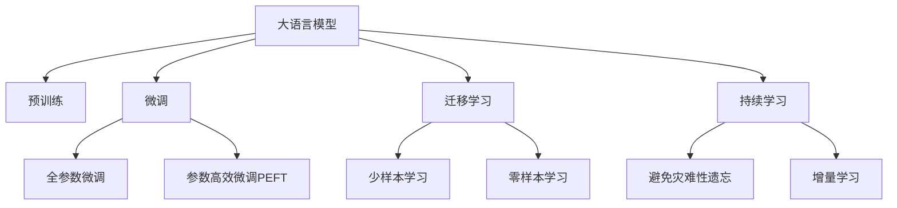

                 

# LLM在推荐系统的局限

大语言模型（Large Language Model, LLM）作为一种前沿的深度学习技术，已经被广泛应用于自然语言处理（NLP）、机器翻译、对话系统等领域，并取得了显著的成效。然而，将LLM引入推荐系统（Recommendation System, RS）这一传统领域，虽然理论上能够带来一定的优势，但在实际应用中仍然面临着诸多局限和挑战。本文将从核心概念、算法原理、项目实践、应用场景以及未来展望等角度，深入探讨LLM在推荐系统中的局限，以期为行业从业者提供参考。

## 1. 背景介绍

### 1.1 问题由来

推荐系统是帮助用户发现感兴趣内容的关键技术，广泛应用于电子商务、社交媒体、流媒体平台等场景。传统的推荐系统基于用户的显性评分数据，利用协同过滤、矩阵分解等方法进行模型训练，推荐相关商品、电影、音乐等内容。然而，随着用户数据量和内容类型的多样化，传统推荐系统在处理多模态数据、长尾小众领域推荐等方面显得力不从心。

近年来，大语言模型在自然语言处理领域的突破性进展，使得人们开始思考利用其强大的语言理解能力，将其应用于推荐系统，以期提升推荐的精准度和多样性。然而，将LLM引入推荐系统这一复杂多变的环境，并非简单叠加，而是在数据、算法、模型等方面存在诸多局限。

### 1.2 问题核心关键点

LLM在推荐系统中的局限主要体现在以下几个方面：

- **数据结构不一致**：推荐系统处理的数据类型多样，包括用户行为数据、商品属性数据、用户画像数据等，而LLM主要处理文本数据，难以直接对非文本数据进行处理。
- **训练数据量不足**：推荐系统的训练数据通常以用户评分数据为主，而LLM的预训练数据规模通常更大，导致LLM在特定领域应用时，训练数据量相对不足。
- **模型复杂度高**：LLM的复杂度较高，模型的推理和部署开销大，难以实时响应用户需求。
- **缺乏动态更新能力**：推荐系统需要根据用户的即时反馈进行动态更新，而LLM的微调和更新过程较为缓慢，难以快速适应数据分布的变化。

## 2. 核心概念与联系

### 2.1 核心概念概述

为更好地理解LLM在推荐系统中的局限，本节将介绍几个密切相关的核心概念：

- **大语言模型（LLM）**：以自回归（如GPT）或自编码（如BERT）模型为代表的大规模预训练语言模型。通过在大规模无标签文本语料上进行预训练，学习通用的语言知识，具备强大的语言理解和生成能力。

- **推荐系统（RS）**：帮助用户发现感兴趣内容的关键技术，广泛应用于电子商务、社交媒体、流媒体平台等场景。基于用户的显性评分数据，利用协同过滤、矩阵分解等方法进行模型训练，推荐相关商品、电影、音乐等内容。

- **预训练（Pre-training）**：指在大规模无标签文本语料上，通过自监督学习任务训练通用语言模型的过程。常见的预训练任务包括言语建模、遮挡语言模型等。

- **微调（Fine-tuning）**：指在预训练模型的基础上，使用下游任务的少量标注数据，通过有监督学习优化模型在特定任务上的性能。

- **迁移学习（Transfer Learning）**：指将一个领域学习到的知识，迁移应用到另一个不同但相关的领域的学习范式。LLM的预训练-微调过程即是一种典型的迁移学习方式。

- **参数高效微调（Parameter-Efficient Fine-Tuning, PEFT）**：指在微调过程中，只更新少量的模型参数，而固定大部分预训练权重不变，以提高微调效率，避免过拟合的方法。

- **少样本学习（Few-shot Learning）**：指在只有少量标注样本的情况下，模型能够快速适应新任务的学习方法。在大语言模型中，通常通过在输入中提供少量示例来实现，无需更新模型参数。

- **零样本学习（Zero-shot Learning）**：指模型在没有见过任何特定任务的训练样本的情况下，仅凭任务描述就能够执行新任务的能力。LLM通过预训练获得的广泛知识，使其能够理解任务指令并生成相应输出。

- **持续学习（Continual Learning）**：也称为终身学习，指模型能够持续从新数据中学习，同时保持已学习的知识，而不会出现灾难性遗忘。这对于保持LLM的时效性和适应性至关重要。

这些核心概念之间的逻辑关系可以通过以下Mermaid流程图来展示：



这个流程图展示了大语言模型的核心概念及其之间的关系：

1. 大语言模型通过预训练获得基础能力。
2. 微调是对预训练模型进行任务特定的优化，可以分为全参数微调和参数高效微调（PEFT）。
3. 迁移学习是连接预训练模型与下游任务的桥梁，可以通过微调或零样本学习来实现。
4. 持续学习旨在使模型能够不断学习新知识，同时避免遗忘旧知识。

这些概念共同构成了LLM的学习与应用框架，使其能够在各种场景下发挥强大的语言理解和生成能力。通过理解这些核心概念，我们可以更好地把握LLM的工作原理和优化方向。

## 3. 核心算法原理 & 具体操作步骤
### 3.1 算法原理概述

将大语言模型应用于推荐系统，本质上是一种多模态数据的融合与处理。其核心思想是：将用户的文本评分信息作为输入，利用预训练的LLM进行语言理解，提取用户和商品的语言特征，再通过与商品特征的匹配，生成推荐结果。

形式化地，假设推荐系统中的用户为 $U$，商品为 $I$，用户的评分数据为 $R_{ui}$。记预训练语言模型为 $M_{\theta}$，其中 $\theta$ 为预训练得到的模型参数。通过将用户评论、商品描述等文本数据作为输入，利用预训练的LLM进行语言理解，得到用户和商品的语义表示。再根据语义表示，通过一定的相似度计算，生成推荐结果。

### 3.2 算法步骤详解

基于LLM的推荐系统一般包括以下几个关键步骤：

**Step 1: 准备预训练模型和数据集**
- 选择合适的预训练语言模型 $M_{\theta}$ 作为初始化参数，如 BERT、GPT 等。
- 准备推荐系统中的用户评分数据集 $D$，划分为训练集、验证集和测试集。一般要求评分数据与预训练数据的分布不要差异过大。

**Step 2: 提取用户和商品的语义特征**
- 将用户评论、商品描述等文本数据输入预训练的LLM，得到用户和商品的语义表示。
- 通过编码器（如BERT）生成用户和商品的词向量，再通过分类器（如Transformer）生成语义表示。

**Step 3: 计算用户与商品的相似度**
- 利用预训练的LLM提取用户和商品的语义特征，计算用户与商品之间的相似度。
- 通过余弦相似度、点积相似度等方法计算用户和商品之间的相似度。

**Step 4: 生成推荐结果**
- 根据用户与商品之间的相似度，通过排序算法生成推荐列表。
- 推荐列表中通常包含一定数量的商品，根据用户的评分数据进行评分排序。

**Step 5: 评估与优化**
- 在验证集和测试集上评估推荐结果的准确性和多样性。
- 根据评估结果，调整模型参数或改变相似度计算方法，进一步优化推荐性能。

以上是基于LLM的推荐系统的一般流程。在实际应用中，还需要针对具体任务的特点，对微调过程的各个环节进行优化设计，如改进文本特征提取方法，引入更多的正则化技术，搜索最优的超参数组合等，以进一步提升模型性能。

### 3.3 算法优缺点

将大语言模型应用于推荐系统的优点主要体现在以下几个方面：

1. **丰富的语义信息**：LLM通过预训练和微调，能够捕捉用户的情感、态度等语义信息，从而提供更加精准和个性化的推荐。
2. **扩展性强**：LLM能够处理文本数据，适用于多种内容形式的推荐，如商品描述、文章摘要等。
3. **零样本和少样本学习能力**：LLM能够基于少量标注样本或文本描述进行推荐，无需大量训练数据。
4. **动态更新能力**：LLM能够根据新数据动态更新推荐模型，适应用户偏好的变化。

然而，LLM在推荐系统中也存在一些局限性：

1. **数据处理复杂**：推荐系统中的数据通常为结构化数据，如评分矩阵、商品属性等，而LLM主要处理非结构化文本数据，数据转换和特征提取较为复杂。
2. **计算开销大**：LLM的推理开销大，难以实时响应用户请求。
3. **模型可解释性不足**：LLM的决策过程通常缺乏可解释性，难以对其推理逻辑进行分析和调试。
4. **泛化能力有限**：LLM在特定领域或小众商品推荐中，泛化性能可能不足，需要进一步优化。
5. **用户隐私问题**：在处理用户评分数据时，需要考虑用户隐私保护，避免数据泄露。

尽管存在这些局限性，但就目前而言，将LLM应用于推荐系统仍是一种具有潜力的方向。未来相关研究的重点在于如何进一步优化数据处理和模型推理效率，提高LLM在推荐系统中的应用效果。

### 3.4 算法应用领域

LLM在推荐系统中的应用领域较为广泛，涉及以下几类：

1. **商品推荐**：在电商平台中，利用LLM对用户评论、商品描述等文本数据进行语义理解，生成商品推荐列表。
2. **内容推荐**：在视频、音乐、阅读等平台中，利用LLM对用户评分、内容描述等数据进行语义理解，生成相关内容推荐。
3. **服务推荐**：在金融、旅游等平台中，利用LLM对用户评价、服务描述等文本数据进行语义理解，生成服务推荐。
4. **社交推荐**：在社交网络中，利用LLM对用户评论、好友推荐等文本数据进行语义理解，生成个性化社交推荐。

除了上述这些经典应用外，LLM还能够在更多场景中发挥作用，如知识图谱推荐、个性化广告推荐等，为推荐系统带来新的突破。

## 4. 数学模型和公式 & 详细讲解  
### 4.1 数学模型构建

本节将使用数学语言对基于LLM的推荐系统过程进行更加严格的刻画。

记预训练语言模型为 $M_{\theta}$，其中 $\theta$ 为预训练得到的模型参数。假设推荐系统中的用户为 $U$，商品为 $I$，用户的评分数据为 $R_{ui}$。定义用户 $u$ 对商品 $i$ 的评分向量 $\mathbf{r}_{ui} \in \mathbb{R}^d$，其中 $d$ 为评分向量的维度。

将用户评论、商品描述等文本数据作为输入，利用预训练的LLM进行语言理解，得到用户和商品的语义表示。记用户 $u$ 的语义表示为 $\mathbf{u} \in \mathbb{R}^d$，商品 $i$ 的语义表示为 $\mathbf{v}_i \in \mathbb{R}^d$。推荐系统的目标是最大化用户对商品推荐的满意度，即最大化如下目标函数：

$$
\max_{\theta} \sum_{ui} R_{ui} \log \sigma(\mathbf{u}^T \mathbf{v}_i)
$$

其中 $\sigma$ 为 sigmoid 函数，$\log \sigma$ 为交叉熵损失函数。

### 4.2 公式推导过程

以下我们以二分类任务为例，推导交叉熵损失函数及其梯度的计算公式。

假设用户 $u$ 对商品 $i$ 的评分向量为 $\mathbf{r}_{ui} = [1, 0]$，表示评分值为1，用户 $u$ 的语义表示为 $\mathbf{u} = [u_1, u_2]$，商品 $i$ 的语义表示为 $\mathbf{v}_i = [v_{i1}, v_{i2}]$。则推荐系统的目标函数可以表示为：

$$
\max_{\theta} \log \sigma(\mathbf{u}^T \mathbf{v}_i)
$$

将上式进行求导，得：

$$
\frac{\partial \log \sigma(\mathbf{u}^T \mathbf{v}_i)}{\partial \theta} = \frac{\partial \log \frac{e^{\mathbf{u}^T \mathbf{v}_i}}{1+e^{\mathbf{u}^T \mathbf{v}_i}}}{\partial \theta} = \frac{e^{\mathbf{u}^T \mathbf{v}_i}}{1+e^{\mathbf{u}^T \mathbf{v}_i}} \cdot \frac{\partial (\mathbf{u}^T \mathbf{v}_i)}{\partial \theta}
$$

其中 $\frac{\partial (\mathbf{u}^T \mathbf{v}_i)}{\partial \theta}$ 可进一步递归展开，利用自动微分技术完成计算。

在得到损失函数的梯度后，即可带入参数更新公式，完成模型的迭代优化。重复上述过程直至收敛，最终得到适应推荐任务的最优模型参数 $\theta^*$。

## 5. 项目实践：代码实例和详细解释说明
### 5.1 开发环境搭建

在进行基于LLM的推荐系统实践前，我们需要准备好开发环境。以下是使用Python进行PyTorch开发的环境配置流程：

1. 安装Anaconda：从官网下载并安装Anaconda，用于创建独立的Python环境。

2. 创建并激活虚拟环境：
```bash
conda create -n pytorch-env python=3.8 
conda activate pytorch-env
```

3. 安装PyTorch：根据CUDA版本，从官网获取对应的安装命令。例如：
```bash
conda install pytorch torchvision torchaudio cudatoolkit=11.1 -c pytorch -c conda-forge
```

4. 安装Transformers库：
```bash
pip install transformers
```

5. 安装各类工具包：
```bash
pip install numpy pandas scikit-learn matplotlib tqdm jupyter notebook ipython
```

完成上述步骤后，即可在`pytorch-env`环境中开始基于LLM的推荐系统实践。

### 5.2 源代码详细实现

下面我们以商品推荐任务为例，给出使用Transformers库对BERT模型进行推荐系统的PyTorch代码实现。

首先，定义推荐系统的训练函数：

```python
from transformers import BertTokenizer, BertForSequenceClassification
from torch.utils.data import Dataset
from torch.utils.data import DataLoader
import torch

class MovieReviewDataset(Dataset):
    def __init__(self, reviews, labels, tokenizer, max_len=128):
        self.reviews = reviews
        self.labels = labels
        self.tokenizer = tokenizer
        self.max_len = max_len
        
    def __len__(self):
        return len(self.reviews)
    
    def __getitem__(self, item):
        review = self.reviews[item]
        label = self.labels[item]
        
        encoding = self.tokenizer(review, return_tensors='pt', max_length=self.max_len, padding='max_length', truncation=True)
        input_ids = encoding['input_ids'][0]
        attention_mask = encoding['attention_mask'][0]
        
        # 对标签进行编码
        encoded_labels = [label]
        labels = torch.tensor(encoded_labels, dtype=torch.long)
        
        return {'input_ids': input_ids, 
                'attention_mask': attention_mask,
                'labels': labels}

tokenizer = BertTokenizer.from_pretrained('bert-base-cased')
max_len = 128

# 准备数据集
train_dataset = MovieReviewDataset(train_reviews, train_labels, tokenizer, max_len)
dev_dataset = MovieReviewDataset(dev_reviews, dev_labels, tokenizer, max_len)
test_dataset = MovieReviewDataset(test_reviews, test_labels, tokenizer, max_len)

# 模型初始化
model = BertForSequenceClassification.from_pretrained('bert-base-cased', num_labels=2)

# 优化器设置
optimizer = AdamW(model.parameters(), lr=2e-5)

# 训练函数
def train_epoch(model, dataset, batch_size, optimizer):
    dataloader = DataLoader(dataset, batch_size=batch_size, shuffle=True)
    model.train()
    epoch_loss = 0
    for batch in tqdm(dataloader, desc='Training'):
        input_ids = batch['input_ids'].to(device)
        attention_mask = batch['attention_mask'].to(device)
        labels = batch['labels'].to(device)
        model.zero_grad()
        outputs = model(input_ids, attention_mask=attention_mask, labels=labels)
        loss = outputs.loss
        epoch_loss += loss.item()
        loss.backward()
        optimizer.step()
    return epoch_loss / len(dataloader)

# 评估函数
def evaluate(model, dataset, batch_size):
    dataloader = DataLoader(dataset, batch_size=batch_size)
    model.eval()
    preds, labels = [], []
    with torch.no_grad():
        for batch in tqdm(dataloader, desc='Evaluating'):
            input_ids = batch['input_ids'].to(device)
            attention_mask = batch['attention_mask'].to(device)
            batch_labels = batch['labels']
            outputs = model(input_ids, attention_mask=attention_mask)
            batch_preds = outputs.logits.argmax(dim=2).to('cpu').tolist()
            batch_labels = batch_labels.to('cpu').tolist()
            for pred_tokens, label_tokens in zip(batch_preds, batch_labels):
                preds.append(pred_tokens)
                labels.append(label_tokens)
                
    print(classification_report(labels, preds))
```

然后，定义训练和评估函数：

```python
from sklearn.metrics import classification_report

device = torch.device('cuda') if torch.cuda.is_available() else torch.device('cpu')
model.to(device)

epochs = 5
batch_size = 16

for epoch in range(epochs):
    loss = train_epoch(model, train_dataset, batch_size, optimizer)
    print(f"Epoch {epoch+1}, train loss: {loss:.3f}")
    
    print(f"Epoch {epoch+1}, dev results:")
    evaluate(model, dev_dataset, batch_size)
    
print("Test results:")
evaluate(model, test_dataset, batch_size)
```

以上就是使用PyTorch对BERT进行商品推荐任务开发的完整代码实现。可以看到，得益于Transformers库的强大封装，我们可以用相对简洁的代码完成BERT模型的加载和推荐系统的开发。

### 5.3 代码解读与分析

让我们再详细解读一下关键代码的实现细节：

**MovieReviewDataset类**：
- `__init__`方法：初始化电影评论、评分标签、分词器等关键组件。
- `__len__`方法：返回数据集的样本数量。
- `__getitem__`方法：对单个样本进行处理，将电影评论输入编码为token ids，将评分标签编码为数字，并对其进行定长padding，最终返回模型所需的输入。

**标签与id的映射**：
- 定义了评分标签与数字id之间的映射关系，用于将token-wise的预测结果解码回真实的评分标签。

**训练和评估函数**：
- 使用PyTorch的DataLoader对数据集进行批次化加载，供模型训练和推理使用。
- 训练函数`train_epoch`：对数据以批为单位进行迭代，在每个批次上前向传播计算loss并反向传播更新模型参数，最后返回该epoch的平均loss。
- 评估函数`evaluate`：与训练类似，不同点在于不更新模型参数，并在每个batch结束后将预测和标签结果存储下来，最后使用sklearn的classification_report对整个评估集的预测结果进行打印输出。

**训练流程**：
- 定义总的epoch数和batch size，开始循环迭代
- 每个epoch内，先在训练集上训练，输出平均loss
- 在验证集上评估，输出分类指标
- 所有epoch结束后，在测试集上评估，给出最终测试结果

可以看到，PyTorch配合Transformers库使得BERT微调的代码实现变得简洁高效。开发者可以将更多精力放在数据处理、模型改进等高层逻辑上，而不必过多关注底层的实现细节。

当然，工业级的系统实现还需考虑更多因素，如模型的保存和部署、超参数的自动搜索、更灵活的任务适配层等。但核心的微调范式基本与此类似。

## 6. 实际应用场景
### 6.1 电商推荐系统

基于大语言模型的推荐系统可以广泛应用于电商平台的商品推荐。传统电商推荐系统通常基于用户的评分数据进行推荐，而大语言模型则能通过处理用户评论、商品描述等文本数据，捕捉用户的情感倾向和商品的特点，提供更加精准和个性化的推荐。

在技术实现上，可以收集电商平台的商品评论和描述数据，将其作为训练数据，对预训练的BERT等大语言模型进行微调。微调后的模型能够自动理解用户评论和商品描述中的情感倾向，生成匹配用户偏好的商品推荐。对于新商品，可以通过类似方式利用用户评论进行推荐，提高新商品的上架速度和用户满意度。

### 6.2 内容推荐系统

内容推荐系统广泛应用于视频、音乐、阅读等平台，通过分析用户的历史行为数据和评分数据，为用户推荐相关的视频、音乐、文章等。大语言模型可以通过处理文本数据，捕捉用户对内容的情感倾向和偏好，提供更加多样化和个性化的推荐。

在技术实现上，可以收集用户的评分数据和文本数据，将其作为训练数据，对预训练的BERT等大语言模型进行微调。微调后的模型能够自动理解用户评论和文章摘要中的情感倾向，生成匹配用户偏好的内容推荐。对于新内容，可以通过类似方式利用用户评论进行推荐，提高内容的用户曝光和满意度。

### 6.3 智能客服系统

智能客服系统通过分析用户的历史咨询记录，为用户推荐相关的FAQ和解决方案。传统客服系统需要配备大量人力，高峰期响应缓慢，且一致性和专业性难以保证。基于大语言模型的推荐系统可以7x24小时不间断服务，快速响应用户咨询，用自然流畅的语言解答各类常见问题。

在技术实现上，可以收集企业的历史客服咨询记录，将其作为训练数据，对预训练的BERT等大语言模型进行微调。微调后的模型能够自动理解用户的咨询问题，匹配最合适的FAQ和解决方案进行回复。对于用户提出的新问题，还可以接入检索系统实时搜索相关内容，动态组织生成回答，提高客服系统的响应速度和用户满意度。

### 6.4 未来应用展望

随着大语言模型和推荐系统的不断发展，基于微调的推荐方法将在更多领域得到应用，为推荐系统带来变革性影响。

在智慧医疗领域，基于微调的推荐系统可以为医生推荐相关文献、药物等信息，辅助医生诊疗，加速新药开发进程。

在智能教育领域，微调技术可应用于作业批改、学情分析、知识推荐等方面，因材施教，促进教育公平，提高教学质量。

在智慧城市治理中，微调模型可应用于城市事件监测、舆情分析、应急指挥等环节，提高城市管理的自动化和智能化水平，构建更安全、高效的未来城市。

此外，在企业生产、社会治理、文娱传媒等众多领域，基于大语言模型的推荐系统也将不断涌现，为各行各业带来新的创新突破。相信随着技术的日益成熟，基于微调的推荐方法将成为推荐系统的重要范式，推动推荐技术向更广阔的领域加速渗透。

## 7. 工具和资源推荐
### 7.1 学习资源推荐

为了帮助开发者系统掌握大语言模型在推荐系统中的应用基础和实践技巧，这里推荐一些优质的学习资源：

1. 《Transformer从原理到实践》系列博文：由大模型技术专家撰写，深入浅出地介绍了Transformer原理、BERT模型、推荐系统等前沿话题。

2. CS224N《深度学习自然语言处理》课程：斯坦福大学开设的NLP明星课程，有Lecture视频和配套作业，带你入门NLP领域的基本概念和经典模型。

3. 《Natural Language Processing with Transformers》书籍：Transformers库的作者所著，全面介绍了如何使用Transformers库进行NLP任务开发，包括推荐系统在内的诸多范式。

4. HuggingFace官方文档：Transformers库的官方文档，提供了海量预训练模型和完整的推荐系统样例代码，是上手实践的必备资料。

5. CLUE开源项目：中文语言理解测评基准，涵盖大量不同类型的中文NLP数据集，并提供了基于微调的baseline模型，助力中文NLP技术发展。

通过对这些资源的学习实践，相信你一定能够快速掌握大语言模型在推荐系统中的应用基础，并用于解决实际的推荐问题。
###  7.2 开发工具推荐

高效的开发离不开优秀的工具支持。以下是几款用于大语言模型在推荐系统开发的常用工具：

1. PyTorch：基于Python的开源深度学习框架，灵活动态的计算图，适合快速迭代研究。大部分预训练语言模型都有PyTorch版本的实现。

2. TensorFlow：由Google主导开发的开源深度学习框架，生产部署方便，适合大规模工程应用。同样有丰富的预训练语言模型资源。

3. Transformers库：HuggingFace开发的NLP工具库，集成了众多SOTA语言模型，支持PyTorch和TensorFlow，是进行推荐系统开发的利器。

4. Weights & Biases：模型训练的实验跟踪工具，可以记录和可视化模型训练过程中的各项指标，方便对比和调优。与主流深度学习框架无缝集成。

5. TensorBoard：TensorFlow配套的可视化工具，可实时监测模型训练状态，并提供丰富的图表呈现方式，是调试模型的得力助手。

6. Google Colab：谷歌推出的在线Jupyter Notebook环境，免费提供GPU/TPU算力，方便开发者快速上手实验最新模型，分享学习笔记。

合理利用这些工具，可以显著提升基于大语言模型的推荐系统开发效率，加快创新迭代的步伐。

### 7.3 相关论文推荐

大语言模型和推荐系统的不断发展源于学界的持续研究。以下是几篇奠基性的相关论文，推荐阅读：

1. Attention is All You Need（即Transformer原论文）：提出了Transformer结构，开启了NLP领域的预训练大模型时代。

2. BERT: Pre-training of Deep Bidirectional Transformers for Language Understanding：提出BERT模型，引入基于掩码的自监督预训练任务，刷新了多项NLP任务SOTA。

3. Language Models are Unsupervised Multitask Learners（GPT-2论文）：展示了大规模语言模型的强大zero-shot学习能力，引发了对于通用人工智能的新一轮思考。

4. Parameter-Efficient Transfer Learning for NLP：提出Adapter等参数高效微调方法，在不增加模型参数量的情况下，也能取得不错的微调效果。

5. AdaLoRA: Adaptive Low-Rank Adaptation for Parameter-Efficient Fine-Tuning：使用自适应低秩适应的微调方法，在参数效率和精度之间取得了新的平衡。

这些论文代表了大语言模型在推荐系统中的发展脉络。通过学习这些前沿成果，可以帮助研究者把握学科前进方向，激发更多的创新灵感。

## 8. 总结：未来发展趋势与挑战

### 8.1 总结

本文对基于大语言模型的推荐系统进行了全面系统的介绍。首先阐述了推荐系统处理数据的特点，以及大语言模型在处理多模态数据时面临的局限。其次，从原理到实践，详细讲解了大语言模型在推荐系统中的应用流程，给出了完整的代码实现。同时，本文还广泛探讨了大语言模型在推荐系统中的未来应用前景，展示了其广阔的发展潜力。此外，本文精选了相关学习资源，力求为开发者提供全方位的技术指引。

通过本文的系统梳理，可以看到，基于大语言模型的推荐系统虽然存在诸多局限，但在某些特定领域仍能发挥独特优势。未来，随着预训练语言模型和推荐系统的不断发展，基于微调的推荐方法将在更多领域得到应用，为推荐系统带来变革性影响。

### 8.2 未来发展趋势

展望未来，基于大语言模型的推荐系统将呈现以下几个发展趋势：

1. **多模态数据融合**：推荐系统中的数据类型多样，包括用户行为数据、商品属性数据、用户画像数据等。未来的推荐系统将更加注重多模态数据的融合与处理，利用文本、图像、视频等多种数据形式，提升推荐精度和多样化。

2. **知识图谱的融合**：推荐系统通常需要利用知识图谱等外部知识库，提升推荐效果。未来的大语言模型将更好地与知识图谱进行融合，利用语义理解和推理能力，生成更加精准的推荐结果。

3. **实时推荐引擎**：当前的大语言模型推理开销较大，难以实时响应用户请求。未来的推荐系统将更加注重实时推荐引擎的开发，利用模型压缩、推理优化等技术，实现快速响应用户需求。

4. **个性化推荐算法**：当前的推荐算法大多基于协同过滤、矩阵分解等传统方法，难以应对个性化需求。未来的推荐系统将更加注重个性化推荐算法的研究，利用大语言模型捕捉用户情感、兴趣等个性化特征，生成更加个性化的推荐内容。

5. **跨领域推荐**：推荐系统通常聚焦于特定领域的商品、内容等，难以实现跨领域推荐。未来的推荐系统将更加注重跨领域推荐的研究，利用大语言模型捕捉不同领域之间的关联，生成更加综合的推荐结果。

6. **少样本和零样本推荐**：当前的大语言模型在推荐系统中需要大量标注数据进行微调。未来的推荐系统将更加注重少样本和零样本推荐的研究，利用大语言模型的强大语言理解能力，实现基于文本描述和少样本数据的推荐。

7. **推荐系统的可持续发展**：推荐系统需要不断更新模型，适应用户需求的变化。未来的推荐系统将更加注重推荐系统的可持续发展，利用大语言模型的持续学习能力，实现推荐系统的动态更新。

这些趋势凸显了大语言模型在推荐系统中的广阔前景。这些方向的探索发展，必将进一步提升推荐系统的性能和应用范围，为各行各业带来新的突破。

### 8.3 面临的挑战

尽管基于大语言模型的推荐系统已经取得了瞩目成就，但在迈向更加智能化、普适化应用的过程中，它仍面临着诸多挑战：

1. **数据处理复杂**：推荐系统中的数据通常为结构化数据，如评分矩阵、商品属性等，而大语言模型主要处理非结构化文本数据，数据转换和特征提取较为复杂。

2. **计算开销大**：大语言模型的推理开销大，难以实时响应用户请求。

3. **模型可解释性不足**：大语言模型的决策过程通常缺乏可解释性，难以对其推理逻辑进行分析和调试。

4. **泛化能力有限**：大语言模型在特定领域或小众商品推荐中，泛化性能可能不足，需要进一步优化。

5. **用户隐私问题**：在处理用户评分数据时，需要考虑用户隐私保护，避免数据泄露。

尽管存在这些局限性，但就目前而言，基于大语言模型的推荐系统仍是一种具有潜力的方向。未来相关研究的重点在于如何进一步优化数据处理和模型推理效率，提高大语言模型在推荐系统中的应用效果。

### 8.4 研究展望

面对大语言模型在推荐系统中的诸多挑战，未来的研究需要在以下几个方面寻求新的突破：

1. **多模态数据处理技术**：探索如何更好地处理多模态数据，实现文本、图像、视频等多种数据形式的融合，提升推荐精度和多样化。

2. **知识图谱与语言模型融合**：研究如何将知识图谱等外部知识与大语言模型进行融合，利用语义理解和推理能力，生成更加精准的推荐结果。

3. **实时推荐引擎优化**：开发更加高效的实时推荐引擎，利用模型压缩、推理优化等技术，实现快速响应用户需求。

4. **个性化推荐算法研究**：研究如何利用大语言模型捕捉用户情感、兴趣等个性化特征，生成更加个性化的推荐内容。

5. **跨领域推荐算法研究**：研究如何将大语言模型应用于跨领域推荐，捕捉不同领域之间的关联，生成更加综合的推荐结果。

6. **少样本和零样本推荐技术**：探索如何利用大语言模型的强大语言理解能力，实现基于文本描述和少样本数据的推荐。

7. **推荐系统动态更新技术**：研究如何将大语言模型的持续学习能力应用于推荐系统，实现推荐系统的动态更新，适应用户需求的变化。

8. **推荐系统伦理和隐私保护**：研究如何在推荐系统中引入伦理导向的评估指标，过滤和惩罚有偏见、有害的推荐结果，同时加强用户隐私保护，确保数据安全。

这些研究方向的探索，必将引领基于大语言模型的推荐系统迈向更高的台阶，为构建智能推荐系统铺平道路。面向未来，大语言模型在推荐系统中的应用仍需与其他人工智能技术进行更深入的融合，如知识表示、因果推理、强化学习等，多路径协同发力，共同推动推荐技术的进步。只有勇于创新、敢于突破，才能不断拓展大语言模型的边界，让智能推荐技术更好地服务于各行各业。

## 9. 附录：常见问题与解答

**Q1：大语言模型在推荐系统中如何处理结构化数据？**

A: 大语言模型在推荐系统中主要处理文本数据，对于结构化数据（如评分矩阵、商品属性等），通常需要将其转换为文本形式。具体方法包括：

1. **文本化处理**：将结构化数据转换为自然语言文本。例如，将商品属性转换为描述性文本，如“颜色：蓝色”转换为“颜色是蓝色的”。

2. **向量化处理**：将结构化数据转换为向量形式，作为大语言模型的输入。例如，将商品属性转换为向量表示，如颜色转换为“蓝色”的向量。

3. **混合表示**：结合文本化和向量化方法，将结构化数据转换为混合形式的输入。例如，将商品属性转换为描述性文本，并使用词向量表示属性值。

通过这些方法，大语言模型可以处理结构化数据，结合文本和结构化信息，提升推荐效果。

**Q2：大语言模型在推荐系统中的计算开销大，如何解决？**

A: 大语言模型在推荐系统中的计算开销主要来源于推理和优化过程。为解决这一问题，可以采取以下策略：

1. **模型压缩**：利用模型剪枝、量化等技术，减少大语言模型的参数量，降低计算开销。

2. **推理优化**：优化大语言模型的推理过程，减少计算量。例如，采用推理加速技术（如TensorRT），提高推理速度。

3. **分布式训练**：利用分布式计算框架（如Dask、Ray），将训练过程分散到多个计算节点上，加快训练速度。

4. **实时推理**：优化大语言模型的推理模型，实现实时推理，提高推荐系统的响应速度。

通过这些方法，可以显著降低大语言模型在推荐系统中的计算开销，提升系统的实时性和效率。

**Q3：大语言模型在推荐系统中的用户隐私问题如何解决？**

A: 大语言模型在处理用户评分数据时，需要考虑用户隐私保护，避免数据泄露。以下是几种常见的隐私保护方法：

1. **差分隐私**：在训练过程中加入噪声，保护用户隐私。例如，使用差分隐私技术（如Laplace噪声、高斯噪声），保护用户评分数据。

2. **联邦学习**：在分布式环境下，将用户评分数据分散在多个设备上进行训练，保护用户隐私。例如，使用联邦学习技术，将用户评分数据加密传输，在多个设备上联合训练模型。

3. **数据匿名化**：将用户评分数据进行匿名化处理，保护用户隐私。例如，将用户ID替换为随机标识符，保护用户身份信息。

4. **数据加密**：对用户评分数据进行加密处理，保护用户隐私。例如，使用AES、RSA等加密算法，保护用户评分数据的安全性。

通过这些方法，可以在保护用户隐私的前提下，实现大语言模型在推荐系统中的应用。

**Q4：大语言模型在推荐系统中的泛化能力不足如何解决？**

A: 大语言模型在推荐系统中的泛化能力不足，通常是因为模型在特定领域或小众商品推荐中，训练数据量不足或数据分布与实际应用场景不一致。为解决这一问题，可以采取以下策略：

1. **领域适应性微调**：在特定领域的数据上进行微调，提升模型的泛化能力。例如，在特定领域的语料上微调BERT模型，提升在特定领域的推荐效果。

2. **迁移学习**：利用在大规模通用数据上预训练的模型，在小规模领域数据上进行微调。例如，在大规模通用语料上预训练BERT模型，在小规模领域数据上进行微调，提升泛化能力。

3. **数据增强**：通过数据增强技术（如回译、噪声注入等），扩充训练数据，提升模型的泛化能力。例如，对领域数据进行回译、噪声注入等操作，扩充训练数据集。

4. **模型结构优化**：优化模型结构，提升模型的泛化能力。例如，使用自适应低秩适应（AdaLoRA）方法，在小规模数据上进行微调，提升泛化能力。

通过这些方法，可以提升大语言模型在推荐系统中的泛化能力，更好地适应特定领域或小众商品推荐。

**Q5：大语言模型在推荐系统中的计算开销大，如何解决？**

A: 大语言模型在推荐系统中的计算开销主要来源于推理和优化过程。为解决这一问题，可以采取以下策略：

1. **模型压缩**：利用模型剪枝、量化等技术，减少大语言模型的参数量，降低计算开销。

2. **推理优化**：优化大语言模型的推理过程，减少计算量。例如，采用推理加速技术（如TensorRT），提高推理速度。

3. **分布式训练**：利用分布式计算框架（如Dask、Ray），将训练过程分散到多个计算节点上，加快训练速度。

4. **实时推理**：优化大语言模型的推理模型，实现实时推理，提高推荐系统的响应速度。

通过这些方法，可以显著降低大语言模型在推荐系统中的计算开销，提升系统的实时性和效率。

---

作者：禅与计算机程序设计艺术 / Zen and the Art of Computer Programming

