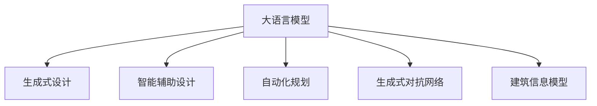

                 

# LLM在智能建筑设计中的潜在作用

> 关键词：人工智能,智能建筑,生成式设计,自动化设计,智能辅助设计,建筑信息模型(BIM),自动化规划,生成式对抗网络(GAN)

## 1. 背景介绍

随着人工智能技术的迅速发展，智能建筑设计正成为现代建筑行业的新趋势。智能建筑设计结合了人工智能、物联网、云计算等前沿技术，通过智能化的设计、规划和管理，提高建筑设计的效率、质量和可持续性。而语言模型在智能建筑设计中扮演着重要角色，通过自然语言处理技术，智能建筑设计得以实现自动化的生成式设计和智能辅助设计。本文将探讨大语言模型(LLM)在智能建筑设计中的潜在作用。

### 1.1 问题由来

在传统建筑设计过程中，设计人员需要耗费大量时间和精力，进行多轮方案迭代，以确保设计方案满足客户需求和建筑标准。随着AI技术的发展，智能建筑设计正逐步取代人工设计，通过智能化的辅助设计、自动化的生成式设计和智能化的规划，大幅提升设计效率和质量。其中，大语言模型作为智能建筑设计的关键技术之一，正逐渐成为推动行业进步的重要力量。

### 1.2 问题核心关键点

大语言模型在智能建筑设计中的关键作用包括：

1. **生成式设计**：通过大语言模型的自然语言生成能力，能够自动生成设计方案，实现快速迭代和优化。
2. **智能辅助设计**：大语言模型可以提供实时反馈，辅助设计师进行设计决策，提高设计效率。
3. **自动化规划**：大语言模型可以进行自动化规划和调度，优化资源配置和设计流程。
4. **生成式对抗网络(GAN)**：结合GAN技术，大语言模型可以实现更加逼真和多样化的生成式设计。
5. **建筑信息模型(BIM)**：大语言模型能够整合和处理BIM数据，实现智能化的建筑管理和优化。

## 2. 核心概念与联系

### 2.1 核心概念概述

本节将介绍几个与大语言模型在智能建筑设计中潜在作用密切相关的核心概念：

1. **大语言模型(LLM)**：指使用深度学习技术训练的模型，能够理解和生成人类语言，广泛应用于自然语言处理、文本生成、机器翻译等领域。

2. **生成式设计**：指通过智能算法自动生成设计方案，进行设计迭代和优化的过程。

3. **智能辅助设计**：指利用人工智能技术辅助设计师进行方案设计、渲染、修改等操作，提高设计效率和质量。

4. **自动化规划**：指利用智能算法进行自动化规划和调度，优化资源配置和设计流程。

5. **生成式对抗网络(GAN)**：指由生成器和判别器两部分组成的神经网络模型，能够生成高质量的图像、音频和视频等。

6. **建筑信息模型(BIM)**：指通过数字化的方式，整合建筑全生命周期的信息，实现建筑设计和管理的智能化。

这些核心概念之间的逻辑关系可以通过以下Mermaid流程图来展示：



这个流程图展示了大语言模型的核心概念及其之间的关系：

1. 大语言模型通过自然语言处理技术，实现生成式设计、智能辅助设计、自动化规划等功能。
2. 生成式设计和大语言模型通过自动生成设计方案，提高设计效率和质量。
3. 智能辅助设计和大语言模型通过实时反馈和指导，辅助设计师进行设计决策。
4. 自动化规划和大语言模型通过优化资源配置和设计流程，提升设计效率。
5. 生成式对抗网络和大语言模型通过生成高质量的图像和视频，丰富设计表达。
6. 建筑信息模型和大语言模型通过整合和处理建筑数据，实现智能化的建筑管理和优化。

## 3. 核心算法原理 & 具体操作步骤

### 3.1 算法原理概述

大语言模型在智能建筑设计中的核心算法原理主要基于自然语言处理和生成式设计技术，通过自然语言描述，自动生成和优化设计方案。具体来说，大语言模型利用预训练的语言模型，通过微调的方式，使其具备特定的设计能力。设计人员可以向大语言模型输入设计要求和约束条件，大语言模型即可自动生成设计方案，并进行优化和迭代。

### 3.2 算法步骤详解

基于大语言模型的智能建筑设计一般包括以下几个关键步骤：

**Step 1: 准备预训练模型和数据集**
- 选择合适的预训练语言模型，如GPT、BERT等，作为初始化参数。
- 准备设计任务的相关语料库和设计要求，作为微调的监督数据。

**Step 2: 添加任务适配层**
- 在预训练语言模型顶层设计合适的输出层，根据设计任务需求，选择生成式设计或智能辅助设计功能。
- 对于生成式设计，通常使用生成式对抗网络(GAN)进行优化。
- 对于智能辅助设计，通常使用序列到序列模型或注意力机制进行设计反馈。

**Step 3: 设置微调超参数**
- 选择合适的优化算法及其参数，如Adam、SGD等，设置学习率、批大小、迭代轮数等。
- 设置正则化技术及强度，包括权重衰减、Dropout、Early Stopping等。
- 确定冻结预训练参数的策略，如仅微调顶层，或全部参数都参与微调。

**Step 4: 执行梯度训练**
- 将设计要求和约束条件作为输入，前向传播计算设计方案。
- 反向传播计算参数梯度，根据设定的优化算法和学习率更新模型参数。
- 周期性在验证集上评估设计方案的合理性和质量，根据性能指标决定是否触发Early Stopping。
- 重复上述步骤直至满足预设的迭代轮数或Early Stopping条件。

**Step 5: 测试和部署**
- 在测试集上评估微调后模型生成的设计方案，对比微调前后的设计效果。
- 使用微调后的模型对新设计任务进行推理预测，集成到实际的设计系统中。
- 持续收集新的设计任务数据，定期重新微调模型，以适应设计任务的变化。

### 3.3 算法优缺点

基于大语言模型的智能建筑设计方法具有以下优点：
1. **高效性**：自动生成设计方案，大幅提升设计效率和速度。
2. **丰富性**：通过自然语言描述，能够实现多样化和逼真的设计表达。
3. **可扩展性**：能够处理多种设计任务，易于扩展和适配新设计要求。
4. **智能化**：能够实时提供设计反馈和优化建议，辅助设计师进行决策。
5. **灵活性**：能够与各种设计工具和平台进行集成，实现智能化设计流程。

同时，该方法也存在一定的局限性：
1. **依赖数据质量**：设计要求的描述质量和精度直接影响设计效果，需要高质量的数据输入。
2. **模型鲁棒性**：设计要求的多样性和复杂性可能导致模型性能不稳定，需要进行多次迭代优化。
3. **资源消耗**：大语言模型的计算资源消耗较大，需要高性能的计算设备。
4. **设计理解**：设计要求和约束条件的复杂性可能导致模型难以完全理解设计意图，需要进行人工干预和调整。
5. **模型泛化**：模型的泛化能力可能有限，对于新的设计任务可能需要重新训练和微调。

尽管存在这些局限性，但就目前而言，基于大语言模型的智能建筑设计方法仍是大规模设计任务的重要手段。未来相关研究的重点在于如何进一步提高模型的鲁棒性和泛化能力，降低对数据质量和计算资源的需求。

### 3.4 算法应用领域

大语言模型在智能建筑设计中的应用领域包括：

1. **室内设计**：自动生成室内设计方案，进行家具布局、装饰风格、色彩搭配等优化。
2. **景观设计**：自动生成景观设计方案，进行植物配置、地形规划、水景设计等优化。
3. **建筑设计**：自动生成建筑设计方案，进行建筑风格、结构设计、功能布局等优化。
4. **城市规划**：自动生成城市规划方案，进行交通规划、公共设施布局、绿地设计等优化。
5. **室内外空间规划**：自动生成室内外空间规划方案，进行空间结构、布局优化、功能整合等优化。
6. **智能家居设计**：自动生成智能家居设计方案，进行智能家居设备的布局和功能整合。

这些应用领域展示了大语言模型在智能建筑设计中的广泛适用性，未来还将拓展到更多复杂的设计任务中，为建筑行业的智能化转型提供新的解决方案。

## 4. 数学模型和公式 & 详细讲解 & 举例说明

### 4.1 数学模型构建

本节将使用数学语言对大语言模型在智能建筑设计中的应用进行更加严格的刻画。

设设计任务为 $T$，设计要求和约束条件为 $\mathcal{D}$，预训练语言模型为 $M_{\theta}$，其中 $\theta$ 为模型参数。假设设计任务 $T$ 的监督数据集为 $D=\{(x_i,y_i)\}_{i=1}^N, x_i \in \mathcal{X}, y_i \in \mathcal{Y}$。

定义设计任务 $T$ 的设计方案为 $y=f(x)$，其中 $x$ 为设计要求和约束条件，$f$ 为设计函数，表示设计方案生成的过程。在微调过程中，设计任务 $T$ 的设计方案可以表示为：

$$
y=\mathop{\arg\min}_{x} \mathcal{L}(M_{\theta}(x),y)
$$

其中 $\mathcal{L}$ 为设计任务 $T$ 的设计损失函数，用于衡量模型生成设计方案的准确性和合理性。设计损失函数通常包括多目标优化函数，如设计效果、功能性、美观性等。

### 4.2 公式推导过程

以下我们以室内设计任务为例，推导设计方案生成的数学模型。

设室内设计任务 $T$ 的设计要求和约束条件为 $x$，设计方案为 $y$。假设设计方案 $y$ 由大语言模型自动生成，生成过程可以表示为：

$$
y=f(x)=M_{\theta}(x)
$$

其中 $M_{\theta}$ 为预训练语言模型，$f$ 为设计生成函数。设计方案 $y$ 需要满足一定的设计要求和约束条件 $x$，可以表示为：

$$
g(y)=0
$$

其中 $g$ 为设计约束函数，表示设计方案满足设计要求和约束条件的条件。设计任务 $T$ 的设计损失函数 $\mathcal{L}$ 可以表示为：

$$
\mathcal{L}(M_{\theta}(x),y)=\lambda\mathcal{L}_{fit}(M_{\theta}(x),y)+(1-\lambda)\mathcal{L}_{constraint}(g(y))
$$

其中 $\mathcal{L}_{fit}$ 为设计效果损失函数，$\mathcal{L}_{constraint}$ 为设计约束损失函数，$\lambda$ 为设计效果和设计约束的权重。

在得到设计损失函数 $\mathcal{L}$ 后，即可带入参数更新公式，完成模型的迭代优化。重复上述过程直至满足预设的迭代轮数或设计效果满足要求。

### 4.3 案例分析与讲解

假设设计任务为室内设计，设计要求为空间面积 $x_1$、家具摆放位置 $x_2$、装饰风格 $x_3$，设计方案为家具布局、装饰风格、色彩搭配等。使用大语言模型自动生成设计方案的过程如下：

1. 设计人员输入设计要求 $x=(120,3,欧式)$，其中 $120$ 表示空间面积为 $120m^2$，$3$ 表示家具摆放数量为 $3$，欧式表示装饰风格。
2. 大语言模型根据设计要求和约束条件，自动生成设计方案 $y=(x1,y1,x2,y2,x3,y3)$，其中 $x1,x2,x3$ 表示家具布局，$y1,y2,y3$ 表示装饰风格、色彩搭配等。
3. 设计方案需要满足设计要求和约束条件，大语言模型通过设计约束函数 $g(y)=0$ 进行约束检查。
4. 设计效果需要满足设计要求和约束条件，大语言模型通过设计效果损失函数 $\mathcal{L}_{fit}$ 进行优化。
5. 设计任务 $T$ 的设计损失函数 $\mathcal{L}(M_{\theta}(x),y)$ 用于衡量设计方案的合理性和质量。
6. 通过梯度下降等优化算法，微调大语言模型，使其生成符合设计要求和约束条件的设计方案。

这个案例展示了大语言模型在智能建筑设计中的工作流程和应用场景，通过自然语言描述，自动生成设计方案，并满足设计要求和约束条件，实现智能化设计。

## 5. 项目实践：代码实例和详细解释说明

### 5.1 开发环境搭建

在进行智能建筑设计项目实践前，我们需要准备好开发环境。以下是使用Python进行PyTorch开发的环境配置流程：

1. 安装Anaconda：从官网下载并安装Anaconda，用于创建独立的Python环境。

2. 创建并激活虚拟环境：
```bash
conda create -n pytorch-env python=3.8 
conda activate pytorch-env
```

3. 安装PyTorch：根据CUDA版本，从官网获取对应的安装命令。例如：
```bash
conda install pytorch torchvision torchaudio cudatoolkit=11.1 -c pytorch -c conda-forge
```

4. 安装Transformers库：
```bash
pip install transformers
```

5. 安装各类工具包：
```bash
pip install numpy pandas scikit-learn matplotlib tqdm jupyter notebook ipython
```

完成上述步骤后，即可在`pytorch-env`环境中开始智能建筑设计项目实践。

### 5.2 源代码详细实现

下面我们以室内设计任务为例，给出使用Transformers库对BERT模型进行智能建筑设计微调的PyTorch代码实现。

首先，定义室内设计任务的数据处理函数：

```python
from transformers import BertTokenizer
from torch.utils.data import Dataset
import torch

class RoomDesignDataset(Dataset):
    def __init__(self, texts, tags, tokenizer, max_len=128):
        self.texts = texts
        self.tags = tags
        self.tokenizer = tokenizer
        self.max_len = max_len
        
    def __len__(self):
        return len(self.texts)
    
    def __getitem__(self, item):
        text = self.texts[item]
        tags = self.tags[item]
        
        encoding = self.tokenizer(text, return_tensors='pt', max_length=self.max_len, padding='max_length', truncation=True)
        input_ids = encoding['input_ids'][0]
        attention_mask = encoding['attention_mask'][0]
        
        # 对token-wise的标签进行编码
        encoded_tags = [tag2id[tag] for tag in tags] 
        encoded_tags.extend([tag2id['O']] * (self.max_len - len(encoded_tags)))
        labels = torch.tensor(encoded_tags, dtype=torch.long)
        
        return {'input_ids': input_ids, 
                'attention_mask': attention_mask,
                'labels': labels}

# 标签与id的映射
tag2id = {'O': 0, 'furniture1': 1, 'furniture2': 2, 'furniture3': 3, 'decor1': 4, 'decor2': 5, 'decor3': 6}
id2tag = {v: k for k, v in tag2id.items()}

# 创建dataset
tokenizer = BertTokenizer.from_pretrained('bert-base-cased')

train_dataset = RoomDesignDataset(train_texts, train_tags, tokenizer)
dev_dataset = RoomDesignDataset(dev_texts, dev_tags, tokenizer)
test_dataset = RoomDesignDataset(test_texts, test_tags, tokenizer)
```

然后，定义模型和优化器：

```python
from transformers import BertForTokenClassification, AdamW

model = BertForTokenClassification.from_pretrained('bert-base-cased', num_labels=len(tag2id))

optimizer = AdamW(model.parameters(), lr=2e-5)
```

接着，定义训练和评估函数：

```python
from torch.utils.data import DataLoader
from tqdm import tqdm
from sklearn.metrics import classification_report

device = torch.device('cuda') if torch.cuda.is_available() else torch.device('cpu')
model.to(device)

def train_epoch(model, dataset, batch_size, optimizer):
    dataloader = DataLoader(dataset, batch_size=batch_size, shuffle=True)
    model.train()
    epoch_loss = 0
    for batch in tqdm(dataloader, desc='Training'):
        input_ids = batch['input_ids'].to(device)
        attention_mask = batch['attention_mask'].to(device)
        labels = batch['labels'].to(device)
        model.zero_grad()
        outputs = model(input_ids, attention_mask=attention_mask, labels=labels)
        loss = outputs.loss
        epoch_loss += loss.item()
        loss.backward()
        optimizer.step()
    return epoch_loss / len(dataloader)

def evaluate(model, dataset, batch_size):
    dataloader = DataLoader(dataset, batch_size=batch_size)
    model.eval()
    preds, labels = [], []
    with torch.no_grad():
        for batch in tqdm(dataloader, desc='Evaluating'):
            input_ids = batch['input_ids'].to(device)
            attention_mask = batch['attention_mask'].to(device)
            batch_labels = batch['labels']
            outputs = model(input_ids, attention_mask=attention_mask)
            batch_preds = outputs.logits.argmax(dim=2).to('cpu').tolist()
            batch_labels = batch_labels.to('cpu').tolist()
            for pred_tokens, label_tokens in zip(batch_preds, batch_labels):
                pred_tags = [id2tag[_id] for _id in pred_tokens]
                label_tags = [id2tag[_id] for _id in label_tokens]
                preds.append(pred_tags[:len(label_tags)])
                labels.append(label_tags)
                
    print(classification_report(labels, preds))
```

最后，启动训练流程并在测试集上评估：

```python
epochs = 5
batch_size = 16

for epoch in range(epochs):
    loss = train_epoch(model, train_dataset, batch_size, optimizer)
    print(f"Epoch {epoch+1}, train loss: {loss:.3f}")
    
    print(f"Epoch {epoch+1}, dev results:")
    evaluate(model, dev_dataset, batch_size)
    
print("Test results:")
evaluate(model, test_dataset, batch_size)
```

以上就是使用PyTorch对BERT进行室内设计任务微调的完整代码实现。可以看到，得益于Transformers库的强大封装，我们可以用相对简洁的代码完成BERT模型的加载和微调。

### 5.3 代码解读与分析

让我们再详细解读一下关键代码的实现细节：

**RoomDesignDataset类**：
- `__init__`方法：初始化文本、标签、分词器等关键组件。
- `__len__`方法：返回数据集的样本数量。
- `__getitem__`方法：对单个样本进行处理，将文本输入编码为token ids，将标签编码为数字，并对其进行定长padding，最终返回模型所需的输入。

**tag2id和id2tag字典**：
- 定义了标签与数字id之间的映射关系，用于将token-wise的预测结果解码回真实的标签。

**训练和评估函数**：
- 使用PyTorch的DataLoader对数据集进行批次化加载，供模型训练和推理使用。
- 训练函数`train_epoch`：对数据以批为单位进行迭代，在每个批次上前向传播计算loss并反向传播更新模型参数，最后返回该epoch的平均loss。
- 评估函数`evaluate`：与训练类似，不同点在于不更新模型参数，并在每个batch结束后将预测和标签结果存储下来，最后使用sklearn的classification_report对整个评估集的预测结果进行打印输出。

**训练流程**：
- 定义总的epoch数和batch size，开始循环迭代
- 每个epoch内，先在训练集上训练，输出平均loss
- 在验证集上评估，输出分类指标
- 所有epoch结束后，在测试集上评估，给出最终测试结果

可以看到，PyTorch配合Transformers库使得BERT微调的代码实现变得简洁高效。开发者可以将更多精力放在数据处理、模型改进等高层逻辑上，而不必过多关注底层的实现细节。

当然，工业级的系统实现还需考虑更多因素，如模型的保存和部署、超参数的自动搜索、更灵活的任务适配层等。但核心的微调范式基本与此类似。

## 6. 实际应用场景

### 6.1 智能建筑设计

大语言模型在智能建筑设计中的应用场景包括：

1. **生成式设计**：自动生成建筑设计方案，进行建筑风格、结构设计、功能布局等优化。
2. **智能辅助设计**：自动生成设计方案的反馈和优化建议，辅助设计师进行方案迭代和优化。
3. **自动化规划**：自动生成设计任务的规划和调度，优化资源配置和设计流程。
4. **BIM集成**：将大语言模型与建筑信息模型(BIM)结合，实现智能化的建筑管理和优化。

以建筑设计任务为例，使用大语言模型自动生成设计方案的过程如下：

1. 设计人员输入设计要求和约束条件，如空间面积、家具摆放数量、建筑风格等。
2. 大语言模型自动生成设计方案，如建筑结构、家具布局、色彩搭配等。
3. 设计方案需要满足设计要求和约束条件，大语言模型通过设计约束函数进行约束检查。
4. 设计效果需要满足设计要求和约束条件，大语言模型通过设计效果损失函数进行优化。
5. 设计任务的设计损失函数用于衡量设计方案的合理性和质量。
6. 通过梯度下降等优化算法，微调大语言模型，使其生成符合设计要求和约束条件的设计方案。

### 6.2 城市规划

大语言模型在城市规划中的应用场景包括：

1. **自动生成规划方案**：自动生成城市规划方案，进行交通规划、公共设施布局、绿地设计等优化。
2. **智能辅助规划**：自动生成规划方案的反馈和优化建议，辅助规划师进行方案迭代和优化。
3. **资源优化**：自动生成规划任务的资源优化和调度，提高规划效率和质量。
4. **BIM集成**：将大语言模型与城市信息模型(CIM)结合，实现智能化的城市管理和优化。

以城市规划任务为例，使用大语言模型自动生成规划方案的过程如下：

1. 规划师输入城市规划要求和约束条件，如人口数量、交通流量、绿地需求等。
2. 大语言模型自动生成城市规划方案，如道路布局、公共设施布局、绿地设计等。
3. 规划方案需要满足规划要求和约束条件，大语言模型通过规划约束函数进行约束检查。
4. 规划效果需要满足规划要求和约束条件，大语言模型通过规划效果损失函数进行优化。
5. 设计任务的设计损失函数用于衡量规划方案的合理性和质量。
6. 通过梯度下降等优化算法，微调大语言模型，使其生成符合规划要求和约束条件的设计方案。

### 6.3 智能家居设计

大语言模型在智能家居设计中的应用场景包括：

1. **自动生成家居方案**：自动生成智能家居设计方案，进行家具布局、智能设备配置等优化。
2. **智能辅助设计**：自动生成设计方案的反馈和优化建议，辅助设计师进行方案迭代和优化。
3. **自动化规划**：自动生成设计任务的规划和调度，优化资源配置和设计流程。
4. **BIM集成**：将大语言模型与建筑信息模型(BIM)结合，实现智能化的家居管理和优化。

以智能家居设计任务为例，使用大语言模型自动生成设计方案的过程如下：

1. 设计人员输入设计要求和约束条件，如空间面积、家具数量、智能设备配置等。
2. 大语言模型自动生成设计方案，如家具布局、智能设备配置等。
3. 设计方案需要满足设计要求和约束条件，大语言模型通过设计约束函数进行约束检查。
4. 设计效果需要满足设计要求和约束条件，大语言模型通过设计效果损失函数进行优化。
5. 设计任务的设计损失函数用于衡量设计方案的合理性和质量。
6. 通过梯度下降等优化算法，微调大语言模型，使其生成符合设计要求和约束条件的设计方案。

## 7. 工具和资源推荐

### 7.1 学习资源推荐

为了帮助开发者系统掌握大语言模型在智能建筑设计中的应用理论基础和实践技巧，这里推荐一些优质的学习资源：

1. 《Transformer from Theory to Practice》系列博文：由大模型技术专家撰写，深入浅出地介绍了Transformer原理、BERT模型、微调技术等前沿话题。

2. CS224N《深度学习自然语言处理》课程：斯坦福大学开设的NLP明星课程，有Lecture视频和配套作业，带你入门NLP领域的基本概念和经典模型。

3. 《Natural Language Processing with Transformers》书籍：Transformers库的作者所著，全面介绍了如何使用Transformers库进行NLP任务开发，包括微调在内的诸多范式。

4. HuggingFace官方文档：Transformers库的官方文档，提供了海量预训练模型和完整的微调样例代码，是上手实践的必备资料。

5. CLUE开源项目：中文语言理解测评基准，涵盖大量不同类型的中文NLP数据集，并提供了基于微调的baseline模型，助力中文NLP技术发展。

通过对这些资源的学习实践，相信你一定能够快速掌握大语言模型在智能建筑设计中的应用精髓，并用于解决实际的NLP问题。

### 7.2 开发工具推荐

高效的开发离不开优秀的工具支持。以下是几款用于智能建筑设计开发的常用工具：

1. PyTorch：基于Python的开源深度学习框架，灵活动态的计算图，适合快速迭代研究。大部分预训练语言模型都有PyTorch版本的实现。

2. TensorFlow：由Google主导开发的开源深度学习框架，生产部署方便，适合大规模工程应用。同样有丰富的预训练语言模型资源。

3. Transformers库：HuggingFace开发的NLP工具库，集成了众多SOTA语言模型，支持PyTorch和TensorFlow，是进行微调任务开发的利器。

4. Weights & Biases：模型训练的实验跟踪工具，可以记录和可视化模型训练过程中的各项指标，方便对比和调优。与主流深度学习框架无缝集成。

5. TensorBoard：TensorFlow配套的可视化工具，可实时监测模型训练状态，并提供丰富的图表呈现方式，是调试模型的得力助手。

6. Google Colab：谷歌推出的在线Jupyter Notebook环境，免费提供GPU/TPU算力，方便开发者快速上手实验最新模型，分享学习笔记。

合理利用这些工具，可以显著提升智能建筑设计任务的开发效率，加快创新迭代的步伐。

### 7.3 相关论文推荐

大语言模型在智能建筑设计中的应用源于学界的持续研究。以下是几篇奠基性的相关论文，推荐阅读：

1. Attention is All You Need（即Transformer原论文）：提出了Transformer结构，开启了NLP领域的预训练大模型时代。

2. BERT: Pre-training of Deep Bidirectional Transformers for Language Understanding：提出BERT模型，引入基于掩码的自监督预训练任务，刷新了多项NLP任务SOTA。

3. Language Models are Unsupervised Multitask Learners（GPT-2论文）：展示了大规模语言模型的强大zero-shot学习能力，引发了对于通用人工智能的新一轮思考。

4. Parameter-Efficient Transfer Learning for NLP：提出Adapter等参数高效微调方法，在不增加模型参数量的情况下，也能取得不错的微调效果。

5. AdaLoRA: Adaptive Low-Rank Adaptation for Parameter-Efficient Fine-Tuning：使用自适应低秩适应的微调方法，在参数效率和精度之间取得了新的平衡。

6. Premier: Large-scale Pre-trained Generative Language Models for Controllable Text Generation：提出Premier模型，能够生成高质量、可控的文本，适用于自动生成设计方案。

这些论文代表了大语言模型在智能建筑设计中的发展脉络。通过学习这些前沿成果，可以帮助研究者把握学科前进方向，激发更多的创新灵感。

## 8. 总结：未来发展趋势与挑战

### 8.1 总结

本文对大语言模型在智能建筑设计中的应用进行了全面系统的介绍。首先阐述了智能建筑设计的背景和趋势，明确了智能建筑设计中大语言模型的核心作用。其次，从原理到实践，详细讲解了生成式设计、智能辅助设计等关键技术，给出了智能建筑设计任务微调的完整代码实现。同时，本文还广泛探讨了智能建筑设计在大规模设计、城市规划、智能家居等实际场景中的应用前景，展示了大语言模型的广泛适用性。最后，本文精选了智能建筑设计技术的各类学习资源，力求为读者提供全方位的技术指引。

通过本文的系统梳理，可以看到，大语言模型在智能建筑设计中的应用前景广阔，正逐步成为推动建筑行业智能化转型的重要力量。未来，伴随大语言模型和微调方法的持续演进，相信智能建筑设计技术必将进一步提升设计效率和质量，推动建筑行业的智能化进程。

### 8.2 未来发展趋势

展望未来，大语言模型在智能建筑设计中的发展趋势将呈现以下几个方面：

1. **更加多样化的生成式设计**：未来的生成式设计将不再局限于平面布局，而是涵盖更多维度的设计表达，如3D建模、材料选择等。

2. **更高效的智能辅助设计**：结合自然语言处理和计算机视觉技术，智能辅助设计将能够提供更全面、更实时的设计反馈和优化建议。

3. **更加自动化的自动化规划**：未来的自动化规划将能够更好地处理复杂的规划任务，如多目标优化、资源配置等。

4. **更加智能化的BIM集成**：未来的BIM系统将能够与大语言模型进行更紧密的结合，实现更加智能化的建筑管理和优化。

5. **更加灵活的微调方法**：未来的微调方法将能够更好地适应不同设计任务的特点，提高微调效果和鲁棒性。

6. **更加广泛的应用领域**：未来的智能建筑设计将不再局限于建筑和规划领域，而是拓展到更多的垂直行业，如医疗、教育、娱乐等。

这些趋势凸显了大语言模型在智能建筑设计中的广阔前景。这些方向的探索发展，必将进一步提升智能建筑设计的智能化水平，为建筑行业的智能化转型提供新的解决方案。

### 8.3 面临的挑战

尽管大语言模型在智能建筑设计中的应用取得了显著进展，但在迈向更加智能化、普适化应用的过程中，它仍面临着诸多挑战：

1. **数据质量和多样性**：智能建筑设计任务通常需要高质量、多样化的设计要求和约束条件，获取这些数据的过程繁琐且成本高昂。

2. **模型泛化能力**：设计任务的多样性和复杂性可能导致模型泛化性能不足，对于新的设计任务可能需要重新训练和微调。

3. **模型计算资源消耗**：大语言模型在生成式设计和智能辅助设计中，计算资源消耗较大，需要高性能的计算设备和优化算法。

4. **设计意图理解**：设计要求和约束条件的复杂性可能导致模型难以完全理解设计意图，需要进行人工干预和调整。

5. **设计效果评估**：设计效果需要综合考虑美观性、功能性、安全性等多个维度，评估标准难以统一。

6. **系统集成和部署**：智能建筑设计系统需要与各种设计工具和平台进行集成，系统集成和部署的难度较大。

尽管存在这些挑战，但随着技术的发展和优化，这些挑战有望逐步克服，大语言模型在智能建筑设计中的应用将更加成熟和普及。

### 8.4 研究展望

面对智能建筑设计中大语言模型所面临的挑战，未来的研究需要在以下几个方面寻求新的突破：

1. **更高效的数据采集和标注方法**：开发更高效的数据采集和标注技术，降低获取高质量数据的成本和时间。

2. **更灵活的微调方法**：研究更灵活、更高效的微调方法，提高模型对不同设计任务的适应性。

3. **更智能的设计反馈和优化**：结合自然语言处理和计算机视觉技术，提高智能辅助设计的智能性和实时性。

4. **更高效的模型计算**：研究更高效的模型计算和优化方法，降低计算资源消耗，提高计算效率。

5. **更全面的设计效果评估**：开发更全面的设计效果评估方法，统一设计效果的评估标准。

6. **更强大的系统集成和部署**：研究更强大的系统集成和部署技术，提高智能建筑设计系统的稳定性和易用性。

这些研究方向的探索，必将引领大语言模型在智能建筑设计中的技术进步，为建筑行业的智能化转型提供新的解决方案。面向未来，大语言模型在智能建筑设计中的应用必将更加广泛和深入，推动建筑行业的智能化进程。

## 9. 附录：常见问题与解答

**Q1：大语言模型在智能建筑设计中的应用有哪些？**

A: 大语言模型在智能建筑设计中的应用包括生成式设计、智能辅助设计、自动化规划、BIM集成等。具体来说：

1. **生成式设计**：自动生成建筑设计方案，进行建筑风格、结构设计、功能布局等优化。
2. **智能辅助设计**：自动生成设计方案的反馈和优化建议，辅助设计师进行方案迭代和优化。
3. **自动化规划**：自动生成设计任务的规划和调度，优化资源配置和设计流程。
4. **BIM集成**：将大语言模型与建筑信息模型(BIM)结合，实现智能化的建筑管理和优化。

**Q2：大语言模型在智能建筑设计中如何进行微调？**

A: 大语言模型在智能建筑设计中的微调一般包括以下几个关键步骤：

1. **准备预训练模型和数据集**：选择合适的预训练语言模型，准备设计任务的相关语料库和设计要求，作为微调的监督数据。
2. **添加任务适配层**：在预训练语言模型顶层设计合适的输出层，根据设计任务需求，选择生成式设计或智能辅助设计功能。
3. **设置微调超参数**：选择合适的优化算法及其参数，设置学习率、批大小、迭代轮数等。
4. **执行梯度训练**：将设计要求和约束条件作为输入，前向传播计算设计方案。反向传播计算参数梯度，根据设定的优化算法和学习率更新模型参数。周期性在验证集上评估设计方案的合理性和质量，根据性能指标决定是否触发Early Stopping。
5. **测试和部署**：在测试集上评估微调后模型生成的设计方案，对比微调前后的设计效果。使用微调后的模型对新设计任务进行推理预测，集成到实际的设计系统中。

**Q3：大语言模型在智能建筑设计中面临的主要挑战是什么？**

A: 大语言模型在智能建筑设计中面临的主要挑战包括：

1. **数据质量和多样性**：智能建筑设计任务通常需要高质量、多样化的设计要求和约束条件，获取这些数据的过程繁琐且成本高昂。
2. **模型泛化能力**：设计任务的多样性和复杂性可能导致模型泛化性能不足，对于新的设计任务可能需要重新训练和微调。
3. **模型计算资源消耗**：大语言模型在生成式设计和智能辅助设计中，计算资源消耗较大，需要高性能的计算设备和优化算法。
4. **设计意图理解**：设计要求和约束条件的复杂性可能导致模型难以完全理解设计意图，需要进行人工干预和调整。
5. **设计效果评估**：设计效果需要综合考虑美观性、功能性、安全性等多个维度，评估标准难以统一。
6. **系统集成和部署**：智能建筑设计系统需要与各种设计工具和平台进行集成，系统集成和部署的难度较大。

这些挑战需要在未来的研究中不断克服，以提升大语言模型在智能建筑设计中的实用性和普及性。

**Q4：大语言模型在智能建筑设计中的未来发展趋势是什么？**

A: 大语言模型在智能建筑设计中的未来发展趋势主要体现在以下几个方面：

1. **更加多样化的生成式设计**：未来的生成式设计将不再局限于平面布局，而是涵盖更多维度的设计表达，如3D建模、材料选择等。
2. **更高效的智能辅助设计**：结合自然语言处理和计算机视觉技术，智能辅助设计将能够提供更全面、更实时的设计反馈和优化建议。
3. **更加自动化的自动化规划**：未来的自动化规划将能够更好地处理复杂的规划任务，如多目标优化、资源配置等。
4. **更加智能化的BIM集成**：未来的BIM系统将能够与大语言模型进行更紧密的结合，实现更加智能化的建筑管理和优化。
5. **更加灵活的微调方法**：未来的微调方法将能够更好地适应不同设计任务的特点，提高微调效果和鲁棒性。
6. **更加广泛的应用领域**：未来的智能建筑设计将不再局限于建筑和规划领域，而是拓展到更多的垂直行业，如医疗、教育、娱乐等。

这些趋势凸显了大语言模型在智能建筑设计中的广阔前景，未来将进一步推动建筑行业的智能化转型。

**Q5：大语言模型在智能建筑设计中的实际应用案例有哪些？**

A: 大语言模型在智能建筑设计中的实际应用案例包括：

1. **室内设计**：自动生成室内设计方案，进行家具布局、装饰风格、色彩搭配等优化。
2. **景观设计**：自动生成景观设计方案，进行植物配置、地形规划、水景设计等优化。
3. **建筑设计**：自动生成建筑设计方案，进行建筑风格、结构设计、功能布局等优化。
4. **城市规划**：自动生成城市规划方案，进行交通规划、公共设施布局、绿地设计等优化。
5. **智能家居设计**：自动生成智能家居设计方案，进行家具布局、智能设备配置等优化。
6. **工业设计**：自动生成工业设计方案，进行机械设计、工艺优化等优化。

这些应用案例展示了大语言模型在智能建筑设计中的广泛适用性和实际效果。

---

作者：禅与计算机程序设计艺术 / Zen and the Art of Computer Programming

