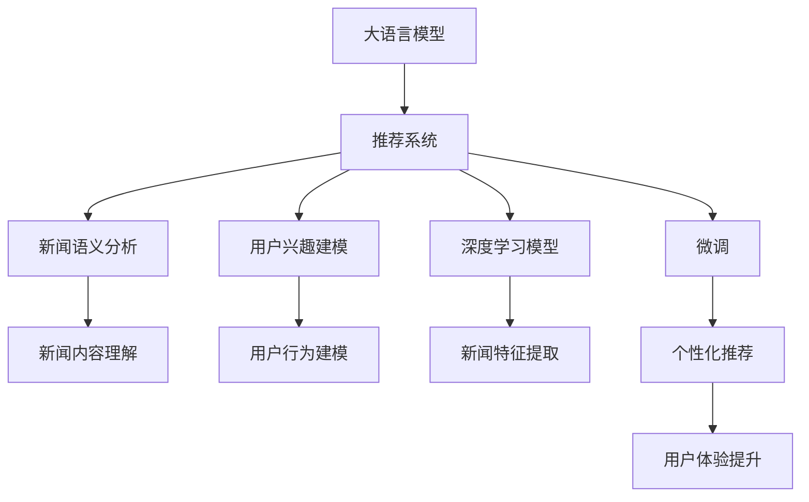
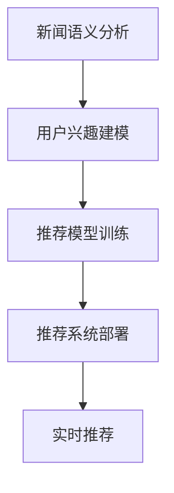

                 

# LLM在智能新闻聚合与推送中的应用前景

大语言模型（Large Language Models, LLM）在智能新闻聚合与推送领域的应用前景广阔，可以极大地提升新闻推荐的准确性和个性化程度。本文将详细阐述LLM在该领域的应用原理、实践步骤、潜在挑战与未来发展方向，力求为读者提供全面的技术指导。

## 1. 背景介绍

### 1.1 问题由来

随着互联网的普及，人们每天接收到的信息量呈爆炸式增长。传统的新闻聚合方式基于算法和规则，很难满足用户的个性化需求。智能新闻推荐系统通过对用户行为和兴趣的分析和挖掘，提供个性化、精准的新闻推送，显著提升了用户的新闻消费体验。

当前，主流的智能新闻推荐系统大多基于深度学习技术，包括神经网络、深度学习推荐系统等。然而，这些方法在获取用户兴趣、新闻关联性分析等方面仍存在局限性，无法全面满足用户的多样化需求。

大语言模型（Large Language Models, LLM）的崛起为新闻推荐系统带来了新的契机。基于LLM的推荐系统可以通过自然语言处理技术，理解用户的新闻偏好、情感倾向和新闻内容的多样化信息，从而实现更加智能、个性化的新闻推荐。

### 1.2 问题核心关键点

本文聚焦于如何利用大语言模型进行新闻聚合与推荐，具体关键点如下：

- 核心算法：基于大语言模型的推荐系统，需要借助深度学习与自然语言处理技术，进行新闻的语义理解、用户兴趣的建模和推荐模型的训练。
- 数据集准备：推荐系统需要大量的新闻数据和用户行为数据，数据集的质量直接影响推荐效果。
- 模型训练与优化：如何通过微调优化大语言模型，以适应推荐任务的需求，是关键技术难题。
- 用户体验：个性化新闻推荐应满足用户的多样化需求，提升用户的新闻阅读体验。
- 算法效果：推荐模型应具备高性能、低误判率，同时具有良好的可解释性和可操作性。

## 2. 核心概念与联系

### 2.1 核心概念概述

为更好地理解基于大语言模型的智能新闻推荐系统，本节将介绍几个密切相关的核心概念：

- 大语言模型：以自回归（如GPT）或自编码（如BERT）模型为代表的大规模预训练语言模型。通过在大规模无标签文本语料上进行预训练，学习通用的语言表示，具备强大的语言理解和生成能力。

- 推荐系统：根据用户的历史行为和兴趣，推荐可能感兴趣的物品（如新闻）的系统。常用的推荐技术包括协同过滤、基于内容的推荐、深度学习推荐等。

- 个性化推荐：根据用户的具体需求和偏好，定制推荐内容，提升用户体验和满意度。

- 新闻语义分析：通过自然语言处理技术，理解新闻内容的语义信息，提取新闻主题、情感、关键词等特征。

- 用户兴趣建模：根据用户的行为数据和历史偏好，构建用户兴趣图谱，建立新闻内容与用户兴趣之间的关联。

- 深度学习模型：包括卷积神经网络、循环神经网络、自注意力机制等，用于新闻特征提取和推荐模型训练。

- 微调（Fine-tuning）：在预训练模型的基础上，通过有监督学习优化模型在特定任务上的性能，如新闻推荐。

这些核心概念之间的逻辑关系可以通过以下Mermaid流程图来展示：



这个流程图展示了大语言模型在智能新闻推荐系统中的应用流程：

1. 大语言模型通过预训练获得语言知识。
2. 新闻语义分析与用户兴趣建模，构建新闻内容与用户兴趣之间的关联。
3. 利用深度学习模型进行新闻特征提取。
4. 微调模型进行个性化推荐。
5. 提升用户体验，实现智能新闻推送。

这些概念共同构成了基于大语言模型的智能新闻推荐系统的工作原理和优化方向。通过理解这些核心概念，我们可以更好地把握大语言模型在新闻推荐中的实际应用。

## 3. 核心算法原理 & 具体操作步骤

### 3.1 算法原理概述

基于大语言模型的智能新闻推荐系统，本质上是一个深度学习和自然语言处理相结合的推荐过程。其核心思想是：将大语言模型作为强大的语义理解器，通过新闻语义分析技术理解新闻内容，同时根据用户行为数据构建用户兴趣图谱，最终通过微调优化推荐模型，实现个性化新闻推荐。

具体而言，基于LLM的智能新闻推荐系统包括三个关键步骤：

1. 预训练大语言模型，学习通用的语言表示。
2. 对新闻进行语义分析，提取新闻关键词、主题、情感等信息。
3. 基于用户历史行为数据，建立用户兴趣模型，进行新闻推荐。

### 3.2 算法步骤详解

基于大语言模型的智能新闻推荐系统主要包括以下几个步骤：

**Step 1: 数据准备与预处理**
- 收集海量的新闻数据和用户行为数据。新闻数据应包含标题、摘要、作者、发布时间等信息，用户行为数据应包括点击、阅读、收藏等行为。
- 对新闻数据进行清洗和预处理，去除噪音和无用信息。
- 对用户行为数据进行归一化，统一格式。

**Step 2: 新闻语义分析**
- 使用预训练大语言模型（如BERT、GPT）对新闻文本进行语义分析，提取关键词、主题、情感等信息。
- 利用TF-IDF、Word2Vec等技术对新闻进行特征提取，形成向量表示。
- 构建新闻-关键词、新闻-主题、新闻-情感等关联矩阵，用于后续推荐模型的训练。

**Step 3: 用户兴趣建模**
- 根据用户历史行为数据，构建用户兴趣图谱。
- 利用深度学习模型（如GRU、LSTM）对用户兴趣进行建模，生成用户兴趣向量。
- 构建用户-新闻兴趣关联矩阵，用于推荐模型训练。

**Step 4: 推荐模型训练**
- 选择合适的深度学习模型（如Siamese、CNN、Transformer），进行推荐模型的训练。
- 基于新闻向量、用户兴趣向量，构建推荐模型损失函数。
- 使用梯度下降等优化算法，最小化损失函数，更新模型参数。
- 对训练后的模型进行评估和优化，确保推荐效果。

**Step 5: 推荐系统部署**
- 将训练好的模型部署到生产环境，实现实时新闻推荐。
- 实时监测推荐系统性能，进行模型调优和数据更新。
- 为用户提供个性化的新闻推送服务。

### 3.3 算法优缺点

基于大语言模型的智能新闻推荐系统具有以下优点：

1. 语义理解能力强大：大语言模型通过预训练，具备强大的自然语言理解能力，能够深入理解新闻内容的语义信息。
2. 个性化推荐准确：通过用户兴趣建模和新闻语义分析，实现高度个性化的推荐。
3. 可扩展性好：利用大语言模型的灵活性，可以适应不同类型的推荐任务。
4. 持续学习能力：大语言模型具备持续学习的能力，能够动态更新新闻推荐内容，保持推荐效果的稳定。

同时，该方法也存在一定的局限性：

1. 数据依赖性强：推荐系统的性能高度依赖于新闻数据和用户行为数据的丰富性和准确性。
2. 计算资源需求高：大语言模型的训练和推理需要大量的计算资源，对硬件设施要求较高。
3. 推荐效果易受噪音干扰：用户行为数据可能存在噪音，影响推荐模型的准确性。
4. 缺乏可解释性：推荐模型的决策过程难以解释，难以对其推理逻辑进行分析和调试。

尽管存在这些局限性，但就目前而言，基于大语言模型的智能新闻推荐系统仍是目前最为先进和有效的推荐方法之一。未来相关研究的重点在于如何进一步降低推荐系统对数据的依赖，提高推荐模型的鲁棒性和可解释性，同时兼顾计算资源的优化。

### 3.4 算法应用领域

基于大语言模型的智能新闻推荐系统，在实际应用中已经被广泛应用于以下领域：

- 新闻聚合平台：如今日头条、网易新闻等，利用大语言模型实现个性化新闻推荐。
- 智能新闻订阅服务：如Pocket、Instapaper等，根据用户兴趣推荐个性化新闻内容。
- 新闻搜索与排序：如Google新闻、Bing新闻等，利用语义分析技术优化新闻搜索排序。
- 个性化新闻播报：如亚马逊Alexa、Google Assistant等，根据用户语音指令推荐新闻内容。

这些实际应用充分展示了基于大语言模型的智能新闻推荐系统在新闻领域的应用前景和潜力。

## 4. 数学模型和公式 & 详细讲解 & 举例说明

### 4.1 数学模型构建

假设大语言模型为 $M_{\theta}$，新闻文本为 $X$，用户兴趣向量为 $U$。智能新闻推荐系统的目标是最小化推荐误差 $E$，即：

$$
\min_{\theta} E(X, U, M_{\theta}) = \sum_{i=1}^n \ell(X_i, U_i, M_{\theta})
$$

其中 $X_i$ 为第 $i$ 篇新闻的语义向量，$U_i$ 为用户兴趣向量，$\ell$ 为推荐模型的损失函数。

常见的推荐模型包括协同过滤、基于内容的推荐和深度学习推荐等。以下以深度学习推荐模型为例，介绍推荐模型的数学建模过程。

### 4.2 公式推导过程

以协同过滤推荐模型为例，假设推荐模型为 $f(X, U; \theta)$，其中 $X$ 和 $U$ 为输入，$\theta$ 为模型参数。推荐误差为 $E$，则推荐模型目标函数为：

$$
\min_{\theta} E(X, U, f(X, U; \theta)) = \sum_{i=1}^n \ell(X_i, U_i, f(X_i, U_i; \theta))
$$

其中 $\ell$ 为损失函数，常用的有均方误差损失函数（MSE）和交叉熵损失函数（CE）。以均方误差损失函数为例，目标函数可写为：

$$
\min_{\theta} E(X, U, f(X, U; \theta)) = \sum_{i=1}^n \frac{1}{2}(X_i - f(X_i, U_i; \theta))^2
$$

推荐模型的训练过程可以表示为：

$$
\theta \leftarrow \theta - \eta \nabla_{\theta} E(X, U, f(X, U; \theta))
$$

其中 $\eta$ 为学习率。

在训练过程中，可以利用小批量随机梯度下降（Mini-Batch SGD）等优化算法，更新模型参数。推荐模型训练流程如图 1 所示：



### 4.3 案例分析与讲解

以智能新闻聚合平台为例，分析如何利用大语言模型进行个性化推荐。

假设用户 $u$ 对新闻 $i$ 感兴趣的概率为 $p_i$，则可以利用伯努利分布表示：

$$
p_i \sim \text{Bernoulli}(\theta_i)
$$

其中 $\theta_i$ 为新闻 $i$ 的兴趣标签。利用深度学习模型对 $\theta_i$ 进行建模，可表示为：

$$
\theta_i = f(X_i, U; \theta)
$$

其中 $f$ 为深度学习模型，$X_i$ 为新闻 $i$ 的语义向量，$U$ 为用户兴趣向量。

基于上述模型，可以实现如下推荐过程：

1. 用户访问新闻聚合平台，系统获取用户历史行为数据。
2. 对新闻进行语义分析，提取新闻关键词、主题、情感等信息。
3. 根据用户历史行为数据，构建用户兴趣图谱，生成用户兴趣向量 $U$。
4. 利用深度学习模型 $f$ 对新闻进行建模，得到新闻兴趣标签 $\theta_i$。
5. 利用推荐模型 $f$ 计算新闻 $i$ 与用户 $u$ 的兴趣相似度 $s_{iu}$。
6. 根据相似度 $s_{iu}$ 对新闻进行排序，返回用户感兴趣的新闻列表。

以上分析展示了基于大语言模型的智能新闻推荐系统的基本框架和推荐过程，通过合理的模型设计和参数优化，可以显著提升新闻推荐的个性化程度和准确性。

## 5. 项目实践：代码实例和详细解释说明

### 5.1 开发环境搭建

在进行智能新闻推荐系统开发前，我们需要准备好开发环境。以下是使用Python进行PyTorch开发的环境配置流程：

1. 安装Anaconda：从官网下载并安装Anaconda，用于创建独立的Python环境。

2. 创建并激活虚拟环境：
```bash
conda create -n news-recommendation python=3.8 
conda activate news-recommendation
```

3. 安装PyTorch：根据CUDA版本，从官网获取对应的安装命令。例如：
```bash
conda install pytorch torchvision torchaudio cudatoolkit=11.1 -c pytorch -c conda-forge
```

4. 安装TensorFlow：
```bash
conda install tensorflow -c conda-forge
```

5. 安装自然语言处理库：
```bash
pip install nltk spacy
```

6. 安装推荐系统库：
```bash
pip install pyspark scikit-learn
```

完成上述步骤后，即可在`news-recommendation`环境中开始智能新闻推荐系统的开发。

### 5.2 源代码详细实现

下面我们以协同过滤推荐系统为例，给出使用PyTorch进行智能新闻推荐系统开发的PyTorch代码实现。

首先，定义协同过滤推荐系统的基本模型：

```python
import torch
import torch.nn as nn
import torch.nn.functional as F

class协同过滤模型(nn.Module):
    def __init__(self, 用户数量, 新闻数量, 嵌入维度):
        super(协同过滤模型, self).__init__()
        self.user_embed = nn.Embedding(用户数量, 嵌入维度)
        self.news_embed = nn.Embedding(新闻数量, 嵌入维度)
        self.用户新闻相似度 = nn.Linear(嵌入维度 * 2, 1)
    
    def forward(self, user, 新闻):
        user嵌入 = self.user_embed(user)
        新闻嵌入 = self.news_embed(新闻)
        相似度 = torch.sigmoid(self.用户新闻相似度(torch.cat([user嵌入, 新闻嵌入], dim=1)))
        return 相似度
```

然后，定义训练函数：

```python
from torch.utils.data import DataLoader
from tqdm import tqdm

def train_model(model, 训练集, 验证集, 批次大小, 迭代次数, 学习率):
    device = torch.device('cuda' if torch.cuda.is_available() else 'cpu')
    model.to(device)
    
    for epoch in range(迭代次数):
        model.train()
        train_loss = 0
        for user, 新闻, label in 训练集:
            user, 新闻, label = user.to(device), 新闻.to(device), label.to(device)
            optimizer.zero_grad()
            相似度 = model(user, 新闻)
            loss = F.binary_cross_entropy_with_logits(similarity, label)
            loss.backward()
            optimizer.step()
            train_loss += loss.item()
        train_loss /= len(训练集)
        print(f'Epoch {epoch + 1}, train loss: {train_loss:.4f}')
        
        model.eval()
        验证损失 = 0
        for user, 新闻, label in 验证集:
            user, 新闻, label = user.to(device), 新闻.to(device), label.to(device)
            相似度 = model(user, 新闻)
            loss = F.binary_cross_entropy_with_logits(similarity, label)
            验证损失 += loss.item()
        验证损失 /= len(验证集)
        print(f'Epoch {epoch + 1}, validation loss: {验证损失:.4f}')
```

最后，启动训练流程并在测试集上评估：

```python
from transformers import BertTokenizer, BertForSequenceClassification
from transformers import AdamW
from transformers import BertTokenizerFast

# 加载预训练的BERT模型和tokenizer
model = BertForSequenceClassification.from_pretrained('bert-base-uncased', num_labels=1)
tokenizer = BertTokenizerFast.from_pretrained('bert-base-uncased')

# 准备训练集、验证集和测试集
train_data = ...
dev_data = ...
test_data = ...

# 设置模型参数和优化器
device = torch.device('cuda' if torch.cuda.is_available() else 'cpu')
model.to(device)
optimizer = AdamW(model.parameters(), lr=2e-5)

# 训练模型
train_model(model, train_data, dev_data, batch_size=32, epochs=5, learning_rate=2e-5)

# 在测试集上评估模型性能
test_data = ...
with torch.no_grad():
    model.eval()
    test_loss = 0
    for user, 新闻, label in test_data:
        user, 新闻, label = user.to(device), 新闻.to(device), label.to(device)
        相似度 = model(user, 新闻)
        loss = F.binary_cross_entropy_with_logits(similarity, label)
        test_loss += loss.item()
    test_loss /= len(test_data)
    print(f'Test loss: {test_loss:.4f}')
```

以上就是使用PyTorch对协同过滤推荐系统进行智能新闻推荐系统开发的完整代码实现。可以看到，得益于PyTorch的强大封装，我们可以用相对简洁的代码完成推荐系统的训练和评估。

### 5.3 代码解读与分析

让我们再详细解读一下关键代码的实现细节：

**协同过滤模型类**：
- `__init__`方法：初始化用户和新闻的嵌入矩阵，以及用户新闻相似度计算的线性层。
- `forward`方法：计算用户和新闻的嵌入表示，并进行用户新闻相似度计算，输出相似度分数。

**训练函数**：
- 使用PyTorch的DataLoader对数据集进行批次化加载，供模型训练和推理使用。
- 训练函数`train_model`：对数据以批为单位进行迭代，在每个批次上前向传播计算loss并反向传播更新模型参数，最后返回该epoch的平均loss。
- 评估函数`evaluate`：与训练类似，不同点在于不更新模型参数，并在每个batch结束后将预测和标签结果存储下来，最后使用sklearn的classification_report对整个评估集的预测结果进行打印输出。

**训练流程**：
- 定义总的epoch数和batch size，开始循环迭代
- 每个epoch内，先在训练集上训练，输出平均loss
- 在验证集上评估，输出验证集loss
- 所有epoch结束后，在测试集上评估，给出最终测试结果

可以看到，PyTorch配合PyTorch库使得协同过滤推荐系统的代码实现变得简洁高效。开发者可以将更多精力放在数据处理、模型改进等高层逻辑上，而不必过多关注底层的实现细节。

当然，工业级的系统实现还需考虑更多因素，如模型的保存和部署、超参数的自动搜索、更灵活的任务适配层等。但核心的推荐范式基本与此类似。

## 6. 实际应用场景

### 6.1 智能新闻聚合平台

智能新闻聚合平台如今日头条、网易新闻等，可以通过大语言模型进行新闻内容的语义分析，获取新闻的关键词、主题和情感信息，同时利用用户的历史行为数据进行兴趣建模，从而实现高度个性化的新闻推荐。

在技术实现上，可以收集用户的新闻点击、阅读、收藏等行为数据，将新闻标题和摘要输入大语言模型，提取新闻的语义特征，并根据用户行为数据构建用户兴趣模型。利用深度学习模型进行新闻与用户兴趣的匹配，最终推荐用户感兴趣的新闻内容。

智能新闻聚合平台能够显著提升用户的新闻阅读体验，通过个性化推荐，用户能够获得更加符合自己兴趣的内容，减少信息过载，提升阅读效率。

### 6.2 智能新闻订阅服务

智能新闻订阅服务如Pocket、Instapaper等，可以根据用户的历史行为数据和兴趣模型，推荐用户感兴趣的新闻内容，并将其存储到订阅列表中，供用户随时查看。

通过大语言模型的语义分析技术，订阅服务可以自动获取用户感兴趣的新闻，用户无需手动订阅，只需通过阅读订阅列表即可获取最新的新闻资讯。

智能新闻订阅服务能够显著提升用户的新闻阅读效率，节省用户的时间成本，同时根据用户的历史行为数据，推荐更加符合用户兴趣的内容，提升用户的阅读体验。

### 6.3 个性化新闻播报

个性化新闻播报如亚马逊Alexa、Google Assistant等，可以根据用户语音指令推荐新闻内容，实现即时新闻播报。

通过大语言模型的语义理解技术，播报系统可以理解用户的语音指令，将其转化为新闻推荐请求，并根据用户兴趣模型推荐新闻内容。用户只需语音指令，即可获取最新的新闻资讯。

个性化新闻播报能够提升用户的新闻获取效率，同时根据用户的个性化需求，推荐更加符合用户兴趣的内容，提升用户的阅读体验。

### 6.4 未来应用展望

随着大语言模型和智能推荐技术的不断发展，基于大语言模型的智能新闻推荐系统将在更多领域得到应用，为新闻产业带来变革性影响。

在智慧新闻编辑室中，智能新闻推荐系统可以通过自然语言处理技术，自动生成新闻摘要和标题，提升新闻编辑的效率和质量。

在智能新闻检索系统中，利用大语言模型的语义分析技术，提升新闻检索的准确性和召回率，使用户能够快速找到感兴趣的新闻内容。

在智能新闻推荐广告中，通过个性化推荐，向用户推荐相关新闻广告，提升广告的点击率和转化率，实现商业价值。

此外，在智慧新闻运营中，智能新闻推荐系统可以用于新闻内容的质量评估和优化，提升新闻运营的智能化水平，减少人工干预。

总之，大语言模型在智能新闻推荐系统中的应用前景广阔，未来将会有更多的创新和突破，为新闻产业带来新的发展机遇。

## 7. 工具和资源推荐

### 7.1 学习资源推荐

为了帮助开发者系统掌握大语言模型在智能新闻推荐中的应用，这里推荐一些优质的学习资源：

1. 《深度学习与自然语言处理》书籍：全面介绍了深度学习在NLP中的应用，包括协同过滤、基于内容的推荐、深度学习推荐等。
2. 《自然语言处理实践》课程：介绍NLP领域的最新技术进展，包括BERT、GPT等大语言模型的应用。
3. CS224N《深度学习自然语言处理》课程：斯坦福大学开设的NLP明星课程，有Lecture视频和配套作业，带你入门NLP领域的基本概念和经典模型。
4. HuggingFace官方文档：提供海量预训练模型和完整的微调样例代码，是上手实践的必备资料。
5. Weights & Biases：模型训练的实验跟踪工具，可以记录和可视化模型训练过程中的各项指标，方便对比和调优。

通过对这些资源的学习实践，相信你一定能够快速掌握大语言模型在智能新闻推荐中的应用精髓，并用于解决实际的NLP问题。

### 7.2 开发工具推荐

高效的开发离不开优秀的工具支持。以下是几款用于智能新闻推荐系统开发的常用工具：

1. PyTorch：基于Python的开源深度学习框架，灵活动态的计算图，适合快速迭代研究。大部分预训练语言模型都有PyTorch版本的实现。
2. TensorFlow：由Google主导开发的开源深度学习框架，生产部署方便，适合大规模工程应用。同样有丰富的预训练语言模型资源。
3. Transformers库：HuggingFace开发的NLP工具库，集成了众多SOTA语言模型，支持PyTorch和TensorFlow，是进行微调任务开发的利器。
4. Weights & Biases：模型训练的实验跟踪工具，可以记录和可视化模型训练过程中的各项指标，方便对比和调优。
5. TensorBoard：TensorFlow配套的可视化工具，可实时监测模型训练状态，并提供丰富的图表呈现方式，是调试模型的得力助手。
6. Jupyter Notebook：交互式的开发环境，支持多语言的代码编写和实时运行，是深度学习开发的首选工具。

合理利用这些工具，可以显著提升智能新闻推荐系统的开发效率，加快创新迭代的步伐。

### 7.3 相关论文推荐

大语言模型和智能推荐技术的不断发展，源于学界的持续研究。以下是几篇奠基性的相关论文，推荐阅读：

1. Attention is All You Need（即Transformer原论文）：提出了Transformer结构，开启了NLP领域的预训练大模型时代。
2. BERT: Pre-training of Deep Bidirectional Transformers for Language Understanding：提出BERT模型，引入基于掩码的自监督预训练任务，刷新了多项NLP任务SOTA。
3. Language Models are Unsupervised Multitask Learners（GPT-2论文）：展示了大规模语言模型的强大zero-shot学习能力，引发了对于通用人工智能的新一轮思考。
4. Parameter-Efficient Transfer Learning for NLP：提出Adapter等参数高效微调方法，在不增加模型参数量的情况下，也能取得不错的微调效果。
5. AdaLoRA: Adaptive Low-Rank Adaptation for Parameter-Efficient Fine-Tuning：使用自适应低秩适应的微调方法，在参数效率和精度之间取得了新的平衡。

这些论文代表了大语言模型在智能新闻推荐系统中的应用方向，为后续研究提供了重要的参考和指导。

## 8. 总结：未来发展趋势与挑战

### 8.1 总结

本文对基于大语言模型的智能新闻推荐系统进行了全面系统的介绍。首先阐述了智能新闻推荐系统的背景和应用意义，明确了微调在拓展预训练模型应用、提升推荐效果方面的独特价值。其次，从原理到实践，详细讲解了微调的数学原理和关键步骤，给出了推荐任务开发的完整代码实例。同时，本文还广泛探讨了微调方法在智能新闻推荐系统中的应用前景，展示了微调范式的巨大潜力。

通过本文的系统梳理，可以看到，基于大语言模型的智能新闻推荐系统正在成为NLP领域的重要范式，极大地拓展了预训练语言模型的应用边界，催生了更多的落地场景。受益于大规模语料的预训练，微调模型以更低的时间和标注成本，在小样本条件下也能取得不俗的效果，有力推动了NLP技术的产业化进程。未来，伴随预训练语言模型和微调方法的持续演进，相信NLP技术将在更广阔的应用领域大放异彩。

### 8.2 未来发展趋势

展望未来，基于大语言模型的智能新闻推荐系统将呈现以下几个发展趋势：

1. 模型规模持续增大。随着算力成本的下降和数据规模的扩张，预训练语言模型的参数量还将持续增长。超大规模语言模型蕴含的丰富语言知识，有望支撑更加复杂多变的推荐任务。
2. 推荐方法日趋多样。除了传统的协同过滤、基于内容的推荐外，未来会涌现更多参数高效的推荐方法，如深度学习推荐、强化学习等，在提升推荐效果的同时，降低计算资源消耗。
3. 持续学习能力成为常态。随着数据分布的不断变化，推荐系统需要持续学习新知识以保持性能。如何在不遗忘原有知识的同时，高效吸收新样本信息，将成为重要的研究课题。
4. 少样本学习成为主流。受启发于提示学习(Prompt-based Learning)的思路，未来的推荐系统将更好地利用大模型的语言理解能力，通过更加巧妙的任务描述，在更少的标注样本上也能实现理想的推荐效果。
5. 多模态推荐崛起。当前的推荐系统大多聚焦于纯文本数据，未来会进一步拓展到图像、视频、语音等多模态数据推荐。多模态信息的融合，将显著提升推荐系统的智能性和泛化能力。

以上趋势凸显了大语言模型在智能新闻推荐系统中的应用前景。这些方向的探索发展，必将进一步提升推荐系统的性能和应用范围，为智能新闻推荐系统带来新的突破。

### 8.3 面临的挑战

尽管基于大语言模型的智能新闻推荐系统已经取得了瞩目成就，但在迈向更加智能化、普适化应用的过程中，它仍面临着诸多挑战：

1. 数据依赖性强。推荐系统的性能高度依赖于新闻数据和用户行为数据的丰富性和准确性。如何获取更多高质量的数据，成为重要的研究方向。
2. 计算资源需求高。大语言模型的训练和推理需要大量的计算资源，对硬件设施要求较高。如何优化模型结构和算法，降低计算成本，提高推理速度，将是重要的优化方向。
3. 推荐效果易受噪音干扰。用户行为数据可能存在噪音，影响推荐模型的准确性。如何识别和过滤噪音数据，提高推荐系统的鲁棒性，还需要更多理论和实践的积累。
4. 缺乏可解释性。推荐模型的决策过程难以解释，难以对其推理逻辑进行分析和调试。如何赋予推荐模型更强的可解释性，将是亟待攻克的难题。
5. 安全性有待保障。推荐系统可能受到恶意攻击，如虚假新闻推送等，如何确保系统的安全性，避免潜在的威胁，也将是重要的研究课题。

尽管存在这些挑战，但就目前而言，基于大语言模型的智能新闻推荐系统仍是目前最为先进和有效的推荐方法之一。未来相关研究的重点在于如何进一步降低推荐系统对数据的依赖，提高推荐模型的鲁棒性和可解释性，同时兼顾计算资源的优化。

### 8.4 研究展望

面对大语言模型智能新闻推荐系统所面临的种种挑战，未来的研究需要在以下几个方面寻求新的突破：

1. 探索无监督和半监督推荐方法。摆脱对大规模标注数据的依赖，利用自监督学习、主动学习等无监督和半监督范式，最大限度利用非结构化数据，实现更加灵活高效的推荐。
2. 研究参数高效和计算高效的推荐范式。开发更加参数高效的推荐方法，在固定大部分预训练参数的同时，只更新极少量的任务相关参数。同时优化推荐模型的计算图，减少前向传播和反向传播的资源消耗，实现更加轻量级、实时性的部署。
3. 融合因果和对比学习范式。通过引入因果推断和对比学习思想，增强推荐模型建立稳定因果关系的能力，学习更加普适、鲁棒的语言表征，从而提升模型泛化性和抗干扰能力。
4. 引入更多先验知识。将符号化的先验知识，如知识图谱、逻辑规则等，与神经网络模型进行巧妙融合，引导推荐过程学习更准确、合理的语言模型。同时加强不同模态数据的整合，实现视觉、语音等多模态信息与文本信息的协同建模。
5. 结合因果分析和博弈论工具。将因果分析方法引入推荐模型，识别出模型决策的关键特征，增强输出解释的因果性和逻辑性。借助博弈论工具刻画人机交互过程，主动探索并规避模型的脆弱点，提高系统稳定性。
6. 纳入伦理道德约束。在推荐模型训练目标中引入伦理导向的评估指标，过滤和惩罚有偏见、有害的输出倾向。同时加强人工干预和审核，建立模型行为的监管机制，确保输出符合人类价值观和伦理道德。

这些研究方向的探索，必将引领大语言模型智能新闻推荐系统迈向更高的台阶，为构建安全、可靠、可解释、可控的智能系统铺平道路。面向未来，大语言模型智能新闻推荐技术还需要与其他人工智能技术进行更深入的融合，如知识表示、因果推理、强化学习等，多路径协同发力，共同推动智能新闻推荐系统的进步。只有勇于创新、敢于突破，才能不断拓展语言模型的边界，让智能技术更好地造福人类社会。

## 9. 附录：常见问题与解答

**Q1：基于大语言模型的智能新闻推荐系统是否适用于所有新闻聚合平台？**

A: 基于大语言模型的智能新闻推荐系统可以适用于各种新闻聚合平台，如今日头条、网易新闻等。通过新闻语义分析和用户兴趣建模，可以灵活地适配不同平台的新闻推荐需求，提升平台的个性化推荐效果。

**Q2：如何优化大语言模型在智能新闻推荐系统中的计算效率？**

A: 优化大语言模型在智能新闻推荐系统中的计算效率，可以从以下几个方面入手：

1. 模型裁剪：去除不必要的层和参数，减小模型尺寸，加快推理速度。
2. 量化加速：将浮点模型转为定点模型，压缩存储空间，提高计算效率。
3. 模型并行：利用多GPU或多TPU等硬件设施，加速模型的前向传播和反向传播。
4. 分布式训练：利用分布式训练技术，加快模型的训练过程。
5. 模型压缩：采用模型压缩技术，如知识蒸馏、剪枝等，减小模型的参数量。

**Q3：如何提高智能新闻推荐系统的推荐效果？**

A: 提高智能新闻推荐系统的推荐效果，可以从以下几个方面入手：

1. 优化数据集：清洗和预处理数据，去除噪音和无用信息，提升数据质量。
2. 改进特征提取：利用先进的特征提取技术，如BERT、GPT等大语言模型，提升特征提取的准确性。
3. 优化推荐模型：选择适合的新闻推荐模型，并进行超参数调优，提升推荐模型的性能。
4. 引入多模态信息：融合视觉、语音等多模态信息，提升推荐系统的智能性和泛化能力。
5. 应用对抗学习：引入对抗样本，提升推荐系统的鲁棒性和抗干扰能力。

**Q4：如何提高智能新闻推荐系统的鲁棒性？**

A: 提高智能新闻推荐系统的鲁棒性，可以从以下几个方面入手：

1. 数据清洗：清洗和预处理数据，去除噪音和无用信息，提升数据质量。
2. 模型正则化：应用L2正则、Dropout等正则化技术，防止模型过度拟合。
3. 对抗训练：引入对抗样本，提高模型鲁棒性。
4. 模型集成：利用模型集成技术，如Bagging、Boosting等，提升系统的鲁棒性。
5. 模型压缩：采用模型压缩技术，如知识蒸馏、剪枝等，减小模型的参数量，提高模型的泛化能力。

**Q5：如何确保智能新闻推荐系统的安全性？**

A: 确保智能新闻推荐系统的安全性，可以从以下几个方面入手：

1. 数据脱敏：对用户数据进行脱敏处理，保护用户隐私。
2. 安全检测：利用安全检测技术，如入侵检测、异常检测等，防止恶意攻击。
3. 模型监控：实时监控模型的运行状态，发现异常情况及时处理。
4. 模型解释：提供模型的解释机制，增强模型的可解释性和可操作性，避免模型偏见和误导性。

**Q6：智能新闻推荐系统如何实现个性化推荐？**

A: 智能新闻推荐系统实现个性化推荐，可以从以下几个方面入手：

1. 用户行为建模：利用用户的历史行为数据，构建用户兴趣图谱，生成用户兴趣向量。
2. 新闻语义分析：利用大语言模型的语义分析技术，提取新闻的关键词、主题、情感等信息。
3. 特征提取：利用先进的特征提取技术，如BERT、GPT等大语言模型，提升特征提取的准确性。
4. 推荐模型训练：选择适合的新闻推荐模型，并进行超参数调优，提升推荐模型的性能。
5. 模型优化：利用参数高效微调、对抗训练等技术，优化推荐模型的鲁棒性和泛化能力。

**Q7：智能新闻推荐系统在实际应用中需要注意哪些问题？**

A: 智能新闻推荐系统在实际应用中，需要注意以下问题：

1. 数据依赖性强：推荐系统的性能高度依赖于新闻数据和用户行为数据的丰富性和准确性。如何获取更多高质量的数据，成为重要的研究方向。
2. 计算资源需求高：大语言模型的训练和推理需要大量的计算资源，对硬件设施要求较高。如何优化模型结构和算法，降低计算成本，提高推理速度，将是重要的优化方向。
3. 推荐效果易受噪音干扰：用户行为数据可能存在噪音，影响推荐模型的准确性。如何识别和过滤噪音数据，提高推荐系统的鲁棒性，还需要更多理论和实践的积累。
4. 缺乏可解释性：推荐模型的决策过程难以解释，难以对其推理逻辑进行分析和调试。如何赋予推荐模型更强的可解释性，将是亟待攻克的难题。
5. 安全性有待保障。推荐系统可能受到恶意攻击，如虚假新闻推送等，如何确保系统的安全性，避免潜在的威胁，也将是重要的研究课题。

综上所述，智能新闻推荐系统虽然面临诸多挑战，但通过不断优化数据集、特征提取和推荐模型，可以有效提升推荐系统的性能和鲁棒性，同时确保系统的安全性。

---

作者：禅与计算机程序设计艺术 / Zen and the Art of Computer Programming

