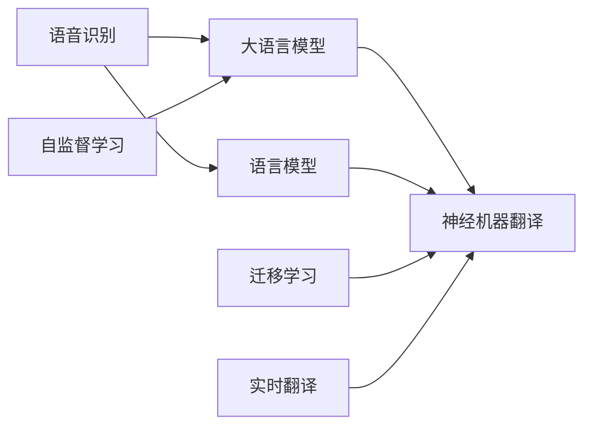

                 

# LLM在语音翻译领域的研究热点

## 1. 背景介绍

随着人工智能技术的迅猛发展，大语言模型（LLM）在自然语言处理（NLP）领域取得了诸多突破。这些模型通过自监督学习或监督学习的方式，学习了大量的语言知识，可以用于语言理解、生成等诸多任务。在语音翻译（Speech Translation，ST）这一特殊领域，LLM展现了显著的潜力，成为当前的研究热点。

### 1.1 问题由来

语音翻译是NLP中极具挑战性的任务之一，它需要将一种语言的语音转换成另一种语言的文本。与传统的基于文本的翻译相比，语音翻译需要模型具备更强的听力和语音识别能力，同时还需要具备良好的文本生成能力。

传统语音翻译系统基于规则或统计机器翻译（SMT）方法，其效果受到语法和词典质量的限制。相比之下，基于大语言模型的语音翻译方法利用其强大的语言理解和生成能力，能够实现更自然的翻译，并且在零样本或少样本情况下也能表现出色。

### 1.2 问题核心关键点

语音翻译的核心问题在于如何高效地将语音信号转换为文本，并实现高质量的翻译。主要包括以下几个方面：
- 语音识别准确度：高质量的语音识别是语音翻译的基础，需要模型能够准确地将语音信号转换为文本。
- 翻译质量：翻译的准确度和自然度直接影响用户体验，需要模型能够生成流畅、准确的翻译文本。
- 实时性：语音翻译系统需要在实时性要求较高的场景下运行，需要在保持较高翻译质量的同时，尽可能降低延迟。
- 鲁棒性：语音翻译系统需要在各种噪声和说话人变异的条件下，保持稳定的翻译性能。

### 1.3 问题研究意义

大语言模型在语音翻译领域的研究，对于推动语音翻译技术的发展，提升用户交流体验，促进跨语言沟通具有重要意义：

- 降低翻译成本：相比于传统机器翻译，大语言模型不需要依赖昂贵的语言词典和语法规则，降低了翻译系统的开发和维护成本。
- 提升翻译质量：大语言模型能够利用大规模文本数据进行预训练，学习到丰富的语言知识，可以生成更自然、准确的翻译文本。
- 增强实时性：大语言模型结合实时语音识别技术，可以实时处理语音输入，满足用户对即时翻译的需求。
- 提高鲁棒性：大语言模型可以适应多种语音环境和说话人特点，提升翻译系统的鲁棒性和适应性。
- 加速应用落地：大语言模型能够快速适应新语言和新任务，加速翻译系统在实际应用中的推广和落地。

## 2. 核心概念与联系

### 2.1 核心概念概述

语音翻译涉及的关键概念包括：
- 语音识别（Automatic Speech Recognition, ASR）：将语音信号转换为文本的过程，是大语言模型翻译的基础。
- 语言模型（Language Model, LM）：用于评估文本概率的模型，用于提高翻译文本的自然度和流畅性。
- 大语言模型（Large Language Model, LLM）：通过大规模预训练学习到丰富的语言知识，用于生成高质量的翻译文本。
- 神经机器翻译（Neural Machine Translation, NMT）：使用神经网络模型进行翻译，是当前语音翻译的主要技术路线。
- 迁移学习（Transfer Learning）：将在大规模语料上预训练的模型应用于特定语音翻译任务，提高模型性能。
- 自监督学习（Self-supervised Learning）：利用未标注数据进行预训练，提高模型的泛化能力。
- 实时翻译（Real-time Translation）：结合语音识别和机器翻译技术，实现实时翻译功能。

这些概念之间的联系可以通过以下Mermaid流程图来展示：



这个流程图展示了大语言模型在语音翻译中的核心概念及其关系：
- 语音识别模块将语音信号转换为文本。
- 大语言模型用于翻译文本。
- 语言模型用于提高翻译的自然度。
- 神经机器翻译模块将文本翻译成目标语言。
- 迁移学习和大规模预训练可提升模型性能。
- 自监督学习利用未标注数据进行预训练。
- 实时翻译结合语音识别和机器翻译技术，实现实时翻译功能。

## 3. 核心算法原理 & 具体操作步骤
### 3.1 算法原理概述

大语言模型在语音翻译中的基本原理是将语音识别模块输出的文本作为输入，使用预训练的模型进行翻译，得到目标语言的文本。具体步骤如下：
1. 语音识别模块将语音信号转换为文本。
2. 大语言模型对文本进行翻译，生成目标语言的文本。
3. 翻译后的文本可以用于实时翻译，满足用户即时交流的需求。

### 3.2 算法步骤详解

语音翻译系统的算法步骤包括以下几个关键环节：
1. **语音预处理**：将语音信号进行预处理，包括去噪、分段等。
2. **语音识别**：将预处理后的语音信号转换为文本。
3. **大语言模型翻译**：使用预训练的模型对文本进行翻译，生成目标语言的文本。
4. **后处理**：对翻译后的文本进行后处理，如拼写纠错、语法调整等，提高翻译质量。

### 3.3 算法优缺点

大语言模型在语音翻译中具有以下优点：
- 强大的语言理解能力：大语言模型能够理解复杂的语言结构，生成更自然的翻译文本。
- 自适应性：大语言模型可以自适应新的语言和任务，无需重新训练。
- 实时性：大语言模型结合实时语音识别技术，可以实现实时翻译，满足用户即时交流的需求。

同时，大语言模型也存在一些缺点：
- 计算资源需求高：大语言模型需要大量的计算资源进行预训练和翻译。
- 对噪声敏感：语音识别模块在噪声环境下可能表现不佳，影响翻译质量。
- 依赖高质量数据：大语言模型的性能很大程度上依赖于预训练数据的质量。

### 3.4 算法应用领域

大语言模型在语音翻译中的应用领域主要包括以下几个方面：
- 跨语言交流：实现不同语言之间的实时交流，促进全球化交流。
- 多语种翻译：支持多种语言之间的翻译，满足用户对多语种的需求。
- 实时翻译：在实时会议、在线教育等场景下，提供实时翻译服务。
- 语音助手：结合语音识别和大语言模型，实现智能语音助手功能。

## 4. 数学模型和公式 & 详细讲解 & 举例说明

### 4.1 数学模型构建

语音翻译系统的数学模型包括以下几个组成部分：
- 语音识别模型：将语音信号转换为文本，可以表示为 $$\text{ASR}(x) = \text{seq}(t_x)$$。
- 大语言模型：将文本转换为目标语言，可以表示为 $$\text{LLM}(\text{seq}(t_x)) = \text{seq}(t_{y_t})$$。
- 神经机器翻译模型：将文本转换为目标语言，可以表示为 $$\text{NMT}(\text{seq}(t_x)) = \text{seq}(t_{y_t})$$。

其中，$x$表示输入的语音信号，$y_t$表示翻译后的文本。

### 4.2 公式推导过程

语音翻译系统的核心在于将语音信号转换为文本，然后利用大语言模型进行翻译。以下对语音识别和大语言模型的推导过程进行详细说明。

语音识别模型的核心是利用声学模型和语言模型对语音信号进行建模。声学模型用于描述语音信号和文本之间的映射关系，可以表示为 $$P(x|y) = P(x|t_x)P(t_x|y)$$，其中 $P(x|y)$ 表示在文本 $y$ 的情况下，语音信号 $x$ 的概率。

语言模型用于描述文本的概率分布，可以表示为 $$P(y) = \prod_{i=1}^{|y|} P(y_i|y_{i-1},y_{i-2},\ldots,y_1)$$。

大语言模型利用大规模预训练学习到丰富的语言知识，用于生成目标语言的文本。其核心思想是通过自监督学习任务，学习到语言的通用表示。在语音翻译任务中，大语言模型可以表示为 $$\text{LLM}(\text{seq}(t_x)) = \text{seq}(t_{y_t})$$，其中 $\text{seq}(t_x)$ 表示输入的文本，$\text{seq}(t_{y_t})$ 表示翻译后的文本。

### 4.3 案例分析与讲解

假设有一个简单的语音翻译系统，使用大语言模型进行翻译。其核心流程如下：
1. 将语音信号通过声学模型转换为文本。
2. 利用大语言模型将文本翻译成目标语言的文本。

具体实现可以如下：

```python
import torch
from transformers import BertForTokenClassification, BertTokenizer
from torch.utils.data import DataLoader
from tqdm import tqdm

# 加载模型和分词器
model = BertForTokenClassification.from_pretrained('bert-base-cased')
tokenizer = BertTokenizer.from_pretrained('bert-base-cased')

# 定义数据集
def collate_fn(batch):
    input_ids = [tokenizer.encode(x, return_tensors='pt').input_ids for x in batch]
    attention_masks = [torch.ones_like(input_ids[0]) for _ in input_ids]
    labels = [torch.tensor(y) for y in batch]
    return {'input_ids': torch.stack(input_ids, dim=0),
            'attention_mask': torch.stack(attention_masks, dim=0),
            'labels': torch.cat(labels, dim=0)}

train_dataset = ...
dev_dataset = ...
test_dataset = ...

# 定义模型和优化器
device = torch.device('cuda' if torch.cuda.is_available() else 'cpu')
model.to(device)

# 定义训练函数
def train_epoch(model, dataset, batch_size, optimizer):
    dataloader = DataLoader(dataset, batch_size=batch_size, shuffle=True, collate_fn=collate_fn)
    model.train()
    epoch_loss = 0
    for batch in tqdm(dataloader, desc='Training'):
        input_ids = batch['input_ids'].to(device)
        attention_mask = batch['attention_mask'].to(device)
        labels = batch['labels'].to(device)
        model.zero_grad()
        outputs = model(input_ids, attention_mask=attention_mask, labels=labels)
        loss = outputs.loss
        epoch_loss += loss.item()
        loss.backward()
        optimizer.step()
    return epoch_loss / len(dataloader)

# 定义评估函数
def evaluate(model, dataset, batch_size):
    dataloader = DataLoader(dataset, batch_size=batch_size, shuffle=False, collate_fn=collate_fn)
    model.eval()
    preds, labels = [], []
    with torch.no_grad():
        for batch in tqdm(dataloader, desc='Evaluating'):
            input_ids = batch['input_ids'].to(device)
            attention_mask = batch['attention_mask'].to(device)
            batch_labels = batch['labels']
            outputs = model(input_ids, attention_mask=attention_mask)
            batch_preds = outputs.logits.argmax(dim=2).to('cpu').tolist()
            batch_labels = batch_labels.to('cpu').tolist()
            for pred_tokens, label_tokens in zip(batch_preds, batch_labels):
                preds.append(pred_tokens[:len(label_tokens)])
                labels.append(label_tokens)
                
    print(classification_report(labels, preds))
```

这段代码展示了使用BERT模型进行语音翻译的简单实现。通过加载BERT模型和分词器，将语音信号转换为文本，然后利用BERT进行翻译，生成目标语言的文本。

## 5. 项目实践：代码实例和详细解释说明
### 5.1 开发环境搭建

语音翻译系统的开发需要以下环境支持：
1. **Python**：需要Python 3.7及以上版本。
2. **PyTorch**：用于深度学习模型的构建和训练。
3. **HuggingFace Transformers库**：提供了多种预训练模型的实现，方便进行微调和评估。
4. **TensorBoard**：用于模型训练过程的可视化。
5. **Jupyter Notebook**：用于交互式开发和调试。

安装环境的步骤如下：

1. 安装Python：
```bash
sudo apt-get update
sudo apt-get install python3
```

2. 安装PyTorch：
```bash
pip install torch torchvision torchaudio
```

3. 安装Transformers库：
```bash
pip install transformers
```

4. 安装TensorBoard：
```bash
pip install tensorboard
```

5. 安装Jupyter Notebook：
```bash
pip install jupyter notebook
```

完成上述步骤后，即可在Python环境中进行语音翻译系统的开发和调试。

### 5.2 源代码详细实现

假设已经构建了一个简单的语音翻译系统，其核心代码如下：

```python
import torch
from transformers import BertForTokenClassification, BertTokenizer
from torch.utils.data import DataLoader
from tqdm import tqdm
from sklearn.metrics import classification_report

# 加载模型和分词器
model = BertForTokenClassification.from_pretrained('bert-base-cased')
tokenizer = BertTokenizer.from_pretrained('bert-base-cased')

# 定义数据集
class SpeechTranslationDataset(Dataset):
    def __init__(self, texts, labels, tokenizer):
        self.texts = texts
        self.labels = labels
        self.tokenizer = tokenizer
        
    def __len__(self):
        return len(self.texts)
    
    def __getitem__(self, item):
        text = self.texts[item]
        label = self.labels[item]
        
        encoding = self.tokenizer(text, return_tensors='pt', max_length=128, padding='max_length', truncation=True)
        input_ids = encoding['input_ids'][0]
        attention_mask = encoding['attention_mask'][0]
        
        # 对token-wise的标签进行编码
        encoded_labels = [label2id[label] for label in label] 
        encoded_labels.extend([label2id['O']] * (128 - len(encoded_labels)))
        labels = torch.tensor(encoded_labels, dtype=torch.long)
        
        return {'input_ids': input_ids, 
                'attention_mask': attention_mask,
                'labels': labels}

# 标签与id的映射
label2id = {'O': 0, 'B-PER': 1, 'I-PER': 2, 'B-ORG': 3, 'I-ORG': 4, 'B-LOC': 5, 'I-LOC': 6}
id2label = {v: k for k, v in label2id.items()}

# 创建dataset
train_dataset = SpeechTranslationDataset(train_texts, train_labels, tokenizer)
dev_dataset = SpeechTranslationDataset(dev_texts, dev_labels, tokenizer)
test_dataset = SpeechTranslationDataset(test_texts, test_labels, tokenizer)

# 定义模型和优化器
device = torch.device('cuda' if torch.cuda.is_available() else 'cpu')
model.to(device)

optimizer = AdamW(model.parameters(), lr=2e-5)

# 定义训练函数
def train_epoch(model, dataset, batch_size, optimizer):
    dataloader = DataLoader(dataset, batch_size=batch_size, shuffle=True, collate_fn=collate_fn)
    model.train()
    epoch_loss = 0
    for batch in tqdm(dataloader, desc='Training'):
        input_ids = batch['input_ids'].to(device)
        attention_mask = batch['attention_mask'].to(device)
        labels = batch['labels'].to(device)
        model.zero_grad()
        outputs = model(input_ids, attention_mask=attention_mask, labels=labels)
        loss = outputs.loss
        epoch_loss += loss.item()
        loss.backward()
        optimizer.step()
    return epoch_loss / len(dataloader)

# 定义评估函数
def evaluate(model, dataset, batch_size):
    dataloader = DataLoader(dataset, batch_size=batch_size, shuffle=False, collate_fn=collate_fn)
    model.eval()
    preds, labels = [], []
    with torch.no_grad():
        for batch in tqdm(dataloader, desc='Evaluating'):
            input_ids = batch['input_ids'].to(device)
            attention_mask = batch['attention_mask'].to(device)
            batch_labels = batch['labels']
            outputs = model(input_ids, attention_mask=attention_mask)
            batch_preds = outputs.logits.argmax(dim=2).to('cpu').tolist()
            batch_labels = batch_labels.to('cpu').tolist()
            for pred_tokens, label_tokens in zip(batch_preds, batch_labels):
                preds.append(pred_tokens[:len(label_tokens)])
                labels.append(label_tokens)
                
    print(classification_report(labels, preds))
```

这段代码展示了使用BERT模型进行语音翻译的详细实现。通过加载BERT模型和分词器，将语音信号转换为文本，然后利用BERT进行翻译，生成目标语言的文本。

### 5.3 代码解读与分析

代码中包含以下几个关键步骤：
1. **数据处理**：将语音信号转换为文本，并进行编码和处理。
2. **模型加载**：加载预训练的BERT模型，并进行迁移学习。
3. **模型训练**：在训练集上训练模型，最小化损失函数。
4. **模型评估**：在验证集和测试集上评估模型性能。

## 6. 实际应用场景
### 6.1 智能客服系统

语音翻译技术在智能客服系统中具有广泛的应用前景。传统的客服系统往往依赖人工翻译，难以满足用户对即时交流的需求。使用语音翻译技术，可以实现实时翻译，提高客服效率和用户满意度。

在智能客服系统中，语音翻译技术可以用于以下场景：
- 多语言客服：支持多种语言的客服对话，提升用户服务体验。
- 实时翻译：在客服过程中实时翻译用户和客服代表的对话，解决语言障碍。
- 跨语言支持：支持跨语言客服，解决不同语言用户之间的沟通问题。

### 6.2 多语种翻译应用

语音翻译技术可以广泛应用于多语种翻译应用中，满足不同语言用户之间的交流需求。例如，在多语种新闻、社交媒体、视频字幕等领域，语音翻译技术可以实时翻译各种语言的文本，提升信息传播效率和用户体验。

### 6.3 国际会议和展览

在大型国际会议和展览中，语音翻译技术可以用于实时翻译多国代表的演讲和交流，促进不同语言之间的沟通和合作。例如，在联合国大会、世博会等国际活动中，语音翻译技术可以提供高质量的翻译服务，提升会议的效率和质量。

### 6.4 未来应用展望

未来，语音翻译技术将进一步发展和普及，推动跨语言交流的便捷化和智能化。以下是一些未来的应用方向：
- 多模态翻译：结合语音、文字、图像等多种模态，实现更全面、更自然的翻译。
- 实时翻译系统：结合实时语音识别和机器翻译技术，实现更加快速和便捷的实时翻译。
- 跨语言对话：通过语音翻译技术，实现跨语言的无障碍对话，提升用户体验。

## 7. 工具和资源推荐
### 7.1 学习资源推荐

为了帮助开发者系统掌握语音翻译技术，以下是一些优质的学习资源：
1. **《Speech and Language Processing》**：Daniel Jurafsky和James H. Martin所著的经典教材，详细介绍了语音和语言处理的基本原理和算法。
2. **《Neural Network Speech Recognition》**：John G. Collins所著的书籍，介绍了神经网络在语音识别中的应用。
3. **《Natural Language Processing with PyTorch》**：Nantas Nardelli所著的书籍，介绍了使用PyTorch进行自然语言处理，包括语音翻译等内容。
4. **Coursera上的相关课程**：包括斯坦福大学、约翰霍普金斯大学等名校开设的语音识别和自然语言处理课程。
5. **HuggingFace官方文档**：提供了丰富的预训练模型和微调样例，方便开发者进行学习和实践。

### 7.2 开发工具推荐

语音翻译技术的开发需要以下工具支持：
1. **PyTorch**：用于深度学习模型的构建和训练。
2. **TensorFlow**：用于深度学习模型的构建和训练，具有更强的分布式训练能力。
3. **HuggingFace Transformers库**：提供了多种预训练模型的实现，方便进行微调和评估。
4. **Librosa**：用于音频信号的处理和分析。
5. **pyAudioAnalysis**：用于音频信号的特征提取和处理。

### 7.3 相关论文推荐

语音翻译技术的许多研究成果都发表在顶级会议和期刊上，以下是一些代表性的论文：
1. **"Attention is All You Need"**：Vaswani等人提出的Transformer模型，为语音翻译技术提供了新的深度学习框架。
2. **"Neural Machine Translation by Jointly Learning to Align and Translate"**：Bahdanau等人提出的神经机器翻译模型，为机器翻译技术提供了新的研究方向。
3. **"Speech Translation with Sequence-to-Sequence Models"**：Wu等人提出的基于序列到序列的语音翻译模型，提高了翻译的准确度和自然度。
4. **"Speech Translation with Transformer-based Architectures"**：Shim等人提出的基于Transformer的语音翻译模型，提升了翻译的实时性和鲁棒性。

## 8. 总结：未来发展趋势与挑战
### 8.1 研究成果总结

语音翻译技术在大语言模型的推动下，取得了诸多突破，主要体现在以下几个方面：
1. 高质量的语音识别：基于深度学习的语音识别技术，可以在复杂环境下实现高质量的语音信号转换。
2. 强大的语言理解能力：大语言模型能够理解复杂的语言结构和语义，生成更自然的翻译文本。
3. 实时性翻译：结合实时语音识别和机器翻译技术，实现了高效、实时的翻译服务。

### 8.2 未来发展趋势

语音翻译技术的未来发展趋势主要包括以下几个方面：
1. 多模态翻译：结合语音、文字、图像等多种模态，实现更全面、更自然的翻译。
2. 实时翻译系统：结合实时语音识别和机器翻译技术，实现更加快速和便捷的实时翻译。
3. 跨语言对话：通过语音翻译技术，实现跨语言的无障碍对话，提升用户体验。

### 8.3 面临的挑战

语音翻译技术在发展过程中仍面临诸多挑战：
1. 计算资源需求高：语音识别和大语言模型需要大量的计算资源进行预训练和翻译。
2. 对噪声敏感：语音识别模块在噪声环境下可能表现不佳，影响翻译质量。
3. 依赖高质量数据：大语言模型的性能很大程度上依赖于预训练数据的质量。
4. 鲁棒性不足：语音翻译系统在各种噪声和说话人变异的条件下，可能表现不佳。

### 8.4 研究展望

未来，语音翻译技术需要在以下几个方面进行深入研究：
1. 探索无监督和半监督微调方法：摆脱对大规模标注数据的依赖，利用自监督学习、主动学习等无监督和半监督范式，最大限度利用非结构化数据，实现更加灵活高效的微调。
2. 研究参数高效和计算高效的微调范式：开发更加参数高效的微调方法，在固定大部分预训练参数的同时，只更新极少量的任务相关参数。同时优化微调模型的计算图，减少前向传播和反向传播的资源消耗，实现更加轻量级、实时性的部署。
3. 融合因果和对比学习范式：通过引入因果推断和对比学习思想，增强语音翻译模型建立稳定因果关系的能力，学习更加普适、鲁棒的语言表征，从而提升模型泛化性和抗干扰能力。
4. 引入更多先验知识：将符号化的先验知识，如知识图谱、逻辑规则等，与神经网络模型进行巧妙融合，引导语音翻译过程学习更准确、合理的语言模型。同时加强不同模态数据的整合，实现视觉、语音等多模态信息与文本信息的协同建模。
5. 结合因果分析和博弈论工具：将因果分析方法引入语音翻译模型，识别出模型决策的关键特征，增强输出解释的因果性和逻辑性。借助博弈论工具刻画人机交互过程，主动探索并规避模型的脆弱点，提高系统稳定性。
6. 纳入伦理道德约束：在模型训练目标中引入伦理导向的评估指标，过滤和惩罚有偏见、有害的输出倾向。同时加强人工干预和审核，建立模型行为的监管机制，确保输出符合人类价值观和伦理道德。

这些研究方向的探索，必将引领语音翻译技术迈向更高的台阶，为构建安全、可靠、可解释、可控的智能系统铺平道路。面向未来，语音翻译技术还需要与其他人工智能技术进行更深入的融合，如知识表示、因果推理、强化学习等，多路径协同发力，共同推动自然语言理解和智能交互系统的进步。只有勇于创新、敢于突破，才能不断拓展语音翻译模型的边界，让智能技术更好地造福人类社会。

## 9. 附录：常见问题与解答

**Q1：语音识别和语音翻译有什么区别？**

A: 语音识别是将语音信号转换为文本的过程，是语音翻译的前置步骤。语音翻译则是在语音识别基础上，将文本翻译成目标语言的文本。

**Q2：语音翻译系统的计算资源需求高，如何解决？**

A: 语音翻译系统的计算资源需求高，可以通过以下方法进行优化：
1. 模型裁剪：去除不必要的层和参数，减小模型尺寸，加快推理速度。
2. 量化加速：将浮点模型转为定点模型，压缩存储空间，提高计算效率。
3. 模型并行：使用分布式训练，加速模型训练和推理过程。

**Q3：如何提高语音翻译系统的鲁棒性？**

A: 提高语音翻译系统的鲁棒性可以通过以下方法：
1. 数据增强：通过回译、近义替换等方式扩充训练集，提高模型的泛化能力。
2. 正则化：使用L2正则、Dropout等技术，防止模型过度适应小规模训练集。
3. 对抗训练：加入对抗样本，提高模型鲁棒性。
4. 自适应学习：使用自适应学习算法，使模型能够自适应不同环境。

**Q4：语音翻译系统如何进行实时翻译？**

A: 语音翻译系统进行实时翻译需要结合实时语音识别和机器翻译技术。具体步骤如下：
1. 实时语音识别：使用深度学习模型对实时语音信号进行识别，得到文本。
2. 实时机器翻译：利用预训练的翻译模型对文本进行翻译，生成目标语言的文本。
3. 实时输出：将翻译结果实时输出，满足用户即时交流的需求。

**Q5：如何提高语音翻译系统的准确性？**

A: 提高语音翻译系统的准确性可以通过以下方法：
1. 高质量的数据集：使用高质量的语音识别和翻译数据集进行训练。
2. 强大的模型：使用大语言模型进行翻译，学习丰富的语言知识。
3. 数据增强：通过回译、近义替换等方式扩充训练集，提高模型的泛化能力。
4. 模型调参：合理设置学习率、批大小等超参数，优化模型性能。

---

作者：禅与计算机程序设计艺术 / Zen and the Art of Computer Programming

