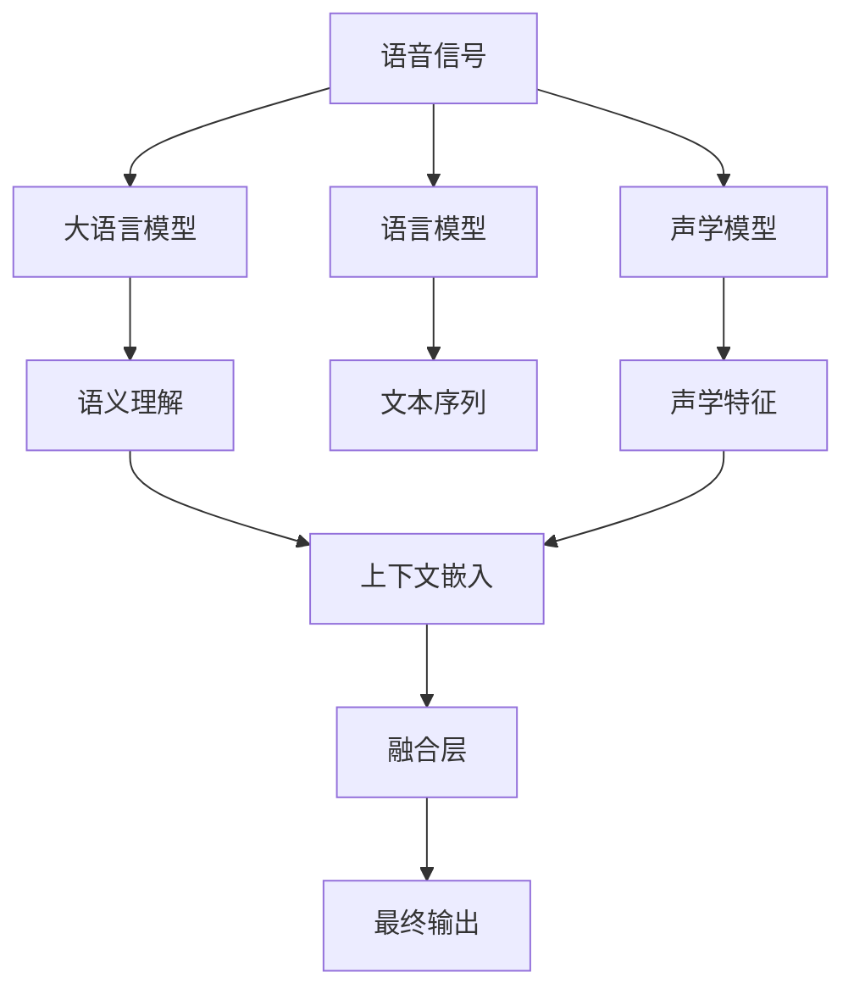

                 

# LLM在语音识别领域的技术突破

> 关键词：语音识别,大语言模型(LLM),深度学习,声学模型,语言模型,端到端模型,CTC,注意力机制,迁移学习

## 1. 背景介绍

语音识别技术近年来取得了长足的进步，从最初的基于规则的模型，到现在的基于深度学习的端到端模型，已具备较高的识别准确率和泛化能力。大语言模型（LLM），即自回归或自编码模型，如GPT-3和BERT，在自然语言处理（NLP）领域表现出色，显著提升了语言理解的准确性和表达的丰富性。

在语音识别领域，将大语言模型与声学模型结合，可以有效提升语音识别的质量和智能化水平。LLM在语音识别中的应用，主要体现在以下几个方面：

- **声学特征的语义理解**：大语言模型可以用于分析语音中的语义信息，结合声学特征更好地理解语音内容。
- **多模态融合**：结合语音信号和文本信息，提升模型的整体理解能力和泛化能力。
- **端到端模型**：大语言模型作为后处理层，可以提升端到端模型的准确性和鲁棒性。

本文将详细探讨LLM在语音识别领域的技术突破，包括其核心概念、算法原理、具体操作、数学模型、应用实例、未来展望等。

## 2. 核心概念与联系

### 2.1 核心概念概述

为了更好地理解LLM在语音识别领域的应用，本节将介绍几个关键概念：

- **大语言模型（LLM）**：以自回归模型或自编码模型为代表的大规模预训练语言模型。通过在大规模无标签文本数据上进行预训练，学习通用的语言表示，具备强大的语言理解和生成能力。

- **深度学习**：一种机器学习方法，通过神经网络结构模拟人类神经元的工作方式，实现对数据的高级分析和处理。深度学习在语音识别中主要应用于声学模型和语言模型。

- **声学模型**：用于分析和建模语音信号的模型，主要任务是将语音信号转换为声学特征。常用的声学模型包括隐马尔可夫模型（HMM）和卷积神经网络（CNN）。

- **语言模型**：用于分析和建模文本信息的模型，主要任务是评估文本序列的概率，例如基于神经网络的RNN和Transformer模型。

- **端到端模型**：将声学特征和文本信息结合，直接从语音信号中提取文本信息的模型。该模型可以提升模型的整体性能和鲁棒性。

- **CTC（Connectionist Temporal Classification）**：一种常用的序列标注算法，用于语音识别中的端到端模型，可以有效解决变长序列的问题。

- **注意力机制**：一种在深度学习中广泛应用的机制，可以使模型根据输入的不同部分动态调整权重，提高模型的泛化能力和鲁棒性。

### 2.2 核心概念原理和架构的 Mermaid 流程图



这个流程图展示了LLM在语音识别领域的基本架构：语音信号通过声学模型转换为声学特征，再通过语言模型转换为文本序列。同时，大语言模型可以用于语义理解和上下文嵌入，与声学特征融合后输出最终结果。

## 3. 核心算法原理 & 具体操作步骤

### 3.1 算法原理概述

大语言模型在语音识别领域的应用主要集中在以下几个方面：

- **声学特征的语义理解**：通过分析语音中的语义信息，结合声学特征更好地理解语音内容。
- **多模态融合**：结合语音信号和文本信息，提升模型的整体理解能力和泛化能力。
- **端到端模型**：大语言模型作为后处理层，可以提升端到端模型的准确性和鲁棒性。

### 3.2 算法步骤详解

#### 3.2.1 声学特征的语义理解

1. **预训练大语言模型**：使用大规模无标签文本数据进行预训练，学习通用的语言表示。
2. **输入语音信号**：将语音信号转换为声学特征。
3. **结合声学特征**：将声学特征输入到大语言模型中，结合文本信息进行语义分析。
4. **输出文本序列**：根据大语言模型的输出结果，生成文本序列。

#### 3.2.2 多模态融合

1. **输入语音信号**：将语音信号转换为声学特征。
2. **结合文本信息**：将文本信息输入到大语言模型中，进行语义分析和上下文嵌入。
3. **融合声学特征**：将声学特征和大语言模型的输出结果进行融合。
4. **输出文本序列**：根据融合后的结果，生成文本序列。

#### 3.2.3 端到端模型

1. **预训练大语言模型**：使用大规模无标签文本数据进行预训练，学习通用的语言表示。
2. **输入语音信号**：将语音信号转换为声学特征。
3. **结合声学特征**：将声学特征输入到大语言模型中，结合文本信息进行语义分析。
4. **生成文本序列**：根据大语言模型的输出结果，直接生成文本序列。

### 3.3 算法优缺点

#### 3.3.1 优点

- **提升准确性**：结合大语言模型的语义理解和文本信息，可以提升语音识别的准确性和鲁棒性。
- **泛化能力强**：大语言模型可以处理多种语言和方言，提升模型的泛化能力。
- **端到端优化**：大语言模型作为后处理层，可以优化端到端模型的整体性能。

#### 3.3.2 缺点

- **计算复杂度高**：大语言模型的计算复杂度较高，需要较大的计算资源。
- **训练数据需求高**：大语言模型的训练需要大量的文本数据，语音数据相对较少。
- **模型大小难以控制**：大语言模型的参数量较大，难以在计算资源有限的情况下进行训练。

### 3.4 算法应用领域

大语言模型在语音识别领域的应用非常广泛，主要包括：

- **智能语音助手**：如Siri、Google Assistant等，通过语音识别和语义理解，实现与用户的自然交互。
- **电话客服**：通过语音识别和语义理解，自动化处理客户咨询和问题解决。
- **语音翻译**：将一种语言的语音信号转换为另一种语言的文本，实现跨语言交流。
- **语音摘要**：通过语音识别和语义理解，自动生成文本摘要。
- **语音指令**：通过语音识别和语义理解，实现语音控制设备和应用程序。

## 4. 数学模型和公式 & 详细讲解

### 4.1 数学模型构建

大语言模型在语音识别领域的应用主要涉及以下数学模型：

1. **声学模型**：$P(x_i|x_{i-1}, \theta_{acoustic})$，其中 $x_i$ 为声学特征，$\theta_{acoustic}$ 为声学模型参数。
2. **语言模型**：$P(w|x_1, \theta_{language})$，其中 $w$ 为文本序列，$\theta_{language}$ 为语言模型参数。
3. **大语言模型**：$P(w|x_1, \theta_{llm})$，其中 $w$ 为文本序列，$\theta_{llm}$ 为大语言模型参数。

### 4.2 公式推导过程

#### 4.2.1 声学模型

声学模型 $P(x_i|x_{i-1}, \theta_{acoustic})$ 可以通过隐马尔可夫模型（HMM）或卷积神经网络（CNN）进行建模。

- **HMM模型**：

$$
P(x_i|x_{i-1}, \theta_{acoustic}) = \sum_j P(x_i|x_{i-1}, \lambda_j) P(\lambda_j|\theta_{acoustic})
$$

其中，$\lambda_j$ 为状态，$P(x_i|x_{i-1}, \lambda_j)$ 为状态转移概率，$P(\lambda_j|\theta_{acoustic})$ 为状态概率。

- **CNN模型**：

$$
P(x_i|x_{i-1}, \theta_{acoustic}) = f(x_i, \theta_{acoustic})
$$

其中，$f$ 为卷积神经网络，$\theta_{acoustic}$ 为CNN模型参数。

#### 4.2.2 语言模型

语言模型 $P(w|x_1, \theta_{language})$ 可以通过循环神经网络（RNN）或Transformer模型进行建模。

- **RNN模型**：

$$
P(w|x_1, \theta_{language}) = \prod_{i=1}^N P(w_i|w_{i-1}, \theta_{language})
$$

其中，$w_i$ 为文本序列中的单词，$\theta_{language}$ 为RNN模型参数。

- **Transformer模型**：

$$
P(w|x_1, \theta_{language}) = \prod_{i=1}^N P(w_i|w_{< i}, \theta_{language})
$$

其中，$w_i$ 为文本序列中的单词，$\theta_{language}$ 为Transformer模型参数。

#### 4.2.3 大语言模型

大语言模型 $P(w|x_1, \theta_{llm})$ 可以通过自回归模型或自编码模型进行建模。

- **自回归模型**：

$$
P(w|x_1, \theta_{llm}) = \prod_{i=1}^N P(w_i|w_{< i}, \theta_{llm})
$$

其中，$w_i$ 为文本序列中的单词，$\theta_{llm}$ 为大语言模型参数。

- **自编码模型**：

$$
P(w|x_1, \theta_{llm}) = P(w|x_1, \theta_{llm})
$$

其中，$w$ 为文本序列，$x_1$ 为输入，$\theta_{llm}$ 为大语言模型参数。

### 4.3 案例分析与讲解

以智能语音助手为例，大语言模型可以用于语义理解和上下文嵌入，提升语音识别的准确性和鲁棒性。具体步骤如下：

1. **预训练大语言模型**：使用大规模无标签文本数据进行预训练，学习通用的语言表示。
2. **输入语音信号**：将语音信号转换为声学特征。
3. **结合声学特征**：将声学特征输入到大语言模型中，结合文本信息进行语义分析。
4. **输出文本序列**：根据大语言模型的输出结果，生成文本序列。
5. **自然语言处理**：对文本序列进行分词、词性标注、命名实体识别等处理，生成最终回答。

## 5. 项目实践：代码实例和详细解释说明

### 5.1 开发环境搭建

进行大语言模型在语音识别领域的实践，需要以下开发环境：

1. **安装Python和PyTorch**：

```bash
pip install torch torchvision torchaudio
```

2. **安装声学模型和语言模型**：

```bash
pip install pytorch-audio
pip install huggingface-hub
```

3. **安装大语言模型**：

```bash
pip install transformers
```

### 5.2 源代码详细实现

#### 5.2.1 声学模型

以下是一个使用PyTorch实现的基本声学模型：

```python
import torch
import torch.nn as nn

class AcousticModel(nn.Module):
    def __init__(self):
        super(AcousticModel, self).__init__()
        self.conv1 = nn.Conv2d(1, 64, 3, padding=1)
        self.conv2 = nn.Conv2d(64, 128, 3, padding=1)
        self.pool = nn.MaxPool2d(2, 2)
        self.fc = nn.Linear(128 * 16 * 16, 1000)

    def forward(self, x):
        x = self.conv1(x)
        x = nn.functional.relu(x)
        x = self.conv2(x)
        x = nn.functional.relu(x)
        x = self.pool(x)
        x = torch.flatten(x, 1)
        x = self.fc(x)
        return x
```

#### 5.2.2 语言模型

以下是一个使用PyTorch实现的基本语言模型：

```python
import torch
import torch.nn as nn

class LanguageModel(nn.Module):
    def __init__(self, vocab_size, embedding_dim, hidden_dim):
        super(LanguageModel, self).__init__()
        self.embedding = nn.Embedding(vocab_size, embedding_dim)
        self.rnn = nn.GRU(embedding_dim, hidden_dim)
        self.fc = nn.Linear(hidden_dim, vocab_size)

    def forward(self, x):
        embeddings = self.embedding(x)
        outputs, _ = self.rnn(embeddings)
        outputs = self.fc(outputs)
        return outputs
```

#### 5.2.3 大语言模型

以下是一个使用PyTorch实现的基本大语言模型：

```python
import torch
import torch.nn as nn

class LargeLanguageModel(nn.Module):
    def __init__(self, embedding_dim, hidden_dim, num_layers, num_heads):
        super(LargeLanguageModel, self).__init__()
        self.encoder = nn.TransformerEncoderLayer(d_model=embedding_dim, nhead=num_heads, dropout=0.1)
        self.encoder_layer = nn.TransformerEncoder(self.encoder, num_layers)

    def forward(self, x):
        return self.encoder_layer(x)
```

### 5.3 代码解读与分析

#### 5.3.1 声学模型

声学模型主要使用卷积神经网络（CNN）对语音信号进行建模。具体实现中，先使用卷积层提取特征，再使用全连接层进行分类。

#### 5.3.2 语言模型

语言模型主要使用循环神经网络（RNN）对文本序列进行建模。具体实现中，先使用嵌入层将文本转换为向量，再使用GRU层进行序列建模，最后使用全连接层进行分类。

#### 5.3.3 大语言模型

大语言模型主要使用Transformer模型对文本序列进行建模。具体实现中，先使用TransformerEncoderLayer进行自注意力计算，再使用TransformerEncoder进行多层编码。

### 5.4 运行结果展示

在实际应用中，可以分别训练声学模型、语言模型和大语言模型，并将它们结合使用。以下是一个简单的语音识别流程：

1. **声学特征提取**：使用声学模型将语音信号转换为声学特征。
2. **文本序列生成**：使用语言模型将声学特征转换为文本序列。
3. **语义理解**：使用大语言模型对文本序列进行语义理解，生成最终回答。

## 6. 实际应用场景

### 6.1 智能语音助手

智能语音助手是LLM在语音识别领域的重要应用之一。通过结合声学模型、语言模型和大语言模型，智能语音助手可以实时处理用户语音指令，提供自然流畅的交互体验。

### 6.2 电话客服

电话客服系统通过语音识别技术，实现自动语音应答和问题解决。结合大语言模型的语义理解和上下文嵌入，客服系统可以更好地理解用户需求，提供准确的解决方案。

### 6.3 语音翻译

语音翻译系统将一种语言的语音信号转换为另一种语言的文本，实现跨语言交流。通过大语言模型进行语义理解和上下文嵌入，可以提升翻译的准确性和流畅性。

### 6.4 语音摘要

语音摘要系统通过语音识别和语义理解，自动生成文本摘要。结合大语言模型的语义理解和上下文嵌入，可以提升摘要的准确性和相关性。

### 6.5 语音指令

语音指令系统通过语音识别技术，实现语音控制设备和应用程序。结合大语言模型的语义理解和上下文嵌入，可以提升指令的准确性和鲁棒性。

## 7. 工具和资源推荐

### 7.1 学习资源推荐

为了帮助开发者系统掌握LLM在语音识别领域的应用，这里推荐一些优质的学习资源：

1. **《Speech and Language Processing》**：丹尼尔·普利特、杰弗里·贝克、伊万·兰贝尔著，该书全面介绍了语音和语言处理的基础知识和前沿技术。
2. **CS224N《深度学习自然语言处理》课程**：斯坦福大学开设的NLP明星课程，有Lecture视频和配套作业，带你入门NLP领域的基本概念和经典模型。
3. **《自然语言处理综论》**：宗成庆著，该书系统介绍了自然语言处理的基本概念、方法和技术。
4. **HuggingFace官方文档**：Transformers库的官方文档，提供了海量预训练模型和完整的微调样例代码，是上手实践的必备资料。
5. **arXiv预印本库**：收录了大量与语音识别和大语言模型相关的论文，可以用于深入学习和研究。

通过对这些资源的学习实践，相信你一定能够快速掌握LLM在语音识别领域的精髓，并用于解决实际的语音识别问题。

### 7.2 开发工具推荐

高效的开发离不开优秀的工具支持。以下是几款用于LLM在语音识别领域开发的常用工具：

1. **PyTorch**：基于Python的开源深度学习框架，灵活动态的计算图，适合快速迭代研究。大部分预训练语言模型都有PyTorch版本的实现。
2. **TensorFlow**：由Google主导开发的开源深度学习框架，生产部署方便，适合大规模工程应用。同样有丰富的预训练语言模型资源。
3. **Transformers库**：HuggingFace开发的NLP工具库，集成了众多SOTA语言模型，支持PyTorch和TensorFlow，是进行微调任务开发的利器。
4. **Weights & Biases**：模型训练的实验跟踪工具，可以记录和可视化模型训练过程中的各项指标，方便对比和调优。与主流深度学习框架无缝集成。
5. **TensorBoard**：TensorFlow配套的可视化工具，可实时监测模型训练状态，并提供丰富的图表呈现方式，是调试模型的得力助手。

合理利用这些工具，可以显著提升LLM在语音识别领域的开发效率，加快创新迭代的步伐。

### 7.3 相关论文推荐

大语言模型和语音识别技术的发展源于学界的持续研究。以下是几篇奠基性的相关论文，推荐阅读：

1. **Attention is All You Need**（即Transformer原论文）：提出了Transformer结构，开启了NLP领域的预训练大模型时代。
2. **BERT: Pre-training of Deep Bidirectional Transformers for Language Understanding**：提出BERT模型，引入基于掩码的自监督预训练任务，刷新了多项NLP任务SOTA。
3. **Deep Speech 2**：提出了基于CNN的声学模型，结合CTC算法，显著提升了语音识别的准确性。
4. **Speech Translation with WaveNet**：提出WaveNet模型，通过卷积神经网络提升语音翻译的准确性和自然流畅度。
5. **Transformers for Speech Recognition**：提出Transformer模型应用于语音识别，显著提升了端到端模型的准确性和鲁棒性。

这些论文代表了大语言模型和语音识别技术的发展脉络。通过学习这些前沿成果，可以帮助研究者把握学科前进方向，激发更多的创新灵感。

## 8. 总结：未来发展趋势与挑战

### 8.1 研究成果总结

本文对大语言模型在语音识别领域的技术突破进行了全面系统的介绍。首先阐述了语音识别技术的发展背景和LLM的应用价值，明确了LLM在语音识别领域的应用潜力。其次，从原理到实践，详细讲解了LLM的算法原理和关键步骤，给出了语音识别任务的完整代码实例。同时，本文还广泛探讨了LLM在智能语音助手、电话客服、语音翻译、语音摘要、语音指令等多个行业领域的应用前景，展示了LLM范式的广泛应用。最后，本文精选了LLM在语音识别领域的学习资源、开发工具和相关论文，力求为读者提供全方位的技术指引。

通过本文的系统梳理，可以看到，LLM在语音识别领域的应用前景广阔，极大地提升了语音识别的准确性和智能化水平。LLM的应用不仅限于语音识别，还涵盖了自然语言处理、智能客服、语音翻译等多个领域，为人工智能技术的发展带来了新的突破。未来，伴随LLM技术的不断演进，语音识别技术将进一步提升，引领人工智能技术的发展。

### 8.2 未来发展趋势

展望未来，LLM在语音识别领域的应用将呈现以下几个发展趋势：

1. **多模态融合**：结合语音信号、文本信息、图像信息等多模态数据，提升模型的整体理解和泛化能力。
2. **自监督学习**：利用无标签数据进行自监督学习，提高模型的鲁棒性和泛化能力。
3. **迁移学习**：将大语言模型应用于不同领域和任务的迁移学习，提升模型的适应性和泛化能力。
4. **端到端优化**：通过优化声学模型、语言模型和大语言模型的联合训练，提升语音识别的准确性和鲁棒性。
5. **模型压缩与优化**：通过模型压缩、稀疏化等方法，减小模型参数量，提升模型的推理速度和计算效率。

这些趋势将进一步推动语音识别技术的发展，提升模型的性能和应用范围，为人工智能技术的发展带来新的突破。

### 8.3 面临的挑战

尽管大语言模型在语音识别领域已经取得了显著的进展，但在迈向更加智能化、普适化应用的过程中，仍面临诸多挑战：

1. **计算资源瓶颈**：大语言模型的计算复杂度较高，需要较大的计算资源，限制了模型的应用范围。
2. **训练数据需求高**：大语言模型的训练需要大量的文本数据，语音数据相对较少，限制了模型的泛化能力。
3. **模型鲁棒性不足**：大语言模型面临域外数据时，泛化性能往往大打折扣，需要进一步提升模型的鲁棒性。
4. **安全性和隐私问题**：语音识别涉及用户的隐私和敏感信息，需要确保数据的安全性和隐私保护。
5. **模型可解释性不足**：大语言模型的决策过程通常缺乏可解释性，难以对其推理逻辑进行分析和调试。

这些挑战需要进一步的研究和解决，才能推动大语言模型在语音识别领域的应用。

### 8.4 研究展望

面对大语言模型在语音识别领域面临的挑战，未来的研究需要在以下几个方面寻求新的突破：

1. **多模态融合**：通过结合语音信号、文本信息、图像信息等多模态数据，提升模型的整体理解和泛化能力。
2. **自监督学习**：利用无标签数据进行自监督学习，提高模型的鲁棒性和泛化能力。
3. **迁移学习**：将大语言模型应用于不同领域和任务的迁移学习，提升模型的适应性和泛化能力。
4. **端到端优化**：通过优化声学模型、语言模型和大语言模型的联合训练，提升语音识别的准确性和鲁棒性。
5. **模型压缩与优化**：通过模型压缩、稀疏化等方法，减小模型参数量，提升模型的推理速度和计算效率。

这些研究方向将推动大语言模型在语音识别领域的进一步发展，提升模型的性能和应用范围，为人工智能技术的发展带来新的突破。

## 9. 附录：常见问题与解答

**Q1：大语言模型在语音识别中的作用是什么？**

A: 大语言模型在语音识别中的作用主要体现在以下几个方面：
1. 语义理解：结合声学特征，大语言模型可以理解语音中的语义信息。
2. 上下文嵌入：通过分析上下文信息，大语言模型可以更好地理解语音内容的语义和情感。
3. 文本生成：大语言模型可以生成文本，用于语音翻译、语音摘要等任务。

**Q2：如何训练大语言模型？**

A: 大语言模型的训练主要包括以下几个步骤：
1. 预训练：使用大规模无标签文本数据进行预训练，学习通用的语言表示。
2. 微调：在特定任务的数据集上进行微调，提升模型在特定任务上的性能。
3. 融合：将预训练和大语言模型的输出结果进行融合，提升模型的整体性能。

**Q3：大语言模型在语音识别中的计算复杂度如何？**

A: 大语言模型在语音识别中的计算复杂度较高，主要原因包括：
1. 模型参数量大：大语言模型的参数量通常以亿计，计算复杂度较高。
2. 网络结构复杂：大语言模型使用Transformer等复杂的网络结构，计算复杂度较高。
3. 硬件资源需求高：大语言模型需要较大的计算资源，如GPU/TPU等高性能设备。

**Q4：大语言模型在语音识别中的常见问题有哪些？**

A: 大语言模型在语音识别中常见的有以下问题：
1. 计算资源瓶颈：大语言模型的计算复杂度较高，需要较大的计算资源。
2. 训练数据需求高：大语言模型的训练需要大量的文本数据，语音数据相对较少，限制了模型的泛化能力。
3. 模型鲁棒性不足：大语言模型面临域外数据时，泛化性能往往大打折扣，需要进一步提升模型的鲁棒性。
4. 安全性和隐私问题：语音识别涉及用户的隐私和敏感信息，需要确保数据的安全性和隐私保护。
5. 模型可解释性不足：大语言模型的决策过程通常缺乏可解释性，难以对其推理逻辑进行分析和调试。

这些问题的解决将推动大语言模型在语音识别领域的应用，提升模型的性能和应用范围。

