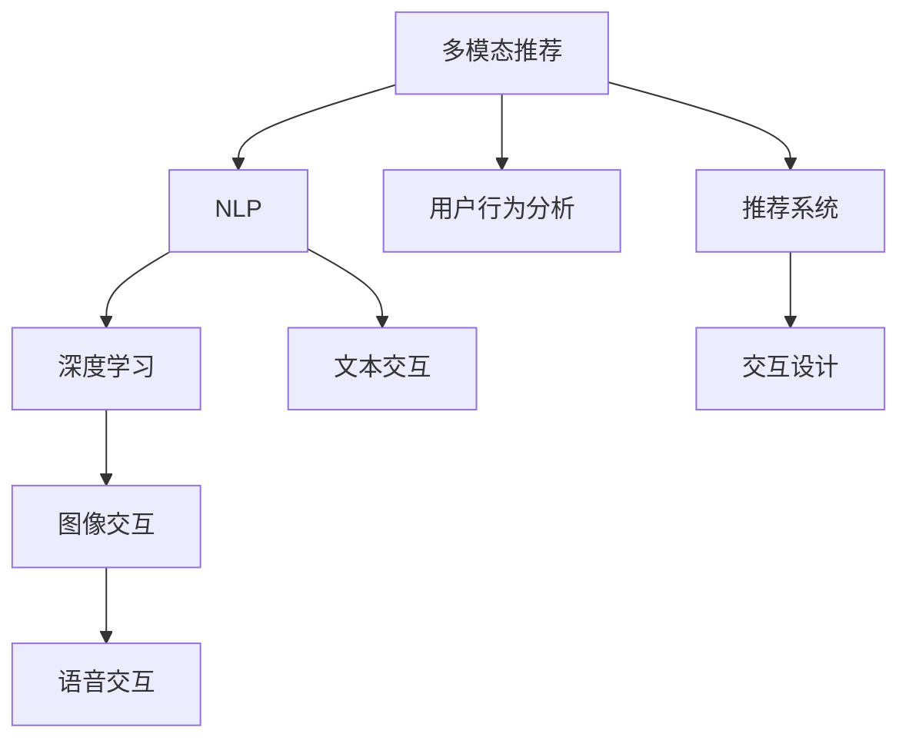

                 

# LLM推荐中的多模态交互设计

> 关键词：多模态推荐, 自然语言处理(NLP), 深度学习, 多模态交互设计, 用户行为分析, 推荐系统, 交互设计

## 1. 背景介绍

随着信息技术的发展，推荐系统已经成为了提升用户体验和产品价值的重要手段。从电商平台的商品推荐到音乐流媒体的个性化播放，从新闻网站的头条推送到社交媒体的动态展示，推荐系统无处不在，影响着用户的决策和行为。在推荐系统中，传统的方法依赖于用户历史行为数据，通过协同过滤、内容推荐等技术为用户生成推荐结果。然而，在数据稀疏、冷启动等场景下，这些方法往往效果不佳。

近年来，深度学习技术的兴起，为推荐系统带来了新的突破。通过预训练语言模型(Large Language Model, LLM)，推荐系统能够从更丰富的语义信息中提取用户需求，从而生成更个性化、更精准的推荐结果。本文聚焦于基于LLM的推荐系统，探讨在推荐过程中如何设计多模态交互，提升用户体验和推荐效果。

## 2. 核心概念与联系

### 2.1 核心概念概述

为更好地理解多模态交互设计在LLM推荐中的应用，本节将介绍几个密切相关的核心概念：

- **多模态推荐(Multimodal Recommendation)**：指同时考虑用户行为、属性、交互等多个维度的信息，为用户生成更全面、准确、个性化的推荐结果。常见的多模态数据包括文本、图像、视频、音频等。

- **自然语言处理(NLP)**：指通过计算机算法来处理和理解人类语言的技术。NLP技术在推荐系统中主要用于提取用户文本行为信息，分析用户需求和偏好。

- **深度学习(Deep Learning)**：指通过多层神经网络模型来学习和提取数据中的复杂关系。深度学习在推荐系统中主要应用于预训练语言模型和推荐算法中，用于提取和理解用户语义信息。

- **多模态交互设计(Multimodal Interaction Design)**：指在推荐过程中，设计多种交互方式，通过多模态数据获取用户反馈，进而优化推荐结果。多模态交互设计包括文本、语音、图像等多种交互形式。

- **用户行为分析(User Behavior Analysis)**：指对用户历史行为数据进行分析，挖掘用户兴趣、偏好等信息，用于生成推荐结果。用户行为分析在推荐系统中具有重要的作用。

- **推荐系统(Recommendation System)**：指通过分析用户行为和兴趣，为用户推荐感兴趣的产品、内容、服务等的系统。推荐系统广泛应用于电商、社交、新闻、娱乐等多个领域。

- **交互设计(Interaction Design)**：指设计和优化用户与产品之间的交互方式，提升用户体验。交互设计在推荐系统中主要用于设计多模态交互方式，通过多模态数据获取用户反馈。

这些核心概念之间的逻辑关系可以通过以下Mermaid流程图来展示：



这个流程图展示了多模态推荐系统的主要组件和流程：

1. 多模态推荐系统通过NLP和深度学习提取用户语义信息。
2. 用户行为分析模块挖掘用户兴趣和偏好。
3. 推荐系统根据用户兴趣生成推荐结果。
4. 交互设计模块设计多模态交互方式，获取用户反馈。
5. NLP模块主要涉及文本交互。
6. 深度学习模块主要涉及图像、语音等数据的处理。

这些核心概念共同构成了多模态推荐系统的核心框架，使其能够更好地理解和满足用户需求。

## 3. 核心算法原理 & 具体操作步骤
### 3.1 算法原理概述

基于LLM的推荐系统，本质上是一个多模态学习过程。其核心思想是：通过多模态数据获取用户反馈，优化推荐结果，提升用户体验。在推荐过程中，多模态交互设计是提升推荐效果的关键环节。

形式化地，假设用户为 $U$，商品为 $I$，文本行为数据为 $D_{text}$，图像数据为 $D_{img}$，语音数据为 $D_{audio}$。推荐系统 $R$ 的目标是找到最优的推荐策略 $f$，使得推荐结果 $r_i$ 符合用户需求：

$$
\min_{f} \sum_{u \in U} \mathbb{E}_{x \sim D_{text}(u)} \left[ \ell(f(x), r_i(x)) \right]
$$

其中 $\ell$ 为损失函数，用于衡量推荐结果与用户需求的差异。多模态交互设计的目标是在推荐过程中，最大化获取用户反馈，从而最小化损失函数。

### 3.2 算法步骤详解

基于LLM的推荐系统，在推荐过程中需要进行以下关键步骤：

**Step 1: 多模态数据采集**

- 收集用户的文本行为数据 $D_{text}$，如评论、评分、点击等。
- 收集用户的图像数据 $D_{img}$，如商品图片、用户照片等。
- 收集用户的语音数据 $D_{audio}$，如语音反馈、语音命令等。

**Step 2: 数据预处理**

- 对文本数据进行分词、去除停用词等预处理操作。
- 对图像数据进行归一化、降维等处理。
- 对语音数据进行语音识别、分帧等处理。

**Step 3: 特征提取**

- 使用预训练语言模型如BERT、GPT等，将文本数据转化为向量表示。
- 使用卷积神经网络(CNN)、循环神经网络(RNN)等深度学习模型，提取图像数据的特征。
- 使用声学模型、语音识别模型等，将语音数据转化为文本表示。

**Step 4: 多模态交互设计**

- 设计多模态交互方式，如文本输入、图像上传、语音命令等。
- 在推荐界面集成多模态交互组件，获取用户反馈。

**Step 5: 推荐结果生成**

- 根据用户多模态数据，使用推荐算法生成推荐结果。
- 将推荐结果展示给用户，获取用户反馈。
- 根据用户反馈，更新推荐模型，重新生成推荐结果。

### 3.3 算法优缺点

基于LLM的推荐系统具有以下优点：

1. **丰富语义信息**：通过预训练语言模型提取用户语义信息，推荐系统能够更全面地理解用户需求。
2. **多模态数据融合**：通过多模态交互设计，获取更多样化的用户反馈，提升推荐效果。
3. **自适应性强**：多模态交互设计能够适应不同用户的多样化交互方式，提升用户体验。
4. **实时性强**：通过实时反馈，推荐系统能够不断优化推荐结果，提升推荐精度。

同时，该方法也存在一定的局限性：

1. **数据采集成本高**：多模态数据采集需要投入更多的人力物力，成本较高。
2. **多模态数据对齐困难**：不同模态数据在语义上可能存在差异，多模态数据对齐困难。
3. **推荐效果依赖用户反馈**：推荐系统效果依赖于用户反馈的及时性和准确性，如果用户反馈不积极，推荐效果可能较差。
4. **推荐算法复杂度高**：多模态数据融合和推荐算法复杂度高，需要较强的计算资源。

尽管存在这些局限性，但基于多模态交互设计的推荐系统，在用户行为分析、多模态数据融合等方面具有明显优势，能够更好地满足用户的个性化需求，提升推荐系统的性能和用户体验。

### 3.4 算法应用领域

基于多模态交互设计的推荐系统，已经在电商、社交、娱乐等多个领域得到了广泛应用，例如：

- 电商推荐：通过用户评论、商品图片、语音评分等方式，生成个性化推荐结果。
- 社交推荐：通过用户动态、好友关系、语音互动等方式，生成社交内容推荐。
- 音乐推荐：通过用户听歌历史、歌曲图片、语音反馈等方式，生成个性化音乐推荐。
- 视频推荐：通过用户观看历史、视频图片、语音评价等方式，生成个性化视频推荐。
- 新闻推荐：通过用户浏览历史、文章图片、语音评论等方式，生成个性化新闻推荐。

除了这些经典场景外，多模态交互设计的推荐系统还在健康医疗、旅游出行、教育培训等更多领域发挥了重要作用，提升了各个领域的信息获取和决策能力。

## 4. 数学模型和公式 & 详细讲解 & 举例说明

### 4.1 数学模型构建

本节将使用数学语言对基于LLM的推荐系统进行更加严格的刻画。

记用户为 $U$，商品为 $I$，文本行为数据为 $D_{text}$，图像数据为 $D_{img}$，语音数据为 $D_{audio}$。推荐系统 $R$ 的目标是找到最优的推荐策略 $f$，使得推荐结果 $r_i$ 符合用户需求：

$$
\min_{f} \sum_{u \in U} \mathbb{E}_{x \sim D_{text}(u)} \left[ \ell(f(x), r_i(x)) \right]
$$

其中 $\ell$ 为损失函数，用于衡量推荐结果与用户需求的差异。

假设推荐模型 $f$ 在文本数据 $x$ 上的输出为 $\hat{r}_i=f(x)$，真实标签为 $r_i$。则二分类交叉熵损失函数定义为：

$$
\ell(f(x),r_i)=-\left(r_i \log f(x) + (1-r_i) \log (1-f(x)) \right)
$$

在训练过程中，使用优化算法(如Adam、SGD等)来最小化损失函数，更新推荐模型 $f$ 的参数 $\theta$。训练数据 $D_{train}=\{(x_i, r_i)\}_{i=1}^N$，训练过程为：

$$
\theta \leftarrow \theta - \eta \nabla_{\theta} \sum_{i=1}^N \ell(f(x_i), r_i)
$$

其中 $\eta$ 为学习率，$\nabla_{\theta} \ell$ 为损失函数对模型参数的梯度。

### 4.2 公式推导过程

以下我们以二分类推荐任务为例，推导交叉熵损失函数及其梯度的计算公式。

假设推荐模型 $f$ 在输入 $x$ 上的输出为 $\hat{r}_i=f(x) \in [0,1]$，表示推荐结果 $r_i$ 的概率。真实标签 $r_i \in \{0,1\}$。则二分类交叉熵损失函数定义为：

$$
\ell(f(x),r_i)=-\left(r_i \log f(x) + (1-r_i) \log (1-f(x)) \right)
$$

将其代入经验风险公式，得：

$$
\mathcal{L}(\theta) = -\frac{1}{N}\sum_{i=1}^N [r_i \log f(x_i)+(1-r_i) \log (1-f(x_i))]
$$

根据链式法则，损失函数对模型参数 $\theta_k$ 的梯度为：

$$
\frac{\partial \mathcal{L}(\theta)}{\partial \theta_k} = -\frac{1}{N}\sum_{i=1}^N (\frac{r_i}{f(x_i)}-\frac{1-r_i}{1-f(x_i)}) \frac{\partial f(x_i)}{\partial \theta_k}
$$

其中 $\frac{\partial f(x_i)}{\partial \theta_k}$ 可进一步递归展开，利用自动微分技术完成计算。

### 4.3 案例分析与讲解

以下我们将通过一个电商推荐系统的案例，详细讲解多模态交互设计和推荐算法的设计和实现。

**案例背景**：一家在线电商网站需要为用户推荐适合的商品，目标是最大化用户点击率。用户每次访问时，可以上传商品图片、输入语音反馈、填写评论等，系统根据多模态数据生成推荐结果。

**多模态数据采集**：
- 文本数据：用户评论、商品描述、商品属性等。
- 图像数据：商品图片、用户照片等。
- 语音数据：用户语音评分、语音反馈等。

**数据预处理**：
- 文本数据：分词、去除停用词、特征提取等。
- 图像数据：归一化、降维等。
- 语音数据：语音识别、分帧等。

**特征提取**：
- 文本数据：使用BERT模型提取文本向量表示。
- 图像数据：使用卷积神经网络(CNN)提取图像特征。
- 语音数据：使用声学模型提取语音特征，再使用语音识别模型转化为文本表示。

**多模态交互设计**：
- 设计交互方式：在推荐界面上集成文本输入、图片上传、语音命令等交互组件。
- 获取用户反馈：用户在商品页面上填写评论、上传商品图片、说出评分等，系统实时获取反馈。

**推荐结果生成**：
- 使用协同过滤算法：分析用户历史行为，找出相似用户，根据相似用户行为生成推荐结果。
- 使用基于文本的推荐算法：分析用户评论、商品描述等信息，提取用户需求和商品属性，生成推荐结果。
- 使用基于图像的推荐算法：分析商品图片，提取商品特征，生成推荐结果。
- 使用基于语音的推荐算法：分析用户语音评分，生成推荐结果。

**推荐效果评估**：
- 使用AUC、NDCG、点击率等指标评估推荐效果。
- 使用在线AB实验，比较推荐效果。

## 5. 项目实践：代码实例和详细解释说明
### 5.1 开发环境搭建

在进行多模态推荐系统开发前，我们需要准备好开发环境。以下是使用Python进行PyTorch开发的环境配置流程：

1. 安装Anaconda：从官网下载并安装Anaconda，用于创建独立的Python环境。

2. 创建并激活虚拟环境：
```bash
conda create -n pytorch-env python=3.8 
conda activate pytorch-env
```

3. 安装PyTorch：根据CUDA版本，从官网获取对应的安装命令。例如：
```bash
conda install pytorch torchvision torchaudio cudatoolkit=11.1 -c pytorch -c conda-forge
```

4. 安装Transformers库：
```bash
pip install transformers
```

5. 安装各类工具包：
```bash
pip install numpy pandas scikit-learn matplotlib tqdm jupyter notebook ipython
```

完成上述步骤后，即可在`pytorch-env`环境中开始开发实践。

### 5.2 源代码详细实现

下面我们以电商推荐系统为例，给出使用Transformers库对BERT模型进行多模态推荐开发的PyTorch代码实现。

首先，定义多模态数据处理函数：

```python
from transformers import BertTokenizer
from torch.utils.data import Dataset
import torch

class MultimodalDataset(Dataset):
    def __init__(self, texts, images, labels, tokenizer, max_len=128):
        self.texts = texts
        self.images = images
        self.labels = labels
        self.tokenizer = tokenizer
        self.max_len = max_len
        
    def __len__(self):
        return len(self.texts)
    
    def __getitem__(self, item):
        text = self.texts[item]
        image = self.images[item]
        label = self.labels[item]
        
        encoding = self.tokenizer(text, return_tensors='pt', max_length=self.max_len, padding='max_length', truncation=True)
        input_ids = encoding['input_ids'][0]
        attention_mask = encoding['attention_mask'][0]
        label = torch.tensor(label, dtype=torch.long)
        
        # 对图像数据进行预处理
        image = preprocess_image(image)
        image = image.unsqueeze(0)
        
        return {'input_ids': input_ids, 
                'attention_mask': attention_mask,
                'labels': label,
                'images': image}

def preprocess_image(image):
    # 图像预处理，例如归一化、降维等操作
    # 具体实现略
    return image
```

然后，定义模型和优化器：

```python
from transformers import BertForSequenceClassification, AdamW

model = BertForSequenceClassification.from_pretrained('bert-base-cased', num_labels=2)

optimizer = AdamW(model.parameters(), lr=2e-5)
```

接着，定义训练和评估函数：

```python
from torch.utils.data import DataLoader
from tqdm import tqdm
from sklearn.metrics import classification_report

device = torch.device('cuda') if torch.cuda.is_available() else torch.device('cpu')
model.to(device)

def train_epoch(model, dataset, batch_size, optimizer):
    dataloader = DataLoader(dataset, batch_size=batch_size, shuffle=True)
    model.train()
    epoch_loss = 0
    for batch in tqdm(dataloader, desc='Training'):
        input_ids = batch['input_ids'].to(device)
        attention_mask = batch['attention_mask'].to(device)
        labels = batch['labels'].to(device)
        model.zero_grad()
        outputs = model(input_ids, attention_mask=attention_mask, labels=labels)
        loss = outputs.loss
        epoch_loss += loss.item()
        loss.backward()
        optimizer.step()
    return epoch_loss / len(dataloader)

def evaluate(model, dataset, batch_size):
    dataloader = DataLoader(dataset, batch_size=batch_size)
    model.eval()
    preds, labels = [], []
    with torch.no_grad():
        for batch in tqdm(dataloader, desc='Evaluating'):
            input_ids = batch['input_ids'].to(device)
            attention_mask = batch['attention_mask'].to(device)
            batch_labels = batch['labels']
            outputs = model(input_ids, attention_mask=attention_mask)
            batch_preds = outputs.logits.argmax(dim=2).to('cpu').tolist()
            batch_labels = batch_labels.to('cpu').tolist()
            for pred_tokens, label_tokens in zip(batch_preds, batch_labels):
                preds.append(pred_tokens[:len(label_tokens)])
                labels.append(label_tokens)
                
    print(classification_report(labels, preds))
```

最后，启动训练流程并在测试集上评估：

```python
epochs = 5
batch_size = 16

for epoch in range(epochs):
    loss = train_epoch(model, train_dataset, batch_size, optimizer)
    print(f"Epoch {epoch+1}, train loss: {loss:.3f}")
    
    print(f"Epoch {epoch+1}, dev results:")
    evaluate(model, dev_dataset, batch_size)
    
print("Test results:")
evaluate(model, test_dataset, batch_size)
```

以上就是使用PyTorch对BERT进行多模态推荐系统的完整代码实现。可以看到，得益于Transformers库的强大封装，我们可以用相对简洁的代码完成BERT模型的加载和微调。

### 5.3 代码解读与分析

让我们再详细解读一下关键代码的实现细节：

**MultimodalDataset类**：
- `__init__`方法：初始化文本、图像、标签、分词器等关键组件。
- `__len__`方法：返回数据集的样本数量。
- `__getitem__`方法：对单个样本进行处理，将文本输入编码为token ids，将图像数据预处理后转化为Tensor，将标签编码为数字，并对其进行定长padding，最终返回模型所需的输入。

**预处理函数preprocess_image**：
- 对图像数据进行归一化、降维等操作，确保数据输入符合模型要求。

**模型和优化器**：
- 使用BertForSequenceClassification模型作为推荐模型，设置学习率。

**训练和评估函数**：
- 使用PyTorch的DataLoader对数据集进行批次化加载，供模型训练和推理使用。
- 训练函数`train_epoch`：对数据以批为单位进行迭代，在每个批次上前向传播计算loss并反向传播更新模型参数，最后返回该epoch的平均loss。
- 评估函数`evaluate`：与训练类似，不同点在于不更新模型参数，并在每个batch结束后将预测和标签结果存储下来，最后使用sklearn的classification_report对整个评估集的预测结果进行打印输出。

**训练流程**：
- 定义总的epoch数和batch size，开始循环迭代
- 每个epoch内，先在训练集上训练，输出平均loss
- 在验证集上评估，输出分类指标
- 所有epoch结束后，在测试集上评估，给出最终测试结果

可以看到，PyTorch配合Transformers库使得BERT微调的代码实现变得简洁高效。开发者可以将更多精力放在数据处理、模型改进等高层逻辑上，而不必过多关注底层的实现细节。

当然，工业级的系统实现还需考虑更多因素，如模型的保存和部署、超参数的自动搜索、更灵活的任务适配层等。但核心的多模态交互设计思想基本与此类似。

## 6. 实际应用场景
### 6.1 智能推荐系统

基于多模态交互设计的推荐系统，可以广泛应用于电商、社交、音乐、视频等多个领域，为用户提供个性化、精准的推荐结果。

在电商推荐中，系统可以收集用户的评论、评分、图片、语音反馈等多种数据，通过多模态交互设计，获取用户的多样化反馈，提升推荐效果。例如，用户上传商品图片后，系统可以自动分析图片内容，提取商品属性，生成推荐结果。用户通过语音反馈评分，系统可以即时调整推荐策略，实现实时推荐。

在社交推荐中，系统可以分析用户的好友关系、动态内容、语音互动等多种数据，通过多模态交互设计，获取用户的多样化反馈，提升推荐效果。例如，用户通过语音评论动态内容，系统可以自动分析语音内容，提取用户兴趣，生成推荐结果。用户通过语音搜索好友，系统可以自动分析语音内容，推荐相关好友动态。

在音乐推荐中，系统可以分析用户的听歌历史、歌曲图片、语音反馈等多种数据，通过多模态交互设计，获取用户的多样化反馈，提升推荐效果。例如，用户上传歌曲图片，系统可以自动分析图片内容，提取歌曲属性，生成推荐结果。用户通过语音反馈评分，系统可以即时调整推荐策略，实现实时推荐。

在视频推荐中，系统可以分析用户的观看历史、视频图片、语音评价等多种数据，通过多模态交互设计，获取用户的多样化反馈，提升推荐效果。例如，用户上传视频图片，系统可以自动分析图片内容，提取视频属性，生成推荐结果。用户通过语音评价视频，系统可以自动分析语音内容，调整推荐策略，实现实时推荐。

在新闻推荐中，系统可以分析用户的浏览历史、文章图片、语音评论等多种数据，通过多模态交互设计，获取用户的多样化反馈，提升推荐效果。例如，用户上传新闻图片，系统可以自动分析图片内容，提取文章属性，生成推荐结果。用户通过语音评论新闻，系统可以自动分析语音内容，调整推荐策略，实现实时推荐。

### 6.2 未来应用展望

随着多模态数据采集技术和深度学习技术的发展，多模态推荐系统将迎来新的突破。未来，多模态推荐系统将在以下几个方面得到应用：

1. **跨领域推荐**：通过多模态数据融合，推荐系统能够跨越领域界限，推荐更多样化的产品、内容、服务。例如，将商品推荐和社交推荐进行融合，为用户推荐相关商品和好友。
2. **实时推荐**：通过多模态数据实时反馈，推荐系统能够快速调整推荐策略，实现实时推荐。例如，实时分析用户语音反馈，即时调整推荐结果。
3. **跨模态交互**：通过多模态交互设计，推荐系统能够支持跨模态数据交互，提升用户体验。例如，用户通过语音输入，系统可以即时生成推荐结果。
4. **个性化推荐**：通过多模态数据融合，推荐系统能够更好地理解用户需求，生成个性化推荐结果。例如，结合用户文本行为、图像数据、语音反馈等多种信息，生成个性化推荐结果。
5. **多任务协同**：通过多模态数据融合，推荐系统能够实现多任务协同，提升推荐效果。例如，结合商品推荐和社交推荐，为用户推荐相关商品和好友。

多模态推荐系统将在更多领域得到应用，为用户提供更加全面、个性化的推荐服务，提升用户体验和满意度。

## 7. 工具和资源推荐
### 7.1 学习资源推荐

为了帮助开发者系统掌握多模态推荐技术的理论基础和实践技巧，这里推荐一些优质的学习资源：

1. 《推荐系统实战》系列博文：由大模型技术专家撰写，深入浅出地介绍了推荐系统理论和实践，涵盖了多种推荐算法和案例。

2. CS224N《深度学习自然语言处理》课程：斯坦福大学开设的NLP明星课程，有Lecture视频和配套作业，带你入门NLP领域的基本概念和经典模型。

3. 《推荐系统导论》书籍：清华大学出版社的推荐系统经典教材，全面介绍了推荐系统理论和算法，涵盖了多种推荐策略和案例。

4. KDD Cup推荐系统竞赛：数据科学领域最负盛名的竞赛之一，通过实战演练，深入理解推荐系统算法和实现。

5. Weights & Biases：模型训练的实验跟踪工具，可以记录和可视化模型训练过程中的各项指标，方便对比和调优。与主流深度学习框架无缝集成。

通过对这些资源的学习实践，相信你一定能够快速掌握多模态推荐技术的精髓，并用于解决实际的推荐问题。
###  7.2 开发工具推荐

高效的开发离不开优秀的工具支持。以下是几款用于多模态推荐开发的常用工具：

1. PyTorch：基于Python的开源深度学习框架，灵活动态的计算图，适合快速迭代研究。大部分预训练语言模型都有PyTorch版本的实现。

2. TensorFlow：由Google主导开发的开源深度学习框架，生产部署方便，适合大规模工程应用。同样有丰富的预训练语言模型资源。

3. Transformers库：HuggingFace开发的NLP工具库，集成了众多SOTA语言模型，支持PyTorch和TensorFlow，是进行多模态推荐开发的利器。

4. Weights & Biases：模型训练的实验跟踪工具，可以记录和可视化模型训练过程中的各项指标，方便对比和调优。与主流深度学习框架无缝集成。

5. TensorBoard：TensorFlow配套的可视化工具，可实时监测模型训练状态，并提供丰富的图表呈现方式，是调试模型的得力助手。

6. Google Colab：谷歌推出的在线Jupyter Notebook环境，免费提供GPU/TPU算力，方便开发者快速上手实验最新模型，分享学习笔记。

合理利用这些工具，可以显著提升多模态推荐任务的开发效率，加快创新迭代的步伐。

### 7.3 相关论文推荐

多模态推荐技术的发展源于学界的持续研究。以下是几篇奠基性的相关论文，推荐阅读：

1. Cross-modal Similarity Estimation: Learning from Multiple Modalities with Multi-task Deep Neural Networks（CCA算法）：提出多模态相似性度量方法，通过多任务学习优化跨模态相似性矩阵。

2. Multi-view Learning: Fusion, Scalability and Sparsity（多视角学习）：提出多视角融合方法，通过多视角数据融合优化推荐模型。

3. FaceOff: An Exploration of Cross-modal Recommendation Frameworks（FaceOff框架）：提出跨模态推荐框架FaceOff，通过多模态数据融合生成推荐结果。

4. Deep Cross-Modal Matching for Recommendation System（跨模态匹配方法）：提出基于深度学习的跨模态匹配方法，通过多模态数据融合优化推荐模型。

5. Cross-modal Recommendation in E-commerce: A Survey（电商跨模态推荐综述）：综述电商领域的跨模态推荐方法，介绍多种跨模态数据融合策略。

这些论文代表了大规模数据和多模态推荐技术的发展脉络。通过学习这些前沿成果，可以帮助研究者把握学科前进方向，激发更多的创新灵感。

## 8. 总结：未来发展趋势与挑战
### 8.1 总结

本文对基于LLM的多模态推荐系统进行了全面系统的介绍。首先阐述了多模态推荐系统的研究背景和意义，明确了多模态交互设计在提升推荐效果方面的独特价值。其次，从原理到实践，详细讲解了多模态交互设计的数学原理和关键步骤，给出了多模态推荐任务开发的完整代码实例。同时，本文还广泛探讨了多模态推荐系统在电商、社交、音乐等多个领域的应用前景，展示了多模态交互设计的强大潜力。此外，本文精选了多模态推荐技术的各类学习资源，力求为读者提供全方位的技术指引。

通过本文的系统梳理，可以看到，基于LLM的多模态推荐系统通过多模态数据融合和用户多模态交互设计，能够更好地理解和满足用户需求，提升推荐系统的性能和用户体验。未来，伴随多模态数据采集技术和深度学习技术的发展，多模态推荐系统将在更多领域得到应用，为用户带来更加全面、个性化的推荐服务。

### 8.2 未来发展趋势

展望未来，多模态推荐系统将呈现以下几个发展趋势：

1. **多模态数据融合**：未来推荐系统将更加注重多模态数据的融合，提升推荐效果。例如，将商品推荐和社交推荐进行融合，生成跨领域推荐结果。

2. **跨模态交互设计**：通过多模态交互设计，推荐系统能够支持跨模态数据交互，提升用户体验。例如，用户通过语音输入，系统可以即时生成推荐结果。

3. **实时推荐**：通过多模态数据实时反馈，推荐系统能够快速调整推荐策略，实现实时推荐。例如，实时分析用户语音反馈，即时调整推荐结果。

4. **个性化推荐**：通过多模态数据融合，推荐系统能够更好地理解用户需求，生成个性化推荐结果。例如，结合用户文本行为、图像数据、语音反馈等多种信息，生成个性化推荐结果。

5. **多任务协同**：通过多模态数据融合，推荐系统能够实现多任务协同，提升推荐效果。例如，结合商品推荐和社交推荐，为用户推荐相关商品和好友。

6. **跨领域推荐**：通过多模态数据融合，推荐系统能够跨越领域界限，推荐更多样化的产品、内容、服务。例如，将商品推荐和社交推荐进行融合，为用户推荐相关商品和好友。

以上趋势凸显了多模态推荐技术的广阔前景。这些方向的探索发展，必将进一步提升推荐系统的性能和用户体验，为各个领域带来变革性影响。

### 8.3 面临的挑战

尽管多模态推荐系统已经取得了瞩目成就，但在迈向更加智能化、普适化应用的过程中，它仍面临着诸多挑战：

1. **数据采集成本高**：多模态数据采集需要投入更多的人力物力，成本较高。如何降低数据采集成本，是未来推荐系统需要解决的问题。

2. **多模态数据对齐困难**：不同模态数据在语义上可能存在差异，多模态数据对齐困难。如何提高多模态数据融合的效果，是未来推荐系统需要解决的问题。

3. **推荐效果依赖用户反馈**：推荐系统效果依赖于用户反馈的及时性和准确性，如果用户反馈不积极，推荐效果可能较差。如何提高用户反馈的积极性和准确性，是未来推荐系统需要解决的问题。

4. **推荐算法复杂度高**：多模态数据融合和推荐算法复杂度高，需要较强的计算资源。如何优化推荐算法，提高推荐系统的计算效率，是未来推荐系统需要解决的问题。

5. **推荐系统可解释性不足**：推荐系统往往是“黑盒”系统，难以解释其内部工作机制和决策逻辑。如何提高推荐系统的可解释性，是未来推荐系统需要解决的问题。

6. **推荐系统安全性不足**：推荐系统可能引入有偏见、有害的信息，如何消除模型偏见，避免恶意用途，确保输出的安全性，是未来推荐系统需要解决的问题。

7. **推荐系统伦理道德问题**：推荐系统可能涉及用户隐私和数据安全问题，如何保护用户隐私，确保推荐系统的伦理道德，是未来推荐系统需要解决的问题。

尽管存在这些挑战，但多模态推荐系统通过多模态数据融合和多模态交互设计，能够更好地理解和满足用户需求，提升推荐系统的性能和用户体验。未来，伴随数据采集技术、深度学习技术、跨模态交互设计等领域的不断进步，多模态推荐系统将迎来更多突破，为用户带来更加全面、个性化的推荐服务。

### 8.4 研究展望

面对多模态推荐系统所面临的挑战，未来的研究需要在以下几个方面寻求新的突破：

1. **探索跨模态数据融合方法**：通过研究新的跨模态数据融合算法，提高多模态数据融合的效果。例如，引入深度学习中的Attention机制，优化跨模态相似性矩阵。

2. **设计高效的多模态交互设计**：通过设计高效的多模态交互方式，提升用户反馈的积极性和准确性。例如，引入自然语言处理技术，优化语音识别和分帧操作。

3. **优化实时推荐系统**：通过优化实时推荐算法，提高推荐系统的计算效率。例如，引入分布式计算技术，优化跨模态数据融合和推荐算法。

4. **增强推荐系统的可解释性**：通过引入可解释性算法，提高推荐系统的可解释性。例如，引入因果推断技术，解释推荐结果的因果关系。

5. **消除推荐系统的偏见**：通过消除模型偏见，提高推荐系统的公平性和可信度。例如，引入公平性评估指标，过滤和惩罚有偏见的数据。

6. **提高推荐系统的安全性**：通过引入安全性技术，保障推荐系统的输出安全。例如，引入安全性评估指标，过滤和惩罚有害的数据。

这些研究方向的探索，必将引领多模态推荐系统迈向更高的台阶，为构建安全、可靠、可解释、可控的推荐系统铺平道路。面向未来，多模态推荐系统还需要与其他人工智能技术进行更深入的融合，如知识表示、因果推理、强化学习等，多路径协同发力，共同推动推荐系统的进步。只有勇于创新、敢于突破，才能不断拓展推荐系统的边界，让推荐技术更好地服务于人类社会。

## 9. 附录：常见问题与解答

**Q1：多模态推荐系统如何降低数据采集成本？**

A: 降低多模态数据采集成本，可以从以下几个方面入手：
1. **数据预处理**：采用自动化的数据预处理技术，减少人工处理的工作量。例如，通过自动去重、文本清洗等技术，减少数据采集时的噪音和冗余。
2. **数据标注自动化**：采用自动化标注工具，减少人工标注的工作量。例如，通过自然语言处理技术，自动标注用户评论和评分等数据。
3. **数据共享和协同采集**：利用数据共享平台，获取已有的多模态数据，减少数据采集的重复和冗余。例如，通过跨平台数据共享，获取社交媒体上的用户数据。
4. **数据生成技术**：采用数据生成技术，生成模拟的多模态数据。例如，通过生成对抗网络(GAN)生成模拟的图像和音频数据。

通过以上方法，可以显著降低多模态数据采集的成本，提高数据采集的效率和质量。

**Q2：多模态数据对齐有哪些方法？**

A: 多模态数据对齐是跨模态推荐系统的核心问题，常见的对齐方法包括：

1. **特征映射**：通过特征映射方法，将不同模态数据映射到同一特征空间，进行相似性计算。例如，使用PCA降维、线性映射等技术，将图像数据和文本数据映射到同一特征空间。
2. **共嵌入**：通过共嵌入方法，将不同模态数据嵌入到同一低维空间，进行相似性计算。例如，使用多视角嵌入方法，将图像数据、文本数据和语音数据嵌入到同一低维空间。
3. **多模态表示学习**：通过多模态表示学习，将不同模态数据学习到同一低维空间，进行相似性计算。例如，使用深度学习模型，将图像数据、文本数据和语音数据学习到同一低维空间。
4. **跨模态相似性计算**：通过跨模态相似性计算方法，将不同模态数据进行相似性计算，生成相似性矩阵。例如，使用共现矩阵、双向注意力等技术，计算不同模态数据之间的相似性。

这些方法都有各自的优缺点，需要根据具体应用场景进行选择。例如，特征映射方法简单易用，但可能忽略数据中的复杂关系；共嵌入方法能够学习到数据中的复杂关系，但计算复杂度高。多模态表示学习能够更全面地学习数据中的复杂关系，但需要更多的计算资源。

**Q3：多模态推荐系统的推荐算法有哪些？**

A: 多模态推荐系统的推荐算法主要包括以下几种：

1. **协同过滤算法**：通过分析用户行为和物品属性，生成推荐结果。例如，基于矩阵分解的协同过滤算法，将用户行为数据和物品属性数据进行分解，生成推荐结果。

2. **基于内容的推荐算法**：通过分析物品属性，生成推荐结果。例如，基于内容的推荐算法，根据用户历史行为和物品属性，生成推荐结果。

3. **基于模型的推荐算法**：通过建立用户和物品的模型，生成推荐结果。例如，基于深度学习的推荐算法，将用户行为数据和物品属性数据输入深度神经网络，生成推荐结果。

4. **基于多模态数据的推荐算法**：通过融合多模态数据，生成推荐结果。例如，基于多模态数据的推荐算法，将用户文本行为数据、图像数据、语音反馈等数据融合，生成推荐结果。

5. **基于知识图谱的推荐算法**：通过知识图谱中的实体和关系，生成推荐结果。例如，基于知识图谱的推荐算法，将用户历史行为数据和知识图谱中的实体关系进行融合，生成推荐结果。

这些算法各有优缺点，需要根据具体应用场景进行选择。例如，协同过滤算法简单易用，但需要大量的用户行为数据；基于内容的推荐算法需要详细的物品属性信息；基于模型的推荐算法能够处理大规模数据，但需要更强的计算资源；基于多模态数据的推荐算法能够更好地理解用户需求，但需要更多的多模态数据；基于知识图谱的推荐算法能够融合知识图谱中的实体关系，但需要详细的知识图谱信息。

**Q4：多模态推荐系统如何提高用户反馈的积极性和准确性？**

A: 提高用户反馈的积极性和准确性，可以从以下几个方面入手：

1. **多模态交互设计**：设计多模态交互方式，提升用户反馈的积极性和准确性。例如，设计语音反馈、图片上传、文本评论等多种交互方式，提升用户反馈的丰富性和多样性。
2. **反馈激励机制**：通过反馈激励机制，提高用户反馈的积极性。例如，提供积分、优惠券等激励，鼓励用户提供反馈。
3. **数据隐私保护**：保护用户数据隐私，提高用户反馈的准确性。例如，采用匿名化技术，保护用户隐私信息。
4. **实时反馈处理**：及时处理用户反馈，提高用户反馈的准确性。例如，采用实时数据分析技术，及时处理用户反馈。
5. **用户画像分析**：通过用户画像分析，提升用户反馈的准确性。例如，分析用户行为数据，生成用户画像，预测用户需求，生成推荐结果。

通过以上方法，可以显著提高用户反馈的积极性和准确性，提升多模态推荐系统的性能和用户体验。

**Q5：多模态推荐系统如何消除模型偏见？**

A: 消除推荐系统中的偏见，可以从以下几个方面入手：

1. **数据多样化**：收集多样化的数据，消除数据中的偏见。例如，收集不同性别、年龄、地域等用户数据，消除用户数据中的偏见。
2. **算法公平性**：采用公平性算法，消除推荐算法中的偏见。例如，采用公平性评估指标，过滤和惩罚有偏见的数据。
3. **用户反馈监控**：监控用户反馈，及时发现和纠正偏见。例如，监控用户反馈数据，发现和纠正推荐系统中的偏见。
4. **模型透明性**：提高模型的透明性，便于发现和纠正偏见。例如，采用可解释性算法，解释推荐结果的因果关系。
5. **外部知识融合**：引入外部知识，消除推荐系统中的偏见。例如，引入知识图谱中的实体关系，消除推荐系统中的偏见。

通过以上方法，可以显著消除推荐系统中的偏见，提高推荐系统的公平性和可信度。

---

作者：禅与计算机程序设计艺术 / Zen and the Art of Computer Programming

