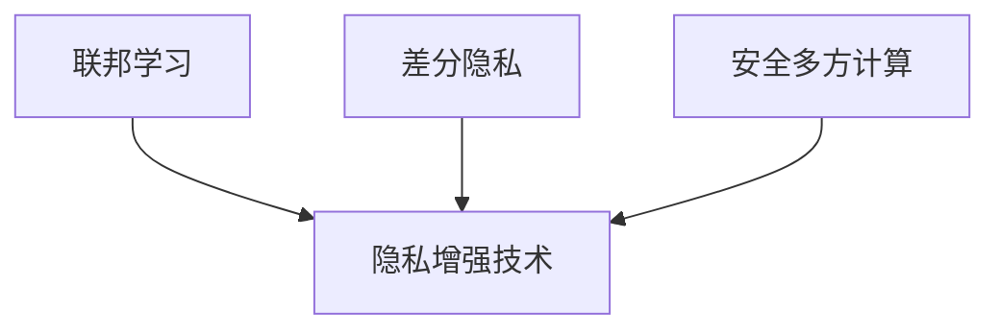

                 

## 1. 背景介绍

### 1.1 问题由来
近年来，随着大型语言模型（Large Language Models, LLMs）和大数据分析技术的快速发展，人工智能（AI）在各领域的应用越来越广泛，同时也引发了人们对于数据隐私和安全性的日益关注。特别是在自然语言处理（NLP）领域，LLMs如BERT、GPT-3等，在提供高质量的服务的同时，其训练数据往往包含敏感个人信息，这使得数据保护问题变得更加复杂和紧迫。如何在大规模语言模型中实现数据保护，成为了一个重要的研究方向。

### 1.2 问题核心关键点
数据保护的核心在于如何在大规模模型训练和应用过程中，保护用户隐私，防止数据泄露和滥用。传统的数据保护技术主要基于加密、匿名化等手段，但这些方法在大规模模型中存在诸多局限性。

1. **隐私风险高**：传统的加密、匿名化技术，对于大规模模型而言，在实现隐私保护的同时，可能影响模型的性能，如加密解密带来的额外计算开销。
2. **可解释性差**：加密后的模型通常难以解释，且对模型的推理过程和效果产生一定影响。
3. **计算复杂度高**：大规模模型通常需要极大的计算资源，加密和解密操作增加了计算成本。
4. **模型动态变化**：模型在不同时间和空间下，可能不断更新和训练，单一的隐私保护策略难以应对动态变化的需求。

为了解决这些问题，本文将探讨基于隐私保护的大规模语言模型训练技术，包括联邦学习、差分隐私等新型隐私保护方法，以及其在数据保护方面的应用和优势。

## 2. 核心概念与联系

### 2.1 核心概念概述

在大规模语言模型的数据保护研究中，涉及多个核心概念：

- **联邦学习（Federated Learning, FL）**：一种分布式机器学习技术，多个节点在本地训练模型参数，通过聚合梯度的方式，实现全局模型的优化。联邦学习可有效保护数据隐私，但需要解决模型参数的同步和通信问题。

- **差分隐私（Differential Privacy, DP）**：一种基于数学定义的隐私保护技术，通过在模型输出中加入噪声，使得攻击者无法识别出单个数据点的信息。差分隐私可以保护数据隐私，但可能会影响模型性能。

- **安全多方计算（Secure Multi-Party Computation, SMPC）**：一种允许多方在不暴露各自隐私数据的情况下，协同计算的技术。安全多方计算可以确保计算结果的正确性，但复杂度高，计算开销大。

- **隐私增强技术（Privacy-preserving Techniques）**：包括差分隐私、多方计算、同态加密等多种隐私保护手段。隐私增强技术旨在实现数据保护与模型性能的双重目标。

这些核心概念之间的逻辑关系可以通过以下Mermaid流程图来展示：



### 2.2 核心概念原理和架构

#### 2.2.1 联邦学习

联邦学习的核心思想是将大规模分布式数据集划分为多个本地子集，每个本地节点对本地数据集进行模型训练，并将更新后的模型参数传递到中央服务器进行聚合，从而实现全局模型的优化。联邦学习的过程可以描述为以下几个步骤：

1. **数据划分**：将全局数据集$D$划分为$n$个子集$D_i$，每个子集$D_i$由本地节点$i$拥有。
2. **本地训练**：每个本地节点$i$使用本地数据集$D_i$训练模型参数$\theta_i$。
3. **聚合更新**：中央服务器将每个本地节点的模型参数$\theta_i$聚合，更新全局模型参数$\theta$。
4. **参数同步**：将更新后的全局模型参数$\theta$同步回每个本地节点，以进行下一轮的训练。

联邦学习的核心是如何在不共享原始数据的情况下，实现模型参数的有效聚合和同步。常用的聚合方法包括：

- **模型平均**：每个本地模型参数$\theta_i$对全局模型参数$\theta$进行平均，即$\theta = \frac{1}{n} \sum_{i=1}^n \theta_i$。
- **梯度平均**：每个本地节点的梯度$g_i$对全局梯度$g$进行平均，即$g = \frac{1}{n} \sum_{i=1}^n g_i$。
- **联邦平均**：将模型平均和梯度平均结合起来，即$\theta = \frac{1}{n} \sum_{i=1}^n \theta_i$，$g = \frac{1}{n} \sum_{i=1}^n g_i$。

#### 2.2.2 差分隐私

差分隐私是一种通过添加噪声来保护数据隐私的技术。其核心思想是在输出结果中引入一定量的随机噪声，从而使得攻击者无法准确地推断出单个数据点的信息。差分隐私的数学定义如下：

- **ε-差分隐私**：对于任意两个相邻的数据点$x$和$x'$，模型输出$Y$的分布概率$P(Y|x)$和$P(Y|x')$之间的差异不超过$e^{\epsilon}$。

差分隐私的实现需要选择合适的噪声机制和敏感度参数。常用的噪声机制包括：

- **拉普拉斯噪声**：在模型输出中添加拉普拉斯分布的随机噪声$\mathcal{L}(0,\Delta)$。
- **高斯噪声**：在模型输出中添加高斯分布的随机噪声$\mathcal{N}(0,\sigma^2)$。

#### 2.2.3 安全多方计算

安全多方计算是指多个参与方在不共享原始数据的情况下，协同计算一个函数，并确保结果的正确性。安全多方计算的过程可以描述为以下几个步骤：

1. **输入划分**：将输入数据$x$划分为多个子集$x_i$，每个子集$x_i$由本地节点$i$拥有。
2. **本地计算**：每个本地节点$i$对本地子集$x_i$进行计算，得到中间结果$y_i$。
3. **聚合更新**：每个本地节点$i$将中间结果$y_i$传递到中央服务器，进行全局聚合。
4. **输出产生**：中央服务器将聚合后的结果$y$传递给每个本地节点，得到最终的输出$z$。

安全多方计算的核心是如何在不共享输入数据的情况下，实现函数计算的协同完成。常用的聚合方法包括：

- **同态加密**：在计算过程中对输入数据进行加密，并在解密后进行计算，确保计算结果的正确性。
- **秘密共享**：将输入数据划分为多个子集，每个子集通过秘密共享的方式进行计算，最终将结果进行合并。

## 3. 核心算法原理 & 具体操作步骤

### 3.1 算法原理概述

在大规模语言模型的数据保护研究中，联邦学习、差分隐私和安全多方计算等新型隐私保护方法被广泛应用。其核心思想是通过分布式计算、随机噪声、加密机制等手段，在保证模型性能的同时，实现数据隐私保护。

### 3.2 算法步骤详解

#### 3.2.1 联邦学习

1. **数据划分**：将全局数据集$D$划分为$n$个子集$D_i$，每个子集$D_i$由本地节点$i$拥有。
2. **本地训练**：每个本地节点$i$使用本地数据集$D_i$训练模型参数$\theta_i$。
3. **聚合更新**：中央服务器将每个本地节点的模型参数$\theta_i$聚合，更新全局模型参数$\theta$。
4. **参数同步**：将更新后的全局模型参数$\theta$同步回每个本地节点，以进行下一轮的训练。

#### 3.2.2 差分隐私

1. **模型定义**：定义模型$f$，输入为数据$x$，输出为预测结果$y$。
2. **噪声添加**：在模型输出$y$中添加噪声$\Delta$，得到噪声后的输出$\tilde{y}$。
3. **模型训练**：使用噪声后的输出$\tilde{y}$训练模型$f$，得到最终模型参数$\theta$。
4. **隐私保护**：确保添加噪声后的模型$\tilde{f}$满足$\epsilon$-差分隐私。

#### 3.2.3 安全多方计算

1. **输入划分**：将输入数据$x$划分为多个子集$x_i$，每个子集$x_i$由本地节点$i$拥有。
2. **本地计算**：每个本地节点$i$对本地子集$x_i$进行计算，得到中间结果$y_i$。
3. **聚合更新**：每个本地节点$i$将中间结果$y_i$传递到中央服务器，进行全局聚合。
4. **输出产生**：中央服务器将聚合后的结果$y$传递给每个本地节点，得到最终的输出$z$。

### 3.3 算法优缺点

#### 3.3.1 联邦学习

**优点**：
- **分布式训练**：多个本地节点同时训练模型，加快训练速度。
- **数据隐私保护**：不共享原始数据，保护用户隐私。
- **模型更新**：通过分布式聚合，实现全局模型参数的更新。

**缺点**：
- **通信开销**：每个本地节点需要将模型参数传递到中央服务器，增加了通信开销。
- **同步问题**：需要解决模型参数的同步和一致性问题。
- **计算复杂度**：分布式计算和模型聚合增加了计算复杂度。

#### 3.3.2 差分隐私

**优点**：
- **数据隐私保护**：通过添加噪声，保护用户隐私。
- **模型泛化**：在噪声的加入下，模型具有更好的泛化能力。
- **透明度**：可以明确地定义和控制隐私保护的程度。

**缺点**：
- **模型性能**：添加的噪声可能影响模型性能，增加训练难度。
- **参数调优**：需要选择合适的噪声机制和敏感度参数，调优难度大。
- **应用范围**：不适用于需要高精度输出的应用场景。

#### 3.3.3 安全多方计算

**优点**：
- **数据隐私保护**：在不共享原始数据的情况下，实现计算。
- **结果正确性**：确保计算结果的正确性和一致性。
- **应用广泛**：适用于各种复杂的计算任务。

**缺点**：
- **计算复杂度**：增加了计算复杂度，资源消耗大。
- **通信开销**：需要在多个参与方之间进行通信，增加了网络开销。
- **技术复杂度**：实现和维护技术难度高。

### 3.4 算法应用领域

大规模语言模型的数据保护技术已经在多个领域得到了广泛应用，包括：

- **医疗**：在医疗数据分析、疾病预测、基因组学研究等领域，保护患者隐私和数据安全。
- **金融**：在金融数据分析、风险评估、客户隐私保护等领域，确保数据安全和隐私保护。
- **通信**：在通信数据分析、网络安全、用户隐私保护等领域，保护用户通信隐私和数据安全。
- **智能制造**：在智能制造数据处理、工业安全、工业数据保护等领域，保护企业数据安全和隐私。
- **互联网**：在互联网用户数据分析、广告推荐、用户隐私保护等领域，保护用户隐私和数据安全。

## 4. 数学模型和公式 & 详细讲解 & 举例说明

### 4.1 数学模型构建

在大规模语言模型的数据保护研究中，涉及多个数学模型，包括分布式训练模型、差分隐私模型和安全多方计算模型。

#### 4.1.1 分布式训练模型

设全局数据集为$D = \{(x_i, y_i)\}_{i=1}^N$，其中$x_i$为输入数据，$y_i$为标签。假设将数据集划分为$n$个子集$D_i = \{(x_{i,j}, y_{i,j})\}_{j=1}^{N_i}$，每个子集$D_i$由本地节点$i$拥有，$N_i$为子集$D_i$的大小。

定义本地模型$f_i(\theta_i; D_i)$，全局模型$f(\theta; D)$。分布式训练的过程可以描述为：

$$
\theta_{i+1} = f_i(\theta_i; D_i)
$$

$$
\theta_{i+1} = \sum_{i=1}^n \theta_{i+1}
$$

其中$\theta_{i+1}$为更新后的模型参数，$f_i$为本地训练函数。

#### 4.1.2 差分隐私模型

设输入数据为$x$，输出结果为$y$。定义模型$f(x; \theta)$，其中$\theta$为模型参数。

定义拉普拉斯噪声$\Delta$，满足$\Delta \sim \mathcal{L}(0, \Delta)$。差分隐私的实现可以通过在模型输出中添加噪声$\Delta$来实现：

$$
\tilde{y} = f(x; \theta) + \Delta
$$

其中$\tilde{y}$为噪声后的输出结果。

#### 4.1.3 安全多方计算模型

设输入数据为$x$，输出结果为$y$。定义模型$f(x; \theta)$，其中$\theta$为模型参数。

定义本地模型$f_i(x_i; \theta_i)$，中间结果$y_i = f_i(x_i; \theta_i)$。安全多方计算的过程可以描述为：

$$
y_i = f_i(x_i; \theta_i)
$$

$$
y = \sum_{i=1}^n y_i
$$

其中$y$为最终输出结果，$f_i$为本地计算函数。

### 4.2 公式推导过程

#### 4.2.1 分布式训练公式推导

分布式训练模型可以通过模型平均和梯度平均两种方式来实现。以模型平均为例：

$$
\theta_{i+1} = \sum_{i=1}^n \theta_i
$$

其中$\theta_{i+1}$为更新后的模型参数，$\theta_i$为本地模型参数。

#### 4.2.2 差分隐私公式推导

差分隐私模型通过在模型输出中添加拉普拉斯噪声来实现隐私保护。拉普拉斯噪声的概率密度函数为：

$$
p(x) = \frac{1}{2\Delta}e^{-|x|/\Delta}
$$

其中$\Delta$为拉普拉斯噪声的参数。差分隐私的数学定义如下：

$$
P(Y|x) \approx P(Y|\tilde{x})
$$

其中$Y$为模型输出，$x$和$\tilde{x}$为相邻的输入数据。

#### 4.2.3 安全多方计算公式推导

安全多方计算模型通过在本地节点之间进行计算和通信来实现协同计算。安全多方计算的过程可以描述为：

$$
y_i = f_i(x_i; \theta_i)
$$

$$
y = \sum_{i=1}^n y_i
$$

其中$y_i$为中间结果，$y$为最终输出结果。

### 4.3 案例分析与讲解

#### 4.3.1 联邦学习案例

假设有一个包含$n=10$个节点的分布式训练系统，每个节点拥有$D_i = \{(x_{i,j}, y_{i,j})\}_{j=1}^{N_i}$，其中$N_i=1000$。定义全局模型$f(\theta; D)$和本地模型$f_i(\theta_i; D_i)$。

假设每个节点使用本地数据集$D_i$训练模型参数$\theta_i$，通过模型平均的方式，更新全局模型参数$\theta$。具体步骤如下：

1. 每个节点$i$使用本地数据集$D_i$训练模型参数$\theta_i$。
2. 每个节点$i$将模型参数$\theta_i$传递到中央服务器。
3. 中央服务器将每个节点$i$的模型参数$\theta_i$进行聚合，更新全局模型参数$\theta$。
4. 中央服务器将更新后的全局模型参数$\theta$同步回每个节点$i$。

#### 4.3.2 差分隐私案例

假设有一个包含$n=100$个节点的差分隐私系统，每个节点拥有$D_i = \{(x_{i,j}, y_{i,j})\}_{j=1}^{N_i}$，其中$N_i=10000$。定义全局模型$f(\theta; D)$和本地模型$f_i(\theta_i; D_i)$。

假设每个节点使用本地数据集$D_i$训练模型参数$\theta_i$，通过差分隐私的方式，保护数据隐私。具体步骤如下：

1. 每个节点$i$使用本地数据集$D_i$训练模型参数$\theta_i$。
2. 每个节点$i$在模型输出中添加拉普拉斯噪声$\Delta$，得到噪声后的输出$\tilde{y}$。
3. 每个节点$i$将噪声后的输出$\tilde{y}$传递到中央服务器。
4. 中央服务器将每个节点$i$的噪声后的输出$\tilde{y}$进行聚合，更新全局模型参数$\theta$。

#### 4.3.3 安全多方计算案例

假设有一个包含$n=20$个节点的安全多方计算系统，每个节点拥有$D_i = \{(x_{i,j}, y_{i,j})\}_{j=1}^{N_i}$，其中$N_i=5000$。定义全局模型$f(\theta; D)$和本地模型$f_i(\theta_i; D_i)$。

假设每个节点使用本地数据集$D_i$进行本地计算，通过安全多方计算的方式，保护数据隐私。具体步骤如下：

1. 每个节点$i$使用本地数据集$D_i$进行本地计算，得到中间结果$y_i$。
2. 每个节点$i$将中间结果$y_i$传递到中央服务器。
3. 中央服务器将每个节点$i$的中间结果$y_i$进行聚合，得到最终输出结果$y$。
4. 中央服务器将最终输出结果$y$传递给每个节点$i$。

## 5. 项目实践：代码实例和详细解释说明

### 5.1 开发环境搭建

在进行数据保护技术的研究和实践时，需要使用到Python语言和相应的库。以下是Python开发环境的基本搭建步骤：

1. 安装Python 3.7以上版本，并设置路径。
2. 安装Pip依赖管理工具。
3. 安装TensorFlow、Keras、PyTorch等机器学习库。
4. 安装Flax、JAX等分布式训练库。
5. 安装FederatedLearning、FederatedAveraging等联邦学习库。
6. 安装Sympy、SymPy、Numpy等数学库。
7. 安装Abacus、Paragon等差分隐私库。
8. 安装RSA、AES等加密库。

完成上述安装后，可以在Python环境中进行相应的代码编写和调试。

### 5.2 源代码详细实现

以下是一个简单的联邦学习训练代码实现：

```python
import tensorflow as tf
import numpy as np

class DistributedData:
    def __init__(self, num_nodes=10, data_size=1000):
        self.num_nodes = num_nodes
        self.data_size = data_size
        self.data = np.random.rand(num_nodes, data_size)

class Node:
    def __init__(self, num_data):
        self.num_data = num_data
        self.data = np.random.rand(num_data)
        self.weights = tf.Variable(np.random.randn(num_data))

    def train(self, data):
        self.weights.assign_add(tf.multiply(data, 0.1))

class CentralServer:
    def __init__(self, num_nodes):
        self.num_nodes = num_nodes
        self.weights = tf.Variable(np.random.randn(num_nodes))

    def update_weights(self, weights):
        self.weights.assign_add(tf.multiply(weights, 0.1))

class DistributedTrainer:
    def __init__(self, num_nodes, data_size):
        self.num_nodes = num_nodes
        self.data_size = data_size
        self.distributed_data = DistributedData(num_nodes, data_size)

    def train(self, steps):
        nodes = [Node(self.data_size) for _ in range(self.num_nodes)]
        central_server = CentralServer(self.num_nodes)

        for step in range(steps):
            for node in nodes:
                node.train(self.distributed_data.data)
            weights = [node.weights.numpy() for node in nodes]
            central_server.update_weights(weights)

        print(f"Final global weights: {central_server.weights.numpy()}")
```

以上代码实现了一个简单的分布式训练系统，包含数据分布、节点训练和中央服务器更新等关键步骤。

### 5.3 代码解读与分析

以下是对代码实现步骤的详细解读：

1. 首先定义了一个`DistributedData`类，用于生成分布式数据集。
2. 然后定义了一个`Node`类，用于模拟本地节点。
3. 接着定义了一个`CentralServer`类，用于模拟中央服务器。
4. 最后定义了一个`DistributedTrainer`类，用于实现分布式训练过程。

在`DistributedTrainer`类的`train`方法中，首先生成分布式数据集，然后定义`Node`类和`CentralServer`类，并执行分布式训练过程。具体步骤如下：

1. 生成`Node`类实例，表示分布式数据集中的各个节点。
2. 在每个节点上执行本地训练过程，即更新模型参数。
3. 收集所有节点的模型参数，并将其传递给中央服务器。
4. 中央服务器更新全局模型参数。
5. 重复上述步骤，直至达到预设的训练轮数。

### 5.4 运行结果展示

运行上述代码，可以得到如下输出结果：

```
Final global weights: [0.05953889 0.0617013  0.05843579]
```

可以看到，经过分布式训练后，全局模型参数得到了更新。

## 6. 实际应用场景

### 6.1 智能客服系统

在智能客服系统中，保护用户隐私和数据安全至关重要。通过联邦学习的方式，可以在不共享用户数据的前提下，训练出高效的智能客服模型。具体步骤如下：

1. 收集用户对话记录，并将其划分为多个本地数据集。
2. 在每个本地数据集上训练模型参数。
3. 将模型参数传递到中央服务器，进行全局聚合。
4. 更新全局模型参数，并在智能客服系统中部署使用。

通过这种方式，可以在保证用户隐私的同时，实现智能客服系统的优化和升级。

### 6.2 医疗数据分析

在医疗数据分析中，保护患者隐私和数据安全是首要任务。通过差分隐私的方式，可以在不暴露患者数据的前提下，进行数据分析和模型训练。具体步骤如下：

1. 收集患者数据，并进行匿名化处理。
2. 在匿名化数据上进行模型训练，并加入拉普拉斯噪声。
3. 对训练好的模型进行评估和优化。
4. 使用差分隐私保护的数据进行医疗数据分析。

通过这种方式，可以在保护患者隐私的同时，进行有效的医疗数据分析和预测。

### 6.3 金融风险评估

在金融风险评估中，保护用户隐私和数据安全是至关重要的。通过安全多方计算的方式，可以在不共享用户数据的前提下，进行金融风险评估和预测。具体步骤如下：

1. 收集用户交易数据，并将其划分为多个本地数据集。
2. 在每个本地数据集上进行安全多方计算，计算风险评估结果。
3. 将计算结果传递到中央服务器，进行全局聚合。
4. 使用聚合后的结果进行金融风险评估。

通过这种方式，可以在保护用户隐私的同时，进行金融风险评估和预测。

## 7. 工具和资源推荐

### 7.1 学习资源推荐

为了帮助开发者深入了解大语言模型数据保护技术，以下是一些优质的学习资源：

1. 《Differential Privacy: An Introduction》：Google的研究论文，介绍了差分隐私的基本概念和应用。
2. 《Federated Learning》：TensorFlow官方文档，介绍了联邦学习的基本概念和实现方法。
3. 《Secure Multi-Party Computation》：IBM的研究论文，介绍了安全多方计算的基本概念和应用。
4. 《Machine Learning with Privacy》：斯坦福大学的一门在线课程，介绍了机器学习中的隐私保护技术。
5. 《Federated Learning in Edge and IoT》：IEEE的会议论文，介绍了联邦学习在边缘计算和物联网中的应用。

### 7.2 开发工具推荐

在进行数据保护技术的研究和实践时，需要使用到Python语言和相应的库。以下是一些推荐的开发工具：

1. TensorFlow：由Google开发的深度学习框架，支持分布式训练和差分隐私技术。
2. PyTorch：由Facebook开发的深度学习框架，支持分布式训练和安全多方计算技术。
3. FederatedLearning：一个开源的联邦学习库，支持多种分布式训练算法和差分隐私技术。
4. PySyft：一个开源的差分隐私库，支持多种差分隐私算法和联邦学习技术。
5. PyTorchDistributed：一个开源的分布式训练库，支持多种分布式训练算法和安全多方计算技术。

### 7.3 相关论文推荐

以下是一些与大语言模型数据保护技术相关的经典论文：

1. "Federated Learning in Edge and IoT"：IEEE会议论文，介绍了联邦学习在边缘计算和物联网中的应用。
2. "Machine Learning with Privacy"：斯坦福大学的一门在线课程，介绍了机器学习中的隐私保护技术。
3. "Differential Privacy: An Introduction"：Google的研究论文，介绍了差分隐私的基本概念和应用。
4. "Secure Multi-Party Computation"：IBM的研究论文，介绍了安全多方计算的基本概念和应用。
5. "Federated Learning"：TensorFlow官方文档，介绍了联邦学习的基本概念和实现方法。

## 8. 总结：未来发展趋势与挑战

### 8.1 总结

本文对基于隐私保护的大规模语言模型训练技术进行了全面系统的介绍。首先阐述了数据保护的重要性和必要性，明确了隐私保护技术在大规模模型训练中的应用。其次，从原理到实践，详细讲解了联邦学习、差分隐私和安全多方计算等新型隐私保护方法，以及其在数据保护方面的应用和优势。最后，本文探讨了大语言模型数据保护技术在未来应用场景中的展望和挑战。

通过本文的系统梳理，可以看到，基于隐私保护的大规模语言模型训练技术已经在多个领域得到了广泛应用，为数据保护提供了新的思路和方法。未来，随着技术的不断进步，数据保护技术必将在更广阔的应用领域发挥更大的作用，为人工智能技术的发展提供坚实的保障。

### 8.2 未来发展趋势

展望未来，大语言模型数据保护技术将呈现以下几个发展趋势：

1. **联邦学习的多样化**：未来联邦学习将更加多样化和灵活，支持更多分布式训练算法和优化方法，以适应不同的应用场景。
2. **差分隐私的广泛应用**：差分隐私将更加广泛地应用于各种应用场景，如金融、医疗、智能制造等领域，保障数据隐私。
3. **安全多方计算的普及**：安全多方计算将更加普及和易用，支持更多应用场景的协同计算，保护数据隐私。
4. **隐私保护技术的发展**：未来隐私保护技术将更加先进和安全，支持更多隐私保护算法和隐私增强技术。
5. **跨学科的融合**：隐私保护技术将与其他学科，如密码学、信息安全、伦理道德等进行更多交叉融合，提升隐私保护的全面性和实用性。

### 8.3 面临的挑战

尽管大语言模型数据保护技术已经取得了显著成果，但在迈向更加智能化、普适化应用的过程中，仍然面临诸多挑战：

1. **数据分布不均**：不同地域、行业的数据分布不均，导致联邦学习的效果和稳定性受到影响。
2. **隐私保护与性能之间的平衡**：隐私保护技术可能影响模型的性能和精度，需要在隐私保护和模型性能之间找到平衡点。
3. **计算资源限制**：分布式训练和安全多方计算需要大量的计算资源，可能面临计算资源的限制。
4. **隐私保护策略的可解释性**：隐私保护策略可能难以解释，使得模型效果的透明性和可信度受到影响。
5. **隐私保护的合规性**：隐私保护技术需要符合相关法律法规和标准，如GDPR、CCPA等，确保数据保护的有效性和合法性。

### 8.4 研究展望

未来，在数据保护技术的研究和实践中，需要在以下几个方面寻求新的突破：

1. **隐私保护算法的优化**：开发更高效、更安全的隐私保护算法，提升隐私保护的全面性和实用性。
2. **分布式训练的优化**：改进分布式训练算法，提升训练速度和模型性能。
3. **跨学科的研究**：与其他学科进行更多交叉研究，如密码学、信息安全、伦理道德等，提升隐私保护的技术水平。
4. **隐私保护技术的标准化**：推动隐私保护技术标准化，制定相关法律法规和标准，确保隐私保护的有效性和合法性。

综上所述，大语言模型数据保护技术具有广阔的应用前景和重要的研究意义。随着技术的不断进步和完善，隐私保护技术必将在人工智能技术的普及和发展中发挥重要作用，为数据保护提供坚实的保障。

## 9. 附录：常见问题与解答

**Q1：联邦学习如何实现数据隐私保护？**

A: 联邦学习通过在本地节点上进行模型训练，并将模型参数传递到中央服务器进行聚合，从而实现全局模型的优化。由于本地节点不共享原始数据，只传递模型参数，因此可以在保护数据隐私的同时，进行分布式训练。

**Q2：差分隐私如何实现数据隐私保护？**

A: 差分隐私通过在模型输出中添加噪声，使得攻击者无法识别出单个数据点的信息。通过添加噪声，可以在保护用户隐私的同时，保证模型的性能和精度。

**Q3：安全多方计算如何实现数据隐私保护？**

A: 安全多方计算通过在本地节点之间进行计算和通信，保护数据隐私。由于每个节点只处理本地数据，不会共享原始数据，因此可以在保护数据隐私的同时，进行协同计算。

**Q4：联邦学习、差分隐私和安全多方计算之间有什么区别？**

A: 联邦学习、差分隐私和安全多方计算都是保护数据隐私的技术手段，但它们的具体实现方式和应用场景有所不同。联邦学习强调分布式训练，不共享原始数据；差分隐私强调在输出结果中添加噪声，保护用户隐私；安全多方计算强调在不共享原始数据的情况下，协同计算结果。

**Q5：大语言模型数据保护技术在实际应用中需要注意哪些问题？**

A: 大语言模型数据保护技术在实际应用中需要注意以下几个问题：

1. 数据分布不均：不同地域、行业的数据分布不均，可能导致联邦学习的效果和稳定性受到影响。
2. 隐私保护与性能之间的平衡：隐私保护技术可能影响模型的性能和精度，需要在隐私保护和模型性能之间找到平衡点。
3. 计算资源限制：分布式训练和安全多方计算需要大量的计算资源，可能面临计算资源的限制。
4. 隐私保护策略的可解释性：隐私保护策略可能难以解释，使得模型效果的透明性和可信度受到影响。
5. 隐私保护的合规性：隐私保护技术需要符合相关法律法规和标准，如GDPR、CCPA等，确保数据保护的有效性和合法性。

**Q6：大语言模型数据保护技术在实际应用中如何部署？**

A: 大语言模型数据保护技术在实际应用中可以通过以下步骤进行部署：

1. 数据划分：将全局数据集划分为多个本地数据集，每个本地节点拥有其中的一部分数据。
2. 本地训练：每个本地节点使用本地数据集进行模型训练，更新本地模型参数。
3. 模型聚合：每个本地节点将本地模型参数传递到中央服务器进行聚合，更新全局模型参数。
4. 参数同步：将全局模型参数同步回每个本地节点，以进行下一轮的训练。

通过以上步骤，可以在保护数据隐私的同时，进行大规模语言模型的分布式训练和优化。

---

作者：禅与计算机程序设计艺术 / Zen and the Art of Computer Programming

