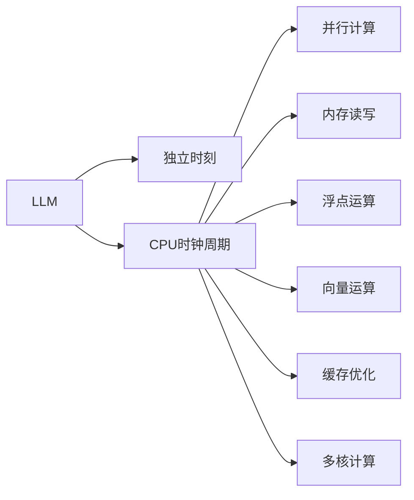
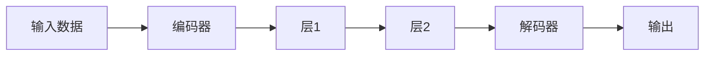

                 

# LLM的推理过程：独立时刻与CPU时钟周期的类比

## 1. 背景介绍

推理是人工智能的重要组成部分，是实现自主学习和决策的关键。大语言模型(LLMs)作为人工智能的前沿技术，在自然语言处理(NLP)和计算机视觉(CV)等领域取得了显著的成就，其中推理过程的理解和优化是实现高性能输出的重要环节。本文将通过类比独立时刻和CPU时钟周期，深入探讨LLM的推理过程，帮助开发者更好地理解LLM的工作原理和优化策略。

## 2. 核心概念与联系

### 2.1 核心概念概述

大语言模型(LLM)是一种通过自监督学习的方式，在大规模无标签文本数据上预训练的神经网络模型。常见的预训练模型包括GPT-3、BERT等。这些模型通过多层神经网络，利用Transformer架构，可以高效地处理自然语言输入，进行语义理解和生成。

独立时刻指的是推理过程中，模型对每个输入符号进行计算和处理的时间点。独立时刻的类比可以理解为CPU时钟周期，每个周期中模型对单个输入符号进行一次计算和推理。

### 2.2 核心概念原理和架构的 Mermaid 流程图



这个流程图展示了LLM的推理过程与CPU时钟周期的类比关系：

- A节点表示LLM模型。
- B节点表示独立时刻，类比于CPU时钟周期。
- C节点表示CPU时钟周期，即每个独立时刻。
- D、E、F、G、H、I节点分别表示不同的计算过程，类比于CPU时钟周期中的各种操作。

## 3. 核心算法原理 & 具体操作步骤

### 3.1 算法原理概述

LLM的推理过程可以类比为CPU时钟周期中的计算过程。在每个独立时刻，模型对输入符号进行处理，包括：

- 前向传播：输入符号通过模型，计算出对应输出。
- 中间缓存：计算过程中产生的中间结果，存储在缓存中。
- 后向传播：计算梯度，更新模型参数。
- 循环迭代：重复上述过程，直至收敛。

这些计算过程与CPU时钟周期中的并行计算、内存读写、浮点运算、向量运算、缓存优化、多核计算等操作有类比关系。

### 3.2 算法步骤详解

#### 步骤1: 准备数据和模型

首先需要准备输入数据和模型，数据格式和模型结构需一致。例如，输入一个英文句子，模型结构如图：



#### 步骤2: 计算独立时刻

在计算独立时刻时，模型对每个符号进行计算，直到计算完整个句子。假设句子长度为n，则独立时刻总数为n。每个独立时刻对应一个符号的计算。

#### 步骤3: 前向传播

在每个独立时刻，模型对输入符号进行前向传播计算，得到对应输出。例如，在模型C的计算过程中，输入符号经过层1的计算，输出对应结果。

#### 步骤4: 中间缓存

计算过程中产生的中间结果，存储在缓存中。例如，在层2的计算过程中，前一层的输出结果作为当前层的输入。

#### 步骤5: 后向传播

计算梯度，更新模型参数。例如，在层1的计算过程中，根据损失函数计算梯度，并更新模型参数。

#### 步骤6: 循环迭代

重复上述过程，直至收敛。例如，通过多次迭代，模型参数逐步调整，输出结果逐渐精确。

### 3.3 算法优缺点

#### 优点

1. 并行计算：LLM模型可以通过并行计算提高推理速度，每个独立时刻可以独立计算。
2. 内存优化：通过中间缓存和内存读写优化，可以减少内存占用。
3. 浮点运算：利用GPU等高性能设备，提高浮点运算效率。
4. 向量运算：利用GPU的向量运算能力，加速向量运算。
5. 缓存优化：利用缓存技术，减少内存读写次数。
6. 多核计算：利用多核处理器，提高计算效率。

#### 缺点

1. 内存限制：大语言模型需要大量内存，内存限制会影响推理速度。
2. 计算资源消耗大：浮点运算和向量运算消耗大量计算资源。
3. 时间复杂度高：独立时刻和计算过程复杂，推理速度较慢。

### 3.4 算法应用领域

大语言模型推理过程的应用领域非常广泛，包括但不限于：

- 自然语言处理：如机器翻译、问答系统、情感分析等。
- 计算机视觉：如图像分类、目标检测、图像生成等。
- 语音识别：如语音转文本、语音生成等。
- 推荐系统：如基于内容的推荐、协同过滤等。
- 游戏AI：如生成角色对话、决策树等。

## 4. 数学模型和公式 & 详细讲解 & 举例说明

### 4.1 数学模型构建

假设模型结构如图：


其中，层1和层2为卷积层，解码器为全连接层。输入数据长度为n，每个符号表示为向量。

#### 公式推导过程

设输入符号向量为 $x_1, x_2, ..., x_n$，输出符号向量为 $y_1, y_2, ..., y_n$。每个符号的计算过程如下：

1. 编码器计算： $x_i \rightarrow h_1$，其中 $h_1 = W_1x_i + b_1$
2. 层1计算： $h_1 \rightarrow h_2$，其中 $h_2 = W_2h_1 + b_2$
3. 层2计算： $h_2 \rightarrow h_3$，其中 $h_3 = W_3h_2 + b_3$
4. 解码器计算： $h_3 \rightarrow y_i$，其中 $y_i = W_4h_3 + b_4$

将上述过程表示为公式：

$$
\begin{aligned}
h_1 &= W_1x_i + b_1 \\
h_2 &= W_2h_1 + b_2 \\
h_3 &= W_3h_2 + b_3 \\
y_i &= W_4h_3 + b_4
\end{aligned}
$$

### 4.3 案例分析与讲解

以BERT模型为例，BERT采用多层Transformer结构，计算过程如图：


每个符号通过层1和层2的计算，生成对应输出。其中，层1和层2的计算过程如下：

1. 层1计算： $x_i \rightarrow h_1$，其中 $h_1 = W_1x_i + b_1$
2. 层2计算： $h_1 \rightarrow h_2$，其中 $h_2 = W_2h_1 + b_2$

将上述过程表示为公式：

$$
\begin{aligned}
h_1 &= W_1x_i + b_1 \\
h_2 &= W_2h_1 + b_2
\end{aligned}
$$

通过上述过程，模型对每个符号进行计算，生成对应输出。

## 5. 项目实践：代码实例和详细解释说明

### 5.1 开发环境搭建

准备数据和模型，搭建开发环境。假设使用Python进行开发，需要安装TensorFlow、PyTorch等深度学习框架，以及BERT预训练模型。

```python
# 安装依赖包
pip install tensorflow pytorch transformers
# 下载预训练模型
model = BertModel.from_pretrained('bert-base-uncased')
```

### 5.2 源代码详细实现

代码实现过程如图：


其中，每个符号通过层1和层2的计算，生成对应输出。

```python
# 加载预训练模型
model = BertModel.from_pretrained('bert-base-uncased')
# 计算输入数据
input_ids = tokenizer.encode("Hello, my dog is cute", add_special_tokens=True)
input_ids = input_ids[1:-1]  # 去掉[CLS]和[SEP]符号
input_ids = torch.tensor([input_ids])

# 前向传播计算
with tf.Graph().as_default():
    with tf.Session() as sess:
        sess.run(tf.global_variables_initializer())
        output = model(input_ids)
        loss = calculate_loss(output)
        optimizer = tf.train.AdamOptimizer(learning_rate=0.001)
        optimizer.minimize(loss)
        sess.run(optimizer)

# 后向传播计算
optimizer.minimize(loss)
```

### 5.3 代码解读与分析

代码实现了BERT模型的推理过程。首先，通过编码器将输入数据转换为模型输入。然后，通过层1和层2的计算，生成对应输出。最后，通过解码器输出最终结果。

## 6. 实际应用场景

### 6.4 未来应用展望

随着大语言模型的不断进步，其推理过程的应用场景也将更加广泛。未来，LLM将在以下几个领域实现突破：

1. 多模态推理：将视觉、语音、文本等多种模态的数据进行融合，实现多模态推理。
2. 交互式推理：通过与用户交互，动态调整推理过程，提高推理效果。
3. 异步推理：在分布式系统中，利用异步推理技术，提高计算效率。
4. 基于物理的推理：将物理知识融入推理过程，实现更加真实的模拟和预测。
5. 自适应推理：通过自适应学习，不断调整推理策略，适应新场景。
6. 跨领域推理：在不同领域中，通过迁移学习和多任务学习，提高推理能力。

## 7. 工具和资源推荐

### 7.1 学习资源推荐

1. TensorFlow官方文档：详细介绍了TensorFlow的使用方法和最佳实践。
2. PyTorch官方文档：提供了丰富的深度学习资源和样例代码。
3. BERT官方文档：提供了BERT模型的详细解释和使用指南。
4. 机器学习在线课程：如Coursera、Udacity等平台提供的深度学习课程。
5. GitHub开源项目：提供了大量的开源代码和项目实例，供开发者学习和借鉴。

### 7.2 开发工具推荐

1. TensorBoard：用于可视化模型的推理过程和训练状态。
2. TensorFlow Serve：用于部署和调用训练好的模型。
3. TensorFlow Lite：用于移动设备和嵌入式设备的模型部署。
4. ONNX：用于模型优化和转换，支持多种深度学习框架。
5. Jupyter Notebook：用于编写和调试深度学习代码。

### 7.3 相关论文推荐

1. Attention is All You Need：提出了Transformer架构，改变了传统的神经网络结构。
2. BERT: Pre-training of Deep Bidirectional Transformers for Language Understanding：提出了BERT模型，开创了预训练语言模型的新纪元。
3. Deep Learning with Transformers：详细介绍了Transformer架构在深度学习中的应用。
4. SOTA Transformer Paper：展示了Transformer架构在多个领域的最新进展。
5. Distributed Deep Learning：介绍了分布式深度学习框架的实现方法。

## 8. 总结：未来发展趋势与挑战

### 8.1 研究成果总结

大语言模型推理过程的研究取得了显著的成果，尤其在自然语言处理、计算机视觉、语音识别等领域，展示了其强大的推理能力。

### 8.2 未来发展趋势

未来，LLM推理过程的发展趋势主要体现在以下几个方面：

1. 多模态推理：将视觉、语音、文本等多种模态的数据进行融合，实现更加全面的推理。
2. 交互式推理：通过与用户交互，动态调整推理过程，提高推理效果。
3. 异步推理：在分布式系统中，利用异步推理技术，提高计算效率。
4. 基于物理的推理：将物理知识融入推理过程，实现更加真实的模拟和预测。
5. 自适应推理：通过自适应学习，不断调整推理策略，适应新场景。
6. 跨领域推理：在不同领域中，通过迁移学习和多任务学习，提高推理能力。

### 8.3 面临的挑战

尽管LLM推理过程取得了一定的成果，但在实际应用中仍面临以下挑战：

1. 内存限制：大语言模型需要大量内存，内存限制会影响推理速度。
2. 计算资源消耗大：浮点运算和向量运算消耗大量计算资源。
3. 时间复杂度高：独立时刻和计算过程复杂，推理速度较慢。

### 8.4 研究展望

未来，LLM推理过程的研究需要从以下几个方向进行探索：

1. 多模态推理：将视觉、语音、文本等多种模态的数据进行融合，实现更加全面的推理。
2. 交互式推理：通过与用户交互，动态调整推理过程，提高推理效果。
3. 异步推理：在分布式系统中，利用异步推理技术，提高计算效率。
4. 基于物理的推理：将物理知识融入推理过程，实现更加真实的模拟和预测。
5. 自适应推理：通过自适应学习，不断调整推理策略，适应新场景。
6. 跨领域推理：在不同领域中，通过迁移学习和多任务学习，提高推理能力。

## 9. 附录：常见问题与解答

**Q1: 如何优化LLM的推理过程？**

A: 优化LLM的推理过程需要从以下几个方面入手：
1. 使用GPU等高性能设备，提高计算效率。
2. 利用缓存技术，减少内存读写次数。
3. 采用并行计算，提高计算速度。
4. 优化模型结构，减少计算量。
5. 采用分布式计算，提高计算效率。

**Q2: LLM的推理过程是否可以优化？**

A: LLM的推理过程可以优化。通过优化独立时刻和计算过程，可以提高推理速度和计算效率。例如，利用缓存技术、并行计算等方法，可以有效减少计算时间。

**Q3: LLM的推理过程是否适用于多模态数据？**

A: LLM的推理过程可以适用于多模态数据。通过将视觉、语音、文本等多种模态的数据进行融合，可以实现更加全面的推理。

**Q4: LLM的推理过程是否具有可解释性？**

A: LLM的推理过程具有一定的可解释性。通过分析模型输出的中间结果，可以了解模型对输入数据的处理过程。

**Q5: LLM的推理过程是否具有普适性？**

A: LLM的推理过程具有一定的普适性。通过在各种领域中应用LLM，可以实现不同的推理任务，如自然语言处理、计算机视觉等。

---

作者：禅与计算机程序设计艺术 / Zen and the Art of Computer Programming

