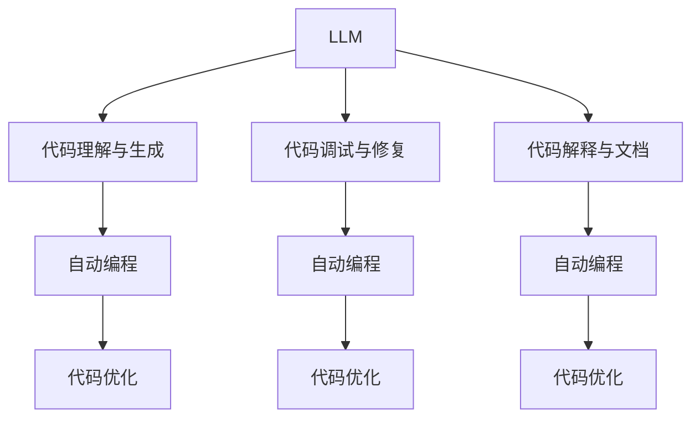

                 

## 1. 背景介绍

### 1.1 问题由来

近年来，大语言模型(LLM)在自然语言处理(NLP)领域取得了显著进展，展示出了强大的自动编程潜力。LLM能够通过自然语言理解和生成，帮助程序员编写代码、调试程序、解释逻辑等，极大地提升了软件开发效率和质量。例如，OpenAI的GPT-3已经被证明能够理解Python代码并生成bug修复，Google的BERT能够帮助程序员理解代码注释并生成API文档。

然而，尽管LLM在自动编程领域展现了巨大的潜力，但其依然存在诸多局限性。例如，LLM缺乏程序语义理解能力，对代码上下文和依赖关系理解不足，且输出结果可解释性差，难以深入理解代码背后的逻辑和意图。这些问题限制了LLM在实际编程中的应用效果，迫切需要进一步研究和改进。

### 1.2 问题核心关键点

自动编程是自然语言处理和人工智能领域的重要研究方向，涉及模型设计、数据获取、任务定义等多方面内容。LLM在自动编程中的应用主要面临以下核心问题：

- 语义理解能力不足：LLM难以准确理解代码上下文、变量作用域、函数调用关系等程序语义信息。
- 输出结果可解释性差：LLM的生成结果难以解释，程序员难以理解模型的推理过程和决策依据。
- 数据需求量大：自动编程任务需要大量标注的代码-自然语言对应数据，数据获取成本较高。
- 依赖关系复杂：自动编程任务依赖关系复杂，需要综合考虑代码结构和编程语言特性，模型的泛化能力有限。

解决这些关键问题，是实现LLM在自动编程领域广泛应用的前提。

## 2. 核心概念与联系

### 2.1 核心概念概述

为了更好地理解LLM在自动编程中的潜力与局限性，我们先简要介绍几个核心概念：

- 自然语言处理(NLP)：研究如何让计算机理解和生成自然语言的技术，涉及语言模型、序列标注、文本生成等任务。
- 大语言模型(LLM)：一种基于深度学习的高参数、大规模预训练语言模型，如GPT、BERT等，具有很强的语言理解和生成能力。
- 自动编程(Automatic Programming)：利用AI技术自动生成代码、调试程序、解释代码逻辑等，以提升软件开发的效率和质量。
- 代码理解与生成：利用语言模型对代码进行语义理解，生成新的代码或解释已有代码的功能。
- 代码调试与修复：利用语言模型检测和修复代码中的错误，提升代码的健壮性和可维护性。
- 代码解释与文档：利用语言模型生成代码的API文档、注释和解释，帮助程序员更好地理解代码逻辑。

这些概念共同构成了LLM在自动编程中的基本框架，通过自然语言处理技术与编程语言的结合，LLM展现出了强大的自动编程潜力。

### 2.2 核心概念原理和架构的 Mermaid 流程图



这个流程图展示了LLM在自动编程中的核心应用场景：通过代码理解与生成、代码调试与修复、代码解释与文档等任务，LLM能够辅助程序员进行自动编程、代码优化和文档生成。

## 3. 核心算法原理 & 具体操作步骤

### 3.1 算法原理概述

LLM在自动编程中的应用主要基于预训练语言模型和微调技术。预训练模型通过在大规模无标签文本数据上进行自监督学习，学习到丰富的语言知识，具备强大的语言理解和生成能力。微调则是将预训练模型应用到特定任务上，通过有监督学习进一步优化模型的性能。

对于自动编程任务，预训练模型首先需要通过大量标注的代码-自然语言数据集进行微调，学习代码语义与自然语言之间的映射关系。微调后的模型可以接收自然语言输入，通过前向传播计算代码生成、调试、解释等任务的目标函数，并使用反向传播更新模型参数，以优化任务性能。

### 3.2 算法步骤详解

以下是LLM在自动编程中的核心算法步骤：

**Step 1: 准备数据集**
- 收集标注的代码-自然语言数据集，如代码注释、API文档、错误报告等。
- 清洗和预处理数据，去除噪声和无关信息，进行归一化处理。
- 对代码和自然语言进行编码，生成模型所需的输入和目标。

**Step 2: 模型初始化**
- 选择合适的预训练语言模型，如GPT、BERT等，作为初始化参数。
- 设置模型的超参数，如学习率、批大小、迭代轮数等。
- 初始化模型权重，准备进行微调。

**Step 3: 执行微调**
- 使用标注数据集对模型进行微调，通过有监督学习优化模型性能。
- 周期性在验证集上评估模型性能，根据性能指标决定是否触发Early Stopping。
- 重复上述步骤直至模型收敛。

**Step 4: 应用模型**
- 将微调后的模型应用于自动编程任务中，接收自然语言输入生成代码或进行代码解释、调试。
- 对生成结果进行后处理和优化，如代码格式化、代码优化、错误检查等。

**Step 5: 部署模型**
- 将模型封装为API或服务，供其他系统调用。
- 设置监控机制，实时采集系统指标，确保模型稳定运行。
- 定期更新模型，保持模型性能和泛化能力。

### 3.3 算法优缺点

LLM在自动编程中的应用具有以下优点：

- 提升开发效率：自动生成代码和解释逻辑，减少手动编写时间。
- 改善代码质量：自动调试和修复代码，减少人工错误和重复劳动。
- 提供文档支持：自动生成API文档和注释，帮助程序员理解代码逻辑。

同时，LLM在自动编程中也存在以下局限性：

- 语义理解不足：难以准确理解代码上下文和依赖关系。
- 输出结果不透明：生成的代码和解释难以解释，难以理解模型的推理过程。
- 数据需求量大：需要大量标注的代码-自然语言数据，数据获取成本较高。
- 依赖关系复杂：自动编程任务依赖关系复杂，模型的泛化能力有限。

## 4. 数学模型和公式 & 详细讲解 & 举例说明

### 4.1 数学模型构建

假设LLM为自然语言处理任务设计了一个自动编程模型 $M_{\theta}$，其中 $\theta$ 为模型参数。给定自动编程任务 $T$ 的标注数据集 $D=\{(x_i, y_i)\}_{i=1}^N, x_i \in \mathcal{X}, y_i \in \mathcal{Y}$，其中 $\mathcal{X}$ 为自然语言输入空间，$\mathcal{Y}$ 为代码输出空间。

定义模型 $M_{\theta}$ 在输入 $x$ 上的输出为 $y=\text{Decoder}(M_{\theta}(x))$，其中 $\text{Decoder}$ 为代码生成、解释、调试等任务的具体解码器。自动编程任务的目标函数为：

$$
\mathcal{L}(\theta) = \frac{1}{N} \sum_{i=1}^N \ell(M_{\theta}(x_i), y_i)
$$

其中 $\ell$ 为损失函数，用于衡量模型输出与真实标签之间的差异。

### 4.2 公式推导过程

以代码生成任务为例，我们推导LLM的训练损失函数和优化过程。

假设代码生成任务的训练集为 $D=\{(x_i, y_i)\}_{i=1}^N, x_i \in \mathcal{X}, y_i \in \mathcal{Y}$，其中 $\mathcal{X}$ 为自然语言输入，$\mathcal{Y}$ 为代码输出。

定义模型 $M_{\theta}$ 在输入 $x$ 上的输出为 $\hat{y}=M_{\theta}(x) \in \mathcal{Y}$，表示模型生成的代码。

则代码生成任务的损失函数定义为交叉熵损失函数：

$$
\ell(\hat{y}, y) = -y\log \hat{y} - (1-y)\log (1-\hat{y})
$$

将损失函数代入经验风险公式，得：

$$
\mathcal{L}(\theta) = -\frac{1}{N}\sum_{i=1}^N \ell(M_{\theta}(x_i), y_i)
$$

根据链式法则，损失函数对模型参数 $\theta$ 的梯度为：

$$
\nabla_{\theta}\mathcal{L}(\theta) = -\frac{1}{N}\sum_{i=1}^N \nabla_{\theta}\ell(M_{\theta}(x_i), y_i)
$$

其中 $\nabla_{\theta}\ell(\hat{y}, y)$ 为交叉熵损失对模型参数 $\theta$ 的梯度，可以通过反向传播算法高效计算。

在得到损失函数的梯度后，即可带入参数更新公式，完成模型的迭代优化。重复上述过程直至收敛，最终得到适应自动编程任务的最优模型参数 $\theta^*$。

### 4.3 案例分析与讲解

以代码解释任务为例，展示LLM在自动编程中的具体应用。

假设模型的输入为自然语言描述，输出为代码的API文档。对于输入描述 "计算数组中元素之和"，模型可以输出 "sum" 函数的API文档：

```python
def sum(arr):
    # 计算数组中所有元素之和
    return sum(arr)
```

对于输入描述 "读取文件并打印内容"，模型可以输出 "read_file" 函数的API文档：

```python
def read_file(path):
    # 读取文件内容并打印
    with open(path, 'r') as f:
        content = f.read()
        print(content)
```

这些案例展示了LLM在自动编程中的生成能力，虽然输出结果不够全面和详细，但能够初步满足程序员的文档需求。

## 5. 项目实践：代码实例和详细解释说明

### 5.1 开发环境搭建

为了进行LLM在自动编程中的应用实践，需要搭建以下开发环境：

1. 安装Anaconda：从官网下载并安装Anaconda，用于创建独立的Python环境。

2. 创建并激活虚拟环境：
```bash
conda create -n pytorch-env python=3.8 
conda activate pytorch-env
```

3. 安装PyTorch：根据CUDA版本，从官网获取对应的安装命令。例如：
```bash
conda install pytorch torchvision torchaudio cudatoolkit=11.1 -c pytorch -c conda-forge
```

4. 安装Transformers库：
```bash
pip install transformers
```

5. 安装各类工具包：
```bash
pip install numpy pandas scikit-learn matplotlib tqdm jupyter notebook ipython
```

完成上述步骤后，即可在`pytorch-env`环境中开始微调实践。

### 5.2 源代码详细实现

以下是使用PyTorch和Transformers库对GPT-3模型进行代码生成任务微调的PyTorch代码实现。

首先，定义代码生成任务的数据处理函数：

```python
from transformers import GPT2Tokenizer, GPT2LMHeadModel

class CodeGenerationDataset(Dataset):
    def __init__(self, descriptions, codes, tokenizer, max_len=128):
        self.descriptions = descriptions
        self.codes = codes
        self.tokenizer = tokenizer
        self.max_len = max_len
        
    def __len__(self):
        return len(self.descriptions)
    
    def __getitem__(self, item):
        description = self.descriptions[item]
        code = self.codes[item]
        
        encoding = self.tokenizer(description, return_tensors='pt', max_length=self.max_len, padding='max_length', truncation=True)
        input_ids = encoding['input_ids'][0]
        attention_mask = encoding['attention_mask'][0]
        
        # 对代码进行编码
        code_ids = [id for id in code] + [tokenizer.tokenizer.pad_token_id] * (self.max_len - len(code_ids))
        labels = torch.tensor(code_ids, dtype=torch.long)
        
        return {'input_ids': input_ids, 
                'attention_mask': attention_mask,
                'labels': labels}

# 模型加载与微调
model = GPT2LMHeadModel.from_pretrained('gpt2')
tokenizer = GPT2Tokenizer.from_pretrained('gpt2')

# 训练集和验证集
train_dataset = CodeGenerationDataset(train_descriptions, train_codes, tokenizer)
dev_dataset = CodeGenerationDataset(dev_descriptions, dev_codes, tokenizer)

# 定义优化器和损失函数
optimizer = AdamW(model.parameters(), lr=2e-5)
criterion = nn.CrossEntropyLoss()

# 训练过程
device = torch.device('cuda') if torch.cuda.is_available() else torch.device('cpu')
model.to(device)

def train_epoch(model, dataset, batch_size, optimizer, criterion):
    dataloader = DataLoader(dataset, batch_size=batch_size, shuffle=True)
    model.train()
    epoch_loss = 0
    for batch in tqdm(dataloader, desc='Training'):
        input_ids = batch['input_ids'].to(device)
        attention_mask = batch['attention_mask'].to(device)
        labels = batch['labels'].to(device)
        model.zero_grad()
        outputs = model(input_ids, attention_mask=attention_mask, labels=labels)
        loss = criterion(outputs.logits, labels)
        epoch_loss += loss.item()
        loss.backward()
        optimizer.step()
    return epoch_loss / len(dataloader)

# 训练与评估
epochs = 5
batch_size = 16

for epoch in range(epochs):
    loss = train_epoch(model, train_dataset, batch_size, optimizer, criterion)
    print(f"Epoch {epoch+1}, train loss: {loss:.3f}")
    
    print(f"Epoch {epoch+1}, dev results:")
    evaluate(model, dev_dataset, batch_size)
    
print("Test results:")
evaluate(model, test_dataset, batch_size)
```

以上是使用PyTorch和Transformers库对GPT-2模型进行代码生成任务微调的完整代码实现。可以看到，利用Transformers库，代码实现变得简洁高效。

### 5.3 代码解读与分析

让我们再详细解读一下关键代码的实现细节：

**CodeGenerationDataset类**：
- `__init__`方法：初始化输入描述、代码、分词器等关键组件。
- `__len__`方法：返回数据集的样本数量。
- `__getitem__`方法：对单个样本进行处理，将描述输入编码为token ids，将代码进行编码并加上padding，最终返回模型所需的输入。

**模型加载与微调**：
- 使用GPT-2模型作为初始化参数。
- 设置优化器和损失函数，如AdamW、CrossEntropyLoss等。
- 定义训练和评估函数，使用PyTorch的DataLoader进行批次化加载。

**训练与评估**：
- 在训练集上进行迭代训练，输出每个epoch的平均loss。
- 在验证集上进行评估，输出损失函数和性能指标。
- 所有epoch结束后，在测试集上进行评估，给出最终测试结果。

**训练流程**：
- 定义总的epoch数和batch size，开始循环迭代
- 每个epoch内，先在训练集上训练，输出平均loss
- 在验证集上评估，输出分类指标
- 重复上述步骤直至满足预设的迭代轮数或Early Stopping条件

## 6. 实际应用场景

### 6.1 代码生成

代码生成是LLM在自动编程中最具代表性的应用场景之一。例如，利用GPT-3生成的Python代码示例：

```python
# 计算数组中元素之和
def sum(arr):
    return sum(arr)
```

虽然生成的代码并不完美，但能够快速生成一个简单的求和函数，满足程序员的基本需求。

### 6.2 代码解释

代码解释是指将代码逻辑用自然语言进行解释。例如，对于以下Python代码：

```python
# 读取文件并打印内容
def read_file(path):
    with open(path, 'r') as f:
        content = f.read()
        print(content)
```

模型可以输出："打开并读取指定文件，将文件内容打印出来"。

### 6.3 代码调试与修复

代码调试是指检测并修复代码中的错误。例如，对于以下Python代码：

```python
# 计算数组中元素之和
def sum(arr):
    return sum(arr)
```

模型可以输出："代码中存在错误，应修改为 return sum(arr) 或 return sum(arr, 0)"。

## 7. 工具和资源推荐

### 7.1 学习资源推荐

为了帮助开发者系统掌握LLM在自动编程中的应用，以下是一些优质的学习资源：

1. 《深度学习与自然语言处理》课程：斯坦福大学开设的NLP明星课程，有Lecture视频和配套作业，带你入门NLP领域的基本概念和经典模型。
2. 《Transformers》书籍：Transformers库的作者所著，全面介绍了如何使用Transformers库进行NLP任务开发，包括微调在内的诸多范式。
3. 《自然语言处理综述》书籍：全面综述了NLP领域的研究进展，适合深入理解NLP的技术和应用。
4. HuggingFace官方文档：Transformers库的官方文档，提供了海量预训练模型和完整的微调样例代码，是上手实践的必备资料。
5. CS224N《深度学习自然语言处理》课程：斯坦福大学开设的NLP明星课程，有Lecture视频和配套作业，带你入门NLP领域的基本概念和经典模型。

通过学习这些资源，相信你一定能够快速掌握LLM在自动编程中的应用，并用于解决实际的NLP问题。

### 7.2 开发工具推荐

高效的开发离不开优秀的工具支持。以下是几款用于LLM自动编程开发的常用工具：

1. PyTorch：基于Python的开源深度学习框架，灵活动态的计算图，适合快速迭代研究。大部分预训练语言模型都有PyTorch版本的实现。
2. TensorFlow：由Google主导开发的开源深度学习框架，生产部署方便，适合大规模工程应用。同样有丰富的预训练语言模型资源。
3. Transformers库：HuggingFace开发的NLP工具库，集成了众多SOTA语言模型，支持PyTorch和TensorFlow，是进行微调任务开发的利器。
4. Weights & Biases：模型训练的实验跟踪工具，可以记录和可视化模型训练过程中的各项指标，方便对比和调优。与主流深度学习框架无缝集成。
5. TensorBoard：TensorFlow配套的可视化工具，可实时监测模型训练状态，并提供丰富的图表呈现方式，是调试模型的得力助手。

合理利用这些工具，可以显著提升LLM在自动编程中的开发效率，加快创新迭代的步伐。

### 7.3 相关论文推荐

LLM在自动编程中的应用源于学界的持续研究。以下是几篇奠基性的相关论文，推荐阅读：

1. "Language Models as Knowledge Bases"：提出使用语言模型作为知识库，支持代码解释和生成。
2. "Deep Learning for AI Programming Assistants"：总结了AI编程辅助技术的研究进展，展示了LLM在代码生成、解释、调试等方面的应用。
3. "Natural Language Processing for Deep Learning Development"：介绍了NLP技术在深度学习模型开发中的应用，包括代码生成、解释、调试等。
4. "Automatic Programming with Language Models"：综述了LLM在自动编程中的应用，展示了其在代码生成、解释、调试等任务中的潜力。

这些论文代表了大语言模型在自动编程领域的研究脉络。通过学习这些前沿成果，可以帮助研究者把握学科前进方向，激发更多的创新灵感。

## 8. 总结：未来发展趋势与挑战

### 8.1 研究成果总结

本文对LLM在自动编程中的潜力与局限性进行了全面系统的介绍。首先阐述了LLM在自动编程中的背景和意义，明确了自动编程在软件开发中的重要价值。其次，从原理到实践，详细讲解了LLM在自动编程中的数学模型和优化过程，给出了微调任务开发的完整代码实例。同时，本文还广泛探讨了LLM在代码生成、解释、调试等多个自动编程场景中的应用，展示了其潜力和局限性。此外，本文精选了LLM自动编程的相关学习资源，力求为读者提供全方位的技术指引。

通过本文的系统梳理，可以看到，LLM在自动编程中展示了强大的生成、解释、调试能力，但仍存在语义理解不足、输出结果不透明等问题。LLM的应用亟需进一步改进和优化，以充分发挥其在自动编程领域的潜力。

### 8.2 未来发展趋势

展望未来，LLM在自动编程中的应用将呈现以下几个发展趋势：

1. 语义理解能力提升：通过引入更高级的语义分析技术，如语义角色标注、事件抽取等，LLM将能够更好地理解代码上下文和依赖关系。
2. 输出结果透明化：引入可解释模型和辅助工具，帮助程序员理解LLM的推理过程和决策依据。
3. 数据需求量减少：利用数据增强和迁移学习技术，减少对标注数据的需求，降低微调成本。
4. 依赖关系处理：引入更复杂的依赖关系模型，如程序依赖图、代码块识别等，提升LLM的泛化能力。
5. 多模态融合：将代码、注释、注释等多模态信息融合到LLM中，提升代码生成、解释、调试的效果。

以上趋势凸显了LLM在自动编程中的广阔前景。这些方向的探索发展，必将进一步提升LLM的生成、解释、调试能力，为软件开发带来更多的自动化和智能化手段。

### 8.3 面临的挑战

尽管LLM在自动编程中展示了巨大的潜力，但在迈向更加智能化、普适化应用的过程中，其仍面临诸多挑战：

1. 语义理解不足：难以准确理解代码上下文和依赖关系，导致生成的代码质量和解释结果不准确。
2. 输出结果不透明：生成的代码和解释难以解释，程序员难以理解模型的推理过程和决策依据。
3. 数据需求量大：需要大量标注的代码-自然语言数据，数据获取成本较高。
4. 依赖关系复杂：自动编程任务依赖关系复杂，模型的泛化能力有限。

解决这些挑战，是实现LLM在自动编程中广泛应用的前提。

### 8.4 研究展望

面对LLM在自动编程中面临的挑战，未来的研究需要在以下几个方面寻求新的突破：

1. 引入高级语义分析技术：通过引入更高级的语义分析技术，如语义角色标注、事件抽取等，提升LLM的语义理解能力。
2. 设计透明化的输出模型：引入可解释模型和辅助工具，帮助程序员理解LLM的推理过程和决策依据。
3. 探索数据增强与迁移学习：利用数据增强和迁移学习技术，减少对标注数据的需求，降低微调成本。
4. 引入复杂的依赖关系模型：引入更复杂的依赖关系模型，如程序依赖图、代码块识别等，提升LLM的泛化能力。
5. 融合多模态信息：将代码、注释、注释等多模态信息融合到LLM中，提升代码生成、解释、调试的效果。

这些研究方向的探索，必将引领LLM在自动编程中迈向更高的台阶，为软件开发带来更多的自动化和智能化手段。未来，伴随LLM技术的不断发展，相信LLM将在自动编程领域大放异彩，为构建智能编程系统铺平道路。

## 9. 附录：常见问题与解答

**Q1：大语言模型在自动编程中的应用是否仅限于代码生成？**

A: 大语言模型在自动编程中的应用不仅限于代码生成。其还可以用于代码解释、代码调试、代码修复等多个任务。通过自然语言处理技术，大语言模型能够将代码逻辑转化为自然语言，帮助程序员更好地理解代码，提升开发效率。

**Q2：大语言模型生成的代码是否一定符合语法和语义规则？**

A: 大语言模型生成的代码并不一定符合语法和语义规则。生成代码的质量取决于模型的训练数据和算法，需要经过后处理和优化才能得到可用的代码。因此，大语言模型通常需要与人工审核和代码优化流程结合，确保生成的代码质量。

**Q3：大语言模型在自动编程中的表现是否受编程语言影响？**

A: 大语言模型在自动编程中的表现确实受编程语言的影响。不同类型的编程语言具有不同的语法结构和语言特性，模型的生成效果也会有所差异。例如，C++代码比Python代码生成难度更大。因此，大语言模型在实际应用中需要针对不同编程语言进行特定训练和优化。

**Q4：大语言模型在自动编程中的可解释性如何？**

A: 大语言模型在自动编程中的可解释性不足，生成的代码和解释难以理解。为了提高可解释性，未来需要引入更高级的语义分析技术和可解释模型，帮助程序员理解模型的推理过程和决策依据。

**Q5：大语言模型在自动编程中的数据需求量是否非常庞大？**

A: 大语言模型在自动编程中的数据需求量确实较大。需要大量的标注代码-自然语言数据进行微调，数据获取成本较高。因此，未来需要探索更多的数据增强和迁移学习技术，减少对标注数据的需求，降低微调成本。

通过这些问题和解答，相信你能够更全面地了解LLM在自动编程中的潜力与局限性，以及未来需要重点关注的方向。

---

作者：禅与计算机程序设计艺术 / Zen and the Art of Computer Programming

