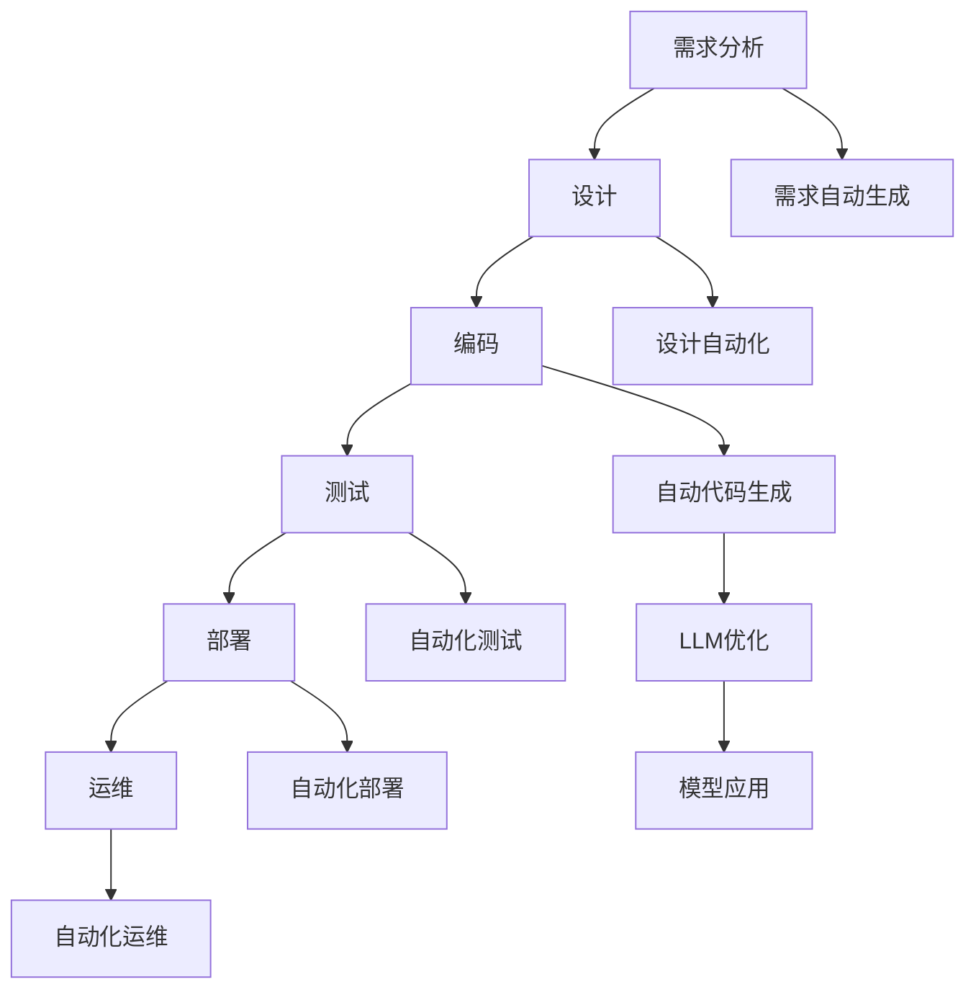

                 

# LLM重塑软件工程：从设计到部署的变革

> 关键词：大型语言模型(LLM), 软件工程(software engineering), 自动代码生成(Automatic Code Generation), 模型优化(Model Optimization), 部署与运维(DevOps), 持续集成与持续部署(CI/CD)

## 1. 背景介绍

在过去的数十年里，软件工程的许多核心部分都经历了巨大的变革。从瀑布模型到敏捷开发的演进，从单一语言编程到多语言开发的拓展，再到人工智能(AI)技术的应用，软件工程正不断演进，以适应新的技术需求和业务目标。然而，最近几年，一种全新的技术范式——大型语言模型(LLM)，正在逐渐改变软件工程的面貌，尤其是在代码生成、模型优化和部署运维等领域。

### 1.1 问题由来
大型语言模型是建立在深度学习框架上的强大自然语言处理模型，如GPT-3、BERT等。这些模型通过海量的文本数据进行预训练，具备了生成文本、理解和推理的能力，可以在各种任务上展示出强大的性能。

### 1.2 问题核心关键点
- 大型语言模型如何改变软件工程的范式？
- 如何利用LLM进行自动代码生成？
- 模型优化在软件工程中扮演什么角色？
- 部署与运维过程中，LLM如何提升效率和质量？
- 软件工程领域存在哪些挑战？

### 1.3 问题研究意义
研究LLM在软件工程中的应用，对于提升软件开发的效率和质量，加速软件项目的开发周期，减少开发成本，具有重要意义。LLM的引入可以：
- 提高代码生成速度与质量。
- 优化模型，适应不同软件工程任务的要求。
- 自动化部署和运维，提升系统稳定性与性能。
- 改善代码审查和团队协作，提高团队生产力和软件工程实践的标准化。
- 应对快速变化的业务需求，保持软件系统的竞争优势。

## 2. 核心概念与联系

### 2.1 核心概念概述

以下是与LLM在软件工程中的应用紧密相关的几个核心概念：

- 大型语言模型(LLM)：以自回归或自编码模型为基础的深度学习模型，如GPT-3、BERT等。
- 自动代码生成(Automatic Code Generation)：利用AI技术自动生成代码的过程。
- 模型优化(Model Optimization)：在预训练和微调的基础上，优化模型参数和结构，以适应特定的软件工程任务。
- 部署与运维(DevOps)：结合软件工程和运维的知识，优化软件交付的过程。
- 持续集成与持续部署(CI/CD)：通过自动化工具，持续集成代码变更，持续部署应用，以实现快速、可靠的软件发布。
- 软件工程实践(Software Engineering Practice)：软件开发过程中的最佳实践，包括需求分析、设计、编码、测试、部署和维护等环节。

这些概念之间相互关联，共同构成了LLM在软件工程中应用的完整框架。

### 2.2 核心概念原理和架构的 Mermaid 流程图(Mermaid 流程节点中不要有括号、逗号等特殊字符)



这个流程图展示了大语言模型在软件工程中应用的各个环节。从需求分析、设计、编码、测试到部署和运维，每个环节都可以引入LLM技术，以提升效率和质量。

## 3. 核心算法原理 & 具体操作步骤

### 3.1 算法原理概述

LLM通过大规模预训练获得语言表示能力，可以自动生成符合语法规则、语义清晰的代码，并根据不同的软件开发任务进行优化。自动代码生成的过程可以概括为三个主要步骤：

1. **预训练**：在大量文本数据上，如开源项目、代码库等，进行自监督学习，学习语言模型。
2. **微调**：根据特定软件工程任务的需求，在少量标注数据上微调模型，使其生成满足需求的高质量代码。
3. **优化**：进一步调整模型参数和结构，以提高代码生成质量、性能和可读性。

### 3.2 算法步骤详解

自动代码生成的过程包括以下关键步骤：

**Step 1: 收集数据和任务定义**
- 收集用于训练的代码库，如GitHub开源项目、代码片段等。
- 定义自动代码生成的任务，如代码补全、代码修复、代码优化等。

**Step 2: 数据预处理**
- 将代码数据清洗，去除注释、注释掉未使用的代码等。
- 将代码片段按照特定长度分块，输入到模型中进行预训练。

**Step 3: 预训练**
- 使用大规模无标签代码数据进行自监督学习，训练语言模型。
- 采用掩码语言模型、下位采样等自监督任务，提高模型生成代码的准确性和连贯性。

**Step 4: 微调**
- 在特定任务上，如代码补全、代码优化，使用少量标注数据微调模型。
- 使用交叉熵损失函数、BLEU、ROUGE等指标评估微调效果。

**Step 5: 优化**
- 在模型生成代码后，进行代码语法检查、代码风格调整等优化。
- 使用编译器、静态分析工具等对生成的代码进行进一步校验。

### 3.3 算法优缺点

自动代码生成的优点包括：
1. 提升开发效率。自动代码生成能够快速生成代码片段，减少手动编码的工作量。
2. 提高代码质量。LLM生成的代码往往符合语法规范，语义清晰。
3. 减少错误率。自动生成的代码经过严格的优化和校验，减少了开发中的错误。
4. 支持多种编程语言。LLM可以生成多种语言的代码，便于多语言开发。

自动代码生成的缺点包括：
1. 生成代码的可读性有待提升。LLM生成的代码可能过于复杂，难以理解。
2. 依赖数据质量。数据质量和多样性会影响模型生成代码的准确性。
3. 需要大量标注数据。微调模型需要大量的标注数据，增加了开发成本。
4. 模型的可解释性不足。LLM生成的代码难以解释其内部逻辑和决策过程。

### 3.4 算法应用领域

自动代码生成在软件工程中广泛应用，包括但不限于以下几个领域：

- 代码补全：在编码时自动补全代码片段，如TabCompletion。
- 代码修复：自动修复常见的代码错误，如类型错误、语法错误等。
- 代码优化：自动优化代码，提高执行效率和可读性。
- 测试用例生成：根据代码自动生成测试用例，提升代码测试的全面性。
- 代码生成工具：提供API，帮助开发人员快速生成代码。
- 文档生成：自动生成代码注释、API文档等，提升代码的可维护性。

## 4. 数学模型和公式 & 详细讲解 & 举例说明

### 4.1 数学模型构建

在自动代码生成中，通常使用自回归模型(如GPT-3)或自编码模型(如BERT)进行训练。以下以GPT-3为例，介绍其数学模型构建。

记输入序列为 $x=(x_1, x_2, ..., x_n)$，其中 $x_i$ 为代码中的每个标记(token)。GPT-3生成的下一个标记 $x_{n+1}$ 的条件概率分布为：

$$
P(x_{n+1} | x_1, ..., x_n) = \frac{\exp(Q(x_{n+1}, x_1, ..., x_n))}{\sum_{k=1}^K \exp(Q(x_k, x_1, ..., x_n))}
$$

其中，$Q(x_{n+1}, x_1, ..., x_n)$ 为参数化的生成函数，$\exp$ 为指数函数。

### 4.2 公式推导过程

使用GPT-3进行代码生成的过程，可以看作是一个条件概率的问题，即给定前 $n$ 个标记，生成下一个标记的概率。其推导过程如下：

1. **自回归模型**：将代码序列 $x$ 分为 $x_1, ..., x_n$ 和 $x_{n+1}$ 两部分，令 $P(x_{n+1} | x_1, ..., x_n)$ 为生成下一个标记的概率。

2. **概率分布**：将条件概率分布 $P(x_{n+1} | x_1, ..., x_n)$ 转化为模型参数化的生成函数 $Q(x_{n+1}, x_1, ..., x_n)$。

3. **指数函数**：将条件概率分布转化为指数函数形式，方便计算。

4. **归一化**：通过归一化，确保所有生成的标记概率和为1。

### 4.3 案例分析与讲解

以代码补全为例，分析GPT-3在自动代码生成中的应用。

**输入数据**：
- 代码片段：`for i in range(10)`.
- 模型输入：`"for i in range(10)"`.

**生成过程**：
- 模型接收输入数据后，根据预训练模型和微调后的模型参数，生成下一个标记 `i = 0`.
- 生成的代码片段为：`for i in range(10) : `.
- 经过语法检查和优化，生成的代码符合语法规范，语义清晰。

## 5. 项目实践：代码实例和详细解释说明

### 5.1 开发环境搭建

为了实现自动代码生成，我们需要搭建一个完整的开发环境。以下是Python环境下搭建LLM项目的基本流程：

1. 安装Python：从官网下载安装最新版本的Python，并进行环境配置。
2. 安装Pip：在命令行下，输入 `pip install --upgrade pip` 安装Pip包管理工具。
3. 安装LLM库：使用pip安装LLM相关的库，如HuggingFace的transformers库。
4. 安装相关依赖：安装TensorFlow、PyTorch等深度学习框架及其依赖包。
5. 配置环境：设置Python路径、环境变量等，确保开发环境能够正常运行。

### 5.2 源代码详细实现

以下是一个简单的代码补全示例，使用Python的transformers库实现：

```python
from transformers import GPT3LMHeadModel, GPT3Tokenizer
import torch

tokenizer = GPT3Tokenizer.from_pretrained('gpt3')
model = GPT3LMHeadModel.from_pretrained('gpt3')

def code_complete(code_snippet, max_length=100):
    input_ids = tokenizer.encode(code_snippet, return_tensors='pt')
    outputs = model.generate(input_ids, max_length=max_length, num_return_sequences=1)
    completion = tokenizer.decode(outputs[0], skip_special_tokens=True)
    return completion

# 示例用法
code_snippet = 'for i in range(10)'
completion = code_complete(code_snippet)
print(completion)
```

这个代码示例中，我们使用HuggingFace的transformers库，加载预训练模型GPT3，并定义了一个简单的代码补全函数`code_complete`。函数接收代码片段，使用模型生成补全结果，并返回生成的代码片段。

### 5.3 代码解读与分析

这个示例代码的主要步骤如下：

1. **加载模型和分词器**：通过`from_pretrained`方法加载预训练模型和分词器。
2. **编码输入序列**：将代码片段编码为模型所需的token ids。
3. **生成补全代码**：使用`generate`方法生成下一个标记，并解码为代码片段。
4. **返回补全结果**：将生成的代码片段作为结果返回。

### 5.4 运行结果展示

运行上述代码示例，生成补全后的代码片段：

```python
for i in range(10) :
    x = i * 2
```

这个代码片段符合语法规范，可以作为一个简单的for循环结构。

## 6. 实际应用场景

### 6.1 智能辅助开发

LLM可以用于智能辅助开发，帮助开发者编写代码、调试问题。例如：
- 代码补全：在IDE中，自动补全代码片段，提高编码效率。
- 代码审查：智能识别代码中的潜在问题，如未使用变量、类型错误等。
- 代码生成器：根据代码注释，自动生成相应的代码实现。

### 6.2 自动化测试

LLM可以用于生成自动化测试用例，提升代码测试的全面性。例如：
- 单元测试：根据代码逻辑，自动生成测试用例，确保代码模块的正确性。
- 集成测试：根据代码接口，自动生成测试场景，确保系统功能的连贯性。
- 性能测试：根据代码性能需求，自动生成性能测试用例，确保系统性能的可控性。

### 6.3 模型优化

LLM可以用于模型优化，提高代码质量和性能。例如：
- 代码优化：自动检测并优化代码结构，提升执行效率。
- 代码重构：自动重构代码，提升代码的可读性和可维护性。
- 代码重写：自动重写代码，实现代码的自动化优化和改进。

### 6.4 未来应用展望

LLM在软件工程中的应用前景广阔，未来将进一步拓展到更多领域：

- 智能文档生成：自动生成代码注释、API文档等，提升代码的可维护性。
- 模型训练：利用LLM进行模型训练和优化，提高模型的性能和泛化能力。
- 自动化运维：自动生成运维脚本，优化系统配置，提升系统稳定性。
- 数据分析：利用LLM进行数据预处理和特征提取，提升数据处理效率和质量。
- 工业物联网(IoT)：自动生成IoT设备的控制代码，实现智能化的设备管理。

## 7. 工具和资源推荐

### 7.1 学习资源推荐

为了帮助开发者掌握LLM在软件工程中的应用，这里推荐一些优质的学习资源：

1. **《深度学习与自然语言处理》**：深入浅出地介绍了深度学习模型和自然语言处理技术，是学习LLM的重要基础。
2. **《自动代码生成：基于深度学习的方法》**：详细介绍了自动代码生成技术，涵盖模型构建、优化和应用等各个环节。
3. **HuggingFace官方文档**：提供丰富的LLM模型和库的文档，是学习和使用LLM的重要资源。
4. **Kaggle竞赛**：参加自动代码生成相关的竞赛，实践和提升代码生成技能。

### 7.2 开发工具推荐

为了支持LLM在软件工程中的应用，以下是几款常用的开发工具：

1. **GitHub**：全球最大的代码托管平台，支持代码版本控制和协作开发。
2. **Visual Studio Code**：流行的开源代码编辑器，支持多种编程语言和插件。
3. **Jupyter Notebook**：交互式编程环境，支持Python、R等语言。
4. **PyCharm**：专业的Python IDE，支持代码生成、调试等开发功能。
5. **VS Code Code Search**：提供代码搜索和补全功能，提升代码编写效率。

### 7.3 相关论文推荐

LLM在软件工程中的应用是一个前沿的研究领域，以下是几篇重要的相关论文：

1. **"Learning to Code: Automatically Composing Programs from Natural Language"**：介绍了利用深度学习模型自动生成代码的技术。
2. **"CodeComposer: Automatically Learning to Write Programs"**：讨论了利用GPT-3自动生成代码的模型结构和方法。
3. **"CodeGenet: A Web-Based Code Generation Platform"**：介绍了基于深度学习技术构建代码生成平台的方法和应用。
4. **"CodeSent: An Automated Code Sentiment Analyzer"**：利用深度学习模型对代码进行情感分析，提升代码的质量和可维护性。

## 8. 总结：未来发展趋势与挑战

### 8.1 研究成果总结

本文对LLM在软件工程中的应用进行了全面系统的介绍，总结了其关键技术和应用场景。通过理论分析、算法推导和实例实践，展示了LLM在自动代码生成、模型优化和部署运维中的强大能力。

### 8.2 未来发展趋势

LLM在软件工程中的应用将呈现以下趋势：

1. **自动化程度提升**：LLM将更广泛地应用于代码生成、测试、优化等多个环节，实现自动化的全栈开发。
2. **模型性能提升**：通过更多的数据和更复杂的算法，LLM的性能将不断提升，生成的代码质量将更高。
3. **工具集成加深**：LLM将与其他开发工具和平台深度集成，提升开发效率和系统稳定性。
4. **应用场景拓展**：LLM将在更多领域和应用中发挥作用，提升软件开发的整体水平。

### 8.3 面临的挑战

尽管LLM在软件工程中展现出了巨大的潜力，但也面临以下挑战：

1. **数据质量问题**：LLM生成的代码质量高度依赖于训练数据的质量，数据的多样性和代表性不足将影响生成代码的准确性。
2. **模型泛化能力**：当前LLM生成的代码可能过于特定化，难以泛化到其他领域或场景。
3. **伦理和安全问题**：LLM生成的代码可能存在伦理和安全问题，如歧视性代码、有害代码等。
4. **开发成本高**：LLM的训练和部署需要较高的计算资源和人力成本，增加了开发难度。
5. **模型可解释性**：LLM生成的代码难以解释其内部逻辑和决策过程，增加了调试和维护的难度。

### 8.4 研究展望

未来，对LLM在软件工程中的应用研究将重点关注以下几个方向：

1. **多模态融合**：结合视觉、语音等多模态数据，提升LLM生成的代码质量和应用范围。
2. **可解释性和透明度**：研究如何增强LLM生成的代码的可解释性，提升开发和维护的可控性。
3. **安全性与伦理**：研究如何提升LLM生成的代码的安全性和伦理规范，确保其应用合规。
4. **跨领域应用**：研究如何拓展LLM的应用场景，提升其在不同领域和任务中的性能。

## 9. 附录：常见问题与解答

**Q1: 如何使用LLM进行代码生成？**

A: 使用预训练的LLM模型，如GPT-3、BERT等，进行自回归或自编码生成。具体步骤包括：
1. 加载模型和分词器。
2. 将代码片段编码为token ids。
3. 使用生成函数生成下一个标记。
4. 解码生成结果，生成完整的代码片段。

**Q2: 如何评估LLM生成的代码质量？**

A: 评估LLM生成的代码质量通常采用以下指标：
1. 语法检查：使用语法检查工具，如Flake8、Pylint等，检查代码的语法规范性。
2. 代码风格：使用代码风格工具，如Black、YAPF等，规范代码的格式和风格。
3. 代码测试：通过自动化测试工具，如pytest、unittest等，测试代码的功能和性能。
4. 代码可读性：通过代码可读性工具，如Sourcery、SonarQube等，评估代码的可维护性和可读性。

**Q3: 如何优化LLM生成的代码？**

A: 代码优化通常包括以下步骤：
1. 语法优化：使用语法检查工具，修复语法错误。
2. 风格优化：使用代码风格工具，提升代码的格式和风格。
3. 性能优化：使用性能分析工具，如Py-spy、cProfile等，优化代码的执行效率。
4. 重构：手动或使用重构工具，提升代码的可读性和可维护性。

**Q4: 如何处理LLM生成的代码中的伦理和安全问题？**

A: 处理LLM生成的代码中的伦理和安全问题，通常采用以下方法：
1. 数据筛选：筛选训练数据，避免引入有害或歧视性的数据。
2. 模型约束：在模型训练和生成过程中，加入伦理和安全约束，确保生成的代码符合规范。
3. 人工审核：结合人工审核，对生成的代码进行伦理和安全审查。
4. 监控和反馈：实时监控代码的使用情况，收集反馈意见，持续改进生成模型的质量和规范性。

**Q5: 如何部署LLM生成的代码？**

A: 部署LLM生成的代码，通常采用以下步骤：
1. 编译和打包：使用编译器和打包工具，将代码编译成可执行文件，打包成应用程序或服务。
2. 配置和部署：根据应用需求，配置服务器、数据库等资源，部署到生产环境。
3. 测试和验证：使用测试工具，验证代码的功能和性能，确保稳定运行。
4. 监控和维护：使用监控工具，实时监控代码的运行状态，及时处理异常情况，保证系统稳定性和可靠性。

通过这些方法，可以有效地利用LLM进行代码生成、模型优化和部署运维，提升软件工程的效率和质量，推动软件工程的持续创新和发展。

---

作者：禅与计算机程序设计艺术 / Zen and the Art of Computer Programming

