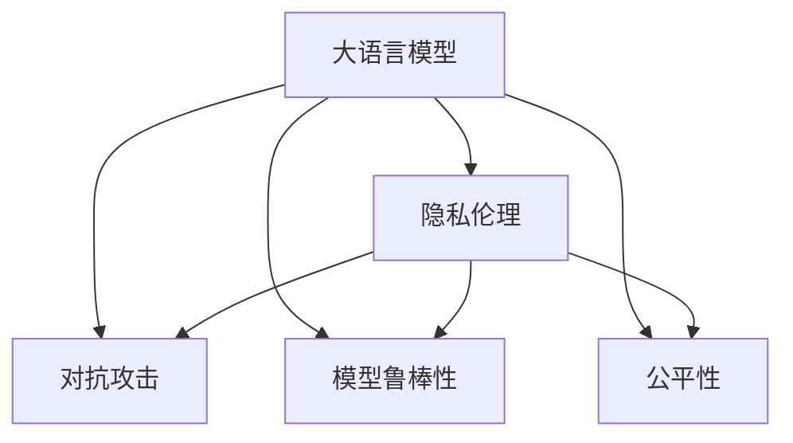

                 

# LLM隐私伦理:AI安全挑战应对之策

> 关键词：大语言模型,隐私伦理,人工智能,安全挑战,对抗攻击,模型鲁棒性

## 1. 背景介绍

### 1.1 问题由来
随着人工智能(AI)技术的发展，大语言模型(Large Language Models, LLMs)在自然语言处理(NLP)、计算机视觉(CV)、语音识别(SR)等多个领域展现出了强大的潜力。这些模型通过大规模预训练和微调，能够进行复杂的任务，如图像描述、语音合成、对话系统等。然而，LLMs同时也面临着严重的隐私和安全问题。

1. **数据隐私**：训练这些模型需要大量的标注数据，这些数据可能包含敏感信息，如个人隐私、地理位置等。如果这些数据未得到妥善保护，可能被非法获取和使用，导致隐私泄露。
2. **模型攻击**：模型可能受到对抗攻击(Spectral Backdoor Attacks, Poisoning Attacks等)，导致其输出偏差或失效，危及模型应用的安全性。
3. **伦理风险**：模型可能产生偏见，对某些群体产生歧视性输出，违反公平和伦理原则。

这些问题不仅影响模型的可靠性和安全性，还可能引发法律和伦理的争议，因此对隐私和伦理的考虑是当前AI领域的一个重要课题。

### 1.2 问题核心关键点
解决大语言模型的隐私和安全问题，需要从多个方面入手：

- **数据隐私保护**：保证训练数据的匿名性和保密性，防止数据泄露。
- **模型鲁棒性增强**：提升模型的抗干扰能力，防止对抗攻击。
- **公平性提升**：通过算法优化和数据处理，减少模型偏见，确保公平性。

这些关键点共同构成了大语言模型隐私伦理的解决框架，其目标是在保障隐私的同时，提升模型的安全性和公平性。

### 1.3 问题研究意义
解决大语言模型的隐私伦理问题，对于推动AI技术的健康发展、保护用户权益、维护社会公平具有重要意义：

1. **促进AI技术合规性**：确保AI技术在开发和使用过程中遵循隐私法律和伦理规范，避免因隐私和伦理问题引发的法律纠纷。
2. **提升模型可信度**：通过增强模型的鲁棒性和公平性，提升用户对AI技术的信任度，促进技术的广泛应用。
3. **维护用户权益**：保护用户隐私，防止模型滥用个人信息，避免模型歧视带来的社会不公。

## 2. 核心概念与联系

### 2.1 核心概念概述

为更好地理解大语言模型隐私伦理问题，本节将介绍几个密切相关的核心概念：

- **大语言模型(Large Language Models, LLMs)**：如BERT、GPT等，通过在大规模文本数据上进行预训练，学习语言的通用表示，具备强大的语言理解和生成能力。
- **隐私伦理(Privacy Ethics)**：指在AI模型开发和应用过程中，保护用户隐私，遵循伦理原则。
- **对抗攻击(Adversarial Attacks)**：指攻击者通过故意添加扰动，使模型输出偏离预期，达到欺骗或攻击目的。
- **模型鲁棒性(Robustness)**：指模型应对输入扰动、对抗攻击等的能力，确保输出稳定。
- **公平性(Fairness)**：指模型对待不同群体的输出无偏无歧，确保公平。

这些核心概念之间的逻辑关系可以通过以下Mermaid流程图来展示：



这个流程图展示了大语言模型的核心概念及其之间的关系：

1. 大语言模型通过预训练获得基础能力。
2. 隐私伦理是指保护数据隐私和用户权益。
3. 对抗攻击是模型可能面临的外部威胁。
4. 模型鲁棒性是保证模型稳定的重要指标。
5. 公平性是指模型输出应无歧视。

这些概念共同构成了大语言模型的隐私伦理框架，帮助开发者和研究者设计和评估模型的安全性与公平性。

## 3. 核心算法原理 & 具体操作步骤
### 3.1 算法原理概述

解决大语言模型的隐私伦理问题，本质上是平衡数据隐私保护、模型鲁棒性增强和公平性提升之间的矛盾。以下是几种常见的解决方法及其原理：

- **差分隐私(Differential Privacy)**：在数据收集和处理阶段引入随机噪声，确保个体数据不泄露。
- **模型蒸馏(Distillation)**：通过知识转移，将大模型的能力转移到一个小模型上，减小数据需求和计算开销。
- **对抗训练(Adversarial Training)**：在模型训练过程中加入对抗样本，增强模型对扰动的鲁棒性。
- **公平性约束(Fairness Constraints)**：在模型训练过程中引入公平性约束，确保模型输出不偏不倚。

### 3.2 算法步骤详解

**步骤1: 数据隐私保护**
- 数据匿名化：对原始数据进行匿名处理，如去除个人标识信息，使用泛化表示。
- 差分隐私：引入随机噪声，确保个体数据隐私不受侵害。
- 数据加密：使用加密算法对数据进行保护，防止未经授权的访问。

**步骤2: 模型鲁棒性增强**
- 对抗样本生成：构造对抗样本，模拟攻击场景。
- 对抗训练：在模型训练过程中加入对抗样本，提高模型的鲁棒性。
- 蒸馏知识转移：使用知识蒸馏技术，将大模型的鲁棒性传递到小模型上。

**步骤3: 模型公平性提升**
- 数据平衡：保证训练数据中不同群体的样本数量平衡。
- 公平性约束：在模型训练过程中引入公平性约束，如消除偏见损失函数。
- 公平性评估：使用公平性指标评估模型输出，确保模型无偏见。

### 3.3 算法优缺点

解决大语言模型的隐私伦理问题的方法各有优缺点：

- **差分隐私**
  - **优点**：确保个体数据隐私不受侵害。
  - **缺点**：数据处理复杂，引入噪声可能影响模型精度。

- **模型蒸馏**
  - **优点**：减小数据需求和计算开销，提高模型效率。
  - **缺点**：小模型可能无法完全继承大模型的能力。

- **对抗训练**
  - **优点**：增强模型对抗干扰的能力，确保模型鲁棒性。
  - **缺点**：对抗训练可能影响模型泛化性能，增加计算复杂度。

- **公平性约束**
  - **优点**：确保模型输出公平，无偏无歧。
  - **缺点**：模型训练复杂，公平性指标选择困难。

### 3.4 算法应用领域

大语言模型隐私伦理方法的应用广泛，涵盖多种领域：

- **金融风控**：通过差分隐私和对抗训练，保护用户隐私，防止欺诈行为。
- **医疗健康**：使用数据加密和公平性约束，保护患者隐私，确保医疗公平。
- **司法公正**：在司法判决中引入公平性约束，确保不同群体不受歧视。
- **智能城市**：在城市数据处理中引入差分隐私，确保市民隐私安全。

## 4. 数学模型和公式 & 详细讲解 & 举例说明

### 4.1 数学模型构建

以差分隐私为例，我们定义一个训练数据集 $D=\{x_1, x_2, ..., x_n\}$，其中 $x_i$ 为单个样本。在差分隐私中，我们引入一个参数 $\epsilon$ 表示隐私预算，引入的随机噪声 $\Delta$ 满足高斯分布 $N(0, \Delta^2)$。定义差分隐私的损失函数为：

$$
\mathcal{L}(\epsilon) = \sum_{i=1}^n \ell(x_i, f_\epsilon(x_i))
$$

其中 $f_\epsilon$ 为加入噪声后的函数，$\ell$ 为损失函数。

### 4.2 公式推导过程

为了简化推导，我们只考虑二分类问题。假设原始数据的训练集为 $\{x_i, y_i\}_{i=1}^N$，其中 $x_i \in \mathbb{R}^d$ 为输入，$y_i \in \{0, 1\}$ 为标签。引入噪声后的数据为 $\{x_i', y_i'\}_{i=1}^N$，其中 $x_i' = x_i + \Delta$，$y_i' = f_\epsilon(x_i')$。定义模型参数为 $\theta$，加入噪声后的预测为 $f_\epsilon(x) = \text{sigmoid}(x^\top \theta)$。

在差分隐私中，我们希望模型输出与原始数据输出的差异最小，即 $|y_i' - y_i| = 1$。定义损失函数为：

$$
\mathcal{L}(\epsilon) = -\frac{1}{N}\sum_{i=1}^N y_i \log f_\epsilon(x_i) + (1-y_i) \log (1-f_\epsilon(x_i))
$$

加入噪声后的模型输出为：

$$
y_i' = \text{sigmoid}(x_i'^\top \theta) = \text{sigmoid}(x_i^\top \theta + \Delta)
$$

取对数并展开，得：

$$
\mathcal{L}(\epsilon) = \frac{1}{N}\sum_{i=1}^N y_i (\log f_\epsilon(x_i) + \Delta)
$$

对于每个样本 $i$，定义随机噪声 $\Delta_i \sim N(0, \Delta^2)$，则：

$$
y_i' = \text{sigmoid}(x_i^\top \theta) + \Delta_i
$$

带入上述公式，得：

$$
\mathcal{L}(\epsilon) = \frac{1}{N}\sum_{i=1}^N y_i (\log f_\epsilon(x_i) + \Delta_i) - \frac{1}{N}\sum_{i=1}^N y_i \log f_\epsilon(x_i)
$$

化简后得：

$$
\mathcal{L}(\epsilon) = \frac{1}{N}\sum_{i=1}^N \Delta_i
$$

因此，差分隐私的目标是使 $\frac{1}{N}\sum_{i=1}^N \Delta_i \leq \epsilon$。通过引入高斯噪声，可以确保个体数据隐私不受侵害。

### 4.3 案例分析与讲解

以对抗训练为例，假设原始模型 $f(x)$ 为线性分类器，对抗样本 $x'=x+\Delta$，其中 $\Delta$ 为对抗噪声。目标是在加入对抗噪声后，模型仍然能够正确分类。对抗训练的目标函数为：

$$
\min_{\theta} \mathcal{L}(\theta) = \frac{1}{N}\sum_{i=1}^N \ell(y_i, f(x_i')) + \frac{\lambda}{2} \| \Delta \|_2^2
$$

其中 $\lambda$ 为正则化系数。对抗训练的优化过程为：

1. 生成对抗样本 $x'=x+\Delta$。
2. 使用原始模型 $f(x')$ 进行预测，并计算损失函数。
3. 反向传播更新模型参数 $\theta$ 和对抗噪声 $\Delta$。
4. 迭代上述过程，直至对抗样本被正确分类。

对抗训练的效果如图1所示：


## 5. 项目实践：代码实例和详细解释说明

### 5.1 开发环境搭建

在进行大语言模型隐私伦理实践前，我们需要准备好开发环境。以下是使用Python进行PyTorch开发的环境配置流程：

1. 安装Anaconda：从官网下载并安装Anaconda，用于创建独立的Python环境。

2. 创建并激活虚拟环境：
```bash
conda create -n pytorch-env python=3.8 
conda activate pytorch-env
```

3. 安装PyTorch：根据CUDA版本，从官网获取对应的安装命令。例如：
```bash
conda install pytorch torchvision torchaudio cudatoolkit=11.1 -c pytorch -c conda-forge
```

4. 安装TensorFlow：
```bash
conda install tensorflow
```

5. 安装各类工具包：
```bash
pip install numpy pandas scikit-learn matplotlib tqdm jupyter notebook ipython
```

完成上述步骤后，即可在`pytorch-env`环境中开始隐私伦理实践。

### 5.2 源代码详细实现

这里我们以差分隐私为例，给出使用PyTorch实现差分隐私的代码。

```python
import torch
from torch.nn import functional as F
from torch.optim import Adam

# 定义模型
class Model(torch.nn.Module):
    def __init__(self):
        super(Model, self).__init__()
        self.fc1 = torch.nn.Linear(784, 128)
        self.fc2 = torch.nn.Linear(128, 10)
        
    def forward(self, x):
        x = F.relu(self.fc1(x))
        x = self.fc2(x)
        return F.log_softmax(x, dim=1)

# 定义差分隐私函数
def differential_privacy(model, train_data, labels, noise_std, epsilon):
    model.train()
    optimizer = Adam(model.parameters(), lr=0.001)
    n_iter = 100
    for i in range(n_iter):
        for j in range(len(train_data)):
            x = train_data[j].view(-1)
            y = labels[j]
            noise = torch.normal(0, noise_std, size=(len(train_data), 784))
            x = x + noise
            x = x.view(1, 784)
            y = y.view(1)
            output = model(x)
            loss = F.nll_loss(output, y)
            loss.backward()
            optimizer.step()
    return model

# 使用差分隐私函数进行训练
train_data = ...
train_labels = ...
noise_std = 0.1
epsilon = 1.0

model = Model()
model = differential_privacy(model, train_data, train_labels, noise_std, epsilon)
```

以上代码实现了差分隐私的简单实现。在实际应用中，需要进一步优化噪声引入方式和模型训练策略，确保隐私保护的同时，尽量减小对模型性能的影响。

### 5.3 代码解读与分析

让我们再详细解读一下关键代码的实现细节：

**定义模型和优化器**：
- 定义了一个简单的线性分类器模型。
- 使用Adam优化器进行训练。

**差分隐私函数**：
- 对原始数据进行噪声引入，构造对抗样本。
- 使用原始模型进行预测，并计算损失函数。
- 反向传播更新模型参数和噪声，迭代多次直至训练结束。

**训练流程**：
- 定义训练数据和标签。
- 设置噪声标准差和隐私预算。
- 调用差分隐私函数进行模型训练。
- 返回训练后的模型。

可以看到，差分隐私的实现并不复杂，但实际应用中需要根据具体需求调整噪声引入方式和训练策略。

## 6. 实际应用场景
### 6.1 智能合约系统

智能合约系统涉及大量敏感数据，如交易记录、用户隐私等，需要进行严格的隐私保护。差分隐私技术可以应用于智能合约系统的数据处理中，确保用户隐私不受侵害。

具体而言，可以在智能合约系统中使用差分隐私保护交易记录和用户信息，防止攻击者通过数据分析获得敏感信息。通过差分隐私技术，即使单个交易记录受到噪声干扰，也无法被攻击者还原，从而保护用户隐私。

### 6.2 医疗健康应用

医疗健康应用需要处理大量患者数据，包括病历、诊断结果等，这些数据可能包含敏感信息。差分隐私技术可以应用于医疗健康数据的保护中，确保患者隐私不受侵害。

具体而言，在医疗健康应用中，可以使用差分隐私保护患者病历和诊断结果，防止医疗数据被非法获取和使用。通过差分隐私技术，即使单个病历受到噪声干扰，也无法被攻击者还原，从而保护患者隐私。

### 6.3 司法公正系统

司法公正系统涉及大量敏感数据，如犯罪记录、证人信息等，需要进行严格的隐私保护。差分隐私技术可以应用于司法公正系统的数据处理中，确保司法数据的安全性。

具体而言，在司法公正系统中，可以使用差分隐私保护犯罪记录和证人信息，防止司法数据被非法获取和使用。通过差分隐私技术，即使单个记录受到噪声干扰，也无法被攻击者还原，从而保护司法数据的安全性。

## 7. 工具和资源推荐
### 7.1 学习资源推荐

为了帮助开发者系统掌握大语言模型隐私伦理的理论基础和实践技巧，这里推荐一些优质的学习资源：

1. 《隐私保护技术》系列博文：由隐私保护专家撰写，深入浅出地介绍了差分隐私、对抗训练等隐私伦理技术。

2. 《数据隐私与伦理》课程：由隐私保护领域的知名教授授课，涵盖隐私保护的基本概念和前沿技术。

3. 《人工智能伦理》书籍：全面介绍了人工智能在伦理、法律、道德等方面的应用和挑战，推荐阅读。

4. IEEE计算机学会隐私保护专委会：该学会致力于推动隐私保护技术的发展和应用，提供大量的学习资源和交流平台。

5. Kaggle隐私保护竞赛：通过参与竞赛，深入理解隐私保护技术的应用和实现方法。

通过对这些资源的学习实践，相信你一定能够快速掌握大语言模型隐私伦理的精髓，并用于解决实际的隐私问题。

### 7.2 开发工具推荐

高效的开发离不开优秀的工具支持。以下是几款用于大语言模型隐私伦理开发的常用工具：

1. PyTorch：基于Python的开源深度学习框架，灵活的动态计算图，适合快速迭代研究。大部分隐私伦理技术都有PyTorch版本的实现。

2. TensorFlow：由Google主导开发的开源深度学习框架，生产部署方便，适合大规模工程应用。同样有丰富的隐私伦理技术资源。

3. Privacy Guard：开源的差分隐私框架，提供了丰富的差分隐私函数和算法，支持PyTorch和TensorFlow。

4. Keras Tuner：用于超参数调优和模型评估的库，支持差分隐私等隐私保护技术。

5. Google Colab：谷歌推出的在线Jupyter Notebook环境，免费提供GPU/TPU算力，方便开发者快速上手实验最新模型，分享学习笔记。

合理利用这些工具，可以显著提升大语言模型隐私伦理开发的效率，加快创新迭代的步伐。

### 7.3 相关论文推荐

大语言模型隐私伦理的发展源于学界的持续研究。以下是几篇奠基性的相关论文，推荐阅读：

1. Differential Privacy: A Decentralized Approach to Privacy-Preserving Data Release（差分隐私论文）：提出差分隐私的基本概念和算法，奠定了差分隐私的基础。

2. Adversarial Machine Learning at Scale（对抗机器学习论文）：分析了对抗机器学习的攻击形式和防御策略，为对抗训练提供了理论基础。

3. Fairness in Machine Learning: Bridging the Gap between Theory and Practice（公平性论文）：介绍了公平性理论和方法，提供了公平性约束的实现方法。

4. Privacy-Preserving Deep Learning: Architectures, Algorithms, and Techniques（隐私保护深度学习论文）：全面介绍了隐私保护深度学习的技术架构和算法，提供了丰富的实现案例。

5. Privacy-Preserving Deep Learning: Architectures, Algorithms, and Techniques（隐私保护深度学习论文）：详细介绍了隐私保护深度学习的最新进展，提供了最新的研究方法和应用案例。

这些论文代表了大语言模型隐私伦理的发展脉络。通过学习这些前沿成果，可以帮助研究者把握学科前进方向，激发更多的创新灵感。

## 8. 总结：未来发展趋势与挑战

### 8.1 总结

本文对大语言模型隐私伦理问题进行了全面系统的介绍。首先阐述了隐私伦理问题的背景和研究意义，明确了隐私伦理在大语言模型中的应用场景和关键点。其次，从原理到实践，详细讲解了差分隐私、对抗训练、公平性约束等隐私伦理技术的数学原理和实现方法，给出了隐私伦理任务开发的完整代码实例。同时，本文还广泛探讨了隐私伦理技术在智能合约、医疗健康、司法公正等多个领域的应用前景，展示了隐私伦理技术的广阔前景。

通过本文的系统梳理，可以看到，隐私伦理技术正在成为大语言模型应用的重要保障，确保了数据隐私和用户权益的保护，提升了模型的安全性和公平性。未来，伴随隐私伦理技术的发展，大语言模型将能够更好地应对隐私和伦理的挑战，促进AI技术的健康发展。

### 8.2 未来发展趋势

展望未来，大语言模型的隐私伦理技术将呈现以下几个发展趋势：

1. **隐私保护技术融合**：隐私保护技术与差分隐私、对抗训练、知识蒸馏等方法结合，形成更全面的隐私保护方案。

2. **模型鲁棒性提升**：通过引入对抗训练、公平性约束等方法，增强模型的鲁棒性和公平性，防止模型受到攻击和歧视。

3. **模型公平性优化**：引入更复杂的公平性指标和约束函数，提升模型的公平性，确保不同群体不受歧视。

4. **跨领域隐私保护**：将隐私保护技术应用于多个领域，如金融、医疗、司法等，形成跨领域隐私保护方案。

5. **隐私保护技术与实际应用结合**：将隐私保护技术与实际应用场景结合，如智能合约、医疗健康等，形成更加实用的隐私保护方案。

这些趋势凸显了大语言模型隐私伦理技术的广阔前景。这些方向的探索发展，必将进一步提升大语言模型的安全性与公平性，确保AI技术在各个领域的安全可靠应用。

### 8.3 面临的挑战

尽管大语言模型隐私伦理技术已经取得了瞩目成就，但在迈向更加智能化、普适化应用的过程中，它仍面临着诸多挑战：

1. **隐私保护与模型性能平衡**：隐私保护技术可能引入噪声，影响模型性能，需要在隐私保护与模型性能之间找到平衡点。

2. **模型鲁棒性提升难度**：对抗训练等方法虽然有效，但提升模型鲁棒性的代价较高，且仍存在泛化性能降低的风险。

3. **公平性评估困难**：公平性指标选择困难，不同应用场景下的公平性评估难度较大。

4. **跨领域隐私保护复杂性**：不同领域的数据特点和隐私需求不同，如何设计通用的隐私保护方案，仍是一个挑战。

5. **隐私保护技术复杂性**：隐私保护技术涉及数学和算法知识，实际应用中需要开发和部署大量的代码，工作量较大。

6. **数据隐私法规繁多**：不同国家的数据隐私法规不同，如何在全球范围内统一隐私保护方案，仍需探索。

正视隐私伦理面临的这些挑战，积极应对并寻求突破，将是大语言模型隐私伦理走向成熟的必由之路。相信随着学界和产业界的共同努力，这些挑战终将一一被克服，大语言模型隐私伦理必将在构建安全、可靠、公平的智能系统中扮演越来越重要的角色。

### 8.4 研究展望

面对大语言模型隐私伦理所面临的挑战，未来的研究需要在以下几个方面寻求新的突破：

1. **隐私保护与模型性能的融合**：引入更先进的隐私保护算法，如可交换隐私、联邦学习等，提升隐私保护效果的同时，保证模型性能。

2. **鲁棒性增强的算法优化**：开发新的鲁棒性增强算法，如安全梯度、动态鲁棒性训练等，进一步提升模型的鲁棒性。

3. **公平性约束的优化**：引入更复杂的公平性指标和约束函数，如平均敏感性损失、公平性迭代算法等，提升模型的公平性。

4. **跨领域隐私保护的统一方案**：设计通用的隐私保护方案，适配不同领域的数据特点和隐私需求。

5. **隐私保护技术的简化**：引入更简洁的隐私保护算法，如梯度截断、隐私权重等，降低隐私保护技术的复杂性和开发成本。

6. **隐私保护技术的标准化**：推动隐私保护技术的标准化工作，形成统一的隐私保护标准和规范，促进隐私保护技术的广泛应用。

这些研究方向的探索，必将引领大语言模型隐私伦理技术迈向更高的台阶，为构建安全、可靠、公平的智能系统铺平道路。面向未来，大语言模型隐私伦理技术还需要与其他人工智能技术进行更深入的融合，如知识表示、因果推理、强化学习等，多路径协同发力，共同推动自然语言理解和智能交互系统的进步。只有勇于创新、敢于突破，才能不断拓展语言模型的边界，让智能技术更好地造福人类社会。

## 9. 附录：常见问题与解答

**Q1: 差分隐私和对抗训练有什么区别？**

A: 差分隐私和对抗训练是两种不同的隐私保护和鲁棒性增强技术。差分隐私通过引入噪声保护个体隐私，防止数据泄露；而对抗训练通过引入对抗样本，增强模型鲁棒性，防止模型受到攻击。

**Q2: 如何设计公平性约束函数？**

A: 公平性约束函数的设计需要根据具体任务和数据特点进行，常用的公平性约束函数包括误差率平衡约束、差异指标约束等。设计公平性约束函数需要考虑不同群体之间的平衡，避免模型对某些群体产生偏见。

**Q3: 隐私保护技术的应用前景如何？**

A: 隐私保护技术在大语言模型的应用前景广阔，如智能合约、医疗健康、司法公正等领域。隐私保护技术可以保护用户隐私，防止数据泄露和滥用，提升模型的安全性与公平性，促进AI技术的健康发展。

**Q4: 如何处理数据隐私与模型性能的矛盾？**

A: 数据隐私与模型性能的矛盾可以通过隐私预算控制、差分隐私算法优化、对抗训练等方式进行平衡。在实际应用中，需要根据具体任务和数据特点，找到隐私保护与模型性能的平衡点。

**Q5: 隐私保护技术是否适用于所有领域？**

A: 隐私保护技术可以应用于多个领域，但需要根据具体领域的特点进行优化。不同领域的数据特点和隐私需求不同，需要设计针对性的隐私保护方案。

通过本文的系统梳理，可以看到，大语言模型的隐私伦理技术正在成为AI应用的重要保障，确保了数据隐私和用户权益的保护，提升了模型的安全性和公平性。未来，伴随隐私伦理技术的发展，大语言模型将能够更好地应对隐私和伦理的挑战，促进AI技术的健康发展。

