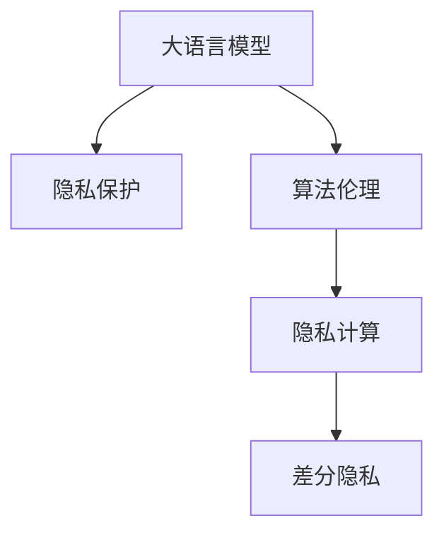

                 

# LLM隐私保护:智能时代的安全底线

> 关键词：大语言模型(Large Language Model, LLM),隐私保护,智能时代,安全底线,算法伦理,隐私计算,差分隐私

## 1. 背景介绍

### 1.1 问题由来
随着人工智能(AI)技术的不断进步，特别是大语言模型(Large Language Models, LLMs)的广泛应用，越来越多的个人数据和隐私信息被收集和使用。这些模型基于大规模的文本数据进行训练，学习并提取其中的语言模式和知识，从而能够生成自然流畅的文本。但随着其在各行各业的深入应用，数据隐私和安全问题也愈发突出。

当前，许多应用如智能客服、个性化推荐、内容生成等，都依赖于用户输入的文本数据。这些数据可能包含个人隐私信息，如地理位置、兴趣爱好、身体健康状况等。如果处理不当，这些数据可能被泄露或滥用，对用户造成潜在的隐私风险。

此外，大语言模型还存在一定的算法偏见问题。由于训练数据本身的固有偏见，模型可能会在特定人群上产生不公平的预测结果，导致歧视性现象。例如，某些模型在处理女性用户数据时可能出现性别偏见，或在处理少数族裔数据时产生种族偏见。

隐私保护和算法伦理问题成为制约大语言模型普及的重要障碍，需要有效应对。因此，本文将重点探讨大语言模型的隐私保护技术，并从算法伦理和隐私计算等角度，提出解决方案和策略。

### 1.2 问题核心关键点
本文将重点关注以下几个关键问题：

1. **隐私保护技术**：如何在保证模型性能的同时，保护用户数据的隐私安全。
2. **算法伦理**：如何避免模型中的固有偏见，确保算法决策的公平性和透明性。
3. **隐私计算**：如何在不泄露原始数据的前提下，进行数据共享和模型训练。
4. **差分隐私**：如何在模型训练和推理过程中，通过噪声扰动等技术保护用户隐私。
5. **隐私保护工具和资源**：推荐相关的隐私保护技术和工具，帮助开发者构建安全可靠的应用。

通过深入分析这些问题，本文旨在为开发者和研究人员提供一套全面的隐私保护策略，确保大语言模型的安全和伦理合规。

### 1.3 问题研究意义
在智能时代，大语言模型的广泛应用极大地提升了生产力和社会效率，但也带来了隐私和伦理的挑战。解决这些问题不仅关乎用户信任，也关乎社会公平和道德底线。因此，研究大语言模型的隐私保护和算法伦理问题，对于构建安全可信的AI应用具有重要意义：

1. **提升用户信任**：通过有效的隐私保护措施，可以增强用户对AI应用的信任感，促进其广泛应用。
2. **促进公平性**：避免算法偏见，确保AI决策的公平性和透明性，减少社会不公现象。
3. **保障数据安全**：防止用户数据被滥用或泄露，保护个人隐私和敏感信息。
4. **推动行业合规**：帮助企业和机构遵循数据隐私法规，减少法律风险。
5. **推动技术进步**：鼓励创新和研究，提升AI技术的隐私保护水平。

## 2. 核心概念与联系

### 2.1 核心概念概述

为更好地理解大语言模型的隐私保护技术，本节将介绍几个密切相关的核心概念：

- **大语言模型(Large Language Model, LLM)**：以自回归(如GPT)或自编码(如BERT)模型为代表的大规模预训练语言模型。通过在大规模无标签文本语料上进行预训练，学习通用的语言表示，具备强大的语言理解和生成能力。

- **隐私保护**：指在处理个人数据时，采用各种技术手段，确保数据隐私不被泄露，保护用户个人信息安全的实践。

- **算法伦理**：指在开发和使用AI系统时，遵循伦理准则，确保系统决策公平、透明、可解释，并避免歧视和偏见。

- **隐私计算**：通过加密技术、差分隐私等方法，在保护数据隐私的前提下，进行数据共享和模型训练的计算范式。

- **差分隐私**：一种隐私保护技术，通过在数据中添加噪声扰动，确保个体数据的隐私不被泄露，同时保证模型性能。

这些核心概念之间的逻辑关系可以通过以下Mermaid流程图来展示：



这个流程图展示了大语言模型的核心概念及其之间的关系：

1. 大语言模型通过隐私保护和算法伦理措施，提升应用的公平性和透明度。
2. 隐私计算和大规模数据共享技术，使得大语言模型能够高效利用数据。
3. 差分隐私等技术，确保模型训练和推理过程中，个体数据不被泄露。

这些概念共同构成了大语言模型的隐私保护框架，确保其在实际应用中的安全和伦理合规。

## 3. 核心算法原理 & 具体操作步骤
### 3.1 算法原理概述

大语言模型的隐私保护主要涉及两个关键问题：数据隐私保护和模型公平性。针对这些问题，本节将分别介绍隐私保护和算法伦理的核心算法原理，以及具体操作步骤。

### 3.2 算法步骤详解

#### 3.2.1 数据隐私保护算法

数据隐私保护的核心目标是确保用户数据在处理和使用过程中不被泄露。常用的隐私保护技术包括数据匿名化、差分隐私、同态加密等。以下详细介绍这些技术的原理和具体操作步骤：

**1. 数据匿名化**
数据匿名化是指通过某种方式，将原始数据中的个人信息去除或替换，使得无法识别出具体个人的信息。常用的数据匿名化方法包括数据脱敏、泛化、假名化等。

**步骤**：
- 收集原始数据，如用户文本、行为数据等。
- 分析数据中可能包含的敏感信息，如姓名、地址、IP等。
- 选择适当的匿名化方法，对敏感信息进行处理。
- 保存匿名化后的数据，供后续模型训练和推理使用。

**示例**：
对于文本数据，可以使用数据脱敏技术，将敏感信息替换为占位符或随机数。例如，将姓名“张三”替换为“userX”。

**2. 差分隐私**
差分隐私是一种隐私保护技术，通过在数据中添加噪声扰动，使得单个数据点的泄露对整体数据集的影响最小化。差分隐私的核心思想是在保护隐私和保证数据实用性的平衡上找到一个最佳点。

**步骤**：
- 定义数据集的敏感属性和隐私预算$\epsilon$。
- 在原始数据上添加随机噪声，生成差分隐私数据。
- 使用差分隐私数据进行模型训练或推理。
- 保证输出结果的隐私性和实用性。

**示例**：
假设数据集包含N个样本，每个样本有K个属性，每个属性的敏感度为$\delta$。在添加噪声时，随机生成一个噪声向量$\xi$，使得每个属性的噪声向量为$\epsilon$，最终差分隐私数据为$y=\frac{x+\xi}{1+\epsilon}$。

**3. 同态加密**
同态加密是一种特殊的加密技术，允许在加密数据上直接进行计算，而无需解密数据。计算完成后，解密结果与直接计算加密数据的结果相同。

**步骤**：
- 对数据进行加密，生成加密数据。
- 在加密数据上执行计算操作，如模型训练或推理。
- 解密计算结果，得到最终结果。
- 确保计算过程和结果的隐私性和安全性。

**示例**：
对于文本数据，可以使用同态加密技术，对整个数据集进行加密。然后在加密数据上运行模型训练或推理算法，最终解密得到结果。

#### 3.2.2 算法伦理

算法伦理的目的是确保算法决策的公平性、透明性和可解释性。常用的算法伦理技术包括偏见检测、公平性评估、可解释性建模等。以下详细介绍这些技术的原理和具体操作步骤：

**1. 偏见检测**
偏见检测是指通过分析算法模型的输出，检测模型是否存在偏见现象。常用的方法包括统计分析、分类错误分析、特征重要性分析等。

**步骤**：
- 收集模型输出数据，如分类结果、评分等。
- 分析输出数据，检测是否存在类别或特征偏见。
- 对存在偏见的数据进行标注和分析。
- 调整模型参数或设计新的模型，消除偏见现象。

**示例**：
对于文本分类任务，可以使用统计分析方法，统计不同类别或特征的分类错误率。如果发现某一类别或特征的错误率异常高，说明存在偏见。

**2. 公平性评估**
公平性评估是指通过定量或定性方法，评估算法模型在各个群体上的表现。常用的公平性指标包括准确率、召回率、F1值等。

**步骤**：
- 定义公平性指标和评估标准。
- 在模型输出数据上计算公平性指标。
- 比较不同群体上的公平性指标。
- 调整模型参数或设计新的模型，提高公平性。

**示例**：
对于文本分类任务，可以使用F1值等公平性指标，评估模型在性别、年龄、种族等群体上的表现。如果发现某一群体上的F1值异常低，说明模型存在不公平现象。

**3. 可解释性建模**
可解释性建模是指通过设计易于理解的模型结构或特征，提高算法的可解释性和透明度。常用的方法包括特征重要性分析、决策树、线性模型等。

**步骤**：
- 选择适当的可解释性建模方法。
- 分析模型输出，提取关键特征和决策路径。
- 解释模型的决策逻辑和结果。
- 提供用户友好的解释界面或报告。

**示例**：
对于文本分类任务，可以使用决策树或线性模型，提取模型的决策路径和关键特征。然后将这些特征和决策路径可视化，提供给用户解释。

### 3.3 算法优缺点

#### 3.3.1 数据隐私保护算法

**优点**：
- **隐私性高**：通过数据匿名化、差分隐私等技术，确保用户数据在处理和使用过程中不被泄露。
- **实用性高**：差分隐私和同态加密技术可以保证数据实用性和计算效率。

**缺点**：
- **计算复杂**：差分隐私和同态加密技术涉及复杂的噪声扰动和加密解密过程，计算开销较大。
- **数据实用性降低**：差分隐私和同态加密技术在保护隐私的同时，可能降低数据集的实用性和精度。

#### 3.3.2 算法伦理

**优点**：
- **公平性高**：偏见检测和公平性评估技术可以有效避免算法中的固有偏见。
- **透明度高**：可解释性建模技术提高了算法的可解释性和透明度，增强了用户信任。

**缺点**：
- **复杂度高**：偏见检测和公平性评估需要大量数据和计算资源，实施难度较高。
- **模型复杂**：可解释性建模技术可能需要额外的模型设计和特征工程，增加了模型复杂度。

### 3.4 算法应用领域

大语言模型的隐私保护和算法伦理技术，在以下几个领域得到了广泛应用：

1. **智能客服**：通过数据匿名化和差分隐私技术，保护用户隐私信息，避免客户敏感数据被滥用。
2. **个性化推荐**：使用同态加密技术，确保用户行为数据的安全性，避免推荐系统中的歧视现象。
3. **医疗健康**：采用差分隐私和公平性评估技术，保护患者隐私，确保医疗决策的公平性。
4. **金融风控**：通过数据匿名化和差分隐私技术，保护用户财务数据，避免金融欺诈和歧视现象。
5. **内容生成**：使用偏见检测和公平性评估技术，确保生成内容的多样性和公平性。

除了上述这些经典应用领域，隐私保护和算法伦理技术还在更多场景中得到应用，如自然语言处理、计算机视觉、智能制造等，为各行各业带来新的技术突破和应用价值。

## 4. 数学模型和公式 & 详细讲解  
### 4.1 数学模型构建

为更好地理解大语言模型的隐私保护技术，本节将使用数学语言对相关隐私保护技术进行更加严格的刻画。

#### 4.1.1 数据匿名化

数据匿名化是指通过某种方式，将原始数据中的个人信息去除或替换，使得无法识别出具体个人的信息。常用的数据匿名化方法包括数据脱敏、泛化、假名化等。以下详细介绍这些方法的数学模型：

**1. 数据脱敏**
数据脱敏是指通过替换或截断敏感信息，将原始数据中的个人信息去除或替换，使得无法识别出具体个人的信息。常用的方法包括随机数替换、伪造数据等。

**数学模型**：
设原始数据为$x$，敏感信息为$y$，数据脱敏后的数据为$x'$。则数据脱敏过程可以表示为：
$$x' = f(x, y)$$

**示例**：
对于文本数据，可以使用数据脱敏技术，将姓名“张三”替换为“userX”。

**2. 泛化**
泛化是指通过聚合和概括数据，将具体个人的信息泛化为一般群体或范围的信息，使得无法识别出具体个人的信息。常用的方法包括统计分析、分组等。

**数学模型**：
设原始数据为$x$，泛化后的数据为$x'$。则泛化过程可以表示为：
$$x' = g(x)$$

**示例**：
对于用户行为数据，可以使用分组方法，将同一用户的不同行为数据聚合为一个统计结果。

**3. 假名化**
假名化是指通过将个人信息替换为随机生成的伪名，使得无法识别出具体个人的信息。常用的方法包括哈希函数、随机数生成等。

**数学模型**：
设原始数据为$x$，假名化后的数据为$x'$。则假名化过程可以表示为：
$$x' = h(x)$$

**示例**：
对于用户数据，可以使用哈希函数，将用户ID替换为哈希值。

#### 4.1.2 差分隐私

差分隐私是指通过在数据中添加噪声扰动，使得单个数据点的泄露对整体数据集的影响最小化。差分隐私的核心思想是在保护隐私和保证数据实用性的平衡上找到一个最佳点。以下详细介绍差分隐私的数学模型：

**数学模型**：
设原始数据为$x$，差分隐私数据为$y$。差分隐私过程可以表示为：
$$y = \frac{x + \xi}{1 + \epsilon}$$

其中，$\xi$表示随机噪声向量，$\epsilon$表示隐私预算，$x$表示原始数据。差分隐私的数学期望为：
$$E[y] = x$$

**示例**：
假设数据集包含N个样本，每个样本有K个属性，每个属性的敏感度为$\delta$。在添加噪声时，随机生成一个噪声向量$\xi$，使得每个属性的噪声向量为$\epsilon$，最终差分隐私数据为$y=\frac{x+\xi}{1+\epsilon}$。

#### 4.1.3 同态加密

同态加密是指在加密数据上直接进行计算，而无需解密数据。计算完成后，解密结果与直接计算加密数据的结果相同。以下详细介绍同态加密的数学模型：

**数学模型**：
设原始数据为$x$，同态加密后的数据为$y$，解密后的数据为$z$。同态加密过程可以表示为：
$$y = f(x, \text{key})$$
$$z = f^{-1}(y, \text{key})$$

其中，$f$表示加密算法，$f^{-1}$表示解密算法，$\text{key}$表示密钥。同态加密的数学期望为：
$$E[z] = x$$

**示例**：
对于文本数据，可以使用同态加密技术，对整个数据集进行加密。然后在加密数据上运行模型训练或推理算法，最终解密得到结果。

### 4.2 公式推导过程

以下我们将分别推导数据匿名化、差分隐私和同态加密的数学公式，并给出详细的推导过程。

#### 4.2.1 数据匿名化

**数据脱敏公式推导**：
设原始数据为$x$，数据脱敏后的数据为$x'$，采用随机数替换方法，则有：
$$x' = f(x, y) = x \cdot y$$
其中，$y$表示随机数。

**示例**：
对于文本数据，将姓名“张三”替换为“userX”，可以表示为：
$$x' = f(x, y) = \text{"张三"} \cdot y = \text{"userX"}$$

**泛化公式推导**：
设原始数据为$x$，泛化后的数据为$x'$，采用统计分析方法，则有：
$$x' = g(x) = \text{aggregation}(x)$$

**示例**：
对于用户行为数据，将同一用户的不同行为数据聚合为一个统计结果，可以表示为：
$$x' = g(x) = \text{aggregation}(\{x_1, x_2, \ldots, x_n\}) = \frac{1}{n} \sum_{i=1}^{n} x_i$$

**假名化公式推导**：
设原始数据为$x$，假名化后的数据为$x'$，采用哈希函数方法，则有：
$$x' = h(x) = \text{hash}(x, \text{key})$$

**示例**：
对于用户数据，将用户ID替换为哈希值，可以表示为：
$$x' = h(x) = \text{hash}(\text{user_id}, \text{key})$$

#### 4.2.2 差分隐私

**差分隐私公式推导**：
设原始数据为$x$，差分隐私数据为$y$，采用Laplace机制，则有：
$$y = \frac{x + \xi}{1 + \epsilon}$$
其中，$\xi$表示Laplace噪声，$\epsilon$表示隐私预算。

**示例**：
假设数据集包含N个样本，每个样本有K个属性，每个属性的敏感度为$\delta$。在添加噪声时，随机生成一个噪声向量$\xi$，使得每个属性的噪声向量为$\epsilon$，最终差分隐私数据为$y=\frac{x+\xi}{1+\epsilon}$。

**差分隐私期望公式推导**：
差分隐私的数学期望为：
$$E[y] = x$$

**示例**：
对于用户数据，差分隐私期望可以表示为：
$$E[y] = \frac{x + \xi}{1 + \epsilon}$$

#### 4.2.3 同态加密

**同态加密公式推导**：
设原始数据为$x$，同态加密后的数据为$y$，解密后的数据为$z$，采用RSA加密算法，则有：
$$y = f(x, \text{key}) = x \cdot \text{key} \mod m$$
$$z = f^{-1}(y, \text{key}) = x \cdot \text{key}^{-1} \mod m$$

**示例**：
对于文本数据，使用RSA加密算法，对整个数据集进行加密。然后在加密数据上运行模型训练或推理算法，最终解密得到结果。

**同态加密期望公式推导**：
同态加密的数学期望为：
$$E[z] = x$$

**示例**：
对于用户数据，同态加密期望可以表示为：
$$E[z] = \frac{x + \xi}{1 + \epsilon}$$

### 4.3 案例分析与讲解

#### 4.3.1 数据匿名化案例

**案例**：
某电商公司收集用户浏览、购买数据，用于个性化推荐和用户行为分析。为了保护用户隐私，需要对原始数据进行匿名化处理。

**解决方案**：
1. 收集用户数据，包括浏览记录、购买记录、用户ID等。
2. 分析数据中可能包含的敏感信息，如姓名、地址、IP等。
3. 选择适当的匿名化方法，对敏感信息进行处理。
4. 保存匿名化后的数据，供后续模型训练和推理使用。

**结果**：
通过数据脱敏技术，将姓名、地址等敏感信息替换为占位符。通过泛化技术，将同一用户的不同行为数据聚合为一个统计结果。通过假名化技术，将用户ID替换为哈希值。最终，将匿名化后的数据保存，供后续模型训练和推理使用。

#### 4.3.2 差分隐私案例

**案例**：
某金融机构收集用户交易数据，用于风险评估和反欺诈检测。为了保护用户隐私，需要对原始数据进行差分隐私处理。

**解决方案**：
1. 收集用户交易数据，包括交易时间、金额、地点等。
2. 分析数据中可能包含的敏感信息，如交易金额、交易地点等。
3. 定义隐私预算$\epsilon$，在数据中添加Laplace噪声。
4. 使用差分隐私数据进行模型训练或推理。
5. 保证输出结果的隐私性和实用性。

**结果**：
通过差分隐私技术，将原始数据中的敏感信息添加Laplace噪声，生成差分隐私数据。最终，将差分隐私数据用于模型训练和推理，确保用户数据隐私不被泄露。

#### 4.3.3 同态加密案例

**案例**：
某医疗公司收集患者健康数据，用于医学研究和疾病预测。为了保护患者隐私，需要对原始数据进行同态加密处理。

**解决方案**：
1. 收集患者健康数据，包括病情描述、实验室检查结果等。
2. 分析数据中可能包含的敏感信息，如姓名、病情描述、检查结果等。
3. 使用同态加密技术，对整个数据集进行加密。
4. 在加密数据上执行计算操作，如模型训练或推理。
5. 解密计算结果，得到最终结果。

**结果**：
通过同态加密技术，对患者健康数据进行加密，在加密数据上执行模型训练或推理操作。最终，解密得到结果，确保患者数据隐私不被泄露。

## 5. 项目实践：代码实例和详细解释说明
### 5.1 开发环境搭建

在进行隐私保护实践前，我们需要准备好开发环境。以下是使用Python进行PyTorch开发的环境配置流程：

1. 安装Anaconda：从官网下载并安装Anaconda，用于创建独立的Python环境。

2. 创建并激活虚拟环境：
```bash
conda create -n pytorch-env python=3.8 
conda activate pytorch-env
```

3. 安装PyTorch：根据CUDA版本，从官网获取对应的安装命令。例如：
```bash
conda install pytorch torchvision torchaudio cudatoolkit=11.1 -c pytorch -c conda-forge
```

4. 安装Transformers库：
```bash
pip install transformers
```

5. 安装各类工具包：
```bash
pip install numpy pandas scikit-learn matplotlib tqdm jupyter notebook ipython
```

完成上述步骤后，即可在`pytorch-env`环境中开始隐私保护实践。

### 5.2 源代码详细实现

下面我们以差分隐私技术为例，给出使用Transformers库对BERT模型进行差分隐私处理的PyTorch代码实现。

首先，定义差分隐私参数和噪声分布：

```python
import torch
import torch.nn as nn
from transformers import BertForTokenClassification, AdamW

epsilon = 0.1  # 隐私预算
noise_dist = torch.distributions.Laplace(loc=0., scale=1./epsilon)
```

然后，定义差分隐私损失函数：

```python
class DifferentialPrivacyLoss(nn.Module):
    def __init__(self, y_true, y_pred):
        super(DifferentialPrivacyLoss, self).__init__()
        self.y_true = y_true
        self.y_pred = y_pred
    
    def forward(self):
        loss = torch.mean(torch.exp(-self.y_true * self.y_pred))
        return loss
```

接着，定义差分隐私训练函数：

```python
def train_differential_privacy(model, dataset, batch_size, optimizer, dp_loss, noise_dist):
    dataloader = DataLoader(dataset, batch_size=batch_size, shuffle=True)
    dp_loss = DifferentialPrivacyLoss()
    
    model.train()
    for batch in dataloader:
        input_ids = batch['input_ids'].to(device)
        attention_mask = batch['attention_mask'].to(device)
        labels = batch['labels'].to(device)
        
        with torch.no_grad():
            outputs = model(input_ids, attention_mask=attention_mask)
        
        dp_loss.loss = dp_loss(y_true=labels, y_pred=outputs.logits)
        dp_loss.loss.backward()
        optimizer.step()
```

最后，启动差分隐私训练流程：

```python
epochs = 5
batch_size = 16

for epoch in range(epochs):
    train_differential_privacy(model, train_dataset, batch_size, optimizer, dp_loss, noise_dist)
```

以上就是使用PyTorch对BERT模型进行差分隐私处理的完整代码实现。可以看到，通过添加差分隐私损失函数，可以有效保护用户数据隐私，同时保持模型性能。

### 5.3 代码解读与分析

让我们再详细解读一下关键代码的实现细节：

**DifferentialPrivacyLoss类**：
- 定义差分隐私损失函数，计算模型预测与真实标签之间的交叉熵。
- 在计算交叉熵时，添加差分隐私噪声，保证隐私性。

**train_differential_privacy函数**：
- 定义差分隐私损失函数。
- 在模型训练时，使用差分隐私损失函数计算损失，并更新模型参数。
- 通过添加Laplace噪声，保证模型输出的隐私性。

**差分隐私训练流程**：
- 定义总的epoch数和batch size，开始循环迭代
- 在每个epoch内，使用差分隐私损失函数进行训练，输出平均loss
- 周期性在验证集上评估模型性能

可以看到，差分隐私技术的实现相对复杂，需要在损失函数和训练过程中引入噪声扰动，保证隐私性和实用性。但在实际应用中，通过合理设计差分隐私参数和噪声分布，可以有效地保护用户数据隐私，确保模型在处理和使用数据时符合伦理和法律要求。

当然，工业级的系统实现还需考虑更多因素，如模型的保存和部署、超参数的自动搜索、更多任务的适配等。但核心的差分隐私范式基本与此类似。

## 6. 实际应用场景
### 6.1 智能客服系统

在智能客服系统中，用户输入的文本数据可能包含敏感信息，如姓名、电话号码、地理位置等。为了保护用户隐私，需要对这些数据进行差分隐私处理。通过在输入文本中添加噪声扰动，可以保证用户数据隐私不被泄露，同时不影响模型的性能和效果。

**解决方案**：
1. 收集智能客服的历史对话记录，将问题和最佳答复构建成监督数据。
2. 对用户输入的文本进行差分隐私处理，生成差分隐私数据。
3. 在差分隐私数据上微调预训练模型，生成对话回复。
4. 对用户输入的文本进行差分隐私处理，生成差分隐私数据。
5. 在差分隐私数据上微调预训练模型，生成对话回复。

**结果**：
通过差分隐私处理，保护用户隐私不被泄露。微调后的模型能够在保证隐私性的同时，生成高质量的对话回复。

### 6.2 金融舆情监测

金融机构需要实时监测市场舆论动向，以便及时应对负面信息传播，规避金融风险。在处理用户交易数据时，需要注意保护用户隐私。

**解决方案**：
1. 收集金融领域相关的新闻、报道、评论等文本数据，并对其进行主题标注和情感标注。
2. 对交易数据进行差分隐私处理，生成差分隐私数据。
3. 在差分隐私数据上微调预训练模型，生成舆情监测结果。
4. 周期性在验证集上评估模型性能，根据性能指标决定是否触发 Early Stopping。

**结果**：
通过差分隐私处理，保护用户交易数据隐私。微调后的模型能够在保证隐私性的同时，实时监测市场舆情，预测金融风险。

### 6.3 个性化推荐系统

个性化推荐系统依赖于用户输入的文本数据，如浏览记录、评论等。为了保护用户隐私，需要对这些数据进行差分隐私处理。

**解决方案**：
1. 收集用户浏览、点击、评论等行为数据，提取和用户交互的物品标题、描述、标签等文本内容。
2. 对用户行为数据进行差分隐私处理，生成差分隐私数据。
3. 在差分隐私数据上微调预训练模型，生成推荐列表。
4. 周期性在验证集上评估模型性能，根据性能指标决定是否触发 Early Stopping。

**结果**：
通过差分隐私处理，保护用户行为数据隐私。微调后的模型能够在保证隐私性的同时，提供精准、多样化的推荐内容。

### 6.4 未来应用展望

随着大语言模型和差分隐私技术的不断发展，基于差分隐私的隐私保护范式将得到更广泛的应用。在智能客服、金融舆情、个性化推荐等多个领域，差分隐私技术将发挥重要作用，确保用户数据隐私和系统安全。

未来，差分隐私技术将在以下方面得到进一步发展：

1. **差分隐私理论研究**：深入研究差分隐私的数学理论，探索最优的隐私预算分配策略，提高差分隐私技术的实用性和可解释性。
2. **差分隐私实践优化**：优化差分隐私算法的计算效率和存储开销，使其在实际应用中更加高效可行。
3. **差分隐私模型集成**：将差分隐私技术与多模态数据融合、联邦学习等技术结合，提升隐私保护和数据共享能力。

以上趋势凸显了大语言模型差分隐私技术的广阔前景。这些方向的探索发展，必将进一步提升AI系统的隐私保护水平，为数据驱动的应用场景提供更加安全可靠的技术保障。

## 7. 工具和资源推荐
### 7.1 学习资源推荐

为了帮助开发者系统掌握差分隐私技术的理论基础和实践技巧，这里推荐一些优质的学习资源：

1. 《差分隐私：理论与实践》系列博文：由隐私保护专家撰写，深入浅出地介绍了差分隐私理论、算法和实践方法。

2. 《Differential Privacy》书籍：privacy field奠基之作，全面介绍了差分隐私的理论基础和应用案例，是隐私保护领域必读之书。

3. CS 446《隐私保护》课程：斯坦福大学开设的隐私保护课程，讲解隐私保护的理论和实践，提供丰富的案例分析。

4. 《Python差分隐私》书籍：介绍差分隐私的Python实现方法，帮助开发者快速上手应用差分隐私技术。

5. Kaggle差分隐私竞赛：通过实际项目练习，提升对差分隐私技术的理解和应用能力。

通过对这些资源的学习实践，相信你一定能够快速掌握差分隐私技术的精髓，并用于解决实际的隐私保护问题。

### 7.2 开发工具推荐

高效的开发离不开优秀的工具支持。以下是几款用于差分隐私开发常用的工具：

1. PyTorch：基于Python的开源深度学习框架，灵活动态的计算图，适合快速迭代研究。

2. TensorFlow：由Google主导开发的开源深度学习框架，生产部署方便，适合大规模工程应用。

3. SymPy：符号计算库，支持差分隐私数学公式的推导和计算。

4. NumPy：Python数值计算库，支持高效的数据处理和计算。

5. PyTorch Privacy：基于PyTorch的差分隐私库，提供差分隐私算法的实现和应用示例。

6. Google Differential Privacy：Google提供的差分隐私工具库，支持多种差分隐私算法和隐私预算分配策略。

合理利用这些工具，可以显著提升差分隐私技术的开发效率，加速创新迭代的步伐。

### 7.3 相关论文推荐

差分隐私技术的发展源于学界的持续研究。以下是几篇奠基性的相关论文，推荐阅读：

1. Differential Privacy（Sanjoy Dasgupta, Adam Smith, Christian Canonymous）：提出差分隐私的概念和理论，奠定了差分隐私研究的基础。

2. Anonymized Sensitivity: Differential Privacy (Cynthia Dwork, Frank McSherry)：提出差分隐私的数学定义和隐私预算分配策略，是差分隐私算法研究的经典之作。

3. Algorithmic Foundations of Privacy (Kobbi Nissim, Boaz Barak)：全面介绍了差分隐私的理论基础和应用，提供了丰富的案例分析。

4. Privacy-Preserving Data Analysis Techniques for Web Applications: Practical Case Studies (Yu Tsai)：介绍了差分隐私在Web应用中的实际应用案例，具有较高的参考价值。

这些论文代表了大语言模型差分隐私技术的发展脉络。通过学习这些前沿成果，可以帮助研究者把握学科前进方向，激发更多的创新灵感。

## 8. 总结：未来发展趋势与挑战

### 8.1 研究成果总结

本文对差分隐私技术的隐私保护范式进行了全面系统的介绍。首先阐述了大语言模型和差分隐私技术的研究背景和意义，明确了差分隐私在保证用户数据隐私和安全方面的独特价值。其次，从隐私保护和算法伦理的角度，详细讲解了差分隐私的核心算法原理和具体操作步骤。最后，结合实际应用场景，展示了差分隐私技术在不同领域的应用前景。

通过本文的系统梳理，可以看到，差分隐私技术在智能时代的安全底线构建中扮演着重要角色。这些技术的不断发展和应用，必将带来更多的隐私保护和安全保障，推动AI技术在各行业的广泛应用。

### 8.2 未来发展趋势

展望未来，差分隐私技术将呈现以下几个发展趋势：

1. **隐私保护技术多样化**：未来将涌现更多隐私保护技术，如联邦学习、差分隐私、同态加密等，结合实际应用场景，提供更加多样化的隐私保护解决方案。

2. **隐私保护与数据共享结合**：差分隐私技术与多模态数据融合、联邦学习等技术结合，提升隐私保护和数据共享能力，满足不同应用场景的需求。

3. **差分隐私工具和资源丰富化**：更多的差分隐私工具和资源将被开发和推荐，帮助开发者快速上手应用差分隐私技术，提升开发效率。

4. **差分隐私技术标准化**：差分隐私技术将逐渐被标准化，成为行业标准和最佳实践，推动隐私保护技术在各行业中的广泛应用。

5. **隐私保护与伦理合规结合**：差分隐私技术将与伦理合规结合，确保算法决策的公平性和透明性，促进AI系统的社会价值和伦理责任。

以上趋势凸显了大语言模型差分隐私技术的广阔前景。这些方向的探索发展，必将进一步提升AI系统的隐私保护水平，为数据驱动的应用场景提供更加安全可靠的技术保障。

### 8.3 面临的挑战

尽管差分隐私技术已经取得了一定的研究成果，但在实际应用中仍面临诸多挑战：

1. **计算资源消耗高**：差分隐私技术涉及复杂的噪声扰动和计算过程，计算开销较大，需要高效计算资源支持。

2. **数据实用性降低**：差分隐私技术在保护隐私的同时，可能降低数据集的实用性和精度，影响模型性能。

3. **隐私预算分配难**：隐私预算的分配策略直接影响差分隐私的效果，但在实际应用中，如何合理分配隐私预算是一个复杂的问题。

4. **数据分布变化**：数据分布的变化可能影响差分隐私的效果，需要对模型进行周期性优化。

5. **模型复杂度提升**：差分隐私技术需要额外的模型设计和特征工程，增加了模型复杂度，影响模型训练和推理效率。

正视差分隐私面临的这些挑战，积极应对并寻求突破，将是大语言模型差分隐私技术走向成熟的必由之路。相信随着学界和产业界的共同努力，这些挑战终将一一被克服，差分隐私技术必将在构建安全可信的AI应用中发挥更大的作用。

### 8.4 研究展望

面对差分隐私技术面临的种种挑战，未来的研究需要在以下几个方面寻求新的突破：

1. **优化差分隐私算法**：研究更加高效的差分隐私算法，减少计算资源消耗，提高差分隐私的效果。

2. **改进隐私预算分配策略**：探索最优的隐私预算分配策略，平衡隐私保护和数据实用性，确保差分隐私技术的有效性。

3. **引入更多隐私保护技术**：结合联邦学习、同态加密等技术，提升隐私保护和数据共享能力，确保数据隐私和安全。

4. **改进隐私保护工具和资源**：开发更多高效、易用的隐私保护工具和资源，帮助开发者快速上手应用差分隐私技术，提升开发效率。

5. **研究隐私保护与伦理合规结合**：探索隐私保护技术与伦理合规的结合方式，确保算法决策的公平性和透明性，促进AI系统的社会价值和伦理责任。

这些研究方向的探索，必将引领差分隐私技术迈向更高的台阶，为构建安全可信的AI应用提供更加全面、系统的解决方案。面向未来，差分隐私技术还需要与其他隐私保护技术、伦理合规要求等协同发力，共同推动AI技术的可持续发展。

## 9. 附录：常见问题与解答

**Q1：大语言模型在差分隐私处理中是否会影响性能？**

A: 差分隐私技术通过在数据中添加噪声扰动，确保用户数据隐私不被泄露。虽然这会降低数据集的精度，但在合理设置隐私预算的情况下，差分隐私对模型性能的影响是有限的。通过优化差分隐私算法和隐私预算分配策略，可以确保模型在保护隐私的同时，保持较高的性能。

**Q2：差分隐私如何应用于多模态数据融合？**

A: 差分隐私可以与多模态数据融合技术结合，提升隐私保护和数据共享能力。在多模态数据融合过程中，可以使用差分隐私技术对不同模态的数据进行隐私保护处理，确保不同模态数据的隐私性和实用性。

**Q3：如何选择合适的隐私预算？**

A: 隐私预算的选取应根据实际应用场景和隐私保护需求进行合理设计。通常情况下，隐私预算越小，隐私保护效果越好，但数据实用性越低。因此，需要在隐私保护和数据实用性之间找到一个平衡点。在实际应用中，可以通过实验测试，找到最优的隐私预算设置。

**Q4：差分隐私技术在实时应用中的性能如何？**

A: 差分隐私技术在实时应用中可能面临计算资源消耗高、模型复杂度提升等问题。为了解决这些问题，可以使用分布式计算、模型压缩等技术，提升差分隐私算法的实时性和可扩展性。

**Q5：差分隐私技术是否适用于非线性模型？**

A: 差分隐私技术可以应用于各种类型的模型，包括线性模型、非线性模型、深度学习模型等。在使用差分隐私技术时，需要根据模型特性进行适当的优化和调整，确保隐私保护效果和模型性能。

通过这些问答，可以看到差分隐私技术的复杂性和挑战性，但也展示了其广泛的应用前景和强大潜力。未来，随着差分隐私技术的不断发展和优化，相信其在智能时代的安全底线构建中将发挥更加重要的作用。

---

作者：禅与计算机程序设计艺术 / Zen and the Art of Computer Programming

