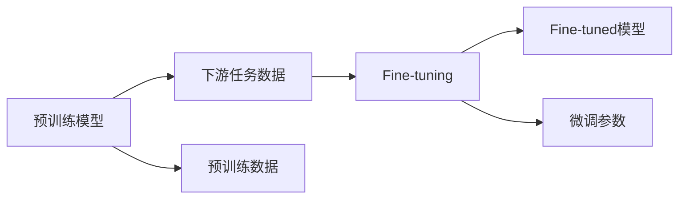

                 

## 1. 背景介绍

### 1.1 问题由来

在人工智能(AI)领域，语言处理因其与人类交流的基础特性，成为重要的研究方向之一。自然语言处理(NLP)，作为AI的重要分支，涉及机器对人类语言的理解与生成，其发展历程与计算机科学的发展密切相关。

近年来，预训练语言模型(Pre-trained Language Models, PLMs)以其大规模无监督学习的能力，显著提升了NLP任务的性能。BERT、GPT-3等模型的出现，标志着NLP技术进入了一个新的时代。然而，预训练模型虽具备强大泛化能力，但其应用领域仍存在诸多限制。

### 1.2 问题核心关键点

预训练语言模型的核心在于通过海量的无标签文本数据，学习到语言的通用表征，而在特定领域，预训练模型的通用能力仍需进一步提升。这时，微调(Fine-tuning)技术应运而生。

微调，指的是在预训练模型基础上，使用下游任务的有标签数据，通过有监督学习优化模型参数，使得模型能够更好地适应特定任务。相较于从头训练模型，微调过程可以在较短时间内显著提升模型性能，且仅需少量标注数据，具有高效、便捷的优点。

### 1.3 问题研究意义

大语言模型(Large Language Models, LLM)的微调技术，为NLP技术的产业化落地提供了重要的技术手段。其研究意义在于：

1. **降低开发成本**：利用大模型的预训练能力，能够显著降低开发新应用所需的标注数据和计算资源投入。
2. **提升模型性能**：通过微调，模型能够针对特定任务进行优化，在性能上取得显著提升。
3. **加速开发周期**：微调过程可以快速适配新任务，缩短从模型训练到应用的开发周期。
4. **带来技术创新**：微调技术的不断进步，推动了NLP领域的多样化研究和应用，催生了如提示学习(Prompt Learning)、零样本学习(Zero-shot Learning)等前沿技术。
5. **促进产业升级**：微调技术的应用，使得NLP技术更容易被各行各业采用，加速了行业的数字化转型。

## 2. 核心概念与联系

### 2.1 核心概念概述

预训练语言模型（Pre-trained Language Model）是一类在大规模无标签文本数据上进行的自监督学习模型。其核心思想是让模型通过学习大量无标签数据，掌握语言的通用知识，如单词、句子结构、语义等。

微调（Fine-tuning）是在预训练模型的基础上，利用下游任务的有标签数据，进一步调整模型参数，使模型能够更准确地完成特定任务。微调可以显著提高模型在特定任务上的性能，同时保留预训练模型中的通用语言知识。

### 2.2 核心概念原理和架构的 Mermaid 流程图



该图展示了预训练模型与微调的基本流程：预训练模型通过学习大量无标签数据获得通用语言知识，下游任务数据通过微调进一步优化，最终形成适配特定任务的微调模型。

### 2.3 核心概念联系

预训练模型与微调技术是相辅相成的。预训练模型提供了丰富的语言知识作为基础，而微调则通过任务特定的训练，将这些知识进一步应用到特定任务上。这种组合方式，使得模型能够在减少标注数据和计算资源的前提下，快速适应新的应用场景。

## 3. 核心算法原理 & 具体操作步骤

### 3.1 算法原理概述

微调的过程，本质上是有监督学习的过程。其目标是在预训练模型上，通过下游任务的有标签数据，进一步优化模型参数，使其在特定任务上表现更优。

微调的核心算法包括：

1. **选择模型**：选择合适的预训练模型作为初始化参数。
2. **定义损失函数**：根据任务类型，设计合适的损失函数，用于衡量模型预测与真实标签之间的差异。
3. **参数更新**：利用反向传播算法，通过优化器更新模型参数，最小化损失函数。
4. **评估与优化**：在验证集上评估模型性能，根据评估结果调整模型参数和学习率，以防止过拟合。

### 3.2 算法步骤详解

微调的详细步骤包括：

1. **数据准备**：收集下游任务的标注数据集，并划分为训练集、验证集和测试集。
2. **模型加载与适配**：选择合适的预训练模型，并添加任务适配层（如线性分类器、解码器等）。
3. **定义损失函数**：根据任务类型，选择交叉熵、均方误差等合适的损失函数。
4. **训练与微调**：使用优化器（如AdamW、SGD等）在训练集上训练模型，同时根据验证集的表现调整学习率和其他超参数。
5. **评估与部署**：在测试集上评估微调后的模型性能，并将模型部署到实际应用中。

### 3.3 算法优缺点

#### 优点

- **高效便捷**：相较于从头训练模型，微调过程可以在较短时间内显著提升模型性能。
- **性能提升**：通过微调，模型能够更好地适应特定任务，提高任务完成度。
- **通用性**：微调技术适用于各种NLP任务，包括分类、匹配、生成等，设计简单的任务适配层即可实现。
- **参数高效**：利用参数高效微调技术，在固定大部分预训练参数的情况下，仍可取得不错的提升。

#### 缺点

- **依赖标注数据**：微调的效果很大程度上取决于标注数据的质量和数量，获取高质量标注数据的成本较高。
- **迁移能力有限**：当目标任务与预训练数据的分布差异较大时，微调的性能提升有限。
- **负面效果传递**：预训练模型的固有偏见、有害信息等，可能通过微调传递到下游任务，造成负面影响。
- **可解释性不足**：微调模型的决策过程通常缺乏可解释性，难以对其推理逻辑进行分析和调试。

### 3.4 算法应用领域

微调技术在NLP领域得到了广泛应用，涉及多种类型的任务：

- **文本分类**：如情感分析、主题分类、意图识别等。
- **命名实体识别**：识别文本中的人名、地名、机构名等特定实体。
- **关系抽取**：从文本中抽取实体之间的语义关系。
- **问答系统**：对自然语言问题给出答案。
- **机器翻译**：将源语言文本翻译成目标语言。
- **文本摘要**：将长文本压缩成简短摘要。
- **对话系统**：使机器能够与人自然对话。
- **代码生成**：根据用户需求自动生成代码片段。

## 4. 数学模型和公式 & 详细讲解 & 举例说明

### 4.1 数学模型构建

假设预训练模型为 $M_{\theta}$，其中 $\theta$ 为预训练得到的模型参数。给定下游任务 $T$ 的标注数据集 $D=\{(x_i, y_i)\}_{i=1}^N$，其中 $x_i$ 为输入文本，$y_i$ 为任务标签。

微调的优化目标是最小化损失函数 $\mathcal{L}(\theta)$，即：

$$
\mathcal{L}(\theta) = \frac{1}{N} \sum_{i=1}^N \ell(M_{\theta}(x_i),y_i)
$$

其中 $\ell$ 为损失函数，可以选用交叉熵损失、均方误差损失等。

### 4.2 公式推导过程

以二分类任务为例，假设模型 $M_{\theta}$ 在输入 $x$ 上的输出为 $\hat{y}=M_{\theta}(x)$，表示样本属于正类的概率。真实标签 $y \in \{0,1\}$。则二分类交叉熵损失函数定义为：

$$
\ell(M_{\theta}(x),y) = -[y\log \hat{y} + (1-y)\log (1-\hat{y})]
$$

将其代入经验风险公式，得：

$$
\mathcal{L}(\theta) = -\frac{1}{N}\sum_{i=1}^N [y_i\log M_{\theta}(x_i)+(1-y_i)\log(1-M_{\theta}(x_i))]
$$

根据链式法则，损失函数对参数 $\theta_k$ 的梯度为：

$$
\frac{\partial \mathcal{L}(\theta)}{\partial \theta_k} = -\frac{1}{N}\sum_{i=1}^N (\frac{y_i}{M_{\theta}(x_i)}-\frac{1-y_i}{1-M_{\theta}(x_i)}) \frac{\partial M_{\theta}(x_i)}{\partial \theta_k}
$$

其中 $\frac{\partial M_{\theta}(x_i)}{\partial \theta_k}$ 可通过自动微分技术完成计算。

### 4.3 案例分析与讲解

以BERT模型为例，其在预训练过程中使用了大量无标签文本数据，学习了语言的通用表征。在微调过程中，可以通过微调其顶层分类器，进一步适配特定任务。

假设任务为二分类情感分析，在训练集上进行微调时，目标是最小化损失函数 $\mathcal{L}(\theta)$，其中 $\theta$ 为BERT模型顶层分类器的权重。使用优化器AdamW，设置学习率为 $2e-5$，训练轮数为 $5$，批量大小为 $16$。

## 5. 项目实践：代码实例和详细解释说明

### 5.1 开发环境搭建

在开发环境搭建方面，一般需要以下步骤：

1. 安装Python和PyTorch：
```bash
pip install torch torchvision torchaudio
```

2. 安装BERT模型及其库：
```bash
pip install transformers
```

3. 安装所需的数据处理库：
```bash
pip install pandas numpy scikit-learn
```

### 5.2 源代码详细实现

以下是一个使用PyTorch和Transformers库进行BERT模型微调的示例代码：

```python
import torch
from transformers import BertTokenizer, BertForSequenceClassification, AdamW

# 初始化BERT模型和分词器
tokenizer = BertTokenizer.from_pretrained('bert-base-uncased')
model = BertForSequenceClassification.from_pretrained('bert-base-uncased', num_labels=2)

# 定义优化器
optimizer = AdamW(model.parameters(), lr=2e-5)

# 定义损失函数
loss_fn = torch.nn.CrossEntropyLoss()

# 加载并预处理数据
def load_data(path):
    with open(path, 'r', encoding='utf-8') as f:
        data = f.readlines()
    inputs = tokenizer(data, return_tensors='pt', padding='max_length', truncation=True, max_length=256)
    inputs['labels'] = torch.tensor([1, 0] * len(data))
    return inputs

# 训练函数
def train(model, inputs, optimizer, loss_fn, n_epochs=5):
    model.train()
    for epoch in range(n_epochs):
        optimizer.zero_grad()
        outputs = model(**inputs)
        loss = loss_fn(outputs.logits, inputs['labels'])
        loss.backward()
        optimizer.step()
        print(f'Epoch {epoch+1}, Loss: {loss.item()}')

# 加载数据
inputs = load_data('data.txt')

# 训练模型
train(model, inputs, optimizer, loss_fn)
```

### 5.3 代码解读与分析

- `BertTokenizer`：用于分词和将文本转换为模型所需的输入。
- `BertForSequenceClassification`：构建模型，用于二分类任务。
- `AdamW`：优化器，用于更新模型参数。
- `torch.nn.CrossEntropyLoss`：损失函数，用于计算模型输出与真实标签的差异。
- `load_data`：加载并预处理数据，使用分词器进行文本预处理。
- `train`：训练模型，在每个epoch上使用优化器更新模型参数。

### 5.4 运行结果展示

训练结束后，可以在测试集上评估模型性能，如精确度、召回率等指标。

```python
# 加载测试集数据
test_inputs = load_data('test_data.txt')

# 评估模型
model.eval()
with torch.no_grad():
    outputs = model(**test_inputs)
    loss = loss_fn(outputs.logits, test_inputs['labels'])
    print(f'Test Loss: {loss.item()}')
```

## 6. 实际应用场景

### 6.1 智能客服系统

智能客服系统可以通过微调BERT模型，提升用户对话体验和问题解决效率。系统可以在用户输入问题后，快速匹配并生成回复，实现7x24小时不间断服务。

### 6.2 金融舆情监测

金融舆情监测系统可以利用微调BERT模型，对金融领域相关新闻、评论等文本数据进行情感分析，及时发现负面信息，帮助金融机构快速应对风险。

### 6.3 个性化推荐系统

个性化推荐系统可以通过微调BERT模型，根据用户浏览、点击等行为数据，生成更个性化、多样化的推荐结果，提高用户体验。

### 6.4 未来应用展望

未来，微调技术将不断应用于更多领域，推动NLP技术的全面渗透：

- **医疗**：利用微调BERT模型，构建医疗问答、病历分析等系统，辅助医生诊疗。
- **教育**：应用于作业批改、学情分析、知识推荐等，因材施教。
- **智慧城市**：构建城市事件监测、舆情分析、应急指挥等应用。
- **娱乐**：开发内容生成、智能对话等系统。

## 7. 工具和资源推荐

### 7.1 学习资源推荐

- 《Transformer fromscratch》系列博客：深入浅出地介绍了Transformer原理和微调方法。
- 斯坦福大学《Deep Learning for NLP》课程：涵盖NLP领域的基本概念和经典模型。
- 《Natural Language Processing with Transformers》书籍：全面介绍了Transformers库的使用和微调方法。
- HuggingFace官方文档：提供了海量预训练模型和微调样例。
- CLUE开源项目：提供中文NLP数据集和基于微调的baseline模型。

### 7.2 开发工具推荐

- PyTorch：深度学习框架，支持动态计算图，适合快速迭代研究。
- TensorFlow：生产部署方便，适合大规模工程应用。
- Transformers库：提供了丰富的预训练模型和微调接口。
- Weights & Biases：模型训练实验跟踪工具，支持可视化。
- TensorBoard：深度学习模型可视化工具。
- Google Colab：在线Jupyter Notebook环境，提供免费GPU/TPU算力。

### 7.3 相关论文推荐

- Attention is All You Need：Transformer的原始论文，奠定了预训练语言模型基础。
- BERT: Pre-training of Deep Bidirectional Transformers for Language Understanding：BERT模型提出，实现了NLP任务的SOTA。
- Language Models are Unsupervised Multitask Learners：GPT-2论文，展示了大语言模型的零样本学习能力。
- Parameter-Efficient Transfer Learning for NLP：提出了Adapter等参数高效微调方法。
- AdaLoRA: Adaptive Low-Rank Adaptation for Parameter-Efficient Fine-Tuning：通过自适应低秩适应的微调方法，提升参数效率和精度。
- Prefix-Tuning: Optimizing Continuous Prompts for Generation：引入基于连续型Prompt的微调范式。

## 8. 总结：未来发展趋势与挑战

### 8.1 研究成果总结

本文系统介绍了基于监督学习的微调方法，阐述了微调在大语言模型中的应用背景和研究意义。通过实例，展示了微调的数学原理和操作步骤，并提供了完整的代码实现。同时，探讨了微调在多个实际应用场景中的应用，展望了未来的发展趋势。

### 8.2 未来发展趋势

未来，微调技术将呈现以下几个发展趋势：

- **模型规模增大**：预训练语言模型的参数量将持续增长，带来更丰富的语言知识。
- **微调方法多样化**：除全参数微调外，更多参数高效和计算高效的微调方法将被开发。
- **持续学习成为常态**：微调模型需要不断学习新知识，以保持性能。
- **标注数据需求降低**：通过提示学习和少样本学习等技术，减少对标注数据的依赖。
- **多模态微调崛起**：融合视觉、语音等多模态信息，提高模型的综合能力。
- **通用性增强**：微调模型将具备更强的常识推理和跨领域迁移能力。

### 8.3 面临的挑战

尽管微调技术已经取得了显著进展，但仍面临以下挑战：

- **标注成本瓶颈**：标注数据获取成本高，限制了微调的应用。
- **模型鲁棒性不足**：面对域外数据，泛化性能有限。
- **推理效率问题**：模型大，推理速度慢。
- **可解释性不足**：模型的决策过程缺乏可解释性。
- **安全性问题**：模型可能输出有害信息，带来安全隐患。
- **知识整合能力不足**：模型难以灵活吸收外部知识。

### 8.4 研究展望

未来研究需要在以下几个方面寻求突破：

- **无监督和半监督微调**：利用自监督学习、主动学习等方法，减少对标注数据的依赖。
- **参数高效和计算高效微调**：开发更多高效微调方法，提升模型性能。
- **因果学习和对比学习**：引入因果推断和对比学习，提高模型鲁棒性。
- **知识融合与多模态整合**：结合符号化知识，融合多模态信息，提升模型能力。
- **伦理与道德约束**：引入伦理导向的评估指标，避免模型偏见和有害输出。

## 9. 附录：常见问题与解答

### Q1：微调是否适用于所有NLP任务？

A: 微调在大多数NLP任务上都能取得不错的效果，但对于特定领域，可能需要进一步在特定领域语料上进行预训练。

### Q2：如何选择微调的学习率？

A: 通常使用2e-5左右的学习率，并通过warmup策略逐步减小。不同的优化器和超参数组合可能需要调整。

### Q3：微调过程中如何防止过拟合？

A: 常见策略包括数据增强、正则化、Dropout、Early Stopping等，通过这些方法可以最大程度避免过拟合。

### Q4：微调模型在实际部署时需要注意哪些问题？

A: 模型裁剪、量化加速、服务化封装、弹性伸缩、监控告警、安全防护等，需要综合考虑模型的运行效率和应用场景。

---

作者：禅与计算机程序设计艺术 / Zen and the Art of Computer Programming

