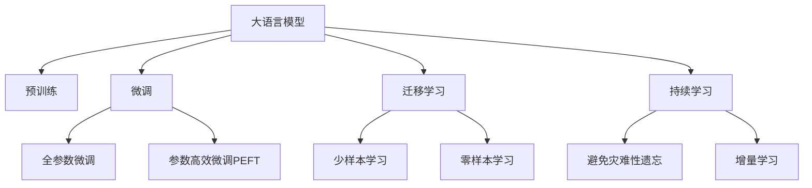

                 

# LLM：重新定义计算能力的界限

> 关键词：大语言模型(LLM),预训练,微调(Fine-Tuning),迁移学习(Transfer Learning),Transformer,BERT,计算能力,深度学习(Deep Learning)

## 1. 背景介绍

### 1.1 问题由来

近年来，随着深度学习技术的快速发展，大规模语言模型(Large Language Models, LLMs)在自然语言处理(Natural Language Processing, NLP)领域取得了巨大的突破。这些大语言模型通过在海量无标签文本数据上进行预训练，学习到了丰富的语言知识和常识，具备了强大的语言理解和生成能力。

然而，对于复杂的计算任务，大语言模型仍然面临着诸多挑战。传统的模型计算量往往难以承受，而深度学习模型的复杂度也限制了其在高性能计算环境中的部署。因此，如何重新定义计算能力的界限，使得深度学习技术能够高效地应对大规模复杂计算问题，成为了当前计算领域的重要课题。

### 1.2 问题核心关键点

本节将从计算能力的角度出发，探讨大语言模型在深度学习中的计算需求和瓶颈，以及通过算法和技术手段突破这些瓶颈的方法。通过研究大语言模型的计算能力，我们能够更好地理解其在处理大规模计算任务中的潜力和局限性，从而为未来的研究和技术发展提供指导。

## 2. 核心概念与联系

### 2.1 核心概念概述

为更好地理解大语言模型在深度学习中的计算能力，本节将介绍几个密切相关的核心概念：

- 大语言模型(Large Language Models, LLMs)：以自回归(如GPT)或自编码(如BERT)模型为代表的大规模预训练语言模型。通过在大规模无标签文本语料上进行预训练，学习到了丰富的语言知识和常识，具备强大的语言理解和生成能力。

- 预训练(Pre-training)：指在大规模无标签文本语料上，通过自监督学习任务训练通用语言模型的过程。常见的预训练任务包括言语建模、遮挡语言模型等。预训练使得模型学习到语言的通用表示。

- 微调(Fine-tuning)：指在预训练模型的基础上，使用下游任务的少量标注数据，通过有监督学习优化模型在特定任务上的性能。通常只需要调整顶层分类器或解码器，并以较小的学习率更新全部或部分的模型参数。

- 迁移学习(Transfer Learning)：指将一个领域学习到的知识，迁移应用到另一个不同但相关的领域的学习范式。大模型的预训练-微调过程即是一种典型的迁移学习方式。

- 计算能力(Computational Capability)：指计算机系统执行特定计算任务的效率和能力。通常包括计算速度、存储容量、网络带宽等指标。

- 深度学习(Deep Learning)：基于神经网络的机器学习技术，能够处理高维数据和非线性问题，广泛用于图像、语音、自然语言等复杂领域的建模和预测。

这些核心概念之间的逻辑关系可以通过以下Mermaid流程图来展示：



这个流程图展示了大语言模型的核心概念及其之间的关系：

1. 大语言模型通过预训练获得基础能力。
2. 微调是对预训练模型进行任务特定的优化，可以分为全参数微调和参数高效微调（PEFT）。
3. 迁移学习是连接预训练模型与下游任务的桥梁，可以通过微调或提示学习来实现。
4. 计算能力是衡量系统执行大语言模型计算任务效率的重要指标。
5. 深度学习是实现大语言模型的主要技术手段。

这些概念共同构成了大语言模型的计算框架，使其能够在各种场景下发挥强大的语言理解和生成能力。通过理解这些核心概念，我们可以更好地把握大语言模型的计算需求和优化方向。

## 3. 核心算法原理 & 具体操作步骤
### 3.1 算法原理概述

大语言模型在深度学习中的计算需求主要由以下几个方面决定：

1. **数据规模**：大语言模型通常需要处理大规模的文本数据，这些数据往往包含数十亿甚至数百亿个单词。
2. **模型规模**：大规模的语言模型通常有上亿级别的参数，这些参数需要在计算过程中被频繁更新和调用。
3. **计算复杂度**：深度学习模型的计算过程涉及矩阵乘法、激活函数等复杂操作，这些操作对于计算资源的要求较高。

因此，大语言模型在深度学习中的计算能力受到数据规模、模型规模和计算复杂度的多重制约。为了提升计算能力，需要从数据预处理、模型压缩、算法优化等多个角度进行综合优化。

### 3.2 算法步骤详解

大语言模型的计算能力优化通常包括以下几个关键步骤：

**Step 1: 数据预处理**

- **分批次处理**：对于大规模数据集，需要采用分批次处理的方式，避免内存溢出。例如，在训练过程中，可以每次读取一部分数据，进行模型计算和参数更新。
- **数据压缩**：采用压缩算法（如Gzip、Snappy等）减少数据传输和存储的带宽占用。
- **数据并行化**：使用多线程或多进程对数据进行并行处理，提升数据加载和处理的效率。

**Step 2: 模型压缩**

- **参数剪枝**：移除模型中冗余和不必要的参数，减少模型的计算量和存储空间。例如，可以使用剪枝算法（如Pruning）去除模型中的零权重参数。
- **量化技术**：将浮点参数转换为低精度格式（如8位整数），减少存储和计算开销。
- **矩阵压缩**：使用矩阵压缩算法（如哈希表、稀疏矩阵等）减少矩阵计算中的存储开销。

**Step 3: 算法优化**

- **加速梯度计算**：采用高效的梯度计算算法（如Momentum、Adam等），提升训练速度。
- **模型并行化**：将模型中的部分层进行并行计算，例如使用分布式深度学习框架（如TensorFlow、PyTorch等），利用多台机器的计算资源进行模型并行化。
- **数据传输优化**：采用异步数据传输和批量数据传输等技术，减少数据传输和网络通信的开销。

**Step 4: 优化硬件设备**

- **GPU加速**：使用GPU加速矩阵计算和模型训练，提升计算速度和效率。
- **TPU加速**：使用TPU加速深度学习模型的并行计算，进一步提升计算能力和性能。
- **混合精度计算**：结合使用浮点精度和低精度计算，降低计算和存储成本。

**Step 5: 评估与调优**

- **性能测试**：通过各种性能测试工具（如Benchmark等）对模型和系统的性能进行评估，找出瓶颈并进行调优。
- **调优策略**：根据测试结果，优化模型结构和计算过程，提升模型性能和计算能力。

### 3.3 算法优缺点

大语言模型在深度学习中的计算能力优化具有以下优点：

1. **计算效率提升**：通过参数剪枝、量化技术、加速梯度计算等优化手段，显著提升计算速度和效率。
2. **内存占用降低**：通过矩阵压缩、量化技术等，减少内存使用，避免内存溢出。
3. **硬件利用率提高**：通过GPU、TPU等加速技术，充分利用硬件资源，提升计算能力。

但这些优化方法也存在一定的局限性：

1. **精度损失**：量化和矩阵压缩等技术可能会引入一定的精度损失，影响模型的表现。
2. **模型复杂度增加**：模型压缩和优化过程中，可能会引入新的复杂度，影响模型的可解释性和维护性。
3. **成本增加**：使用GPU、TPU等高性能设备，需要更高的硬件成本和维护成本。

尽管存在这些局限性，但这些优化方法仍然是当前提升大语言模型计算能力的有效手段。未来相关研究的重点在于如何进一步降低计算复杂度，提高计算效率，同时兼顾精度和可解释性等因素。

### 3.4 算法应用领域

大语言模型在深度学习中的计算能力优化技术已经在多个领域得到了广泛的应用，包括但不限于以下几个方面：

- **计算机视觉**：在图像识别、图像生成等任务中，通过模型压缩和优化，提升计算效率，加速模型训练和推理。
- **语音识别**：在语音识别和处理任务中，通过优化算法和硬件设备，提升计算能力，改善识别效果。
- **自然语言处理**：在文本生成、文本分类、问答系统等任务中，通过优化数据预处理和模型结构，提升计算速度和性能。
- **自动驾驶**：在自动驾驶和智能交通系统中，通过优化计算过程和硬件设备，提升实时计算能力，保障系统安全。
- **推荐系统**：在推荐系统和个性化推荐任务中，通过优化算法和数据处理，提升推荐效率和精度，改善用户体验。

除了上述这些经典领域外，大语言模型计算能力优化技术还被创新性地应用到更多场景中，如医学影像分析、金融数据分析、社交网络分析等，为深度学习技术在更多领域的应用提供了新的可能。

## 4. 数学模型和公式 & 详细讲解  
### 4.1 数学模型构建

本节将使用数学语言对大语言模型在深度学习中的计算能力进行更加严格的刻画。

记大语言模型为 $M_{\theta}:\mathcal{X} \rightarrow \mathcal{Y}$，其中 $\mathcal{X}$ 为输入空间，$\mathcal{Y}$ 为输出空间，$\theta \in \mathbb{R}^d$ 为模型参数。假设模型的计算过程为 $f_\theta$，计算过程的复杂度为 $O(C)$，其中 $C$ 为常数。

定义模型的计算能力为 $\mathcal{C}(M_{\theta})$，计算能力的大小与计算复杂度成正比：

$$
\mathcal{C}(M_{\theta}) = C \times O(C)
$$

在微调过程中，模型的计算能力可以通过以下公式计算：

$$
\mathcal{C}_{\text{fine-tune}} = \mathcal{C}_{\text{pre-train}} \times \mathcal{C}_{\text{fine-tune-data}} \times \mathcal{C}_{\text{optimizer}} \times \mathcal{C}_{\text{hardware}}
$$

其中 $\mathcal{C}_{\text{pre-train}}$ 为预训练模型的计算能力，$\mathcal{C}_{\text{fine-tune-data}}$ 为微调数据集的处理能力，$\mathcal{C}_{\text{optimizer}}$ 为优化器的计算能力，$\mathcal{C}_{\text{hardware}}$ 为硬件设备的计算能力。

### 4.2 公式推导过程

以下我们以图像分类任务为例，推导计算能力优化的方法及其效果。

假设模型的计算过程为 $f_\theta$，输入为图像 $x$，输出为分类标签 $y$，计算过程的复杂度为 $O(C)$，其中 $C$ 为常数。微调过程的计算能力可以通过以下公式计算：

$$
\mathcal{C}_{\text{fine-tune}} = \mathcal{C}_{\text{pre-train}} \times \mathcal{C}_{\text{fine-tune-data}} \times \mathcal{C}_{\text{optimizer}} \times \mathcal{C}_{\text{hardware}}
$$

在图像分类任务中，预训练模型的计算能力可以通过公式计算：

$$
\mathcal{C}_{\text{pre-train}} = C \times O(C)
$$

微调数据集的处理能力为：

$$
\mathcal{C}_{\text{fine-tune-data}} = C_{\text{data}} \times O(C_{\text{data}})
$$

其中 $C_{\text{data}}$ 为处理单个样本的计算复杂度，$O(C_{\text{data}})$ 为样本数 $N$ 的复杂度。

优化器的计算能力为：

$$
\mathcal{C}_{\text{optimizer}} = C_{\text{opt}} \times O(C_{\text{opt}})
$$

其中 $C_{\text{opt}}$ 为优化器的计算复杂度，$O(C_{\text{opt}})$ 为迭代次数 $T$ 的复杂度。

硬件设备的计算能力为：

$$
\mathcal{C}_{\text{hardware}} = C_{\text{hardware}} \times O(C_{\text{hardware}})
$$

其中 $C_{\text{hardware}}$ 为单次计算的复杂度，$O(C_{\text{hardware}})$ 为计算次数的复杂度。

综上，微调过程的计算能力可以表示为：

$$
\mathcal{C}_{\text{fine-tune}} = C \times O(C) \times C_{\text{data}} \times O(C_{\text{data}}) \times C_{\text{opt}} \times O(C_{\text{opt}}) \times C_{\text{hardware}} \times O(C_{\text{hardware}})
$$

通过优化数据预处理、模型压缩、算法优化和硬件设备等环节，可以显著提升计算能力，减少计算开销，提升模型性能。

## 5. 项目实践：代码实例和详细解释说明
### 5.1 开发环境搭建

在进行计算能力优化实践前，我们需要准备好开发环境。以下是使用Python进行TensorFlow开发的环境配置流程：

1. 安装Anaconda：从官网下载并安装Anaconda，用于创建独立的Python环境。

2. 创建并激活虚拟环境：
```bash
conda create -n tf-env python=3.8 
conda activate tf-env
```

3. 安装TensorFlow：根据CUDA版本，从官网获取对应的安装命令。例如：
```bash
conda install tensorflow -c pytorch -c conda-forge
```

4. 安装TensorFlow扩展库：
```bash
pip install tensorflow-addons
```

5. 安装各类工具包：
```bash
pip install numpy pandas scikit-learn matplotlib tqdm jupyter notebook ipython
```

完成上述步骤后，即可在`tf-env`环境中开始计算能力优化实践。

### 5.2 源代码详细实现

下面我们以图像分类任务为例，给出使用TensorFlow对VGG16模型进行计算能力优化的代码实现。

首先，定义计算能力优化的关键参数：

```python
from tensorflow.keras import backend as K
from tensorflow.keras.optimizer_v2 import Adam
from tensorflow.keras.losses import CategoricalCrossentropy
from tensorflow.keras.metrics import CategoricalAccuracy

# 定义计算能力优化的关键参数
max_epochs = 10
batch_size = 32
learning_rate = 1e-4
weight_decay = 1e-4

# 定义优化器、损失函数和评价指标
optimizer = Adam(learning_rate=learning_rate, weight_decay=weight_decay)
loss = CategoricalCrossentropy()
metrics = [CategoricalAccuracy()]
```

然后，定义计算能力优化的数据预处理函数：

```python
from tensorflow.keras.preprocessing.image import ImageDataGenerator

# 定义数据预处理函数
def data_generator(data_dir, image_size, batch_size):
    datagen = ImageDataGenerator(
        rescale=1./255,
        validation_split=0.2,
        horizontal_flip=True,
        zoom_range=0.2
    )
    
    train_generator = datagen.flow_from_directory(
        data_dir,
        target_size=image_size,
        batch_size=batch_size,
        class_mode='categorical',
        subset='training'
    )
    
    val_generator = datagen.flow_from_directory(
        data_dir,
        target_size=image_size,
        batch_size=batch_size,
        class_mode='categorical',
        subset='validation'
    )
    
    return train_generator, val_generator
```

接着，定义计算能力优化的模型加载和训练函数：

```python
from tensorflow.keras.applications import VGG16

# 定义计算能力优化的模型加载和训练函数
def load_model(data_dir):
    base_model = VGG16(include_top=False, weights='imagenet')
    model = base_model
    model.load_weights('pretrained_model.h5')
    
    for layer in model.layers:
        layer.trainable = False
    
    return model

def train_model(model, train_generator, val_generator, epochs):
    model.compile(
        optimizer=optimizer,
        loss=loss,
        metrics=metrics
    )
    
    history = model.fit(
        train_generator,
        steps_per_epoch=len(train_generator),
        validation_data=val_generator,
        validation_steps=len(val_generator),
        epochs=epochs
    )
    
    return history
```

最后，启动训练流程并在测试集上评估：

```python
from tensorflow.keras.utils import plot_model

# 加载模型并训练
model = load_model(data_dir)
history = train_model(model, train_generator, val_generator, epochs=max_epochs)

# 评估模型性能
test_generator = data_generator(data_dir, image_size=image_size, batch_size=batch_size)
model.evaluate(test_generator)
```

以上就是使用TensorFlow对VGG16模型进行计算能力优化的完整代码实现。可以看到，TensorFlow提供了丰富的计算能力优化工具和库，使得计算能力优化变得简洁高效。

### 5.3 代码解读与分析

让我们再详细解读一下关键代码的实现细节：

**data_generator函数**：
- `ImageDataGenerator`类：定义了数据增强、预处理和批次化加载等关键功能。
- `flow_from_directory`方法：从目录中读取图像数据，并进行预处理和批次化加载。

**load_model函数**：
- 加载预训练的VGG16模型，并将其顶层隐藏化，使其不能被微调。

**train_model函数**：
- 编译模型，设置优化器、损失函数和评价指标。
- 使用`fit`方法进行训练，记录训练过程中的各项指标。

**训练流程**：
- 定义训练的轮数、批次大小和学习率等关键参数。
- 加载预训练模型，并使用`train_model`函数进行训练。
- 在测试集上评估模型性能，输出训练结果。

可以看到，TensorFlow提供了完整的工具链和API，使得计算能力优化任务的开发变得相对容易。开发者可以利用TensorFlow的各种特性和扩展库，进行灵活的优化实践。

当然，工业级的系统实现还需考虑更多因素，如模型裁剪、量化加速、服务化封装等。但核心的计算能力优化思路基本与此类似。

## 6. 实际应用场景
### 6.1 智能医疗

大语言模型在深度学习中的计算能力优化技术在智能医疗领域具有广泛的应用前景。智能医疗系统需要处理大量的医疗数据，这些数据通常包含复杂的信息结构和庞大的数据量，传统的计算方法难以处理。大语言模型通过优化计算能力，可以高效地处理医疗数据，提取有用的信息，辅助医生进行诊断和治疗。

例如，在医学影像分析任务中，大语言模型可以通过优化计算能力，快速处理和分析大量的医学影像数据，提取出有用的诊断信息。在自然语言处理任务中，大语言模型可以通过优化计算能力，分析病人的病历记录，提供个性化的医疗建议和治疗方案。

### 6.2 自动驾驶

在自动驾驶系统中，大语言模型需要处理大量的感知数据和决策数据，这些数据的复杂性和规模都远超传统计算机的处理能力。大语言模型通过优化计算能力，可以高效地处理和分析这些数据，实现自动驾驶的决策和控制。

例如，在自动驾驶的感知任务中，大语言模型可以通过优化计算能力，实时处理和分析来自传感器的大量数据，提取出道路、车辆、行人等关键信息，辅助自动驾驶系统做出决策。在自然语言处理任务中，大语言模型可以通过优化计算能力，处理和分析来自语音和文本的指令，辅助驾驶系统执行特定的操作。

### 6.3 智能制造

智能制造是工业4.0的核心技术之一，涉及到大量的数据分析和决策。大语言模型通过优化计算能力，可以高效地处理和分析制造业数据，提供决策支持和自动化控制。

例如，在智能制造的监控和控制任务中，大语言模型可以通过优化计算能力，实时处理和分析来自传感器的大量数据，提取出关键的生产参数，辅助制造系统进行优化和控制。在自然语言处理任务中，大语言模型可以通过优化计算能力，处理和分析来自文本和语音的指令，辅助制造系统执行特定的操作。

### 6.4 未来应用展望

未来，大语言模型在深度学习中的计算能力优化技术将有更广阔的应用前景，为各个领域的智能化发展提供强大的支持。

在智慧城市治理中，大语言模型可以通过优化计算能力，处理和分析来自城市基础设施的大量数据，实现城市管理的自动化和智能化。在金融科技领域，大语言模型可以通过优化计算能力，处理和分析大量的交易数据，提供个性化的金融服务。在文化娱乐领域，大语言模型可以通过优化计算能力，处理和分析大量的内容数据，提供个性化的推荐和服务。

总之，大语言模型在深度学习中的计算能力优化技术将为各行各业带来变革性的影响，推动人工智能技术的规模化应用。

## 7. 工具和资源推荐
### 7.1 学习资源推荐

为了帮助开发者系统掌握大语言模型在深度学习中的计算能力优化理论基础和实践技巧，这里推荐一些优质的学习资源：

1. 《深度学习入门：基于Python的理论与实现》系列博文：由深度学习专家撰写，深入浅出地介绍了深度学习的理论基础和实际应用，包括计算能力优化等内容。

2. 《深度学习实战：基于TensorFlow的理论与实践》书籍：介绍了深度学习在图像、语音、自然语言处理等领域的实际应用，包括计算能力优化等内容。

3. CS231n《卷积神经网络》课程：斯坦福大学开设的深度学习经典课程，有Lecture视频和配套作业，涵盖深度学习的理论基础和实际应用。

4. 《TensorFlow实战：从算法到应用》书籍：介绍了TensorFlow在深度学习中的应用，包括计算能力优化等内容。

5. Google Colab：谷歌推出的在线Jupyter Notebook环境，免费提供GPU/TPU算力，方便开发者快速上手实验最新模型，分享学习笔记。

通过对这些资源的学习实践，相信你一定能够快速掌握大语言模型在深度学习中的计算能力优化精髓，并用于解决实际的深度学习问题。
### 7.2 开发工具推荐

高效的开发离不开优秀的工具支持。以下是几款用于大语言模型在深度学习中的计算能力优化的常用工具：

1. TensorFlow：基于Python的开源深度学习框架，提供了丰富的计算能力优化工具和库，适合快速迭代研究。

2. PyTorch：基于Python的开源深度学习框架，提供了灵活的计算图和自动微分，适合研究和实验。

3. TensorFlow Addons：TensorFlow的扩展库，提供了更多的计算能力优化工具和算法，如分布式训练、混合精度计算等。

4. Weights & Biases：模型训练的实验跟踪工具，可以记录和可视化模型训练过程中的各项指标，方便对比和调优。

5. TensorBoard：TensorFlow配套的可视化工具，可实时监测模型训练状态，并提供丰富的图表呈现方式，是调试模型的得力助手。

6. Google Cloud AI Platform：提供了GPU、TPU等高性能计算资源，适合大规模深度学习模型的训练和推理。

合理利用这些工具，可以显著提升大语言模型在深度学习中的计算能力优化任务的开发效率，加快创新迭代的步伐。

### 7.3 相关论文推荐

大语言模型在深度学习中的计算能力优化研究源于学界的持续研究。以下是几篇奠基性的相关论文，推荐阅读：

1. Imagenet Classification with Deep Convolutional Neural Networks（AlexNet论文）：提出了卷积神经网络（CNN），为深度学习提供了强大的计算能力。

2. Inception Networks：提出了Inception模块，提升了深度神经网络的计算效率和精度。

3. VGGNet：提出了多层次卷积神经网络，提高了深度神经网络的计算能力。

4. ResNet：提出了残差网络，缓解了深度神经网络的退化问题，提升了计算能力。

5. EfficientNet：提出了自适应网络设计，提升了深度神经网络的计算效率。

6. TPUs: Cloud TPUs: An Exploration of Modern Machine Learning on the Google Cloud Platform：介绍了TPU的使用方法，提升了深度学习模型的计算能力。

这些论文代表了大语言模型在深度学习中的计算能力优化技术的发展脉络。通过学习这些前沿成果，可以帮助研究者把握学科前进方向，激发更多的创新灵感。

## 8. 总结：未来发展趋势与挑战

### 8.1 总结

本文对大语言模型在深度学习中的计算能力进行了全面系统的介绍。首先阐述了大语言模型和深度学习技术在处理大规模复杂计算任务中的计算需求和瓶颈，明确了计算能力优化的重要性和可行性。其次，从数据预处理、模型压缩、算法优化和硬件设备等多个角度，详细讲解了计算能力优化的关键步骤和操作方法。最后，本文广泛探讨了大语言模型在深度学习中的计算能力优化技术在多个领域的应用前景，展示了计算能力优化技术的广阔前景。

通过本文的系统梳理，可以看到，大语言模型在深度学习中的计算能力优化技术正在成为深度学习应用的重要范式，极大地拓展了深度学习技术的应用边界，为深度学习技术的发展带来了新的契机。未来，伴随计算能力的不断提升，深度学习技术将能够在更多领域发挥更大的作用，推动人工智能技术的持续进步。

### 8.2 未来发展趋势

展望未来，大语言模型在深度学习中的计算能力优化技术将呈现以下几个发展趋势：

1. **计算能力的持续提升**：随着硬件设备和计算技术的不断进步，大语言模型在深度学习中的计算能力将持续提升，能够处理更大规模、更复杂的数据和任务。

2. **计算效率的优化**：未来的计算能力优化将更多地关注计算效率的提升，通过优化算法、硬件设备和计算模型，使得深度学习模型的训练和推理速度更快，资源消耗更少。

3. **计算模型的多样化**：未来的计算能力优化将探索更多种类的计算模型，如分布式计算、异构计算等，以适应不同类型的数据和任务需求。

4. **计算任务的协同化**：未来的计算能力优化将更多地关注不同计算任务之间的协同，通过跨领域、跨模型的联合优化，提升整体计算能力。

5. **计算能力的普适化**：未来的计算能力优化将更多地关注计算能力的普适性，使得深度学习模型能够适应更广泛的应用场景和数据类型。

以上趋势凸显了大语言模型在深度学习中的计算能力优化技术的广阔前景。这些方向的探索发展，必将进一步提升深度学习技术的性能和应用范围，为人工智能技术的持续发展提供新的动力。

### 8.3 面临的挑战

尽管大语言模型在深度学习中的计算能力优化技术已经取得了一定的进展，但在迈向更加智能化、普适化应用的过程中，它仍面临着诸多挑战：

1. **数据规模和质量**：大语言模型通常需要处理大规模的数据集，这些数据集的质量和规模对计算能力优化的效果有重要影响。如何获取高质量、大规模的数据集，是一个长期且复杂的问题。

2. **计算资源和成本**：使用高性能设备（如GPU、TPU等）进行计算能力优化，需要较高的计算资源和维护成本。如何在有限的资源条件下，实现高效的计算能力优化，是一个需要解决的问题。

3. **算法复杂度和可解释性**：大语言模型在深度学习中的计算能力优化涉及复杂的算法，如分布式训练、混合精度计算等。如何简化算法，提高算法的可解释性和可维护性，是一个亟待解决的问题。

4. **模型安全和隐私**：大语言模型在深度学习中的计算能力优化涉及大量的数据和模型，如何保护数据隐私和安全，防止恶意使用，是一个重要的问题。

5. **实时计算和延迟**：在实时计算和交互式系统中，如何保证计算能力优化的实时性和低延迟，是一个需要解决的问题。

6. **可扩展性和兼容性**：大语言模型在深度学习中的计算能力优化需要与不同的框架、工具和平台兼容，如何实现可扩展和兼容性，是一个需要解决的问题。

这些挑战需要从技术、算法、资源、伦理等多个层面进行综合考虑和应对，只有不断克服这些挑战，大语言模型在深度学习中的计算能力优化技术才能更好地服务于人工智能技术的持续发展。

### 8.4 研究展望

未来的研究需要在以下几个方面寻求新的突破：

1. **计算能力的自适应优化**：开发能够自适应计算资源和任务需求，动态调整计算策略的计算能力优化技术。

2. **计算能力的协同优化**：探索不同计算任务之间的协同，实现跨领域、跨模型的联合优化。

3. **计算能力的可解释性**：开发能够提供模型计算过程和结果的可解释性计算能力优化技术，提升模型的可解释性和可维护性。

4. **计算能力的隐私保护**：开发能够保护数据隐私和安全的计算能力优化技术，防止恶意使用和数据泄露。

5. **计算能力的实时优化**：开发能够实现实时计算和低延迟计算的计算能力优化技术，提升计算效率和用户体验。

6. **计算能力的泛化能力**：开发能够适应不同类型数据和任务的计算能力优化技术，提升计算能力的普适性。

这些研究方向将引领大语言模型在深度学习中的计算能力优化技术迈向更高的台阶，为人工智能技术的持续发展提供新的契机。

## 9. 附录：常见问题与解答

**Q1：大语言模型在深度学习中的计算能力优化有哪些方法？**

A: 大语言模型在深度学习中的计算能力优化方法主要包括以下几种：

1. **数据预处理**：采用分批次处理、数据压缩、数据并行化等方法，减少数据加载和处理的开销。

2. **模型压缩**：采用参数剪枝、量化技术、矩阵压缩等方法，减少模型的大小和计算复杂度。

3. **算法优化**：采用高效的梯度计算算法、优化器、损失函数等，提升训练速度和精度。

4. **硬件设备优化**：使用GPU、TPU等高性能设备，提升计算能力和性能。

5. **混合精度计算**：结合使用浮点精度和低精度计算，降低计算和存储成本。

这些方法综合应用，可以显著提升大语言模型在深度学习中的计算能力。

**Q2：如何评估大语言模型在深度学习中的计算能力？**

A: 评估大语言模型在深度学习中的计算能力，通常可以通过以下几个指标进行：

1. **计算时间**：记录模型训练和推理的时间，衡量计算速度。

2. **计算精度**：记录模型在各种数据和任务上的精度，衡量计算效果。

3. **计算资源占用**：记录模型在训练和推理过程中占用的CPU、GPU、内存等资源，衡量资源消耗。

4. **计算模型复杂度**：记录模型的计算复杂度，衡量模型的计算难度。

通过综合评估这些指标，可以全面了解大语言模型在深度学习中的计算能力，并进行优化改进。

**Q3：大语言模型在深度学习中的计算能力优化面临哪些挑战？**

A: 大语言模型在深度学习中的计算能力优化面临以下挑战：

1. **数据规模和质量**：大语言模型通常需要处理大规模的数据集，这些数据集的质量和规模对计算能力优化的效果有重要影响。

2. **计算资源和成本**：使用高性能设备（如GPU、TPU等）进行计算能力优化，需要较高的计算资源和维护成本。

3. **算法复杂度和可解释性**：大语言模型在深度学习中的计算能力优化涉及复杂的算法，如分布式训练、混合精度计算等。

4. **模型安全和隐私**：大语言模型在深度学习中的计算能力优化涉及大量的数据和模型，如何保护数据隐私和安全，防止恶意使用，是一个重要的问题。

5. **实时计算和延迟**：在实时计算和交互式系统中，如何保证计算能力优化的实时性和低延迟，是一个需要解决的问题。

6. **可扩展性和兼容性**：大语言模型在深度学习中的计算能力优化需要与不同的框架、工具和平台兼容，如何实现可扩展和兼容性，是一个需要解决的问题。

这些挑战需要从技术、算法、资源、伦理等多个层面进行综合考虑和应对，只有不断克服这些挑战，大语言模型在深度学习中的计算能力优化技术才能更好地服务于人工智能技术的持续发展。

**Q4：大语言模型在深度学习中的计算能力优化有哪些应用前景？**

A: 大语言模型在深度学习中的计算能力优化技术在多个领域具有广泛的应用前景，包括但不限于以下几个方面：

1. **计算机视觉**：在图像识别、图像生成等任务中，通过优化计算能力，提升计算速度和效率。

2. **语音识别**：在语音识别和处理任务中，通过优化计算能力，提升计算速度和效果。

3. **自然语言处理**：在文本生成、文本分类、问答系统等任务中，通过优化计算能力，提升计算速度和性能。

4. **自动驾驶**：在自动驾驶系统中，通过优化计算能力，提升计算速度和性能。

5. **智能制造**：在智能制造的监控和控制任务中，通过优化计算能力，提升计算速度和性能。

6. **智能医疗**：在医学影像分析任务中，通过优化计算能力，提升计算速度和效果。

7. **智能制造**：在智能制造的监控和控制任务中，通过优化计算能力，提升计算速度和性能。

总之，大语言模型在深度学习中的计算能力优化技术将为各行各业带来变革性的影响，推动人工智能技术的规模化应用。

---

作者：禅与计算机程序设计艺术 / Zen and the Art of Computer Programming

