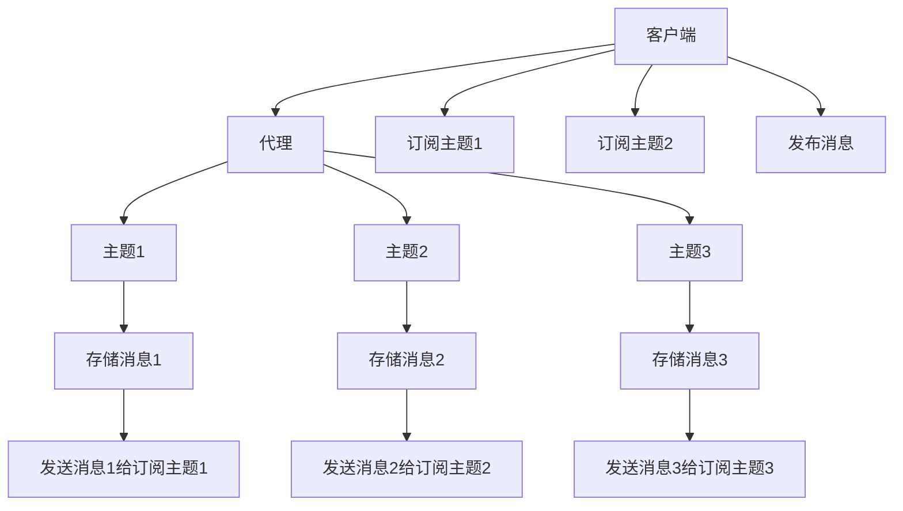

                 

# MQTT物联网通信协议详解

> 关键词：MQTT, 物联网, 消息队列, 低带宽, 异步通信, 设备间通信, 轻量级, 可靠性

## 1. 背景介绍

### 1.1 问题由来

物联网(IoT)的迅速发展，使得大量的传感器、设备、系统间需要高效的通信机制。传统的TCP/IP协议在传输效率、延迟和资源消耗方面难以满足IoT场景的需求。为了适应这一需求，轻量级的消息队列传输协议MQTT（Message Queuing Telemetry Transport）应运而生，成为了IoT通信领域的宠儿。

MQTT是一种基于TCP/IP的发布/订阅模型（Pub/Sub Model）通信协议，旨在为资源受限的设备提供低带宽、低延迟、低开销的通信机制，特别适用于IoT环境。MQTT在许多工业标准和物联网方案中被广泛采用，包括ISO/IEC 20922、IEEE P1888.4-2013、OASIS AQMP等，是IoT设备间通信的重要技术支撑。

### 1.2 问题核心关键点

MQTT的核心在于其简洁高效的设计理念。它支持异步通信，消息传输基于无连接发布/订阅模式，允许一个设备同时发布多个消息并订阅多个主题。其特点包括：

1. **轻量级**：采用二进制格式传输，减少了数据体积，适用于网络带宽有限的IoT设备。
2. **高效性**：支持异步通信，仅在必要时刻进行网络通信，降低延迟和资源消耗。
3. **可靠性**：提供QoS机制，保证消息的可靠性传输。
4. **易于部署**：支持MQTT代理（Broker）和客户端（Client），简化部署和使用。
5. **安全性**：支持TLS加密，保护数据安全。

## 2. 核心概念与联系

### 2.1 核心概念概述

为了更好地理解MQTT协议，我们首先介绍一些核心概念：

- **客户端（Client）**：指主动发送消息或订阅消息的IoT设备。
- **代理（Broker）**：指提供消息存储和分发服务的网络节点，类似于邮件服务器。
- **主题（Topic）**：指客户端发布和订阅消息的标识符，类似于电子邮件地址。
- **消息（Message）**：指客户端发布的具体内容。
- **订阅（Subscribe）**：指客户端向代理请求关注某一主题。
- **发布（Publish）**：指客户端向代理发布某一主题的消息。
- **保留（Retain）**：指代理保留最后一个发布的消息，在订阅时发送给订阅者。
- **QoS（Quality of Service）**：指MQTT提供的三种服务质量等级，分别保证不同程度的可靠性。

### 2.2 核心概念原理和架构的 Mermaid 流程图



这个流程图展示了MQTT协议的基本架构和工作流程：

1. 客户端与代理建立连接，发送订阅请求。
2. 代理将订阅请求转发到相应的主题。
3. 代理接收并存储客户端发布的消息。
4. 客户端发布消息时，代理根据订阅请求将消息发送给对应主题的订阅者。

## 3. 核心算法原理 & 具体操作步骤

### 3.1 算法原理概述

MQTT协议采用发布/订阅模型，客户端通过代理订阅特定主题，代理接收并存储来自客户端的消息，并在订阅者请求时将消息转发给订阅者。MQTT协议的算法原理主要体现在以下几个方面：

- **异步通信**：MQTT允许客户端异步地发布和订阅消息，减少通信次数，降低延迟。
- **保留机制**：代理保留最后一个发布的消息，保证在订阅时发送最新消息。
- **QoS机制**：MQTT提供三种服务质量等级，保证不同程度的可靠性。

### 3.2 算法步骤详解

MQTT协议的通信步骤主要包括以下几个关键步骤：

1. **连接建立**：客户端与代理建立TCP连接，发送连接请求（Connect）。
2. **认证授权**：代理根据连接请求进行认证和授权，返回授权信息。
3. **订阅请求**：客户端发送订阅请求（Subscribe），请求订阅特定主题。
4. **发布消息**：客户端发布消息（Publish）到特定主题。
5. **消息处理**：代理接收到消息后，根据订阅请求将消息转发给订阅者。

具体步骤如下：

- **Connect**：客户端向代理发送连接请求，包含客户端ID、用户名、密码、客户端认证信息等。
- **OnConnect**：代理接收到连接请求后，验证客户端认证信息，返回授权信息（包含会话ID、令牌等）。
- **Subscribe**：客户端发送订阅请求，指定主题和QoS等级。
- **OnSubscribe**：代理接收到订阅请求后，更新主题列表，准备接收发布的消息。
- **Publish**：客户端发布消息，包含主题、消息内容、QoS等级等信息。
- **OnPublish**：代理接收到发布消息后，根据订阅请求将消息转发给订阅者。

### 3.3 算法优缺点

MQTT协议的优点包括：

- **轻量级**：数据格式简单，适合资源受限的设备。
- **高效性**：支持异步通信，减少通信次数，降低延迟。
- **可靠性**：提供QoS机制，保证消息的可靠性。
- **易于部署**：支持MQTT代理和客户端，简化部署和使用。

其缺点主要包括：

- **复杂性**：协议设计相对复杂，需要理解QoS等级、保留机制等概念。
- **安全性**：默认情况下未加密，需要进行额外的安全配置。
- **单点故障**：代理是系统中的单点，一旦代理失效，整个系统将不可用。

### 3.4 算法应用领域

MQTT协议广泛应用于IoT领域，适合多种设备间通信场景，如：

- **智能家居**：智能灯泡、温控器、安防系统等设备的通信。
- **工业物联网**：传感器、监测设备、自动化控制设备等的通信。
- **远程监控**：远程传感器、监控摄像头等的通信。
- **医疗健康**：健康监测设备、远程医疗设备等的通信。
- **农业**：农业传感器、自动化灌溉系统等的通信。

## 4. 数学模型和公式 & 详细讲解 & 举例说明

### 4.1 数学模型构建

MQTT协议的数学模型主要涉及以下两个方面：

1. **连接管理**：描述客户端与代理之间的连接建立和断开过程。
2. **消息管理**：描述消息的发布、订阅和处理过程。

### 4.2 公式推导过程

- **连接建立（Connect）**：客户端向代理发送连接请求，包含连接标志（Connect Flag）、协议版本、客户端ID等。代理返回授权信息，包括会话ID、令牌（Token）等。
- **订阅请求（Subscribe）**：客户端发送订阅请求，包含主题（Topic）、服务质量等级（QoS）。代理记录订阅请求，等待接收发布的消息。
- **发布消息（Publish）**：客户端发布消息，包含主题（Topic）、消息内容（Payload）、服务质量等级（QoS）等。代理接收到发布的消息后，根据订阅请求将消息转发给订阅者。
- **保留机制（Retain）**：代理保留最后一个发布的消息，在订阅时发送给订阅者。

### 4.3 案例分析与讲解

考虑一个简单的场景：一个温度传感器向代理发布温度值。

1. 温度传感器（客户端）连接代理，发送连接请求（Connect）。
2. 代理返回授权信息（OnConnect），包含会话ID、令牌等。
3. 温度传感器订阅主题“temperature”（Subscribe）。
4. 温度传感器发布温度值（Publish）。
5. 代理接收到发布的消息后，将消息存储并转发给订阅者（OnPublish）。

## 5. 项目实践：代码实例和详细解释说明

### 5.1 开发环境搭建

在实践中，我们需要搭建MQTT代理和客户端，使用Python语言和Paho-MQTT库实现。首先需要安装Paho-MQTT库：

```bash
pip install paho-mqtt
```

### 5.2 源代码详细实现

#### 代理（Broker）

```python
from paho.mqtt.broker import Broker
import time

def on_connect(client, userdata, flags, rc):
    print("Connected with result code "+str(rc))
    client.subscribe("temperature")
    
def on_message(client, userdata, msg):
    print(msg.topic+" "+str(msg.payload))
    
broker = Broker()
broker.on_connect = on_connect
broker.on_message = on_message
broker.start()
```

#### 客户端（Client）

```python
import paho.mqtt.client as mqtt
import time

def on_connect(client, userdata, flags, rc):
    print("Connected with result code "+str(rc))
    client.subscribe("temperature")
    
def on_message(client, userdata, msg):
    print(msg.topic+" "+str(msg.payload))
    
client = mqtt.Client()
client.on_connect = on_connect
client.on_message = on_message
client.connect("broker.example.com", 1883, 0)
client.loop_start()
```

### 5.3 代码解读与分析

1. **代理（Broker）**：
   - 创建 Broker 实例，并定义 on_connect 和 on_message 回调函数。
   - on_connect 函数在连接建立时调用，用于订阅“temperature”主题。
   - on_message 函数在接收到消息时调用，用于打印消息主题和内容。
   - 启动 Broker，开始监听连接和消息。

2. **客户端（Client）**：
   - 创建 MQTT 客户端，并定义 on_connect 和 on_message 回调函数。
   - on_connect 函数在连接建立时调用，用于订阅“temperature”主题。
   - on_message 函数在接收到消息时调用，用于打印消息主题和内容。
   - 连接到代理服务器，启动客户端循环，开始发送和接收消息。

### 5.4 运行结果展示

代理服务器和客户端连接成功后，客户端发送“temperature”主题的消息，代理服务器接收并转发给订阅者。

## 6. 实际应用场景

### 6.1 智能家居

MQTT在智能家居中广泛应用，用于设备的通信和控制。例如：

- **智能灯泡**：通过MQTT发布开关命令，控制灯泡开关和亮度。
- **智能温控器**：通过MQTT发布温度和模式设置，控制室内温度。
- **安防系统**：通过MQTT发布报警信息，通知用户和安保人员。

### 6.2 工业物联网

MQTT在工业物联网中用于传感器数据的传输和处理，例如：

- **传感器监测**：通过MQTT发布传感器数据，供控制系统分析和决策。
- **自动化控制**：通过MQTT发布控制命令，调整自动化设备的运行状态。
- **远程监控**：通过MQTT发布设备状态信息，供远程监控系统实时查看。

### 6.3 医疗健康

MQTT在医疗健康中用于设备数据的传输和监控，例如：

- **健康监测设备**：通过MQTT发布生理数据，供医疗平台分析和管理。
- **远程医疗**：通过MQTT发布设备状态和报告，供医生和患者查询。
- **紧急呼叫**：通过MQTT发布紧急呼叫信息，保障患者安全。

## 7. 工具和资源推荐

### 7.1 学习资源推荐

1. **MQTT官方文档**：提供详细的使用指南和API文档，是学习MQTT协议的必备资源。
2. **IoT Academy**：提供免费的MQTT课程和实验环境，适合初学者入门。
3. **MQTT in Depth**：深入讲解MQTT协议的原理和应用，适合有一定基础的学习者。
4. **Raspberry Pi MQTT教程**：介绍在Raspberry Pi上部署MQTT代理和客户端的实践，适合动手实践。

### 7.2 开发工具推荐

1. **Paho-MQTT**：开源的MQTT客户端和代理库，支持Python、C++等多种编程语言。
2. **EMQ X**：专业的MQTT代理和云平台，提供丰富的开发接口和服务功能。
3. **Eclipse Paho**：支持多种编程语言的MQTT客户端库，广泛用于IoT应用开发。

### 7.3 相关论文推荐

1. **The MQTT Protocol Specification**：详细定义了MQTT协议的标准规范和消息格式。
2. **Towards Lightweight Internet of Things with MQTT**：探讨MQTT在IoT中的应用前景和技术挑战。
3. **Enabling Robust IoT Communications via MQTT and RPL**：研究了MQTT在工业物联网中的应用，提出了鲁棒通信方案。

## 8. 总结：未来发展趋势与挑战

### 8.1 研究成果总结

MQTT协议作为IoT通信的重要技术，具有轻量级、高效性、可靠性等优点，广泛应用于智能家居、工业物联网、医疗健康等领域。其发展历程和现状反映了IoT技术从概念到实际应用的迅速演进，成为推动IoT应用普及的关键技术。

### 8.2 未来发展趋势

未来MQTT协议将呈现以下几个发展趋势：

1. **标准化和规范化**：随着IoT应用的普及，MQTT协议将进一步标准化和规范化，制定更多的行业标准和最佳实践。
2. **安全性增强**：MQTT协议将引入更多的安全机制，如TLS加密、身份认证等，保障数据安全和隐私。
3. **边缘计算支持**：MQTT协议将与边缘计算技术结合，实现本地数据处理和消息分发，减少网络带宽和延迟。
4. **设备间互联互通**：MQTT协议将支持多种设备和平台，实现设备间无缝互联互通。
5. **扩展性和可定制性**：MQTT协议将提供更多的扩展点，支持自定义协议和应用场景。

### 8.3 面临的挑战

尽管MQTT协议在IoT通信中发挥了重要作用，但在发展过程中仍面临以下挑战：

1. **安全问题**：MQTT协议默认情况下未加密，存在安全漏洞。如何保证数据安全和隐私，是一个重要问题。
2. **网络稳定性**：IoT设备通常部署在网络稳定性较差的环境，如何保证通信的可靠性，是一个关键挑战。
3. **资源限制**：IoT设备资源受限，如何设计轻量级、高效能的通信协议，是一个重要研究方向。
4. **协议扩展**：MQTT协议需要支持多种新的应用场景和设备类型，如何扩展和定制协议，是一个难题。
5. **标准统一**：不同的MQTT实现可能存在兼容性问题，如何实现标准的统一和互操作性，是一个长期挑战。

### 8.4 研究展望

未来MQTT协议的研究方向包括：

1. **安全性提升**：引入TLS加密、身份认证等机制，提高通信安全性。
2. **边缘计算融合**：与边缘计算技术结合，实现本地数据处理和消息分发。
3. **设备间互联互通**：支持多种设备和平台，实现设备间无缝互联互通。
4. **协议扩展和定制**：提供更多的扩展点和自定义机制，满足不同应用场景的需求。
5. **标准化和规范化**：制定更多的行业标准和最佳实践，促进MQTT协议的普及和应用。

## 9. 附录：常见问题与解答

**Q1：MQTT协议如何保证数据传输的可靠性？**

A: MQTT协议通过QoS机制和保留机制来保证数据传输的可靠性。QoS 1和2提供可靠性传输，确保消息到达订阅者。保留机制保留最后一个发布的消息，在订阅时发送给订阅者。

**Q2：MQTT协议如何处理异常情况？**

A: MQTT协议提供了连接异常、消息异常等异常情况的处理机制。例如，连接失败时，代理返回错误码和错误信息，客户端可以重试连接。消息丢失时，客户端和代理可以通过重传机制和确认机制来保证消息的可靠性和完整性。

**Q3：MQTT协议如何保证网络带宽的合理使用？**

A: MQTT协议采用异步通信机制，减少通信次数和数据量，降低网络带宽的消耗。此外，MQTT协议支持QoS 0，无需确认消息接收，进一步节省带宽。

**Q4：MQTT协议如何实现设备间通信？**

A: MQTT协议通过代理（Broker）来实现设备间的通信。设备通过代理订阅和发布主题，代理根据订阅关系转发消息，实现设备间的通信和信息共享。

---

作者：禅与计算机程序设计艺术 / Zen and the Art of Computer Programming

