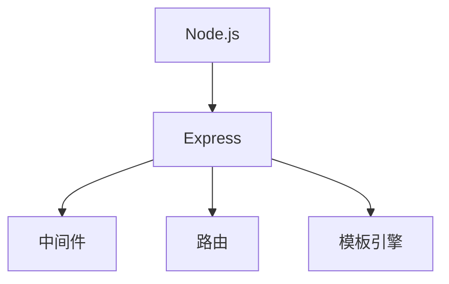

                 

# Node.js 和 Express：构建服务器端 JavaScript 应用程序

在当今的 Web 开发中，Node.js 和 Express 已经成为了构建高性能、可扩展服务器端 JavaScript 应用程序的重要工具。本文将深入探讨 Node.js 和 Express 的核心概念、核心算法原理以及具体操作步骤，并结合实际应用场景进行详细讲解。

## 1. 背景介绍

### 1.1 问题由来
传统上，Web 应用程序主要由服务器端的后端语言（如 Java、PHP）以及前端语言（如 HTML、CSS、JavaScript）组成。然而，随着 JavaScript 的崛起，越来越多开发者开始探索使用 JavaScript 作为服务器端语言，从而能够实现前后端技术栈的统一。

Node.js 是一个基于 Chrome V8 引擎的 JavaScript 运行时，使得开发者可以直接使用 JavaScript 编写服务器端代码。Express 则是一个 Node.js 框架，简化了服务器端编程，使得开发者能够更加专注于业务逻辑的实现，而不需要过多关注底层网络通信和路由处理。

### 1.2 问题核心关键点
Node.js 和 Express 的主要优势包括：
- 全栈编程：开发者可以使用同一种语言（JavaScript）开发前后端代码。
- 高效性能：Node.js 的异步非阻塞 I/O 设计，使得服务器能够处理大量并发连接。
- 灵活扩展：Express 框架提供了丰富的中间件机制，支持开发者自定义扩展。
- 生态繁荣：Node.js 和 Express 拥有庞大的社区和丰富的第三方库。

本文档将通过系统化地介绍 Node.js 和 Express 的核心概念、算法原理及操作步骤，帮助读者掌握如何使用它们构建高效、可扩展的服务器端 JavaScript 应用程序。

## 2. 核心概念与联系

### 2.1 核心概念概述

为更好地理解 Node.js 和 Express 的核心概念，本节将介绍几个密切相关的核心概念：

- **Node.js**：基于 Chrome V8 引擎的 JavaScript 运行时，能够直接运行 JavaScript 代码。
- **Express**：一个 Node.js 框架，提供了路由、中间件、模板引擎等功能，简化了服务器端编程。
- **中间件(Middleware)**：Express 中的一种机制，允许开发者在请求/响应管道中插入自定义函数，实现数据的处理和修改。
- **路由(Routing)**：根据请求的 URL 路径，匹配相应的请求处理函数，实现请求的分发和处理。
- **模板引擎**：如 EJS、Pug 等，用于动态生成 HTML 页面。

这些核心概念之间的逻辑关系可以通过以下 Mermaid 流程图来展示：



这个流程图展示了一些核心概念之间的关系：

1. Express 建立在 Node.js 之上，提供了丰富的功能，如中间件、路由等。
2. 中间件是 Express 的核心机制，支持在请求/响应管道中插入自定义函数。
3. 路由用于分发请求，根据 URL 路径匹配相应的请求处理函数。
4. 模板引擎用于动态生成 HTML 页面。

## 3. 核心算法原理 & 具体操作步骤

### 3.1 算法原理概述

Node.js 和 Express 的核心算法原理主要包括：

- **异步非阻塞 I/O**：Node.js 的异步非阻塞 I/O 设计，允许服务器同时处理大量并发连接。
- **事件驱动模型**：Node.js 采用事件驱动模型，通过监听和触发事件来实现并发处理。
- **中间件链式调用**：Express 采用中间件链式调用的方式，实现请求处理功能的复用和组合。
- **路由匹配算法**：Express 采用基于正则表达式的路由匹配算法，实现精确匹配。

### 3.2 算法步骤详解

以下是使用 Node.js 和 Express 构建服务器端 JavaScript 应用程序的具体操作步骤：

**Step 1: 准备开发环境**

1. 安装 Node.js 和 npm：可以从 Node.js 官网下载最新版本的 Node.js 和 npm。
2. 安装 Express 框架：使用 npm 安装 Express 框架，命令为 `npm install express`。

**Step 2: 编写核心逻辑**

1. 创建服务器实例：使用 `app` 对象作为 Express 的实例。
2. 定义路由处理函数：使用 `app.get()` 或 `app.post()` 等方法定义路由处理函数。
3. 使用中间件处理请求：在路由处理函数之前，可以使用中间件处理请求，如日志记录、身份验证等。

**Step 3: 实现业务逻辑**

1. 在路由处理函数中实现具体的业务逻辑。
2. 使用模板引擎动态生成 HTML 页面。

**Step 4: 启动服务器**

1. 使用 `app.listen()` 方法启动服务器。
2. 设置服务器监听的端口号。

**Step 5: 测试应用程序**

1. 使用浏览器或 HTTP 客户端工具测试应用程序。
2. 根据测试结果，调整和优化应用程序的逻辑。

### 3.3 算法优缺点

Node.js 和 Express 的主要优点包括：

- **高效性能**：Node.js 的异步非阻塞 I/O 设计，使得服务器能够处理大量并发连接。
- **灵活扩展**：Express 提供了丰富的中间件机制，支持开发者自定义扩展。
- **快速开发**：Express 简化了服务器端编程，使得开发者能够更加专注于业务逻辑的实现。

同时，这些框架也存在一定的局限性：

- **单线程设计**：Node.js 的单线程设计，使得某些计算密集型任务可能会阻塞服务器。
- **学习曲线**：Node.js 和 Express 的异步编程模型，对于初学者来说可能需要一定的时间适应。
- **内存管理**：Node.js 的全局对象（如 `global`、`process`）可能会占用过多内存，导致内存泄漏。

### 3.4 算法应用领域

Node.js 和 Express 适用于各种 Web 应用场景，例如：

- **Web 应用程序**：如博客、电商、社交网络等。
- **API 服务器**：如 RESTful API 服务器，提供数据接口服务。
- **实时应用**：如实时聊天、在线游戏等。
- **事件驱动应用**：如事件驱动的任务管理系统、监控系统等。
- **微服务架构**：如微服务架构下的组件通信、API 网关等。

Node.js 和 Express 也在不断扩展应用领域，通过与其他技术的结合，实现更复杂、高效的应用场景。

## 4. 数学模型和公式 & 详细讲解 & 举例说明

### 4.1 数学模型构建

本节将使用数学语言对 Node.js 和 Express 的核心算法原理进行更加严格的刻画。

### 4.2 公式推导过程

以下推导 Express 路由匹配算法的核心公式。

Express 的路由匹配算法采用正则表达式的方式，假设请求 URL 为 `"/users/:id"`，表示匹配形如 `/users/123` 的 URL。表达式的匹配过程可以描述为：

1. 从左到右匹配正则表达式。
2. 在匹配过程中，如果遇到 `:*` 表示捕获组，则将请求 URL 的部分替换为捕获值。
3. 最终得到的捕获值和未匹配的部分作为路由参数。

### 4.3 案例分析与讲解

假设请求 URL 为 `/users/123`，表达式的匹配过程如下：

1. 匹配 `/users/` 部分，剩余 `123`。
2. `:id` 表示捕获组，将其替换为 `123`。
3. 最终得到捕获值为 `123`，未匹配部分为空。

这种匹配过程可以通过 JavaScript 代码实现，示例如下：

```javascript
const express = require('express');
const app = express();

app.get('/users/:id', (req, res) => {
    const id = req.params.id;
    res.send(`User ID: ${id}`);
});

app.listen(3000, () => {
    console.log('Server running on port 3000');
});
```

在这个例子中，我们定义了一个路由 `/users/:id`，使用正则表达式匹配请求 URL，并使用中间件处理函数处理请求。

## 5. 项目实践：代码实例和详细解释说明

### 5.1 开发环境搭建

在进行 Node.js 和 Express 项目实践前，我们需要准备好开发环境。以下是使用 Node.js 和 npm 搭建开发环境的步骤：

1. 从 Node.js 官网下载并安装最新版本的 Node.js 和 npm。
2. 创建项目目录，进入命令行终端。
3. 初始化 npm 项目，命令为 `npm init`。
4. 安装 Express 框架，命令为 `npm install express`。

### 5.2 源代码详细实现

以下是使用 Node.js 和 Express 构建一个简单的 Web 应用程序的完整代码实现：

```javascript
const express = require('express');
const app = express();

// 定义路由处理函数
app.get('/', (req, res) => {
    res.send('Hello, World!');
});

// 使用中间件记录请求日志
app.use((req, res, next) => {
    console.log(`[${new Date().toISOString()}] ${req.method} ${req.originalUrl}`);
    next();
});

// 启动服务器
app.listen(3000, () => {
    console.log('Server running on port 3000');
});
```

在这个例子中，我们定义了一个路由 `GET /`，使用中间件记录请求日志，并启动服务器。

### 5.3 代码解读与分析

让我们再详细解读一下关键代码的实现细节：

**app 对象**：
- `app` 对象是 Express 的核心实例，用于定义路由和中间件。
- 使用 `app.get()` 方法定义路由处理函数。

**中间件**：
- 使用 `app.use()` 方法定义中间件函数，用于记录请求日志。
- 中间件函数接收请求和响应对象，以及一个 `next` 函数，用于调用下一个中间件或路由处理函数。

**路由处理函数**：
- 使用 `req` 和 `res` 对象处理请求和响应。
- 使用 `res.send()` 方法发送响应内容。

**服务器启动**：
- 使用 `app.listen()` 方法启动服务器。
- 设置服务器监听的端口号。

可以看到，Node.js 和 Express 的代码实现非常简单，开发者可以轻松上手，快速构建服务器端 JavaScript 应用程序。

### 5.4 运行结果展示

启动服务器后，在浏览器中输入 `http://localhost:3000`，即可看到 "Hello, World!" 的响应。

## 6. 实际应用场景

### 6.1 Web 应用程序

Node.js 和 Express 可以用于构建各种 Web 应用程序，例如：

- **博客系统**：如 WordPress、Hexo 等。
- **电商平台**：如 Magento、Shopify 等。
- **社交网络**：如 Facebook、Twitter 等。
- **个人博客**：如个人网站、博客应用等。

### 6.2 API 服务器

Node.js 和 Express 可以用于构建 RESTful API 服务器，例如：

- **电商 API**：如商品信息查询、订单处理等。
- **社交 API**：如用户认证、消息推送等。
- **文档 API**：如 Markdown 文档的存储和检索等。

### 6.3 实时应用

Node.js 和 Express 可以用于构建实时应用，例如：

- **实时聊天**：如即时通讯应用、在线客服等。
- **在线游戏**：如多人在线游戏、游戏服务器等。

### 6.4 事件驱动应用

Node.js 和 Express 可以用于构建事件驱动的应用，例如：

- **任务管理系统**：如项目管理、任务调度等。
- **监控系统**：如系统监控、日志管理等。

## 7. 工具和资源推荐

### 7.1 学习资源推荐

为了帮助开发者系统掌握 Node.js 和 Express 的理论基础和实践技巧，这里推荐一些优质的学习资源：

1. **Node.js 官方文档**：提供了完整的 Node.js 文档和 API 参考，是开发者学习的必备资源。
2. **Express 官方文档**：提供了 Express 的文档和 API 参考，以及丰富的样例代码。
3. **《Node.js 实战》**：阮一峰老师所著的《Node.js 实战》一书，适合初学者入门。
4. **《JavaScript 设计模式与开发实践》**：周志华老师所著的《JavaScript 设计模式与开发实践》一书，深入讲解了 JavaScript 的设计模式和开发实践。
5. **Udemy 课程**：Udemy 网站上有大量优秀的 Node.js 和 Express 课程，适合不同层次的开发者学习。

通过对这些资源的学习实践，相信你一定能够快速掌握 Node.js 和 Express 的核心概念和实践技巧，并用于解决实际的开发问题。

### 7.2 开发工具推荐

高效的开发离不开优秀的工具支持。以下是几款用于 Node.js 和 Express 开发的常用工具：

1. **Visual Studio Code**：微软开发的轻量级代码编辑器，支持多种语言，支持 Node.js 和 Express 开发。
2. **IntelliJ IDEA**：JetBrains 开发的强大代码编辑器，支持多种语言，包括 JavaScript。
3. **WebStorm**：JetBrains 开发的专门针对 Web 开发的 IDE，支持 Express 开发和调试。
4. **Postman**：Postman 是一个 HTTP 请求调试工具，适合测试 Express 应用程序。
5. **Git**：Git 是一个版本控制系统，适合协作开发和版本管理。

合理利用这些工具，可以显著提升 Node.js 和 Express 开发的效率，加快创新迭代的步伐。

### 7.3 相关论文推荐

Node.js 和 Express 的发展源于学界的持续研究。以下是几篇奠基性的相关论文，推荐阅读：

1. **《Node.js 官方文档》**：提供了 Node.js 的官方文档和 API 参考。
2. **《Express 官方文档》**：提供了 Express 的文档和 API 参考。
3. **《Node.js 的异步编程模型》**：讲解了 Node.js 的异步编程模型，适合深入理解 Node.js 的底层机制。
4. **《Express 的中间件机制》**：讲解了 Express 的中间件机制，适合理解 Express 的组件化和模块化开发。
5. **《Event Driven Programming with Node.js》**：讲解了 Node.js 的事件驱动模型，适合理解 Node.js 的异步编程和事件驱动机制。

这些论文代表了大语言模型微调技术的发展脉络。通过学习这些前沿成果，可以帮助研究者把握学科前进方向，激发更多的创新灵感。

## 8. 总结：未来发展趋势与挑战

### 8.1 总结

本文对 Node.js 和 Express 的核心概念、算法原理及操作步骤进行了全面系统的介绍。首先阐述了 Node.js 和 Express 的研究背景和意义，明确了它们在构建高性能、可扩展服务器端 JavaScript 应用程序方面的独特价值。其次，从原理到实践，详细讲解了 Node.js 和 Express 的核心算法原理和操作步骤，给出了具体的代码实例。同时，本文还广泛探讨了 Node.js 和 Express 在 Web 应用程序、API 服务器、实时应用、事件驱动应用等多个领域的应用前景，展示了它们的应用潜力。

通过本文的系统梳理，可以看到，Node.js 和 Express 已经成为了 Web 开发的重要工具，在构建高效、可扩展的服务器端 JavaScript 应用程序中发挥着重要作用。Node.js 的异步非阻塞 I/O 设计和 Express 的中间件机制，使得开发者能够更加专注于业务逻辑的实现，同时也提高了应用程序的性能和可扩展性。未来，随着 Node.js 和 Express 的不断演进，它们将在更多场景下得到应用，进一步推动 Web 开发技术的进步。

### 8.2 未来发展趋势

展望未来，Node.js 和 Express 的发展趋势如下：

1. **异步性能优化**：Node.js 和 Express 将进一步优化异步性能，支持更高效的 I/O 操作，提高服务器吞吐量。
2. **模块化开发**：Express 将支持更灵活的模块化开发，使得开发者能够更加方便地管理和复用代码。
3. **生态系统扩展**：Node.js 和 Express 的生态系统将进一步扩展，支持更多的第三方库和插件。
4. **云原生支持**：Node.js 和 Express 将支持云原生开发和部署，支持容器化、服务网格等技术。
5. **性能监控**：Node.js 和 Express 将支持更强大的性能监控工具，帮助开发者实时监测应用程序的性能和状态。
6. **跨平台支持**：Node.js 和 Express 将支持更多的平台和操作系统，提升跨平台兼容性。

这些发展趋势将进一步提升 Node.js 和 Express 的性能和可扩展性，使其在更多的场景下得到应用，推动 Web 开发技术的进步。

### 8.3 面临的挑战

尽管 Node.js 和 Express 已经取得了显著的进展，但在迈向更加智能化、普适化应用的过程中，它们仍面临着诸多挑战：

1. **单线程瓶颈**：Node.js 的单线程设计，使得某些计算密集型任务可能会阻塞服务器。
2. **内存管理问题**：Node.js 的全局对象可能会占用过多内存，导致内存泄漏。
3. **异步编程复杂性**：Node.js 的异步编程模型，对于初学者来说可能需要一定的时间适应。
4. **性能问题**：Node.js 的性能优化空间有限，需要更多的工具和手段来提升性能。
5. **生态系统问题**：Node.js 的生态系统虽然繁荣，但也存在一些碎片化和兼容性问题。

### 8.4 研究展望

为了应对这些挑战，未来的研究需要在以下几个方面寻求新的突破：

1. **多线程技术**：探索多线程技术，如 Worker Threads，解决单线程瓶颈问题。
2. **内存优化技术**：使用内存优化技术，如模块化加载、动态缓存等，减少内存泄漏。
3. **异步编程简化**：开发更易用的异步编程工具，简化异步编程复杂性。
4. **性能优化技术**：引入性能优化技术，如异步池、异步缓存等，提升性能。
5. **生态系统统一**：推动 Node.js 和 Express 生态系统的统一和标准化，提升组件和插件的兼容性。

这些研究方向的探索，必将引领 Node.js 和 Express 技术迈向更高的台阶，为 Web 开发技术的进步提供更多动力。

## 9. 附录：常见问题与解答

**Q1: 什么是 Node.js 和 Express？**

A: Node.js 是一个基于 Chrome V8 引擎的 JavaScript 运行时，能够直接运行 JavaScript 代码。Express 是一个 Node.js 框架，提供了路由、中间件、模板引擎等功能，简化了服务器端编程。

**Q2: 如何优化 Node.js 和 Express 的性能？**

A: 优化 Node.js 和 Express 的性能可以从以下几个方面入手：
1. 使用异步 I/O 和非阻塞操作。
2. 使用缓存技术，减少重复计算。
3. 使用多线程和事件驱动模型。
4. 使用性能监控工具，实时监测和优化性能。
5. 使用负载均衡和高可用性技术，提升服务器吞吐量。

**Q3: Express 中间件有哪些作用？**

A: Express 中间件用于在请求/响应管道中插入自定义函数，实现数据的处理和修改。中间件可以用于记录日志、身份验证、数据校验、错误处理等，增强应用程序的灵活性和可维护性。

**Q4: 如何实现 RESTful API 服务？**

A: 使用 Express 框架，可以轻松实现 RESTful API 服务。首先需要定义路由，使用 `app.get()` 或 `app.post()` 方法定义 API 接口，然后使用中间件处理请求，并返回响应。例如：

```javascript
app.get('/api/users', (req, res) => {
    // 获取所有用户信息
    res.json(users);
});
```

**Q5: 如何部署 Node.js 和 Express 应用程序？**

A: 部署 Node.js 和 Express 应用程序，可以使用云服务、容器化技术（如 Docker）、服务器部署等方法。常用的云服务包括 AWS、Azure、Google Cloud 等，支持 Node.js 和 Express 应用程序的部署和运行。

总之，Node.js 和 Express 已经成为 Web 开发的重要工具，通过合理应用这些技术，开发者可以构建高效、可扩展的服务器端 JavaScript 应用程序。未来，随着 Node.js 和 Express 的不断发展，它们将在更多的场景下得到应用，推动 Web 开发技术的进步。

---

作者：禅与计算机程序设计艺术 / Zen and the Art of Computer Programming

