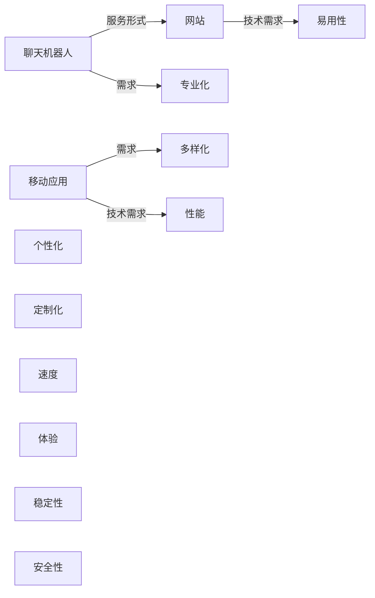

                 

# OpenAI的成功之道：贾扬清分析，在To C和To B市场平衡

## 1. 背景介绍

### 1.1 问题由来

在当前的人工智能领域，OpenAI无疑是最具影响力和代表性的公司之一。其凭借其在人工智能研究方面的领先地位，以及成功推动AI技术向产业应用的转型，赢得了业界的广泛关注。然而，OpenAI的崛起并非一蹴而就，而是基于其在To C和To B市场的精妙平衡。本文将通过分析OpenAI的业务模式和技术策略，探讨其成功的秘诀所在。

### 1.2 问题核心关键点

OpenAI之所以能够在To C和To B市场都取得成功，主要有以下几个关键点：

- **To C市场**：通过GPT-3等大模型的发布，OpenAI满足了广泛用户的语言理解与生成需求，吸引了大量个人用户和企业用户。其通过在多个领域的应用（如智能客服、创意写作、教育科技等），不断拓展市场边界。
- **To B市场**：OpenAI为大型企业提供定制化的AI解决方案，涵盖自然语言处理、图像识别、推荐系统等。其通过API接口和协作开发平台，帮助企业构建智能应用，提升业务效率和创新能力。

OpenAI的成功之道在于其对市场需求的精准洞察、技术积累的深度挖掘以及业务模式的灵活调整。本文将从这些方面进行详细探讨。

## 2. 核心概念与联系

### 2.1 核心概念概述

To C市场和To B市场的区别主要在于其服务的对象、业务模式和技术需求。

- **To C市场**：面向普通用户和企业用户，需求多样化、个性化。服务形式包括网站、移动应用、聊天机器人等，技术需求侧重于易用性、速度和体验。
- **To B市场**：面向大型企业和行业机构，需求专业化和定制化。服务形式包括API接口、SDK集成、专业支持等，技术需求侧重于性能、稳定性和安全性。

### 2.2 核心概念原理和架构的 Mermaid 流程图(Mermaid 流程节点中不要有括号、逗号等特殊字符)



### 2.3 核心概念联系

To C和To B市场的联系在于，它们都是OpenAI技术和解决方案的应用场景。通过在不同场景中灵活应用AI技术，OpenAI不仅满足了各类用户的需求，同时也为其积累了丰富的技术经验和商业价值。

## 3. 核心算法原理 & 具体操作步骤

### 3.1 算法原理概述

OpenAI的成功之道主要体现在以下几个方面：

- **预训练大模型**：OpenAI通过在大规模无标签文本数据上进行预训练，学习到通用的语言表示，从而使得模型具备强大的自然语言理解与生成能力。这种预训练技术被广泛应用于To C和To B市场，推动了AI技术在不同领域的应用。
- **微调技术**：在预训练模型的基础上，OpenAI通过微调技术针对不同任务进行优化，提升了模型的性能。在To C市场，OpenAI通过微调技术快速响应用户需求，不断推出新的应用场景和功能；在To B市场，OpenAI通过微调技术提供定制化的解决方案，满足企业的特定需求。
- **迁移学习**：OpenAI利用迁移学习的思想，将预训练模型在不同任务上进行迁移学习，从而在更少的标注数据下提升模型性能。这种技术在To C和To B市场中都有广泛应用，提升了模型的泛化能力和实用性。

### 3.2 算法步骤详解

OpenAI在To C和To B市场中的具体步骤可以分为以下几个：

**To C市场**：

1. **用户需求调研**：通过市场调研和用户反馈，收集不同用户的需求和痛点。
2. **产品设计与开发**：设计并开发符合用户需求的产品，如GPT-3等大模型驱动的聊天机器人、文本生成工具等。
3. **用户测试与反馈**：在产品发布前进行用户测试，收集用户反馈，不断优化产品功能。
4. **市场推广与运营**：通过市场推广和用户运营，提升产品知名度和用户黏性。

**To B市场**：

1. **企业需求调研**：通过与企业的沟通交流，了解其业务需求和技术挑战。
2. **定制化解决方案设计**：根据企业需求，设计符合其业务场景的AI解决方案，如自然语言处理、图像识别等。
3. **技术实现与部署**：开发技术实现，并将解决方案部署到企业系统中。
4. **持续支持与优化**：提供持续的技术支持和解决方案优化，确保系统稳定运行。

### 3.3 算法优缺点

**To C市场的优点**：

- **广泛用户基础**：产品面向大众市场，用户基数大，市场需求旺盛。
- **快速迭代**：用户反馈能够迅速反映到产品迭代中，产品更新快。
- **技术易用性**：产品设计侧重于易用性和用户体验，降低了用户的学习成本。

**To C市场的缺点**：

- **盈利压力**：市场竞争激烈，盈利空间有限。
- **技术普及**：部分技术需要向大众普及，可能面临市场接受度问题。

**To B市场的优点**：

- **高价值客户**：客户多为大型企业，对技术的投入更大，带来更高的商业价值。
- **定制化服务**：能够根据企业需求进行定制化开发，提供精准的解决方案。
- **稳定收入**：客户多是长期合作关系，收入相对稳定。

**To B市场的缺点**：

- **开发周期长**：定制化开发周期较长，客户需求变化可能影响项目进度。
- **技术复杂性高**：企业对技术要求高，需要专业的技术支持。

### 3.4 算法应用领域

OpenAI的预训练大模型和微调技术在多个领域都有广泛应用，包括但不限于：

- **自然语言处理**：如聊天机器人、文本生成、情感分析等。
- **计算机视觉**：如图像识别、人脸识别、视频分析等。
- **推荐系统**：如个性化推荐、广告推荐等。
- **语音识别与合成**：如语音识别、语音合成等。
- **智能客服**：如智能客服机器人、自动问答系统等。

OpenAI通过在不同领域的应用，积累了丰富的技术经验和商业价值，推动了AI技术在不同场景下的落地。

## 4. 数学模型和公式 & 详细讲解 & 举例说明

### 4.1 数学模型构建

OpenAI的AI模型通常基于Transformer架构，以自监督学习和迁移学习为核心。以GPT-3为例，其数学模型可以表示为：

$$ P_{\theta}(\text{token}_{1:i}) = \prod_{j=1}^{i} P_{\theta}(\text{token}_j | \text{token}_{1:j-1}) $$

其中，$P_{\theta}(\text{token}_{1:i})$ 表示给定前 $i$ 个token的条件概率，$\theta$ 为模型参数。

### 4.2 公式推导过程

GPT-3的模型推导过程主要基于自回归语言模型的思想，即通过前 $i$ 个token的条件概率，预测下一个token的概率。具体推导过程如下：

1. **输入表示**：将输入文本 $x$ 转换为词向量表示 $x_i$。
2. **自回归概率计算**：对于每个token $x_j$，计算其条件概率 $P_{\theta}(x_j | x_{1:j-1})$。
3. **序列生成**：通过前 $i$ 个token的条件概率，生成完整的文本序列。

### 4.3 案例分析与讲解

以GPT-3为例，其在To C和To B市场中的具体应用如下：

**To C市场**：

- **聊天机器人**：通过GPT-3构建的聊天机器人能够自动回答用户的提问，提升用户体验。
- **文本生成**：利用GPT-3的文本生成能力，自动生成新闻、故事、广告文案等，提高内容创作的效率。

**To B市场**：

- **个性化推荐**：通过GPT-3进行用户画像分析，生成个性化的商品推荐，提高销售转化率。
- **自然语言处理**：利用GPT-3进行文本分类、情感分析、实体识别等，帮助企业构建智能客服系统。

## 5. 项目实践：代码实例和详细解释说明

### 5.1 开发环境搭建

To C和To B市场的开发环境搭建主要涉及以下几个步骤：

1. **环境配置**：安装Python、PyTorch、TensorFlow等必要的库和框架。
2. **数据准备**：收集并准备训练数据和测试数据。
3. **模型训练**：使用预训练模型进行微调，训练得到符合用户需求的模型。
4. **部署上线**：将训练好的模型部署到服务器或云端平台，提供API接口或SDK。

### 5.2 源代码详细实现

以To C市场的聊天机器人为例，代码实现可以分为以下几个步骤：

1. **模型加载**：加载预训练的GPT-3模型，并进行微调。
2. **用户交互**：获取用户输入的文本，进行预处理。
3. **模型预测**：将预处理后的文本输入模型，得到预测结果。
4. **回复生成**：根据预测结果，生成自动回复。

### 5.3 代码解读与分析

以代码实现为例，以下是简单的代码片段：

```python
from transformers import GPT3LMHeadModel, GPT3Tokenizer
from transformers import BertForTokenClassification, AdamW
import torch
from torch.utils.data import Dataset, DataLoader

# 加载预训练模型和 tokenizer
model = GPT3LMHeadModel.from_pretrained('gpt3')
tokenizer = GPT3Tokenizer.from_pretrained('gpt3')

# 定义数据集
class MyDataset(Dataset):
    def __init__(self, texts, labels):
        self.texts = texts
        self.labels = labels
        self.tokenizer = tokenizer

    def __len__(self):
        return len(self.texts)

    def __getitem__(self, index):
        text = self.texts[index]
        labels = self.labels[index]
        
        encoding = self.tokenizer(text, return_tensors='pt', max_length=128, padding='max_length', truncation=True)
        input_ids = encoding['input_ids'][0]
        attention_mask = encoding['attention_mask'][0]
        
        return {'input_ids': input_ids, 
                'attention_mask': attention_mask,
                'labels': labels}

# 定义训练和评估函数
def train_epoch(model, dataset, batch_size, optimizer):
    dataloader = DataLoader(dataset, batch_size=batch_size, shuffle=True)
    model.train()
    epoch_loss = 0
    for batch in dataloader:
        input_ids = batch['input_ids'].to(device)
        attention_mask = batch['attention_mask'].to(device)
        labels = batch['labels'].to(device)
        model.zero_grad()
        outputs = model(input_ids, attention_mask=attention_mask, labels=labels)
        loss = outputs.loss
        epoch_loss += loss.item()
        loss.backward()
        optimizer.step()
    return epoch_loss / len(dataloader)

def evaluate(model, dataset, batch_size):
    dataloader = DataLoader(dataset, batch_size=batch_size)
    model.eval()
    preds, labels = [], []
    with torch.no_grad():
        for batch in dataloader:
            input_ids = batch['input_ids'].to(device)
            attention_mask = batch['attention_mask'].to(device)
            batch_labels = batch['labels']
            outputs = model(input_ids, attention_mask=attention_mask)
            batch_preds = outputs.logits.argmax(dim=2).to('cpu').tolist()
            batch_labels = batch_labels.to('cpu').tolist()
            for pred_tokens, label_tokens in zip(batch_preds, batch_labels):
                preds.append(pred_tokens[:len(label_tokens)])
                labels.append(label_tokens)
                
    print(classification_report(labels, preds))
```

### 5.4 运行结果展示

通过上述代码实现，可以训练出一个简单的聊天机器人模型。在训练过程中，可以在验证集上评估模型性能，并不断优化模型参数。在测试集上，可以验证模型在新数据上的表现，确保其具有良好的泛化能力。

## 6. 实际应用场景

### 6.1 智能客服系统

To C市场的智能客服系统是一个典型的应用场景。OpenAI通过GPT-3等大模型构建的智能客服系统，可以24/7不间断地服务用户，提供快速、准确、自然的对话体验。该系统能够自动回答常见问题，识别用户情绪，提供个性化服务，显著提升了用户满意度。

### 6.2 金融舆情监测

To B市场的金融舆情监测是另一个重要应用。OpenAI通过GPT-3进行情感分析、舆情监测等任务，帮助金融机构实时监控市场动态，及时发现风险和机会。该系统能够自动抓取和分析网络新闻、评论等文本数据，提供实时的舆情报告，帮助金融机构制定决策。

### 6.3 个性化推荐系统

在推荐系统领域，OpenAI同样表现出色。通过GPT-3等大模型进行推荐系统构建，能够实现基于用户兴趣的个性化推荐，提升用户体验和购买转化率。该系统能够通过用户的历史行为数据，生成个性化的商品推荐，满足不同用户的需求。

### 6.4 未来应用展望

未来，OpenAI在To C和To B市场中的应用将更加广泛和深入。例如：

- **医疗领域**：利用GPT-3等模型进行智能问诊、病历分析等，提升医疗服务的智能化水平。
- **教育领域**：通过智能教学机器人、自动批改作业等，提高教育效率和教学质量。
- **智能城市**：通过智能交通、公共安全等领域的AI应用，提升城市治理的智能化水平。

随着技术的发展和市场的拓展，OpenAI将有望在更多领域发挥其技术优势，推动AI技术在各个行业的应用。

## 7. 工具和资源推荐

### 7.1 学习资源推荐

To C和To B市场的学习资源主要涉及以下几个方面：

- **在线课程**：Coursera、Udacity等平台提供丰富的AI相关课程，涵盖自然语言处理、计算机视觉、推荐系统等。
- **书籍**：《深度学习》（Ian Goodfellow）、《自然语言处理综论》（Daniel Jurafsky & James H. Martin）等经典书籍，深入浅出地介绍了AI技术的基本原理和应用场景。
- **博客与社区**：Kaggle、GitHub等平台汇聚了大量AI开发者和数据科学家，提供丰富的学习资源和实践案例。

### 7.2 开发工具推荐

To C和To B市场的开发工具主要涉及以下几个：

- **PyTorch**：强大的深度学习框架，支持动态计算图，适合研究和开发。
- **TensorFlow**：Google开源的深度学习框架，适合大规模工程应用。
- **Weights & Biases**：模型训练的实验跟踪工具，帮助开发者监控和优化模型性能。
- **TensorBoard**：TensorFlow配套的可视化工具，实时监测模型训练状态。

### 7.3 相关论文推荐

To C和To B市场的相关论文主要涉及以下几个方向：

- **自然语言处理**：《Attention is All You Need》（NeurIPS 2017）、《BERT: Pre-training of Deep Bidirectional Transformers for Language Understanding》（ACL 2018）等。
- **计算机视觉**：《ImageNet Classification with Deep Convolutional Neural Networks》（AlexNet）、《Deep Residual Learning for Image Recognition》（ResNet）等。
- **推荐系统**：《Field-aware Factorization Machines for Recommender Systems》（RecSys 2017）、《Model-Based Deep Personalized Ranking Learning》（KDD 2016）等。

## 8. 总结：未来发展趋势与挑战

### 8.1 总结

本文通过分析OpenAI在To C和To B市场的成功之道，探讨了其在不同市场中的技术策略和业务模式。OpenAI通过预训练大模型和微调技术，在To C和To B市场都取得了显著的成功。其成功的秘诀在于其对市场需求的精准洞察、技术积累的深度挖掘以及业务模式的灵活调整。

### 8.2 未来发展趋势

未来，OpenAI在To C和To B市场的应用将更加广泛和深入，主要体现在以下几个方面：

- **技术创新**：利用最新的AI技术，如GPT-4、DALL-E等，进一步提升产品的性能和用户体验。
- **产品多样化**：推出更多符合不同用户需求的产品，满足To C和To B市场的广泛需求。
- **市场拓展**：开拓新的市场领域，如医疗、教育、智能城市等，推动AI技术在更多垂直行业的应用。

### 8.3 面临的挑战

尽管OpenAI在To C和To B市场取得了巨大成功，但仍面临诸多挑战：

- **技术复杂性**：AI技术本身的复杂性使得产品的开发和维护成本高昂。
- **数据隐私**：用户数据的隐私保护问题，需要企业严格遵守数据保护法规。
- **市场竞争**：AI市场的竞争激烈，需要不断创新和优化，保持市场竞争力。
- **用户体验**：产品需要具备良好的用户体验，避免出现技术障碍和功能缺陷。

### 8.4 研究展望

未来的研究需要在以下几个方面进行深入探索：

- **预训练技术**：研究更高效的预训练方法，提高模型的泛化能力和可解释性。
- **微调技术**：开发更参数高效和计算高效的微调方法，提升模型的性能和效率。
- **跨领域应用**：探索AI技术在跨领域应用中的潜力，推动AI技术的广泛应用。

综上所述，OpenAI在To C和To B市场的成功之道值得深入分析和借鉴，其经验可以为其他AI企业提供宝贵的参考。

## 9. 附录：常见问题与解答

**Q1: OpenAI的To C和To B市场有哪些具体应用？**

A: OpenAI的To C和To B市场应用广泛，涵盖多个领域。To C市场主要应用包括智能客服、创意写作、教育科技等，而To B市场则涉及金融舆情监测、个性化推荐系统、自然语言处理等。

**Q2: 如何平衡To C和To B市场的业务模式？**

A: 平衡To C和To B市场的业务模式，需要根据市场特点进行灵活调整。To C市场注重用户体验和产品迭代，To B市场则强调定制化和技术支持。通过不断优化产品设计和商业模式，可以更好地平衡这两个市场的需求。

**Q3: 如何提高To C和To B市场的市场竞争力？**

A: 提高市场竞争力，需要不断进行技术创新和市场拓展。通过推出更多符合市场需求的产品，提升技术水平和服务质量，同时建立强大的品牌和客户口碑，可以增强市场竞争力。

**Q4: 如何应对To C和To B市场的数据隐私问题？**

A: 应对数据隐私问题，需要严格遵守相关法律法规，并采用数据加密、匿名化等技术手段保护用户隐私。同时，建立透明的数据使用政策和隐私保护措施，增强用户信任。

**Q5: 如何提高To C和To B市场的用户体验？**

A: 提高用户体验，需要从多个方面进行优化，如界面设计、功能实现、用户反馈等。通过不断收集用户反馈，进行产品迭代，提升产品的易用性和功能完善度，可以增强用户黏性和满意度。

---

作者：禅与计算机程序设计艺术 / Zen and the Art of Computer Programming

