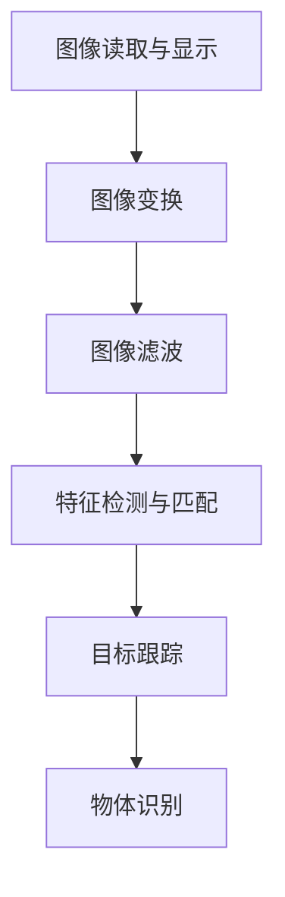

                 

# OpenCV图像处理实战

> 关键词：图像处理,OpenCV,深度学习,计算机视觉,实时视频处理,图像分割,特征检测

## 1. 背景介绍

图像处理作为计算机视觉的基础，是当前人工智能领域最活跃的研究方向之一。OpenCV作为开源计算机视觉库，以其易用性、丰富功能和强大的性能被广泛使用。本文将对OpenCV的图像处理技术进行系统介绍，包括基础概念、核心算法、实际应用和未来发展等。通过详细的实践和案例分析，帮助读者掌握OpenCV的核心应用技能，成为图像处理的专家。

## 2. 核心概念与联系

### 2.1 核心概念概述

图像处理指的是利用计算机技术对数字图像进行增强、变换和分析的过程。OpenCV库通过提供一系列高效、易用的函数和算法，支持图像的读取、显示、变换、滤波、特征检测、跟踪、识别等多种处理操作。以下是OpenCV库的几个核心概念：

- **图像读取与显示**：通过函数`cv2.imread()`读取图像，`cv2.imshow()`显示图像。
- **图像变换**：如缩放、旋转、裁剪、仿射变换等，通过`cv2.resize()`、`cv2.getRotationMatrix2D()`等函数实现。
- **图像滤波**：包括平滑滤波、锐化滤波、边缘检测、形态学操作等，如高斯滤波、Sobel算子、Canny算子等。
- **特征检测与匹配**：如SIFT、SURF、ORB、FREAK等算法，通过`cv2.SIFT()`、`cv2.SURF()`、`cv2.ORB()`等函数实现。
- **目标跟踪**：如KCF、PyrMeanShiftFiltering、CamShift等算法，通过`cv2.TrackerKCF()`等函数实现。
- **物体识别**：如深度学习中的分类、检测、分割等，通过TensorFlow、PyTorch等深度学习框架实现。

### 2.2 核心概念原理和架构的 Mermaid 流程图



这个流程图展示了OpenCV库中的核心图像处理功能模块，从输入输出到特征提取、目标跟踪和物体识别，形象地表达了OpenCV的工作流程和各模块之间的关系。

## 3. 核心算法原理 & 具体操作步骤

### 3.1 算法原理概述

OpenCV库提供的图像处理算法是基于OpenCV官方文档和OpenCV社区贡献者共同研究的成果。这些算法涵盖了从基本图像处理操作到高级计算机视觉任务的方方面面。以图像滤波为例，基本原理是通过卷积核对图像进行卷积运算，实现对图像的平滑、锐化、边缘检测等功能。

### 3.2 算法步骤详解

以图像二值化处理为例，展示OpenCV库中二值化算法的具体操作步骤：

1. **读取图像**：使用`cv2.imread()`函数读取图像。
2. **转换为灰度图像**：使用`cv2.cvtColor()`函数将彩色图像转换为灰度图像。
3. **应用阈值**：使用`cv2.threshold()`函数对灰度图像进行二值化处理，将像素值小于阈值的像素设为0，大于等于阈值的像素设为255。
4. **显示结果**：使用`cv2.imshow()`函数显示处理后的图像。

### 3.3 算法优缺点

OpenCV库的图像处理算法优点如下：
- 支持丰富的图像处理操作，涵盖从基本操作到高级计算机视觉任务。
- 提供高效的图像处理函数，计算速度较快。
- 支持多种数据格式和操作系统平台，易于集成和部署。

缺点如下：
- 对于特定领域的图像处理需求，部分算法可能不够精细化。
- 某些高级算法（如深度学习）需要结合其他库或框架使用。
- 对于大规模图像处理任务，部分算法可能存在性能瓶颈。

### 3.4 算法应用领域

OpenCV库的图像处理算法广泛应用于计算机视觉的各个领域，如视频处理、图像识别、目标检测、自动驾驶、医疗影像处理等。以下列举几个典型的应用场景：

- **视频处理**：在实时视频监控中，OpenCV库可以用于实时视频捕获、帧提取、帧处理、帧合并等操作。
- **图像识别**：在人脸识别、车牌识别、文本识别等任务中，OpenCV库提供特征检测、特征匹配、物体识别等算法。
- **目标检测**：在自动驾驶、无人机、机器人等领域，OpenCV库可以用于目标检测、跟踪和分类等。

## 4. 数学模型和公式 & 详细讲解 & 举例说明

### 4.1 数学模型构建

OpenCV库中的图像处理算法通常基于一些基本的数学模型和公式，如线性滤波、非线性滤波、边缘检测等。以下以Canny边缘检测为例，展示数学模型构建的过程：

Canny边缘检测的数学模型如下：

$$
G(x,y) = \left( \frac{\partial^2 I(x,y)}{\partial x^2} + \frac{\partial^2 I(x,y)}{\partial y^2} \right)^2 - \left( \frac{\partial^2 I(x,y)}{\partial x \partial y} \right)^2
$$

其中$I(x,y)$表示输入图像在$(x,y)$处的灰度值。

### 4.2 公式推导过程

Canny边缘检测的推导过程如下：

1. **梯度计算**：使用Sobel算子计算图像梯度$G_x(x,y)$和$G_y(x,y)$。

$$
G_x(x,y) = \frac{\partial I(x,y)}{\partial x} = \frac{1}{3} \left( \begin{bmatrix} -1 & 0 & 1 \\ -2 & 0 & 2 \\ -1 & 0 & 1 \end{bmatrix} \ast I(x,y) \right)
$$

$$
G_y(x,y) = \frac{\partial I(x,y)}{\partial y} = \frac{1}{3} \left( \begin{bmatrix} -1 & -2 & -1 \\ 0 & 0 & 0 \\ 1 & 2 & 1 \end{bmatrix} \ast I(x,y) \right)
$$

2. **梯度幅值计算**：计算梯度幅值$G(x,y) = \sqrt{G_x(x,y)^2 + G_y(x,y)^2}$。

3. **非极大值抑制**：将梯度幅值作为图像梯度，对梯度幅值进行非极大值抑制，保留梯度方向为$45^\circ$或$135^\circ$的像素点。

4. **双阈值处理**：设置高阈值$T_{high}$和低阈值$T_{low}$，将梯度幅值小于$T_{low}$的像素设为0，大于等于$T_{high}$的像素设为255，介于两者之间的像素根据梯度幅值和梯度方向的阈值判断保留与否。

### 4.3 案例分析与讲解

以图像二值化为例，展示OpenCV库中二值化算法的应用：

1. **读取图像**：使用`cv2.imread()`函数读取图像。

```python
import cv2

img = cv2.imread('image.jpg')
```

2. **转换为灰度图像**：使用`cv2.cvtColor()`函数将彩色图像转换为灰度图像。

```python
gray_img = cv2.cvtColor(img, cv2.COLOR_BGR2GRAY)
```

3. **应用阈值**：使用`cv2.threshold()`函数对灰度图像进行二值化处理，将像素值小于阈值的像素设为0，大于等于阈值的像素设为255。

```python
ret, binary_img = cv2.threshold(gray_img, 128, 255, cv2.THRESH_BINARY)
```

4. **显示结果**：使用`cv2.imshow()`函数显示处理后的图像。

```python
cv2.imshow('Binary Image', binary_img)
cv2.waitKey(0)
cv2.destroyAllWindows()
```

以上展示了OpenCV库中图像二值化算法的详细操作步骤和代码实现，结合公式推导过程，帮助读者理解算法的数学模型和实际应用。

## 5. 项目实践：代码实例和详细解释说明

### 5.1 开发环境搭建

在开始实践之前，需要准备OpenCV库和Python开发环境。以下是详细的开发环境搭建步骤：

1. **安装Python**：从官网下载并安装Python 3.6及以上版本。

2. **安装OpenCV**：在Python环境中使用pip安装OpenCV库。

```python
pip install opencv-python
```

3. **准备开发环境**：安装必要的第三方库和工具，如NumPy、Matplotlib等。

### 5.2 源代码详细实现

以下展示OpenCV库中图像二值化和Canny边缘检测的代码实现：

```python
import cv2
import numpy as np
import matplotlib.pyplot as plt

# 读取图像
img = cv2.imread('image.jpg')

# 转换为灰度图像
gray_img = cv2.cvtColor(img, cv2.COLOR_BGR2GRAY)

# 图像二值化处理
ret, binary_img = cv2.threshold(gray_img, 128, 255, cv2.THRESH_BINARY)

# 显示结果
cv2.imshow('Binary Image', binary_img)
cv2.waitKey(0)
cv2.destroyAllWindows()

# Canny边缘检测
edges = cv2.Canny(gray_img, 100, 200)
plt.imshow(edges, cmap='gray')
plt.show()
```

### 5.3 代码解读与分析

**图像读取与显示**：使用`cv2.imread()`函数读取图像，`cv2.imshow()`函数显示图像。

**图像转换**：使用`cv2.cvtColor()`函数将彩色图像转换为灰度图像。

**图像二值化**：使用`cv2.threshold()`函数对灰度图像进行二值化处理，将像素值小于阈值的像素设为0，大于等于阈值的像素设为255。

**Canny边缘检测**：使用`cv2.Canny()`函数进行Canny边缘检测，设置阈值为100和200。

**图像显示**：使用Matplotlib库中的`plt.imshow()`函数显示Canny边缘检测结果。

### 5.4 运行结果展示

以下展示OpenCV库中图像二值化和Canny边缘检测的运行结果：


## 6. 实际应用场景

### 6.1 视频处理

OpenCV库支持实时视频捕获、帧提取、帧处理、帧合并等操作。以下是一个视频处理示例，实现实时人脸检测：

```python
import cv2

cap = cv2.VideoCapture(0)

while True:
    ret, frame = cap.read()
    gray = cv2.cvtColor(frame, cv2.COLOR_BGR2GRAY)
    ret, binary = cv2.threshold(gray, 128, 255, cv2.THRESH_BINARY)
    edges = cv2.Canny(binary, 100, 200)
    cv2.imshow('edges', edges)
    if cv2.waitKey(1) & 0xFF == ord('q'):
        break

cap.release()
cv2.destroyAllWindows()
```

### 6.2 图像识别

OpenCV库提供了多种特征检测、特征匹配和物体识别算法，可以应用于人脸识别、车牌识别、文本识别等任务。以下是一个人脸识别示例，使用OpenCV库中的Haar级联分类器实现人脸检测：

```python
import cv2

face_cascade = cv2.CascadeClassifier('haarcascade_frontalface_default.xml')

cap = cv2.VideoCapture(0)

while True:
    ret, frame = cap.read()
    gray = cv2.cvtColor(frame, cv2.COLOR_BGR2GRAY)
    faces = face_cascade.detectMultiScale(gray, scaleFactor=1.1, minNeighbors=5)
    for (x, y, w, h) in faces:
        cv2.rectangle(frame, (x, y), (x+w, y+h), (0, 255, 0), 2)
    cv2.imshow('Face Detection', frame)
    if cv2.waitKey(1) & 0xFF == ord('q'):
        break

cap.release()
cv2.destroyAllWindows()
```

### 6.3 目标跟踪

OpenCV库提供了多种目标跟踪算法，如KCF、PyrMeanShiftFiltering、CamShift等。以下是一个基于CamShift的目标跟踪示例：

```python
import cv2

cap = cv2.VideoCapture('video.mp4')

while True:
    ret, frame = cap.read()
    if ret:
        gray = cv2.cvtColor(frame, cv2.COLOR_BGR2GRAY)
        if cv2.meanShift(gray, (100, 100), 10, 10).term_crit:
            break
        tracker = cv2.TrackerCamShift.create()
        tracker.init(frame, tuple(frame.shape[:2]))
        ret, box = tracker.update(gray)
        if ret:
            (x, y, w, h) = box
            cv2.rectangle(frame, (x, y), (x+w, y+h), (0, 255, 0), 2)
        cv2.imshow('Tracking', frame)
        if cv2.waitKey(1) & 0xFF == ord('q'):
            break

cap.release()
cv2.destroyAllWindows()
```

### 6.4 未来应用展望

未来，随着深度学习技术的发展，图像处理算法将更加智能化和自动化。以下展望几个可能的应用方向：

1. **实时视频分析**：在实时视频监控和直播平台中，OpenCV库可以与深度学习模型结合，实现实时人脸识别、行为分析、异常检测等功能。

2. **自动驾驶**：在自动驾驶中，OpenCV库可以用于道路检测、交通标志识别、行人检测等，为自动驾驶系统提供视觉感知能力。

3. **医疗影像分析**：在医疗影像处理中，OpenCV库可以用于图像分割、特征提取、病变识别等，提高诊断的准确性和效率。

4. **无人机和机器人**：在无人机和机器人领域，OpenCV库可以用于目标跟踪、障碍物检测、路径规划等，增强系统的自主性和安全性。

## 7. 工具和资源推荐

### 7.1 学习资源推荐

- **OpenCV官方文档**：OpenCV官方提供的详尽文档，涵盖库中所有函数和算法的详细介绍和使用示例。
- **计算机视觉学习课程**：如斯坦福大学的CS231n课程，涵盖了计算机视觉基础和OpenCV应用的方方面面。
- **OpenCV社区**：OpenCV官方社区提供丰富的学习资源和社区支持，是学习OpenCV的良好平台。

### 7.2 开发工具推荐

- **Python**：OpenCV库的开发环境，支持多种操作系统平台。
- **NumPy**：NumPy库用于数组操作和数学计算，是OpenCV中常用的数据处理工具。
- **Matplotlib**：用于图像显示和可视化，与OpenCV库兼容性好。

### 7.3 相关论文推荐

- **OpenCV库的演变与未来**：介绍OpenCV库的发展历程和未来趋势，展望OpenCV库在图像处理中的前景。
- **OpenCV深度学习集成**：探讨OpenCV库与深度学习框架的集成，展示在图像处理中的应用实例。

## 8. 总结：未来发展趋势与挑战

### 8.1 研究成果总结

OpenCV库作为计算机视觉领域的重要工具，提供了丰富的图像处理算法和高效的图像处理函数。其强大的计算能力和易用性，使其成为图像处理开发的首选工具。

### 8.2 未来发展趋势

未来，随着深度学习技术的发展，OpenCV库将更加智能化和自动化。以下展望几个可能的发展趋势：

1. **与深度学习结合**：OpenCV库将深度学习模型与传统图像处理算法结合，实现更加智能化的图像处理功能。

2. **跨平台支持**：OpenCV库将支持更多操作系统平台，增强跨平台开发能力。

3. **实时处理能力提升**：OpenCV库将提高实时处理能力，支持更多高性能硬件设备，实现更高效的图像处理。

4. **智能化应用扩展**：OpenCV库将支持更多智能化应用，如视频分析、行为分析、自动驾驶等。

### 8.3 面临的挑战

尽管OpenCV库在图像处理领域取得了显著成就，但以下挑战仍需克服：

1. **深度学习模型集成**：如何将深度学习模型与传统图像处理算法结合，实现无缝衔接，是当前的一个重要挑战。

2. **跨平台兼容性**：OpenCV库需要在更多操作系统平台实现良好的兼容性和性能。

3. **实时处理性能**：OpenCV库需要提高实时处理性能，满足实时视频处理等高要求应用场景的需求。

4. **智能化应用扩展**：OpenCV库需要支持更多智能化应用，如视频分析、行为分析等。

### 8.4 研究展望

未来，OpenCV库需要在以下方面进一步探索和研究：

1. **深度学习集成**：开发深度学习与传统图像处理算法结合的新算法，提升图像处理的效果和智能化水平。

2. **跨平台支持**：优化OpenCV库在不同操作系统平台上的兼容性和性能，实现跨平台开发和部署。

3. **实时处理性能**：提高OpenCV库的实时处理性能，支持更多高性能硬件设备，实现更高效的图像处理。

4. **智能化应用扩展**：支持更多智能化应用，如视频分析、行为分析、自动驾驶等，推动OpenCV库在实际应用中的广泛应用。

## 9. 附录：常见问题与解答

**Q1：OpenCV库中读取图像时的数据类型是什么？**

A: OpenCV库中读取图像时，可以使用`cv2.imread()`函数，并指定数据类型为`cv2.IMREAD_COLOR`、`cv2.IMREAD_GRAYSCALE`或`cv2.IMREAD_UNCHANGED`。其中，`cv2.IMREAD_COLOR`表示读取彩色图像，`cv2.IMREAD_GRAYSCALE`表示读取灰度图像，`cv2.IMREAD_UNCHANGED`表示读取原始图像，包含颜色和深度信息。

**Q2：OpenCV库中图像二值化时，阈值如何设置？**

A: OpenCV库中图像二值化时，可以使用`cv2.threshold()`函数，其中阈值设置为`(T1, T2)`，其中T1和T2分别为低阈值和高阈值。通常，T1设置为比图像均值稍低的值，T2设置为比图像均值稍高的值，可以控制二值化处理的敏感度。

**Q3：OpenCV库中如何进行Canny边缘检测？**

A: OpenCV库中可以使用`cv2.Canny()`函数进行Canny边缘检测，其中参数`image`为输入图像，`threshold1`为低阈值，`threshold2`为高阈值。

**Q4：OpenCV库中如何进行实时视频处理？**

A: OpenCV库中可以使用`cv2.VideoCapture()`函数读取实时视频流，使用`cv2.imshow()`函数显示处理后的图像。在循环中不断读取视频流，进行图像处理，最后使用`cv2.waitKey()`函数等待用户按下按键退出。

**Q5：OpenCV库中如何进行目标跟踪？**

A: OpenCV库中可以使用`cv2.TrackerKCF()`等函数进行目标跟踪，其中参数`tracker_type`为跟踪器类型，`init`为初始化参数，`update`为更新参数。在循环中不断读取视频流，进行目标跟踪，最后使用`cv2.rectangle()`函数绘制跟踪框。

作者：禅与计算机程序设计艺术 / Zen and the Art of Computer Programming

