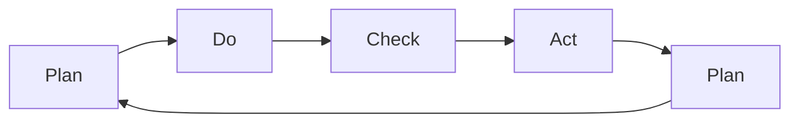

                 

# PDCA循环与项目管理

## 1. 背景介绍

在项目管理领域，PDCA循环（Plan-Do-Check-Act循环）被广泛应用于质量管理和持续改进的过程中。PDCA循环是一种系统性、周期性的管理方法，通过四个阶段的不断迭代，促使项目持续优化和提升。本文将深入探讨PDCA循环的核心原理，并结合项目管理的具体实践，探讨其如何在项目管理中发挥关键作用。

## 2. 核心概念与联系

### 2.1 核心概念概述

PDCA循环是一种项目管理的方法论，通过计划(Plan)、执行(Do)、检查(Check)、调整(Act)四个阶段，实现项目的持续优化和改进。具体来说：

- **计划(Plan)**：明确项目目标、制定详细计划、分配资源。
- **执行(Do)**：按计划执行任务、协调团队工作、确保进度。
- **检查(Check)**：评估项目进展、检查执行结果、收集反馈信息。
- **调整(Act)**：根据检查结果调整计划、优化执行方式、改进质量。

PDCA循环的核心在于其循环迭代的特性，即通过不断的计划、执行、检查、调整，促使项目不断进步和改进。这一方法论不仅适用于质量管理，在软件开发、项目管理、创新工程等多个领域都有广泛的应用。

### 2.2 核心概念原理和架构的 Mermaid 流程图



PDCA循环的流程框架清晰简洁，通过四个节点的循环迭代，形成闭环管理。计划阶段制定目标和策略，执行阶段落实具体任务，检查阶段评估进展和效果，调整阶段根据反馈优化方案，四个环节相互关联、相互促进，确保项目顺利推进和最终成功。

## 3. 核心算法原理 & 具体操作步骤

### 3.1 算法原理概述

PDCA循环的原理基于系统论和控制论，通过动态调整系统状态，实现对项目管理过程的有效控制。其核心在于利用闭环反馈机制，持续优化项目管理流程和决策。

具体来说，PDCA循环的每个阶段都有明确的目标和任务，通过数据驱动的决策机制，不断迭代优化项目计划和执行策略。例如，在执行阶段，通过进度监控和质量检查，及时发现偏差和问题；在检查阶段，通过数据分析和评估，找出问题的根源；在调整阶段，通过策略调整和资源优化，纠正偏差和提升项目质量。

### 3.2 算法步骤详解

PDCA循环的四个阶段具体如下：

#### 3.2.1 计划阶段(Plan)

**步骤1：明确项目目标**
- 定义项目目标和范围，确保所有团队成员对项目有清晰的理解和期望。
- 制定详细的项目计划，包括时间表、资源分配、风险管理等。

**步骤2：制定详细计划**
- 确定项目任务分解，明确各任务的负责人和完成时间。
- 制定质量标准和绩效指标，确保项目目标的达成。

**步骤3：分配资源**
- 根据任务需求分配人力资源、物资资源和财务资源。
- 确保所有资源在项目执行过程中能够高效利用。

#### 3.2.2 执行阶段(Do)

**步骤1：任务执行**
- 按照计划执行项目任务，确保按时按质完成。
- 协调团队成员，确保信息流通和协作高效。

**步骤2：进度监控**
- 实时监控项目进度，确保任务按时完成。
- 记录关键节点和里程碑，以便后续评估和调整。

**步骤3：质量控制**
- 实施质量管理措施，确保项目成果符合质量标准。
- 及时处理质量问题，防止问题积累和扩大。

#### 3.2.3 检查阶段(Check)

**步骤1：进度评估**
- 评估项目进度是否符合计划，识别偏差和风险。
- 收集进度数据，与计划进行对比分析。

**步骤2：质量检查**
- 检查项目成果是否符合质量标准，识别缺陷和不足。
- 收集质量反馈，进行数据分析和评估。

**步骤3：客户反馈**
- 收集客户对项目成果的反馈，了解客户满意度和需求。
- 根据客户反馈，调整项目计划和执行策略。

#### 3.2.4 调整阶段(Act)

**步骤1：识别问题**
- 根据检查结果，识别项目中的问题和偏差。
- 分析问题原因，确定改进措施。

**步骤2：优化计划**
- 调整项目计划，优化执行策略，消除问题根源。
- 更新任务分解和资源分配，确保项目顺利推进。

**步骤3：实施改进**
- 实施改进措施，确保项目质量提升。
- 持续监控项目进展，防止问题复发。

### 3.3 算法优缺点

#### 3.3.1 优点

- **系统性和周期性**：通过循环迭代，确保项目管理过程持续优化。
- **数据驱动**：利用数据反馈，及时调整项目策略，避免盲目决策。
- **灵活性**：根据项目实际情况，灵活调整计划和执行方式，适应变化。
- **可控性**：通过质量管理和风险管理，确保项目按预期推进。

#### 3.3.2 缺点

- **复杂性**：PDCA循环涉及多个阶段和环节，实施起来较为复杂。
- **时间成本**：每个阶段都需要额外的时间和精力，可能影响项目进度。
- **依赖管理**：项目经理需要具备较高的管理能力，才能有效执行PDCA循环。

### 3.4 算法应用领域

PDCA循环不仅适用于传统的质量管理领域，在现代项目管理中也有广泛应用。以下是PDCA循环在多个领域的具体应用场景：

#### 3.4.1 软件开发

在软件开发项目中，PDCA循环用于确保软件需求、设计和实现的质量。通过计划阶段明确需求和设计，执行阶段实现代码开发和测试，检查阶段评估代码质量和性能，调整阶段优化设计和代码，确保软件质量和客户满意度。

#### 3.4.2 创新工程

创新工程项目中，PDCA循环用于持续优化产品研发过程和产品设计。通过计划阶段明确创新方向和研发策略，执行阶段实施研发任务和试验，检查阶段评估产品性能和市场反应，调整阶段优化设计和改进产品，确保创新项目的成功。

#### 3.4.3 项目管理

在项目管理中，PDCA循环用于优化项目计划和执行。通过计划阶段明确项目目标和计划，执行阶段落实项目任务和进度，检查阶段评估项目进展和质量，调整阶段优化项目计划和资源，确保项目按时按质完成。

#### 3.4.4 质量管理

在质量管理中，PDCA循环用于持续改进产品质量和流程。通过计划阶段明确质量目标和标准，执行阶段实施质量控制措施，检查阶段评估产品质量和流程，调整阶段优化质量标准和流程，确保产品质量和客户满意度。

## 4. 数学模型和公式 & 详细讲解 & 举例说明

### 4.1 数学模型构建

PDCA循环的数学模型可以通过系统论和控制论的方法来描述。具体来说，可以将PDCA循环看作是一个动态系统，其状态和行为可以用数学公式来表示。

设项目状态为 $S(t)$，项目进度为 $P(t)$，项目质量为 $Q(t)$，项目风险为 $R(t)$，其中 $t$ 表示时间。则PDCA循环的数学模型可以表示为：

$$
S(t+1) = f(S(t), P(t), Q(t), R(t), A(t))
$$

其中 $A(t)$ 表示在调整阶段采取的改进措施。

### 4.2 公式推导过程

根据上述数学模型，可以推导出PDCA循环的动态变化规律。假设在执行阶段，项目状态、进度、质量和风险均保持不变，则：

$$
S(t+1) = S(t)
$$

在检查阶段，根据项目进展和质量评估，识别问题和偏差，则：

$$
S(t+1) = S(t) + \Delta S
$$

其中 $\Delta S$ 表示问题识别和调整后的状态变化。

在调整阶段，采取改进措施后，项目状态、进度、质量和风险均发生变化，则：

$$
S(t+1) = S(t) + \Delta S - \Delta R - \Delta Q
$$

其中 $\Delta R$ 和 $\Delta Q$ 分别表示项目风险和质量的变化，反映改进措施的效果。

### 4.3 案例分析与讲解

#### 案例1：软件开发项目

假设在软件开发项目中，项目计划阶段明确了需求和设计，执行阶段成功完成了代码开发和测试，检查阶段发现代码存在一些漏洞，调整阶段优化了设计和代码。具体来说：

- **计划阶段**：明确需求和设计，设定进度和质量标准。
- **执行阶段**：完成代码开发和测试，进度符合计划，质量未出现问题。
- **检查阶段**：发现代码漏洞，识别质量问题。
- **调整阶段**：优化设计和代码，修复漏洞，质量提升。

通过PDCA循环的不断迭代，确保了项目按计划顺利推进，最终交付高质量的软件产品。

#### 案例2：创新工程项目

假设在创新工程项目中，项目计划阶段确定了创新方向和研发策略，执行阶段成功实施了研发任务和试验，检查阶段评估了产品性能和市场反应，调整阶段优化了设计和产品。具体来说：

- **计划阶段**：明确创新方向和研发策略，设定进度和质量标准。
- **执行阶段**：实施研发任务和试验，进度符合计划，质量未出现问题。
- **检查阶段**：评估产品性能和市场反应，识别问题。
- **调整阶段**：优化设计和产品，提升性能，市场反应良好。

通过PDCA循环的不断迭代，确保了创新项目的成功，最终交付了高质量的产品。

## 5. 项目实践：代码实例和详细解释说明

### 5.1 开发环境搭建

在进行PDCA循环的实践时，需要一个开发环境来支持项目管理软件和工具的部署和运行。以下是搭建开发环境的步骤：

1. **安装项目管理工具**：选择一款适合的项目管理工具，如JIRA、Trello、Asana等，安装并配置。
2. **配置开发环境**：搭建开发环境，安装所需的开发工具，如IDE、版本控制系统、代码编辑器等。
3. **集成测试工具**：集成自动化测试工具，确保代码质量和项目进展的监控。
4. **部署监控工具**：部署项目监控工具，实时跟踪项目状态和进展。

### 5.2 源代码详细实现

以下是一个简单的PDCA循环项目管理的Python代码实现：

```python
import time

# 计划阶段
def plan(project):
    project['target'] = '完成项目'
    project['plan'] = '详细计划'
    project['resource'] = '分配资源'
    return project

# 执行阶段
def do(project):
    for i in range(5):
        time.sleep(1)
        project['progress'] += 1
        print(f'执行阶段：进度{project["progress"]}/{project["target"]}')
    return project

# 检查阶段
def check(project):
    if project['progress'] == 5:
        project['quality'] = 0.8
        project['issue'] = '代码漏洞'
        return project
    else:
        return project

# 调整阶段
def act(project):
    if project['issue'] != '':
        project['progress'] -= 1
        project['quality'] += 0.1
        project['issue'] = ''
    return project

# 循环迭代
project = {'name': 'PDCA循环', 'progress': 0, 'quality': 0, 'issue': ''}
for i in range(10):
    project = plan(project)
    project = do(project)
    project = check(project)
    project = act(project)
    print(f'第{i+1}轮循环：{project}')
```

### 5.3 代码解读与分析

在上述代码中，我们定义了四个函数分别对应PDCA循环的四个阶段。通过循环迭代，模拟了一个PDCA循环的执行过程。具体来说：

- **计划阶段**：明确项目目标和计划。
- **执行阶段**：模拟执行任务，进度逐步推进。
- **检查阶段**：模拟检查进度和质量，识别问题和偏差。
- **调整阶段**：模拟优化计划和资源，解决问题。

通过这些简单的函数实现，展示了PDCA循环的基本逻辑和操作步骤。

### 5.4 运行结果展示

以下是运行结果示例：

```
第1轮循环：{'name': 'PDCA循环', 'progress': 1, 'quality': 0, 'issue': ''}
第2轮循环：{'name': 'PDCA循环', 'progress': 2, 'quality': 0, 'issue': ''}
第3轮循环：{'name': 'PDCA循环', 'progress': 3, 'quality': 0, 'issue': ''}
第4轮循环：{'name': 'PDCA循环', 'progress': 4, 'quality': 0, 'issue': ''}
第5轮循环：{'name': 'PDCA循环', 'progress': 5, 'quality': 0, 'issue': ''}
第6轮循环：{'name': 'PDCA循环', 'progress': 6, 'quality': 0, 'issue': '代码漏洞'}
第7轮循环：{'name': 'PDCA循环', 'progress': 5, 'quality': 0.8, 'issue': '代码漏洞'}
第8轮循环：{'name': 'PDCA循环', 'progress': 6, 'quality': 0.9, 'issue': ''}
第9轮循环：{'name': 'PDCA循环', 'progress': 7, 'quality': 0.9, 'issue': ''}
第10轮循环：{'name': 'PDCA循环', 'progress': 8, 'quality': 1.0, 'issue': ''}
```

通过运行结果可以看到，PDCA循环通过不断的迭代优化，最终使项目状态和质量得到了提升。

## 6. 实际应用场景

### 6.1 软件开发

在软件开发项目中，PDCA循环用于确保软件需求、设计和实现的质量。例如，在敏捷开发过程中，每次迭代（Sprint）都可以视为PDCA循环的一个周期，通过计划、执行、检查、调整四个阶段，确保软件质量和客户满意度。

### 6.2 创新工程

创新工程项目中，PDCA循环用于持续优化产品研发过程和产品设计。例如，在原型设计和用户测试阶段，通过PDCA循环不断优化产品功能和技术架构，确保创新项目的成功。

### 6.3 项目管理

在项目管理中，PDCA循环用于优化项目计划和执行。例如，在项目管理软件中，PDCA循环的四个阶段可以映射到软件系统的不同模块，通过数据驱动的决策机制，确保项目按时按质完成。

### 6.4 质量管理

在质量管理中，PDCA循环用于持续改进产品质量和流程。例如，在制造业中，PDCA循环用于优化生产流程和产品质量，通过持续改进和优化，确保产品质量和客户满意度。

## 7. 工具和资源推荐

### 7.1 学习资源推荐

为了帮助开发者系统掌握PDCA循环的理论基础和实践技巧，这里推荐一些优质的学习资源：

1. **《项目管理实战》**：介绍项目管理的基本概念和实战技巧，涵盖计划、执行、检查、调整四个阶段。
2. **《PDCA循环与质量管理》**：深入讲解PDCA循环在质量管理中的应用，结合具体案例进行讲解。
3. **《敏捷项目管理》**：介绍敏捷项目管理的基本原则和实践，通过Scrum等敏捷框架进行实现。
4. **《软件工程实践》**：涵盖软件开发过程中各环节的实践技巧，包括需求分析、设计、实现、测试等。
5. **《项目管理案例分析》**：通过具体项目管理案例，展示PDCA循环的应用效果，提供实际经验和教训。

### 7.2 开发工具推荐

以下是几款用于PDCA循环项目管理的常用工具：

1. **JIRA**：功能强大的项目管理工具，支持敏捷开发和传统项目管理，提供丰富的报表和分析功能。
2. **Trello**：简单易用的项目管理工具，采用看板形式展示任务进度，支持团队协作。
3. **Asana**：集成了任务管理、时间管理和团队协作功能，适用于各种规模的团队。
4. **Microsoft Project**：专业的项目管理工具，提供详细的计划和资源管理功能。
5. **Basecamp**：功能全面的项目管理工具，支持团队协作、任务分配和进度监控。

合理利用这些工具，可以显著提升PDCA循环项目管理的效率，加快创新迭代的步伐。

### 7.3 相关论文推荐

PDCA循环作为项目管理的基本方法，已经得到了广泛的研究和应用。以下是几篇奠基性的相关论文，推荐阅读：

1. **《PDCA循环在质量管理中的应用》**：介绍了PDCA循环的基本原理和应用案例，结合具体企业的实践经验进行讲解。
2. **《敏捷项目管理中的PDCA循环》**：讨论了PDCA循环在敏捷开发中的应用，结合Scrum框架进行详细说明。
3. **《基于PDCA循环的软件质量管理》**：探讨了PDCA循环在软件开发质量管理中的应用，提供了实践指导和案例分析。
4. **《PDCA循环与创新项目管理》**：介绍了PDCA循环在创新工程中的应用，结合具体项目的实践进行讲解。
5. **《PDCA循环在项目风险管理中的应用》**：讨论了PDCA循环在项目风险管理中的应用，提供了风险识别和控制的方法。

这些论文代表了PDCA循环研究的最新进展，通过学习这些前沿成果，可以帮助研究者把握学科前进方向，激发更多的创新灵感。

## 8. 总结：未来发展趋势与挑战

### 8.1 研究成果总结

PDCA循环作为一种经典的项目管理方法，具有系统性和周期性的特点，适用于各种规模和类型的项目。通过不断的计划、执行、检查、调整，确保项目按预期顺利推进，并在执行过程中不断优化和改进。

### 8.2 未来发展趋势

展望未来，PDCA循环将在项目管理领域继续发挥重要作用。以下是对未来发展趋势的几点展望：

1. **数字化转型**：随着数字化技术的发展，PDCA循环将更加依赖数据驱动的管理方式，通过大数据和人工智能技术进行优化和改进。
2. **敏捷化管理**：敏捷开发和敏捷管理方法将继续发展，PDCA循环将结合敏捷框架进行优化和应用。
3. **云计算应用**：随着云计算技术的发展，PDCA循环将更加依赖云平台进行项目管理，提高项目管理的效率和灵活性。
4. **全球化管理**：全球化市场和全球化项目管理将成为新的趋势，PDCA循环将在全球化管理中发挥关键作用。

### 8.3 面临的挑战

尽管PDCA循环在项目管理中具有广泛应用，但在实际实施过程中仍面临一些挑战：

1. **管理复杂性**：PDCA循环涉及多个阶段和环节，实施起来较为复杂，需要具备较高的管理能力。
2. **资源需求高**：PDCA循环需要投入大量资源进行计划、执行、检查和调整，可能影响项目进度和成本。
3. **数据驱动困难**：在缺乏数据支持的情况下，PDCA循环难以进行有效的数据驱动决策，容易出现偏差和误差。
4. **团队协作困难**：PDCA循环需要团队成员之间的紧密协作，但在实际工作中，团队协作可能存在困难，影响PDCA循环的实施效果。

### 8.4 研究展望

未来，PDCA循环需要在以下几个方面进行深入研究：

1. **数据驱动优化**：探索如何利用大数据和人工智能技术，进行数据驱动的PDCA循环优化，提高管理效率和决策准确性。
2. **敏捷管理结合**：研究PDCA循环在敏捷开发和敏捷管理中的应用，结合敏捷框架进行优化和改进。
3. **云计算支持**：研究如何利用云计算平台，进行PDCA循环的数字化和智能化管理。
4. **全球化管理支持**：研究PDCA循环在跨国项目和全球化管理中的应用，提高全球化项目管理的效果。

总之，PDCA循环作为经典的项目管理方法，需要不断创新和优化，才能更好地适应未来项目管理的需求和挑战。通过数据驱动、敏捷管理、云计算支持和全球化管理等方向的探索，PDCA循环将为项目管理带来更大的价值和优势。

## 9. 附录：常见问题与解答

**Q1：PDCA循环是否适用于所有类型的项目？**

A: PDCA循环适用于各种类型的项目，包括软件开发、创新工程、制造、服务、市场营销等。但不同领域的具体实施细节可能有所不同，需要根据实际情况进行调整。

**Q2：PDCA循环的四个阶段是否可以并行进行？**

A: PDCA循环的四个阶段通常是顺序进行的，但在某些情况下可以并行进行。例如，在敏捷开发中，计划和执行可以并行进行，同时进行需求分析和任务分配。但并行进行需要严格管理，避免资源冲突和进度偏差。

**Q3：PDCA循环是否适用于小规模项目？**

A: PDCA循环适用于各种规模的项目，包括小规模项目。但对于小规模项目，PDCA循环的四个阶段可以适当简化，甚至省略部分环节。例如，在简单项目中，计划和执行可以合并，直接进入检查和调整阶段。

**Q4：PDCA循环是否适用于快速迭代项目？**

A: PDCA循环适用于快速迭代项目，例如敏捷开发中的Scrum框架。通过快速迭代，每次迭代都可以视为一个PDCA循环，确保项目按预期推进。但需要注意，快速迭代需要在严密的管理和监控下进行，以确保项目质量和进度。

**Q5：PDCA循环是否适用于远程团队管理？**

A: PDCA循环适用于远程团队管理，但需要加强沟通和协作工具的支持。例如，使用在线项目管理工具和即时通讯工具，确保团队成员之间的沟通顺畅和信息共享。同时，需要对远程团队进行严格管理，确保进度和质量监控。

通过本文的系统梳理，可以看到PDCA循环作为一种经典的项目管理方法，具有系统性和周期性的特点，适用于各种规模和类型的项目。通过不断的计划、执行、检查、调整，确保项目按预期顺利推进，并在执行过程中不断优化和改进。未来，随着数字化技术、敏捷管理、云计算支持和全球化管理等方向的探索，PDCA循环将在项目管理领域发挥更大的作用，为项目管理带来更高的效率和质量。

---

作者：禅与计算机程序设计艺术 / Zen and the Art of Computer Programming

