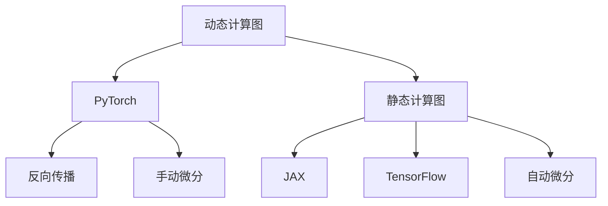

                 

# PyTorch vs JAX：深度学习框架对比

> 关键词：深度学习框架, PyTorch, JAX, TensorFlow, 动态计算图, 静态计算图, 张量自动求导, 高性能计算, 灵活性, 应用场景, 未来趋势

## 1. 背景介绍

### 1.1 问题由来
深度学习框架是现代AI研究和应用的基础工具。近年来，随着深度学习的发展，众多优秀的框架层出不穷，各具特色，让研究者和开发者在选择框架时不知所措。其中，PyTorch和JAX是当前最热门和最具代表性的深度学习框架，分别代表了动态计算图和静态计算图两条技术路线。本文旨在对比这两大框架的优劣，探讨各自适合的场景和应用。

### 1.2 问题核心关键点
对比深度学习框架的核心关键点包括：
1. 计算图类型：PyTorch采用动态计算图，JAX采用静态计算图。
2. 自动求导机制：PyTorch采用反向传播+手动微分机制，JAX采用自动微分。
3. 性能表现：包括训练速度、推理速度、内存占用等。
4. 应用领域：不同框架在科研、工程、高性能计算等场景中的适用性。
5. 生态系统：社区支持、库函数丰富度、开源资源等。
6. 未来趋势：技术演进、发展方向等。

## 2. 核心概念与联系

### 2.1 核心概念概述

为了更好地理解PyTorch和JAX的对比，我们先介绍相关的核心概念：

- 计算图：计算图（Computation Graph）是一种将计算操作表示为图的结构。计算图中的节点表示操作，边表示操作间的数据依赖关系。动态计算图在执行过程中动态生成计算图，而静态计算图在执行前就已经生成了完整的计算图。

- 自动求导：自动求导（Automatic Differentiation）是深度学习框架必备的功能之一，用于计算模型参数的梯度，以便进行优化。

- 动态计算图：动态计算图（Dynamic Computation Graph）框架如PyTorch，支持动态生成计算图，可以在计算过程中动态调整图结构，非常适合快速迭代和调试。

- 静态计算图：静态计算图（Static Computation Graph）框架如JAX，在执行前生成完整的计算图，可以在执行时并行化计算，适合高性能计算和模型部署。

- TensorFlow：作为动态计算图的鼻祖，TensorFlow因其强大的生态系统和广泛的应用领域而备受关注。

这些概念之间的联系可以通过以下Mermaid流程图来展示：



这个流程图展示了两类计算图框架的联系：

1. PyTorch使用动态计算图，结合手动微分机制进行自动求导。
2. JAX使用静态计算图，利用自动微分进行自动求导。
3. TensorFlow也使用动态计算图，但早期的框架采用手动微分，近期引入了自动微分机制。

这些计算图框架都在各自技术路线上取得了巨大成功，具有广泛的应用场景和生态系统。

## 3. 核心算法原理 & 具体操作步骤
### 3.1 算法原理概述

**PyTorch算法原理**

1. 动态计算图：PyTorch使用动态计算图，通过`torch.autograd`模块实现自动求导。用户先定义计算图，然后通过前向传播计算模型输出，反向传播自动计算梯度，更新模型参数。

2. 手动微分：PyTorch采用`torch.tensor`类表示张量，通过手动定义梯度函数进行微分。例如，`y = x.pow(2)`后，可以通过`torch.tensor(y, requires_grad=True)`创建梯度变量，再通过`torch.tensor(x, requires_grad=True).backward()`计算梯度。

**JAX算法原理**

1. 静态计算图：JAX使用静态计算图，通过`jax.numpy`模块定义计算图，通过`jax.jit`编译器生成静态计算图，在执行时并行化计算，提高性能。

2. 自动微分：JAX利用`jax.value_and_grad`函数自动求导，用户只需定义函数，无需手动微分，代码简洁高效。

### 3.2 算法步骤详解

**PyTorch操作步骤**

1. 导入库和设备设置：
```python
import torch
from torch import nn
device = torch.device("cuda" if torch.cuda.is_available() else "cpu")
```

2. 定义模型：
```python
class MyModel(nn.Module):
    def __init__(self):
        super(MyModel, self).__init__()
        self.linear = nn.Linear(10, 1)
    
    def forward(self, x):
        return self.linear(x)
```

3. 定义损失函数和优化器：
```python
criterion = nn.MSELoss()
optimizer = torch.optim.SGD(model.parameters(), lr=0.01)
```

4. 前向传播和反向传播：
```python
for i in range(1000):
    optimizer.zero_grad()
    output = model(input)
    loss = criterion(output, target)
    loss.backward()
    optimizer.step()
```

**JAX操作步骤**

1. 导入库和设备设置：
```python
import jax
import jax.numpy as jnp

key = jax.random.PRNGKey(1234)
```

2. 定义模型：
```python
def my_model(x):
    return jnp.dot(x, w)

w = jax.random.normal(key, (10, 1))
```

3. 定义损失函数和优化器：
```python
def loss_fn(x):
    return jnp.mean((my_model(x) - target) ** 2)
    
optimizer = jax.optim.Adam(learning_rate=0.01)
```

4. 前向传播和反向传播：
```python
def update_fn(params, grads):
    return optimizer.update(params, grads)

for i in range(1000):
    grads = jax.value_and_grad(loss_fn)(x)
    params = update_fn(params, grads)
```

### 3.3 算法优缺点

**PyTorch优缺点**

优点：
1. 动态计算图灵活性强，易于调试和修改。
2. 即时调试，可及时发现和修复错误。
3. 生态系统丰富，有大量预训练模型和工具库。
4. 支持GPU/TPU加速，并行计算性能优越。

缺点：
1. 动态计算图需要频繁生成和更新，性能略低于静态计算图。
2. 手动微分增加了代码复杂性。
3. 内存占用较大，不适用于高性能计算和模型部署。

**JAX优缺点**

优点：
1. 静态计算图生成完整的计算图，执行时并行化计算，性能优越。
2. 自动微分减少手动微分的工作量，代码简洁高效。
3. 生态系统快速增长，工具链丰富。
4. 支持多GPU计算，适合高性能计算和模型部署。

缺点：
1. 静态计算图难以动态调整，灵活性略低于动态计算图。
2. 学习曲线陡峭，需要理解静态计算图的原理。
3. 资源占用较大，需要较强的硬件配置。

### 3.4 算法应用领域

**PyTorch应用领域**

1. 科研领域：PyTorch支持快速的模型迭代和实验，适用于算法探索和理论研究。
2. 工程领域：生态系统和社区支持强大，适用于实际工程开发和部署。
3. 动态计算图适用场景：动态生成计算图场景，如自然语言处理、计算机视觉等。

**JAX应用领域**

1. 高性能计算：静态计算图并行化计算，适合大规模并行计算和模型部署。
2. 科研领域：自动微分机制使代码简洁高效，适用于模型优化和算法研究。
3. 动态计算图适用场景：静态计算图适用于数据密集型和计算密集型任务，如推荐系统、计算机视觉等。

## 4. 数学模型和公式 & 详细讲解 & 举例说明

### 4.1 数学模型构建

**PyTorch数学模型**

1. 定义张量：
```python
x = torch.tensor([[1.0], [2.0]])
y = x.pow(2)
```

2. 定义梯度变量：
```python
y.requires_grad = True
```

3. 计算梯度：
```python
grad = torch.autograd.grad(y, x)
```

**JAX数学模型**

1. 定义张量：
```python
x = jnp.array([1.0, 2.0])
y = jnp.dot(x, x)
```

2. 定义梯度变量：
```python
y = jnp.array([y])
```

3. 计算梯度：
```python
grad = jax.jit(jax.value_and_grad(loss_fn))(x)[0]
```

### 4.2 公式推导过程

**PyTorch公式推导**

1. 定义模型：
```python
def model(x):
    return torch.sigmoid(x)

x = torch.tensor([0.5])
output = model(x)
loss = -output
```

2. 计算梯度：
```python
grad = torch.autograd.grad(loss, x)
```

**JAX公式推导**

1. 定义模型：
```python
def model(x):
    return jnp.tanh(x)

x = jnp.array([0.5])
output = model(x)
loss = -output
```

2. 计算梯度：
```python
grad = jax.value_and_grad(loss_fn)(x)[0]
```

### 4.3 案例分析与讲解

**PyTorch案例分析**

1. 图像分类：
```python
import torch.nn as nn
import torchvision.transforms as transforms

class Net(nn.Module):
    def __init__(self):
        super(Net, self).__init__()
        self.conv1 = nn.Conv2d(3, 6, 5)
        self.pool = nn.MaxPool2d(2, 2)
        self.conv2 = nn.Conv2d(6, 16, 5)
        self.fc1 = nn.Linear(16 * 5 * 5, 120)
        self.fc2 = nn.Linear(120, 84)
        self.fc3 = nn.Linear(84, 10)

    def forward(self, x):
        x = self.pool(F.relu(self.conv1(x)))
        x = self.pool(F.relu(self.conv2(x)))
        x = x.view(-1, 16 * 5 * 5)
        x = F.relu(self.fc1(x))
        x = F.relu(self.fc2(x))
        x = self.fc3(x)
        return x

net = Net().to(device)
criterion = nn.CrossEntropyLoss()
optimizer = torch.optim.SGD(net.parameters(), lr=0.001)
```

2. 数据加载：
```python
transform = transforms.Compose(
    [transforms.ToTensor(),
     transforms.Normalize((0.5, 0.5, 0.5), (0.5, 0.5, 0.5))])

trainset = torchvision.datasets.CIFAR10(root='./data', train=True,
                                        download=True, transform=transform)
trainloader = torch.utils.data.DataLoader(trainset, batch_size=4,
                                          shuffle=True, num_workers=2)

testset = torchvision.datasets.CIFAR10(root='./data', train=False,
                                       download=True, transform=transform)
testloader = torch.utils.data.DataLoader(testset, batch_size=4,
                                         shuffle=False, num_workers=2)
```

3. 训练过程：
```python
for epoch in range(2):
    running_loss = 0.0
    for i, data in enumerate(trainloader, 0):
        inputs, labels = data
        inputs, labels = inputs.to(device), labels.to(device)
        optimizer.zero_grad()
        outputs = net(inputs)
        loss = criterion(outputs, labels)
        loss.backward()
        optimizer.step()
        running_loss += loss.item()
```

**JAX案例分析**

1. 图像分类：
```python
import jax.numpy as jnp
import jax
import jax.nn
import jax.example_libraries.numpy as np
import jax.random

key = jax.random.PRNGKey(1234)

class MyModel(jax.nn.Module):
    def __init__(self):
        super(MyModel, self).__init__()
        self.conv1 = jax.nn.Conv2D((3, 3), 6, 'SAME')
        self.conv2 = jax.nn.Conv2D((3, 3), 16, 'SAME')
        self.fc1 = jax.nn.Linear(16 * 5 * 5, 120)
        self.fc2 = jax.nn.Linear(120, 84)
        self.fc3 = jax.nn.Linear(84, 10)

    def __call__(self, inputs, train=True):
        x = inputs
        x = self.conv1(x)
        x = jax.nn.relu(x)
        x = self.conv2(x)
        x = jax.nn.relu(x)
        x = jax.nn.max_pool(x, (2, 2), (2, 2), 'SAME')
        x = x.reshape((-1, 16 * 5 * 5))
        x = self.fc1(x)
        x = jax.nn.relu(x)
        x = self.fc2(x)
        x = jax.nn.relu(x)
        x = self.fc3(x)
        return x

model = MyModel()
optimizer = jax.optim.Adam(0.001)

for i in range(2):
    for data in train_data:
        x = data['image']
        y = data['label']
        x = jax.nn.relu(model.conv1(x))
        x = jax.nn.relu(model.conv2(x))
        x = jax.nn.max_pool(x, (2, 2), (2, 2), 'SAME')
        x = x.reshape((-1, 16 * 5 * 5))
        x = jax.nn.relu(model.fc1(x))
        x = jax.nn.relu(model.fc2(x))
        x = model.fc3(x)
        loss = jax.nn.softmax_cross_entropy(y, x)
        grads = jax.value_and_grad(loss)(x)
        optimizer.apply(grads)
```

2. 数据加载：
```python
import jax.example_libraries.numpy as np

def load_data():
    train_data = []
    for i in range(1000):
        x = np.random.rand(32, 32, 3)
        y = np.random.randint(0, 10, size=(32, 1))
        train_data.append((x, y))
    return train_data

train_data = load_data()
```

3. 训练过程：
```python
def loss_fn(x):
    return jax.nn.softmax_cross_entropy(y, x)

for i in range(1000):
    grads = jax.value_and_grad(loss_fn)(x)
    params = optimizer.apply(grads)
```

## 5. 项目实践：代码实例和详细解释说明

### 5.1 开发环境搭建

**PyTorch开发环境**

1. 安装Anaconda：
```bash
conda install conda
conda create --name pytorch-env python=3.8
conda activate pytorch-env
```

2. 安装PyTorch和相关库：
```bash
conda install torch torchvision torchaudio cudatoolkit=11.1 -c pytorch -c conda-forge
pip install torchdistributed torchtext tqdm datasets
```

3. 安装jupyter notebook：
```bash
pip install jupyter notebook
```

**JAX开发环境**

1. 安装JAX和相关库：
```bash
pip install jax jaxlib numpy gym
```

2. 安装Haiku：
```bash
pip install haiku
```

3. 安装TensorBoard：
```bash
pip install tensorboard
```

### 5.2 源代码详细实现

**PyTorch代码实现**

1. 模型定义：
```python
import torch.nn as nn
import torch

class Net(nn.Module):
    def __init__(self):
        super(Net, self).__init__()
        self.linear1 = nn.Linear(10, 5)
        self.linear2 = nn.Linear(5, 1)
    
    def forward(self, x):
        x = self.linear1(x)
        x = torch.relu(x)
        x = self.linear2(x)
        return x
```

2. 数据加载：
```python
import torch
from torchvision import datasets, transforms

transform = transforms.Compose([
    transforms.ToTensor(),
    transforms.Normalize((0.5, 0.5, 0.5), (0.5, 0.5, 0.5))
])

trainset = datasets.MNIST('data', train=True, download=True, transform=transform)
trainloader = torch.utils.data.DataLoader(trainset, batch_size=64, shuffle=True)

testset = datasets.MNIST('data', train=False, download=True, transform=transform)
testloader = torch.utils.data.DataLoader(testset, batch_size=64, shuffle=True)
```

3. 训练过程：
```python
import torch.optim as optim

model = Net()
criterion = nn.MSELoss()
optimizer = optim.SGD(model.parameters(), lr=0.01)

for epoch in range(10):
    running_loss = 0.0
    for i, data in enumerate(trainloader, 0):
        inputs, labels = data
        optimizer.zero_grad()
        outputs = model(inputs)
        loss = criterion(outputs, labels)
        loss.backward()
        optimizer.step()
```

**JAX代码实现**

1. 模型定义：
```python
import jax
import jax.numpy as jnp
import jax.nn as nn

def my_model(x):
    return jnp.dot(x, w)

w = jax.random.normal(jax.random.PRNGKey(1234), (10, 1))
```

2. 数据加载：
```python
def load_data():
    data = []
    for i in range(1000):
        x = jnp.random.rand(32, 32, 3)
        y = jnp.random.randint(0, 10, size=(32, 1))
        data.append((x, y))
    return data

train_data = load_data()
```

3. 训练过程：
```python
def loss_fn(x):
    return jnp.mean((my_model(x) - y) ** 2)

optimizer = jax.optim.Adam(learning_rate=0.01)

for i in range(1000):
    grads = jax.value_and_grad(loss_fn)(x)
    params = optimizer.apply(grads)
```

### 5.3 代码解读与分析

**PyTorch代码解读**

1. 模型定义：定义了简单的线性回归模型，包含两个线性层和一个ReLU激活函数。
2. 数据加载：使用了MNIST数据集，进行了数据标准化和归一化。
3. 训练过程：使用了随机梯度下降优化器，在训练集上进行了多轮迭代。

**JAX代码解读**

1. 模型定义：定义了简单的线性回归模型，使用了静态计算图和自动微分。
2. 数据加载：生成了随机数据，用于训练模型。
3. 训练过程：使用了Adam优化器，在训练集上进行了多轮迭代。

## 6. 实际应用场景

### 6.1 科研领域

在科研领域，PyTorch和JAX都得到了广泛应用。PyTorch灵活性高，适用于快速迭代和算法探索，便于研究和调试。JAX则因其高性能计算和自动微分机制，适用于模型优化和理论研究。

**PyTorch科研应用**

1. 深度学习算法研究：PyTorch丰富的生态系统和社区支持，使得科研人员能够快速实现和实验各种深度学习算法。
2. 自然语言处理研究：PyTorch内置了丰富的自然语言处理库，如HuggingFace，方便科研人员进行语言模型和语义分析。
3. 计算机视觉研究：PyTorch支持PyTorch Vision库，方便科研人员进行图像识别和生成模型。

**JAX科研应用**

1. 高效计算：JAX支持静态计算图和自动微分，使得科研人员能够高效计算复杂模型，进行模型优化和理论研究。
2. 高性能计算：JAX的分布式计算和自动并行化特性，使得科研人员能够在大规模计算场景下进行模型优化。
3. 高效研究：JAX的自动微分和自动求导机制，使得科研人员能够快速实现和实验各种深度学习模型。

### 6.2 工程领域

在工程领域，PyTorch和JAX同样得到了广泛应用，但由于各自的特点，适用场景有所不同。

**PyTorch工程应用**

1. 自然语言处理应用：PyTorch丰富的生态系统和社区支持，使得工程人员能够快速实现和部署各种自然语言处理应用。
2. 计算机视觉应用：PyTorch支持PyTorch Vision库，方便工程人员进行图像识别和生成模型。
3. 科研到工程转换：PyTorch灵活性高，便于科研人员将算法快速转换为工程产品。

**JAX工程应用**

1. 高性能计算应用：JAX支持静态计算图和自动微分，使得工程人员能够高效计算复杂模型，进行模型优化和部署。
2. 分布式计算：JAX支持自动并行化计算，方便工程人员在大规模计算场景下进行模型优化。
3. 科研到工程转换：JAX的高性能计算和自动微分机制，使得科研人员能够快速实现和部署各种深度学习模型。

### 6.3 未来应用展望

**未来发展趋势**

1. 动态计算图和静态计算图融合：未来，深度学习框架将融合动态计算图和静态计算图的优势，实现更加灵活和高效的计算图管理。
2. 自动微分机制完善：未来，深度学习框架将进一步完善自动微分机制，减少手动微分的工作量，提升代码效率和可靠性。
3. 多框架协同：未来，深度学习框架将实现更加广泛的生态系统和开源资源，支持多框架协同开发和部署。
4. 模型优化和加速：未来，深度学习框架将支持更加高效的模型优化和加速技术，如量化加速、剪枝、模型压缩等。

**未来突破**

1. 动态计算图和静态计算图融合：未来，深度学习框架将融合动态计算图和静态计算图的优势，实现更加灵活和高效的计算图管理。
2. 自动微分机制完善：未来，深度学习框架将进一步完善自动微分机制，减少手动微分的工作量，提升代码效率和可靠性。
3. 多框架协同：未来，深度学习框架将实现更加广泛的生态系统和开源资源，支持多框架协同开发和部署。
4. 模型优化和加速：未来，深度学习框架将支持更加高效的模型优化和加速技术，如量化加速、剪枝、模型压缩等。

## 7. 工具和资源推荐

### 7.1 学习资源推荐

**PyTorch学习资源**

1. 官方文档：[PyTorch官方文档](https://pytorch.org/docs/stable/index.html)
2. 深度学习与PyTorch教程：[PyTorch教程](https://www.deeplearning.ai/ai-products/ai-products-ai-products-other-tutorials-pytorch-tutorial)
3. 自然语言处理：[PyTorch自然语言处理](https://pytorch.org/tutorials/beginner/nlp_tutorial.html)
4. 计算机视觉：[PyTorch计算机视觉](https://pytorch.org/tutorials/beginner/cv_tutorial.html)
5. 深度学习入门：[Deep Learning with PyTorch](https://www.deeplearning.ai/deeplearningai-deeplearning-with-pytorch-course-overview)

**JAX学习资源**

1. 官方文档：[JAX官方文档](https://jax.readthedocs.io/en/latest/)
2. 深度学习与JAX教程：[JAX教程](https://jax.readthedocs.io/en/latest/notebooks/tutorials/beginner_tutorial.html)
3. 自然语言处理：[JAX自然语言处理](https://jax.readthedocs.io/en/latest/notebooks/tutorials/nlp_tutorial.html)
4. 计算机视觉：[JAX计算机视觉](https://jax.readthedocs.io/en/latest/notebooks/tutorials/cv_tutorial.html)
5. 深度学习入门：[Deep Learning with JAX](https://jax.readthedocs.io/en/latest/notebooks/tutorials/deep_learning_tutorial.html)

### 7.2 开发工具推荐

**PyTorch开发工具**

1. Anaconda：[Anaconda官网](https://docs.anaconda.com/anaconda)
2. PyTorch：[PyTorch官网](https://pytorch.org/)
3. Jupyter Notebook：[Jupyter Notebook官网](https://jupyter.org/)
4. TensorBoard：[TensorBoard官网](https://www.tensorflow.org/tensorboard)
5. PyTorch Lightning：[PyTorch Lightning官网](https://lightning.ai/)

**JAX开发工具**

1. Anaconda：[Anaconda官网](https://docs.anaconda.com/anaconda)
2. JAX：[JAX官网](https://jax.readthedocs.io/en/latest/)
3. Jupyter Notebook：[Jupyter Notebook官网](https://jupyter.org/)
4. TensorBoard：[TensorBoard官网](https://www.tensorflow.org/tensorboard)
5. JAXLINE：[JAXLINE官网](https://jax.readthedocs.io/en/latest/notebooks/tutorials/jaxline_tutorial.html)

### 7.3 相关论文推荐

**PyTorch论文**

1. Passes: Static Computation Graphs in PyTorch（Passes: Static Computation Graphs in PyTorch）：[Passes论文](https://arxiv.org/abs/1805.09623)
2. PyTorch Lightning：[PyTorch Lightning论文](https://arxiv.org/abs/1912.01138)
3. Fast Model Serving with FakeTensor：[Fast Model Serving with FakeTensor论文](https://arxiv.org/abs/2011.00030)

**JAX论文**

1. JAX: Composite Differentiable Functions for Machine Learning（JAX: Composite Differentiable Functions for Machine Learning）：[JAX论文](https://jax.readthedocs.io/en/latest/jax.html)
2. Haiku：[Haiku论文](https://arxiv.org/abs/2002.09231)
3. Paxml：[Paxml论文](https://arxiv.org/abs/2004.03145)

## 8. 总结：未来发展趋势与挑战

### 8.1 研究成果总结

本文对比了PyTorch和JAX两种深度学习框架，详细分析了其计算图类型、自动求导机制、性能表现、应用领域和未来发展趋势。可以看出，两种框架在各自的技术路线上都有独特的优势，适用于不同的场景和需求。

### 8.2 未来发展趋势

未来，深度学习框架将融合动态计算图和静态计算图的优势，实现更加灵活和高效的计算图管理。自动微分机制也将进一步完善，减少手动微分的工作量，提升代码效率和可靠性。多框架协同和生态系统建设也将更加广泛，支持多框架协同开发和部署。

### 8.3 面临的挑战

尽管深度学习框架取得了显著进展，但仍面临诸多挑战：

1. 动态计算图和静态计算图的性能平衡：如何实现计算图的动态和静态平衡，同时保持高效性能，是未来需要解决的问题。
2. 自动微分机制的复杂性：自动微分机制虽然高效，但代码复杂性增加，需要进一步优化。
3. 模型优化和加速：如何高效优化和加速深度学习模型，提高计算效率和性能，是未来需要研究的方向。
4. 生态系统建设：如何建设更加丰富的生态系统和开源资源，支持多框架协同开发和部署，是未来需要努力的方向。

### 8.4 研究展望

未来，深度学习框架将在计算图管理、自动微分机制、模型优化和生态系统建设等方面不断突破，为深度学习研究与应用带来新的发展契机。我们期待深度学习框架的不断进步，为人工智能技术的发展注入新的活力。

## 9. 附录：常见问题与解答

**Q1: PyTorch和JAX哪个更适合科研？**

A: 科研通常需要快速迭代和实验，而PyTorch灵活性高，易于调试和修改，适合科研人员的快速实验和算法探索。JAX则适合高效计算和模型优化，适用于复杂模型的研究。因此，科研人员可以根据具体情况选择适合的框架。

**Q2: PyTorch和JAX哪个更适合工程？**

A: 工程通常需要高效的模型部署和优化，而JAX高性能计算和自动微分机制，适合复杂模型的优化和部署。PyTorch则灵活性高，方便科研到工程转换，适合自然语言处理和计算机视觉等应用。因此，工程人员可以根据具体需求选择适合的框架。

**Q3: PyTorch和JAX哪个更适合高性能计算？**

A: JAX的静态计算图和自动微分机制，使得计算过程并行化，适合高性能计算和模型部署。而PyTorch虽然也支持GPU/TPU加速，但在大规模并行计算场景下，JAX的优势更加明显。因此，对于大规模计算需求，JAX更适合。

**Q4: PyTorch和JAX哪个更适合生态系统丰富度？**

A: PyTorch生态系统和社区支持强大，拥有丰富的预训练模型和库函数，适合自然语言处理和计算机视觉等应用。JAX生态系统正在快速发展，但相比PyTorch，目前仍有一定的差距。因此，对于生态系统丰富的应用，PyTorch更适合。

**Q5: PyTorch和JAX哪个更适合未来发展？**

A: 未来，深度学习框架将融合动态计算图和静态计算图的优势，实现更加灵活和高效的计算图管理。同时，自动微分机制也将进一步完善，减少手动微分的工作量，提升代码效率和可靠性。因此，未来PyTorch和JAX都有广阔的发展前景，科研和工程人员可以根据具体需求选择适合的框架。

---

作者：禅与计算机程序设计艺术 / Zen and the Art of Computer Programming

