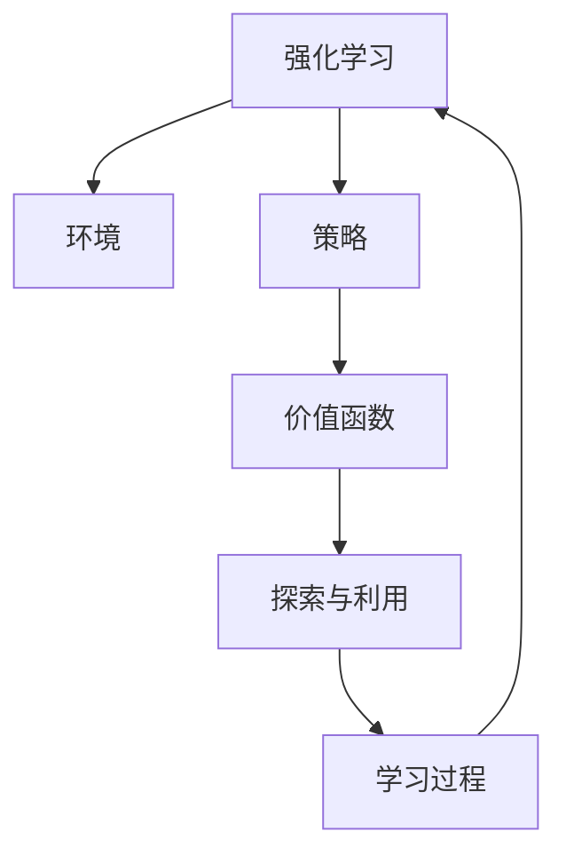

                 

# RL 在游戏和机器人中的应用

在人工智能的诸多应用场景中，强化学习(Reinforcement Learning, RL)因其在动态复杂环境下的智能决策能力而独树一帜。本文将深入探讨RL在游戏和机器人中的应用，通过系统介绍核心概念、算法原理与操作步骤，分析其优势与挑战，展望未来发展趋势，为读者提供全方位的技术见解。

## 1. 背景介绍

### 1.1 问题由来

随着人工智能技术的不断进步，强化学习在游戏和机器人领域的应用愈发广泛。在游戏领域，智能游戏AI可以通过与玩家的互动不断学习最优策略，提高游戏体验和公平性。在机器人领域，强化学习驱动的自主导航、智能控制等技术，使机器人能够适应复杂多变的环境，完成高难度任务。

### 1.2 问题核心关键点

强化学习是一种基于奖励反馈的机器学习技术，旨在通过与环境的交互，学习到最优的决策策略。其核心在于设计奖励函数、构建策略、进行交互和迭代优化。强化学习的应用，离不开对环境的建模、对策略的探索和优化，以及如何衡量策略的表现。

## 2. 核心概念与联系

### 2.1 核心概念概述

为更好地理解强化学习在游戏和机器人中的应用，本节将介绍几个关键概念：

- 强化学习(Reinforcement Learning, RL)：通过与环境的互动，利用奖励信号驱动学习，优化决策策略。常见的学习算法包括Q-learning、Policy Gradient、Actor-Critic等。

- 环境(Environment)：强化学习系统与外部世界的交互界面，可以是虚拟游戏环境，也可以是物理机器人所处的真实世界。环境提供状态、奖励、可执行动作等，是学习过程的基础。

- 策略(Policy)：指导智能体进行选择的决策规则，可以是动作选择策略、价值函数评估策略等。策略的优化目标是最大化长期累积奖励。

- 价值函数(Value Function)：用于评估当前状态或动作的价值，是优化策略的重要工具。常见的价值函数包括状态值函数、动作值函数等。

- 探索(Exploration)与利用(Exploitation)：在搜索最优策略时，需要在探索未知领域和利用已知经验之间找到平衡。过度的探索会导致效率低下，而过度的利用则可能陷入局部最优解。

这些概念之间的逻辑关系可以通过以下Mermaid流程图来展示：



这个流程图展示了这个学习范式的关键步骤：通过与环境的互动，利用奖励反馈进行学习，优化决策策略。探索和利用是平衡的两个重要维度，共同构成整个学习过程。

## 3. 核心算法原理 & 具体操作步骤

### 3.1 算法原理概述

强化学习算法大致分为两类：基于值函数的方法（如Q-learning、SARSA、Deep Q-Networks等）和基于策略的方法（如Policy Gradient、Trust Region Policy Optimization、Actor-Critic等）。

基于值函数的算法通过构建状态值函数或动作值函数，学习每个状态或动作的预期价值，进而指导策略选择。这类算法适用于环境状态可观测、动作空间有限的情况，但需要平衡探索和利用之间的关系。

基于策略的算法则直接优化策略本身，通过调整策略参数，提高决策效率和效果。这类算法适用于连续动作空间或复杂环境，但需要处理策略优化过程中的非凸性和多目标优化问题。

### 3.2 算法步骤详解

以Q-learning算法为例，其基本步骤如下：

1. **初始化**：随机初始化Q值表，设定学习率 $\alpha$ 和折扣因子 $\gamma$。
2. **状态-动作-奖励循环**：在每个时间步，选择动作并观察状态和奖励，更新Q值。
3. **策略优化**：根据当前Q值表，选择最优动作。
4. **策略评估**：通过多轮迭代，使策略逐步逼近最优策略。

### 3.3 算法优缺点

强化学习的优点包括：

- 适应性强：能够在无标签数据环境下，通过与环境的互动不断学习。
- 灵活性高：可以用于解决各种决策优化问题，应用范围广泛。
- 动态调整：在环境动态变化时，能够实时优化策略。

然而，强化学习也存在一些局限性：

- 学习效率低：需要大量的交互数据，学习过程可能漫长且困难。
- 策略优化困难：复杂环境中，策略优化存在多目标和局部最优问题。
- 过拟合风险：过度的探索可能造成资源浪费，过度的利用可能陷入局部最优解。

### 3.4 算法应用领域

强化学习在游戏和机器人领域有着广泛的应用：

- 游戏AI：通过与玩家的互动，学习最优策略，实现智能博弈。
- 机器人控制：通过与环境的互动，学习导航、路径规划、避障等自主决策能力。
- 机器人运动控制：通过与机械系统、控制器的互动，实现精确的机械臂运动、无人机飞行等。
- 自然语言处理：通过与语言模型的互动，学习生成语言、对话等任务。

## 4. 数学模型和公式 & 详细讲解

### 4.1 数学模型构建

强化学习的数学模型可以表示为：

- 状态集合：$S$，环境的当前状态。
- 动作集合：$A$，智能体可以执行的动作。
- 状态-动作对集合：$S \times A$，环境的状态-动作对。
- 奖励函数：$R(s,a)$，当前状态-动作对的奖励。
- 状态转移概率：$P(s'|s,a)$，在当前状态$(s,a)$下，下一个状态$s'$的概率分布。

强化学习的目标是最优化策略$\pi$，使得长期累积奖励最大化：

$$
\max_{\pi} \mathbb{E}_{\pi} \left[\sum_{t=0}^{\infty} \gamma^t R(s_t,a_t)\right]
$$

其中，$\gamma$为折扣因子，$0 \leq \gamma < 1$。

### 4.2 公式推导过程

以Q-learning算法为例，其更新公式如下：

$$
Q(s_t,a_t) \leftarrow Q(s_t,a_t) + \alpha(R_{t+1} + \gamma \max_{a_{t+1}} Q(s_{t+1},a_{t+1}) - Q(s_t,a_t))
$$

该公式展示了在每个时间步$t$，根据当前的Q值和未来奖励，更新状态-动作对的Q值。

### 4.3 案例分析与讲解

以Atari 2600游戏为例，展示强化学习在游戏AI中的应用。在Pong、Breakout等游戏中，智能体通过与游戏的互动，学习到最优策略，获得比人类玩家更高的得分。在训练过程中，智能体使用Q-learning算法，通过不断的试错和调整，逐渐优化策略，提高游戏表现。

## 5. 项目实践：代码实例和详细解释说明

### 5.1 开发环境搭建

在进行RL项目开发前，我们需要准备好开发环境。以下是使用Python进行OpenAI Gym和TensorFlow进行RL开发的流程：

1. 安装Python和必要的依赖包：
```bash
pip install gym tensorflow numpy
```

2. 安装Gym和TensorFlow：
```bash
pip install gym[atari] tensorflow==2.x
```

3. 安装TensorFlow Addons：
```bash
pip install tensorflow-addons==0.15.0
```

完成上述步骤后，即可在本地搭建好RL项目的开发环境。

### 5.2 源代码详细实现

以下是一个使用TensorFlow和DQN算法实现的Pong游戏AI代码：

```python
import gym
import numpy as np
import tensorflow as tf

# 加载游戏环境
env = gym.make('Pong-v0')
env.reset()

# 定义神经网络
input_dim = env.observation_space.shape[0]
output_dim = env.action_space.n
model = tf.keras.Sequential([
    tf.keras.layers.Dense(128, input_shape=(input_dim,), activation='relu'),
    tf.keras.layers.Dense(output_dim, activation='linear')
])

# 定义Q-learning参数
gamma = 0.99
target_update = 1000
optimizer = tf.keras.optimizers.Adam(learning_rate=0.001)
target_model = tf.keras.Sequential(tf.keras.layers.Dense(128, input_shape=(input_dim,), activation='relu'))
target_model.set_weights(model.get_weights())

# 定义训练函数
def train(model, target_model, env):
    state = env.reset()
    done = False
    total_reward = 0
    
    while not done:
        state = np.reshape(state, [1, input_dim])
        q_value = model.predict(state)[0]
        action = np.argmax(q_value)
        
        next_state, reward, done, _ = env.step(action)
        total_reward += reward
        
        if done:
            target_q = reward
        else:
            next_q = target_model.predict(np.reshape(next_state, [1, input_dim]))[0]
            target_q = reward + gamma * np.max(next_q)
        
        q_value[0, action] = target_q
        optimizer.minimize(tf.reduce_mean(tf.square(model.predict(state) - target_q)))
        
        state = next_state
        
    return total_reward

# 开始训练
rewards = []
for i in range(1000):
    reward = train(model, target_model, env)
    rewards.append(reward)
    
print("Total reward after training: ", sum(rewards)/len(rewards))
```

### 5.3 代码解读与分析

让我们详细解读一下关键代码的实现细节：

**Pong游戏环境加载**：
```python
env = gym.make('Pong-v0')
env.reset()
```

**神经网络定义**：
```python
input_dim = env.observation_space.shape[0]
output_dim = env.action_space.n
model = tf.keras.Sequential([
    tf.keras.layers.Dense(128, input_shape=(input_dim,), activation='relu'),
    tf.keras.layers.Dense(output_dim, activation='linear')
])
```

- 使用Gym环境加载Pong游戏，并重置环境。
- 定义神经网络结构，包含一个全连接层和输出层，其中输入维度为游戏状态的维度，输出维度为可执行动作的个数。

**Q-learning参数定义**：
```python
gamma = 0.99
target_update = 1000
optimizer = tf.keras.optimizers.Adam(learning_rate=0.001)
target_model = tf.keras.Sequential(tf.keras.layers.Dense(128, input_shape=(input_dim,), activation='relu'))
target_model.set_weights(model.get_weights())
```

- 定义折扣因子 $\gamma$ 和目标模型更新频率 $target\_update$。
- 定义Adam优化器，学习率为 $0.001$。
- 定义目标模型，复制当前模型的权重。

**训练函数实现**：
```python
def train(model, target_model, env):
    state = env.reset()
    done = False
    total_reward = 0
    
    while not done:
        state = np.reshape(state, [1, input_dim])
        q_value = model.predict(state)[0]
        action = np.argmax(q_value)
        
        next_state, reward, done, _ = env.step(action)
        total_reward += reward
        
        if done:
            target_q = reward
        else:
            next_q = target_model.predict(np.reshape(next_state, [1, input_dim]))[0]
            target_q = reward + gamma * np.max(next_q)
        
        q_value[0, action] = target_q
        optimizer.minimize(tf.reduce_mean(tf.square(model.predict(state) - target_q)))
        
        state = next_state
        
    return total_reward
```

- 在训练循环中，根据当前状态和Q值选择动作。
- 根据当前状态、动作和奖励，更新Q值表。
- 使用目标模型计算目标Q值。
- 根据Q值表和当前策略，使用Adam优化器最小化误差。
- 更新状态，继续训练。

**训练过程**：
```python
rewards = []
for i in range(1000):
    reward = train(model, target_model, env)
    rewards.append(reward)
    
print("Total reward after training: ", sum(rewards)/len(rewards))
```

- 记录每轮训练的奖励，最后输出总奖励。

### 5.4 运行结果展示

在训练完成后，运行结果显示，智能体在多次训练后能够逐渐适应游戏，并取得较高的总奖励，表明模型已经学会了一种有效策略。

## 6. 实际应用场景

### 6.1 游戏AI

强化学习在游戏AI中的应用最为广泛。通过与游戏环境的互动，智能体可以学习到最优的策略，实现高水平的游戏挑战。在游戏AI中，常见的强化学习应用包括：

- 智能博弈：在围棋、扑克等游戏中，智能体通过与人类或其他AI玩家互动，学习最优策略。
- 角色控制：在游戏中的角色控制，如射击、飞行、跳跃等，需要智能体通过与环境的互动，学习控制策略。
- 自动化设计：在游戏设计中，智能体可以通过与游戏设计工具的互动，自动生成游戏关卡、敌人AI等。

### 6.2 机器人运动控制

强化学习在机器人运动控制中的应用也日益受到关注。通过与物理环境、控制器的互动，机器人可以学习到最优的运动策略，完成高难度的导航、避障等任务。常见的应用包括：

- 自主导航：在复杂多变的环境中，机器人通过与GPS、传感器等信息的互动，学习最优的路径规划和导航策略。
- 避障控制：机器人通过与环境中的障碍物互动，学习如何规避障碍物，完成安全高效的移动。
- 动态避障：在动态环境中，机器人通过实时感测和决策，避免突发障碍，保持稳定运行。

## 7. 工具和资源推荐

### 7.1 学习资源推荐

为了帮助开发者系统掌握强化学习在游戏和机器人中的应用，这里推荐一些优质的学习资源：

1. **《强化学习基础》**：由David Silver等人著，全面介绍了强化学习的基础知识和经典算法。
2. **DeepMind博客**：DeepMind公司发布的强化学习相关的最新研究进展，涵盖算法创新、应用案例等。
3. **Reinforcement Learning自用指南**：由Serhat Aksoy等人著，提供了从入门到进阶的强化学习教程。
4. **强化学习课程**：如Coursera上的《强化学习》课程，由斯坦福大学David Silver教授主讲，系统介绍强化学习的基本概念和算法。
5. **Gym官方文档**：OpenAI Gym的官方文档，提供了大量预定义环境和使用示例，是进行RL项目开发的必备资料。

通过对这些资源的学习实践，相信你一定能够快速掌握强化学习在游戏和机器人中的应用。

### 7.2 开发工具推荐

高效的开发离不开优秀的工具支持。以下是几款用于强化学习开发的常用工具：

1. **OpenAI Gym**：提供了大量预定义环境和算法库，方便开发者进行RL项目开发。
2. **TensorFlow**：谷歌开源的深度学习框架，支持动态计算图，适合开发复杂的RL模型。
3. **PyTorch**：Facebook开源的深度学习框架，灵活动态的计算图，适合快速迭代研究。
4. **TensorFlow Addons**：提供了许多深度学习相关的扩展工具，如分布式训练、混合精度训练等，提升开发效率。
5. **JAX**：谷歌开源的自动微分和机器学习库，支持动态计算图和高效矩阵运算，适合高性能计算。
6. **Reinforcement Learning Toolkit**：由Google AI开发的RL工具库，集成了多种RL算法和环境，提供丰富的实验和应用示例。

### 7.3 相关论文推荐

强化学习在游戏和机器人领域的研究不断深入，以下是几篇奠基性的相关论文，推荐阅读：

1. **DQN: Deep Q-Networks for Humanoid Robotics**：DeepMind公司发表的DQN算法，开创了深度强化学习在机器人控制中的应用。
2. **AlphaGo: Mastering the Game of Go with Monte Carlo Tree Search**：DeepMind公司发表的AlphaGo算法，通过蒙特卡罗树搜索和深度强化学习，实现了在围棋领域的超级胜利。
3. **Towards General AI with Transformers**：谷歌的这篇论文，展示了Transformer在强化学习中的应用，推动了通用人工智能的发展。
4. **Trust Region Policy Optimization**：OpenAI发表的TRPO算法，通过优化策略梯度，实现更高效的强化学习训练。
5. **Human-Driving Practice with Deep Reinforcement Learning**：谷歌发表的基于强化学习的自动驾驶研究，展示了强化学习在自动驾驶中的应用潜力。

这些论文代表了大强化学习在游戏和机器人领域的发展脉络。通过学习这些前沿成果，可以帮助研究者把握学科前进方向，激发更多的创新灵感。

## 8. 总结：未来发展趋势与挑战

### 8.1 总结

本文对强化学习在游戏和机器人中的应用进行了全面系统的介绍。首先阐述了强化学习的核心概念、算法原理与操作步骤，详细讲解了其在Pong游戏AI和机器人运动控制中的应用，分析了其优势与挑战。其次，通过数学模型和代码实例，展示了强化学习算法的实际应用。最后，对未来强化学习的发展趋势和面临的挑战进行了总结。

通过本文的系统梳理，可以看到，强化学习在游戏和机器人领域的应用前景广阔，技术进步显著，有望成为未来人工智能技术的重要范式。

### 8.2 未来发展趋势

展望未来，强化学习在游戏和机器人领域将呈现以下几个发展趋势：

1. **更高效的学习算法**：未来的强化学习算法将更加高效，能够快速学习到最优策略，适应更加复杂多变的环境。
2. **跨领域知识整合**：强化学习将与符号推理、知识图谱等技术结合，实现跨领域知识整合，提升决策的普适性和鲁棒性。
3. **智能体协同学习**：通过多智能体的协同学习，实现更加全面和高效的决策优化，如团队协作、多机器人协调等。
4. **鲁棒性提升**：强化学习模型将更加注重鲁棒性，应对更加复杂多变的环境，避免过拟合和灾难性遗忘。
5. **安全性增强**：强化学习模型将更加注重安全性，避免恶意用途，确保输出符合人类价值观和伦理道德。

### 8.3 面临的挑战

尽管强化学习在游戏和机器人领域已经取得了重要进展，但在实现高性能、鲁棒性和安全性等方面，仍然面临诸多挑战：

1. **学习效率低**：强化学习需要大量的交互数据，学习过程可能漫长且困难。如何在保持高效性的同时，最大化学习效率，是一个重要研究方向。
2. **决策鲁棒性差**：在复杂环境中，强化学习模型容易陷入局部最优解，难以适应环境变化。如何提高模型的鲁棒性，是一个亟待解决的难题。
3. **安全性问题**：强化学习模型可能学习到有害行为，如攻击、欺骗等。如何确保模型输出符合伦理道德和安全标准，是一个重要的研究方向。
4. **策略优化困难**：在多目标、非凸优化环境中，强化学习模型的策略优化存在多重最优解。如何优化策略，提高决策效果，是一个重要的研究方向。
5. **资源消耗高**：强化学习模型的训练和推理需要大量的计算资源，如何在保证性能的同时，减少资源消耗，是一个重要的研究方向。

### 8.4 研究展望

面对强化学习在游戏和机器人领域所面临的诸多挑战，未来的研究需要在以下几个方面寻求新的突破：

1. **高效学习算法**：研究更高效的学习算法，如混合策略方法、分布式训练等，减少学习时间，提高学习效率。
2. **跨领域知识整合**：将强化学习与其他技术结合，如知识图谱、符号推理等，提升决策的普适性和鲁棒性。
3. **智能体协同学习**：研究多智能体协同学习的方法，提升团队协作和协调能力，实现更高效的决策优化。
4. **鲁棒性提升**：研究鲁棒性提升的方法，如噪声注入、多智能体学习等，提高模型对环境变化的适应能力。
5. **安全性增强**：研究安全性增强的方法，如伦理导向的优化目标、安全约束优化等，确保模型输出的合规性和安全性。
6. **资源优化**：研究资源优化的方法，如模型压缩、分布式训练等，降低计算资源消耗，提高模型部署效率。

这些研究方向将推动强化学习在游戏和机器人领域的进一步发展，为构建更加智能、高效、安全的系统提供新的技术路径。

## 9. 附录：常见问题与解答

**Q1: 强化学习在游戏和机器人中的应用与传统机器学习有何不同？**

A: 强化学习与传统机器学习的区别在于，强化学习通过与环境的互动，学习最优策略，而传统机器学习则通过静态的特征工程，学习输入与输出的映射关系。强化学习更注重决策优化，适合于动态、不确定性强的环境，而传统机器学习更注重静态数据的建模，适合于确定性强的环境。

**Q2: 强化学习的训练效率低，有哪些方法可以提高训练效率？**

A: 强化学习的训练效率低，主要是因为需要大量的交互数据和长时间的训练。提高训练效率的方法包括：

1. **预处理数据**：对数据进行预处理，如数据增强、数据采样等，增加样本多样性，提高训练效率。
2. **加速计算**：使用GPU、TPU等高性能计算设备，提升计算速度。
3. **分布式训练**：通过多机分布式训练，并行化计算过程，提高训练效率。
4. **模型压缩**：使用模型压缩技术，如知识蒸馏、模型剪枝等，减小模型规模，提高推理速度。
5. **混合精度训练**：使用混合精度训练，减少内存占用，提升计算效率。

**Q3: 强化学习在实际应用中如何确保安全性？**

A: 强化学习模型在实际应用中，需要确保安全性，避免恶意用途。主要方法包括：

1. **伦理导向的优化目标**：在优化目标中加入伦理导向的指标，如安全约束、公平性等，确保模型输出的合规性。
2. **安全约束优化**：引入安全约束，限制模型的行为范围，避免有害行为的发生。
3. **模型审计和监控**：定期对模型进行审计和监控，及时发现并修正潜在的安全漏洞。
4. **人工干预**：在关键决策环节，引入人工干预，确保模型的安全性和可靠性。

**Q4: 强化学习在实际应用中如何确保鲁棒性？**

A: 强化学习模型在实际应用中，需要确保鲁棒性，避免因环境变化导致策略失效。主要方法包括：

1. **噪声注入**：在训练过程中，引入噪声，提高模型对环境变化的适应能力。
2. **多智能体学习**：通过多智能体的协同学习，提升团队协作和协调能力，增强模型的鲁棒性。
3. **动态模型更新**：根据环境变化，动态更新模型参数，确保模型始终保持最优策略。
4. **多目标优化**：在多目标优化环境中，引入多种优化指标，提升模型的鲁棒性。

**Q5: 强化学习在游戏和机器人中的应用前景如何？**

A: 强化学习在游戏和机器人中的应用前景广阔，主要有以下几个方面：

1. **智能博弈**：在围棋、扑克等游戏中，智能体通过与人类或其他AI玩家互动，学习最优策略，实现高水平的游戏挑战。
2. **角色控制**：在游戏中的角色控制，如射击、飞行、跳跃等，需要智能体通过与环境的互动，学习控制策略。
3. **自主导航**：在复杂多变的环境中，机器人通过与GPS、传感器等信息的互动，学习最优的路径规划和导航策略。
4. **避障控制**：机器人通过与环境中的障碍物互动，学习如何规避障碍物，完成安全高效的移动。
5. **动态避障**：在动态环境中，机器人通过实时感测和决策，避免突发障碍，保持稳定运行。

总之，强化学习在游戏和机器人领域的应用前景广阔，技术进步显著，有望成为未来人工智能技术的重要范式。

---

作者：禅与计算机程序设计艺术 / Zen and the Art of Computer Programming

