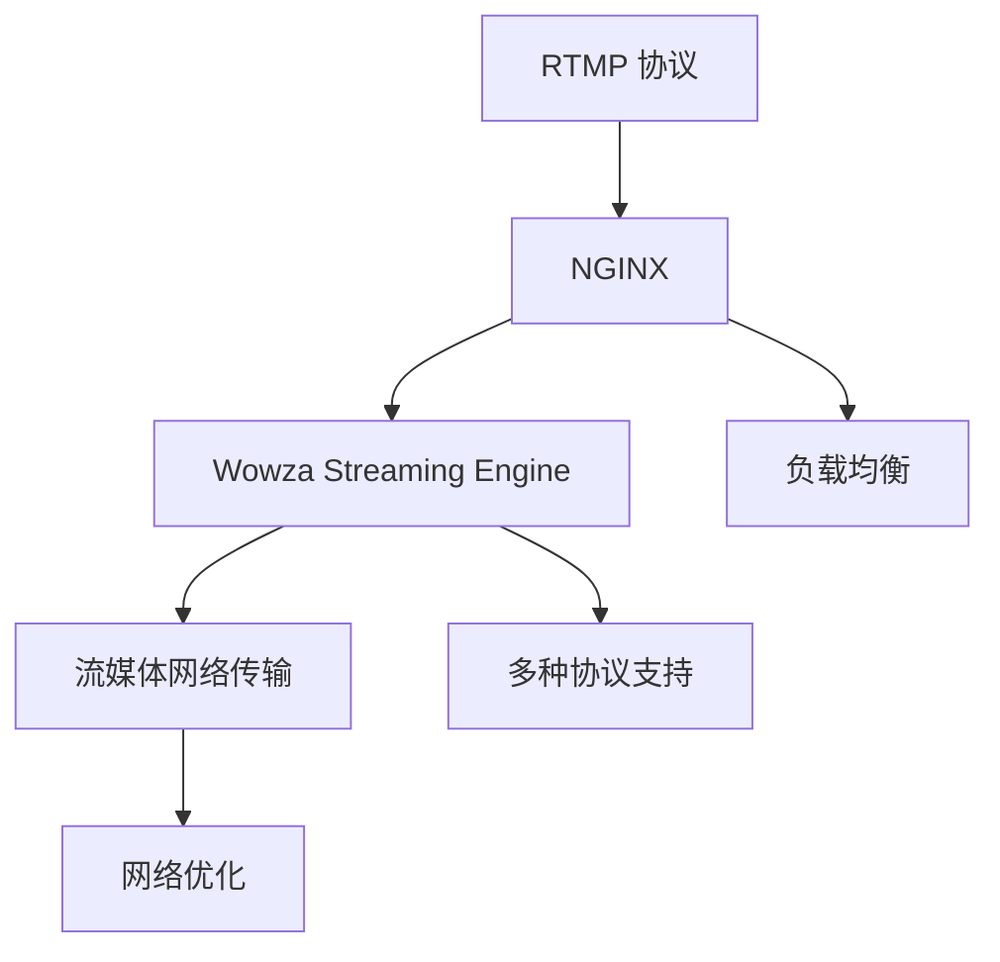

                 

# RTMP 流媒体服务搭建：使用 NGINX 和 Wowza 实现实时传输

> 关键词：RTMP, 流媒体, 实时传输, NGINX, Wowza, 网络安全, 性能优化

## 1. 背景介绍

### 1.1 问题由来

随着网络直播、在线教育、远程医疗等应用场景的不断涌现，实时音视频传输的需求日益增长。RTMP（Real-Time Messaging Protocol）作为实时音视频传输的标准协议，能够有效支持直播、点播、互动等多媒体应用，是构建流媒体服务的首选。

然而，RTMP 传输依赖网络稳定性和带宽，存在一定的延迟和抖动，同时难以支持复杂的协议栈，面临着网络安全、性能优化等挑战。为解决这些问题，NGINX 和 Wowza 等流媒体服务器被广泛应用于 RTMP 流媒体服务的搭建和优化。

### 1.2 问题核心关键点

为了构建高效稳定的 RTMP 流媒体服务，我们需关注以下几个关键点：

- RTMP 协议原理与网络传输特性。了解 RTMP 协议的工作机制及其在网络环境中的表现，是实现有效传输的前提。
- NGINX 与 Wowza 的架构与特性。掌握这两个流媒体服务器的工作原理、架构设计及其在流媒体服务中的主要应用，是实现高效稳定传输的基础。
- RTMP 流媒体服务的配置与优化。熟悉 RTMP 流媒体服务的具体配置方法和性能优化策略，是实现高效服务的关键。

## 2. 核心概念与联系

### 2.1 核心概念概述

- **RTMP**：Real-Time Messaging Protocol，实时消息传输协议，常用于实时音视频流传输。
- **NGINX**：高性能的网络代理服务器，常用于 HTTP、HTTPS、SMTP、POP3、IMAP、RTMP 等协议的代理和负载均衡。
- **Wowza Streaming Engine**：专业的流媒体服务器，支持 RTMP、HTTP Live Streaming (HLS)、DASH、Smooth Streaming 等多种流媒体协议，提供丰富的流媒体功能和插件。
- **流媒体网络传输**：通过 RTMP 协议实现实时音视频数据的传输，依赖网络带宽、延迟和抖动等网络特性，需要优化以提升传输质量。

这些核心概念之间具有紧密的联系，共同构成了 RTMP 流媒体服务的技术基础：

1. RTMP 协议定义了流媒体数据的网络传输机制，是流媒体传输的核心协议。
2. NGINX 作为流媒体服务的基础设施，提供了网络代理和负载均衡的能力，保障流媒体传输的稳定性和可靠性。
3. Wowza Streaming Engine 提供了丰富的流媒体服务和插件，支持多种协议和功能，为流媒体服务的高级应用提供支持。
4. 流媒体网络传输依赖网络环境，需要通过网络优化、负载均衡等手段提升传输质量。

### 2.2 核心概念原理和架构的 Mermaid 流程图



上述 Mermaid 流程图展示了 RTMP 流媒体服务中各个核心概念的联系。RTMP 协议是流媒体传输的基础，NGINX 和 Wowza Streaming Engine 提供底层基础设施和高级服务支持，流媒体网络传输依赖网络特性和优化手段，共同保障流媒体服务的稳定性和性能。

## 3. 核心算法原理 & 具体操作步骤

### 3.1 算法原理概述

RTMP 流媒体服务的构建主要涉及 RTMP 协议的网络传输、流媒体服务器的代理与负载均衡以及网络优化等方面。这些技术原理可总结如下：

1. **RTMP 协议原理**：RTMP 协议通过 TCP 连接实现流媒体数据的传输，采用连续 AVC（Advanced Video Coding）帧和音轨，支持多路复用和时序调整。
2. **NGINX 与 Wowza 架构**：NGINX 作为流媒体服务器的前端代理，负责负载均衡和请求分发；Wowza Streaming Engine 作为后端服务器，提供流媒体服务和插件支持。
3. **流媒体网络传输优化**：通过网络优化、负载均衡等手段，提升 RTMP 流媒体服务的稳定性与性能。

### 3.2 算法步骤详解

#### 3.2.1 RTMP 协议的工作流程

RTMP 协议通过建立 TCP 连接，实现流媒体数据的实时传输。其工作流程主要包括以下几个步骤：

1. **连接建立**：客户端通过 RTMP 协议建立 TCP 连接，与服务器进行握手。
2. **消息传输**：客户端将音视频数据、控制消息等分片为 RTMP 消息，发送到服务器。
3. **数据传输**：服务器接收 RTMP 消息，进行解码、重组和播放。

#### 3.2.2 NGINX 的流媒体服务配置

NGINX 作为流媒体服务器的前端代理，负责负载均衡和请求分发，提升流媒体服务的稳定性和性能。其主要配置步骤如下：

1. **配置 RTMP 协议代理**：在 NGINX 配置文件中添加 RTMP 协议代理规则。
2. **配置负载均衡**：通过 upstream 和 down-stream 指令，实现流媒体服务的负载均衡。
3. **配置缓存和缓存策略**：通过缓存机制减少 RTMP 流媒体传输的延迟和抖动。

#### 3.2.3 Wowza Streaming Engine 的流媒体服务配置

Wowza Streaming Engine 作为后端服务器，提供丰富的流媒体服务和插件支持。其主要配置步骤如下：

1. **配置 RTMP 流媒体服务**：在 Wowza Streaming Engine 中配置 RTMP 流媒体服务，设置流媒体传输参数。
2. **配置流媒体插件**：根据业务需求，配置 Wowza Streaming Engine 提供的多种插件，如转码、统计、广告等。
3. **配置安全认证**：通过认证机制保障流媒体服务的安全性。

#### 3.2.4 流媒体网络传输优化

流媒体网络传输依赖网络环境，需要通过网络优化、负载均衡等手段提升传输质量。其主要优化策略包括：

1. **网络优化**：通过网络带宽优化、延迟优化、抖动优化等手段，提升流媒体传输质量。
2. **负载均衡**：通过负载均衡算法，合理分配流媒体服务器的负载，提升服务稳定性。
3. **网络安全**：通过网络防火墙、DDoS 防护等手段，保障流媒体服务的网络安全。

### 3.3 算法优缺点

#### 3.3.1 RTMP 协议的优点

- **实时性**：RTMP 协议设计之初即考虑了实时性，能够支持低延迟的音视频传输。
- **稳定性**：RTMP 协议采用 TCP 连接，具备较好的网络稳定性。

#### 3.3.2 RTMP 协议的缺点

- **带宽依赖**：RTMP 协议依赖网络带宽，在带宽较低或网络环境较差的情况下，容易出现卡顿和延迟。
- **复杂性**：RTMP 协议支持的功能和扩展较少，难以满足复杂的流媒体需求。

#### 3.3.3 NGINX 的优点

- **高可用性**：NGINX 作为流媒体服务器的前端代理，具备高可用性和可靠性。
- **高效负载均衡**：NGINX 支持多种负载均衡算法，能够有效分配服务器负载。

#### 3.3.4 NGINX 的缺点

- **配置复杂**：NGINX 配置文件复杂，需要具备一定的技术基础。
- **性能瓶颈**：NGINX 作为代理服务器，存在一定的性能瓶颈，需配合其他流媒体服务器使用。

#### 3.3.5 Wowza Streaming Engine 的优点

- **功能丰富**：Wowza Streaming Engine 提供丰富的流媒体功能和插件支持，能够满足复杂的流媒体需求。
- **高性能**：Wowza Streaming Engine 具备高性能的流媒体处理能力。

#### 3.3.6 Wowza Streaming Engine 的缺点

- **成本较高**：Wowza Streaming Engine 作为商业流媒体服务器，需要付费使用，成本较高。
- **学习曲线陡峭**：Wowza Streaming Engine 的学习曲线较陡峭，需具备一定的技术基础。

### 3.4 算法应用领域

RTMP 流媒体服务在直播、点播、互动等场景中广泛应用，主要领域包括：

- **在线直播**：如视频直播、游戏直播、教育直播等。
- **点播服务**：如在线电影、视频点播等。
- **互动服务**：如在线课堂、远程会议、实时互动等。
- **广告投放**：如网络广告、视频广告等。

这些领域对流媒体服务的高效稳定性和丰富功能提出了高要求，NGINX 和 Wowza Streaming Engine 能够提供有效的技术支持，满足不同业务需求。

## 4. 数学模型和公式 & 详细讲解 & 举例说明

### 4.1 数学模型构建

在 RTMP 流媒体服务中，主要涉及以下几个数学模型：

1. **RTMP 协议的传输模型**：通过建立 RTMP 消息的传输模型，计算网络带宽和延迟等参数。
2. **负载均衡模型**：通过建立负载均衡模型，计算服务器负载分配。
3. **网络优化模型**：通过建立网络优化模型，计算网络带宽、延迟和抖动等参数。

### 4.2 公式推导过程

#### 4.2.1 RTMP 协议传输模型的公式推导

RTMP 协议的传输模型主要涉及网络带宽、延迟和抖动等参数的计算。假设 RTMP 流媒体数据率为 $R$，网络带宽为 $B$，网络延迟为 $D$，网络抖动为 $J$，则网络带宽 $B$ 与 RTMP 流媒体数据率 $R$ 的关系为：

$$ B = R \times (1 + J \times D) $$

其中 $J \times D$ 表示网络抖动对网络带宽的影响。

#### 4.2.2 负载均衡模型的公式推导

负载均衡模型主要涉及服务器负载的分配。假设流媒体服务器数量为 $N$，每个服务器的负载为 $L_i$，则整个流媒体服务器的负载 $L$ 可以表示为：

$$ L = \frac{1}{N} \sum_{i=1}^N L_i $$

其中 $L_i$ 表示第 $i$ 个服务器的负载，通过负载均衡算法合理分配服务器负载，使整个流媒体服务器的负载均衡。

#### 4.2.3 网络优化模型的公式推导

网络优化模型主要涉及网络带宽、延迟和抖动的优化。假设原始网络带宽为 $B_0$，优化后网络带宽为 $B$，优化系数为 $k$，则网络带宽的优化公式为：

$$ B = k \times B_0 $$

其中 $k$ 表示优化系数，通过网络优化算法调整网络带宽，提升流媒体传输质量。

### 4.3 案例分析与讲解

以在线教育平台为例，分析 RTMP 流媒体服务的构建和优化过程：

1. **连接建立**：在线教育平台通过 RTMP 协议建立 TCP 连接，与流媒体服务器进行握手。
2. **消息传输**：在线教育平台将音视频数据、控制消息等分片为 RTMP 消息，发送到服务器。
3. **数据传输**：流媒体服务器接收 RTMP 消息，进行解码、重组和播放。

在 RTMP 流媒体服务中，RTMP 协议的实时性和稳定性是其核心优势。NGINX 作为前端代理，提供负载均衡和请求分发，保障流媒体传输的稳定性和可靠性。Wowza Streaming Engine 作为后端服务器，提供丰富的流媒体服务和插件支持。通过网络优化、负载均衡等手段，提升流媒体传输的质量和稳定性。

## 5. 项目实践：代码实例和详细解释说明

### 5.1 开发环境搭建

为实现 RTMP 流媒体服务的搭建和优化，首先需要配置好开发环境。具体步骤如下：

1. **安装 NGINX**：从官网下载 NGINX 安装包，进行安装和配置。
2. **安装 Wowza Streaming Engine**：从官网下载 Wowza Streaming Engine 安装包，进行安装和配置。
3. **配置 RTMP 协议代理**：在 NGINX 配置文件中添加 RTMP 协议代理规则。
4. **配置流媒体服务**：在 Wowza Streaming Engine 中配置 RTMP 流媒体服务，设置流媒体传输参数。
5. **配置负载均衡**：通过 NGINX 的 upstream 和 down-stream 指令，实现流媒体服务的负载均衡。

完成上述步骤后，即可在开发环境中进行 RTMP 流媒体服务的搭建和优化。

### 5.2 源代码详细实现

以下是使用 NGINX 和 Wowza Streaming Engine 搭建 RTMP 流媒体服务的示例代码：

```nginx
# nginx.conf 配置文件

# RTMP 协议代理规则
location /stream/ {
    proxy_pass http://stream_host:1935/;
    proxy_set_header Host $host;
    proxy_set_header X-Real-IP $remote_addr;
    proxy_set_header X-Forwarded-For $proxy_add_x_forwarded_for;
    proxy_set_header X-Forwarded-Proto $scheme;
    proxy_set_header Content-Length $content_length;
    proxy_set_header Content-Type $content_type;
}

# Wowza Streaming Engine 配置文件

# RTMP 流媒体服务配置
server {
    idc 10
    workers 4
    rtmpStreamType live
    tmpBufSize 1024
    videoCodec id=264 bitrate=2M fps=15
    audioCodec id=10
    maxVideoDelay 100
    rtmpServerId 10
    startUrl rtmp://localhost/stream/
    stopUrl rtmp://localhost/stream/
    healthCheckUrl http://localhost/stream/
    healthCheckPeriod 60
    healthCheckTimeout 20
    healthCheckInterval 5
    readTimeout 60
    bufferSize 128
    maxConnectionCount 1000
}

# 负载均衡配置
upstream stream_server {
    server stream_host1:1935;
    server stream_host2:1935;
    server stream_host3:1935;
    server stream_host4:1935;
}
```

### 5.3 代码解读与分析

上述代码展示了 NGINX 和 Wowza Streaming Engine 的 RTMP 流媒体服务配置。具体解析如下：

1. **NGINX 配置文件**：
   - `location /stream/`：定义 RTMP 协议代理规则，将 RTMP 请求转发到指定的流媒体服务器。
   - `proxy_pass http://stream_host:1935/`：设置代理服务器的地址和端口。

2. **Wowza Streaming Engine 配置文件**：
   - `server` 块：配置流媒体服务器参数，如流媒体类型、编码参数等。
   - `idc 10`：设置流媒体服务器的 ID。
   - `workers 4`：设置服务器的并发连接数。
   - `rtmpStreamType live`：设置流媒体服务类型为直播。
   - `tmpBufSize 1024`：设置临时缓冲区大小。
   - `videoCodec id=264 bitrate=2M fps=15`：设置视频编解码器和参数。
   - `audioCodec id=10`：设置音频编解码器和参数。
   - `maxVideoDelay 100`：设置视频延迟的上限。
   - `rtmpServerId 10`：设置 RTMP 服务器的 ID。
   - `startUrl rtmp://localhost/stream/`：设置流媒体服务的启动 URL。
   - `stopUrl rtmp://localhost/stream/`：设置流媒体服务的停止 URL。
   - `healthCheckUrl http://localhost/stream/`：设置健康检查的 URL。
   - `healthCheckPeriod 60`：设置健康检查的周期。
   - `healthCheckTimeout 20`：设置健康检查的超时时间。
   - `healthCheckInterval 5`：设置健康检查的间隔时间。
   - `readTimeout 60`：设置请求超时时间。
   - `bufferSize 128`：设置缓冲区大小。
   - `maxConnectionCount 1000`：设置最大连接数。

3. **负载均衡配置**：
   - `upstream stream_server`：定义负载均衡的 upstream 块。
   - `server stream_host1:1935;`：定义负载均衡的服务器地址和端口。

### 5.4 运行结果展示

在配置好 NGINX 和 Wowza Streaming Engine 后，可以通过测试工具进行 RTMP 流媒体服务的验证。具体步骤如下：

1. **测试工具**：使用 RTMP 流媒体测试工具，如 OBS Studio，连接 RTMP 服务器进行流媒体传输测试。
2. **测试内容**：录制一段音视频，上传到 RTMP 服务器进行直播。
3. **测试结果**：通过测试工具观察音视频传输的实时性、稳定性等指标。

## 6. 实际应用场景

### 6.1 在线直播

在线直播是 RTMP 流媒体服务的重要应用场景之一。直播平台通过 RTMP 协议，将直播内容实时传输给用户，满足用户的实时互动需求。在实际应用中，可以通过 NGINX 和 Wowza Streaming Engine 实现直播内容的录制、转码、缓存和分发，保障直播服务的稳定性和用户体验。

### 6.2 点播服务

点播服务是 RTMP 流媒体服务的另一个重要应用场景。视频平台通过 RTMP 协议，将视频内容实时传输给用户，满足用户的即时观看需求。在实际应用中，可以通过 NGINX 和 Wowza Streaming Engine 实现视频内容的录制、转码、缓存和分发，保障点播服务的稳定性和用户体验。

### 6.3 互动服务

互动服务是 RTMP 流媒体服务的高级应用场景。在线教育平台、远程会议等应用场景，通过 RTMP 协议，实现音视频的双向互动传输，满足用户的实时互动需求。在实际应用中，可以通过 NGINX 和 Wowza Streaming Engine 实现音视频的实时传输、录制、转码和分发，保障互动服务的稳定性和用户体验。

### 6.4 未来应用展望

随着 RTMP 流媒体服务在直播、点播、互动等场景中的应用不断扩展，未来将呈现出以下几个发展趋势：

1. **多协议支持**：未来的 RTMP 流媒体服务将支持多种流媒体协议，如 HTTP Live Streaming (HLS)、DASH、Smooth Streaming 等，满足不同业务需求。
2. **云化部署**：未来的 RTMP 流媒体服务将逐步云化部署，通过云平台实现流媒体服务的弹性扩展和自动化管理。
3. **智能化应用**：未来的 RTMP 流媒体服务将引入人工智能技术，实现流媒体内容的智能推荐、智能广告投放等高级功能。
4. **安全性保障**：未来的 RTMP 流媒体服务将引入网络安全技术，如加密传输、DDoS 防护等，保障流媒体服务的安全性。
5. **低延迟优化**：未来的 RTMP 流媒体服务将进一步优化网络传输，减少延迟和抖动，提升用户体验。

## 7. 工具和资源推荐

### 7.1 学习资源推荐

为深入了解 RTMP 流媒体服务的技术原理和实践方法，推荐以下学习资源：

1. **《Real-Time Messaging Protocol》**：详细介绍了 RTMP 协议的工作机制和应用场景，是理解 RTMP 流媒体服务的基础。
2. **《NGINX 官方文档》**：提供了 NGINX 的配置和使用指南，是学习 NGINX 的必备资源。
3. **《Wowza Streaming Engine 官方文档》**：提供了 Wowza Streaming Engine 的配置和使用指南，是学习 Wowza Streaming Engine 的必备资源。
4. **《网络优化与负载均衡技术》**：介绍了网络优化和负载均衡的原理和方法，是提升 RTMP 流媒体服务性能的重要参考。

### 7.2 开发工具推荐

为高效实现 RTMP 流媒体服务的搭建和优化，推荐以下开发工具：

1. **OBS Studio**：实时音视频录制和传输工具，支持 RTMP 协议，常用于直播和点播服务。
2. **NGINX**：高性能的网络代理服务器，支持 HTTP、HTTPS、SMTP、POP3、IMAP、RTMP 等协议的代理和负载均衡。
3. **Wowza Streaming Engine**：专业的流媒体服务器，支持 RTMP、HTTP Live Streaming (HLS)、DASH、Smooth Streaming 等多种流媒体协议，提供丰富的流媒体服务和插件支持。

### 7.3 相关论文推荐

为深入了解 RTMP 流媒体服务的最新研究进展，推荐以下相关论文：

1. **《Real-Time Messaging Protocol (RTMP) Overview and Recommendations》**：总结了 RTMP 协议的工作机制和最佳实践，是理解 RTMP 流媒体服务的基础。
2. **《Scalable Streaming Media Servers》**：介绍了流媒体服务器的设计原则和实现方法，是学习流媒体服务器的必备参考。
3. **《Optimizing RTMP Streaming Performance with NGINX》**：介绍了 NGINX 在 RTMP 流媒体服务中的应用，是提升 RTMP 流媒体服务性能的重要参考。

## 8. 总结：未来发展趋势与挑战

### 8.1 研究成果总结

本文系统介绍了 RTMP 流媒体服务的搭建和优化方法，主要涉及 RTMP 协议、NGINX 和 Wowza Streaming Engine 的配置和使用，以及网络优化和负载均衡技术。通过这些技术手段，可以构建高效稳定的 RTMP 流媒体服务，满足不同业务需求。

### 8.2 未来发展趋势

未来的 RTMP 流媒体服务将呈现出以下几个发展趋势：

1. **多协议支持**：未来的 RTMP 流媒体服务将支持多种流媒体协议，如 HTTP Live Streaming (HLS)、DASH、Smooth Streaming 等，满足不同业务需求。
2. **云化部署**：未来的 RTMP 流媒体服务将逐步云化部署，通过云平台实现流媒体服务的弹性扩展和自动化管理。
3. **智能化应用**：未来的 RTMP 流媒体服务将引入人工智能技术，实现流媒体内容的智能推荐、智能广告投放等高级功能。
4. **安全性保障**：未来的 RTMP 流媒体服务将引入网络安全技术，如加密传输、DDoS 防护等，保障流媒体服务的安全性。
5. **低延迟优化**：未来的 RTMP 流媒体服务将进一步优化网络传输，减少延迟和抖动，提升用户体验。

### 8.3 面临的挑战

虽然 RTMP 流媒体服务在直播、点播、互动等场景中已经得到了广泛应用，但在实际部署和优化过程中，仍面临以下挑战：

1. **带宽和延迟**：RTMP 协议依赖网络带宽和延迟，在带宽较低或网络环境较差的情况下，容易出现卡顿和延迟。
2. **负载均衡**：流媒体服务器的负载均衡算法需要合理分配服务器负载，否则可能导致服务器负载不均。
3. **网络安全**：RTMP 流媒体服务需要保障网络安全，防止非法访问和恶意攻击。
4. **性能优化**：RTMP 流媒体服务需要优化网络传输，减少延迟和抖动，提升用户体验。

### 8.4 研究展望

为应对 RTMP 流媒体服务面临的挑战，未来的研究需要在以下几个方面寻求新的突破：

1. **带宽优化**：通过网络优化技术，减少 RTMP 流媒体服务的延迟和抖动，提升用户体验。
2. **负载均衡**：引入先进的网络负载均衡算法，合理分配服务器负载，提升服务稳定性。
3. **网络安全**：引入网络安全技术，如加密传输、DDoS 防护等，保障流媒体服务的安全性。
4. **性能优化**：通过多协议支持、云化部署、智能化应用等手段，提升 RTMP 流媒体服务的性能和可靠性。

## 9. 附录：常见问题与解答

**Q1：RTMP 流媒体服务适合哪些场景？**

A: RTMP 流媒体服务适合实时音视频传输的场景，如在线直播、点播、互动等。直播平台、视频平台、在线教育平台、远程会议等应用场景，均适合使用 RTMP 流媒体服务。

**Q2：RTMP 协议的实时性和稳定性如何？**

A: RTMP 协议设计之初即考虑了实时性和稳定性，具备较好的网络适应性。但依赖网络带宽和延迟，在带宽较低或网络环境较差的情况下，可能会出现卡顿和延迟。

**Q3：NGINX 和 Wowza Streaming Engine 的优缺点有哪些？**

A: NGINX 作为前端代理，具备高可用性和高效负载均衡的能力，但配置复杂，性能瓶颈较高。Wowza Streaming Engine 作为后端服务器，功能丰富，性能高，但成本较高，学习曲线较陡峭。

**Q4：RTMP 流媒体服务的优化策略有哪些？**

A: RTMP 流媒体服务的优化策略包括网络优化、负载均衡、网络安全等。通过网络优化技术，减少延迟和抖动，提升用户体验。通过负载均衡算法，合理分配服务器负载，提升服务稳定性。通过网络安全技术，保障流媒体服务的安全性。

**Q5：RTMP 流媒体服务的未来发展趋势是什么？**

A: 未来的 RTMP 流媒体服务将支持多种流媒体协议，云化部署，引入人工智能技术，实现智能推荐、智能广告投放等高级功能。通过网络优化和负载均衡技术，提升服务性能和稳定性。引入网络安全技术，保障服务安全。

---

作者：禅与计算机程序设计艺术 / Zen and the Art of Computer Programming

