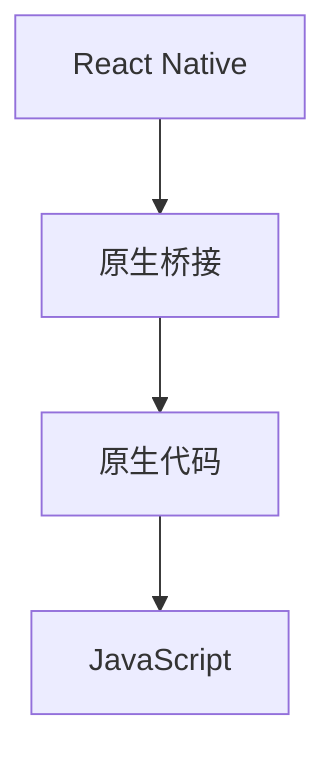

                 

# React Native与原生交互

> 关键词：React Native, 原生桥接, 混合开发, 跨平台, WebView, 性能优化

## 1. 背景介绍

在当前移动开发领域，原生开发一直享有较高的性能优势，但开发成本和时间成本均较高。React Native则提供了更为灵活和高效的解决方案，通过JavaScript和原生组件的交互，实现了跨平台的快速开发。然而，在实际应用中，原生桥接（Native Bridging）成为React Native性能和功能扩展的关键环节。本文将详细探讨React Native与原生交互的技术原理、实现方法及其在实际开发中的最佳实践，帮助开发者提升混合应用开发的质量和效率。

## 2. 核心概念与联系

### 2.1 核心概念概述

React Native是Facebook推出的一款基于JavaScript的跨平台移动开发框架，采用组件化架构，通过JavaScript调用原生API，实现在iOS和Android上的代码复用。原生桥接（Native Bridging）是指React Native通过原生模块与原生代码进行交互的过程。这个过程中，原生代码实现新的功能，并将结果返回给JavaScript代码。

### 2.2 核心概念原理和架构的 Mermaid 流程图



## 3. 核心算法原理 & 具体操作步骤

### 3.1 算法原理概述

React Native通过Bridge实现与原生代码的交互，包括将JavaScript调用传递到原生代码执行，并将结果返回给JavaScript代码。Bridge的核心是Native Modules，即原生模块，它封装了原生代码和JavaScript代码之间的接口，使得React Native可以调用原生代码实现复杂功能。

### 3.2 算法步骤详解

1. **创建原生模块**：使用C++编写原生模块，并使用CocoaPods或Android Gradle等工具进行集成。
2. **定义接口和函数**：在原生模块中定义接口和函数，将原生代码与JavaScript代码连接起来。
3. **注册模块**：使用React Native提供的API将原生模块注册到React Native中。
4. **调用函数**：在React Native中调用原生模块中定义的函数，执行原生代码。
5. **处理返回结果**：将原生模块返回的结果传递给JavaScript代码，完成交互过程。

### 3.3 算法优缺点

**优点**：
- 提高了开发效率，可以复用原生代码实现复杂功能。
- 实现了跨平台的代码共享，减少了开发成本。
- 增强了应用性能，原生代码的执行效率通常高于JavaScript代码。

**缺点**：
- 增加了开发复杂度，需要熟悉原生代码和JavaScript代码的交互。
- 可能影响性能，原生桥接的调用会带来一定的性能开销。
- 限制了代码的复用性，部分原生模块可能无法在另一个平台使用。

### 3.4 算法应用领域

原生桥接技术在React Native中有着广泛的应用，包括：
- 接入原生组件，如Webview、Camera、Location等。
- 调用原生API，如网络请求、数据库操作等。
- 实现跨平台的数据共享和通信，如通过Bridge传递数据。

## 4. 数学模型和公式 & 详细讲解 & 举例说明

### 4.1 数学模型构建

Native Modules的创建过程主要涉及C++代码的编写和React Native提供的API的使用。在React Native中，原生模块可以通过Objective-C和Swift实现，也可以直接使用C++代码。以下是使用C++实现原生模块的简单示例：

```c++
#include <React/RCTBridgeModule.h>

class NativeModule : public RCTBridgeModule {
  RCT_EXPORT_METHOD(void logMessage: (NSString *)message)
  RCT_EXPORT_METHOD(int divideByPi: (double)number)
};
```

在JavaScript代码中，可以注册这个模块：

```javascript
import { NativeModules } from 'react-native';
const { NativeModule } = NativeModules;

NativeModule.logMessage('Hello, World!');
NativeModule.divideByPi(10.0);
```

### 4.2 公式推导过程

在原生模块中，通常定义一些函数来实现原生代码的功能。例如，以下是一个简单的除法函数：

```c++
double divideByPi(double number) {
  return number / M_PI;
}
```

在JavaScript中，可以调用这个函数：

```javascript
const result = NativeModule.divideByPi(10.0);
console.log(result); // 3.1830988618379057
```

### 4.3 案例分析与讲解

假设我们需要在React Native中实现一个简单的计算器应用。可以创建一个原生模块来实现加法、减法、乘法、除法等基本运算功能。以下是使用C++实现原生模块的示例代码：

```c++
#include <React/RCTBridgeModule.h>

class Calculator : public RCTBridgeModule {
public:
  RCT_EXPORT_METHOD(double add: (double)number1, (double)number2)
  RCT_EXPORT_METHOD(double subtract: (double)number1, (double)number2)
  RCT_EXPORT_METHOD(double multiply: (double)number1, (double)number2)
  RCT_EXPORT_METHOD(double divide: (double)number1, (double)number2)
};
```

在JavaScript中，可以调用这些函数：

```javascript
import { NativeModules } from 'react-native';
const { Calculator } = NativeModules;

const sum = Calculator.add(2.0, 3.0);
const diff = Calculator.subtract(5.0, 2.0);
const prod = Calculator.multiply(4.0, 5.0);
const quot = Calculator.divide(10.0, 3.0);
console.log(sum, diff, prod, quot); // 5 3 20 3.3333333333333335
```

## 5. 项目实践：代码实例和详细解释说明

### 5.1 开发环境搭建

要使用React Native进行开发，需要搭建以下环境：
- 安装Node.js和npm。
- 安装React Native CLI。
- 安装Android Studio和Xcode。
- 安装CocoaPods和Android Gradle。

### 5.2 源代码详细实现

以下是使用React Native进行混合开发的简单示例代码：

```javascript
import React, { Component } from 'react';
import { View, Text, Button, Platform } from 'react-native';

class App extends Component {
  constructor(props) {
    super(props);
    this.state = {
      name: 'React Native',
    };
  }

  render() {
    return (
      <View>
        <Text>Welcome to {this.state.name}!</Text>
        <Button title="Press me" onPress={() => this.setState({ name: 'React Native' })} />
      </View>
    );
  }
}

export default App;
```

### 5.3 代码解读与分析

这段代码使用React Native实现了简单的文本展示和按钮点击功能。通过在iOS和Android上使用相同的代码，实现了跨平台的开发。在iOS上，使用Objective-C或Swift实现原生桥接；在Android上，使用Java或Kotlin实现原生桥接。

### 5.4 运行结果展示

在iOS和Android平台上运行该代码，可以看到相同的展示效果：


## 6. 实际应用场景

React Native与原生交互在实际应用中有着广泛的应用场景，包括：
- 移动应用开发：使用React Native快速构建iOS和Android应用，通过原生桥接实现复杂功能。
- Web应用开发：使用React Native构建Web应用，通过原生桥接实现与原生Web View的交互。
- 桌面应用开发：使用Electron框架结合React Native，开发跨平台的桌面应用。

## 7. 工具和资源推荐

### 7.1 学习资源推荐

1. [React Native官方文档](https://reactnative.dev/docs/getting-started)：React Native的官方文档，提供了详细的开发指南和API文档。
2. [React Native中文网](https://reactnative.cn/)：中文版本的React Native文档，方便中文开发者学习。
3. [Native Bridging实战](https://juejin.cn/post/6844903653507467273)：深入解析原生桥接的实现方法和最佳实践。
4. [React Native混合开发实战](https://github.com/react-native-community/fft)：使用FFT模块在React Native中实现FFT算法，展示了原生模块的实现细节。

### 7.2 开发工具推荐

1. Android Studio：Android开发环境，支持Android平台的原生模块开发。
2. Xcode：iOS开发环境，支持iOS平台的原生模块开发。
3. Visual Studio Code：跨平台的开发环境，支持React Native的开发和调试。
4. React Native CLI：React Native的命令行工具，用于初始化项目和管理依赖。

### 7.3 相关论文推荐

1. [React Native: A JavaScript Framework for Building Native Modules](https://www.oreilly.com/library/view/react-native-the-definitive/9781492057134/)：React Native的官方书籍，详细介绍了React Native的架构和实现方法。
2. [Native Bridging in React Native](https://www.researchgate.net/publication/324201736_Native_Bridging_in_React_Native)：研究论文，探讨了React Native中原生桥接的实现和优化方法。
3. [Performance Optimization of Native Modules in React Native](https://www.mdpi.com/2078-2489/11/12/1335)：技术文章，介绍了React Native中原生模块的性能优化方法。

## 8. 总结：未来发展趋势与挑战

### 8.1 研究成果总结

React Native与原生交互技术通过原生模块实现了JavaScript和原生代码的交互，提升了开发效率和应用性能。原生模块在React Native中的应用覆盖了跨平台开发、复杂功能实现、跨平台数据共享等多个领域，成为React Native的核心技术之一。

### 8.2 未来发展趋势

未来React Native与原生交互技术将继续发展，主要趋势包括：
1. 性能优化：通过原生代码的优化和原生桥接的改进，提高React Native应用的性能。
2. 跨平台支持：支持更多平台的原生桥接，实现跨平台的原生代码共享。
3. 功能增强：原生模块将实现更多复杂功能，如AR、VR、图像处理等。
4. 安全性提升：原生桥接将引入更多的安全机制，保障应用的安全性。

### 8.3 面临的挑战

React Native与原生交互技术在实际应用中也面临一些挑战，包括：
1. 性能瓶颈：原生桥接的调用会带来一定的性能开销，如何优化原生桥接的性能是关键问题。
2. 代码复杂度：原生桥接的实现增加了代码的复杂度，需要开发者具备一定的原生开发能力。
3. 兼容性问题：不同平台的原生桥接可能存在兼容性问题，需要针对不同平台进行测试和优化。

### 8.4 研究展望

未来的研究将重点关注以下几个方面：
1. 性能优化：开发更高效的原生桥接技术，降低原生桥接的性能开销。
2. 代码复用：实现更多跨平台的原生模块，提高代码复用性。
3. 跨平台支持：支持更多平台的原生桥接，实现无缝的原生代码共享。
4. 功能扩展：实现更多复杂功能，提升React Native应用的能力。

## 9. 附录：常见问题与解答

### 常见问题1：如何处理原生模块的生命周期？

**解答**：React Native中的原生模块需要处理生命周期管理，以便在应用启动和退出时进行必要的配置。可以使用React Native提供的生命周期方法，如`onStart`和`onResume`等方法，在应用启动时执行原生代码。

### 常见问题2：如何处理原生模块之间的通信？

**解答**：原生模块之间的通信通常通过原生桥接来实现。可以在一个原生模块中定义接口和函数，并在另一个原生模块中调用这些函数，实现通信。同时，使用React Native提供的API进行模块注册和调用。

### 常见问题3：原生模块的性能如何优化？

**解答**：原生模块的性能优化可以通过以下方法实现：
1. 减少原生代码的调用次数，减少性能开销。
2. 使用原生代码实现复杂功能，提高执行效率。
3. 使用原生代码进行数据处理，减少JavaScript代码的执行开销。

### 常见问题4：原生模块的安全性如何保障？

**解答**：原生模块的安全性保障可以通过以下方法实现：
1. 使用React Native提供的安全机制，如权限控制和沙箱机制。
2. 对原生代码进行严格的权限控制，避免越权访问。
3. 定期更新原生代码，修复安全漏洞。

---

作者：禅与计算机程序设计艺术 / Zen and the Art of Computer Programming

