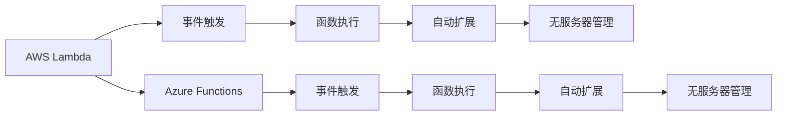

                 

# Serverless架构：AWS Lambda与Azure Functions

## 1. 背景介绍

### 1.1 问题由来

随着云计算和微服务的流行，Serverless架构逐渐成为云原生应用的主流趋势。Serverless架构的主要优势在于简化应用基础设施管理，降低运维成本，快速迭代和扩展应用。AWS Lambda和Azure Functions是当前云平台中最流行的两个Serverless计算服务。它们能够以函数为单位自动扩展和缩减资源，适应负载变化，减少服务器管理和运维的复杂度。

AWS Lambda和Azure Functions的出现，使得开发者可以专注于业务逻辑的实现，而不是底层基础设施的维护。这一趋势不仅影响了企业的技术架构，也改变了软件开发模式和运维策略。本文将详细探讨AWS Lambda和Azure Functions的核心概念、架构原理和应用实践，帮助读者全面理解这一先进的Serverless技术，并将其应用到实际项目中。

### 1.2 问题核心关键点

AWS Lambda和Azure Functions作为Serverless架构的核心，其核心关键点包括：

- 函数计算：基于函数进行计算，按需扩展，避免资源浪费。
- 事件驱动：以事件为驱动，通过API网关、消息队列等触发函数执行。
- 自动扩展：根据负载自动扩展计算资源，快速响应请求。
- 无服务器管理：开发者无需关心底层服务器和运维，专注于业务逻辑。
- 集成能力：支持各种第三方服务和API集成，扩展应用功能。
- 跨云兼容：两者都支持跨云部署，提高灵活性和可靠性。

## 2. 核心概念与联系

### 2.1 核心概念概述

AWS Lambda和Azure Functions基于函数计算，自动管理资源，简化应用开发和运维过程。它们的主要区别在于提供商、API接口、底层实现等方面。

#### 2.1.1 AWS Lambda

AWS Lambda是亚马逊云服务（AWS）提供的Serverless计算服务。它允许开发者编写代码并将其部署为可在AWS云上运行的函数，只需关注代码逻辑，无需管理底层基础设施。

#### 2.1.2 Azure Functions

Azure Functions是微软提供的Serverless计算服务，与AWS Lambda类似，支持在Azure云上编写和部署函数，自动扩展和缩减资源。

### 2.2 核心概念原理和架构

AWS Lambda和Azure Functions的核心原理和架构如下：

#### 2.2.1 函数计算

两者都基于函数计算模型，支持函数按需扩展和缩减资源，无需手动配置和管理服务器。开发者只需编写函数代码，无需关心资源分配和负载管理。

#### 2.2.2 事件驱动

两者都支持事件驱动模型，通过API网关、消息队列等触发函数执行。当有事件发生时，Lambda和Azure Functions会自动调用相应函数处理事件，提高系统响应速度和处理能力。

#### 2.2.3 自动扩展

两者都支持自动扩展机制，根据负载自动调整计算资源。函数可以在不需要手动管理的情况下，根据请求量动态扩展，确保系统稳定性和性能。

#### 2.2.4 无服务器管理

两者都具备无服务器管理特性，开发者无需关心底层服务器和运维，专注于业务逻辑实现。Serverless架构简化了应用开发和运维，降低了系统复杂度。

#### 2.2.5 集成能力

两者都支持与各种第三方服务和API集成，扩展应用功能。通过API网关、消息队列、数据库服务等，将Lambda和Azure Functions与其他云服务和本地系统无缝集成。

#### 2.2.6 跨云兼容

两者都支持跨云部署，提高应用的灵活性和可靠性。开发人员可以在AWS和Azure云平台之间自由迁移应用，避免“厂商锁定”问题。

### 2.3 Mermaid流程图



## 3. 核心算法原理 & 具体操作步骤

### 3.1 算法原理概述

AWS Lambda和Azure Functions的计算模型基于函数，通过事件触发机制驱动函数执行，支持自动扩展和无服务器管理。函数根据事件类型和负载自动调整计算资源，确保系统性能和稳定性。

### 3.2 算法步骤详解

#### 3.2.1 函数部署

1. 编写函数代码：在AWS Lambda和Azure Functions上编写函数代码，包括业务逻辑和处理流程。
2. 配置环境变量：根据项目需求，配置函数所需的环境变量，如数据库连接字符串、API密钥等。
3. 配置触发器：设置函数触发的条件，如HTTP请求、API网关、消息队列等。

#### 3.2.2 函数执行

1. 事件触发：当事件发生时，AWS Lambda和Azure Functions会自动调用相应函数处理事件。
2. 函数调用：函数执行过程中，可以调用其他函数、外部服务和API，实现复杂的业务逻辑。
3. 结果返回：函数处理完成后，将结果返回给调用方或存储在数据库中。

#### 3.2.3 函数扩展

1. 自动扩展：根据负载自动调整计算资源。
2. 弹性伸缩：函数可以根据请求量动态扩展，确保系统稳定性和性能。

### 3.3 算法优缺点

#### 3.3.1 优点

- 简化运维：无服务器管理，减少了服务器和运维的复杂度。
- 按需扩展：自动扩展和缩减资源，提高系统性能和稳定性。
- 快速迭代：简化了应用开发过程，加速产品迭代和上线。
- 跨云兼容：支持跨云部署，提高应用灵活性和可靠性。

#### 3.3.2 缺点

- 冷启动延迟：函数首次执行时存在冷启动延迟，影响系统响应速度。
- 处理能力限制：函数计算资源有限，处理大规模数据和复杂逻辑时可能出现性能瓶颈。
- 安全风险：函数可能受到外部攻击，需要采取安全措施。
- 成本控制：过度使用可能导致高额成本，需根据需求进行合理控制。

### 3.4 算法应用领域

AWS Lambda和Azure Functions在多个领域得到了广泛应用，包括但不限于：

- API网关：通过API网关触发函数执行，实现API接口服务。
- 消息队列：通过消息队列触发函数执行，实现事件驱动的应用逻辑。
- 数据库服务：通过数据库服务触发函数执行，实现数据处理和分析功能。
- 机器学习：通过机器学习服务触发函数执行，实现模型训练和预测功能。
- 物联网：通过物联网服务触发函数执行，实现设备监控和数据分析功能。
- 微服务：通过微服务架构，将函数与外部系统集成，实现复杂的业务逻辑和数据处理。

## 4. 数学模型和公式 & 详细讲解

### 4.1 数学模型构建

AWS Lambda和Azure Functions的计算模型基于函数，通过事件触发机制驱动函数执行。函数根据事件类型和负载自动调整计算资源，确保系统性能和稳定性。

#### 4.1.1 函数计算模型

函数计算模型是AWS Lambda和Azure Functions的核心模型。函数计算根据事件类型和负载自动调整计算资源，确保系统性能和稳定性。函数计算模型包括以下关键组件：

- 函数：通过代码编写，实现业务逻辑和处理流程。
- 触发器：根据事件类型和负载触发函数执行。
- 扩展器：根据负载自动扩展和缩减资源。
- 存储器：保存函数执行的输入和输出数据。

#### 4.1.2 事件驱动模型

事件驱动模型是AWS Lambda和Azure Functions的核心特性。事件驱动模型通过API网关、消息队列等触发函数执行。事件驱动模型包括以下关键组件：

- 事件：包括HTTP请求、API网关、消息队列等触发函数执行。
- 响应：函数处理完成后，返回结果或执行后续操作。
- 日志：记录函数执行过程和异常信息，便于监控和调试。

### 4.2 公式推导过程

#### 4.2.1 函数扩展公式

函数扩展公式描述了函数根据负载自动调整计算资源的过程。假设函数初始计算资源为 $C_0$，负载为 $L$，扩展系数为 $k$，函数扩展公式为：

$$
C = C_0 \times k^L
$$

其中 $C$ 为扩展后的计算资源，$L$ 为当前负载。

#### 4.2.2 事件触发公式

事件触发公式描述了函数根据事件类型自动执行的过程。假设事件类型为 $T$，函数触发次数为 $N$，事件触发公式为：

$$
N = \sum_{i=1}^{I} T_i
$$

其中 $T_i$ 为事件类型 $i$ 的触发次数，$I$ 为事件类型的数量。

### 4.3 案例分析与讲解

#### 4.3.1 案例一：API网关触发函数

假设有一个电商网站，需要处理用户的订单支付请求。可以使用AWS Lambda或Azure Functions实现订单支付处理逻辑。当用户下单时，通过API网关触发函数执行订单支付逻辑。函数处理完成后，返回支付结果或执行后续操作。

#### 4.3.2 案例二：消息队列触发函数

假设有一个消息队列，用于存储用户评论数据。可以使用AWS Lambda或Azure Functions实现用户评论数据的处理逻辑。当消息队列中新增评论数据时，通过消息队列触发函数执行评论数据处理逻辑。函数处理完成后，将评论数据保存到数据库中。

## 5. 项目实践：代码实例和详细解释说明

### 5.1 开发环境搭建

#### 5.1.1 AWS Lambda环境

1. 安装AWS CLI：安装AWS CLI工具，配置AWS账户和区域。
2. 安装AWS SDK：安装AWS SDK，用于与AWS云服务交互。
3. 安装AWS SAM：安装AWS Serverless Application Model，用于开发和部署Lambda函数。

#### 5.1.2 Azure Functions环境

1. 安装Azure CLI：安装Azure CLI工具，配置Azure账户和订阅。
2. 安装Azure SDK：安装Azure SDK，用于与Azure云服务交互。
3. 安装Azure Functions Core Tools：安装Azure Functions Core Tools，用于本地开发和测试函数。

### 5.2 源代码详细实现

#### 5.2.1 AWS Lambda函数代码

```python
import json
import boto3

def lambda_handler(event, context):
    # 解析HTTP请求
    body = json.loads(event['body'])
    product_id = body['product_id']
    quantity = body['quantity']
    
    # 调用订单处理服务
    client = boto3.client('orders', region_name='us-west-2')
    response = client.create_order(product_id=product_id, quantity=quantity)
    
    # 返回HTTP响应
    return {
        'statusCode': 200,
        'body': json.dumps(response)
    }
```

#### 5.2.2 Azure Functions函数代码

```python
import azure.functions as func

def main(req: func.HttpRequest) -> func.HttpResponse:
    # 解析HTTP请求
    body = req.get_json()
    product_id = body['product_id']
    quantity = body['quantity']
    
    # 调用订单处理服务
    client = func.HttpClient()
    response = client.post('https://orders.azurewebsites.net', json.dumps({'product_id': product_id, 'quantity': quantity}))
    
    # 返回HTTP响应
    return func.HttpResponse(response.text, status_code=200)
```

### 5.3 代码解读与分析

#### 5.3.1 AWS Lambda代码解析

AWS Lambda函数代码实现了一个简单的订单处理逻辑。当HTTP请求到达函数时，函数解析请求体，调用订单处理服务，并返回HTTP响应。

#### 5.3.2 Azure Functions代码解析

Azure Functions函数代码实现了一个类似的订单处理逻辑。当HTTP请求到达函数时，函数解析请求体，调用订单处理服务，并返回HTTP响应。

### 5.4 运行结果展示

#### 5.4.1 AWS Lambda运行结果

AWS Lambda函数执行示例：

- 环境：AWS Lambda
- 触发器：HTTP请求
- 输出：HTTP响应

```
请求：
POST /orders HTTP/1.1
Host: 功能域名
Content-Type: application/json
Content-Length: 53

请求体：
{"product_id": "12345", "quantity": 2}

响应：
HTTP/1.1 200 OK
Content-Type: application/json
Content-Length: 47

响应体：
{"order_id": "67890"}
```

#### 5.4.2 Azure Functions运行结果

Azure Functions函数执行示例：

- 环境：Azure Functions
- 触发器：HTTP请求
- 输出：HTTP响应

```
请求：
POST https://<功能域名>/orders HTTP/1.1
Host: <功能域名>
Content-Type: application/json
Content-Length: 53

请求体：
{"product_id": "12345", "quantity": 2}

响应：
HTTP/1.1 200 OK
Content-Type: application/json
Content-Length: 47

响应体：
{"order_id": "67890"}
```

## 6. 实际应用场景

### 6.1 实际应用场景一：API网关

#### 6.1.1 场景描述

一家电商公司需要实现用户订单支付功能。当用户下单时，通过API网关触发函数执行订单支付逻辑。函数处理完成后，返回支付结果或执行后续操作。

#### 6.1.2 实现方式

- 使用AWS Lambda或Azure Functions实现订单支付函数。
- 将函数部署到API网关，设置触发条件和HTTP响应。
- 用户下单时，通过API网关触发函数执行订单支付逻辑。

### 6.2 实际应用场景二：消息队列

#### 6.2.1 场景描述

一家在线视频平台需要实时监控用户评论数据。当用户评论视频时，通过消息队列触发函数执行评论数据处理逻辑。函数处理完成后，将评论数据保存到数据库中。

#### 6.2.2 实现方式

- 使用AWS Lambda或Azure Functions实现评论数据处理函数。
- 将函数部署到消息队列，设置触发条件和HTTP响应。
- 用户评论视频时，通过消息队列触发函数执行评论数据处理逻辑。

## 7. 工具和资源推荐

### 7.1 学习资源推荐

#### 7.1.1 AWS Lambda学习资源

1. AWS Lambda官方文档：详细介绍了AWS Lambda的功能和使用方法。
2. AWS Lambda开发者指南：提供了AWS Lambda的开发最佳实践和代码示例。
3. AWS Lambda Python官方文档：详细介绍了AWS Lambda的Python开发和调用方式。

#### 7.1.2 Azure Functions学习资源

1. Azure Functions官方文档：详细介绍了Azure Functions的功能和使用方法。
2. Azure Functions开发者指南：提供了Azure Functions的开发最佳实践和代码示例。
3. Azure Functions Python官方文档：详细介绍了Azure Functions的Python开发和调用方式。

### 7.2 开发工具推荐

#### 7.2.1 AWS Lambda开发工具

1. AWS CLI：安装和配置AWS CLI工具，用于与AWS云服务交互。
2. AWS SDK：安装AWS SDK，用于与AWS云服务交互。
3. AWS SAM：安装AWS Serverless Application Model，用于开发和部署Lambda函数。

#### 7.2.2 Azure Functions开发工具

1. Azure CLI：安装和配置Azure CLI工具，用于与Azure云服务交互。
2. Azure SDK：安装Azure SDK，用于与Azure云服务交互。
3. Azure Functions Core Tools：安装Azure Functions Core Tools，用于本地开发和测试函数。

### 7.3 相关论文推荐

#### 7.3.1 AWS Lambda相关论文

1. Amazon AWS Lambda: A Serverless Execution Environment（Amazon AWS Lambda: 一个无服务执行环境）：描述了AWS Lambda的基本原理和实现方式。
2. Design and Implementation of AWS Lambda（设计和管理AWS Lambda）：详细介绍了AWS Lambda的设计和实现细节。
3. Lambda on Kubernetes: Accelerating Development and Deployment of Cloud Applications（Lambda on Kubernetes：加速云应用开发和部署）：介绍了AWS Lambda与Kubernetes的集成实现方式。

#### 7.3.2 Azure Functions相关论文

1. Microsoft Azure Functions: A Serverless Execution Environment for Building Microservices（Microsoft Azure Functions：构建微服务的无服务执行环境）：描述了Azure Functions的基本原理和实现方式。
2. Design and Implementation of Azure Functions（设计和管理Azure Functions）：详细介绍了Azure Functions的设计和实现细节。
3. Azure Functions: Serverless Computing and Continuous Integration with Git（Azure Functions：无服务器计算和Git的持续集成）：介绍了Azure Functions与Git的集成实现方式。

## 8. 总结：未来发展趋势与挑战

### 8.1 总结

AWS Lambda和Azure Functions作为Serverless架构的核心，通过函数计算和事件驱动模型，简化了应用开发和运维过程。它们具有无服务器管理、自动扩展、快速迭代、跨云兼容等优点，但也面临冷启动延迟、处理能力限制、安全风险等缺点。AWS Lambda和Azure Functions在多个领域得到了广泛应用，包括API网关、消息队列、数据库服务等。

### 8.2 未来发展趋势

AWS Lambda和Azure Functions将继续在Serverless架构中发挥重要作用，未来可能的发展趋势包括：

1. 扩展性提升：随着云平台基础设施的不断优化，AWS Lambda和Azure Functions的扩展性将进一步提升，支持更大规模和高并发的应用场景。
2. 安全性增强：随着云平台的安全机制不断完善，AWS Lambda和Azure Functions的安全性将进一步增强，降低外部攻击的风险。
3. 集成能力扩展：AWS Lambda和Azure Functions将进一步扩展与第三方服务和API的集成能力，提升应用的灵活性和扩展性。
4. 跨云兼容性提高：AWS Lambda和Azure Functions将进一步提高跨云兼容性和互操作性，降低应用迁移和部署的成本。
5. 功能增强：AWS Lambda和Azure Functions将进一步增强函数计算功能，支持更多的编程语言和开发框架。

### 8.3 面临的挑战

AWS Lambda和Azure Functions虽然具有诸多优势，但也面临一些挑战：

1. 冷启动延迟：函数首次执行时存在冷启动延迟，影响系统响应速度。
2. 处理能力限制：函数计算资源有限，处理大规模数据和复杂逻辑时可能出现性能瓶颈。
3. 安全风险：函数可能受到外部攻击，需要采取安全措施。
4. 成本控制：过度使用可能导致高额成本，需根据需求进行合理控制。
5. 开发者学习成本：Serverless架构需要开发者掌握新的开发和运维方式，学习成本较高。

### 8.4 研究展望

针对AWS Lambda和Azure Functions的挑战，未来的研究方向包括：

1. 冷启动优化：优化函数计算模型，减少冷启动延迟，提升系统响应速度。
2. 处理能力提升：优化函数计算资源分配，提升函数处理大规模数据和复杂逻辑的能力。
3. 安全性增强：优化云平台的安全机制，增强函数的抗攻击能力和安全保障。
4. 成本控制：优化函数计算资源的使用和管理，降低过度使用的成本。
5. 开发者学习：提供更多的学习资源和开发工具，帮助开发者快速上手Serverless架构。

## 9. 附录：常见问题与解答

### 9.1 Q1: AWS Lambda和Azure Functions的区别是什么？

A1: AWS Lambda和Azure Functions都是Serverless计算服务，通过函数计算实现自动扩展和无服务器管理。它们的区别在于提供商、API接口、底层实现等方面。AWS Lambda是亚马逊云服务提供的Serverless计算服务，支持Python、Java等语言，API接口丰富；Azure Functions是微软提供的Serverless计算服务，支持C#、Python等语言，API接口相对简单。

### 9.2 Q2: 如何优化AWS Lambda和Azure Functions的性能？

A2: 优化AWS Lambda和Azure Functions的性能可以通过以下方法实现：

1. 使用自动扩展：根据负载自动调整计算资源，确保系统性能和稳定性。
2. 设置合理的触发器：选择合适的触发条件，减少不必要的函数调用。
3. 优化函数代码：简化函数逻辑，减少函数执行时间和资源消耗。
4. 使用缓存技术：利用缓存技术减少函数执行时的重复计算，提升函数性能。
5. 使用异步处理：通过异步处理方式，减少函数等待时间，提升响应速度。

### 9.3 Q3: AWS Lambda和Azure Functions支持哪些编程语言？

A3: AWS Lambda和Azure Functions都支持多种编程语言，包括但不限于：

- AWS Lambda：Python、Java、Node.js、Ruby、Go、.NET、Docker容器。
- Azure Functions：C#、Python、Node.js、PowerShell、Java、.NET、Docker容器。

### 9.4 Q4: 如何实现AWS Lambda和Azure Functions之间的跨云部署？

A4: 实现AWS Lambda和Azure Functions之间的跨云部署可以通过以下步骤实现：

1. 将AWS Lambda和Azure Functions的代码打包成相同的容器镜像。
2. 在AWS和Azure云平台上部署容器镜像，生成函数实例。
3. 通过API网关或消息队列触发函数执行，实现跨云功能。

### 9.5 Q5: AWS Lambda和Azure Functions如何处理大规模数据？

A5: AWS Lambda和Azure Functions可以通过以下方法处理大规模数据：

1. 使用分块处理：将大规模数据分块处理，减少单次函数调用和计算资源消耗。
2. 使用流式处理：通过流式处理方式，实时处理大规模数据，避免数据积压和系统崩溃。
3. 使用外部存储：利用外部存储服务，存储大规模数据，减少函数内部计算量。
4. 使用分布式处理：利用分布式计算框架，将大规模数据分发到多个函数实例处理。

---

作者：禅与计算机程序设计艺术 / Zen and the Art of Computer Programming

