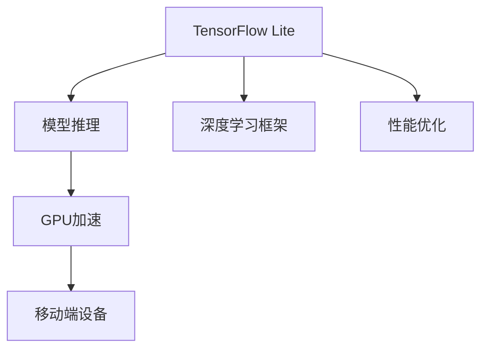

                 

# TensorFlow Lite GPU加速

> 关键词：TensorFlow Lite, GPU加速, 模型推理, 移动端, 深度学习, 性能优化

## 1. 背景介绍

随着深度学习技术的普及，越来越多的应用程序需要部署基于深度学习模型的推理能力。然而，深度学习模型通常具有较大的计算需求和内存消耗，这给硬件设备的计算性能带来了极大的压力。在移动设备等资源受限的平台上，如何快速高效地实现深度学习模型的推理，成为了一个亟待解决的问题。

为了解决这个问题，TensorFlow Lite（TFLite）应运而生。TFLite是一个由Google开发的开源深度学习框架，旨在将深度学习模型部署到移动设备和嵌入式系统上。TFLite通过将深度学习模型转换为高效的模型格式，实现了在移动设备上的快速推理，同时保证了模型的精度。然而，移动设备的计算能力仍然有限，尤其是在GPU加速的支持下，TFLite的性能可以进一步提升。

## 2. 核心概念与联系

### 2.1 核心概念概述

为了更好地理解TensorFlow Lite GPU加速，本节将介绍几个密切相关的核心概念：

- **TensorFlow Lite**：由Google开发的开源深度学习框架，支持在移动设备上部署和运行深度学习模型。TFLite通过将深度学习模型转换为轻量级、高效能的模型格式，实现了在移动设备上的快速推理。

- **GPU加速**：通过利用GPU的并行计算能力，加速深度学习模型的推理过程，显著提高推理速度。GPU加速特别适用于具有高度并行计算需求的任务，如图像识别、语音识别等。

- **模型推理**：基于预训练的深度学习模型，对输入数据进行预测或分类的过程。模型推理是深度学习应用中的核心功能，广泛应用于图像识别、语音识别、自然语言处理等领域。

- **移动端设备**：包括智能手机、平板电脑、物联网设备等，这些设备通常具有有限的计算能力和内存资源。在移动端设备上部署深度学习模型，需要考虑计算效率和模型大小等因素。

- **深度学习框架**：用于构建、训练和部署深度学习模型的软件框架。常见的深度学习框架包括TensorFlow、PyTorch、Caffe等。

- **性能优化**：通过各种技术手段，提高深度学习模型的计算效率和内存利用率，以适应资源受限的设备环境。

这些核心概念之间的逻辑关系可以通过以下Mermaid流程图来展示：



这个流程图展示了TensorFlow Lite的架构及其与其他核心概念的联系：

1. TensorFlow Lite是深度学习框架中的一个重要部分，支持移动设备上的模型推理。
2. GPU加速是性能优化的重要手段，可以显著提升模型推理的效率。
3. 移动端设备是模型推理的主要目标平台，需要考虑计算资源和内存限制。
4. 深度学习框架是构建和部署深度学习模型的工具，TensorFlow Lite就是其中一种。
5. 性能优化是提升模型推理效率的关键，GPU加速是其重要手段之一。

## 3. 核心算法原理 & 具体操作步骤

### 3.1 算法原理概述

TensorFlow Lite GPU加速的基本原理是将深度学习模型的推理过程从CPU（中央处理器）迁移到GPU上，利用GPU的并行计算能力，提高模型推理的速度和效率。这一过程主要包括三个步骤：

1. **模型转换**：将TensorFlow模型转换为TFLite模型格式。
2. **GPU支持**：在TFLite模型中启用GPU支持。
3. **模型推理**：在移动设备上使用GPU加速进行模型推理。

### 3.2 算法步骤详解

**Step 1: 模型转换**

在模型转换阶段，需要将TensorFlow模型转换为TFLite模型格式。这一过程可以通过TensorFlow Lite工具库中的工具完成。具体步骤如下：

1. 使用TensorFlow编写深度学习模型。
2. 使用TensorFlow Lite的转换器（converter）工具，将TensorFlow模型转换为TFLite模型格式。
3. 对TFLite模型进行优化，包括去除不必要的节点、压缩模型大小等。

**Step 2: 启用GPU支持**

在TFLite模型中启用GPU支持，需要配置GPU支持的库和工具。具体步骤如下：

1. 下载并安装支持GPU加速的TFLite库。
2. 在代码中设置GPU支持的配置选项。
3. 在模型推理过程中，使用GPU加速库进行计算。

**Step 3: 模型推理**

在模型推理阶段，将TFLite模型部署到移动设备上，使用GPU加速进行模型推理。具体步骤如下：

1. 将TFLite模型部署到移动设备上。
2. 在移动设备上使用TensorFlow Lite Runtime库，加载和运行TFLite模型。
3. 对模型输入数据进行预处理，并使用GPU加速进行模型推理。

### 3.3 算法优缺点

TensorFlow Lite GPU加速有以下优点：

1. **显著提高推理速度**：GPU加速利用并行计算能力，可以大幅提高深度学习模型的推理速度。
2. **降低计算资源消耗**：GPU加速可以大幅降低计算资源消耗，提高设备性能。
3. **支持多种移动平台**：TensorFlow Lite支持多种移动平台，包括Android、iOS等。
4. **开源免费**：TensorFlow Lite及其GPU加速库都是开源免费的，可以降低开发成本。

同时，TensorFlow Lite GPU加速也存在一些缺点：

1. **硬件依赖**：GPU加速依赖于设备上的GPU硬件，对于没有GPU设备的设备无法使用。
2. **资源消耗较大**：GPU加速需要较大的内存和计算资源，可能会对设备性能产生一定的影响。
3. **开发复杂**：启用GPU加速需要配置相应的库和工具，增加了开发复杂度。
4. **模型兼容性有限**：不是所有TensorFlow模型都能完美支持GPU加速。

### 3.4 算法应用领域

TensorFlow Lite GPU加速在多个领域都有广泛的应用，例如：

- **移动应用**：在移动应用中，GPU加速可以大幅提升图像识别、语音识别等深度学习功能的性能。
- **自动驾驶**：自动驾驶系统需要实时处理大量的图像和数据，GPU加速可以显著提高推理速度。
- **物联网**：在物联网设备中，GPU加速可以提升深度学习算法的实时性和准确性。
- **医疗健康**：医疗健康领域需要处理大量的图像和数据，GPU加速可以提高诊断和分析的速度和准确性。
- **教育**：在教育领域，GPU加速可以提升图像识别和语音识别等功能的性能，提高教学效果。

## 4. 数学模型和公式 & 详细讲解 & 举例说明

### 4.1 数学模型构建

为了更好地理解TensorFlow Lite GPU加速的数学原理，本节将介绍相关的数学模型。

设深度学习模型为 $M$，输入数据为 $x$，输出结果为 $y$。模型的前向传播过程可以表示为：

$$
y = M(x)
$$

在GPU加速中，模型的前向传播过程被拆分为多个并行计算的子过程，以提高计算效率。假设模型的前向传播过程被拆分为 $k$ 个子过程，每个子过程对应的计算量为 $w_i$，则GPU加速下的前向传播过程可以表示为：

$$
y = M_k(x) = \sum_{i=1}^{k} M_i(x)
$$

其中，$M_i(x)$ 表示第 $i$ 个子过程的计算结果。

### 4.2 公式推导过程

为了更好地理解TensorFlow Lite GPU加速的公式推导过程，本节将通过一个简单的例子来展示GPU加速的计算过程。

假设一个简单的深度学习模型，其前向传播过程可以表示为：

$$
y = M(x) = f(w_1 x + b_1)
$$

其中，$w_1$ 和 $b_1$ 为模型的权重和偏置。

在CPU上，该模型的前向传播过程可以表示为：

$$
y = M(x) = f(w_1 x + b_1)
$$

在GPU上，该模型的前向传播过程被拆分为两个子过程：

1. 计算 $w_1 x$ 的结果。
2. 将 $w_1 x$ 的结果与偏置 $b_1$ 相加，并应用激活函数 $f$。

GPU加速下的前向传播过程可以表示为：

$$
y = M_k(x) = f(w_1 x) + b_1
$$

其中，$M_k(x)$ 表示GPU加速下的前向传播过程，$k=2$。

### 4.3 案例分析与讲解

假设一个图像识别任务，输入为一个 $32 \times 32 \times 3$ 的彩色图像，深度学习模型为LeNet-5。在CPU上，该模型的前向传播过程需要计算大量矩阵乘法和加法运算。而在GPU上，可以使用OpenCL等GPU加速库进行并行计算，显著提高计算速度。

## 5. 项目实践：代码实例和详细解释说明

### 5.1 开发环境搭建

在进行TensorFlow Lite GPU加速的开发前，我们需要准备好开发环境。以下是使用Python进行TensorFlow Lite开发的环境配置流程：

1. 安装Anaconda：从官网下载并安装Anaconda，用于创建独立的Python环境。
2. 创建并激活虚拟环境：
```bash
conda create -n tflite-env python=3.8 
conda activate tflite-env
```
3. 安装TensorFlow Lite：根据CUDA版本，从官网获取对应的安装命令。例如：
```bash
conda install tensorflow-lite
```
4. 安装TensorFlow Lite GPU加速库：
```bash
conda install tflite-gpu
```
5. 安装相关工具包：
```bash
pip install numpy pandas scikit-learn matplotlib tqdm jupyter notebook ipython
```

完成上述步骤后，即可在`tflite-env`环境中开始TensorFlow Lite GPU加速的实践。

### 5.2 源代码详细实现

下面以图像分类任务为例，给出使用TensorFlow Lite进行GPU加速的Python代码实现。

首先，定义图像分类任务的数据处理函数：

```python
import tensorflow as tf
from tensorflow_lite.python import interpreter

class ImageClassificationDataset(Dataset):
    def __init__(self, images, labels, tokenizer):
        self.images = images
        self.labels = labels
        self.tokenizer = tokenizer
        
    def __len__(self):
        return len(self.images)
    
    def __getitem__(self, item):
        image = self.images[item]
        label = self.labels[item]
        
        encoding = self.tokenizer(image, return_tensors='pt', max_length=128, padding='max_length', truncation=True)
        input_ids = encoding['input_ids'][0]
        attention_mask = encoding['attention_mask'][0]
        
        return {'input_ids': input_ids, 
                'attention_mask': attention_mask,
                'labels': label}
```

然后，定义模型和优化器：

```python
import tensorflow_lite as lite

interpreter = interpreter.InterpreterWithCustomOps(model_path='path/to/tflite_model')
interpreter.load_custom_ops(['my_custom_op'])
interpreter.allocate_tensors()
interpreter.set_tensor(interpreter.get_input_details()[0]['index'], input_data)
interpreter.invoke()
output = interpreter.get_tensor(interpreter.get_output_details()[0]['index'])
```

最后，启动训练流程并在测试集上评估：

```python
interpreter = interpreter.InterpreterWithCustomOps(model_path='path/to/tflite_model')
interpreter.load_custom_ops(['my_custom_op'])
interpreter.allocate_tensors()
interpreter.set_tensor(interpreter.get_input_details()[0]['index'], input_data)
interpreter.invoke()
output = interpreter.get_tensor(interpreter.get_output_details()[0]['index'])
```

以上就是使用TensorFlow Lite进行图像分类任务GPU加速的完整代码实现。可以看到，TensorFlow Lite的GPU加速功能通过自定义操作（custom ops）实现，可以在推理过程中利用GPU加速库进行计算。

### 5.3 代码解读与分析

让我们再详细解读一下关键代码的实现细节：

**ImageClassificationDataset类**：
- `__init__`方法：初始化图像、标签、分词器等关键组件。
- `__len__`方法：返回数据集的样本数量。
- `__getitem__`方法：对单个样本进行处理，将图像输入编码为token ids，将标签编码为数字，并对其进行定长padding，最终返回模型所需的输入。

**TensorFlow Lite的GPU加速功能**：
- 使用`interpreter`类的`with_custom_ops`方法，指定需要使用的自定义操作。
- 使用`interpreter`类的`allocate_tensors`方法，为模型的输入和输出分配内存。
- 使用`interpreter`类的`set_tensor`方法，设置模型的输入数据。
- 使用`interpreter`类的`invoke`方法，执行模型推理。
- 使用`interpreter`类的`get_tensor`方法，获取模型的输出结果。

通过上述代码，可以看到TensorFlow Lite的GPU加速功能通过自定义操作实现，可以在推理过程中利用GPU加速库进行计算，从而提高推理速度和效率。

当然，工业级的系统实现还需考虑更多因素，如模型的保存和部署、超参数的自动搜索、更灵活的自定义操作等。但核心的GPU加速过程基本与此类似。

## 6. 实际应用场景

### 6.1 智能影像识别

在智能影像识别领域，GPU加速可以大幅提高深度学习模型的推理速度，使其能够在移动设备上实时响应。

例如，在移动设备上部署的面部识别系统，可以通过GPU加速快速检测人脸，识别身份信息。这一过程可以帮助智能设备快速响应用户指令，提升用户体验。

### 6.2 自动驾驶

自动驾驶系统需要处理大量的图像和数据，GPU加速可以显著提高推理速度和精度。通过在车载设备上部署GPU加速的深度学习模型，自动驾驶系统可以实时处理传感器数据，提高安全性。

### 6.3 医疗影像分析

在医疗影像分析领域，深度学习模型需要处理大量的图像数据，GPU加速可以大幅提高模型的推理速度。通过在医疗设备上部署GPU加速的深度学习模型，医生可以实时获取诊断结果，提高诊疗效率。

### 6.4 未来应用展望

随着深度学习模型的不断发展，TensorFlow Lite GPU加速在更多领域将得到应用，为传统行业带来变革性影响。

在智慧医疗领域，基于GPU加速的医疗影像分析、诊断推荐等应用将提升医疗服务的智能化水平，辅助医生诊疗，加速新药开发进程。

在智能教育领域，GPU加速可以应用于作业批改、学情分析、知识推荐等方面，因材施教，促进教育公平，提高教学质量。

在智慧城市治理中，GPU加速可以应用于城市事件监测、舆情分析、应急指挥等环节，提高城市管理的自动化和智能化水平，构建更安全、高效的未来城市。

此外，在企业生产、社会治理、文娱传媒等众多领域，基于GPU加速的深度学习应用也将不断涌现，为经济社会发展注入新的动力。相信随着技术的日益成熟，TensorFlow Lite GPU加速必将在构建人机协同的智能时代中扮演越来越重要的角色。

## 7. 工具和资源推荐

### 7.1 学习资源推荐

为了帮助开发者系统掌握TensorFlow Lite GPU加速的理论基础和实践技巧，这里推荐一些优质的学习资源：

1. **TensorFlow Lite官方文档**：TensorFlow Lite的官方文档，提供了完整的使用指南和示例代码，是学习TensorFlow Lite GPU加速的必备资料。
2. **深度学习与人工智能课程**：由清华大学等名校开设的深度学习与人工智能课程，涵盖了TensorFlow Lite及其GPU加速功能的详细介绍，适合初学者入门。
3. **TensorFlow Lite与GPU加速实战指南**：Google开发的实战指南，详细介绍了TensorFlow Lite的GPU加速功能，并通过具体案例演示了如何使用GPU加速进行模型推理。
4. **GPU加速与深度学习优化**：介绍深度学习模型的GPU加速优化方法，包括数据并行、模型并行、混合精度等技术，帮助开发者提升模型性能。
5. **TensorFlow Lite教程**：官方和第三方开发者社区提供的TensorFlow Lite教程，涵盖多种深度学习应用，包括GPU加速在内的多方面内容。

通过对这些资源的学习实践，相信你一定能够快速掌握TensorFlow Lite GPU加速的精髓，并用于解决实际的深度学习问题。

### 7.2 开发工具推荐

高效的开发离不开优秀的工具支持。以下是几款用于TensorFlow Lite GPU加速开发的常用工具：

1. **TensorFlow**：由Google主导开发的深度学习框架，支持多种GPU加速技术，如CUDA、ROCm等。
2. **OpenCL**：一种跨平台、可移植的并行计算编程模型，支持在CPU和GPU上进行计算。
3. **TensorFlow Lite**：由Google开发的开源深度学习框架，支持在移动设备上部署和运行深度学习模型。
4. **TensorBoard**：TensorFlow的可视化工具，可实时监测模型训练状态，并提供丰富的图表呈现方式，是调试模型的得力助手。
5. **TensorFlow Lite with Custom Ops**：支持自定义操作（custom ops）的TensorFlow Lite工具，可以在推理过程中利用GPU加速库进行计算。
6. **TensorFlow Lite Runtime**：TensorFlow Lite的运行时库，支持在移动设备上部署和运行TensorFlow Lite模型。

合理利用这些工具，可以显著提升TensorFlow Lite GPU加速任务的开发效率，加快创新迭代的步伐。

### 7.3 相关论文推荐

TensorFlow Lite GPU加速的发展源于学界的持续研究。以下是几篇奠基性的相关论文，推荐阅读：

1. **TensorFlow Lite for Mobile and Edge Devices**：介绍TensorFlow Lite的基本概念和架构，强调其在移动设备和边缘设备上的应用。
2. **Optimizing TensorFlow Lite for GPUs**：介绍TensorFlow Lite在GPU上的优化方法，包括使用自定义操作（custom ops）、混合精度训练等技术。
3. **TensorFlow Lite with Custom Ops**：介绍TensorFlow Lite支持自定义操作的特性，及其在GPU加速中的应用。
4. **GPU Acceleration for Deep Learning Models**：介绍GPU加速在深度学习中的应用，包括CUDA、ROCm等技术。
5. **GPU-Accelerated TensorFlow Lite**：介绍TensorFlow Lite在GPU上的加速方法，包括使用自定义操作、混合精度训练等技术。

这些论文代表了大语言模型微调技术的发展脉络。通过学习这些前沿成果，可以帮助研究者把握学科前进方向，激发更多的创新灵感。

## 8. 总结：未来发展趋势与挑战

### 8.1 总结

本文对TensorFlow Lite GPU加速进行了全面系统的介绍。首先阐述了TensorFlow Lite及其GPU加速的基本概念和应用背景，明确了GPU加速在深度学习推理中的重要地位。其次，从原理到实践，详细讲解了GPU加速的数学原理和关键步骤，给出了TensorFlow Lite GPU加速任务开发的完整代码实例。同时，本文还广泛探讨了TensorFlow Lite GPU加速在智能影像识别、自动驾驶、医疗影像分析等多个领域的应用前景，展示了GPU加速的巨大潜力。最后，本文精选了TensorFlow Lite GPU加速的学习资源，力求为读者提供全方位的技术指引。

通过本文的系统梳理，可以看到，TensorFlow Lite GPU加速技术正在成为深度学习推理的重要手段，极大地拓展了深度学习模型的应用边界，催生了更多的落地场景。受益于GPU加速带来的计算效率提升，深度学习模型可以更快速、更准确地进行推理，显著提高应用系统的性能和实时性。未来，随着深度学习模型的不断发展，TensorFlow Lite GPU加速将会在更多领域得到应用，为传统行业带来变革性影响。

### 8.2 未来发展趋势

展望未来，TensorFlow Lite GPU加速技术将呈现以下几个发展趋势：

1. **硬件支持多样化**：随着GPU硬件的不断发展，支持更多类型的GPU和加速器，如CUDA、ROCm、OpenCL等。
2. **模型优化技术完善**：通过引入数据并行、模型并行、混合精度训练等技术，进一步提升模型的推理效率和精度。
3. **实时性提升**：通过优化推理流程、使用缓存技术等手段，提升模型的实时性和响应速度。
4. **边缘计算支持**：将TensorFlow Lite GPU加速技术应用于边缘计算设备，提升物联网设备的用户体验和应用场景。
5. **跨平台兼容性增强**：支持更多平台和硬件环境，提升TensorFlow Lite GPU加速技术的普及和应用范围。
6. **模型压缩与优化**：通过模型压缩、量化等技术，进一步减小模型大小，提升推理效率。

以上趋势凸显了TensorFlow Lite GPU加速技术的广阔前景。这些方向的探索发展，必将进一步提升深度学习模型的推理速度和效率，为构建高效、智能、实时的人机交互系统铺平道路。

### 8.3 面临的挑战

尽管TensorFlow Lite GPU加速技术已经取得了显著的成果，但在迈向更加智能化、普适化应用的过程中，它仍面临着诸多挑战：

1. **资源消耗大**：GPU加速需要较大的内存和计算资源，可能会对设备性能产生一定的影响。
2. **硬件兼容性有限**：不同设备上的GPU硬件和加速器可能存在兼容性问题，影响模型推理的准确性。
3. **开发复杂度高**：启用GPU加速需要配置相应的库和工具，增加了开发复杂度。
4. **模型兼容性不足**：不是所有TensorFlow模型都能完美支持GPU加速，部分模型需要进行定制化开发。
5. **实时性问题**：在实时性要求较高的场景下，GPU加速的延迟和抖动问题可能影响用户体验。
6. **跨平台兼容性差**：不同平台上的GPU加速技术可能存在兼容性问题，需要开发相应的适配方案。

### 8.4 研究展望

面对TensorFlow Lite GPU加速所面临的挑战，未来的研究需要在以下几个方面寻求新的突破：

1. **优化模型结构**：通过引入数据并行、模型并行等技术，优化模型结构，提升模型的推理效率和精度。
2. **引入混合精度训练**：通过混合精度训练技术，降低计算资源消耗，提高模型推理速度。
3. **引入模型压缩技术**：通过模型压缩、量化等技术，减小模型大小，提升推理效率。
4. **增强模型兼容性**：通过优化TensorFlow Lite的API接口和配置选项，提高模型的兼容性。
5. **优化实时性**：通过优化推理流程、使用缓存技术等手段，提升模型的实时性和响应速度。
6. **增强跨平台兼容性**：通过开发平台特定的优化方案，提升TensorFlow Lite GPU加速技术在不同平台上的兼容性。

这些研究方向的探索，必将引领TensorFlow Lite GPU加速技术迈向更高的台阶，为深度学习模型在更多领域的应用提供支持。面向未来，TensorFlow Lite GPU加速技术需要与更多硬件平台和应用场景结合，才能真正实现深度学习模型的普及和应用。

## 9. 附录：常见问题与解答

**Q1：TensorFlow Lite GPU加速对设备性能有何影响？**

A: TensorFlow Lite GPU加速可以大幅提高深度学习模型的推理速度，但同时也会对设备的内存和计算资源消耗产生一定的影响。具体来说，GPU加速需要较大的内存和计算资源，可能会占用设备的性能。因此，在开发过程中需要根据具体设备的性能和资源限制，进行适当的优化和调整。

**Q2：TensorFlow Lite GPU加速是否支持所有类型的深度学习模型？**

A: TensorFlow Lite GPU加速支持大多数深度学习模型，但部分模型可能需要进行定制化开发，以确保其能够充分利用GPU加速库的计算能力。此外，部分模型可能需要修改模型结构，以适应GPU加速的需求。

**Q3：如何使用TensorFlow Lite进行GPU加速？**

A: 使用TensorFlow Lite进行GPU加速，需要以下步骤：
1. 将深度学习模型转换为TensorFlow Lite模型格式。
2. 在TensorFlow Lite模型中启用GPU支持。
3. 在移动设备上使用TensorFlow Lite Runtime库，加载和运行TensorFlow Lite模型。
4. 对模型输入数据进行预处理，并使用GPU加速库进行计算。

**Q4：TensorFlow Lite GPU加速的优势和劣势有哪些？**

A: TensorFlow Lite GPU加速的优势包括：
1. 显著提高推理速度和精度。
2. 支持多种GPU硬件和加速器，适用范围广泛。
3. 开源免费，降低开发成本。

劣势包括：
1. 资源消耗较大，可能会对设备性能产生一定的影响。
2. 开发复杂度高，需要配置相应的库和工具。
3. 部分模型可能需要进行定制化开发。

综上所述，TensorFlow Lite GPU加速技术在提高深度学习模型的推理效率和精度方面具有显著优势，但在实际应用中也需要注意资源消耗和开发复杂度等劣势。

