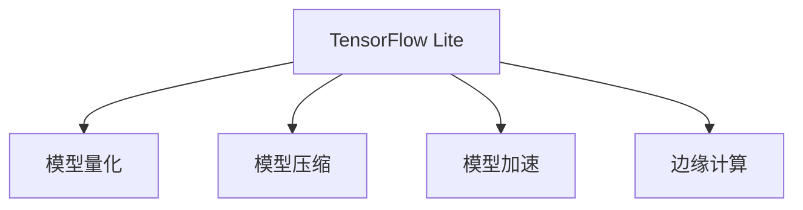

                 

# TensorFlow Lite移动端部署

> 关键词：TensorFlow Lite, 移动端, 模型优化, 量化, 模型压缩, 模型部署, 模型推理, 模型加速, 边缘计算, 实时推理

## 1. 背景介绍

### 1.1 问题由来

随着人工智能的迅猛发展，深度学习模型在各种应用场景中得到了广泛的应用。然而，深度学习模型通常体积庞大、计算复杂，无法直接部署在计算资源有限的移动设备上。同时，传统深度学习模型通常需要较高的能耗，不适用于需要长时间工作的移动设备。为了解决这些问题，研究人员提出了TensorFlow Lite，一种在移动设备上部署深度学习模型的方法。

### 1.2 问题核心关键点

TensorFlow Lite是一种专门为移动端设计的深度学习框架，它可以将训练好的TensorFlow模型转换为可直接在移动设备上运行的形式，同时提供多种优化方法，如量化、模型压缩、模型剪枝等，可以显著降低模型的体积和计算复杂度，同时提高运行效率和能效比。本章节将介绍TensorFlow Lite的基本原理和应用方法，帮助读者更好地理解和应用这一技术。

### 1.3 问题研究意义

TensorFlow Lite能够将深度学习模型部署到移动设备上，使得人工智能应用能够以更灵活、更高效的方式在移动端运行，进一步推动人工智能技术在医疗、交通、智能家居等各个领域的落地应用。同时，TensorFlow Lite的模型优化方法也广泛应用于计算机视觉、自然语言处理、音频识别等领域，为这些领域提供了更快速、更高效的模型推理引擎。

## 2. 核心概念与联系

### 2.1 核心概念概述

为了更好地理解TensorFlow Lite的技术原理和应用方法，本节将介绍几个关键概念：

- **TensorFlow Lite**：TensorFlow Lite是Google开发的一款轻量级深度学习框架，专门为移动设备设计，可以将训练好的TensorFlow模型转换为可在移动设备上运行的TFLite模型。

- **模型量化**：量化是指将浮点运算转换为定点运算，从而降低模型的计算复杂度和内存占用，提高模型的运行效率和能效比。

- **模型压缩**：模型压缩是通过去除冗余参数、剪枝等手段减少模型大小，从而提高模型在移动设备上的部署效率。

- **模型加速**：模型加速是指通过优化模型的计算图、优化算子实现等方式提高模型的运行速度，降低计算延迟。

- **边缘计算**：边缘计算是指将数据处理、模型推理等计算任务放在离终端设备更近的地方进行，从而减少数据传输延迟，提高计算效率。

这些概念之间的关系可以通过以下Mermaid流程图来展示：



## 3. 核心算法原理 & 具体操作步骤

### 3.1 算法原理概述

TensorFlow Lite的原理可以分为两个主要步骤：模型转换和模型优化。

1. **模型转换**：将训练好的TensorFlow模型转换为TensorFlow Lite模型，即TFLite模型。这个过程包括将TensorFlow计算图转换为TFLite计算图，并将计算图中的变量、操作等转换为TFLite操作。

2. **模型优化**：对TFLite模型进行优化，包括量化、剪枝、模型压缩等操作。量化将浮点运算转换为定点运算，降低计算复杂度和内存占用；剪枝和模型压缩则通过去除冗余参数和剪枝操作来减少模型大小。

### 3.2 算法步骤详解

TensorFlow Lite的具体操作步骤如下：

1. **准备模型**：首先需要准备一个训练好的TensorFlow模型。可以是一个已经训练好的图像分类模型、自然语言处理模型等。

2. **转换模型**：使用TensorFlow Lite的转换工具将TensorFlow模型转换为TFLite模型。这个过程包括将模型中的变量、操作等转换为TFLite操作，并将模型保存为TFLite文件。

3. **量化模型**：根据目标设备的硬件特性，选择合适的量化方法对TFLite模型进行量化。量化可以将浮点运算转换为定点运算，从而降低计算复杂度和内存占用。

4. **剪枝和压缩**：对量化后的TFLite模型进行剪枝和压缩操作。剪枝可以通过去除冗余参数来减少模型大小，压缩可以通过优化模型的计算图和算子实现来提高模型的运行效率。

5. **测试和部署**：在目标设备上测试TFLite模型的性能，并进行部署。

### 3.3 算法优缺点

TensorFlow Lite的主要优点包括：

- **轻量级**：TensorFlow Lite模型通常比传统的深度学习模型更轻量级，可以更高效地部署在移动设备上。

- **灵活性**：TensorFlow Lite支持多种模型优化方法，如量化、剪枝、模型压缩等，可以根据实际应用需求进行灵活配置。

- **广泛支持**：TensorFlow Lite支持多种操作系统和硬件平台，如Android、iOS、Raspberry Pi等，适用于各种移动设备和边缘计算环境。

缺点包括：

- **性能损失**：量化和剪枝等操作可能会对模型性能造成一定的损失。

- **复杂性高**：模型优化需要一定的专业知识，需要花费一定的时间和精力进行调整。

- **依赖性强**：TensorFlow Lite依赖于TensorFlow框架，如果目标设备没有安装TensorFlow，需要额外的依赖包。

### 3.4 算法应用领域

TensorFlow Lite广泛应用于以下几个领域：

- **移动端应用**：包括图像识别、语音识别、自然语言处理等，通过TensorFlow Lite可以在移动设备上实现实时推理。

- **边缘计算**：TensorFlow Lite可以部署在嵌入式设备上，如智能家居、汽车、工业设备等，实现实时计算和决策。

- **嵌入式设备**：TensorFlow Lite可以部署在资源有限的嵌入式设备上，如Raspberry Pi、Arduino等，实现机器视觉、智能传感器等功能。

- **人工智能设备**：TensorFlow Lite可以部署在人工智能设备上，如智能音箱、智能家居设备等，实现语音交互、智能控制等功能。

## 4. 数学模型和公式 & 详细讲解 & 举例说明

### 4.1 数学模型构建

TensorFlow Lite的模型构建包括两个步骤：模型定义和模型转换。

1. **模型定义**：使用TensorFlow定义模型，包括模型结构、操作、变量等。可以使用Keras、TensorFlow等框架进行定义。

2. **模型转换**：使用TensorFlow Lite的转换工具将定义好的TensorFlow模型转换为TFLite模型。

### 4.2 公式推导过程

TensorFlow Lite模型的转换过程可以分为以下几个步骤：

1. **计算图转换**：将TensorFlow计算图转换为TFLite计算图。TensorFlow Lite支持多种计算图转换方法，包括使用TFLite Converter工具、使用TensorFlow Lite的API进行转换等。

2. **变量转换**：将TensorFlow变量转换为TFLite变量。TensorFlow Lite支持将变量转换为常量、张量等。

3. **操作转换**：将TensorFlow操作转换为TFLite操作。TensorFlow Lite支持将操作转换为TFLite操作，并保留操作的相关属性。

### 4.3 案例分析与讲解

以图像分类模型为例，介绍TensorFlow Lite模型的构建和转换过程。

首先，定义一个简单的图像分类模型，包含卷积层、池化层、全连接层等操作。

```python
import tensorflow as tf
from tensorflow.keras import layers

model = tf.keras.Sequential([
    layers.Conv2D(32, (3, 3), activation='relu', input_shape=(28, 28, 1)),
    layers.MaxPooling2D((2, 2)),
    layers.Conv2D(64, (3, 3), activation='relu'),
    layers.MaxPooling2D((2, 2)),
    layers.Flatten(),
    layers.Dense(10, activation='softmax')
])
```

然后，使用TensorFlow Lite的转换工具将TensorFlow模型转换为TFLite模型。

```python
converter = tf.lite.TFLiteConverter.from_keras_model(model)
tflite_model = converter.convert()
```

最后，将TFLite模型保存为TFLite文件。

```python
open('model.tflite', 'wb').write(tflite_model)
```

## 5. 项目实践：代码实例和详细解释说明

### 5.1 开发环境搭建

为了使用TensorFlow Lite进行模型优化和部署，首先需要搭建开发环境。以下是在Linux环境下搭建TensorFlow Lite开发环境的步骤：

1. **安装TensorFlow**：在Linux上安装TensorFlow。可以从官方网站下载安装包，或使用以下命令进行安装。

   ```bash
   pip install tensorflow
   ```

2. **安装TensorFlow Lite**：安装TensorFlow Lite的Python库。可以使用以下命令进行安装。

   ```bash
   pip install tensorflow-lite
   ```

3. **安装转换工具**：安装TensorFlow Lite的转换工具。可以使用以下命令进行安装。

   ```bash
   pip install tensorflow-lite-converter
   ```

4. **安装依赖包**：安装必要的依赖包，如OpenCV、numpy等。

   ```bash
   pip install opencv-python numpy
   ```

完成上述步骤后，即可在Python中使用TensorFlow Lite进行模型优化和部署。

### 5.2 源代码详细实现

以下是一个简单的图像分类模型的TensorFlow Lite转换和优化的代码实现。

```python
import tensorflow as tf
import tensorflow_lite as lite
import numpy as np
import cv2

# 加载TFLite模型
interpreter = lite.Interpreter(model_path='model.tflite')
interpreter.allocate_tensors()

# 定义输入输出节点
input_details = interpreter.get_input_details()
output_details = interpreter.get_output_details()

# 加载图像
img = cv2.imread('image.jpg')
img = cv2.resize(img, (28, 28))
img = img.astype(np.float32) / 255.0
img = img.reshape((1, 28, 28, 1))

# 执行推理
interpreter.set_tensor(input_details[0]['index'], img)
interpreter.invoke()
result = interpreter.get_tensor(output_details[0]['index'])

# 输出结果
print(result)
```

### 5.3 代码解读与分析

以上代码展示了如何使用TensorFlow Lite进行图像分类模型的转换和优化。

- **加载模型**：使用`Interpreter`类加载TFLite模型，并分配所需的张量。

- **定义输入输出节点**：获取模型的输入和输出节点信息，包括节点的索引、形状、类型等。

- **加载图像**：使用OpenCV加载图像，并进行预处理，如缩放、归一化等操作。

- **执行推理**：将预处理后的图像输入模型，执行推理操作，并获取模型输出。

- **输出结果**：输出模型的预测结果。

## 6. 实际应用场景

### 6.1 移动端应用

TensorFlow Lite在移动端应用中有着广泛的应用。以下是一个示例，介绍如何在Android设备上部署和使用TensorFlow Lite模型。

1. **创建项目**：在Android Studio中创建一个新的Android项目。

2. **添加依赖**：在项目的`build.gradle`文件中添加TensorFlow Lite的依赖。

   ```gradle
   dependencies {
       implementation 'org.tensorflow:tensorflow-lite:2.7.0'
   }
   ```

3. **加载模型**：在Activity中加载TFLite模型，并进行推理。

   ```java
   import android.graphics.Bitmap;
   import android.os.Bundle;
   import androidx.appcompat.app.AppCompatActivity;
   import org.tensorflow.lite.Interpreter;
   import org.tensorflow.lite.InterpreterFactory;

   public class MainActivity extends AppCompatActivity {
       private static final String MODEL_FILE = "model.tflite";
       private Interpreter interpreter;
       private long interpreterMemory;

       @Override
       protected void onCreate(Bundle savedInstanceState) {
           super.onCreate(savedInstanceState);
           setContentView(R.layout.activity_main);

           // 加载模型
           interpreter = new InterpreterFactory().createFromFile(getFilesDir().getAbsolutePath() + "/" + MODEL_FILE);
           interpreterMemory = interpreter.runner().getMemoryUsage();
       }

       @Override
       protected void onResume() {
           super.onResume();

           // 执行推理
           Bitmap bitmap = BitmapFactory.decodeResource(getResources(), R.drawable.image);
           float[] inputData = new float[1];
           float[] outputData = new float[10];
           interpreter.run(inputData, outputData);

           // 输出结果
           String result = "";
           for (int i = 0; i < outputData.length; i++) {
               result += outputData[i] + " ";
           }
           System.out.println(result);
       }
   }
   ```

### 6.2 边缘计算

TensorFlow Lite在边缘计算中也得到了广泛应用。以下是一个示例，介绍如何在Raspberry Pi上部署和使用TensorFlow Lite模型。

1. **安装Raspberry Pi**：将Raspberry Pi连接到计算机，并连接到网络。

2. **安装TensorFlow Lite**：在Raspberry Pi上安装TensorFlow Lite。可以使用以下命令进行安装。

   ```bash
   sudo apt-get update
   sudo apt-get install python3 python3-tk python3-dev python3-pip python3-numpy
   pip3 install tensorflow-lite
   ```

3. **加载模型**：在Raspberry Pi上加载TFLite模型，并进行推理。

   ```python
   import numpy as np
   import cv2
   import tensorflow_lite as lite

   # 加载模型
   interpreter = lite.Interpreter(model_path='model.tflite')
   interpreter.allocate_tensors()

   # 定义输入输出节点
   input_details = interpreter.get_input_details()
   output_details = interpreter.get_output_details()

   # 加载图像
   img = cv2.imread('image.jpg')
   img = cv2.resize(img, (28, 28))
   img = img.astype(np.float32) / 255.0
   img = img.reshape((1, 28, 28, 1))

   # 执行推理
   interpreter.set_tensor(input_details[0]['index'], img)
   interpreter.invoke()
   result = interpreter.get_tensor(output_details[0]['index'])

   # 输出结果
   print(result)
   ```

## 7. 工具和资源推荐

### 7.1 学习资源推荐

为了帮助开发者系统掌握TensorFlow Lite的技术原理和应用方法，以下是一些优质的学习资源：

1. **TensorFlow Lite官方文档**：TensorFlow Lite的官方文档提供了详细的API文档和教程，是学习和使用TensorFlow Lite的最佳资源。

2. **TensorFlow Lite系列博文**：一篇篇深入浅出的TensorFlow Lite技术博文，涵盖模型转换、模型优化、模型推理等多个方面，是学习TensorFlow Lite的重要资料。

3. **TensorFlow Lite教程**：Google提供的TensorFlow Lite教程，详细介绍了TensorFlow Lite的使用方法和最佳实践，是学习TensorFlow Lite的必备资源。

4. **TensorFlow Lite视频教程**：Google提供的TensorFlow Lite视频教程，涵盖了TensorFlow Lite的基本原理、使用方法和应用场景，是学习TensorFlow Lite的视觉资源。

5. **TensorFlow Lite课程**：Coursera提供的TensorFlow Lite课程，涵盖TensorFlow Lite的基本原理、使用方法和应用场景，是学习TensorFlow Lite的在线资源。

### 7.2 开发工具推荐

为了更好地使用TensorFlow Lite进行模型优化和部署，以下是一些常用的开发工具：

1. **Android Studio**：Android Studio是Google提供的Android开发环境，支持TensorFlow Lite的模型优化和部署。

2. **Raspberry Pi**：Raspberry Pi是一款小型嵌入式设备，支持TensorFlow Lite的模型优化和部署。

3. **TensorBoard**：TensorBoard是TensorFlow的可视化工具，可以实时监测模型训练和推理状态，是调试TensorFlow Lite模型的得力助手。

4. **Model Maker**：Google提供的Model Maker工具，可以方便地构建和优化TensorFlow Lite模型，适合初学者使用。

5. **TFLite Model Maker**：Google提供的TFLite Model Maker工具，可以方便地构建和优化TensorFlow Lite模型，适合初学者使用。

### 7.3 相关论文推荐

TensorFlow Lite的发展得益于大量的学术研究和工程实践。以下是几篇奠基性的相关论文，推荐阅读：

1. **TensorFlow Lite: A lightweight solution for mobile and embedded devices**：介绍TensorFlow Lite的基本原理、设计思路和应用场景。

2. **Optimizing TensorFlow Lite for Mobile and Edge Devices**：介绍TensorFlow Lite的模型优化方法，包括量化、剪枝、模型压缩等。

3. **TensorFlow Lite for Mobile and Embedded Development**：介绍TensorFlow Lite在移动和嵌入式设备上的应用，包括模型转换、模型优化、模型推理等。

4. **Mobile and Edge-Deployed Neural Networks**：介绍移动和嵌入式设备上部署神经网络的最佳实践，包括模型压缩、量化、模型剪枝等。

这些论文代表了大规模深度学习在移动和嵌入式设备上的应用趋势，为TensorFlow Lite的应用提供了理论基础和实践指导。

## 8. 总结：未来发展趋势与挑战

### 8.1 总结

本文对TensorFlow Lite的基本原理、应用方法和技术细节进行了系统介绍。通过介绍TensorFlow Lite的模型转换、模型优化和模型推理，帮助读者更好地理解和应用TensorFlow Lite技术。TensorFlow Lite在移动端、嵌入式设备、边缘计算等多个领域得到了广泛应用，是推动人工智能技术落地的重要工具。

### 8.2 未来发展趋势

未来，TensorFlow Lite将在以下几个方面继续发展：

1. **模型优化**：随着模型优化技术的发展，TensorFlow Lite的模型压缩、量化、剪枝等技术将不断改进，进一步降低模型的体积和计算复杂度。

2. **跨平台支持**：TensorFlow Lite将支持更多的操作系统和硬件平台，如iOS、Windows等，进一步拓展其应用范围。

3. **实时推理**：TensorFlow Lite将进一步优化推理性能，支持更多的实时推理应用场景，如智能家居、自动驾驶等。

4. **边缘计算**：TensorFlow Lite将进一步优化模型推理效率，支持更多的边缘计算应用场景，如工业设备、智能家居等。

5. **人工智能设备**：TensorFlow Lite将进一步优化模型推理性能，支持更多的人工智能设备，如智能音箱、智能家居设备等。

### 8.3 面临的挑战

尽管TensorFlow Lite已经取得了显著进展，但在实际应用中仍面临以下挑战：

1. **性能瓶颈**：由于模型优化和推理优化的方法有限，TensorFlow Lite在处理大规模数据和复杂模型时仍然存在性能瓶颈。

2. **可移植性问题**：不同设备和平台的硬件差异较大，TensorFlow Lite需要进一步优化模型的可移植性，以适应不同的设备特性。

3. **模型隐私保护**：TensorFlow Lite模型需要在设备上进行推理，涉及到模型隐私保护问题，如何保护用户隐私是一个重要问题。

4. **计算资源限制**：TensorFlow Lite模型需要在资源有限的设备上进行推理，如何优化模型的计算资源消耗是一个重要问题。

5. **模型更新和维护**：TensorFlow Lite模型需要不断地更新和维护，以适应新的应用场景和设备特性，如何有效地进行模型更新和维护是一个重要问题。

### 8.4 研究展望

为了应对TensorFlow Lite面临的挑战，未来的研究需要在以下几个方面继续努力：

1. **模型优化技术**：开发更加高效的模型优化技术，如自适应量化、动态剪枝等，进一步降低模型的体积和计算复杂度。

2. **模型可移植性**：开发更加通用的模型可移植性技术，适应不同的设备和平台，提高模型的可移植性和可扩展性。

3. **模型隐私保护**：开发更加安全的模型隐私保护技术，如差分隐私、联邦学习等，保护用户隐私和数据安全。

4. **计算资源优化**：开发更加高效的计算资源优化技术，如计算图优化、硬件加速等，提高模型的计算效率和能效比。

5. **模型更新和维护**：开发更加便捷的模型更新和维护工具，帮助用户快速更新和维护模型，适应新的应用场景和设备特性。

通过在以上几个方面的研究，TensorFlow Lite将进一步拓展其应用范围，推动人工智能技术在更多的领域得到应用。

## 9. 附录：常见问题与解答

**Q1: TensorFlow Lite是否支持所有的深度学习模型？**

A: TensorFlow Lite支持大多数深度学习模型，包括卷积神经网络(CNN)、循环神经网络(RNN)、长短期记忆网络(LSTM)等。但是，TensorFlow Lite对模型的复杂度和计算量有一定的限制，需要根据实际情况进行调整。

**Q2: TensorFlow Lite在移动设备上部署时需要注意哪些问题？**

A: 在移动设备上部署TensorFlow Lite模型时，需要注意以下问题：

1. 模型大小：TensorFlow Lite模型需要尽可能小，以适应移动设备的存储空间。

2. 计算复杂度：TensorFlow Lite模型需要尽可能简单，以适应移动设备的计算能力。

3. 内存占用：TensorFlow Lite模型需要尽可能低，以适应移动设备的内存限制。

4. 实时性：TensorFlow Lite模型需要尽可能快，以适应移动设备的实时性要求。

5. 稳定性：TensorFlow Lite模型需要尽可能稳定，以避免崩溃和异常。

**Q3: 如何优化TensorFlow Lite模型的推理速度？**

A: 优化TensorFlow Lite模型的推理速度需要从多个方面入手，以下是一些常用的方法：

1. 量化：使用量化技术将模型中的浮点运算转换为定点运算，从而降低计算复杂度。

2. 剪枝：使用剪枝技术去除冗余的参数和操作，从而减少模型的计算复杂度。

3. 模型压缩：使用模型压缩技术优化模型的计算图和操作，从而降低模型的计算复杂度。

4. 硬件加速：使用硬件加速技术，如GPU、SIMD等，提高模型的计算效率。

5. 模型并行：使用模型并行技术，将模型的计算任务分布到多个处理器上，提高模型的计算效率。

**Q4: 如何保护TensorFlow Lite模型的隐私？**

A: 保护TensorFlow Lite模型的隐私需要从多个方面入手，以下是一些常用的方法：

1. 差分隐私：使用差分隐私技术，对模型输入数据进行扰动，保护用户隐私。

2. 联邦学习：使用联邦学习技术，在多个设备上训练模型，保护用户隐私和数据安全。

3. 模型加密：使用模型加密技术，对模型进行加密保护，防止模型被窃取和攻击。

4. 模型脱敏：使用模型脱敏技术，对模型进行脱敏处理，保护用户隐私和数据安全。

**Q5: TensorFlow Lite模型在实际应用中需要注意哪些问题？**

A: TensorFlow Lite模型在实际应用中需要注意以下问题：

1. 模型适配：TensorFlow Lite模型需要适配不同的设备和平台，以适应不同的硬件特性。

2. 模型优化：TensorFlow Lite模型需要不断地进行优化和调整，以适应新的应用场景和设备特性。

3. 模型测试：TensorFlow Lite模型需要进行全面的测试，以确保模型的正确性和可靠性。

4. 模型部署：TensorFlow Lite模型需要进行有效的部署和集成，以确保模型的正确性和可靠性。

5. 模型维护：TensorFlow Lite模型需要不断地进行维护和更新，以适应新的应用场景和设备特性。

通过在以上几个方面的研究和应用，TensorFlow Lite将进一步拓展其应用范围，推动人工智能技术在更多的领域得到应用。

---

作者：禅与计算机程序设计艺术 / Zen and the Art of Computer Programming

