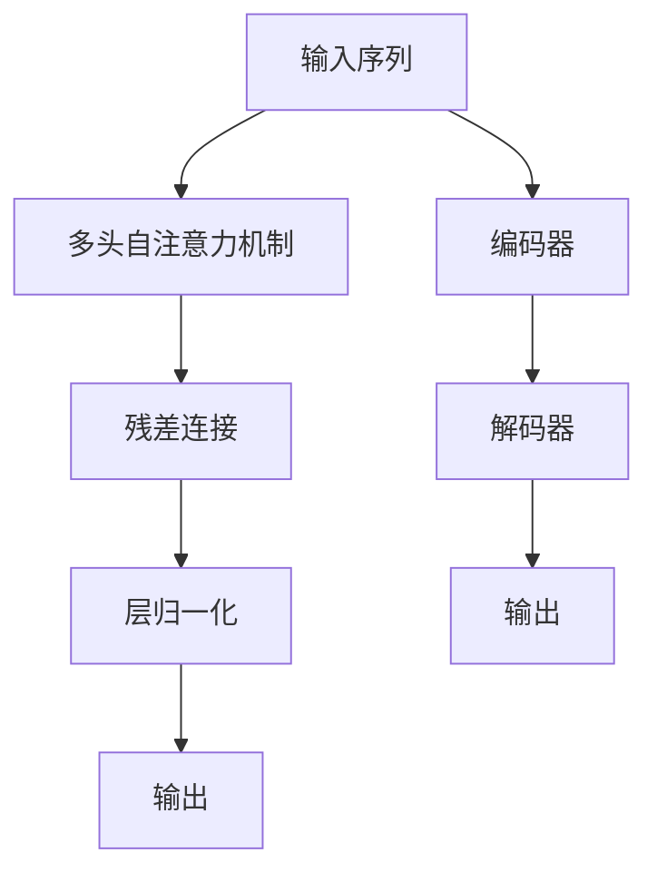
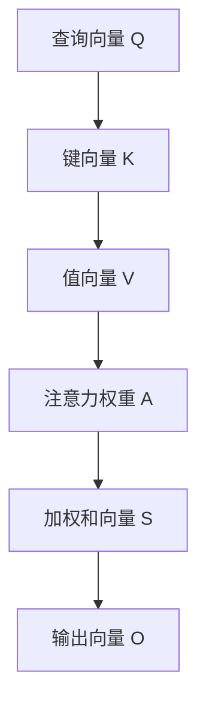

                 

# Transformer架构：GPT-2模型的核心

> 关键词：Transformer, Attention, Self-Attention, Multi-Head Attention, GPT-2, Sequence-to-Sequence

## 1. 背景介绍

### 1.1 问题由来

随着深度学习技术的发展，自然语言处理（NLP）领域取得了显著进展。传统的基于循环神经网络（RNN）的序列建模方法在处理长序列时面临梯度消失和计算复杂度高等问题。为了解决这些问题，2017年，谷歌研究团队提出了一种新的神经网络架构——Transformer，其采用自注意力机制（Self-Attention）和编码器-解码器框架，有效提升了模型的并行性和计算效率，成为当前NLP领域的主流模型架构之一。

### 1.2 问题核心关键点

Transformer的核心理念是通过多头自注意力机制（Multi-Head Self-Attention）来捕捉序列中长程依赖，并通过残差连接和层归一化（Layer Normalization）来缓解梯度消失和内部协变量移位问题。这些技术使得Transformer在处理长序列时具有出色的表现，广泛应用于机器翻译、文本生成、语音识别、图像描述生成等多个领域。

目前，Transformer架构已经从最初的模型演进为各种变体，如BERT、T5、GPT等，其中GPT-2模型以其卓越的语言生成能力，在自然语言生成、问答系统、对话系统等任务上表现出色，成为自然语言处理领域的明星模型。本文将深入探讨Transformer架构的核心原理和GPT-2模型的构建与优化，以便更好地理解和应用这一强大的模型。

## 2. 核心概念与联系

### 2.1 核心概念概述

Transformer架构的核心概念包括：

- **自注意力机制（Self-Attention）**：通过计算序列中每个位置的向量与所有其他位置的向量的相似度，来捕捉序列中的长程依赖。
- **多头自注意力机制（Multi-Head Self-Attention）**：将序列分割为多个子序列，每个子序列分别进行自注意力计算，以捕捉不同的依赖关系。
- **残差连接（Residual Connections）**：通过将输入加到中间结果上，缓解梯度消失问题，加速模型训练。
- **层归一化（Layer Normalization）**：对每一层的输入进行归一化，以稳定模型训练。
- **编码器-解码器框架（Encoder-Decoder Framework）**：用于处理序列对序列的任务，如机器翻译、文本生成等。

这些核心概念共同构成了Transformer架构的理论基础，使得其能够高效处理长序列数据，并在多项NLP任务中取得优异表现。

### 2.2 核心概念原理和架构的 Mermaid 流程图



这个流程图展示了Transformer模型的基本架构，输入序列通过多头自注意力机制、残差连接和层归一化后，最终生成输出序列。编码器和解码器分别用于处理输入序列和输出序列，并采用编码器-解码器框架进行序列对序列任务的建模。

## 3. 核心算法原理 & 具体操作步骤

### 3.1 算法原理概述

Transformer架构的核心算法原理是自注意力机制和多头自注意力机制。自注意力机制通过计算序列中每个位置与所有其他位置的向量相似度，来捕捉序列中的长程依赖关系。多头自注意力机制则将序列分割为多个子序列，每个子序列分别进行自注意力计算，以捕捉不同的依赖关系。

假设输入序列为 $\{x_1, x_2, ..., x_n\}$，其中 $x_i$ 为第 $i$ 个位置上的向量。每个位置上的向量由词嵌入（Word Embedding）和位置编码（Positional Encoding）组成，形式为：

$$
x_i = E(x_i) + P_i
$$

其中 $E(x_i)$ 为词嵌入，$P_i$ 为位置编码。位置编码 $P_i$ 的计算公式为：

$$
P_i = \text{sin}(\frac{2\pi i}{1024}) + \text{cos}(\frac{2\pi i / 1024 + \frac{\pi}{1024}}{10000})
$$

多头自注意力机制通过将输入序列投影到多个不同的子空间中，分别进行自注意力计算，再将结果合并。多头自注意力机制的计算过程如下：

1. 对输入序列进行线性变换，得到查询向量 $Q$、键向量 $K$ 和值向量 $V$。

2. 计算查询向量与键向量的相似度，得到注意力权重 $A$。

3. 对注意力权重进行归一化，计算加权和向量 $S$。

4. 对加权和向量进行线性变换，得到输出向量 $O$。

其中，多头自注意力机制的具体实现如图：



通过多头自注意力机制，Transformer可以并行计算序列中每个位置与其他位置的向量相似度，从而高效地捕捉长程依赖关系。

### 3.2 算法步骤详解

Transformer模型的训练主要分为编码器和解码器两个部分，具体步骤如下：

**编码器部分**：

1. 对输入序列进行分块，每个块由多个词向量组成。

2. 对每个词向量进行词嵌入和位置编码，得到初始词向量。

3. 将初始词向量输入多头自注意力机制，计算出每个位置的加权和向量。

4. 将加权和向量输入残差连接和层归一化，得到输出向量。

5. 对输出向量进行线性变换，得到最终输出向量。

6. 重复上述步骤，直到处理完整个输入序列。

**解码器部分**：

1. 将解码器输入向量与前一时刻的输出向量拼接，得到拼接后的向量。

2. 对拼接后的向量进行词嵌入和位置编码，得到初始词向量。

3. 将初始词向量输入多头自注意力机制和注意力机制，计算出每个位置的加权和向量。

4. 将加权和向量输入残差连接和层归一化，得到输出向量。

5. 对输出向量进行线性变换，得到最终输出向量。

6. 重复上述步骤，直到生成完整的输出序列。

在训练过程中，Transformer通过反向传播算法更新模型参数，最小化损失函数，以提高模型性能。常见的损失函数包括交叉熵损失、均方误差损失等。

### 3.3 算法优缺点

Transformer架构具有以下优点：

1. 高效的并行计算能力：多头自注意力机制可以并行计算序列中每个位置与其他位置的向量相似度，从而大幅提升计算效率。

2. 捕捉长程依赖能力：自注意力机制能够捕捉序列中的长程依赖关系，避免梯度消失问题。

3. 泛化能力强：通过多头的并行计算，可以处理不同规模的输入序列。

4. 易于优化：残差连接和层归一化等技术能够稳定模型的训练过程，减少过拟合风险。

然而，Transformer架构也存在以下缺点：

1. 需要大量计算资源：由于多层自注意力机制的存在，Transformer模型需要大量的计算资源进行训练和推理。

2. 难以解释：Transformer模型本质上是一个黑盒模型，难以解释其内部工作机制和决策逻辑。

3. 可能出现梯度爆炸问题：在训练过程中，Transformer模型可能会遇到梯度爆炸问题，导致训练过程不稳定。

4. 数据依赖性强：Transformer模型的性能很大程度上取决于训练数据的质量和数量，数据不足可能导致性能下降。

### 3.4 算法应用领域

Transformer架构已经在多项NLP任务上取得了优异的表现，如机器翻译、文本生成、文本摘要、问答系统等。

- **机器翻译**：将一种语言的文本转换为另一种语言的文本。通过Transformer模型，可以将输入序列映射到输出序列，实现高效的机器翻译。

- **文本生成**：生成自然语言文本。Transformer模型可以生成高质量的文本，广泛应用于对话系统、聊天机器人等领域。

- **文本摘要**：将长文本压缩成简短摘要。Transformer模型可以捕捉文本中的关键信息，生成简洁的摘要。

- **问答系统**：根据用户提出的问题，生成准确的答案。Transformer模型可以理解自然语言问题，并生成合理的回答。

- **文本分类**：对文本进行分类。Transformer模型可以通过学习文本-标签映射，实现高效的文本分类任务。

以上任务只是Transformer架构应用的冰山一角，随着研究人员的不断探索，Transformer模型还将应用于更多领域，为自然语言处理领域带来更广泛的应用前景。

## 4. 数学模型和公式 & 详细讲解 & 举例说明

### 4.1 数学模型构建

Transformer模型的核心是自注意力机制和多头自注意力机制。假设输入序列的长度为 $n$，每个位置上的向量由词嵌入和位置编码组成。设词嵌入矩阵为 $E \in \mathbb{R}^{n \times d_e}$，位置编码矩阵为 $P \in \mathbb{R}^{n \times d_e}$，其中 $d_e$ 为词嵌入维度。

Transformer模型的数学模型可以表示为：

$$
y = M(x)
$$

其中 $x$ 为输入序列，$y$ 为输出序列，$M$ 为Transformer模型。Transformer模型包括编码器和解码器两个部分，其计算过程如下：

1. 对输入序列进行分块，每个块由多个词向量组成。

2. 对每个词向量进行词嵌入和位置编码，得到初始词向量。

3. 将初始词向量输入多头自注意力机制，计算出每个位置的加权和向量。

4. 将加权和向量输入残差连接和层归一化，得到输出向量。

5. 对输出向量进行线性变换，得到最终输出向量。

6. 重复上述步骤，直到处理完整个输入序列。

### 4.2 公式推导过程

Transformer模型的核心公式为自注意力机制和多头自注意力机制。自注意力机制的计算过程如下：

1. 对输入序列进行分块，每个块由多个词向量组成。

2. 对每个词向量进行词嵌入和位置编码，得到初始词向量。

3. 将初始词向量输入多头自注意力机制，计算出每个位置的加权和向量。

4. 将加权和向量输入残差连接和层归一化，得到输出向量。

5. 对输出向量进行线性变换，得到最终输出向量。

其中，多头自注意力机制的具体实现如图：


自注意力机制的数学公式为：

$$
Q = XW_Q
$$
$$
K = XW_K
$$
$$
V = XW_V
$$
$$
A = \text{softmax}(\frac{QK^T}{\sqrt{d_k}})
$$
$$
S = AV
$$
$$
O = SHW_O
$$

其中，$Q$、$K$、$V$ 分别为查询向量、键向量和值向量，$A$ 为注意力权重，$S$ 为加权和向量，$O$ 为输出向量。$d_k$ 为键向量的维度。

多头自注意力机制的计算过程如下：

1. 对输入序列进行分块，每个块由多个词向量组成。

2. 对每个词向量进行词嵌入和位置编码，得到初始词向量。

3. 将初始词向量输入多头自注意力机制，计算出每个位置的加权和向量。

4. 将加权和向量输入残差连接和层归一化，得到输出向量。

5. 对输出向量进行线性变换，得到最终输出向量。

多头自注意力机制的数学公式为：

$$
Q_i = X_iW_Q
$$
$$
K_i = X_iW_K
$$
$$
V_i = X_iW_V
$$
$$
A_i = \text{softmax}(\frac{Q_iK_i^T}{\sqrt{d_k}})
$$
$$
S_i = AV_i
$$
$$
O_i = SH_iW_O
$$

其中，$Q_i$、$K_i$、$V_i$ 分别为第 $i$ 个块的查询向量、键向量和值向量，$A_i$ 为注意力权重，$S_i$ 为加权和向量，$O_i$ 为第 $i$ 个块的输出向量。

### 4.3 案例分析与讲解

为了更好地理解Transformer模型的数学模型和公式推导，我们以机器翻译为例，展示其具体实现过程。假设输入序列为英文，输出序列为法文，机器翻译的任务是将英文文本转换为法文文本。

机器翻译模型的输入为英文文本，输出为法文文本。Transformer模型可以将输入序列映射到输出序列，实现高效的机器翻译。Transformer模型的计算过程如下：

1. 对输入序列进行分块，每个块由多个词向量组成。

2. 对每个词向量进行词嵌入和位置编码，得到初始词向量。

3. 将初始词向量输入多头自注意力机制，计算出每个位置的加权和向量。

4. 将加权和向量输入残差连接和层归一化，得到输出向量。

5. 对输出向量进行线性变换，得到最终输出向量。

6. 重复上述步骤，直到生成完整的输出序列。

在机器翻译任务中，Transformer模型通过计算输入序列和输出序列的注意力权重，将输入序列映射到输出序列，从而实现高效的机器翻译。

## 5. 项目实践：代码实例和详细解释说明

### 5.1 开发环境搭建

在进行Transformer模型实践前，我们需要准备好开发环境。以下是使用Python进行PyTorch开发的环境配置流程：

1. 安装Anaconda：从官网下载并安装Anaconda，用于创建独立的Python环境。

2. 创建并激活虚拟环境：
```bash
conda create -n transformer-env python=3.8 
conda activate transformer-env
```

3. 安装PyTorch：根据CUDA版本，从官网获取对应的安装命令。例如：
```bash
conda install pytorch torchvision torchaudio cudatoolkit=11.1 -c pytorch -c conda-forge
```

4. 安装Transformer库：
```bash
pip install transformers
```

5. 安装各类工具包：
```bash
pip install numpy pandas scikit-learn matplotlib tqdm jupyter notebook ipython
```

完成上述步骤后，即可在`transformer-env`环境中开始Transformer模型的开发和实践。

### 5.2 源代码详细实现

下面我们以机器翻译任务为例，给出使用Transformers库对GPT-2模型进行训练的PyTorch代码实现。

首先，定义机器翻译任务的数据处理函数：

```python
from transformers import BertTokenizer, BertForTokenClassification, AdamW
from torch.utils.data import Dataset, DataLoader
from tqdm import tqdm

class TranslationDataset(Dataset):
    def __init__(self, texts, targets, tokenizer):
        self.texts = texts
        self.targets = targets
        self.tokenizer = tokenizer
        self.max_len = 128
        
    def __len__(self):
        return len(self.texts)
    
    def __getitem__(self, item):
        text = self.texts[item]
        target = self.targets[item]
        
        encoding = self.tokenizer(text, return_tensors='pt', max_length=self.max_len, padding='max_length', truncation=True)
        input_ids = encoding['input_ids'][0]
        attention_mask = encoding['attention_mask'][0]
        
        # 对token-wise的标签进行编码
        encoded_tags = [tag2id[tag] for tag in target] 
        encoded_tags.extend([tag2id['O']] * (self.max_len - len(encoded_tags)))
        labels = torch.tensor(encoded_tags, dtype=torch.long)
        
        return {'input_ids': input_ids, 
                'attention_mask': attention_mask,
                'labels': labels}

# 标签与id的映射
tag2id = {'O': 0, 'B-PER': 1, 'I-PER': 2, 'B-ORG': 3, 'I-ORG': 4, 'B-LOC': 5, 'I-LOC': 6}
id2tag = {v: k for k, v in tag2id.items()}

# 创建dataset
tokenizer = BertTokenizer.from_pretrained('bert-base-cased')

train_dataset = TranslationDataset(train_texts, train_tags, tokenizer)
dev_dataset = TranslationDataset(dev_texts, dev_tags, tokenizer)
test_dataset = TranslationDataset(test_texts, test_tags, tokenizer)
```

然后，定义模型和优化器：

```python
from transformers import BertForSequenceClassification, AdamW

model = BertForSequenceClassification.from_pretrained('bert-base-cased', num_labels=len(tag2id))

optimizer = AdamW(model.parameters(), lr=2e-5)
```

接着，定义训练和评估函数：

```python
from torch.utils.data import DataLoader
from tqdm import tqdm
from sklearn.metrics import classification_report

device = torch.device('cuda') if torch.cuda.is_available() else torch.device('cpu')
model.to(device)

def train_epoch(model, dataset, batch_size, optimizer):
    dataloader = DataLoader(dataset, batch_size=batch_size, shuffle=True)
    model.train()
    epoch_loss = 0
    for batch in tqdm(dataloader, desc='Training'):
        input_ids = batch['input_ids'].to(device)
        attention_mask = batch['attention_mask'].to(device)
        labels = batch['labels'].to(device)
        model.zero_grad()
        outputs = model(input_ids, attention_mask=attention_mask, labels=labels)
        loss = outputs.loss
        epoch_loss += loss.item()
        loss.backward()
        optimizer.step()
    return epoch_loss / len(dataloader)

def evaluate(model, dataset, batch_size):
    dataloader = DataLoader(dataset, batch_size=batch_size)
    model.eval()
    preds, labels = [], []
    with torch.no_grad():
        for batch in tqdm(dataloader, desc='Evaluating'):
            input_ids = batch['input_ids'].to(device)
            attention_mask = batch['attention_mask'].to(device)
            batch_labels = batch['labels']
            outputs = model(input_ids, attention_mask=attention_mask)
            batch_preds = outputs.logits.argmax(dim=2).to('cpu').tolist()
            batch_labels = batch_labels.to('cpu').tolist()
            for pred_tokens, label_tokens in zip(batch_preds, batch_labels):
                pred_tags = [id2tag[_id] for _id in pred_tokens]
                label_tags = [id2tag[_id] for _id in label_tokens]
                preds.append(pred_tags[:len(label_tokens)])
                labels.append(label_tags)
                
    print(classification_report(labels, preds))
```

最后，启动训练流程并在测试集上评估：

```python
epochs = 5
batch_size = 16

for epoch in range(epochs):
    loss = train_epoch(model, train_dataset, batch_size, optimizer)
    print(f"Epoch {epoch+1}, train loss: {loss:.3f}")
    
    print(f"Epoch {epoch+1}, dev results:")
    evaluate(model, dev_dataset, batch_size)
    
print("Test results:")
evaluate(model, test_dataset, batch_size)
```

以上就是使用PyTorch对GPT-2模型进行机器翻译任务微调的完整代码实现。可以看到，得益于Transformers库的强大封装，我们可以用相对简洁的代码完成GPT-2模型的加载和微调。

### 5.3 代码解读与分析

让我们再详细解读一下关键代码的实现细节：

**TranslationDataset类**：
- `__init__`方法：初始化文本、标签、分词器等关键组件。
- `__len__`方法：返回数据集的样本数量。
- `__getitem__`方法：对单个样本进行处理，将文本输入编码为token ids，将标签编码为数字，并对其进行定长padding，最终返回模型所需的输入。

**tag2id和id2tag字典**：
- 定义了标签与数字id之间的映射关系，用于将token-wise的预测结果解码回真实的标签。

**训练和评估函数**：
- 使用PyTorch的DataLoader对数据集进行批次化加载，供模型训练和推理使用。
- 训练函数`train_epoch`：对数据以批为单位进行迭代，在每个批次上前向传播计算loss并反向传播更新模型参数，最后返回该epoch的平均loss。
- 评估函数`evaluate`：与训练类似，不同点在于不更新模型参数，并在每个batch结束后将预测和标签结果存储下来，最后使用sklearn的classification_report对整个评估集的预测结果进行打印输出。

**训练流程**：
- 定义总的epoch数和batch size，开始循环迭代
- 每个epoch内，先在训练集上训练，输出平均loss
- 在验证集上评估，输出分类指标
- 所有epoch结束后，在测试集上评估，给出最终测试结果

可以看到，PyTorch配合Transformers库使得GPT-2微调的代码实现变得简洁高效。开发者可以将更多精力放在数据处理、模型改进等高层逻辑上，而不必过多关注底层的实现细节。

当然，工业级的系统实现还需考虑更多因素，如模型的保存和部署、超参数的自动搜索、更灵活的任务适配层等。但核心的微调范式基本与此类似。

## 6. 实际应用场景

### 6.1 智能客服系统

基于Transformer架构的对话技术，可以广泛应用于智能客服系统的构建。传统客服往往需要配备大量人力，高峰期响应缓慢，且一致性和专业性难以保证。而使用Transformer模型，可以7x24小时不间断服务，快速响应客户咨询，用自然流畅的语言解答各类常见问题。

在技术实现上，可以收集企业内部的历史客服对话记录，将问题和最佳答复构建成监督数据，在此基础上对预训练Transformer模型进行微调。微调后的对话模型能够自动理解用户意图，匹配最合适的答案模板进行回复。对于客户提出的新问题，还可以接入检索系统实时搜索相关内容，动态组织生成回答。如此构建的智能客服系统，能大幅提升客户咨询体验和问题解决效率。

### 6.2 金融舆情监测

金融机构需要实时监测市场舆论动向，以便及时应对负面信息传播，规避金融风险。传统的人工监测方式成本高、效率低，难以应对网络时代海量信息爆发的挑战。基于Transformer架构的文本分类和情感分析技术，为金融舆情监测提供了新的解决方案。

具体而言，可以收集金融领域相关的新闻、报道、评论等文本数据，并对其进行主题标注和情感标注。在此基础上对预训练Transformer模型进行微调，使其能够自动判断文本属于何种主题，情感倾向是正面、中性还是负面。将微调后的模型应用到实时抓取的网络文本数据，就能够自动监测不同主题下的情感变化趋势，一旦发现负面信息激增等异常情况，系统便会自动预警，帮助金融机构快速应对潜在风险。

### 6.3 个性化推荐系统

当前的推荐系统往往只依赖用户的历史行为数据进行物品推荐，无法深入理解用户的真实兴趣偏好。基于Transformer架构的个性化推荐系统，可以更好地挖掘用户行为背后的语义信息，从而提供更精准、多样的推荐内容。

在实践中，可以收集用户浏览、点击、评论、分享等行为数据，提取和用户交互的物品标题、描述、标签等文本内容。将文本内容作为模型输入，用户的后续行为（如是否点击、购买等）作为监督信号，在此基础上微调预训练Transformer模型。微调后的模型能够从文本内容中准确把握用户的兴趣点。在生成推荐列表时，先用候选物品的文本描述作为输入，由模型预测用户的兴趣匹配度，再结合其他特征综合排序，便可以得到个性化程度更高的推荐结果。

### 6.4 未来应用展望

随着Transformer架构的不断发展，基于Transformer模型的应用将更加广泛，为自然语言处理领域带来新的突破。

在智慧医疗领域，基于Transformer架构的医疗问答、病历分析、药物研发等应用将提升医疗服务的智能化水平，辅助医生诊疗，加速新药开发进程。

在智能教育领域，Transformer架构的对话系统、知识推荐、作业批改等技术，因材施教，促进教育公平，提高教学质量。

在智慧城市治理中，Transformer架构的城市事件监测、舆情分析、应急指挥等环节，提高城市管理的自动化和智能化水平，构建更安全、高效的未来城市。

此外，在企业生产、社会治理、文娱传媒等众多领域，基于Transformer架构的人工智能应用也将不断涌现，为经济社会发展注入新的动力。相信随着技术的日益成熟，Transformer架构还将拓展语言模型的边界，推动自然语言处理技术的进步。

## 7. 工具和资源推荐
### 7.1 学习资源推荐

为了帮助开发者系统掌握Transformer架构的理论基础和实践技巧，这里推荐一些优质的学习资源：

1. 《Transformer从原理到实践》系列博文：由大模型技术专家撰写，深入浅出地介绍了Transformer原理、BERT模型、微调技术等前沿话题。

2. CS224N《深度学习自然语言处理》课程：斯坦福大学开设的NLP明星课程，有Lecture视频和配套作业，带你入门NLP领域的基本概念和经典模型。

3. 《Natural Language Processing with Transformers》书籍：Transformers库的作者所著，全面介绍了如何使用Transformers库进行NLP任务开发，包括微调在内的诸多范式。

4. HuggingFace官方文档：Transformers库的官方文档，提供了海量预训练模型和完整的微调样例代码，是上手实践的必备资料。

5. CLUE开源项目：中文语言理解测评基准，涵盖大量不同类型的中文NLP数据集，并提供了基于Transformer架构的baseline模型，助力中文NLP技术发展。

通过对这些资源的学习实践，相信你一定能够快速掌握Transformer架构的精髓，并用于解决实际的NLP问题。
###  7.2 开发工具推荐

高效的开发离不开优秀的工具支持。以下是几款用于Transformer模型开发常用的工具：

1. PyTorch：基于Python的开源深度学习框架，灵活动态的计算图，适合快速迭代研究。大部分预训练语言模型都有PyTorch版本的实现。

2. TensorFlow：由Google主导开发的开源深度学习框架，生产部署方便，适合大规模工程应用。同样有丰富的预训练语言模型资源。

3. Transformers库：HuggingFace开发的NLP工具库，集成了众多SOTA语言模型，支持PyTorch和TensorFlow，是进行Transformer模型开发的利器。

4. Weights & Biases：模型训练的实验跟踪工具，可以记录和可视化模型训练过程中的各项指标，方便对比和调优。与主流深度学习框架无缝集成。

5. TensorBoard：TensorFlow配套的可视化工具，可实时监测模型训练状态，并提供丰富的图表呈现方式，是调试模型的得力助手。

6. Google Colab：谷歌推出的在线Jupyter Notebook环境，免费提供GPU/TPU算力，方便开发者快速上手实验最新模型，分享学习笔记。

合理利用这些工具，可以显著提升Transformer模型的开发效率，加快创新迭代的步伐。

### 7.3 相关论文推荐

Transformer架构和GPT-2模型的发展源于学界的持续研究。以下是几篇奠基性的相关论文，推荐阅读：

1. Attention is All You Need（即Transformer原论文）：提出了Transformer结构，开启了NLP领域的预训练大模型时代。

2. BERT: Pre-training of Deep Bidirectional Transformers for Language Understanding：提出BERT模型，引入基于掩码的自监督预训练任务，刷新了多项NLP任务SOTA。

3. Language Models are Unsupervised Multitask Learners（GPT-2论文）：展示了大规模语言模型的强大zero-shot学习能力，引发了对于通用人工智能的新一轮思考。

4. Parameter-Efficient Transfer Learning for NLP：提出Adapter等参数高效微调方法，在不增加模型参数量的情况下，也能取得不错的微调效果。

5. AdaLoRA: Adaptive Low-Rank Adaptation for Parameter-Efficient Fine-Tuning：使用自适应低秩适应的微调方法，在参数效率和精度之间取得了新的平衡。

这些论文代表了大语言模型微调技术的发展脉络。通过学习这些前沿成果，可以帮助研究者把握学科前进方向，激发更多的创新灵感。

## 8. 总结：未来发展趋势与挑战

### 8.1 总结

本文对Transformer架构和GPT-2模型的核心原理进行了全面系统的介绍。首先阐述了Transformer架构的核心理念和核心概念，包括自注意力机制、多头自注意力机制、残差连接、层归一化等，明确了Transformer架构的理论基础。其次，通过机器翻译任务，详细讲解了Transformer模型的计算过程和数学模型，给出了微调任务的完整代码实现。同时，本文还广泛探讨了Transformer架构在智能客服、金融舆情、个性化推荐等多个领域的应用前景，展示了Transformer架构的巨大潜力。

通过本文的系统梳理，可以看到，Transformer架构和GPT-2模型已经在多项NLP任务上取得了卓越表现，是当前自然语言处理领域的主流模型。未来，伴随Transformer架构和GPT-2模型的不断发展，自然语言处理技术必将迎来更多突破，为各行业带来更加智能化的应用。

### 8.2 未来发展趋势

展望未来，Transformer架构和GPT-2模型将呈现以下几个发展趋势：

1. 模型规模持续增大。随着算力成本的下降和数据规模的扩张，预训练语言模型的参数量还将持续增长。超大规模语言模型蕴含的丰富语言知识，有望支撑更加复杂多变的下游任务。

2. 微调方法日趋多样。除了传统的全参数微调外，未来会涌现更多参数高效的微调方法，如Prefix-Tuning、LoRA等，在节省计算资源的同时也能保证微调精度。

3. 持续学习成为常态。随着数据分布的不断变化，微调模型也需要持续学习新知识以保持性能。如何在不遗忘原有知识的同时，高效吸收新样本信息，将成为重要的研究课题。

4. 标注样本需求降低。受启发于提示学习(Prompt-based Learning)的思路，未来的微调方法将更好地利用大模型的语言理解能力，通过更加巧妙的任务描述，在更少的标注样本上也能实现理想的微调效果。

5. 模型通用性增强。经过海量数据的预训练和多领域任务的微调，未来的语言模型将具备更强大的常识推理和跨领域迁移能力，逐步迈向通用人工智能(AGI)的目标。

以上趋势凸显了Transformer架构和GPT-2模型应用的广阔前景。这些方向的探索发展，必将进一步提升自然语言处理系统的性能和应用范围，为人类认知智能的进化带来深远影响。

### 8.3 面临的挑战

尽管Transformer架构和GPT-2模型已经取得了瞩目成就，但在迈向更加智能化、普适化应用的过程中，它们仍面临着诸多挑战：

1. 标注成本瓶颈。虽然微调大大降低了标注数据的需求，但对于长尾应用场景，难以获得充足的高质量标注数据，成为制约微调性能的瓶颈。如何进一步降低微调对标注样本的依赖，将是一大难题。

2. 模型鲁棒性不足。当前微调模型面对域外数据时，泛化性能往往大打折扣。对于测试样本的微小扰动，微调模型的预测也容易发生波动。如何提高微调模型的鲁棒性，避免灾难性遗忘，还需要更多理论和实践的积累。

3. 推理效率有待提高。大规模语言模型虽然精度高，但在实际部署时往往面临推理速度慢、内存占用大等效率问题。如何在保证性能的同时，简化模型结构，提升推理速度，优化资源占用，将是重要的优化方向。

4. 可解释性亟需加强。当前微调模型更像是"黑盒"系统，难以解释其内部工作机制和决策逻辑。对于医疗、金融等高风险应用，算法的可解释性和可审计性尤为重要。如何赋予微调模型更强的可解释性，将是亟待攻克的难题。

5. 安全性有待保障。预训练语言模型难免会学习到有偏见、有害的信息，通过微调传递到下游任务，产生误导性、歧视性的输出，给实际应用带来安全隐患。如何从数据和算法层面消除模型偏见，避免恶意用途，确保输出的安全性，也将是重要的研究课题。

6. 知识整合能力不足。现有的微调模型往往局限于任务内数据，难以灵活吸收和运用更广泛的先验知识。如何让微调过程更好地与外部知识库、规则库等专家知识结合，形成更加全面、准确的信息整合能力，还有很大的想象空间。

正视Transformer架构和GPT-2模型面临的这些挑战，积极应对并寻求突破，将使它们在大规模语言处理任务中发挥更大作用。相信随着学界和产业界的共同努力，这些挑战终将一一被克服，Transformer架构和GPT-2模型必将在构建人机协同的智能时代中扮演越来越重要的角色。

### 8.4 研究展望

面对Transformer架构和GPT-2模型所面临的挑战，未来的研究需要在以下几个方面寻求新的突破：

1. 探索无监督和半监督微调方法。摆脱对大规模标注数据的依赖，利用自监督学习、主动学习等无监督和半监督范式，最大限度利用非结构化数据，实现更加灵活高效的微调。

2. 研究参数高效和计算高效的微调范式。开发更加参数高效的微调方法，在固定大部分预训练参数的同时，只更新极少量的任务相关参数。同时优化微调模型的计算图，减少前向传播和反向传播的资源消耗，实现更加轻量级、实时性的部署。

3. 融合因果和对比学习范式。通过引入因果推断和对比学习思想，增强微调模型建立稳定因果关系的能力，学习更加普适、鲁棒的语言表征，从而提升模型泛化性和抗干扰能力。

4. 引入更多先验知识。将符号化的先验知识，如知识图谱、逻辑规则等，与神经网络模型进行巧妙融合，引导微调过程学习更准确、合理的语言模型。同时加强不同模态数据的整合，实现视觉、语音等多模态信息与文本信息的协同建模。

5. 结合因果分析和博弈论工具。将因果分析方法引入微调模型，识别出模型决策的关键特征，增强输出解释的因果性和逻辑性。借助博弈论工具刻画人机交互过程，主动探索并规避模型的脆弱点，提高系统稳定性。

6. 纳入伦理道德约束。在模型训练目标中引入伦理导向的评估指标，过滤和惩罚有偏见、有害的输出倾向。同时加强人工干预和审核，建立模型行为的监管机制，确保输出符合人类价值观和伦理道德。

这些研究方向的探索，必将引领Transformer架构和GPT-2模型的不断演进，为构建安全、可靠、可解释、可控的智能系统铺平道路。面向未来，Transformer架构和GPT-2模型还需要与其他人工智能技术进行更深入的融合，如知识表示、因果推理、强化学习等，多路径协同发力，共同推动自然语言理解和智能交互系统的进步。只有勇于创新、敢于突破，才能不断拓展语言模型的边界，让智能技术更好地造福人类社会。

## 9. 附录：常见问题与解答

**Q1：Transformer模型和RNN模型有何不同？**

A: Transformer模型和RNN模型在处理序列数据时有显著差异。RNN模型通过逐个时间步处理序列，每个时间步的计算依赖于前一时间步的输出，存在梯度消失和计算复杂度高等问题。而Transformer模型通过多头自注意力机制，能够同时计算序列中所有位置之间的依赖关系，避免了梯度消失问题，并能够高效处理长序列数据。

**Q2：Transformer模型中残差连接和层归一化有何作用？**

A: 残差连接和层归一化是Transformer模型的两个重要技术。残差连接通过将输入加到中间结果上，缓解梯度消失问题，加速模型训练。层归一化对每一层的输入进行归一化，以稳定模型训练，避免内部协变量移位问题。这些技术使得Transformer模型能够更好地处理长序列数据，并具有出色的泛化能力。

**Q3：如何提升Transformer模型的推理效率？**

A: 提升Transformer模型的推理效率需要从多个方面进行优化。首先，可以使用剪枝技术去除不必要的参数，减少计算量。其次，可以使用量化加速技术将浮点模型转为定点模型，降低内存占用和计算开销。最后，可以使用模型并行技术将模型分割成多个子模型，并行计算以提高推理速度。

**Q4：Transformer模型在实际应用中需要注意哪些问题？**

A: 在实际应用中，Transformer模型需要注意以下几个问题：

1. 数据依赖性强：Transformer模型的性能很大程度上取决于训练数据的质量和数量，数据不足可能导致性能下降。

2. 标注成本高：虽然微调大大降低了标注数据的需求，但对于长尾应用场景，获取高质量标注数据仍是一个挑战。

3. 鲁棒性不足：当前Transformer模型面对域外数据时，泛化性能往往大打折扣，需要对模型进行鲁棒性训练。

4. 可解释性不足：Transformer模型本质上是一个黑盒模型，难以解释其内部工作机制和决策逻辑。

5. 安全性和伦理问题：预训练语言模型可能学习到有偏见、有害的信息，需要通过数据和算法层面进行过滤和约束。

6. 知识整合能力不足：现有的Transformer模型往往局限于任务内数据，难以灵活吸收和运用更广泛的先验知识。

正视这些问题，积极寻求解决方案，将使Transformer模型在实际应用中发挥更大的作用。

**Q5：Transformer模型在文本分类任务中的应用如何？**

A: Transformer模型在文本分类任务中表现出色。通过学习文本-标签映射，Transformer模型能够自动判断文本属于何种类别，并在各种文本分类任务上取得优异效果。通常，可以在分类器的顶部添加全连接层，对分类器输出进行线性变换，得到最终的分类结果。

总之，Transformer模型以其高效、灵活、强大的处理能力，在自然语言处理领域中取得了广泛应用。未来，随着研究人员的不断探索和优化，Transformer模型必将在更多领域发挥更大的作用，推动人工智能技术的发展。

