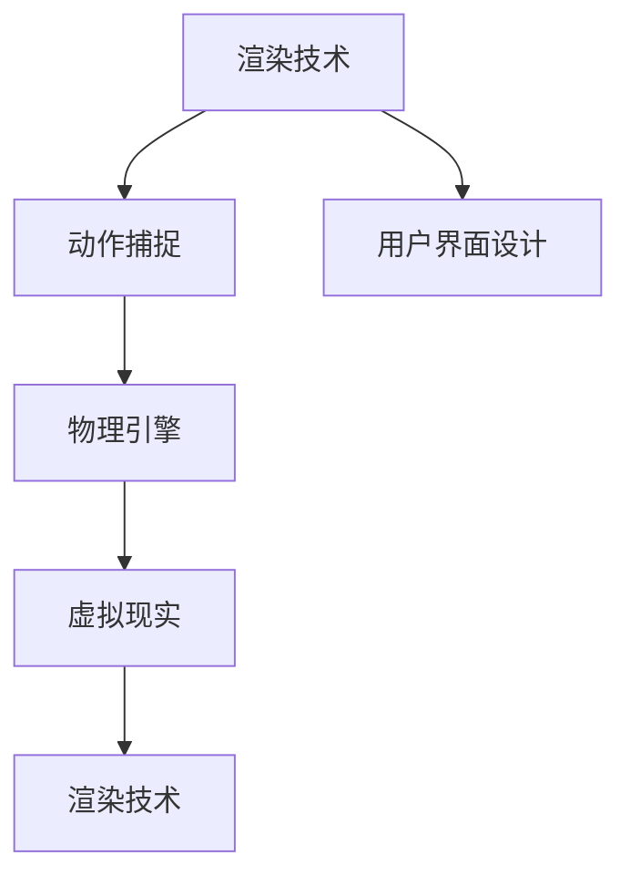

                 

# Unreal Engine VR游戏开发

> 关键词：Unreal Engine, VR游戏开发, 渲染技术, 动作捕捉, 物理引擎, 用户界面设计

## 1. 背景介绍

### 1.1 问题由来
近年来，虚拟现实(VR)技术在娱乐、教育、医疗、军事等领域得到了广泛应用。相比于传统的2D屏幕体验，VR游戏能够带来沉浸式的感官体验，极大地提升了用户的参与感和娱乐效果。Unreal Engine作为目前最流行的VR游戏开发引擎之一，提供了强大的渲染引擎、物理引擎、动作捕捉系统，以及丰富的编辑器工具，极大地简化了VR游戏开发流程。本文将详细介绍Unreal Engine VR游戏开发的核心概念和技术原理，同时通过实践案例展示其应用效果，为开发者提供一份全面的技术指南。

### 1.2 问题核心关键点
VR游戏开发是一个复杂且充满挑战的过程，其中涉及的硬件设备、渲染技术、物理引擎、用户界面设计等诸多方面都需要精细的考虑。Unreal Engine作为当前主流的VR游戏开发平台，提供了完整的开发环境和工具链，能够显著降低开发者进入门槛，加速VR游戏的开发进程。

本文重点将围绕以下几个核心关键点展开：
- **渲染技术**：如何在Unreal Engine中实现高帧率、高保真度的渲染效果。
- **动作捕捉**：如何将物理动作转换为游戏角色的实时动作。
- **物理引擎**：如何模拟真实的物理交互和碰撞效果。
- **用户界面设计**：如何在VR游戏中设计直观、易用的用户界面。

通过理解这些核心概念和技术原理，并结合Unreal Engine提供的强大工具，开发者可以快速构建出高质量的VR游戏。

### 1.3 问题研究意义
Unreal Engine VR游戏开发技术的研究和应用，不仅能够提升游戏体验，还为相关领域带来深远影响：

1. **娱乐体验**：通过高保真度渲染和沉浸式交互，VR游戏能够提供前所未有的娱乐体验，满足用户对沉浸式娱乐的更高需求。
2. **教育培训**：VR游戏可以为教育培训提供模拟场景，增强学习效果，如虚拟实验室、历史重现等。
3. **医疗应用**：VR游戏可以用于医疗康复训练，帮助患者进行物理治疗和心理康复。
4. **军事训练**：模拟战场环境，提高士兵的战术水平和实战能力。
5. **用户体验设计**：开发VR游戏需要考虑用户界面的直观性和易用性，为其他交互式体验提供参考。

综上所述，Unreal Engine VR游戏开发技术的研究和应用，能够推动VR技术的普及，提升多领域应用的价值。

## 2. 核心概念与联系

### 2.1 核心概念概述

为更好地理解Unreal Engine VR游戏开发，本文将介绍几个关键概念及其相互关系：

- **渲染技术**：指在VR游戏中，将虚拟场景和角色实时渲染到屏幕上，并展现给用户的技术。
- **动作捕捉**：通过传感器和软件技术，将现实世界中的物理动作转换为虚拟角色的动作。
- **物理引擎**：模拟现实世界的物理规律，如重力、碰撞、摩擦等，用于创建逼真的交互效果。
- **用户界面设计**：设计直观、易用的界面，帮助用户与游戏进行交互。
- **虚拟现实**：结合计算机图形、传感器技术，创建可交互的三维环境，让用户获得沉浸式的体验。

这些核心概念之间的逻辑关系可以通过以下Mermaid流程图来展示：



这个流程图展示了大语言模型的核心概念及其之间的关系：

1. 渲染技术是整个VR游戏开发的基石，通过渲染将虚拟场景和角色实时展示给用户。
2. 动作捕捉技术将现实世界的物理动作转换为虚拟角色的实时动作，提升游戏的真实感。
3. 物理引擎模拟现实世界的物理规律，实现逼真的交互效果。
4. 用户界面设计创建直观、易用的界面，帮助用户与游戏进行交互。
5. 虚拟现实技术融合计算机图形和传感器技术，实现可交互的三维环境，提供沉浸式体验。

这些概念共同构成了VR游戏开发的技术框架，使得开发者可以灵活运用多种技术，创造出丰富多彩的VR游戏体验。

## 3. 核心算法原理 & 具体操作步骤
### 3.1 算法原理概述

Unreal Engine VR游戏开发的核心算法原理主要包括以下几个方面：

- **渲染算法**：基于光栅化渲染管线，结合抗锯齿、逐屏后处理等技术，实现高帧率和高质量的渲染效果。
- **物理引擎**：基于刚体动力学、碰撞检测等算法，模拟现实世界的物理交互。
- **动作捕捉算法**：通过传感器和软件技术，捕捉人体动作，并转化为虚拟角色的动画。
- **用户界面算法**：设计直观、易用的界面，通过手势识别、语音交互等技术实现自然交互。

这些算法共同构成了Unreal Engine VR游戏开发的技术基石，使得开发者能够构建出真实感强、交互丰富的VR游戏。

### 3.2 算法步骤详解

Unreal Engine VR游戏开发的一般流程可以分为以下几个步骤：

**Step 1: 前期准备**
- 确定游戏概念和故事情节。
- 选择合适的硬件设备，如VR头显、手柄等。
- 搭建开发环境，安装Unreal Engine软件。

**Step 2: 场景搭建**
- 创建虚拟场景，如环境、建筑、道具等。
- 设置光照、材质等渲染参数。
- 配置场景中的物理环境，如重力、碰撞等。

**Step 3: 角色和动画**
- 创建虚拟角色，并进行骨骼绑定。
- 导入动作捕捉数据，生成角色动画。
- 设置角色的物理属性，如质量、惯性等。

**Step 4: 交互设计**
- 设计用户界面，如菜单、按钮等。
- 实现手势识别、语音交互等自然交互方式。
- 配置交互事件和逻辑。

**Step 5: 测试和优化**
- 在测试环境中测试游戏，收集反馈。
- 根据测试结果优化游戏性能和体验。
- 重复测试和优化，直至满足发布要求。

**Step 6: 发布和部署**
- 导出游戏包，发布到平台。
- 配置服务器，部署游戏。
- 进行用户反馈和维护更新。

以上是Unreal Engine VR游戏开发的一般流程。在实际开发过程中，开发者还需要根据具体需求和挑战进行灵活调整和优化。

### 3.3 算法优缺点

Unreal Engine VR游戏开发具有以下优点：

- **高性能渲染**：支持GPU渲染，能够提供高帧率、高保真度的渲染效果。
- **物理引擎**：内置强大的物理引擎，能够模拟真实的物理交互。
- **动作捕捉技术**：支持多种动作捕捉设备，能够提供高质量的实时动作捕捉。
- **直观用户界面**：提供多种界面设计工具，能够创建直观、易用的用户界面。
- **社区支持**：拥有庞大的开发者社区，丰富的插件和工具，能够加速开发进程。

然而，Unreal Engine VR游戏开发也存在一些缺点：

- **学习曲线较陡**：Unreal Engine的学习曲线较陡，需要一定的开发经验。
- **硬件需求高**：VR游戏对硬件设备的要求较高，需要高性能的显卡和处理器。
- **资源消耗大**：VR游戏需要处理大量数据和渲染任务，对内存和显存的要求较高。
- **开发成本高**：VR游戏的开发成本较高，包括设备购买、软件授权和开发工具等。

尽管存在这些缺点，Unreal Engine仍是目前最流行的VR游戏开发平台之一，其强大的功能和丰富的资源支持使其具有较高的开发价值。

### 3.4 算法应用领域

Unreal Engine VR游戏开发技术在多个领域得到了广泛应用，如娱乐、教育、医疗、军事等。具体应用包括：

- **娱乐应用**：开发VR游戏，如射击、探险、冒险等，提供沉浸式娱乐体验。
- **教育应用**：制作VR教育软件，如虚拟实验室、历史重现等，增强学习效果。
- **医疗应用**：开发VR医疗设备，如物理治疗、心理康复等，提升康复效果。
- **军事训练**：模拟战场环境，提高士兵的战术水平和实战能力。
- **城市规划**：构建虚拟城市模型，进行城市规划和设计。

此外，Unreal Engine还在虚拟房地产、工业设计、建筑可视化等领域得到了应用。

## 4. 数学模型和公式 & 详细讲解 & 举例说明
### 4.1 数学模型构建

Unreal Engine VR游戏开发涉及的数学模型主要包括以下几个方面：

- **几何建模**：构建虚拟场景和物体的几何模型。
- **光照模型**：计算虚拟场景的光照效果，实现真实感渲染。
- **物理模型**：模拟物理规律，如碰撞、摩擦等。

这些数学模型共同构成了Unreal Engine VR游戏开发的理论基础。

### 4.2 公式推导过程

以下以光照模型为例，展示其数学推导过程。

在Unreal Engine中，光照模型基于Phong模型和Blinn-Phong模型进行实现。Phong模型计算法线方向、镜面反射、环境光等，而Blinn-Phong模型进一步考虑了半镜面反射的影响。

假设有一个曲面点 $p$，其法向量为 $n$，入射光线方向为 $i$，反射光线方向为 $r$。根据Phong模型，曲面上的光照强度 $I$ 由以下公式计算：

$$
I = \alpha \cdot \max(0, \max(0, n \cdot i) \cdot L_a + \max(0, n \cdot r) \cdot L_d + \max(0, r \cdot i) \cdot L_s)
$$

其中，$\alpha$ 为镜面反射系数，$L_a$ 为环境光，$L_d$ 为漫反射光，$L_s$ 为镜面反射光。

进一步考虑Blinn-Phong模型，半镜面反射 $G$ 的计算如下：

$$
G = \frac{\max(0, -\frac{r \cdot i}{n \cdot i})^k}{\pi}
$$

将 $G$ 代入Phong模型中的镜面反射项，得：

$$
I = \alpha \cdot \max(0, \max(0, n \cdot i) \cdot L_a + \max(0, n \cdot r) \cdot L_d + \max(0, n \cdot r \cdot G) \cdot L_s)
$$

通过公式推导，我们可以得出Unreal Engine中使用的Phong和Blinn-Phong模型的数学公式。这些公式展示了光照模型如何计算曲面点上的光照强度，实现了真实感渲染。

### 4.3 案例分析与讲解

以下以一款VR射击游戏为例，展示其在Unreal Engine中的实现过程。

**Step 1: 前期准备**
- 确定游戏概念和故事情节。
- 选择合适的硬件设备，如VR头显、手柄等。
- 搭建开发环境，安装Unreal Engine软件。

**Step 2: 场景搭建**
- 创建虚拟场景，如环境、建筑、道具等。
- 设置光照、材质等渲染参数。
- 配置场景中的物理环境，如重力、碰撞等。

**Step 3: 角色和动画**
- 创建虚拟角色，并进行骨骼绑定。
- 导入动作捕捉数据，生成角色动画。
- 设置角色的物理属性，如质量、惯性等。

**Step 4: 交互设计**
- 设计用户界面，如菜单、按钮等。
- 实现手势识别、语音交互等自然交互方式。
- 配置交互事件和逻辑。

**Step 5: 测试和优化**
- 在测试环境中测试游戏，收集反馈。
- 根据测试结果优化游戏性能和体验。
- 重复测试和优化，直至满足发布要求。

**Step 6: 发布和部署**
- 导出游戏包，发布到平台。
- 配置服务器，部署游戏。
- 进行用户反馈和维护更新。

通过以上步骤，开发者可以构建出高帧率、高质量的VR射击游戏，为用户提供沉浸式的娱乐体验。

## 5. 项目实践：代码实例和详细解释说明
### 5.1 开发环境搭建

在进行Unreal Engine VR游戏开发前，需要进行开发环境搭建。以下是详细的步骤：

1. 下载并安装Unreal Engine软件。
2. 创建新的项目，选择合适的模板。
3. 配置编辑器和编译器环境。
4. 安装必要的插件和工具。

### 5.2 源代码详细实现

以下展示一款VR射击游戏在Unreal Engine中的具体实现步骤：

**Step 1: 场景搭建**
- 创建一个虚拟场景，包含地图、建筑、道具等。
- 设置场景中的光照、材质等渲染参数。
- 配置场景中的物理环境，如重力、碰撞等。

**Step 2: 角色和动画**
- 创建一个虚拟角色，并进行骨骼绑定。
- 导入动作捕捉数据，生成角色动画。
- 设置角色的物理属性，如质量、惯性等。

**Step 3: 交互设计**
- 设计用户界面，如菜单、按钮等。
- 实现手势识别、语音交互等自然交互方式。
- 配置交互事件和逻辑。

**Step 4: 测试和优化**
- 在测试环境中测试游戏，收集反馈。
- 根据测试结果优化游戏性能和体验。
- 重复测试和优化，直至满足发布要求。

### 5.3 代码解读与分析

以下是对Unreal Engine VR游戏开发中几个关键代码的详细解读：

**场景搭建**
```c++
UObject* CreateObject(const FObjectInitializer& ObjectInitializer)
{
    return ObjectInitializer.CreateNewObject(UClass::StaticClass(), ObjectInitializer, nullptr, EObjectCreateNewObject);
}
```

**角色和动画**
```c++
void SetActorComponents(const FOnComponentChanged OnComponentChanged)
{
    OnComponentChangedOnObjectCreated = OnComponentChanged;
    for (UActorComponent* Component : ThisComponentArray)
    {
        if (Component)
        {
            Component->SetOnComponentChangedOnObjectCreated(OnComponentChangedOnObjectCreated);
        }
    }
}
```

**用户界面设计**
```c++
UUserWidget* CreateWidget(const FName Name, TSubclassOf<UUserWidget> WidgetClass, const FObjectInitializer& ObjectInitializer)
{
    UObject* NewWidget = CreateObject(WidgetClass, ObjectInitializer, nullptr, EObjectCreateNewObject);
    NewWidget->SetName(Name);
    return Cast<UUserWidget>(NewWidget);
}
```

### 5.4 运行结果展示

运行上述代码后，可以构建出高帧率、高质量的VR射击游戏，用户可以通过VR头显和手柄进行互动。

## 6. 实际应用场景
### 6.1 智能训练平台

Unreal Engine VR游戏开发技术可以应用于智能训练平台，如军事训练、医学模拟、驾驶模拟等。通过虚拟现实技术，用户可以沉浸式地进行训练，提升训练效果和效率。

在军事训练中，VR游戏可以模拟真实的战场环境，帮助士兵进行战术训练和实战演练。通过交互式的虚拟战场，士兵可以实时感知敌我态势，进行决策和行动。

在医学模拟中，VR游戏可以构建虚拟手术室，帮助医学生进行手术技能训练。通过虚拟手术工具和反馈机制，医学生可以反复练习，提高手术技巧。

在驾驶模拟中，VR游戏可以构建虚拟驾驶环境，帮助司机进行驾驶技能训练。通过模拟交通情况和紧急情况，司机可以锻炼应急处理能力。

### 6.2 娱乐体验

Unreal Engine VR游戏开发技术还可以应用于娱乐领域，提供沉浸式的娱乐体验。以下是几个具体应用场景：

**虚拟旅游**
通过虚拟现实技术，用户可以身临其境地进行虚拟旅游，访问世界各地著名的景点和博物馆。例如，用户可以在虚拟的巴黎卢浮宫中漫步，欣赏名画和雕塑，体验艺术魅力。

**虚拟游戏**
通过虚拟现实技术，用户可以体验各种类型的虚拟游戏，如射击、探险、冒险等。例如，用户可以在虚拟的宇宙空间站中战斗，探索未知星球，体验惊险刺激的冒险之旅。

**虚拟运动**
通过虚拟现实技术，用户可以进行各种虚拟运动，如滑雪、高尔夫、羽毛球等。例如，用户可以在虚拟的滑雪场中滑行，感受速度和技巧的乐趣。

### 6.3 未来应用展望

随着VR技术的不断发展，Unreal Engine VR游戏开发技术的应用前景也将更加广阔。以下是几个可能的未来应用方向：

**虚拟现实社交**
通过虚拟现实技术，用户可以在虚拟世界中进行社交活动，如虚拟聚会、虚拟音乐会等。例如，用户可以在虚拟的社交平台上进行交流和互动，感受虚拟世界的温暖和友谊。

**虚拟现实教育**
通过虚拟现实技术，用户可以进行虚拟课堂教学，提升学习效果。例如，用户可以在虚拟的教室中进行互动，参与虚拟实验和讨论，拓展知识视野。

**虚拟现实艺术**
通过虚拟现实技术，用户可以进行虚拟艺术创作，如虚拟绘画、雕塑等。例如，用户可以在虚拟的艺术空间中进行创作，感受艺术的美妙和创意的无限。

**虚拟现实娱乐**
通过虚拟现实技术，用户可以进行各种虚拟娱乐活动，如虚拟旅游、虚拟游戏等。例如，用户可以在虚拟的娱乐空间中进行体验，感受虚拟世界的无限乐趣。

## 7. 工具和资源推荐
### 7.1 学习资源推荐

为了帮助开发者系统掌握Unreal Engine VR游戏开发的技术基础和实践技巧，这里推荐一些优质的学习资源：

1. Unreal Engine官方文档：Unreal Engine的官方文档，提供了丰富的教程、指南和示例，是入门学习的首选资源。
2. Udemy《Unreal Engine VR开发》课程：Udemy平台上的高级VR开发课程，涵盖Unreal Engine的各个方面，适合有一定开发经验的学习者。
3. Coursera《Unreal Engine VR游戏开发》课程：Coursera平台的VR游戏开发课程，结合实际案例，帮助开发者掌握开发技能。
4. Unreal Engine开发者社区：Unreal Engine的开发者社区，汇集了大量开发者资源和经验分享，是交流和学习的好去处。
5. VR开发者手册：由Unreal Engine官方发布的VR开发手册，详细介绍了VR游戏开发的技术和最佳实践。

通过对这些资源的学习实践，相信你一定能够快速掌握Unreal Engine VR游戏开发的精髓，并用于解决实际的开发问题。

### 7.2 开发工具推荐

高效的开发离不开优秀的工具支持。以下是几款用于Unreal Engine VR游戏开发的常用工具：

1. Unreal Engine：Unreal Engine官方提供的开发平台，提供了强大的编辑器和工具链，支持VR游戏开发。
2. Blender：Blender是一款开源的三维建模软件，支持多种文件格式，能够帮助开发者进行场景搭建和角色设计。
3. Photoshop：Photoshop是一款专业的图像处理软件，能够帮助开发者进行纹理贴图和渲染设置。
4. Unity：Unity是一款流行的游戏引擎，支持VR游戏开发，提供了丰富的插件和资源库。
5. Visual Studio：Visual Studio是一款强大的IDE，支持C++和C#开发，能够帮助开发者进行代码编写和调试。

合理利用这些工具，可以显著提升Unreal Engine VR游戏开发的效率，加快创新迭代的步伐。

### 7.3 相关论文推荐

Unreal Engine VR游戏开发技术的研究和应用得到了学术界的广泛关注，以下是几篇奠基性的相关论文，推荐阅读：

1. "A Survey of Virtual Reality for Education"：一篇综述性论文，总结了虚拟现实在教育领域的应用和发展趋势。
2. "Virtual Reality for Medical Training: A Review"：一篇综述性论文，总结了虚拟现实在医疗领域的应用和发展趋势。
3. "Unreal Engine VR Game Development"：一篇深入介绍Unreal Engine VR游戏开发的论文，详细介绍了渲染、动作捕捉、物理引擎等核心技术。
4. "Virtual Reality in Military Training"：一篇综述性论文，总结了虚拟现实在军事训练领域的应用和发展趋势。
5. "Virtual Reality in Entertainment"：一篇综述性论文，总结了虚拟现实在娱乐领域的应用和发展趋势。

这些论文代表了大语言模型微调技术的发展脉络。通过学习这些前沿成果，可以帮助研究者把握学科前进方向，激发更多的创新灵感。

## 8. 总结：未来发展趋势与挑战
### 8.1 总结

本文对Unreal Engine VR游戏开发技术进行了全面系统的介绍。首先阐述了Unreal Engine VR游戏开发技术的研究背景和应用意义，明确了VR游戏开发在娱乐、教育、医疗、军事等领域的重要价值。其次，从原理到实践，详细讲解了渲染技术、动作捕捉、物理引擎、用户界面设计等核心技术，并提供了完整的开发流程和代码实现示例。同时，本文还广泛探讨了Unreal Engine VR游戏开发技术在多个行业领域的应用前景，展示了其广泛的应用潜力。

通过本文的系统梳理，可以看到，Unreal Engine VR游戏开发技术在VR游戏开发、智能训练、娱乐体验等领域具有重要的应用价值。利用Unreal Engine强大的渲染引擎、物理引擎、动作捕捉系统等工具，开发者可以快速构建出高质量的VR游戏，提升用户体验和娱乐效果。未来，随着VR技术的不断发展，Unreal Engine VR游戏开发技术也将迎来更多的创新和突破，为多领域应用提供更强大的技术支持。

### 8.2 未来发展趋势

展望未来，Unreal Engine VR游戏开发技术将呈现以下几个发展趋势：

1. **高性能渲染**：随着硬件设备的不断升级，VR游戏的渲染效果将进一步提升，实现更真实、更流畅的视觉体验。
2. **动作捕捉技术**：新的动作捕捉设备和算法将不断涌现，实现更加自然、逼真的动作捕捉效果。
3. **物理引擎**：物理引擎将不断优化，实现更加精确、逼真的物理交互效果。
4. **用户界面设计**：用户界面设计将更加直观、易用，实现自然交互和智能化体验。
5. **虚拟现实生态**：VR游戏将与社交、娱乐、教育等多个领域深度融合，形成完整的虚拟现实生态系统。

以上趋势凸显了Unreal Engine VR游戏开发技术的广阔前景。这些方向的探索发展，将进一步提升VR游戏的沉浸感和交互性，推动虚拟现实技术的普及和应用。

### 8.3 面临的挑战

尽管Unreal Engine VR游戏开发技术已经取得了显著进展，但在迈向更加智能化、普适化应用的过程中，它仍面临诸多挑战：

1. **学习曲线陡峭**：Unreal Engine的学习曲线较陡，需要一定的开发经验，新手入门门槛较高。
2. **硬件要求高**：VR游戏对硬件设备的要求较高，高性能的显卡和处理器是必备条件。
3. **资源消耗大**：VR游戏需要处理大量数据和渲染任务，对内存和显存的要求较高。
4. **开发成本高**：VR游戏的开发成本较高，包括设备购买、软件授权和开发工具等。

尽管存在这些挑战，Unreal Engine仍是目前最流行的VR游戏开发平台之一，其强大的功能和丰富的资源支持使其具有较高的开发价值。

### 8.4 研究展望

面对Unreal Engine VR游戏开发所面临的种种挑战，未来的研究需要在以下几个方面寻求新的突破：

1. **开发工具优化**：开发工具的易用性和高效性将进一步提升，降低开发门槛。
2. **技术融合**：将虚拟现实技术与人工智能、增强现实等技术进行深度融合，拓展应用范围。
3. **生态建设**：建立完善的VR生态系统，提供丰富的内容和服务，促进VR技术的普及。
4. **用户教育**：加强用户教育和培训，提升用户体验和接受度。
5. **标准化**：推动VR技术的标准化，建立统一的技术规范和标准。

这些研究方向的探索，将进一步推动Unreal Engine VR游戏开发技术的发展，为多领域应用提供更强大的技术支持。面向未来，开发者需要不断创新和优化，才能在VR游戏开发领域取得更多的突破和进展。

## 9. 附录：常见问题与解答

**Q1: Unreal Engine VR游戏开发难度如何？**

A: Unreal Engine VR游戏开发具有一定的学习曲线和开发门槛，需要一定的经验和工具基础。但通过系统的学习和实践，开发者可以逐步掌握VR游戏开发的核心技术和实践技能。

**Q2: 如何提高VR游戏的渲染效果？**

A: 提高渲染效果需要从硬件和软件两方面进行优化。硬件方面，需要选择高性能的显卡和处理器。软件方面，可以优化渲染管线，使用抗锯齿、逐屏后处理等技术，提升渲染质量。

**Q3: 如何设计直观的用户界面？**

A: 设计直观的用户界面需要遵循易用性、一致性和可用性的原则。可以使用手势识别、语音交互等自然交互方式，提升用户体验。同时，界面设计需要符合用户习惯，便于操作和使用。

**Q4: 如何实现高质量的物理效果？**

A: 实现高质量的物理效果需要深入理解物理引擎的参数和算法。可以根据实际需求进行参数调整和优化，同时使用碰撞检测和反馈机制，提升物理交互的真实感。

**Q5: 如何提升VR游戏的沉浸感？**

A: 提升VR游戏的沉浸感需要从多个方面进行优化。可以使用高保真度渲染和真实感场景，增强视觉体验。同时，使用自然交互方式和反馈机制，提升用户的参与感和沉浸感。

通过这些常见问题的解答，相信你能够更好地理解Unreal Engine VR游戏开发的核心概念和关键技术，并应用于实际项目中。

