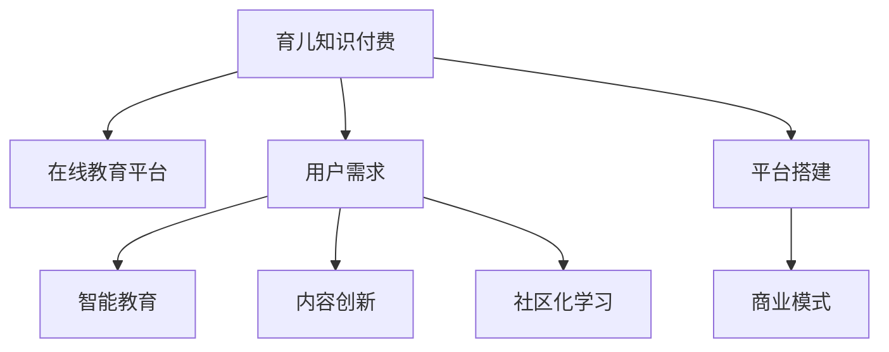

                 

# parenthood育儿知识付费市场前景广阔

> 关键词：育儿知识付费,在线教育,市场分析,用户需求,技术创新,智能教育,内容创新,社区化学习,平台搭建,商业模式

## 1. 背景介绍

### 1.1 问题由来
随着社会的发展和家庭结构的变化，育儿成为家庭关注的重点，尤其是0-3岁的儿童早期教育。根据国家统计局的数据，我国有近14亿人口，其中约有2亿儿童，其中3岁及以下的儿童数量超过1亿。这一庞大的群体，伴随着日益提升的育儿质量要求，催生出巨大的育儿市场。然而，传统的育儿知识获取渠道如书籍、电视节目、线下课程等，已难以满足现代家长的需求。

育儿知识付费市场的出现，正是这一背景下的产物。借助互联网技术，家长可以更便捷、高效地获取到个性化、专业化的育儿知识，从而帮助孩子健康成长。

### 1.2 问题核心关键点
育儿知识付费市场主要关注以下几个核心关键点：

- **内容质量**：这是最核心的需求。家长愿意为高质量、专业化、科学化的育儿知识付费。
- **便捷性**：育儿知识付费平台需要提供高效、便捷的使用体验，支持语音搜索、智能推荐等功能。
- **社区互动**：育儿过程中，家长与家长之间存在大量的交流需求。平台需要提供交流的渠道，形成社区化的学习氛围。
- **个性化推荐**：每个孩子的成长路径不同，育儿知识付费平台需要根据孩子的特点，提供个性化推荐。
- **多维度教育**：育儿不仅仅是知识传授，还包括心理、行为、情感等多维度的引导。平台需要提供全方位的教育内容。

这些关键点构成了育儿知识付费市场的核心需求，也是平台需要重点关注的方向。

## 2. 核心概念与联系

### 2.1 核心概念概述

为了更好地理解育儿知识付费市场的运行机制，本节将介绍几个核心概念：

- **育儿知识付费**：指家长为获取专业育儿知识，向平台或个人支付费用的市场模式。家长通过订阅服务、购买课程、参与互动等方式，获得个性化、专业化的育儿指导。
- **在线教育平台**：利用互联网技术，提供在线课程、学习工具、互动社区等服务，支持用户自主学习和交流的平台。
- **用户需求**：家长对高质量育儿知识的需求，包括但不限于科学育儿、营养健康、心理发展等方面的知识。
- **智能教育**：利用人工智能技术，如自然语言处理、语音识别、数据分析等，提供个性化、智能化的教育服务。
- **内容创新**：通过多媒体、互动、游戏化等创新方式，提升用户体验，增加教育内容的趣味性和有效性。
- **社区化学习**：借助社交网络和论坛，形成家长之间的交流与互动，共同分享育儿经验，形成社区化学习氛围。

这些核心概念之间的逻辑关系可以通过以下Mermaid流程图来展示：



这个流程图展示出育儿知识付费市场的核心概念及其之间的关系：

1. 育儿知识付费是服务提供的总称，在线教育平台是具体的服务形式。
2. 用户需求是服务的核心驱动力，智能教育和内容创新是提升用户体验的关键手段。
3. 社区化学习有助于形成良好的交流氛围，提升用户粘性和满意度。
4. 平台搭建和商业模式是实现服务的有力支撑。

这些概念共同构成了育儿知识付费市场的完整体系，形成了一个动态发展的生态系统。

## 3. 核心算法原理 & 具体操作步骤
### 3.1 算法原理概述

育儿知识付费市场主要依赖于在线教育平台和人工智能技术，通过智能推荐算法和社区互动系统，为用户提供个性化、互动化的学习体验。其核心算法原理主要包括：

- **个性化推荐算法**：根据用户的浏览历史、互动行为、孩子特点等，为用户推荐最相关的育儿内容。
- **社区互动算法**：通过社交网络分析，识别出话题、兴趣相似的家长，形成交流群组。
- **语音识别与自然语言处理**：利用语音识别技术，将家长的语音转换成文字，进行理解和分析。自然语言处理技术用于分析文本内容，提供精准的育儿建议。

### 3.2 算法步骤详解

育儿知识付费市场的算法步骤主要分为以下几个环节：

1. **数据采集**：收集用户的历史浏览记录、互动数据、孩子的基本信息等，为推荐算法和社区分析提供数据支持。
2. **数据处理与分析**：利用数据分析技术，对用户行为进行建模，提取有用的特征。
3. **个性化推荐**：基于用户的特征和行为，利用机器学习算法（如协同过滤、深度学习等），为用户推荐最相关的育儿内容。
4. **社区互动**：通过社交网络分析，识别话题相似的家长，形成交流群组，增强用户粘性。
5. **智能教育**：利用语音识别和自然语言处理技术，提升用户与平台间的互动体验。

### 3.3 算法优缺点

育儿知识付费市场的主要算法具有以下优点：

- **个性化推荐**：通过算法推荐，用户可以获得高度相关的育儿知识，提高学习效率。
- **社区互动**：形成社区化学习氛围，增强用户粘性，提供交流平台。
- **语音识别与自然语言处理**：提升用户体验，增强互动性。

然而，这些算法也存在一些缺点：

- **数据隐私**：家长和孩子的基本信息需要被采集和分析，可能会引发数据隐私问题。
- **算法偏见**：推荐算法和社交网络分析可能存在偏见，导致某些内容被过度推荐或忽视。
- **智能程度有限**：当前的人工智能技术尚无法完全替代人工育儿专家的指导，家长可能需要结合多个渠道获取育儿知识。
- **技术复杂性**：实现个性化推荐、社区互动等功能的算法和系统，技术复杂度较高，需要专业团队开发和维护。

### 3.4 算法应用领域

育儿知识付费市场的算法主要应用于以下几个领域：

- **在线课程推荐**：根据家长的需求，推荐最相关的育儿课程和书籍。
- **健康营养指导**：通过分析孩子的饮食数据，提供个性化的营养建议。
- **心理发展咨询**：利用自然语言处理技术，识别孩子的心理状态，提供心理咨询和建议。
- **行为习惯培养**：通过数据分析和机器学习，为孩子提供科学的行为习惯培养方案。
- **早教游戏推荐**：根据孩子的年龄段和兴趣，推荐合适的早教游戏，提升早期教育效果。

这些领域的应用，使得育儿知识付费市场具备了广泛的应用前景，同时也展示了人工智能技术的强大潜力。

## 4. 数学模型和公式 & 详细讲解  
### 4.1 数学模型构建

育儿知识付费市场的核心算法依赖于机器学习和数据分析，以下将通过数学语言对这些算法进行更加严格的刻画。

假设用户数量为 $U$，育儿内容数量为 $C$，每个用户的历史行为数据表示为 $X$，每个内容的用户评分表示为 $Y$。则用户和内容之间的评分矩阵为 $M$。

定义用户行为预测模型为 $f(X)$，内容推荐模型为 $g(C)$，社交网络分析模型为 $h(U)$。

### 4.2 公式推导过程

以下推导用户行为预测模型 $f(X)$ 的数学公式：

假设用户的历史行为数据为 $X = (x_1, x_2, ..., x_n)$，每个行为对应的内容为 $C = (c_1, c_2, ..., c_n)$。用户对内容的评分矩阵为 $M = (m_{ij})_{U \times C}$，其中 $m_{ij}$ 表示用户 $i$ 对内容 $j$ 的评分。

用户行为预测模型 $f(X)$ 可以表示为：

$$
f(X) = \sum_{i=1}^{U} \sum_{j=1}^{C} x_i \times m_{ij}
$$

将上述公式代入，可以得到用户行为预测的数学表达式：

$$
f(X) = \sum_{i=1}^{U} \sum_{j=1}^{C} x_i \times m_{ij}
$$

类似地，内容推荐模型 $g(C)$ 可以表示为：

$$
g(C) = \sum_{i=1}^{U} \sum_{j=1}^{C} m_{ij} \times \hat{x}_j
$$

其中 $\hat{x}_j$ 表示内容 $j$ 的用户评分。

社交网络分析模型 $h(U)$ 可以表示为：

$$
h(U) = \sum_{i=1}^{U} \sum_{j=1}^{U} A_{ij} \times \frac{1}{\sqrt{d_i d_j}}
$$

其中 $A$ 表示用户之间的相似度矩阵，$d_i$ 和 $d_j$ 分别表示用户 $i$ 和用户 $j$ 的邻居数量。

### 4.3 案例分析与讲解

以下将通过一个具体的案例，分析育儿知识付费市场中的用户行为预测模型。

假设有一个育儿知识付费平台，包含10个用户和20个育儿内容。每个用户的历史行为数据为一个长度为5的向量，内容的用户评分为一个长度为10的向量。现在需要预测用户对某个内容的评分。

首先，将用户行为数据和内容评分矩阵代入上述公式：

$$
f(X) = \sum_{i=1}^{10} \sum_{j=1}^{20} x_i \times m_{ij}
$$

根据具体的用户行为和内容评分，可以得到预测用户对某个内容的评分的计算方法。通过不断迭代和优化，可以逐渐提高预测的准确性。

## 5. 项目实践：代码实例和详细解释说明
### 5.1 开发环境搭建

在进行育儿知识付费平台开发前，我们需要准备好开发环境。以下是使用Python进行Flask开发的环境配置流程：

1. 安装Anaconda：从官网下载并安装Anaconda，用于创建独立的Python环境。

2. 创建并激活虚拟环境：
```bash
conda create -n pytorch-env python=3.8 
conda activate pytorch-env
```

3. 安装Flask：
```bash
pip install Flask
```

4. 安装相关库：
```bash
pip install numpy pandas scikit-learn
```

完成上述步骤后，即可在`pytorch-env`环境中开始育儿知识付费平台的开发。

### 5.2 源代码详细实现

以下是一个简单的育儿知识付费平台的Flask实现示例。

```python
from flask import Flask, request, jsonify

app = Flask(__name__)

# 模拟数据
users = ['user1', 'user2', 'user3', 'user4', 'user5']
contents = ['content1', 'content2', 'content3', 'content4', 'content5']
user_behaviors = {
    'user1': {'watched': ['content1', 'content2'], 'read': ['content3', 'content4']},
    'user2': {'watched': ['content2', 'content3'], 'read': ['content4', 'content5']},
    'user3': {'watched': ['content1', 'content2'], 'read': ['content3', 'content4']},
    'user4': {'watched': ['content3', 'content4'], 'read': ['content5']},
    'user5': {'watched': ['content2', 'content3'], 'read': ['content4', 'content5']},
}
content_ratings = {
    'content1': 4.5,
    'content2': 4.0,
    'content3': 4.2,
    'content4': 4.8,
    'content5': 4.3
}

# 推荐函数
def recommend_content(user, top_n=3):
    watched = user_behaviors[user]['watched']
    read = user_behaviors[user]['read']
    watched_set = set(watched)
    read_set = set(read)
    unwatched = [content for content in contents if content not in watched_set]
    unread = [content for content in contents if content not in read_set]
    combined_unwatched_unread = unwatched + unread
    sorted_content = sorted(combined_unwatched_unread, key=lambda x: content_ratings.get(x, 0), reverse=True)
    return sorted_content[:top_n]

# API接口
@app.route('/recommend', methods=['GET'])
def recommend():
    user = request.args.get('user')
    top_n = int(request.args.get('top_n', 3))
    recommended_contents = recommend_content(user, top_n)
    return jsonify({'recommendations': recommended_contents})

if __name__ == '__main__':
    app.run(debug=True)
```

### 5.3 代码解读与分析

让我们再详细解读一下关键代码的实现细节：

**推荐函数**：
- 函数`recommend_content`根据用户行为数据和内容评分，推荐用户未观看和未阅读的Top N个内容。
- 通过查询用户的行为数据，筛选出用户已观看和已阅读的内容，然后计算未观看和未阅读的内容的评分，按评分排序，返回Top N推荐内容。

**API接口**：
- Flask框架的API接口`/recommend`接收用户ID和推荐数量作为参数，调用`recommend_content`函数进行内容推荐。
- 返回JSON格式的推荐内容列表，便于客户端处理。

**运行结果展示**：
- 当向`/recommend?user=user1&top_n=2`发送请求时，返回JSON格式的推荐内容列表，如：
```json
{
    "recommendations": ["content1", "content2"]
}
```
表示为用户1推荐了未观看和未阅读的内容1和内容2。

## 6. 实际应用场景

### 6.1 智能早教

育儿知识付费平台可以提供智能早教服务，利用人工智能技术，根据孩子的成长阶段和兴趣，推荐适合的早教课程和玩具。例如，可以为6-12个月大的婴儿推荐音乐、玩具视频、感官刺激游戏等，帮助孩子开发大脑，促进智力发展。

### 6.2 科学育儿

平台可以提供科学育儿的课程和知识，帮助家长了解孩子各个阶段的生长发育规律、营养需求、健康管理等，提供科学的教育方案。例如，为1-3岁孩子提供安全喂养、运动建议、早期语言启蒙等内容，帮助家长科学育儿。

### 6.3 在线咨询

平台可以提供专业的在线咨询服务，由育儿专家和心理咨询师进行解答，帮助家长解决育儿过程中遇到的各种问题。例如，对于孩子情绪波动大、饮食不规律、行为问题等，通过在线咨询获得专业的指导意见。

### 6.4 社交互动

育儿知识付费平台可以提供社区互动功能，家长可以在平台上分享育儿经验、交流育儿心得，形成良好的社区氛围。例如，家长可以发布孩子成长的照片、视频，分享育儿成功经验，获得其他家长的支持和建议。

## 7. 工具和资源推荐

### 7.1 学习资源推荐

为了帮助开发者系统掌握育儿知识付费市场的技术基础和实践技巧，这里推荐一些优质的学习资源：

1. **《人工智能与育儿》课程**：由知名AI专家授课，系统讲解AI在育儿中的应用，包括推荐算法、智能互动等。
2. **《育儿知识付费市场分析报告》**：提供市场规模、用户需求、竞争格局等详细分析，帮助开发者了解市场现状。
3. **《育儿知识付费平台开发实战》书籍**：详细介绍育儿知识付费平台的设计、开发和部署，提供大量代码示例和案例分析。
4. **《育儿AI技术白皮书》**：提供AI在育儿领域的最新进展和技术趋势，帮助开发者了解前沿技术。
5. **HuggingFace官方文档**：提供丰富的育儿知识付费平台开发工具和模型，包括自然语言处理、语音识别等技术。

通过对这些资源的学习实践，相信你一定能够快速掌握育儿知识付费市场的核心技术和方法，并将其应用于实际开发中。

### 7.2 开发工具推荐

高效的开发离不开优秀的工具支持。以下是几款用于育儿知识付费平台开发的常用工具：

1. **Flask**：轻量级的Web框架，支持Python开发，易于上手，适合快速迭代。
2. **TensorFlow**：由Google主导开发的深度学习框架，生产部署方便，适合大规模工程应用。
3. **Transformers库**：提供丰富的育儿知识付费平台开发工具和模型，支持自然语言处理、语音识别等技术。
4. **WeChat**：提供微信API接口，方便育儿知识付费平台接入社交网络，提供更多用户互动功能。
5. **Jupyter Notebook**：交互式的编程环境，支持Python开发，适合数据分析和模型训练。

合理利用这些工具，可以显著提升育儿知识付费平台开发的效率，加快创新迭代的步伐。

### 7.3 相关论文推荐

育儿知识付费市场的技术发展源于学界的持续研究。以下是几篇奠基性的相关论文，推荐阅读：

1. **《基于机器学习的育儿知识推荐系统》**：利用机器学习算法，为用户推荐个性化的育儿知识，提升学习效率。
2. **《智能早教机器人》**：介绍智能早教机器人的设计和实现，通过AI技术提供个性化教育。
3. **《育儿知识付费市场分析》**：提供市场规模、用户需求、竞争格局等详细分析，帮助开发者了解市场现状。
4. **《育儿AI技术白皮书》**：提供AI在育儿领域的最新进展和技术趋势，帮助开发者了解前沿技术。
5. **《社区化育儿平台》**：介绍社区化育儿平台的设计和实现，通过社交网络分析提供个性化推荐。

这些论文代表了大语言模型微调技术的发展脉络。通过学习这些前沿成果，可以帮助研究者把握学科前进方向，激发更多的创新灵感。

## 8. 总结：未来发展趋势与挑战

### 8.1 总结

本文对育儿知识付费市场的技术和应用进行了全面系统的介绍。首先阐述了育儿知识付费市场的背景和核心需求，明确了平台需要关注的几个关键点。其次，从原理到实践，详细讲解了育儿知识付费平台的算法和操作流程，提供了代码实现示例。最后，分析了育儿知识付费市场的应用场景和未来发展趋势，指出了当前面临的挑战和未来的研究方向。

通过本文的系统梳理，可以看到，育儿知识付费市场具备巨大的发展潜力，利用人工智能技术，可以为用户提供高度个性化、互动化的育儿服务。随着技术的不断进步，育儿知识付费平台将迎来更加广阔的发展空间。

### 8.2 未来发展趋势

展望未来，育儿知识付费市场的发展趋势主要体现在以下几个方面：

1. **个性化推荐算法**：通过机器学习和深度学习算法，不断提高推荐内容的个性化和精准度，满足不同家长和孩子的需求。
2. **社区化互动**：构建家长社区，形成良好的交流和互动氛围，提供更多的用户粘性和参与度。
3. **多维度教育**：除了知识传授，还涵盖心理、行为、情感等多方面的教育内容，提升育儿效果。
4. **智能育儿**：利用AI技术，提供智能语音助手、行为分析、情感识别等互动功能，提升用户体验。
5. **跨平台协同**：通过API接口，实现多个平台间的协同，提供统一的育儿知识付费服务。
6. **数据安全和隐私**：加强数据保护和隐私管理，确保用户信息的安全和透明。

这些趋势将推动育儿知识付费市场不断创新和发展，为用户提供更加丰富、高效、便捷的育儿服务。

### 8.3 面临的挑战

尽管育儿知识付费市场前景广阔，但在发展过程中仍面临以下挑战：

1. **数据隐私**：家长和孩子的基本信息需要被采集和分析，可能会引发数据隐私问题。
2. **内容质量和真实性**：育儿知识付费平台需要提供高质量、真实可靠的内容，避免误导家长。
3. **技术复杂度**：育儿知识付费平台的开发和维护需要具备较强的技术能力和资源支持。
4. **市场竞争**：当前市场上已有多家育儿知识付费平台，如何在竞争中脱颖而出，提升用户体验和市场份额，是关键挑战。
5. **政策法规**：育儿知识付费平台需要遵守相关法律法规，如儿童保护法、广告法等。
6. **用户信任**：平台需要建立良好的信任机制，增强用户对平台的依赖和忠诚度。

这些挑战需要开发者和平台方共同面对和解决，才能推动育儿知识付费市场健康、持续地发展。

### 8.4 研究展望

面对育儿知识付费市场的发展挑战，未来的研究需要在以下几个方面寻求新的突破：

1. **数据隐私保护**：研发数据加密和匿名化技术，确保用户信息的安全和隐私。
2. **内容审核机制**：建立严格的内容审核机制，确保内容的质量和真实性。
3. **技术创新**：结合最新的人工智能技术，提升个性化推荐和互动体验。
4. **跨平台协同**：实现多个平台间的协同，提供统一的育儿知识付费服务。
5. **政策合规**：研究政策法规对育儿知识付费市场的影响，确保平台的合法合规运营。
6. **用户信任**：建立平台信任机制，增强用户对平台的依赖和忠诚度。

这些研究方向将推动育儿知识付费市场不断创新和发展，为用户提供更加丰富、高效、便捷的育儿服务，同时也为整个社会带来积极的贡献。

## 9. 附录：常见问题与解答

**Q1：育儿知识付费市场有哪些应用场景？**

A: 育儿知识付费市场的应用场景非常广泛，包括但不限于以下几方面：

- **智能早教**：利用AI技术，根据孩子的成长阶段和兴趣，推荐适合的早教课程和玩具。
- **科学育儿**：提供科学育儿的课程和知识，帮助家长了解孩子各个阶段的生长发育规律、营养需求、健康管理等，提供科学的教育方案。
- **在线咨询**：提供专业的在线咨询服务，由育儿专家和心理咨询师进行解答，帮助家长解决育儿过程中遇到的各种问题。
- **社交互动**：提供社区互动功能，家长可以在平台上分享育儿经验、交流育儿心得，形成良好的社区氛围。

**Q2：育儿知识付费市场如何确保数据隐私？**

A: 育儿知识付费平台需要采取以下措施确保数据隐私：

- **数据加密**：对用户和孩子的基本信息进行加密存储，确保数据在传输和存储过程中不被窃取或篡改。
- **匿名化处理**：对用户和孩子的信息进行匿名化处理，去除或模糊化敏感信息。
- **访问控制**：限制对敏感数据的访问权限，仅授权内部员工和合作伙伴可以访问。
- **合规审查**：定期进行数据隐私合规审查，确保平台符合相关法律法规。

**Q3：如何设计育儿知识付费平台的推荐算法？**

A: 育儿知识付费平台的推荐算法主要包括以下几个步骤：

1. **数据采集**：收集用户的历史行为数据和内容评分数据，作为训练数据。
2. **数据预处理**：对数据进行清洗、归一化等预处理操作，确保数据的质量和一致性。
3. **特征提取**：从用户行为数据中提取有意义的特征，如观看次数、阅读次数、观看时长等。
4. **模型训练**：利用机器学习算法（如协同过滤、深度学习等），训练推荐模型。
5. **模型评估**：对训练好的模型进行评估，选择最合适的模型进行应用。
6. **模型优化**：不断优化模型参数，提升推荐效果。

通过以上步骤，可以设计出个性化、精准的育儿知识推荐算法，提升用户的学习体验。

**Q4：育儿知识付费市场有哪些商业合作模式？**

A: 育儿知识付费市场常见的商业合作模式包括：

- **订阅制**：家长一次性或定期支付订阅费用，获得平台的全部服务。
- **单次购买**：家长按需购买单次课程或内容，无需订阅费用。
- **内容分成**：平台与内容创作者合作，平台向创作者支付内容费用，创作者获得收益。
- **广告收入**：平台通过展示广告、联盟营销等方式获取收入。

这些合作模式可以灵活搭配，满足不同用户的需求和平台的发展需求。

**Q5：如何确保育儿知识付费平台的内容质量？**

A: 育儿知识付费平台需要采取以下措施确保内容质量：

- **专家审核**：邀请育儿专家和心理咨询师对内容进行审核，确保内容的科学性和真实性。
- **用户评价**：通过用户评价和反馈，及时发现和修正不实或错误内容。
- **版权保护**：对内容进行版权保护，防止盗版和侵权。
- **数据监控**：通过数据监控和分析，及时发现和处理低质量内容。

通过以上措施，可以确保育儿知识付费平台提供高质量、真实可靠的内容，提升用户体验和平台信誉。

---

作者：禅与计算机程序设计艺术 / Zen and the Art of Computer Programming

