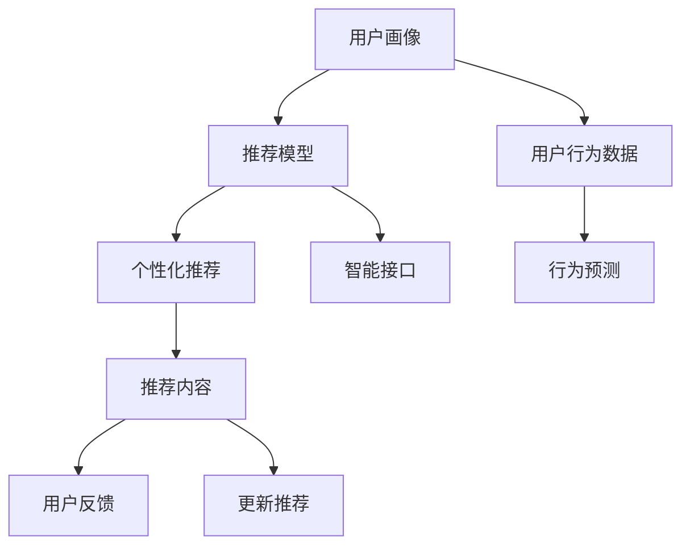

                 

# 个性化AI：适应不同用户需求的智能系统

> 关键词：个性化推荐,用户行为分析,深度学习,生成对抗网络,智能推荐系统

## 1. 背景介绍

### 1.1 问题由来
在数字化时代，信息爆炸和用户需求日益多样化的背景下，传统推荐系统已无法满足用户的个性化需求。随着深度学习和生成对抗网络(GAN)等前沿技术的兴起，个性化AI(AI for Personalization)技术应运而生，通过深度学习模型和先进算法，能够高效处理海量数据，从而提供更加精准的个性化推荐和智能服务。

个性化AI的核心思想是“一人一策”，即针对不同用户的需求和行为特征，提供差异化的产品和服务。这种个性化的方法不仅提升了用户满意度和忠诚度，也为商家带来了更高的商业价值。

### 1.2 问题核心关键点
个性化AI技术包括三个核心要素：
1. **用户画像**：构建全面的用户画像，捕捉用户的兴趣偏好、行为习惯、社交网络等多维信息。
2. **推荐模型**：基于深度学习技术，通过训练推荐模型，预测用户对不同产品的兴趣和偏好。
3. **智能接口**：利用智能算法和自然语言处理(NLP)技术，开发用户友好的交互界面，提供实时、个性化的推荐服务。

个性化AI的目的是在满足用户个性化需求的同时，最大化商家收益，实现用户和商家共赢。

## 2. 核心概念与联系

### 2.1 核心概念概述

为更好地理解个性化AI技术，本节将介绍几个密切相关的核心概念：

- **个性化推荐**：利用用户行为数据和推荐算法，为每个用户提供个性化的商品或内容推荐。
- **用户画像**：通过收集用户的多维数据，构建用户兴趣、行为、社交等特征的综合表示。
- **深度学习**：一类基于神经网络的机器学习算法，通过多层次的数据抽象，自动提取特征，提升模型预测准确率。
- **生成对抗网络(GAN)**：一种生成模型，通过两个神经网络相互博弈生成逼真的数据，可用于生成个性化推荐内容和模拟用户行为。
- **智能接口**：结合自然语言处理技术，开发直观、易用的交互界面，提升用户交互体验。

这些概念之间的逻辑关系可以通过以下Mermaid流程图来展示：



这个流程图展示了个性化AI的关键流程：
1. 通过用户行为数据和推荐模型，生成个性化推荐内容。
2. 智能接口提供用户交互界面，使用户可直观获取推荐内容。
3. 用户反馈用于更新推荐模型，提升推荐质量。

## 3. 核心算法原理 & 具体操作步骤
### 3.1 算法原理概述

个性化AI的核心算法原理主要包括：用户行为分析、推荐模型训练和智能接口开发。

- **用户行为分析**：通过记录和分析用户的浏览、购买、评价等行为数据，构建用户画像，捕捉其兴趣和偏好。
- **推荐模型训练**：基于用户画像，利用深度学习模型进行推荐，预测用户对不同产品的兴趣和偏好。
- **智能接口开发**：开发直观、易用的交互界面，提供实时、个性化的推荐服务，提升用户体验。

个性化AI的算法流程一般包括以下几个步骤：

1. 数据收集：通过日志、问卷、社交媒体等渠道收集用户行为数据。
2. 数据预处理：清洗和处理数据，提取有用的特征，形成用户画像。
3. 模型训练：使用深度学习算法训练推荐模型，学习用户行为模式。
4. 推荐生成：根据用户画像和推荐模型，生成个性化推荐。
5. 智能接口：开发智能推荐系统，提供个性化的交互界面和推荐服务。

### 3.2 算法步骤详解

个性化AI的具体操作步骤如下：

**Step 1: 数据收集**
- 通过日志记录用户的浏览、点击、购买、评价等行为数据。
- 通过问卷调查或社交媒体获取用户的兴趣偏好、社交网络等信息。
- 收集竞品推荐数据，分析竞品的推荐策略和效果。

**Step 2: 数据预处理**
- 清洗数据，去除无效或异常数据。
- 对用户行为数据进行特征工程，提取有意义的特征。
- 使用NLP技术对文本数据进行分词、词向量化等预处理。

**Step 3: 用户画像构建**
- 根据行为数据和社交网络信息，构建多维度的用户画像。
- 使用聚类算法对用户进行细分，形成不同的用户群体。
- 根据用户画像特征，预测用户的行为和偏好。

**Step 4: 推荐模型训练**
- 选择合适的深度学习模型，如协同过滤、神经网络等，进行推荐模型训练。
- 使用用户画像特征作为输入，训练模型预测用户对不同产品的兴趣。
- 在训练过程中进行交叉验证，评估模型的泛化能力。

**Step 5: 推荐内容生成**
- 根据用户画像和推荐模型，生成个性化推荐内容。
- 对推荐内容进行排序和筛选，选择最优的推荐结果。
- 考虑用户的个性化偏好和行为变化，动态调整推荐策略。

**Step 6: 智能接口开发**
- 开发直观、易用的交互界面，提供个性化推荐服务。
- 使用NLP技术实现与用户的自然语言交互。
- 提供多种推荐方式，如基于规则、基于机器学习等。

### 3.3 算法优缺点

个性化AI的算法具有以下优点：
1. 提升用户体验：通过个性化推荐，满足用户多样化的需求，提升用户满意度和忠诚度。
2. 提高商家收益：通过精准推荐，增加商品的曝光率和销售量，提升商家收益。
3. 高效处理数据：利用深度学习算法，处理海量数据，提升推荐效果。
4. 实时响应：通过智能接口，提供实时推荐服务，提升用户体验。

但个性化AI也存在一些局限性：
1. 数据隐私问题：收集和处理用户数据可能涉及隐私保护问题，需要确保数据的合法性和安全性。
2. 推荐偏差问题：如果数据质量不高或推荐算法有缺陷，可能导致推荐结果偏差，影响用户体验。
3. 计算资源消耗：深度学习模型训练和推荐内容生成需要大量计算资源，可能面临计算瓶颈。
4. 用户动态变化：用户行为和偏好可能随时间变化，需要持续更新推荐模型。

尽管存在这些局限性，但个性化AI在实际应用中仍取得了显著的效果，得到了广泛应用。

### 3.4 算法应用领域

个性化AI技术已被广泛应用于多个领域，包括：

- **电商推荐**：利用用户行为数据，推荐用户可能感兴趣的商品，提升购买率。
- **内容推荐**：通过分析用户阅读行为，推荐新闻、文章、视频等优质内容，增加用户停留时间。
- **广告投放**：通过个性化推荐，提高广告的点击率和转化率，优化广告效果。
- **社交媒体**：根据用户兴趣和行为，推荐好友和相关内容，增强社交互动。
- **在线教育**：根据学生学习行为和兴趣，推荐个性化课程和学习资源，提高学习效果。

除了上述这些典型场景外，个性化AI还被应用于金融、医疗、旅游等多个领域，为各行各业带来了深刻变革。

## 4. 数学模型和公式 & 详细讲解 & 举例说明

### 4.1 数学模型构建

为了更好地理解个性化AI的算法原理，本节将介绍几个关键的数学模型：

- **协同过滤模型**：一种基于用户行为数据的推荐算法，通过相似度计算推荐商品。
- **矩阵分解模型**：一种基于用户行为矩阵的推荐算法，通过矩阵分解提取用户和商品的隐含特征。
- **深度学习模型**：如循环神经网络(RNN)、卷积神经网络(CNN)等，通过多层数据抽象提升模型效果。
- **生成对抗网络(GAN)**：一种生成模型，通过两个神经网络相互博弈生成逼真的数据。

这些模型的构建和训练通常涉及矩阵运算和优化算法，具体的数学公式如下：

**协同过滤模型**：
$$
\hat{y}_{ui} = \frac{\sum_{j=1}^n r_{uj} r_{ij}}{\sqrt{\sum_{j=1}^n r_{uj}^2} \sqrt{\sum_{j=1}^n r_{ij}^2}}
$$

**矩阵分解模型**：
$$
P_{ui} = \sum_{j=1}^k u_j u_i^T v_j v_i^T
$$

**深度学习模型**：
$$
L_{CE} = -\frac{1}{N} \sum_{i=1}^N \sum_{j=1}^C y_{ij} \log\hat{y}_{ij}
$$

**GAN模型**：
$$
L_{D} = -\frac{1}{N} \sum_{i=1}^N (D(\mathbf{x}_i) + (1-D(\mathbf{x}_i)) \log(1-D(\mathbf{x}_i)))
$$
$$
L_{G} = -\frac{1}{N} \sum_{i=1}^N D(\mathbf{x}_i)
$$

### 4.2 公式推导过程

下面我们以协同过滤模型为例，推导推荐算法的基本原理：

设用户行为矩阵为 $R \in \mathbb{R}^{U \times N}$，其中 $U$ 为用户数量，$N$ 为商品数量。协同过滤模型利用用户之间的相似度，推断用户对未评分商品的兴趣，从而进行推荐。设 $u$ 为用户，$i$ 为商品，$r_{ui}$ 为 $u$ 对 $i$ 的评分。设 $r_{uj}$ 为 $u$ 对 $j$ 的评分，$r_{ij}$ 为 $i$ 对 $j$ 的评分。协同过滤模型的目标是通过用户之间的相似度，预测用户对未评分商品的评分。

首先，计算用户之间的相似度 $r_{uj} r_{ij}$。然后，使用归一化公式将相似度转换为推荐评分 $\hat{y}_{ui}$：

$$
\hat{y}_{ui} = \frac{\sum_{j=1}^n r_{uj} r_{ij}}{\sqrt{\sum_{j=1}^n r_{uj}^2} \sqrt{\sum_{j=1}^n r_{ij}^2}}
$$

其中 $\hat{y}_{ui}$ 表示用户 $u$ 对商品 $i$ 的预测评分，$r_{uj} r_{ij}$ 表示用户 $u$ 和用户 $j$ 对商品 $i$ 的评分相似度。

### 4.3 案例分析与讲解

我们可以以电商推荐为例，详细讲解协同过滤模型的应用：

**案例背景**：某电商平台希望提升用户的购买率和复购率，通过个性化推荐满足用户需求。

**数据收集**：收集用户的历史购买、浏览、评价等行为数据，构建用户画像。

**数据预处理**：对用户行为数据进行清洗和特征工程，提取用户兴趣和偏好特征。

**用户画像构建**：使用聚类算法对用户进行细分，形成不同的用户群体，构建多维度的用户画像。

**协同过滤模型训练**：选择协同过滤算法，使用用户画像和历史评分数据训练模型，预测用户对不同商品的兴趣。

**推荐内容生成**：根据用户画像和协同过滤模型，生成个性化推荐内容，排序并筛选出最优推荐结果。

**智能接口开发**：开发直观、易用的交互界面，提供个性化推荐服务，提升用户体验。

通过上述步骤，电商平台可以显著提升用户的购买率和复购率，增加商家收益，提升用户满意度。

## 5. 项目实践：代码实例和详细解释说明
### 5.1 开发环境搭建

在进行个性化AI项目开发前，我们需要准备好开发环境。以下是使用Python进行深度学习开发的环境配置流程：

1. 安装Anaconda：从官网下载并安装Anaconda，用于创建独立的Python环境。

2. 创建并激活虚拟环境：
```bash
conda create -n pytorch-env python=3.8 
conda activate pytorch-env
```

3. 安装PyTorch：根据CUDA版本，从官网获取对应的安装命令。例如：
```bash
conda install pytorch torchvision torchaudio cudatoolkit=11.1 -c pytorch -c conda-forge
```

4. 安装TensorFlow：
```bash
pip install tensorflow
```

5. 安装Keras：
```bash
pip install keras
```

6. 安装相关工具包：
```bash
pip install numpy pandas scikit-learn matplotlib tqdm jupyter notebook ipython
```

完成上述步骤后，即可在`pytorch-env`环境中开始个性化AI项目开发。

### 5.2 源代码详细实现

下面我们以电商推荐系统为例，给出使用TensorFlow和Keras进行协同过滤模型训练的PyTorch代码实现。

首先，定义数据预处理函数：

```python
import numpy as np
import pandas as pd
from sklearn.preprocessing import StandardScaler

def preprocess_data(data):
    # 将评分数据转换为数值化表示
    data['rating'] = data['rating'].astype('float')
    data['rating'] = np.log(data['rating'] + 1)

    # 将用户评分矩阵标准化
    scaler = StandardScaler()
    data[['rating']] = scaler.fit_transform(data[['rating']])
    return data
```

然后，定义协同过滤模型：

```python
from keras.layers import Input, Embedding, Dot, Dense, Flatten
from keras.models import Model

def collaborative_filtering_model(num_users, num_items, embedding_dim):
    # 定义输入层
    user_input = Input(shape=(num_items,))
    item_input = Input(shape=(num_users,))

    # 定义用户和商品嵌入层
    user_embedding = Embedding(num_users, embedding_dim)(item_input)
    item_embedding = Embedding(num_items, embedding_dim)(user_input)

    # 定义相似度计算层
    dot_product = Dot(axes=1)([user_embedding, item_embedding])

    # 定义输出层
    rating = Dense(1, activation='sigmoid')(dot_product)
    return Model(inputs=[user_input, item_input], outputs=rating)
```

接着，定义模型训练函数：

```python
from keras.optimizers import Adam
from sklearn.model_selection import train_test_split
from sklearn.metrics import mean_absolute_error

def train_model(data, num_users, num_items, embedding_dim, epochs):
    # 数据预处理
    data = preprocess_data(data)

    # 数据划分
    train_data, test_data = train_test_split(data, test_size=0.2, random_state=42)

    # 构建模型
    model = collaborative_filtering_model(num_users, num_items, embedding_dim)

    # 编译模型
    model.compile(optimizer=Adam(lr=0.001), loss='binary_crossentropy', metrics=['mae'])

    # 训练模型
    history = model.fit([train_data['user_id'].values, train_data['item_id'].values],
                       train_data['rating'].values,
                       epochs=epochs,
                       batch_size=32,
                       validation_data=([test_data['user_id'].values, test_data['item_id'].values],
                                        test_data['rating'].values))
    
    # 评估模型
    test_mae = mean_absolute_error(test_data['rating'].values, model.predict([test_data['user_id'].values, test_data['item_id'].values]))
    print(f"MAE on test set: {test_mae:.2f}")

    return model, test_mae
```

最后，启动训练流程：

```python
num_users = 5000
num_items = 1000
embedding_dim = 64
epochs = 10

# 加载数据
data = pd.read_csv('data.csv')

# 训练模型
model, test_mae = train_model(data, num_users, num_items, embedding_dim, epochs)

# 测试模型
test_data = pd.read_csv('test_data.csv')
predictions = model.predict([test_data['user_id'].values, test_data['item_id'].values])
```

以上就是使用TensorFlow和Keras进行协同过滤模型训练的完整代码实现。可以看到，通过简单的代码，即可实现协同过滤模型的训练和测试。

### 5.3 代码解读与分析

让我们再详细解读一下关键代码的实现细节：

**preprocess_data函数**：
- 将评分数据转换为数值化表示，使用对数函数进行归一化。
- 对用户评分矩阵进行标准化，使用标准差对特征进行归一化处理。

**collaborative_filtering_model函数**：
- 定义用户和商品嵌入层，将用户和商品ID映射为高维向量。
- 计算用户和商品的相似度，使用点积运算。
- 定义输出层，使用sigmoid激活函数进行评分预测。

**train_model函数**：
- 加载数据，进行数据预处理。
- 划分训练集和测试集。
- 构建协同过滤模型。
- 编译模型，设置优化器和损失函数。
- 训练模型，并记录训练过程中的指标。
- 评估模型，计算测试集的MAE。

**训练流程**：
- 定义用户和商品数量、嵌入维度和训练轮数。
- 加载数据。
- 训练模型，记录训练过程中的损失和MAE。
- 测试模型，计算测试集的MAE。

可以看到，通过TensorFlow和Keras，协同过滤模型的实现变得简洁高效。开发者可以将更多精力放在数据处理、模型改进等高层逻辑上，而不必过多关注底层的实现细节。

当然，工业级的系统实现还需考虑更多因素，如模型的保存和部署、超参数的自动搜索、更灵活的任务适配层等。但核心的协同过滤算法基本与此类似。

## 6. 实际应用场景
### 6.1 智能推荐系统

个性化AI技术已经在智能推荐系统中得到广泛应用。传统的推荐系统往往依赖单一的评分数据，无法捕捉用户行为的多样性和复杂性。个性化AI通过深度学习模型和多维数据融合，能够提供更加精准和多样化的推荐结果。

在电商推荐系统中，通过收集用户的浏览、购买、评价等行为数据，构建详细的用户画像，利用协同过滤、矩阵分解等算法，生成个性化推荐内容，提升用户满意度和购买率。

在内容推荐系统中，通过分析用户阅读历史和社交网络信息，生成个性化新闻、文章、视频等推荐内容，增加用户停留时间和互动频率。

### 6.2 智能广告投放

个性化AI在智能广告投放中也具有重要应用。通过收集用户行为数据，构建用户画像，利用深度学习模型预测用户的兴趣和偏好，生成个性化广告推荐，提高广告的点击率和转化率。

具体而言，个性化AI通过分析用户的搜索历史、浏览记录、社交媒体行为等数据，构建用户画像，预测用户对不同广告的兴趣和反馈，生成个性化广告推荐，优化广告投放策略。

### 6.3 智能客服系统

个性化AI技术还被应用于智能客服系统中。通过收集用户的历史对话记录和行为数据，构建用户画像，利用深度学习模型预测用户的意图和需求，生成个性化客服回复，提升用户交互体验和满意度。

在智能客服系统中，通过分析用户的历史对话记录、反馈信息等数据，构建详细的用户画像，利用生成对抗网络等技术，生成个性化的客服回复，提升用户满意度和服务质量。

### 6.4 未来应用展望

随着个性化AI技术的不断发展，未来将在更多领域得到应用，带来深刻变革：

1. **智慧医疗**：通过收集患者的历史诊疗记录和行为数据，构建个性化的医疗推荐系统，提供精准的诊疗方案和治疗建议。

2. **金融服务**：通过分析用户的交易行为和偏好，生成个性化的金融产品推荐，优化用户投资决策，提升用户满意度和收益。

3. **教育培训**：通过分析学生的学习行为和成绩数据，生成个性化的学习资源和课程推荐，提升学习效果和个性化教育体验。

4. **智能交通**：通过分析用户的出行行为和偏好，生成个性化的出行路线和交通方式推荐，提升出行效率和舒适度。

5. **智能家居**：通过分析用户的家居行为和偏好，生成个性化的家居控制和推荐，提升家居智能化和舒适度。

6. **智能制造**：通过分析工人的行为和偏好，生成个性化的生产任务和工具推荐，提升生产效率和质量。

7. **智能物流**：通过分析用户的订单行为和偏好，生成个性化的物流方案和配送建议，提升物流效率和用户体验。

未来，个性化AI将在更多领域得到广泛应用，带来深远的社会和经济影响。相信随着技术的不断进步，个性化AI将成为推动各行各业智能化升级的重要动力。

## 7. 工具和资源推荐
### 7.1 学习资源推荐

为了帮助开发者系统掌握个性化AI的理论基础和实践技巧，这里推荐一些优质的学习资源：

1. **《Python深度学习》系列书籍**：深度介绍深度学习算法和工具，包括TensorFlow、Keras等。

2. **《深度学习入门》课程**：由吴恩达教授主讲，系统介绍深度学习的基本概念和算法，适合初学者入门。

3. **Kaggle竞赛平台**：提供大量的深度学习竞赛数据集和案例，适合实践练习和提高。

4. **arXiv论文库**：收集全球最新的深度学习论文，了解前沿研究进展。

5. **GitHub开源项目**：提供大量的深度学习开源项目，包括推荐系统、广告投放等应用案例，适合学习和参考。

通过学习这些资源，相信你一定能够快速掌握个性化AI的精髓，并用于解决实际的NLP问题。

### 7.2 开发工具推荐

高效的开发离不开优秀的工具支持。以下是几款用于个性化AI开发的工具：

1. **TensorFlow**：由Google主导开发的深度学习框架，支持分布式计算和自动微分，适合复杂模型的训练和优化。

2. **PyTorch**：由Facebook主导开发的深度学习框架，支持动态图和静态图，适合快速原型开发和实验。

3. **Keras**：由Google主导开发的高级深度学习框架，简洁易用，适合快速开发和部署。

4. **Jupyter Notebook**：基于Web的交互式编程环境，支持多语言的代码编写和数据可视化，适合数据探索和模型调试。

5. **H5py**：用于读写HDF5格式数据文件的Python库，支持大规模数据的存储和处理。

6. **OpenCV**：用于计算机视觉任务的Python库，支持图像处理和特征提取，适合视频分析和智能推荐。

合理利用这些工具，可以显著提升个性化AI项目的开发效率，加速创新迭代的步伐。

### 7.3 相关论文推荐

个性化AI技术的发展源于学界的持续研究。以下是几篇奠基性的相关论文，推荐阅读：

1. **《The Netflix Prize Challenge》**：介绍Netflix推荐系统竞赛，通过协同过滤算法实现个性化推荐。

2. **《Matrix Factorization Techniques for Recommender Systems》**：介绍矩阵分解算法在推荐系统中的应用。

3. **《Deep Collaborative Filtering》**：介绍深度学习算法在推荐系统中的应用。

4. **《Generative Adversarial Nets》**：介绍生成对抗网络的基本原理和应用。

5. **《Personalized Top-N Recommendation in Multi-view Environments》**：介绍多视图推荐算法在个性化推荐中的应用。

6. **《Deep Neural Network Approach to Recommendation Modeling》**：介绍深度神经网络在推荐系统中的应用。

这些论文代表了个性化AI技术的发展脉络。通过学习这些前沿成果，可以帮助研究者把握学科前进方向，激发更多的创新灵感。

## 8. 总结：未来发展趋势与挑战
### 8.1 总结

本文对个性化AI技术进行了全面系统的介绍。首先阐述了个性化AI的背景和核心思想，明确了其在用户画像构建、推荐模型训练和智能接口开发三个核心环节的应用。其次，从原理到实践，详细讲解了个性化AI的数学模型和算法步骤，给出了个性化的电商推荐系统代码实例。同时，本文还广泛探讨了个性化AI在智能推荐、智能广告、智能客服等多个领域的应用前景，展示了个性化AI的广阔前景。

通过本文的系统梳理，可以看到，个性化AI技术在用户画像构建和推荐模型训练等核心环节上，已经有了较为成熟的解决方案。这些技术的深入应用，必将带来个性化推荐系统的跨越式发展，为用户提供更加精准和多样化的服务。

### 8.2 未来发展趋势

展望未来，个性化AI技术将呈现以下几个发展趋势：

1. **数据融合与多模态融合**：未来，个性化AI将融合多模态数据（如文本、图像、音频等），通过联合建模提升推荐效果。

2. **自适应学习与动态调整**：个性化AI将通过自适应学习算法和动态调整机制，持续优化推荐策略，适应用户需求的变化。

3. **模型压缩与资源优化**：未来，个性化AI将更加注重模型压缩和资源优化，提升推荐系统的实时性和效率。

4. **跨领域应用与行业融合**：个性化AI将进一步拓展到医疗、金融、教育等多个领域，为各行各业带来深远影响。

5. **用户隐私保护**：随着数据隐私保护意识的提升，个性化AI将更加注重用户隐私保护，确保数据合法和安全。

6. **模型解释性与透明度**：个性化AI将更加注重模型的解释性和透明度，提升用户信任和满意度。

### 8.3 面临的挑战

尽管个性化AI技术已经取得了显著进展，但在迈向更加智能化、普适化应用的过程中，仍面临诸多挑战：

1. **数据隐私与安全性**：个性化AI需要处理大量用户数据，可能涉及隐私保护和数据安全问题，需要建立严格的隐私保护机制。

2. **推荐偏差与公平性**：如果数据质量和推荐算法有缺陷，可能导致推荐结果偏差，影响用户体验和公平性。

3. **计算资源消耗**：个性化AI需要处理海量数据和复杂模型，可能面临计算瓶颈，需要优化计算效率和资源利用。

4. **用户动态变化**：用户行为和偏好可能随时间变化，需要持续更新推荐模型，确保推荐内容的时效性。

5. **算法复杂性与可解释性**：深度学习模型复杂度高，缺乏可解释性，难以进行用户干预和调试。

6. **跨领域应用挑战**：个性化AI在跨领域应用时，需要适应不同领域的数据特点和用户需求，面临较大的适配挑战。

尽管存在这些挑战，但随着技术的不断进步和应用实践的积累，个性化AI必将在更多领域得到应用，为社会带来深远影响。

### 8.4 研究展望

面对个性化AI面临的挑战，未来的研究需要在以下几个方面寻求新的突破：

1. **多模态融合与跨领域应用**：研究如何将多模态数据融合到推荐模型中，提升模型的泛化能力和推荐效果。

2. **自适应学习与动态调整**：研究如何通过自适应学习算法和动态调整机制，持续优化推荐策略，适应用户需求的变化。

3. **模型压缩与资源优化**：研究如何通过模型压缩和资源优化，提升推荐系统的实时性和效率。

4. **用户隐私保护与数据安全**：研究如何在个性化AI中保护用户隐私和数据安全，确保数据的合法性和安全性。

5. **算法解释性与透明度**：研究如何通过模型解释性和透明度，提升用户信任和满意度。

6. **推荐偏差与公平性**：研究如何通过公平性算法和数据预处理，减少推荐偏差，提升推荐的公平性和用户满意度。

7. **跨领域应用与行业融合**：研究如何在不同领域中应用个性化AI，提升各行各业智能化水平，推动产业升级。

通过这些研究方向的探索，个性化AI必将在未来取得更大的突破，为各行各业带来深远变革。面向未来，个性化AI技术还需要与其他人工智能技术进行更深入的融合，如知识表示、因果推理、强化学习等，多路径协同发力，共同推动人工智能技术的发展。

## 9. 附录：常见问题与解答

**Q1：如何构建高质量的用户画像？**

A: 构建高质量的用户画像需要收集和处理多维度的用户数据，包括浏览历史、购买记录、评价信息、社交网络等。这些数据可以来源于多个渠道，如日志、问卷、社交媒体等。通过数据预处理和特征工程，提取有用的用户特征，如兴趣、偏好、行为等。同时，通过聚类、分类等算法，将用户进行细分，形成不同的用户群体，构建多维度的用户画像。

**Q2：协同过滤模型有哪些缺点？**

A: 协同过滤模型有以下缺点：
1. 数据稀疏性问题：用户-商品评分矩阵可能存在大量缺失值，影响推荐效果。
2. 冷启动问题：新用户或商品可能没有足够的评分数据，难以进行推荐。
3. 隐式反馈问题：用户行为数据往往存在隐式反馈，难以直接转化为评分数据。

**Q3：深度学习模型如何处理冷启动问题？**

A: 深度学习模型可以通过以下方法处理冷启动问题：
1. 利用用户和商品的隐含特征，进行推荐预测。
2. 利用生成对抗网络等技术，生成个性化的推荐内容，提升冷启动用户的推荐效果。
3. 结合外部数据，如用户的人口统计信息、社交网络等，提升推荐效果。

**Q4：推荐系统的实时性要求如何？**

A: 推荐系统的实时性要求非常高，通常需要在几毫秒内完成推荐计算。为提高实时性，可以采用以下方法：
1. 优化模型计算图，减少计算量。
2. 使用缓存和预计算技术，加速推荐计算。
3. 分布式计算和多线程处理，提升计算效率。

**Q5：如何确保推荐系统的公平性？**

A: 确保推荐系统的公平性需要从多个方面进行考虑：
1. 数据预处理：清洗和处理数据，避免偏见和歧视。
2. 算法设计：使用公平性算法和评价指标，避免推荐偏差。
3. 模型评估：通过A/B测试和用户反馈，评估推荐系统的公平性。

**Q6：如何优化推荐系统的性能？**

A: 优化推荐系统的性能需要从多个方面进行考虑：
1. 模型选择：选择合适的推荐算法，提升推荐效果。
2. 特征工程：优化特征提取和处理，提升特征质量。
3. 数据预处理：清洗和处理数据，避免数据噪音。
4. 模型训练：优化模型参数和超参数，提升模型效果。
5. 模型压缩：使用模型压缩和优化技术，提升模型实时性和效率。

通过优化这些方面，可以显著提升推荐系统的性能，提供更精准、更个性化的推荐服务。

---

作者：禅与计算机程序设计艺术 / Zen and the Art of Computer Programming

